# Sales Order Management

<cite>
**Referenced Files in This Document**
- [SalesOrder.php](file://app/Models/SalesOrder.php)
- [SalesOrderItem.php](file://app/Models/SalesOrderItem.php)
- [SalesOrderController.php](file://app/Http/Controllers/SalesOrderController.php)
- [TaxCalculationService.php](file://app/Services/TaxCalculationService.php)
- [CurrencyService.php](file://app/Services/CurrencyService.php)
- [GlPostingService.php](file://app/Services/GlPostingService.php)
- [Customer.php](file://app/Models/Customer.php)
- [Invoice.php](file://app/Models/Invoice.php)
- [DeliveryOrder.php](file://app/Models/DeliveryOrder.php)
- [TaxRate.php](file://app/Models/TaxRate.php)
- [TransactionStateMachine.php](file://app/Services/TransactionStateMachine.php)
- [ApiOrderController.php](file://app/Http/Controllers/Api/ApiOrderController.php)
- [create.blade.php](file://resources/views/sales/create.blade.php)
- [2026_01_01_000002_create_sales_tables.php](file://database/migrations/2026_01_01_000002_create_sales_tables.php)
- [openapi.json](file://public/api-docs/openapi.json)
</cite>

## Table of Contents
1. [Introduction](#introduction)
2. [Project Structure](#project-structure)
3. [Core Components](#core-components)
4. [Architecture Overview](#architecture-overview)
5. [Detailed Component Analysis](#detailed-component-analysis)
6. [Dependency Analysis](#dependency-analysis)
7. [Performance Considerations](#performance-considerations)
8. [Troubleshooting Guide](#troubleshooting-guide)
9. [Conclusion](#conclusion)
10. [Appendices](#appendices)

## Introduction
This document provides comprehensive documentation for the Sales Order Management module within the qalcuityERP system. It covers the complete lifecycle of a sales order from creation to completion, including customer validation, product availability checks, pricing and tax calculations, inventory deduction, status management, multi-currency support, credit limit validation, integration with accounting systems, invoice generation, delivery coordination, and reporting capabilities. Practical examples and troubleshooting guidance are included to assist both developers and operators in configuring and maintaining the system effectively.

## Project Structure
The Sales Order Management module is implemented across models, controllers, services, and views. The primary components include:
- Models: SalesOrder, SalesOrderItem, Customer, Invoice, DeliveryOrder, TaxRate
- Controllers: SalesOrderController (web), ApiOrderController (API)
- Services: TaxCalculationService, CurrencyService, GlPostingService, TransactionStateMachine
- Views: Sales order creation form (Blade)
- Migrations: Sales-related database schema
- API Documentation: OpenAPI specification for order endpoints

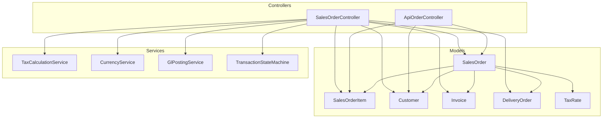

**Diagram sources**
- [SalesOrderController.php:23-436](file://app/Http/Controllers/SalesOrderController.php#L23-L436)
- [ApiOrderController.php:13-217](file://app/Http/Controllers/Api/ApiOrderController.php#L13-L217)
- [SalesOrder.php:13-122](file://app/Models/SalesOrder.php#L13-L122)
- [SalesOrderItem.php:8-19](file://app/Models/SalesOrderItem.php#L8-L19)
- [Customer.php:14-90](file://app/Models/Customer.php#L14-L90)
- [Invoice.php:13-182](file://app/Models/Invoice.php#L13-L182)
- [DeliveryOrder.php:12-51](file://app/Models/DeliveryOrder.php#L12-L51)
- [TaxRate.php:9-25](file://app/Models/TaxRate.php#L9-L25)
- [TaxCalculationService.php:29-306](file://app/Services/TaxCalculationService.php#L29-L306)
- [CurrencyService.php:14-187](file://app/Services/CurrencyService.php#L14-L187)
- [GlPostingService.php:26-124](file://app/Services/GlPostingService.php#L26-L124)
- [TransactionStateMachine.php:31-313](file://app/Services/TransactionStateMachine.php#L31-L313)

**Section sources**
- [SalesOrderController.php:23-436](file://app/Http/Controllers/SalesOrderController.php#L23-L436)
- [ApiOrderController.php:13-217](file://app/Http/Controllers/Api/ApiOrderController.php#L13-L217)
- [SalesOrder.php:13-122](file://app/Models/SalesOrder.php#L13-L122)
- [SalesOrderItem.php:8-19](file://app/Models/SalesOrderItem.php#L8-L19)
- [Customer.php:14-90](file://app/Models/Customer.php#L14-L90)
- [Invoice.php:13-182](file://app/Models/Invoice.php#L13-L182)
- [DeliveryOrder.php:12-51](file://app/Models/DeliveryOrder.php#L12-L51)
- [TaxRate.php:9-25](file://app/Models/TaxRate.php#L9-L25)
- [TaxCalculationService.php:29-306](file://app/Services/TaxCalculationService.php#L29-L306)
- [CurrencyService.php:14-187](file://app/Services/CurrencyService.php#L14-L187)
- [GlPostingService.php:26-124](file://app/Services/GlPostingService.php#L26-L124)
- [TransactionStateMachine.php:31-313](file://app/Services/TransactionStateMachine.php#L31-L313)
- [2026_01_01_000002_create_sales_tables.php:53-82](file://database/migrations/2026_01_01_000002_create_sales_tables.php#L53-L82)
- [openapi.json:403-515](file://public/api-docs/openapi.json#L403-L515)

## Core Components
This section outlines the core components involved in the sales order lifecycle and their responsibilities.

- SalesOrder: Central entity representing a sales order with fields for customer, items, totals, taxes, currency, and status. Includes relationships to customer, items, invoices, delivery orders, and returns.
- SalesOrderItem: Line items within a sales order, linking to product and sales order with quantity, price, discount, and total.
- SalesOrderController: Handles web-based sales order operations including creation, status updates, invoice generation, and deletion. Implements validation, inventory deduction, tax calculation, multi-currency conversion, and GL posting.
- ApiOrderController: Provides API endpoints for listing, retrieving, creating, and updating sales order statuses with validation and webhook dispatch.
- TaxCalculationService: Computes taxes including PPN (VAT), PPh 23 (withholding), and supports tax-inclusive pricing and multiple tax rates.
- CurrencyService: Manages currency conversions against IDR, active currency lists, rate staleness detection, and caching.
- GlPostingService: Posts journal entries for sales orders, invoices, payments, and related transactions with chart of accounts mapping.
- TransactionStateMachine: Enforces strict state transitions for sales orders and other transactions, ensuring immutability after posting.
- Customer: Maintains customer details, credit limits, outstanding balances, and credit limit validation helpers.
- Invoice: Represents invoices generated from sales orders, with payment status tracking and aging buckets.
- DeliveryOrder: Tracks delivery logistics linked to sales orders.
- TaxRate: Defines tax types (PPN, PPh 21, PPh 23, etc.) with rates and flags for withholding and activity.

**Section sources**
- [SalesOrder.php:13-122](file://app/Models/SalesOrder.php#L13-L122)
- [SalesOrderItem.php:8-19](file://app/Models/SalesOrderItem.php#L8-L19)
- [SalesOrderController.php:88-276](file://app/Http/Controllers/SalesOrderController.php#L88-L276)
- [ApiOrderController.php:90-168](file://app/Http/Controllers/Api/ApiOrderController.php#L90-L168)
- [TaxCalculationService.php:40-126](file://app/Services/TaxCalculationService.php#L40-L126)
- [CurrencyService.php:53-68](file://app/Services/CurrencyService.php#L53-L68)
- [GlPostingService.php:84-124](file://app/Services/GlPostingService.php#L84-L124)
- [TransactionStateMachine.php:185-217](file://app/Services/TransactionStateMachine.php#L185-L217)
- [Customer.php:77-89](file://app/Models/Customer.php#L77-L89)
- [Invoice.php:162-175](file://app/Models/Invoice.php#L162-L175)
- [DeliveryOrder.php:24-50](file://app/Models/DeliveryOrder.php#L24-L50)
- [TaxRate.php:15-24](file://app/Models/TaxRate.php#L15-L24)

## Architecture Overview
The Sales Order Management system follows a layered architecture:
- Presentation Layer: Web forms (Blade) and API endpoints
- Application Layer: Controllers orchestrating business logic
- Domain Layer: Models encapsulating domain entities and relationships
- Services Layer: Tax calculation, currency conversion, GL posting, and state machine enforcement
- Persistence Layer: Eloquent models mapped to database tables via migrations

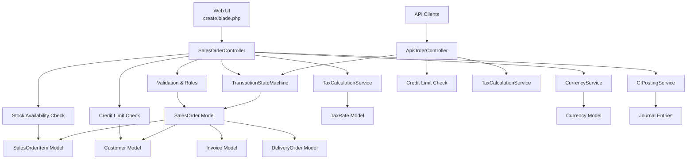

**Diagram sources**
- [create.blade.php:1-377](file://resources/views/sales/create.blade.php#L1-L377)
- [SalesOrderController.php:88-276](file://app/Http/Controllers/SalesOrderController.php#L88-L276)
- [ApiOrderController.php:90-168](file://app/Http/Controllers/Api/ApiOrderController.php#L90-L168)
- [TaxCalculationService.php:40-126](file://app/Services/TaxCalculationService.php#L40-L126)
- [CurrencyService.php:53-68](file://app/Services/CurrencyService.php#L53-L68)
- [GlPostingService.php:84-124](file://app/Services/GlPostingService.php#L84-L124)
- [TransactionStateMachine.php:185-217](file://app/Services/TransactionStateMachine.php#L185-L217)
- [SalesOrder.php:13-122](file://app/Models/SalesOrder.php#L13-L122)
- [SalesOrderItem.php:8-19](file://app/Models/SalesOrderItem.php#L8-L19)
- [Customer.php:77-89](file://app/Models/Customer.php#L77-L89)
- [Invoice.php:13-182](file://app/Models/Invoice.php#L13-L182)
- [DeliveryOrder.php:12-51](file://app/Models/DeliveryOrder.php#L12-L51)
- [TaxRate.php:9-25](file://app/Models/TaxRate.php#L9-L25)

## Detailed Component Analysis

### Sales Order Creation Workflow
This workflow covers customer validation, product availability checks, pricing and tax computation, inventory deduction, multi-currency handling, and GL posting.

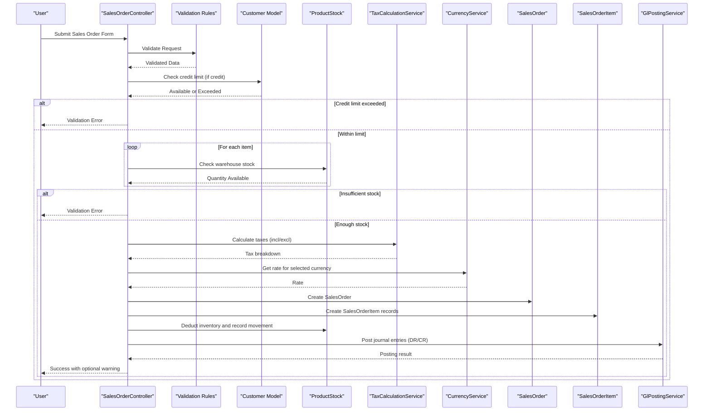

**Diagram sources**
- [SalesOrderController.php:88-276](file://app/Http/Controllers/SalesOrderController.php#L88-L276)
- [Customer.php:77-89](file://app/Models/Customer.php#L77-L89)
- [TaxCalculationService.php:40-126](file://app/Services/TaxCalculationService.php#L40-L126)
- [CurrencyService.php:53-57](file://app/Services/CurrencyService.php#L53-L57)
- [GlPostingService.php:84-124](file://app/Services/GlPostingService.php#L84-L124)

**Section sources**
- [SalesOrderController.php:88-276](file://app/Http/Controllers/SalesOrderController.php#L88-L276)
- [TaxCalculationService.php:40-126](file://app/Services/TaxCalculationService.php#L40-L126)
- [CurrencyService.php:53-57](file://app/Services/CurrencyService.php#L53-L57)
- [GlPostingService.php:84-124](file://app/Services/GlPostingService.php#L84-L124)
- [Customer.php:77-89](file://app/Models/Customer.php#L77-L89)

### Status Management and Validation Rules
Status transitions are strictly enforced to maintain data integrity and compliance. The controller validates transitions and enforces additional business rules (e.g., cancellation constraints).

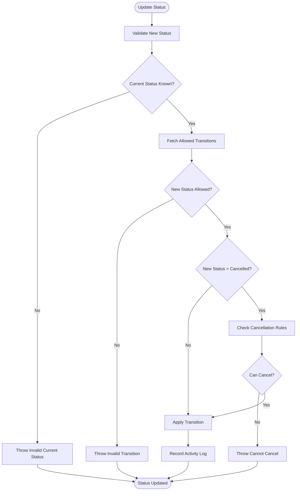

**Diagram sources**
- [SalesOrderController.php:285-384](file://app/Http/Controllers/SalesOrderController.php#L285-L384)

**Section sources**
- [SalesOrderController.php:285-384](file://app/Http/Controllers/SalesOrderController.php#L285-L384)
- [TransactionStateMachine.php:185-217](file://app/Services/TransactionStateMachine.php#L185-L217)

### Multi-Currency Support and Exchange Rates
Multi-currency support is implemented by storing currency code and rate on the sales order and converting amounts to IDR for GL posting. CurrencyService manages rate retrieval, caching, and staleness warnings.

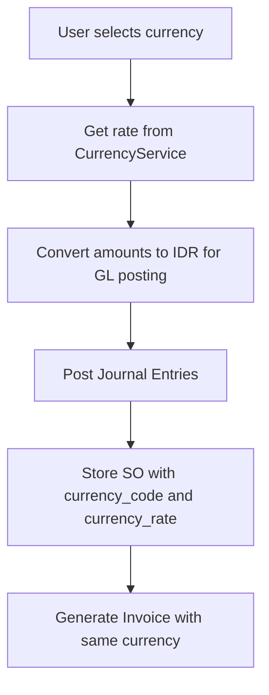

**Diagram sources**
- [SalesOrderController.php:186-212](file://app/Http/Controllers/SalesOrderController.php#L186-L212)
- [CurrencyService.php:53-57](file://app/Services/CurrencyService.php#L53-L57)
- [GlPostingService.php:242-257](file://app/Services/GlPostingService.php#L242-L257)

**Section sources**
- [SalesOrderController.php:186-212](file://app/Http/Controllers/SalesOrderController.php#L186-L212)
- [CurrencyService.php:53-57](file://app/Services/CurrencyService.php#L53-L57)
- [GlPostingService.php:242-257](file://app/Services/GlPostingService.php#L242-L257)

### Tax Handling and Withholding Taxes
The system supports multiple tax types and withholding taxes. TaxCalculationService computes PPN, PPh 23, and other taxes, handles tax-inclusive pricing, and rounds amounts according to accounting rules.

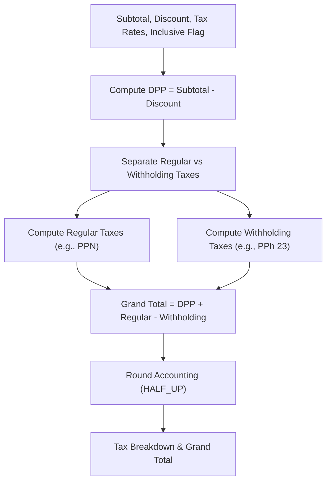

**Diagram sources**
- [TaxCalculationService.php:40-126](file://app/Services/TaxCalculationService.php#L40-L126)

**Section sources**
- [TaxCalculationService.php:40-126](file://app/Services/TaxCalculationService.php#L40-L126)
- [TaxRate.php:15-24](file://app/Models/TaxRate.php#L15-L24)

### Inventory Deduction and Stock Movements
Upon successful order creation, inventory is deducted from the selected warehouse, and stock movements are recorded for auditability.

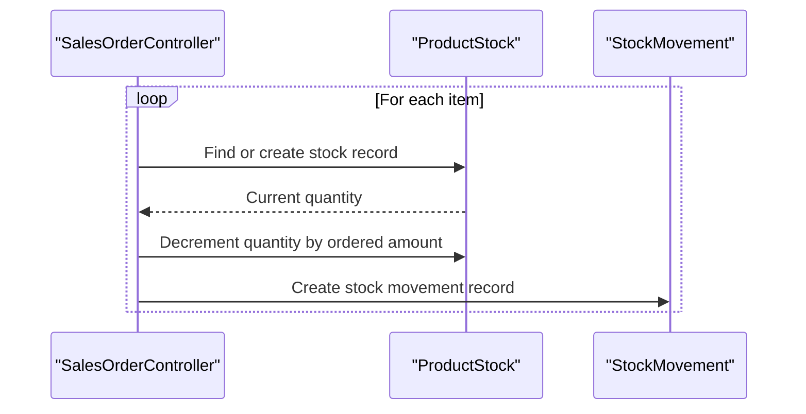

**Diagram sources**
- [SalesOrderController.php:217-238](file://app/Http/Controllers/SalesOrderController.php#L217-L238)

**Section sources**
- [SalesOrderController.php:217-238](file://app/Http/Controllers/SalesOrderController.php#L217-L238)

### Invoice Generation from Sales Orders
An invoice can be generated from a sales order, inheriting amounts, tax details, due dates, and currency settings.

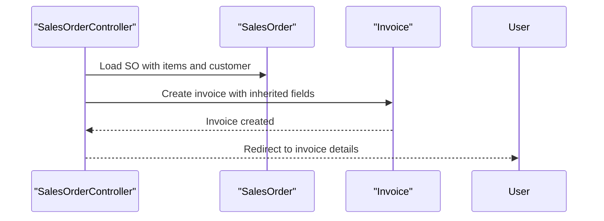

**Diagram sources**
- [SalesOrderController.php:386-422](file://app/Http/Controllers/SalesOrderController.php#L386-L422)

**Section sources**
- [SalesOrderController.php:386-422](file://app/Http/Controllers/SalesOrderController.php#L386-L422)
- [Invoice.php:13-46](file://app/Models/Invoice.php#L13-L46)

### Delivery Coordination
Delivery orders are associated with sales orders and track shipping status, courier, and tracking numbers.

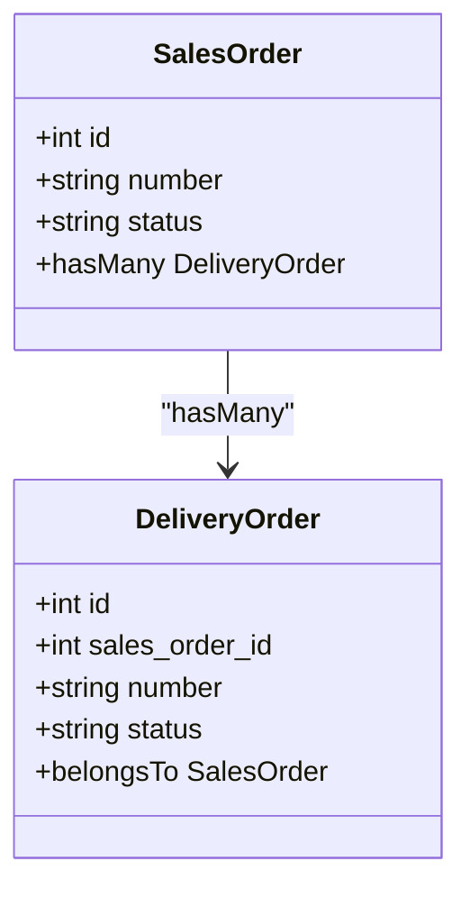

**Diagram sources**
- [SalesOrder.php:114-116](file://app/Models/SalesOrder.php#L114-L116)
- [DeliveryOrder.php:16-28](file://app/Models/DeliveryOrder.php#L16-L28)

**Section sources**
- [SalesOrder.php:114-116](file://app/Models/SalesOrder.php#L114-L116)
- [DeliveryOrder.php:16-28](file://app/Models/DeliveryOrder.php#L16-L28)

### API Integration and Webhooks
The API controller validates credit limits, enforces status transitions, and dispatches webhooks upon order creation and status changes.

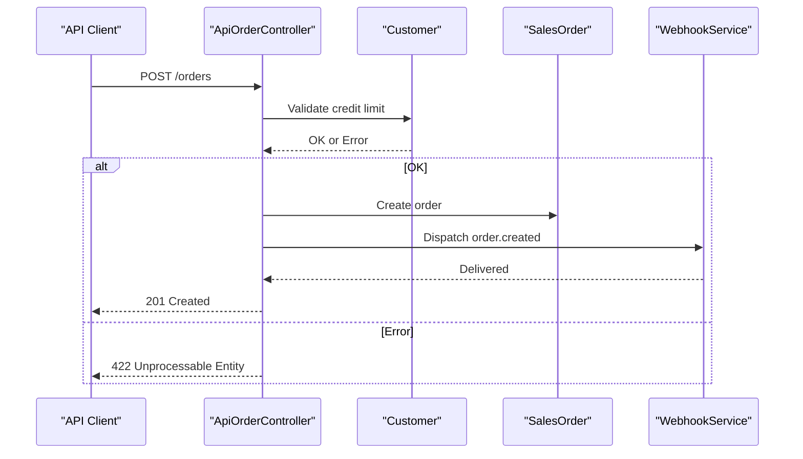

**Diagram sources**
- [ApiOrderController.php:90-148](file://app/Http/Controllers/Api/ApiOrderController.php#L90-L148)
- [Customer.php:77-89](file://app/Models/Customer.php#L77-L89)

**Section sources**
- [ApiOrderController.php:90-148](file://app/Http/Controllers/Api/ApiOrderController.php#L90-L148)
- [openapi.json:403-515](file://public/api-docs/openapi.json#L403-L515)

## Dependency Analysis
The following diagram illustrates key dependencies among components:

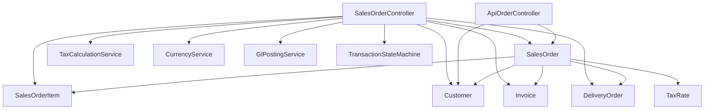

**Diagram sources**
- [SalesOrderController.php:11-21](file://app/Http/Controllers/SalesOrderController.php#L11-L21)
- [ApiOrderController.php:5-11](file://app/Http/Controllers/Api/ApiOrderController.php#L5-L11)
- [SalesOrder.php:106-121](file://app/Models/SalesOrder.php#L106-L121)
- [SalesOrderItem.php:17-18](file://app/Models/SalesOrderItem.php#L17-L18)
- [Customer.php:44-51](file://app/Models/Customer.php#L44-L51)
- [Invoice.php:116-139](file://app/Models/Invoice.php#L116-L139)
- [DeliveryOrder.php:24-28](file://app/Models/DeliveryOrder.php#L24-L28)
- [TaxRate.php:9-13](file://app/Models/TaxRate.php#L9-L13)

**Section sources**
- [SalesOrderController.php:11-21](file://app/Http/Controllers/SalesOrderController.php#L11-L21)
- [ApiOrderController.php:5-11](file://app/Http/Controllers/Api/ApiOrderController.php#L5-L11)
- [SalesOrder.php:106-121](file://app/Models/SalesOrder.php#L106-L121)

## Performance Considerations
- Use database transactions during order creation to ensure atomicity of inventory deduction, item creation, and GL posting.
- Leverage caching for currency rates to minimize repeated lookups.
- Batch GL posting operations where feasible to reduce database overhead.
- Index frequently queried fields (tenant_id, status, date) to improve listing and filtering performance.
- Avoid unnecessary model hydration when listing sales orders; select only required columns.

## Troubleshooting Guide
Common issues and resolutions:
- Credit limit exceeded: Verify customer’s outstanding balance and credit limit; adjust order amount or customer limit accordingly.
- Insufficient stock: Confirm warehouse stock levels and product variants; reconcile discrepancies.
- Invalid status transition: Review allowed transitions and ensure prior steps are completed (e.g., cannot cancel after shipment).
- Currency rate staleness: Check currency service logs for stale rate warnings and refresh rates.
- GL posting failures: Review GL posting results and warnings; ensure chart of account mappings are correct.

**Section sources**
- [SalesOrderController.php:117-127](file://app/Http/Controllers/SalesOrderController.php#L117-L127)
- [SalesOrderController.php:129-141](file://app/Http/Controllers/SalesOrderController.php#L129-L141)
- [SalesOrderController.php:293-384](file://app/Http/Controllers/SalesOrderController.php#L293-L384)
- [CurrencyService.php:161-186](file://app/Services/CurrencyService.php#L161-L186)
- [GlPostingService.php:114-123](file://app/Services/GlPostingService.php#L114-L123)

## Conclusion
The Sales Order Management module provides a robust, compliant, and extensible solution for managing the complete sales order lifecycle. It integrates validation, inventory control, precise tax calculations, multi-currency support, and automatic GL posting while enforcing strict status transitions and auditability. The modular design and clear separation of concerns facilitate maintainability and future enhancements.

## Appendices

### Practical Examples
- Creating a sales order with multiple items, applying global discount, selecting tax rates, and choosing a currency different from IDR.
- Generating an invoice from an existing sales order and verifying payment status updates.
- Updating sales order status through the web interface or API with proper validation and webhook notifications.

### Common Use Cases
- New customer onboarding with credit limit configuration and initial orders.
- Multi-location warehouses with centralized inventory management and local delivery coordination.
- Integration with external systems via API endpoints and webhooks for order synchronization.

### API Endpoints (Reference)
- GET /orders: List sales orders with filters
- POST /orders: Create a sales order
- GET /orders/{id}: Retrieve a sales order
- PATCH /orders/{id}/status: Update sales order status

**Section sources**
- [openapi.json:403-542](file://public/api-docs/openapi.json#L403-L542)