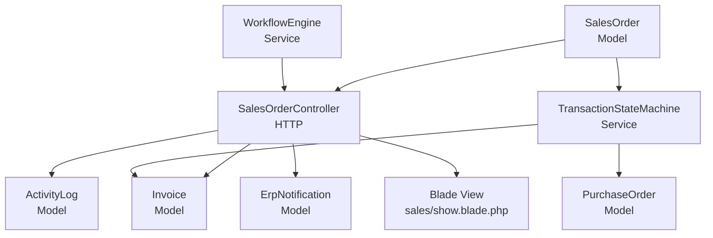
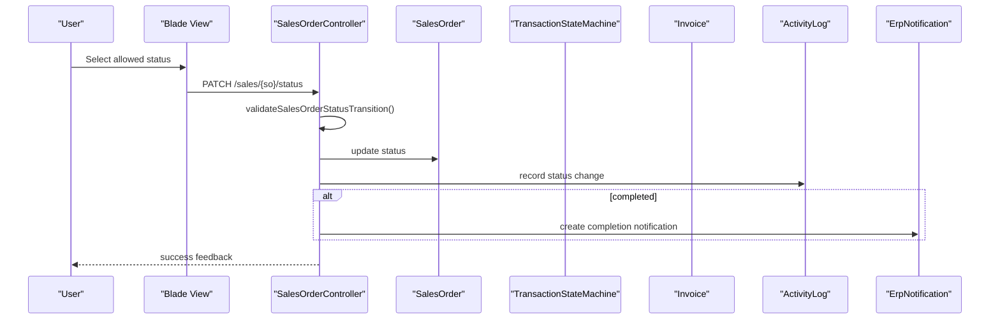
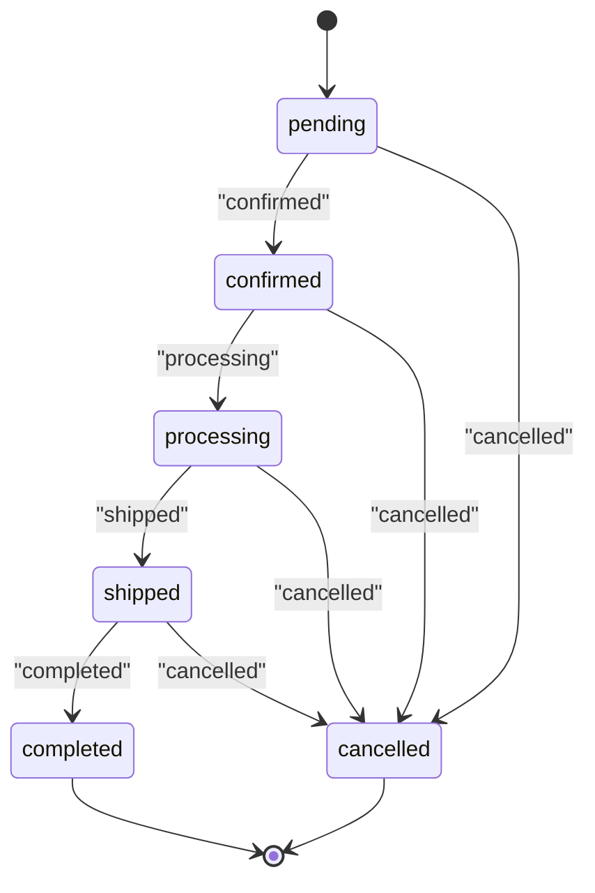
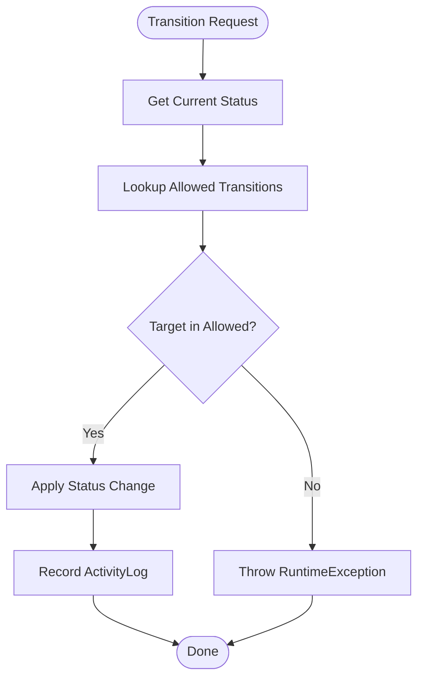
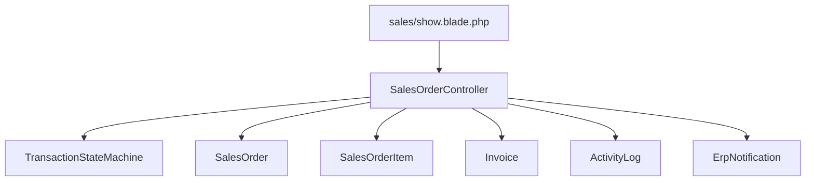

# Status Management & Workflow

<cite>
**Referenced Files in This Document**
- [SalesOrder.php](file://app/Models/SalesOrder.php)
- [SalesOrderItem.php](file://app/Models/SalesOrderItem.php)
- [SalesOrderController.php](file://app/Http/Controllers/SalesOrderController.php)
- [TransactionStateMachine.php](file://app/Services/TransactionStateMachine.php)
- [WorkflowEngine.php](file://app/Services/WorkflowEngine.php)
- [show.blade.php](file://resources/views/sales/show.blade.php)
- [SalesTools.php](file://app/Services/ERP/SalesTools.php)
- [OrderService.php](file://app/Services/OrderService.php)
- [ActivityLog.php](file://app/Models/ActivityLog.php)
- [ErpNotification.php](file://app/Models/ErpNotification.php)
- [Invoice.php](file://app/Models/Invoice.php)
- [PurchaseOrder.php](file://app/Models/PurchaseOrder.php)
- [SalesOrder.php (controller)](file://app/Http/Controllers/SalesOrderController.php)
</cite>

## Table of Contents
1. [Introduction](#introduction)
2. [Project Structure](#project-structure)
3. [Core Components](#core-components)
4. [Architecture Overview](#architecture-overview)
5. [Detailed Component Analysis](#detailed-component-analysis)
6. [Dependency Analysis](#dependency-analysis)
7. [Performance Considerations](#performance-considerations)
8. [Troubleshooting Guide](#troubleshooting-guide)
9. [Conclusion](#conclusion)

## Introduction
This document explains the sales order status management and workflow automation system. It covers the complete status transition matrix, validation rules, terminal state handling, transaction state machine implementation, activity logging, notifications, integrations with inventory and accounting, and customer-facing controls. It also documents valid transitions, restrictions on terminal states, and error handling for invalid transitions.

## Project Structure
The sales order lifecycle spans models, controller actions, state machine services, workflow engine, and UI rendering. The primary components are:
- SalesOrder and SalesOrderItem models define the domain and attributes.
- SalesOrderController orchestrates creation, updates, invoice generation, and deletion.
- TransactionStateMachine enforces strict state transitions for transactions including SalesOrder.
- WorkflowEngine supports event-driven automation and scheduling.
- UI renders allowed transitions and displays current status.
- ActivityLog and ErpNotification capture changes and notify stakeholders.

**Diagram sources**
- [SalesOrder.php:13-122](file://app/Models/SalesOrder.php#L13-L122)
- [SalesOrderController.php:23-436](file://app/Http/Controllers/SalesOrderController.php#L23-L436)
- [TransactionStateMachine.php:31-314](file://app/Services/TransactionStateMachine.php#L31-L314)
- [show.blade.php:28-68](file://resources/views/sales/show.blade.php#L28-L68)
- [WorkflowEngine.php:9-162](file://app/Services/WorkflowEngine.php#L9-L162)

**Section sources**
- [SalesOrder.php:13-122](file://app/Models/SalesOrder.php#L13-L122)
- [SalesOrderController.php:23-436](file://app/Http/Controllers/SalesOrderController.php#L23-L436)
- [TransactionStateMachine.php:31-314](file://app/Services/TransactionStateMachine.php#L31-L314)
- [show.blade.php:28-68](file://resources/views/sales/show.blade.php#L28-L68)
- [WorkflowEngine.php:9-162](file://app/Services/WorkflowEngine.php#L9-L162)

## Core Components
- SalesOrder model encapsulates order metadata, financials, and status. It includes relationships to items, invoices, delivery orders, and returns.
- SalesOrderController handles CRUD operations, validates stock and credit limits, posts to GL, and manages status updates with strict validation.
- TransactionStateMachine enforces allowed transitions for SalesOrder and other transactions, records activity logs, and prevents illegal edits/postings.
- WorkflowEngine registers event triggers and schedules recurring workflows.
- UI restricts visible transitions to valid ones and allows status updates for non-terminal states.

Key responsibilities:
- Enforce status transition matrix for SalesOrder.
- Prevent invalid transitions and terminal state mutations.
- Log changes and notify stakeholders upon completion.
- Integrate with inventory reductions and accounting posting.

**Section sources**
- [SalesOrder.php:13-122](file://app/Models/SalesOrder.php#L13-L122)
- [SalesOrderController.php:285-384](file://app/Http/Controllers/SalesOrderController.php#L285-L384)
- [TransactionStateMachine.php:178-217](file://app/Services/TransactionStateMachine.php#L178-L217)
- [show.blade.php:46-65](file://resources/views/sales/show.blade.php#L46-L65)

## Architecture Overview
The system separates concerns across models, controllers, services, and views. The controller validates inputs, checks inventory and credit limits, creates the order, reduces stock, posts to GL, and fires webhooks. Status updates are validated against a strict transition matrix. Activity logs and notifications record and inform stakeholders.

**Diagram sources**
- [show.blade.php:40-65](file://resources/views/sales/show.blade.php#L40-L65)
- [SalesOrderController.php:285-318](file://app/Http/Controllers/SalesOrderController.php#L285-L318)
- [ActivityLog.php](file://app/Models/ActivityLog.php)
- [ErpNotification.php](file://app/Models/ErpNotification.php)

**Section sources**
- [SalesOrderController.php:285-318](file://app/Http/Controllers/SalesOrderController.php#L285-L318)
- [show.blade.php:40-65](file://resources/views/sales/show.blade.php#L40-L65)

## Detailed Component Analysis

### Sales Order Status Transition Matrix
The SalesOrder status lifecycle follows a strict, sequential progression enforced by the controller’s validation logic. Terminal states are “completed” and “cancelled,” which cannot be changed further.

- Allowed transitions:
  - pending → confirmed or cancelled
  - confirmed → processing or cancelled
  - processing → shipped or cancelled
  - shipped → completed or cancelled
  - completed → none (terminal)
  - cancelled → none (terminal)

Additional controller-side restrictions for “cancelled”:
- Cannot cancel if an active invoice exists.
- Cannot cancel if already shipped or completed.

**Diagram sources**
- [SalesOrderController.php:332-384](file://app/Http/Controllers/SalesOrderController.php#L332-L384)

**Section sources**
- [SalesOrderController.php:332-384](file://app/Http/Controllers/SalesOrderController.php#L332-L384)

### Validation Rules for Status Changes
- The controller defines a mapping of allowed transitions per current status.
- Throws explicit exceptions for invalid transitions, including terminal state violations and business constraints (e.g., existing invoice, shipped/completed states).
- Ensures only non-terminal states allow updates.

Examples of validations:
- If current status is “completed” or “cancelled,” any change is rejected.
- If attempting to cancel, additional checks prevent cancellation when an active invoice exists or when already shipped/completed.

**Section sources**
- [SalesOrderController.php:332-384](file://app/Http/Controllers/SalesOrderController.php#L332-L384)

### Terminal State Handling
Terminal states:
- completed: No further status changes permitted.
- cancelled: No further status changes permitted.

The controller enforces these by rejecting any transition attempts from terminal states and by preventing cancellations under certain conditions.

**Section sources**
- [SalesOrderController.php:340-342](file://app/Http/Controllers/SalesOrderController.php#L340-L342)
- [SalesOrderController.php:368-383](file://app/Http/Controllers/SalesOrderController.php#L368-L383)

### Transaction State Machine Implementation
The TransactionStateMachine service enforces strict transitions for core transactions, including SalesOrder. It:
- Defines allowed transitions per entity type.
- Validates transitions and throws descriptive errors for invalid moves.
- Records activity logs for key actions (e.g., posting, cancelling).
- Supports revision snapshots for immutable posted states.

Notes for SalesOrder:
- Uses the SalesOrder-specific transition map.
- Prevents editing of posted/cancelled/voided states except via revision mechanism.

**Diagram sources**
- [TransactionStateMachine.php:282-296](file://app/Services/TransactionStateMachine.php#L282-L296)

**Section sources**
- [TransactionStateMachine.php:178-217](file://app/Services/TransactionStateMachine.php#L178-L217)
- [TransactionStateMachine.php:282-296](file://app/Services/TransactionStateMachine.php#L282-L296)

### Activity Logging for Status Changes
- On status change, the controller records an activity log entry capturing old and new statuses.
- Additional logs are recorded during creation, invoice creation, and cancellation.

**Section sources**
- [SalesOrderController.php:299-303](file://app/Http/Controllers/SalesOrderController.php#L299-L303)
- [SalesOrderController.php:419](file://app/Http/Controllers/SalesOrderController.php#L419)

### Notification Systems
- Completion triggers an ERP notification for stakeholders.
- UI provides a form to update status with only allowed options.

**Section sources**
- [SalesOrderController.php:305-315](file://app/Http/Controllers/SalesOrderController.php#L305-L315)
- [show.blade.php:40-65](file://resources/views/sales/show.blade.php#L40-L65)

### Integration with Inventory Systems
- On creation, stock quantities are reduced and stock movements are logged.
- The controller iterates through items and decrements warehouse stock, recording movement details.

**Section sources**
- [SalesOrderController.php:217-238](file://app/Http/Controllers/SalesOrderController.php#L217-L238)

### Integration with Accounting Workflows
- After creation, the system posts to the general ledger using a conversion rate if foreign currency is used.
- GL posting results are captured and surfaced as warnings or success messages.

**Section sources**
- [SalesOrderController.php:242-257](file://app/Http/Controllers/SalesOrderController.php#L242-L257)

### Customer Notifications
- The UI allows updating status for non-terminal states.
- Completion triggers an internal ERP notification.

Note: There is no explicit customer-facing email or webhook trigger for status changes in the analyzed files.

**Section sources**
- [show.blade.php:40-65](file://resources/views/sales/show.blade.php#L40-L65)
- [SalesOrderController.php:305-315](file://app/Http/Controllers/SalesOrderController.php#L305-L315)

### Examples of Valid Status Transitions
- pending → confirmed → processing → shipped → completed
- Any state → cancelled (subject to controller restrictions)

Invalid transitions:
- completed → any
- cancelled → any
- Skipping intermediate states (e.g., pending → shipped)

**Section sources**
- [SalesOrderController.php:332-384](file://app/Http/Controllers/SalesOrderController.php#L332-L384)

### Error Handling for Invalid Transitions
- Throws descriptive runtime exceptions when:
  - Attempting to change a terminal state.
  - Transition is not in the allowed set.
  - Business constraints are violated (e.g., existing invoice, shipped/completed).

**Section sources**
- [SalesOrderController.php:354-366](file://app/Http/Controllers/SalesOrderController.php#L354-L366)
- [SalesOrderController.php:370-383](file://app/Http/Controllers/SalesOrderController.php#L370-L383)

### Workflow Automation
- WorkflowEngine supports event-driven triggers and scheduled executions.
- Workflows can be registered programmatically or via configuration and executed with context.

**Section sources**
- [WorkflowEngine.php:28-58](file://app/Services/WorkflowEngine.php#L28-L58)
- [WorkflowEngine.php:63-101](file://app/Services/WorkflowEngine.php#L63-L101)

### Additional Notes on Related Tools
- SalesTools provides an alternative status update path with a different transition map (including “delivered”) and optional warnings for unusual transitions. This is intended for AI-assisted workflows and does not override the controller’s strict validation for regular user actions.

**Section sources**
- [SalesTools.php:379-407](file://app/Services/ERP/SalesTools.php#L379-L407)

## Dependency Analysis
The controller depends on the state machine for transactional integrity and on models for persistence. The UI depends on server-side logic to render only valid transitions.

**Diagram sources**
- [SalesOrderController.php:23-436](file://app/Http/Controllers/SalesOrderController.php#L23-L436)
- [TransactionStateMachine.php:31-314](file://app/Services/TransactionStateMachine.php#L31-L314)
- [show.blade.php:28-68](file://resources/views/sales/show.blade.php#L28-L68)

**Section sources**
- [SalesOrderController.php:23-436](file://app/Http/Controllers/SalesOrderController.php#L23-L436)
- [TransactionStateMachine.php:31-314](file://app/Services/TransactionStateMachine.php#L31-L314)
- [show.blade.php:28-68](file://resources/views/sales/show.blade.php#L28-L68)

## Performance Considerations
- Status validation is O(1) lookup against predefined maps.
- Stock reduction and GL posting occur within a single transaction to maintain consistency.
- Activity logging and notifications are lightweight and synchronous in the controller; asynchronous jobs could be used for heavy integrations if needed.

## Troubleshooting Guide
Common issues and resolutions:
- Invalid transition error: Verify the current status and allowed transitions. Terminal states cannot be changed.
- Cancellation blocked: Ensure no active invoice exists and the order is not shipped/completed.
- Stock insufficient: Confirm available quantity in the selected warehouse.
- Credit limit exceeded: Adjust payment type or reduce order amount.

Where to look:
- Controller validation logic for transitions and constraints.
- State machine for strict transition enforcement.
- UI for allowed options rendering.

**Section sources**
- [SalesOrderController.php:332-384](file://app/Http/Controllers/SalesOrderController.php#L332-L384)
- [TransactionStateMachine.php:282-296](file://app/Services/TransactionStateMachine.php#L282-L296)
- [show.blade.php:46-65](file://resources/views/sales/show.blade.php#L46-L65)

## Conclusion
The sales order status management system enforces a strict, auditable lifecycle with clear terminal states and robust validation. The controller’s transition rules, combined with the transaction state machine and activity logging, provide strong governance. Inventory and accounting integrations are handled during creation, while notifications inform stakeholders upon completion. Workflow automation is supported via the workflow engine for broader business process orchestration.