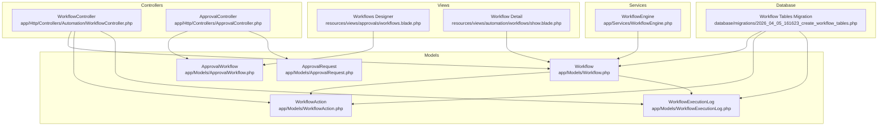
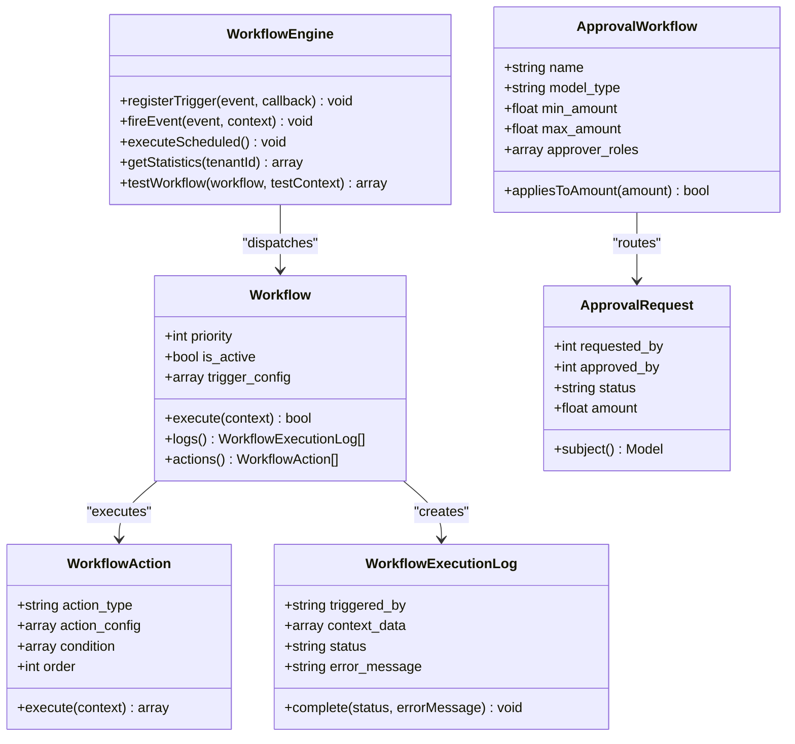
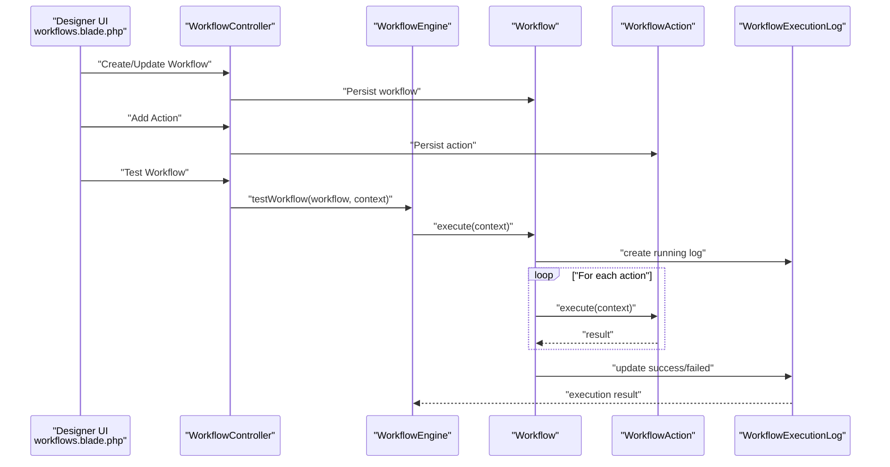
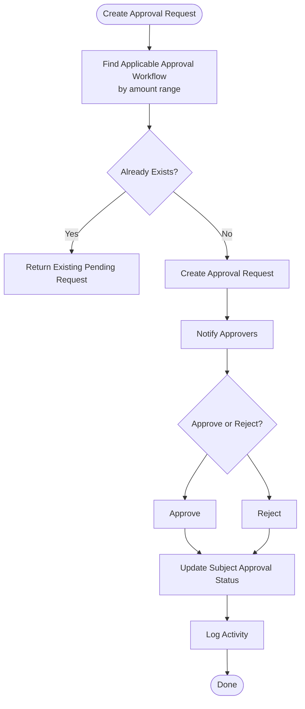
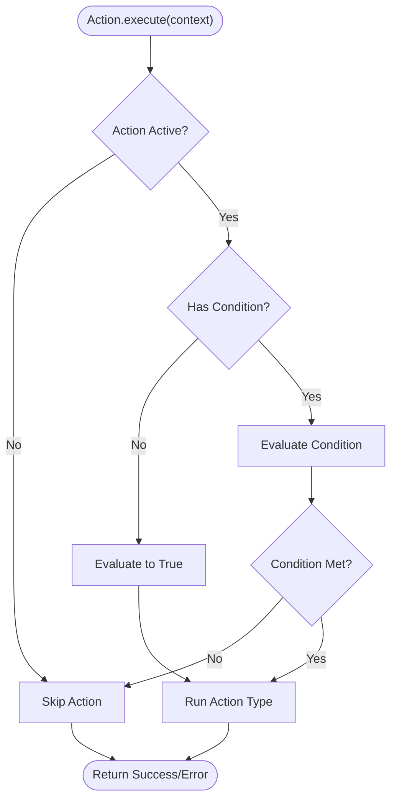
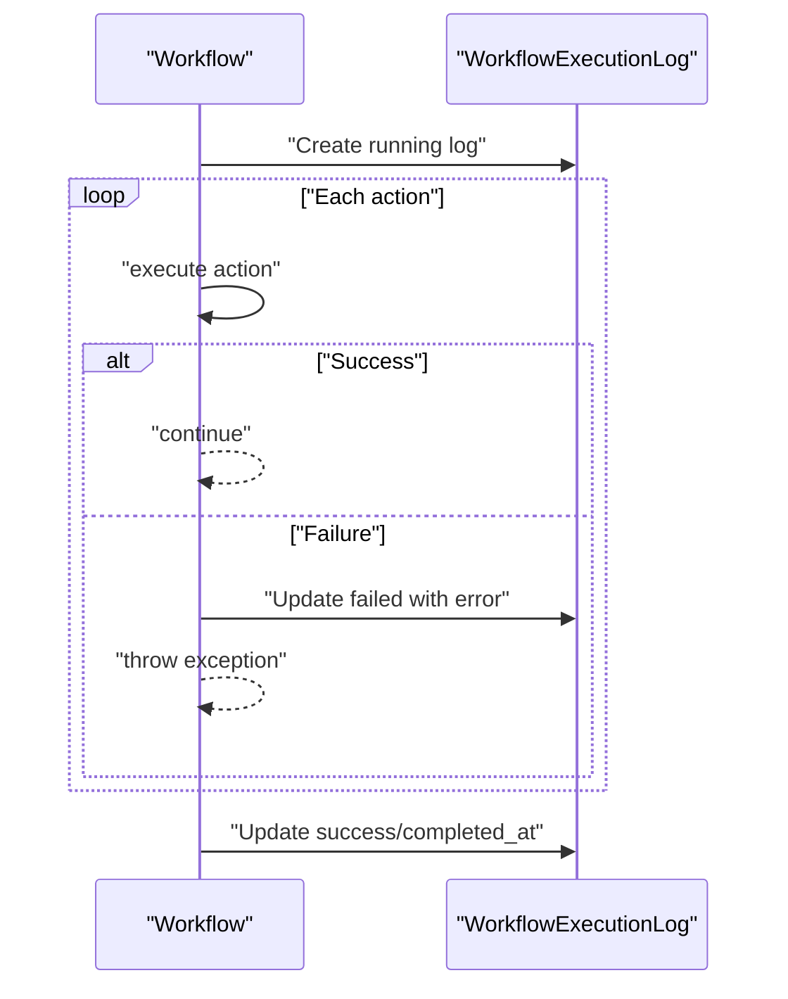
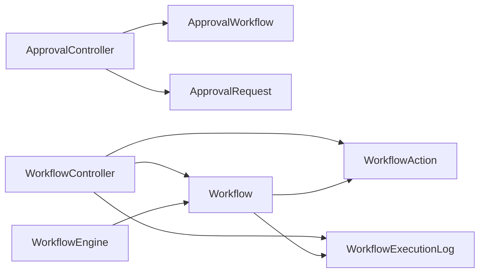

# Workflow Automation

<cite>
**Referenced Files in This Document**
- [Workflow.php](file://app/Models/Workflow.php)
- [WorkflowAction.php](file://app/Models/WorkflowAction.php)
- [WorkflowExecutionLog.php](file://app/Models/WorkflowExecutionLog.php)
- [WorkflowEngine.php](file://app/Services/WorkflowEngine.php)
- [WorkflowController.php](file://app/Http/Controllers/Automation/WorkflowController.php)
- [ApprovalWorkflow.php](file://app/Models/ApprovalWorkflow.php)
- [ApprovalRequest.php](file://app/Models/ApprovalRequest.php)
- [PoApprovalService.php](file://app/Services/PoApprovalService.php)
- [ApprovalController.php](file://app/Http/Controllers/ApprovalController.php)
- [2026_04_05_161623_create_workflow_tables.php](file://database/migrations/2026_04_05_161623_create_workflow_tables.php)
- [workflows.blade.php](file://resources/views/approvals/workflows.blade.php)
- [show.blade.php](file://resources/views/automation/workflows/show.blade.php)
</cite>

## Table of Contents
1. [Introduction](#introduction)
2. [Project Structure](#project-structure)
3. [Core Components](#core-components)
4. [Architecture Overview](#architecture-overview)
5. [Detailed Component Analysis](#detailed-component-analysis)
6. [Dependency Analysis](#dependency-analysis)
7. [Performance Considerations](#performance-considerations)
8. [Troubleshooting Guide](#troubleshooting-guide)
9. [Conclusion](#conclusion)

## Introduction
This document describes the Workflow Automation subsystem responsible for:
- Approval workflows with hierarchical approvers and amount-based routing
- Business process automation via configurable workflows with actions and conditions
- Task routing and integration triggers (events, schedules, conditions)
- Monitoring, exception handling, and audit trails for compliance

The system supports:
- Event-driven triggers (e.g., inventory threshold reached)
- Scheduled executions (e.g., nightly reports)
- Conditional branching (e.g., branch on stock quantity)
- Integration hooks (e.g., webhook calls)
- Comprehensive execution logs and statistics

## Project Structure
The workflow automation spans models, services, controllers, and views:
- Models define domain entities and persistence
- Services encapsulate orchestration and scheduling
- Controllers expose CRUD and operational endpoints
- Views render designer UI and monitoring dashboards

**Diagram sources**
- [Workflow.php:1-108](file://app/Models/Workflow.php#L1-L108)
- [WorkflowAction.php:1-274](file://app/Models/WorkflowAction.php#L1-L274)
- [WorkflowExecutionLog.php:1-58](file://app/Models/WorkflowExecutionLog.php#L1-L58)
- [WorkflowEngine.php:1-162](file://app/Services/WorkflowEngine.php#L1-L162)
- [WorkflowController.php:1-246](file://app/Http/Controllers/Automation/WorkflowController.php#L1-L246)
- [ApprovalController.php:1-218](file://app/Http/Controllers/ApprovalController.php#L1-L218)
- [workflows.blade.php:1-132](file://resources/views/approvals/workflows.blade.php#L1-L132)
- [show.blade.php:1-70](file://resources/views/automation/workflows/show.blade.php#L1-L70)
- [2026_04_05_161623_create_workflow_tables.php:1-75](file://database/migrations/2026_04_05_161623_create_workflow_tables.php#L1-L75)

**Section sources**
- [Workflow.php:1-108](file://app/Models/Workflow.php#L1-L108)
- [WorkflowAction.php:1-274](file://app/Models/WorkflowAction.php#L1-L274)
- [WorkflowEngine.php:1-162](file://app/Services/WorkflowEngine.php#L1-L162)
- [WorkflowController.php:1-246](file://app/Http/Controllers/Automation/WorkflowController.php#L1-L246)
- [ApprovalController.php:1-218](file://app/Http/Controllers/ApprovalController.php#L1-L218)
- [2026_04_05_161623_create_workflow_tables.php:1-75](file://database/migrations/2026_04_05_161623_create_workflow_tables.php#L1-L75)

## Core Components
- Workflow: Defines trigger type (event/schedule/condition), priority, and maintains execution statistics. Orchestrates ordered actions and logs outcomes.
- WorkflowAction: Encapsulates action types (create purchase order, send notifications, update records, webhook calls) with optional conditions and ordering.
- WorkflowExecutionLog: Captures execution lifecycle, status, errors, and timing for auditing and monitoring.
- WorkflowEngine: Central dispatcher for event and scheduled triggers; provides statistics and testing utilities.
- ApprovalWorkflow and ApprovalRequest: Manage approval hierarchies, role-based routing, and approval lifecycle with notifications and activity logging.
- Controllers and Views: Provide designer UI for building workflows and monitoring dashboards.

**Section sources**
- [Workflow.php:1-108](file://app/Models/Workflow.php#L1-L108)
- [WorkflowAction.php:1-274](file://app/Models/WorkflowAction.php#L1-L274)
- [WorkflowExecutionLog.php:1-58](file://app/Models/WorkflowExecutionLog.php#L1-L58)
- [WorkflowEngine.php:1-162](file://app/Services/WorkflowEngine.php#L1-L162)
- [ApprovalWorkflow.php:1-33](file://app/Models/ApprovalWorkflow.php#L1-L33)
- [ApprovalRequest.php:1-25](file://app/Models/ApprovalRequest.php#L1-L25)
- [WorkflowController.php:1-246](file://app/Http/Controllers/Automation/WorkflowController.php#L1-L246)
- [ApprovalController.php:1-218](file://app/Http/Controllers/ApprovalController.php#L1-L218)

## Architecture Overview
The system separates concerns across models, services, and presentation layers. Workflows are persisted with trigger configurations and action sequences. The engine dispatches events and schedules, executes actions in order, and records logs. Approval workflows integrate with the broader approval request lifecycle.

**Diagram sources**
- [Workflow.php:1-108](file://app/Models/Workflow.php#L1-L108)
- [WorkflowAction.php:1-274](file://app/Models/WorkflowAction.php#L1-L274)
- [WorkflowExecutionLog.php:1-58](file://app/Models/WorkflowExecutionLog.php#L1-L58)
- [WorkflowEngine.php:1-162](file://app/Services/WorkflowEngine.php#L1-L162)
- [ApprovalWorkflow.php:1-33](file://app/Models/ApprovalWorkflow.php#L1-L33)
- [ApprovalRequest.php:1-25](file://app/Models/ApprovalRequest.php#L1-L25)

## Detailed Component Analysis

### Workflow Designer and Execution Engine
- Designer UI allows creating workflows with trigger type and configuration, setting priority, and adding actions with conditions and order.
- The engine registers event listeners and fires events to execute matching workflows, honoring priority and context propagation.
- Scheduled workflows are evaluated against predefined cadences (e.g., hourly, daily, weekly, monthly).
- Each execution creates a log entry capturing trigger source, context, status, and timing.

**Diagram sources**
- [workflows.blade.php:1-132](file://resources/views/approvals/workflows.blade.php#L1-L132)
- [WorkflowController.php:66-84](file://app/Http/Controllers/Automation/WorkflowController.php#L66-L84)
- [WorkflowEngine.php:28-58](file://app/Services/WorkflowEngine.php#L28-L58)
- [Workflow.php:61-106](file://app/Models/Workflow.php#L61-L106)
- [WorkflowAction.php:46-76](file://app/Models/WorkflowAction.php#L46-L76)
- [WorkflowExecutionLog.php:10-56](file://app/Models/WorkflowExecutionLog.php#L10-L56)

**Section sources**
- [WorkflowController.php:58-84](file://app/Http/Controllers/Automation/WorkflowController.php#L58-L84)
- [WorkflowEngine.php:28-101](file://app/Services/WorkflowEngine.php#L28-L101)
- [Workflow.php:61-106](file://app/Models/Workflow.php#L61-L106)
- [WorkflowAction.php:46-110](file://app/Models/WorkflowAction.php#L46-L110)
- [WorkflowExecutionLog.php:10-56](file://app/Models/WorkflowExecutionLog.php#L10-L56)
- [show.blade.php:1-70](file://resources/views/automation/workflows/show.blade.php#L1-L70)

### Approval Workflows and Hierarchies
- Approval workflows define approver roles and amount thresholds to route requests automatically.
- Approval requests track requester, approver, status, and associated business entity via polymorphic morphTo.
- The approval service selects the appropriate workflow for a purchase order based on amount thresholds.
- Controllers manage creation, approval/rejection, and notifications for pending approvals.

**Diagram sources**
- [PoApprovalService.php:119-155](file://app/Services/PoApprovalService.php#L119-L155)
- [PoApprovalService.php:319-331](file://app/Services/PoApprovalService.php#L319-L331)
- [ApprovalController.php:78-145](file://app/Http/Controllers/ApprovalController.php#L78-L145)
- [ApprovalRequest.php:9-24](file://app/Models/ApprovalRequest.php#L9-L24)

**Section sources**
- [ApprovalWorkflow.php:12-31](file://app/Models/ApprovalWorkflow.php#L12-L31)
- [ApprovalRequest.php:12-24](file://app/Models/ApprovalRequest.php#L12-L24)
- [PoApprovalService.php:119-155](file://app/Services/PoApprovalService.php#L119-L155)
- [PoApprovalService.php:319-331](file://app/Services/PoApprovalService.php#L319-L331)
- [ApprovalController.php:15-34](file://app/Http/Controllers/ApprovalController.php#L15-L34)

### Conditional Branching and Integration Triggers
- Conditional branching: Actions support optional conditions evaluated against execution context (e.g., field comparisons).
- Integration triggers:
  - Event-triggered workflows execute when specific events occur.
  - Scheduled workflows execute according to predefined cadences.
  - Condition-triggered workflows can be extended similarly if configured.

**Diagram sources**
- [WorkflowAction.php:46-110](file://app/Models/WorkflowAction.php#L46-L110)
- [WorkflowEngine.php:28-101](file://app/Services/WorkflowEngine.php#L28-L101)

**Section sources**
- [WorkflowAction.php:81-110](file://app/Models/WorkflowAction.php#L81-L110)
- [WorkflowEngine.php:28-101](file://app/Services/WorkflowEngine.php#L28-L101)

### Workflow Monitoring, Exception Handling, and Audit Trails
- Execution logs capture trigger source, context, timestamps, status, and error messages.
- Statistics include total workflows, active workflows, daily execution counts, and success rates.
- Exception handling wraps action execution; failures update logs with error messages and set failed status.
- Audit-friendly fields include tenant scoping, triggered_by metadata, and duration tracking.

**Diagram sources**
- [Workflow.php:70-106](file://app/Models/Workflow.php#L70-L106)
- [WorkflowExecutionLog.php:48-56](file://app/Models/WorkflowExecutionLog.php#L48-L56)
- [WorkflowEngine.php:106-130](file://app/Services/WorkflowEngine.php#L106-L130)

**Section sources**
- [WorkflowExecutionLog.php:10-56](file://app/Models/WorkflowExecutionLog.php#L10-L56)
- [Workflow.php:70-106](file://app/Models/Workflow.php#L70-L106)
- [WorkflowEngine.php:106-130](file://app/Services/WorkflowEngine.php#L106-L130)

## Dependency Analysis
- Workflow depends on WorkflowAction and WorkflowExecutionLog.
- WorkflowEngine orchestrates Workflow execution and interacts with external listeners.
- ApprovalWorkflow and ApprovalRequest depend on User and polymorphic subject models.
- Controllers coordinate persistence and authorization for workflows and approval requests.
- Views render designer and monitoring interfaces.

**Diagram sources**
- [ApprovalController.php:1-218](file://app/Http/Controllers/ApprovalController.php#L1-L218)
- [WorkflowController.php:1-246](file://app/Http/Controllers/Automation/WorkflowController.php#L1-L246)
- [WorkflowEngine.php:1-162](file://app/Services/WorkflowEngine.php#L1-L162)
- [Workflow.php:1-108](file://app/Models/Workflow.php#L1-L108)
- [WorkflowAction.php:1-274](file://app/Models/WorkflowAction.php#L1-L274)
- [WorkflowExecutionLog.php:1-58](file://app/Models/WorkflowExecutionLog.php#L1-L58)
- [ApprovalWorkflow.php:1-33](file://app/Models/ApprovalWorkflow.php#L1-L33)
- [ApprovalRequest.php:1-25](file://app/Models/ApprovalRequest.php#L1-L25)

**Section sources**
- [WorkflowController.php:1-246](file://app/Http/Controllers/Automation/WorkflowController.php#L1-L246)
- [ApprovalController.php:1-218](file://app/Http/Controllers/ApprovalController.php#L1-L218)
- [WorkflowEngine.php:1-162](file://app/Services/WorkflowEngine.php#L1-L162)

## Performance Considerations
- Prefer indexed columns for tenant scoping and status filtering to optimize queries on logs and workflows.
- Use action ordering to minimize expensive operations early; leverage conditions to avoid unnecessary work.
- Schedule heavy workflows during off-peak hours and monitor success rate via statistics.
- Consider batching notifications and webhook calls to reduce latency spikes.

## Troubleshooting Guide
Common issues and resolutions:
- Workflow not executing:
  - Verify trigger type and configuration; ensure workflows are active and have correct priority.
  - Confirm event registration and scheduled cadence alignment.
- Action failure:
  - Inspect execution logs for error messages and context; check action configuration validity.
  - Validate conditions and context availability.
- Approval routing issues:
  - Ensure approval workflow amount ranges and approver roles match the request.
  - Confirm existing pending requests are not blocking re-creation.

Operational checks:
- Review recent execution logs filtered by status and date range.
- Use the built-in test execution to validate workflow behavior with representative context.
- Monitor success rate and execution counts to detect trends.

**Section sources**
- [WorkflowEngine.php:106-130](file://app/Services/WorkflowEngine.php#L106-L130)
- [WorkflowController.php:169-190](file://app/Http/Controllers/Automation/WorkflowController.php#L169-L190)
- [Workflow.php:70-106](file://app/Models/Workflow.php#L70-L106)
- [ApprovalController.php:15-34](file://app/Http/Controllers/ApprovalController.php#L15-L34)

## Conclusion
The Workflow Automation subsystem provides a robust foundation for approval workflows, business process automation, and integration triggers. Its modular design, comprehensive logging, and monitoring capabilities support scalable operations and compliance needs. By leveraging event and schedule triggers, conditional branching, and structured execution logs, teams can build reliable, auditable automation across diverse business scenarios.