# Construction Entities

<cite>
**Referenced Files in This Document**
- [Subcontractor.php](file://app/Models/Subcontractor.php)
- [SubcontractorContract.php](file://app/Models/SubcontractorContract.php)
- [SubcontractorPayment.php](file://app/Models/SubcontractorPayment.php)
- [SubcontractorService.php](file://app/Services/SubcontractorService.php)
- [DailySiteReport.php](file://app/Models/DailySiteReport.php)
- [SiteLaborLog.php](file://app/Models/SiteLaborLog.php)
- [DailySiteReportService.php](file://app/Services/DailySiteReportService.php)
- [MaterialDelivery.php](file://app/Models/MaterialDelivery.php)
- [MaterialDeliveryService.php](file://app/Services/MaterialDeliveryService.php)
- [Project.php](file://app/Models/Project.php)
- [ProjectMilestone.php](file://app/Models/ProjectMilestone.php)
- [ProjectTask.php](file://app/Models/ProjectTask.php)
- [ProjectExpense.php](file://app/Models/ProjectExpense.php)
- [ProjectInvoice.php](file://app/Models/ProjectInvoice.php)
- [WorkOrder.php](file://app/Models/WorkOrder.php)
- [web.php](file://routes/web.php)
</cite>

## Table of Contents
1. [Introduction](#introduction)
2. [Project Structure](#project-structure)
3. [Core Components](#core-components)
4. [Architecture Overview](#architecture-overview)
5. [Detailed Component Analysis](#detailed-component-analysis)
6. [Dependency Analysis](#dependency-analysis)
7. [Performance Considerations](#performance-considerations)
8. [Troubleshooting Guide](#troubleshooting-guide)
9. [Conclusion](#conclusion)

## Introduction
This document provides comprehensive data model documentation for Qalcuity ERP’s construction domain. It focuses on vendor management via Subcontractor and related models, site reporting through DailySiteReport and SiteLaborLog, material delivery tracking via MaterialDelivery, and project lifecycle models including Project, ProjectMilestone, ProjectTask, ProjectExpense, ProjectInvoice, and WorkOrder. It also covers construction-specific tracking, milestone management, and project profitability calculations.

## Project Structure
The construction data models and services are organized under the Models and Services namespaces. Controllers expose endpoints for construction workflows, while models define attributes, casts, relations, and helper methods. Services encapsulate business logic for creation, validation, and analytics.

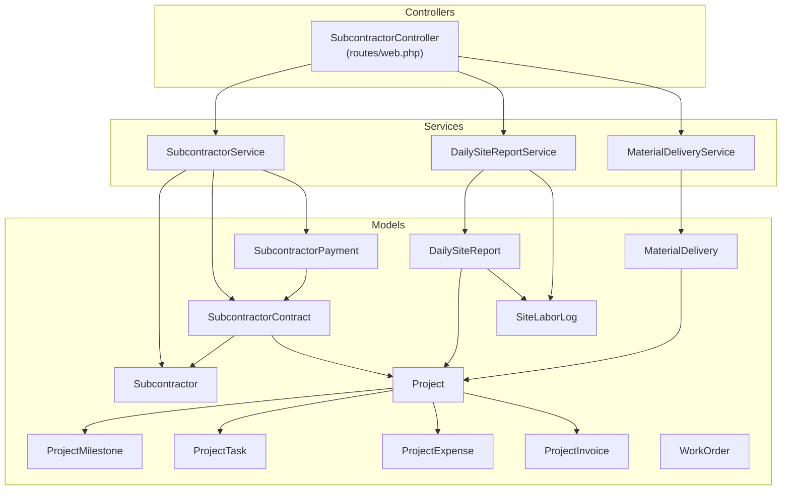

**Diagram sources**
- [web.php:2336-2351](file://routes/web.php#L2336-L2351)
- [SubcontractorService.php:1-232](file://app/Services/SubcontractorService.php#L1-L232)
- [DailySiteReportService.php:1-206](file://app/Services/DailySiteReportService.php#L1-L206)
- [MaterialDeliveryService.php:1-254](file://app/Services/MaterialDeliveryService.php#L1-L254)
- [Subcontractor.php:1-79](file://app/Models/Subcontractor.php#L1-L79)
- [SubcontractorContract.php:1-90](file://app/Models/SubcontractorContract.php#L1-L90)
- [SubcontractorPayment.php:1-52](file://app/Models/SubcontractorPayment.php#L1-L52)
- [DailySiteReport.php:1-97](file://app/Models/DailySiteReport.php#L1-L97)
- [SiteLaborLog.php:1-55](file://app/Models/SiteLaborLog.php#L1-L55)
- [MaterialDelivery.php:1-121](file://app/Models/MaterialDelivery.php#L1-L121)
- [Project.php:1-82](file://app/Models/Project.php#L1-L82)
- [ProjectMilestone.php:1-33](file://app/Models/ProjectMilestone.php#L1-L33)
- [ProjectTask.php:1-101](file://app/Models/ProjectTask.php#L1-L101)
- [ProjectExpense.php:1-30](file://app/Models/ProjectExpense.php#L1-L30)
- [ProjectInvoice.php:1-66](file://app/Models/ProjectInvoice.php#L1-L66)
- [WorkOrder.php:1-140](file://app/Models/WorkOrder.php#L1-L140)

**Section sources**
- [web.php:2336-2351](file://routes/web.php#L2336-L2351)

## Core Components
This section introduces the primary construction models and their roles.

- Subcontractor: Vendor profile and metrics for subcontractors.
- SubcontractorContract: Contract terms linking subcontractors to projects.
- SubcontractorPayment: Progress billing and payment tracking against contracts.
- DailySiteReport: Daily site activity, workforce, materials, weather, and progress.
- SiteLaborLog: Detailed daily labor entries linked to site reports.
- MaterialDelivery: Delivery tracking, quality checks, delays, and shortages.
- Project: Project header, progress, budget, and profitability helpers.
- ProjectMilestone: Milestone definitions with financial retention fields.
- ProjectTask: Task-level work items with volume-based progress.
- ProjectExpense: Project expenses with date and amount.
- ProjectInvoice: Invoices linked to milestones or time/sales, with retention.
- WorkOrder: Manufacturing-style work orders with costs and outputs.

**Section sources**
- [Subcontractor.php:14-79](file://app/Models/Subcontractor.php#L14-L79)
- [SubcontractorContract.php:14-90](file://app/Models/SubcontractorContract.php#L14-L90)
- [SubcontractorPayment.php:13-52](file://app/Models/SubcontractorPayment.php#L13-L52)
- [DailySiteReport.php:14-97](file://app/Models/DailySiteReport.php#L14-L97)
- [SiteLaborLog.php:13-55](file://app/Models/SiteLaborLog.php#L13-L55)
- [MaterialDelivery.php:13-121](file://app/Models/MaterialDelivery.php#L13-L121)
- [Project.php:11-82](file://app/Models/Project.php#L11-L82)
- [ProjectMilestone.php:10-33](file://app/Models/ProjectMilestone.php#L10-L33)
- [ProjectTask.php:11-101](file://app/Models/ProjectTask.php#L11-L101)
- [ProjectExpense.php:10-30](file://app/Models/ProjectExpense.php#L10-L30)
- [ProjectInvoice.php:11-66](file://app/Models/ProjectInvoice.php#L11-L66)
- [WorkOrder.php:11-140](file://app/Models/WorkOrder.php#L11-L140)

## Architecture Overview
The construction domain follows a layered pattern:
- Controllers expose endpoints for subcontractor management, site reporting, and material delivery.
- Services encapsulate business logic for creation, validation, and analytics.
- Models define schema, relations, and helper methods for calculations and validations.
- Views and notifications integrate with the workflow for approvals and alerts.

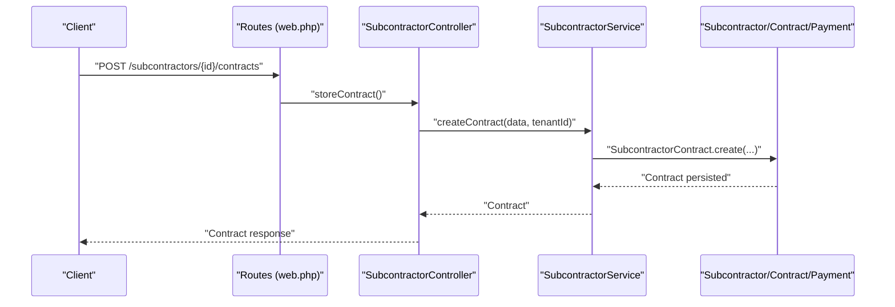

**Diagram sources**
- [web.php:2336-2351](file://routes/web.php#L2336-L2351)
- [SubcontractorService.php:39-64](file://app/Services/SubcontractorService.php#L39-L64)
- [SubcontractorContract.php:14-90](file://app/Models/SubcontractorContract.php#L14-L90)

## Detailed Component Analysis

### Subcontractor Model
The Subcontractor model stores vendor information, specialization, license, tax ID, status, ratings, and project counts. It relates to Projects via a pivot table and to Contracts.

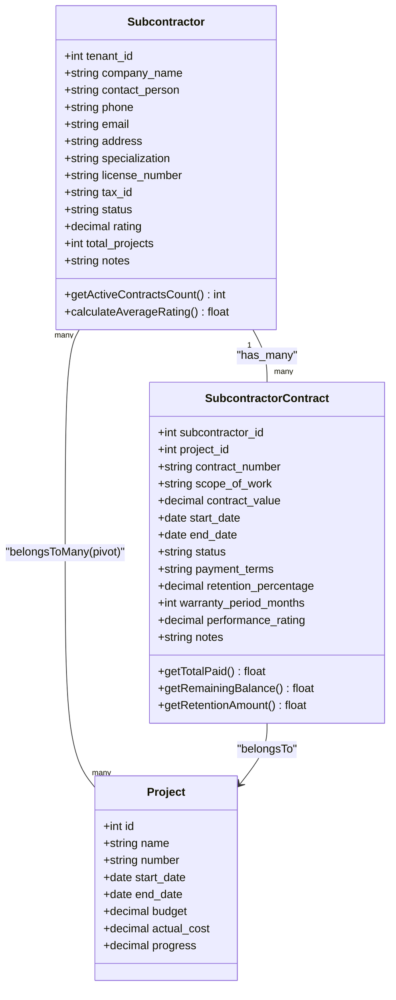

**Diagram sources**
- [Subcontractor.php:14-79](file://app/Models/Subcontractor.php#L14-L79)
- [SubcontractorContract.php:14-90](file://app/Models/SubcontractorContract.php#L14-L90)
- [Project.php:11-82](file://app/Models/Project.php#L11-L82)

**Section sources**
- [Subcontractor.php:14-79](file://app/Models/Subcontractor.php#L14-L79)
- [SubcontractorContract.php:14-90](file://app/Models/SubcontractorContract.php#L14-L90)

### Subcontractor Service
The SubcontractorService orchestrates vendor registration, contract creation, activation, and payment claims. It computes financial summaries and performance metrics.

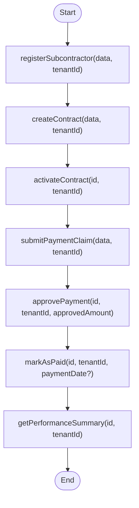

**Diagram sources**
- [SubcontractorService.php:17-151](file://app/Services/SubcontractorService.php#L17-L151)

**Section sources**
- [SubcontractorService.php:1-232](file://app/Services/SubcontractorService.php#L1-L232)

### DailySiteReport and SiteLaborLog
DailySiteReport captures daily site conditions, manpower, equipment, materials, issues, safety incidents, progress, and photos. SiteLaborLog records worker details linked to a report.

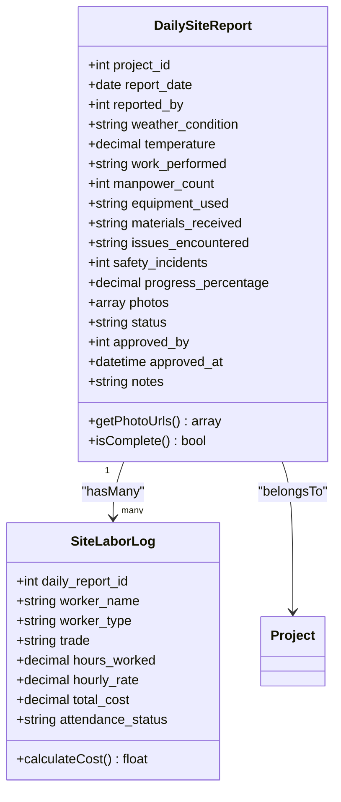

**Diagram sources**
- [DailySiteReport.php:14-97](file://app/Models/DailySiteReport.php#L14-L97)
- [SiteLaborLog.php:13-55](file://app/Models/SiteLaborLog.php#L13-L55)

**Section sources**
- [DailySiteReport.php:14-97](file://app/Models/DailySiteReport.php#L14-L97)
- [SiteLaborLog.php:13-55](file://app/Models/SiteLaborLog.php#L13-L55)

### DailySiteReport Service
The DailySiteReportService handles report creation, submission/approval, and analytics. It updates project progress upon approval and aggregates labor cost and weather summaries.

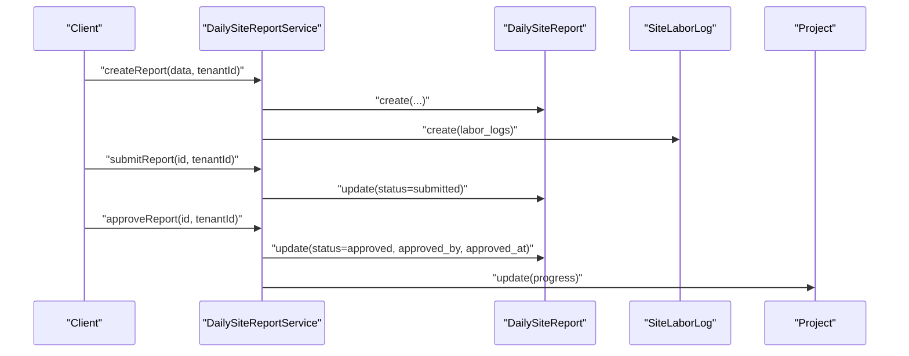

**Diagram sources**
- [DailySiteReportService.php:17-95](file://app/Services/DailySiteReportService.php#L17-L95)
- [DailySiteReport.php:14-97](file://app/Models/DailySiteReport.php#L14-L97)
- [SiteLaborLog.php:13-55](file://app/Models/SiteLaborLog.php#L13-L55)
- [Project.php:51-61](file://app/Models/Project.php#L51-L61)

**Section sources**
- [DailySiteReportService.php:1-206](file://app/Services/DailySiteReportService.php#L1-L206)

### MaterialDelivery
MaterialDelivery tracks incoming materials with quantities, units, pricing, expected/actual delivery dates, quality checks, and photos. It exposes delay and shortage computations.

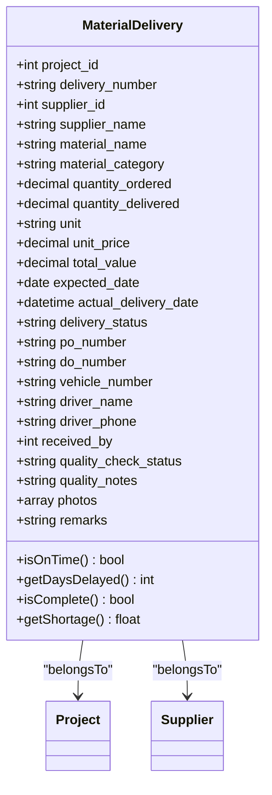

**Diagram sources**
- [MaterialDelivery.php:13-121](file://app/Models/MaterialDelivery.php#L13-L121)

**Section sources**
- [MaterialDelivery.php:13-121](file://app/Models/MaterialDelivery.php#L13-L121)

### MaterialDelivery Service
The MaterialDeliveryService manages delivery lifecycle: creation, marking in-transit, receiving, quality checks, and analytics on delays and shortages.

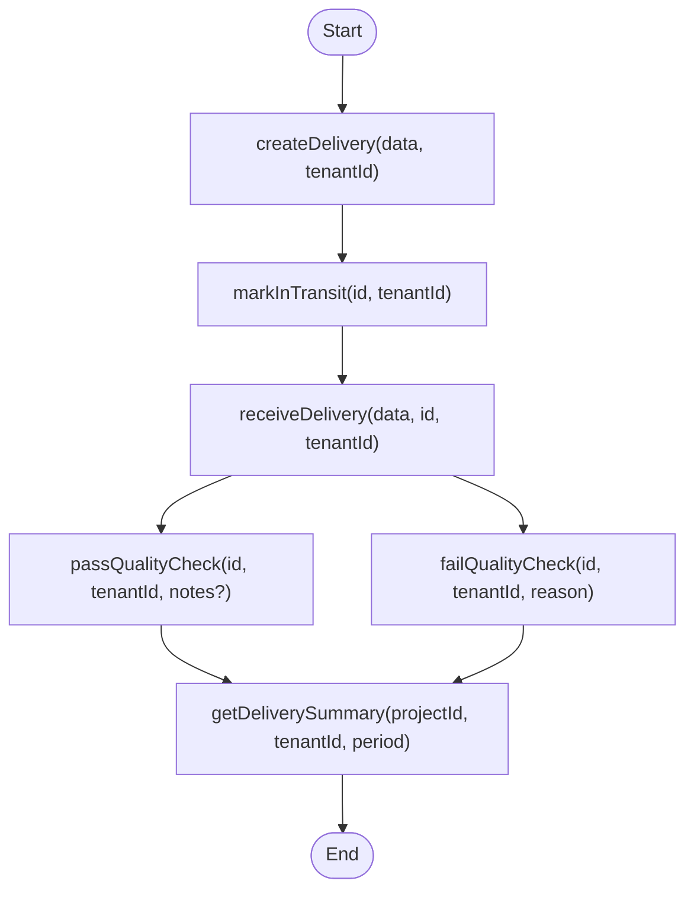

**Diagram sources**
- [MaterialDeliveryService.php:16-130](file://app/Services/MaterialDeliveryService.php#L16-L130)

**Section sources**
- [MaterialDeliveryService.php:1-254](file://app/Services/MaterialDeliveryService.php#L1-L254)

### Project, ProjectMilestone, ProjectTask, ProjectExpense, ProjectInvoice
Project aggregates tasks, expenses, milestones, and invoices. It recalculates weighted progress and actual costs, and computes budget variance and utilization. ProjectMilestone supports retention and billed amounts. ProjectTask supports volume-based progress and effective progress for project aggregation. ProjectExpense captures spend. ProjectInvoice links to invoices and milestones, with retention fields.

```mermaid
classDiagram
class Project {
+string number
+string name
+string status
+date start_date
+date end_date
+decimal budget
+decimal actual_cost
+decimal progress
+recalculateProgress() void
+recalculateActualCost() void
+budgetVariance() float
+budgetUsedPercent() float
}
class ProjectMilestone {
+int project_id
+string name
+decimal amount
+decimal percentage
+date due_date
+string status
+int completed_by
+datetime completed_at
+int sort_order
}
class ProjectTask {
+int project_id
+string name
+string status
+string progress_method
+decimal target_volume
+decimal actual_volume
+string volume_unit
+int weight
+date due_date
+decimal budget
+decimal actual_cost
+isVolumeTracked() bool
+volumeProgress() float
+remainingVolume() float
+effectiveProgress() float
+syncStatusFromVolume() void
}
class ProjectExpense {
+int project_id
+string category
+string description
+decimal amount
+date date
+string reference
}
class ProjectInvoice {
+int project_id
+int invoice_id
+string billing_type
+decimal total_amount
+decimal gross_amount
+decimal retention_amount
+decimal retention_released
+bool retention_released_flag
+date retention_release_date
+int termin_number
+decimal progress_pct
+retentionOutstanding() float
+isRetentionReleased() bool
}
Project "1" --> "many" ProjectTask : "hasMany"
Project "1" --> "many" ProjectExpense : "hasMany"
Project "1" --> "many" ProjectMilestone : "hasMany"
Project "1" --> "many" ProjectInvoice : "hasMany"
```

**Diagram sources**
- [Project.php:11-82](file://app/Models/Project.php#L11-L82)
- [ProjectMilestone.php:10-33](file://app/Models/ProjectMilestone.php#L10-L33)
- [ProjectTask.php:11-101](file://app/Models/ProjectTask.php#L11-L101)
- [ProjectExpense.php:10-30](file://app/Models/ProjectExpense.php#L10-L30)
- [ProjectInvoice.php:11-66](file://app/Models/ProjectInvoice.php#L11-L66)

**Section sources**
- [Project.php:50-81](file://app/Models/Project.php#L50-L81)
- [ProjectMilestone.php:10-33](file://app/Models/ProjectMilestone.php#L10-L33)
- [ProjectTask.php:36-100](file://app/Models/ProjectTask.php#L36-L100)
- [ProjectExpense.php:10-30](file://app/Models/ProjectExpense.php#L10-L30)
- [ProjectInvoice.php:50-66](file://app/Models/ProjectInvoice.php#L50-L66)

### WorkOrder
WorkOrder supports manufacturing-style production orders with target quantity, unit, status transitions, material reservations/consumption flags, operation hours, and cost breakdowns. It computes yield rate and cost per good unit.

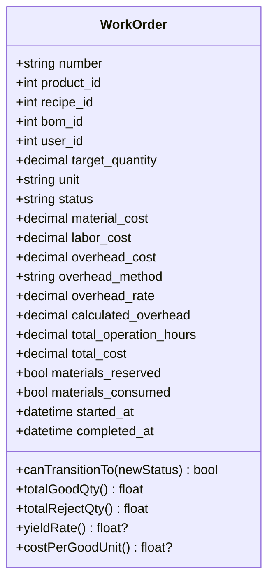

**Diagram sources**
- [WorkOrder.php:11-140](file://app/Models/WorkOrder.php#L11-L140)

**Section sources**
- [WorkOrder.php:11-140](file://app/Models/WorkOrder.php#L11-L140)

## Dependency Analysis
- Controllers route requests to services for business operations.
- Services depend on models for persistence and calculations.
- Models define relations and helper methods used by services and controllers.
- Project-related models interrelate to compute progress, costs, and profitability.

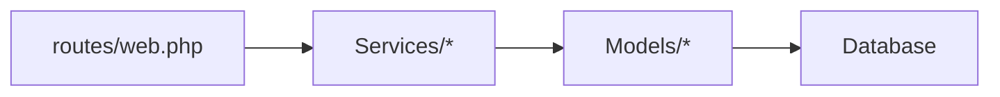

**Diagram sources**
- [web.php:2336-2351](file://routes/web.php#L2336-L2351)
- [SubcontractorService.php:1-232](file://app/Services/SubcontractorService.php#L1-L232)
- [DailySiteReportService.php:1-206](file://app/Services/DailySiteReportService.php#L1-L206)
- [MaterialDeliveryService.php:1-254](file://app/Services/MaterialDeliveryService.php#L1-L254)

**Section sources**
- [web.php:2336-2351](file://routes/web.php#L2336-L2351)

## Performance Considerations
- Use relation eager-loading (e.g., with pivot and timestamps) to avoid N+1 queries in subcontractor-project joins.
- Apply database indexes on frequently filtered fields: tenant_id, project_id, status, dates (expected/actual delivery), report_date.
- Aggregate analytics (e.g., labor cost, delivery summaries) with grouped queries to minimize PHP-side computation.
- Cache periodic summaries (e.g., subcontractor performance, delivery delays) to reduce repeated heavy aggregations.

## Troubleshooting Guide
- Subcontractor contract activation fails: verify tenant-scoped lookup and status transitions.
- Payment claim approval mismatch: confirm approved amount does not exceed remaining balance and retention logic.
- Daily report submission errors: ensure completeness checks pass (work performed, manpower count, progress percentage).
- Material delivery quality failure: confirm cancellation logic sets delivery_status to cancelled and quality_notes are recorded.
- Project progress not updating: verify the latest approved DailySiteReport exists and triggers progress update.

**Section sources**
- [SubcontractorService.php:69-81](file://app/Services/SubcontractorService.php#L69-L81)
- [DailySiteReportService.php:61-74](file://app/Services/DailySiteReportService.php#L61-L74)
- [MaterialDeliveryService.php:115-129](file://app/Services/MaterialDeliveryService.php#L115-L129)
- [DailySiteReportService.php:191-204](file://app/Services/DailySiteReportService.php#L191-L204)

## Conclusion
Qalcuity ERP’s construction data models provide a robust foundation for vendor management, site reporting, material delivery tracking, and project lifecycle management. Services encapsulate workflows and analytics, enabling accurate progress tracking, profitability insights, and operational visibility across subcontracting and site execution.