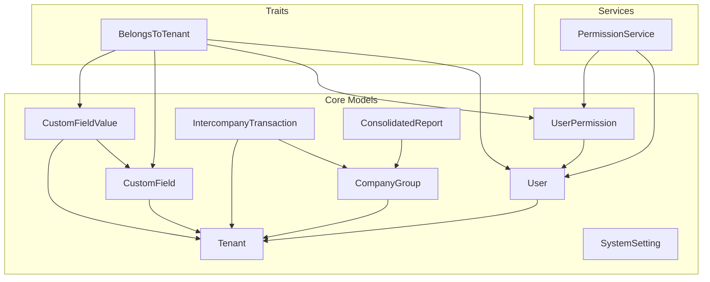
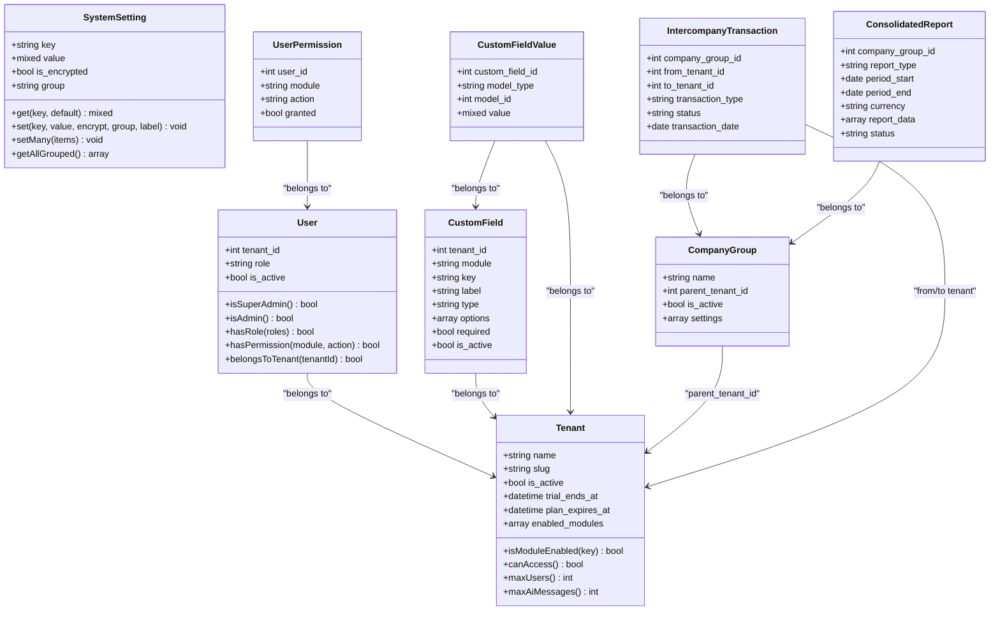
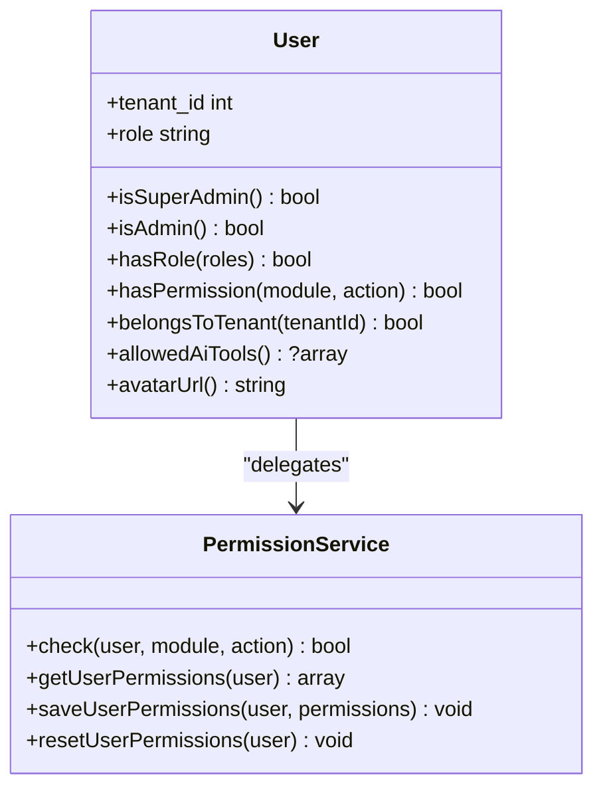
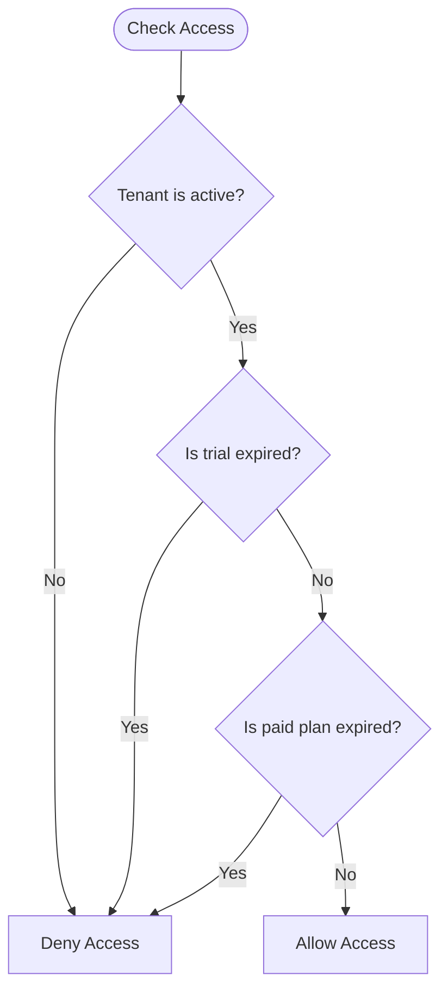
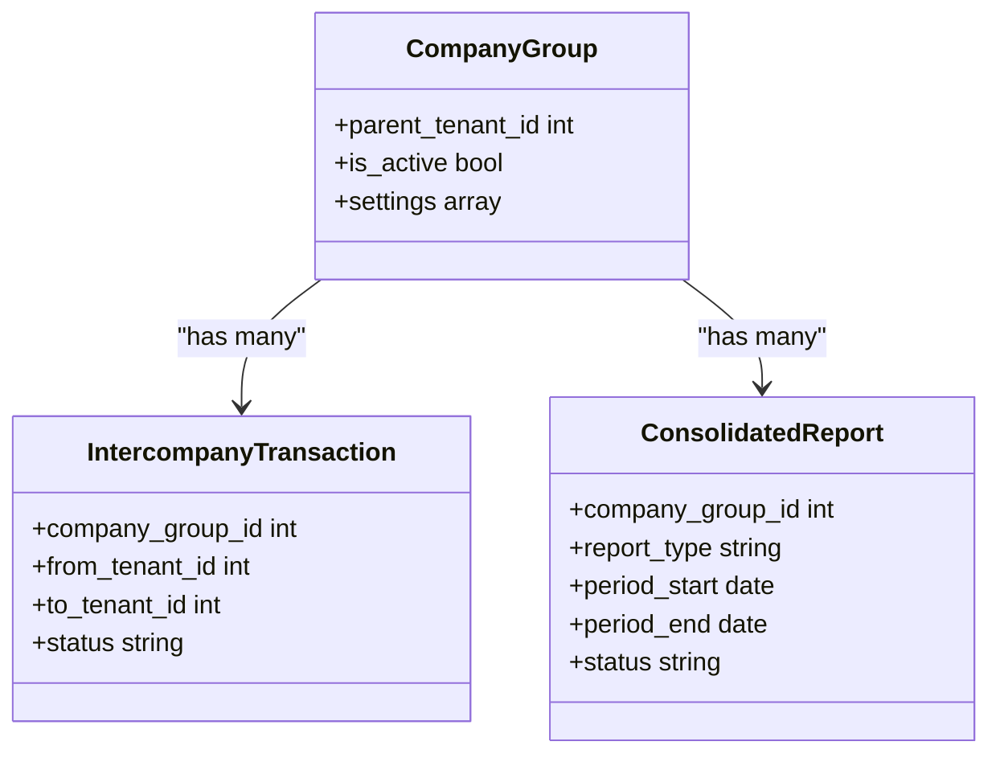
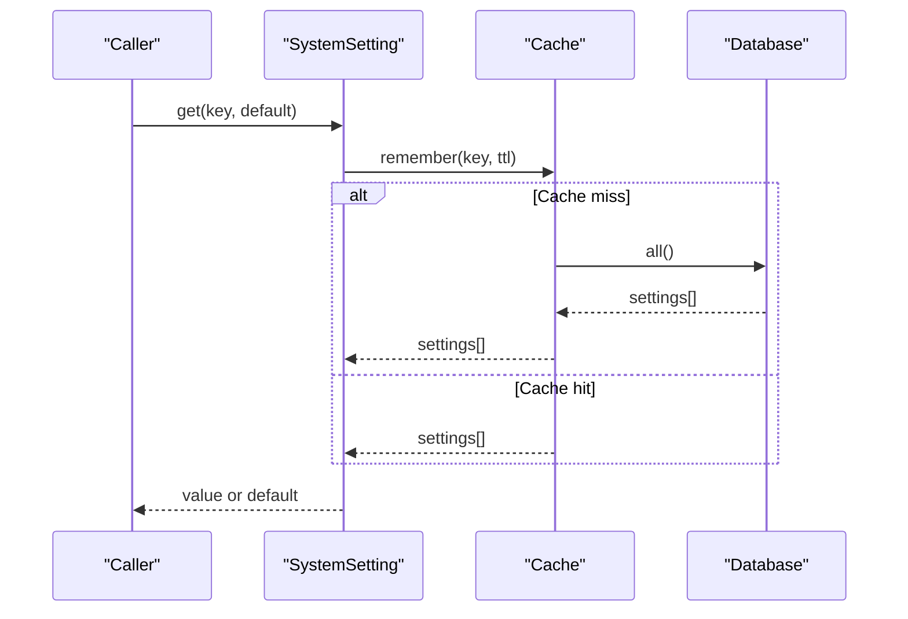
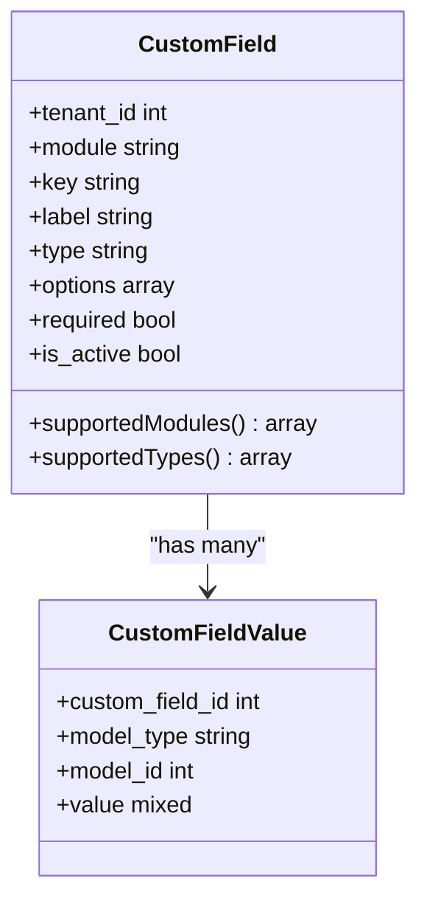
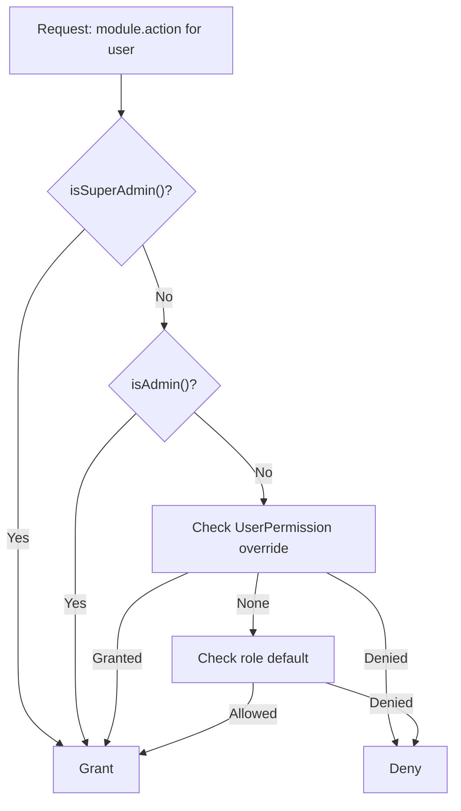
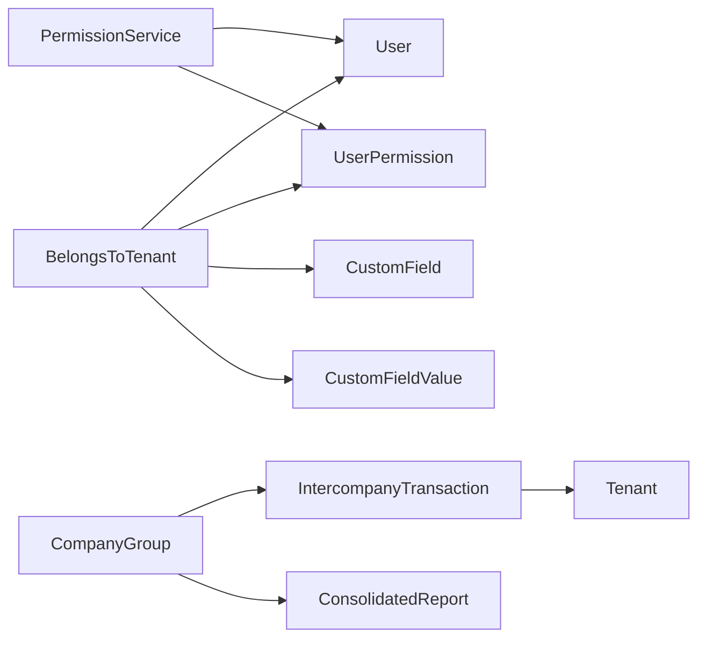

# Core Entities

<cite>
**Referenced Files in This Document**
- [User.php](file://app/Models/User.php)
- [Tenant.php](file://app/Models/Tenant.php)
- [CompanyGroup.php](file://app/Models/CompanyGroup.php)
- [SystemSetting.php](file://app/Models/SystemSetting.php)
- [CustomField.php](file://app/Models/CustomField.php)
- [CustomFieldValue.php](file://app/Models/CustomFieldValue.php)
- [UserPermission.php](file://app/Models/UserPermission.php)
- [BelongsToTenant.php](file://app/Traits/BelongsToTenant.php)
- [PermissionService.php](file://app/Services/PermissionService.php)
- [IntercompanyTransaction.php](file://app/Models/IntercompanyTransaction.php)
- [ConsolidatedReport.php](file://app/Models/ConsolidatedReport.php)
</cite>

## Table of Contents
1. [Introduction](#introduction)
2. [Project Structure](#project-structure)
3. [Core Components](#core-components)
4. [Architecture Overview](#architecture-overview)
5. [Detailed Component Analysis](#detailed-component-analysis)
6. [Dependency Analysis](#dependency-analysis)
7. [Performance Considerations](#performance-considerations)
8. [Troubleshooting Guide](#troubleshooting-guide)
9. [Conclusion](#conclusion)

## Introduction
This document provides comprehensive data model documentation for Qalcuity ERP’s core entities. It focuses on:
- User: authentication, authorization, and role-based access control
- Tenant: multi-tenancy architecture, tenant isolation, shared settings, and data segregation
- CompanyGroup: enterprise hierarchies and consolidated reporting
- SystemSetting: configuration management
- CustomField and CustomFieldValue: dynamic field definitions

It also covers entity relationships, validation rules, access control patterns, and business logic constraints.

## Project Structure
The core models and supporting traits/services are located under app/Models, app/Traits, and app/Services. Multi-tenancy is enforced via a global scope trait applied to tenant-scoped models. Authorization is handled by a centralized PermissionService with role defaults and per-user overrides.

**Diagram sources**
- [User.php:15-280](file://app/Models/User.php#L15-L280)
- [Tenant.php:10-223](file://app/Models/Tenant.php#L10-L223)
- [CompanyGroup.php:8-47](file://app/Models/CompanyGroup.php#L8-L47)
- [CustomField.php:11-56](file://app/Models/CustomField.php#L11-L56)
- [CustomFieldValue.php:11-20](file://app/Models/CustomFieldValue.php#L11-L20)
- [UserPermission.php:10-22](file://app/Models/UserPermission.php#L10-L22)
- [SystemSetting.php:10-182](file://app/Models/SystemSetting.php#L10-L182)
- [IntercompanyTransaction.php:8-62](file://app/Models/IntercompanyTransaction.php#L8-L62)
- [ConsolidatedReport.php:8-54](file://app/Models/ConsolidatedReport.php#L8-L54)
- [BelongsToTenant.php:32-110](file://app/Traits/BelongsToTenant.php#L32-L110)
- [PermissionService.php:9-423](file://app/Services/PermissionService.php#L9-L423)

**Section sources**
- [User.php:15-280](file://app/Models/User.php#L15-L280)
- [Tenant.php:10-223](file://app/Models/Tenant.php#L10-L223)
- [CompanyGroup.php:8-47](file://app/Models/CompanyGroup.php#L8-L47)
- [CustomField.php:11-56](file://app/Models/CustomField.php#L11-L56)
- [CustomFieldValue.php:11-20](file://app/Models/CustomFieldValue.php#L11-L20)
- [UserPermission.php:10-22](file://app/Models/UserPermission.php#L10-L22)
- [SystemSetting.php:10-182](file://app/Models/SystemSetting.php#L10-L182)
- [IntercompanyTransaction.php:8-62](file://app/Models/IntercompanyTransaction.php#L8-L62)
- [ConsolidatedReport.php:8-54](file://app/Models/ConsolidatedReport.php#L8-L54)
- [BelongsToTenant.php:32-110](file://app/Traits/BelongsToTenant.php#L32-L110)
- [PermissionService.php:9-423](file://app/Services/PermissionService.php#L9-L423)

## Core Components
This section documents the five core entities and their roles in the system.

- User
  - Authentication and authorization backbone with role-based access control and granular permissions.
  - Provides helpers for role checks, permission checks, and avatar URL generation.
  - Relationships: belongs to Tenant; has many UserPermission, NotificationPreference, UserAchievement, UserPointsLog; has one Affiliate.

- Tenant
  - Multi-tenancy container with subscription and module visibility controls.
  - Provides module enablement checks, access eligibility, and limits for users and AI messages.
  - Relationships: has many Users; belongs to SubscriptionPlan; provides admins scope.

- CompanyGroup
  - Enterprise hierarchy container linking parent Tenant to subsidiaries via membership records.
  - Supports consolidated reporting and inter-company transactions.
  - Relationships: belongs to Tenant; has many TenantGroupMember, IntercompanyTransaction, ConsolidatedReport, SharedService.

- SystemSetting
  - Centralized configuration management with caching and optional encryption.
  - Provides helpers to get/set single/multiple settings, load into Laravel config, and group settings.
  - Relationships: none (standalone configuration model).

- CustomField and CustomFieldValue
  - Dynamic field definitions scoped to Tenant with typed options and morph-to-many values.
  - Supports multiple modules and field types for extensibility.
  - Relationships: CustomField belongs to Tenant; CustomFieldValue belongs to CustomField and Tenant and morphs to target model.

**Section sources**
- [User.php:15-280](file://app/Models/User.php#L15-L280)
- [Tenant.php:10-223](file://app/Models/Tenant.php#L10-L223)
- [CompanyGroup.php:8-47](file://app/Models/CompanyGroup.php#L8-L47)
- [SystemSetting.php:10-182](file://app/Models/SystemSetting.php#L10-L182)
- [CustomField.php:11-56](file://app/Models/CustomField.php#L11-L56)
- [CustomFieldValue.php:11-20](file://app/Models/CustomFieldValue.php#L11-L20)

## Architecture Overview
Qalcuity ERP enforces tenant isolation globally via a trait that automatically filters queries and sets tenant identifiers on creation. Authorization is centralized in PermissionService with role defaults and per-user overrides cached for performance.

**Diagram sources**
- [User.php:15-280](file://app/Models/User.php#L15-L280)
- [Tenant.php:10-223](file://app/Models/Tenant.php#L10-L223)
- [CompanyGroup.php:8-47](file://app/Models/CompanyGroup.php#L8-L47)
- [SystemSetting.php:10-182](file://app/Models/SystemSetting.php#L10-L182)
- [CustomField.php:11-56](file://app/Models/CustomField.php#L11-L56)
- [CustomFieldValue.php:11-20](file://app/Models/CustomFieldValue.php#L11-L20)
- [UserPermission.php:10-22](file://app/Models/UserPermission.php#L10-L22)
- [IntercompanyTransaction.php:8-62](file://app/Models/IntercompanyTransaction.php#L8-L62)
- [ConsolidatedReport.php:8-54](file://app/Models/ConsolidatedReport.php#L8-L54)

## Detailed Component Analysis

### User Model
- Authentication and identity
  - Implements MustVerifyEmail and uses Notifiable.
  - Passwords are hashed; sensitive fields hidden from serialization.
- Roles and access control
  - Built-in role helpers (super_admin, admin, manager, staff, kasir, gudang, affiliate).
  - Role label mapping for display.
  - Permission checks delegate to PermissionService.
  - Super admin bypasses tenant filtering; others must belong to the same tenant.
- Avatar and metadata
  - Avatar URL with fallback to UI avatars.
  - Additional attributes for two-factor authentication and gamification.

**Diagram sources**
- [User.php:15-280](file://app/Models/User.php#L15-L280)
- [PermissionService.php:9-423](file://app/Services/PermissionService.php#L9-L423)

**Section sources**
- [User.php:15-280](file://app/Models/User.php#L15-L280)
- [PermissionService.php:9-423](file://app/Services/PermissionService.php#L9-L423)

### Tenant Model
- Multi-tenancy and subscription
  - Tracks activation, trial expiration, plan expiration, and enabled modules.
  - Determines access eligibility and enforces limits for users and AI messages.
- Business context
  - Provides labels and contextual prompts for AI assistants based on business type.

**Diagram sources**
- [Tenant.php:108-118](file://app/Models/Tenant.php#L108-L118)

**Section sources**
- [Tenant.php:10-223](file://app/Models/Tenant.php#L10-L223)

### CompanyGroup Model
- Enterprise hierarchy
  - Links a parent Tenant to subsidiaries via membership records.
  - Supports consolidated reporting and inter-company transactions.
- Relationships
  - Parent tenant relationship, members, inter-company transactions, consolidated reports, shared services.

**Diagram sources**
- [CompanyGroup.php:26-45](file://app/Models/CompanyGroup.php#L26-L45)
- [IntercompanyTransaction.php:42-61](file://app/Models/IntercompanyTransaction.php#L42-L61)
- [ConsolidatedReport.php:37-48](file://app/Models/ConsolidatedReport.php#L37-L48)

**Section sources**
- [CompanyGroup.php:8-47](file://app/Models/CompanyGroup.php#L8-L47)
- [IntercompanyTransaction.php:8-62](file://app/Models/IntercompanyTransaction.php#L8-L62)
- [ConsolidatedReport.php:8-54](file://app/Models/ConsolidatedReport.php#L8-L54)

### SystemSetting Model
- Configuration management
  - Stores key-value pairs with optional encryption and grouping.
  - Caches all settings for fast retrieval; supports loading into Laravel config with .env fallback.
- Operations
  - Single and batch setters, grouped getters, cache clearing, and existence checks.

**Diagram sources**
- [SystemSetting.php:26-49](file://app/Models/SystemSetting.php#L26-L49)
- [SystemSetting.php:135-147](file://app/Models/SystemSetting.php#L135-L147)

**Section sources**
- [SystemSetting.php:10-182](file://app/Models/SystemSetting.php#L10-L182)

### CustomField and CustomFieldValue Models
- Dynamic fields
  - CustomField defines tenant-scoped field definitions with module/type constraints and options.
  - CustomFieldValue stores values against polymorphic targets (morph-to-many) and is tenant-scoped.
- Supported modules and types
  - Modules include invoice, product, customer, supplier, employee, sales/purchase orders, expense, etc.
  - Types include text, number, date, select, checkbox, textarea.

**Diagram sources**
- [CustomField.php:14-54](file://app/Models/CustomField.php#L14-L54)
- [CustomFieldValue.php:14-18](file://app/Models/CustomFieldValue.php#L14-L18)

**Section sources**
- [CustomField.php:11-56](file://app/Models/CustomField.php#L11-L56)
- [CustomFieldValue.php:11-20](file://app/Models/CustomFieldValue.php#L11-L20)

### Authorization and Access Control Patterns
- Role-based defaults
  - Admin has wildcard access; manager, staff, kasir, gudang have curated module/action sets.
- Per-user overrides
  - Stored in UserPermission and cached per user; overrides role defaults.
- Super admin and tenant isolation
  - Super admin bypasses tenant scope; regular users are constrained by tenant_id.
- AI tool allowances
  - Role-specific lists of allowed AI tools; super/admin/manager allow all.

**Diagram sources**
- [PermissionService.php:207-227](file://app/Services/PermissionService.php#L207-L227)
- [User.php:262-265](file://app/Models/User.php#L262-L265)

**Section sources**
- [PermissionService.php:9-423](file://app/Services/PermissionService.php#L9-L423)
- [User.php:15-280](file://app/Models/User.php#L15-L280)

## Dependency Analysis
- Tenant isolation
  - BelongsToTenant trait applies a global scope and auto-sets tenant_id on create, skipping guest, super admin, and users without tenant_id.
- Cross-tenant boundaries
  - Inter-company transactions link tenants within a CompanyGroup; consolidated reporting aggregates across subsidiaries.
- Permission resolution
  - PermissionService merges role defaults, per-user overrides, and admin/super admin privileges.

**Diagram sources**
- [BelongsToTenant.php:37-70](file://app/Traits/BelongsToTenant.php#L37-L70)
- [User.php:61-89](file://app/Models/User.php#L61-L89)
- [UserPermission.php:17-20](file://app/Models/UserPermission.php#L17-L20)
- [CustomField.php:25-26](file://app/Models/CustomField.php#L25-L26)
- [CustomFieldValue.php:16-18](file://app/Models/CustomFieldValue.php#L16-L18)
- [PermissionService.php:207-227](file://app/Services/PermissionService.php#L207-L227)
- [CompanyGroup.php:30-37](file://app/Models/CompanyGroup.php#L30-L37)
- [IntercompanyTransaction.php:42-61](file://app/Models/IntercompanyTransaction.php#L42-L61)
- [ConsolidatedReport.php:37-48](file://app/Models/ConsolidatedReport.php#L37-L48)

**Section sources**
- [BelongsToTenant.php:32-110](file://app/Traits/BelongsToTenant.php#L32-L110)
- [PermissionService.php:9-423](file://app/Services/PermissionService.php#L9-L423)
- [CompanyGroup.php:8-47](file://app/Models/CompanyGroup.php#L8-L47)
- [IntercompanyTransaction.php:8-62](file://app/Models/IntercompanyTransaction.php#L8-L62)
- [ConsolidatedReport.php:8-54](file://app/Models/ConsolidatedReport.php#L8-L54)

## Performance Considerations
- Caching
  - SystemSetting caches all settings for 60 minutes; clear cache after updates.
  - PermissionService caches per-user overrides for 10 minutes.
- Indexing
  - Intercompany transactions table includes a composite index on (company_group_id, date) to support efficient reporting and filtering.
- Serialization
  - Sensitive fields are encrypted at rest; decryption occurs on demand to avoid repeated overhead.

[No sources needed since this section provides general guidance]

## Troubleshooting Guide
- Tenant access denied
  - Verify Tenant.canAccess() conditions: active flag, trial expiration, plan expiration.
  - Confirm user belongs to the correct tenant or is super admin.
- Permission denied
  - Check PermissionService.check() precedence: super admin, admin, per-user override, role default.
  - Review UserPermission overrides and reset if needed.
- Settings not applying
  - Ensure SystemSetting.set()/setMany() clears cache and that getCached() is used for reads.
  - Confirm loadIntoConfig() has proper mapping and DB availability.
- Dynamic fields not appearing
  - Validate CustomField.module and type are supported and enabled for the target entity.
  - Confirm CustomFieldValue entries exist and are tenant-scoped.

**Section sources**
- [Tenant.php:108-118](file://app/Models/Tenant.php#L108-L118)
- [PermissionService.php:207-227](file://app/Services/PermissionService.php#L207-L227)
- [SystemSetting.php:72-73](file://app/Models/SystemSetting.php#L72-L73)
- [SystemSetting.php:98-130](file://app/Models/SystemSetting.php#L98-L130)
- [CustomField.php:28-41](file://app/Models/CustomField.php#L28-L41)
- [CustomFieldValue.php:14-18](file://app/Models/CustomFieldValue.php#L14-L18)

## Conclusion
Qalcuity ERP’s core entities form a robust foundation for multi-tenancy, authorization, and extensibility:
- User and PermissionService provide layered access control with role defaults and per-user overrides.
- Tenant encapsulates subscription and module visibility, ensuring safe tenant isolation.
- CompanyGroup enables enterprise hierarchies with inter-company transactions and consolidated reporting.
- SystemSetting centralizes configuration with caching and encryption.
- CustomField and CustomFieldValue deliver dynamic, tenant-scoped extensibility.

These components work together to enforce data segregation, maintain auditability, and support scalable enterprise growth.

[No sources needed since this section summarizes without analyzing specific files]