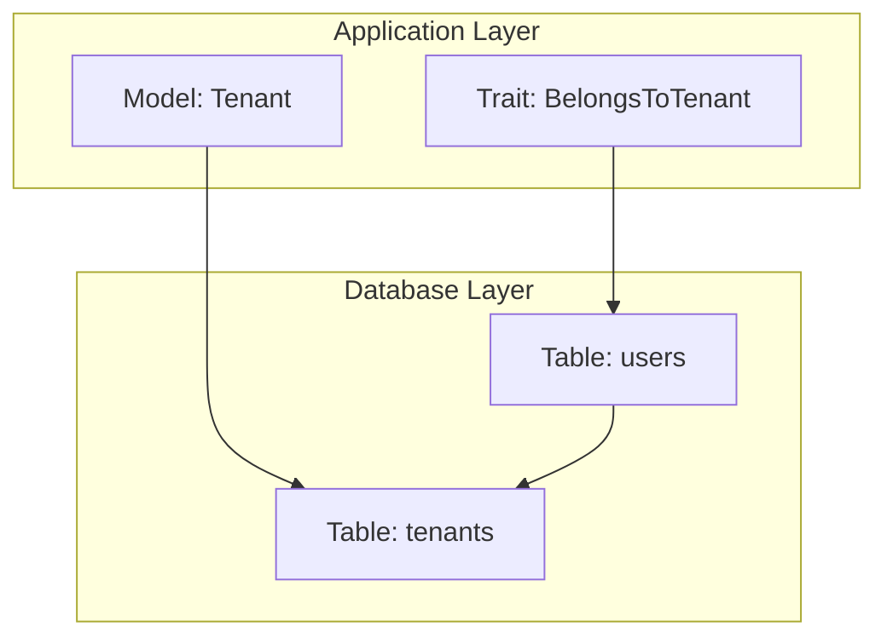
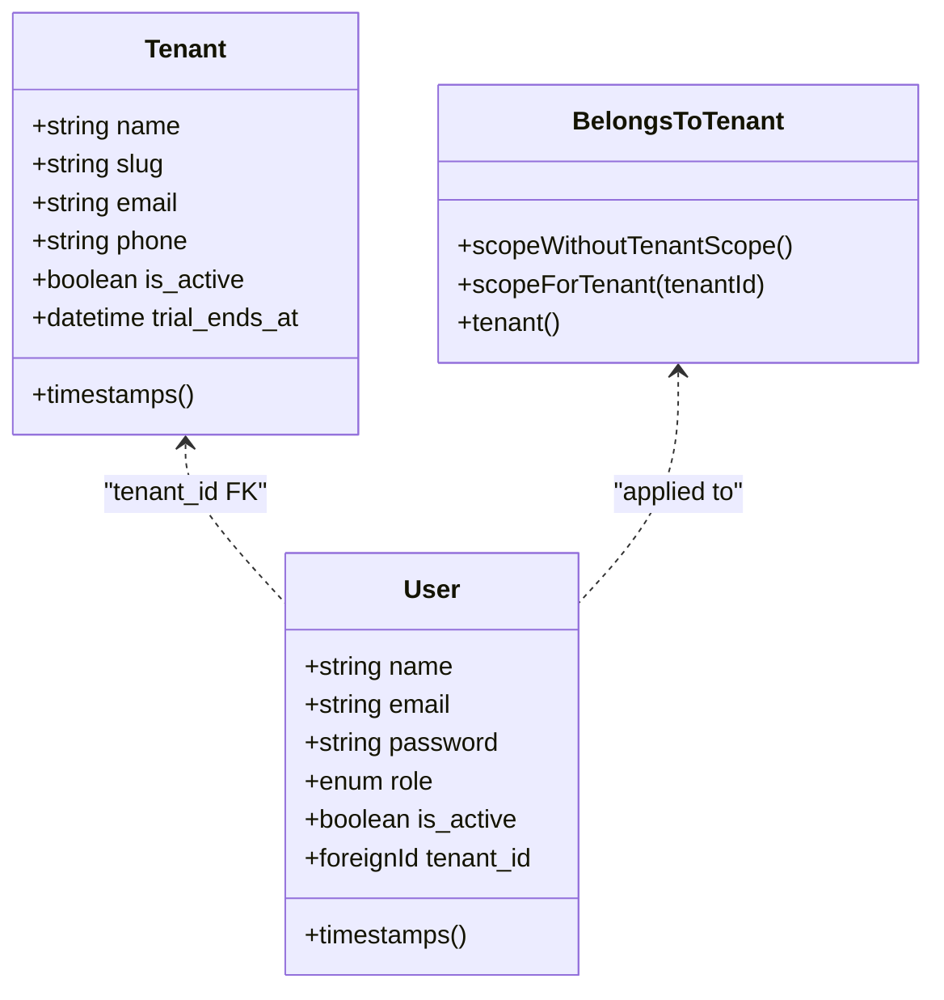
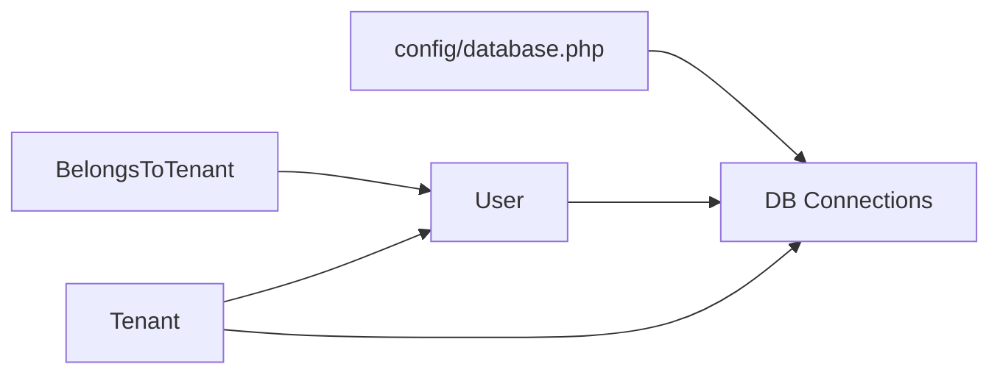
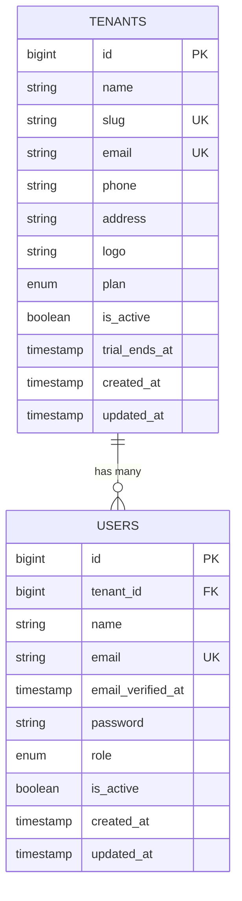

# Data Models & Database Schema

<cite>
**Referenced Files in This Document**
- [BelongsToTenant.php](file://app/Traits/BelongsToTenant.php)
- [Tenant.php](file://app/Models/Tenant.php)
- [create_tenants_table.php](file://database/migrations/0000_01_01_000000_create_tenants_table.php)
- [create_users_table.php](file://database/migrations/0001_01_01_000000_create_users_table.php)
- [database.php](file://config/database.php)
</cite>

## Table of Contents
1. [Introduction](#introduction)
2. [Project Structure](#project-structure)
3. [Core Components](#core-components)
4. [Architecture Overview](#architecture-overview)
5. [Detailed Component Analysis](#detailed-component-analysis)
6. [Dependency Analysis](#dependency-analysis)
7. [Performance Considerations](#performance-considerations)
8. [Troubleshooting Guide](#troubleshooting-guide)
9. [Conclusion](#conclusion)
10. [Appendices](#appendices)

## Introduction
This document describes the data models and database schema for Qalcuity ERP with a focus on multi-tenancy, tenant scoping, and shared lookup entities. It documents the core entities, their relationships, foreign key constraints, indexes, and tenant isolation mechanisms. It also outlines data lifecycle considerations such as soft deletes, audit trails, and data retention policies, and explains the factory patterns used for testing and seeding.

## Project Structure
Qalcuity ERP follows a Laravel-based architecture with Eloquent models, database migrations, traits for tenant scoping, and configuration for database connections. The multi-tenant design centers around a dedicated Tenant entity and a global scope applied to tenant-aware models via a trait.

**Diagram sources**
- [BelongsToTenant.php:32-108](file://app/Traits/BelongsToTenant.php#L32-L108)
- [Tenant.php:10-90](file://app/Models/Tenant.php#L10-L90)
- [create_tenants_table.php:11-23](file://database/migrations/0000_01_01_000000_create_tenants_table.php#L11-L23)
- [create_users_table.php:13-24](file://database/migrations/0001_01_01_000000_create_users_table.php#L13-L24)

**Section sources**
- [BelongsToTenant.php:32-108](file://app/Traits/BelongsToTenant.php#L32-L108)
- [Tenant.php:10-90](file://app/Models/Tenant.php#L10-L90)
- [create_tenants_table.php:11-23](file://database/migrations/0000_01_01_000000_create_tenants_table.php#L11-L23)
- [create_users_table.php:13-24](file://database/migrations/0001_01_01_000000_create_users_table.php#L13-L24)

## Core Components
- Tenant model: Represents multi-tenant organizations with subscription and module visibility controls.
- Users: Application users scoped to a tenant via foreign key and global scope.
- BelongsToTenant trait: Applies tenant scoping globally and auto-assigns tenant_id on creation.
- Database connections: Configured for SQLite, MySQL/MariaDB, PostgreSQL, and SQL Server.

Key tenant-aware model characteristics:
- All tenant-scoped models include a tenant_id column and use the BelongsToTenant trait.
- Queries automatically filter by tenant unless bypassed intentionally.
- Creation events auto-fill tenant_id from the current authenticated user.

**Section sources**
- [Tenant.php:10-90](file://app/Models/Tenant.php#L10-L90)
- [BelongsToTenant.php:32-108](file://app/Traits/BelongsToTenant.php#L32-L108)
- [create_users_table.php:13-24](file://database/migrations/0001_01_01_000000_create_users_table.php#L13-L24)

## Architecture Overview
The multi-tenant architecture enforces tenant isolation at the application level using a global scope and automatic tenant assignment. Shared entities like tenants and users are designed to support cross-tenant operations while ensuring data segregation for tenant-specific records.

**Diagram sources**
- [Tenant.php:10-90](file://app/Models/Tenant.php#L10-L90)
- [create_tenants_table.php:11-23](file://database/migrations/0000_01_01_000000_create_tenants_table.php#L11-L23)
- [create_users_table.php:13-24](file://database/migrations/0001_01_01_000000_create_users_table.php#L13-L24)
- [BelongsToTenant.php:32-108](file://app/Traits/BelongsToTenant.php#L32-L108)

## Detailed Component Analysis

### Tenant Entity
- Purpose: Stores tenant metadata, subscription plan, trial expiration, and module enablement flags.
- Fields: name, slug (unique), email (unique), phone, address, logo, plan, is_active, trial_ends_at, timestamps.
- Relationships: One-to-many with User; optional belongs to SubscriptionPlan via service logic.
- Business logic: Subscription status checks, module enablement queries, and computed limits.

Validation and constraints:
- Unique constraints on slug and email.
- Enum-like plan values enforced by application logic.
- Timestamps for created_at/updated_at.

Indexes:
- Unique indexes on slug and email.

Lifecycle:
- No soft delete column observed in the migration; lifecycle managed via is_active and plan expiry checks.

**Section sources**
- [Tenant.php:10-90](file://app/Models/Tenant.php#L10-L90)
- [create_tenants_table.php:11-23](file://database/migrations/0000_01_01_000000_create_tenants_table.php#L11-L23)

### User Entity
- Purpose: Application users scoped to a tenant.
- Fields: name, email (unique), email_verified_at, password, role (enum), is_active, rememberToken, tenant_id (FK), timestamps.
- Relationships: Belongs to Tenant; inverse of Tenant->users.
- Constraints: tenant_id is nullable to support cross-tenant contexts; constrained with nullOnDelete.

Indexes:
- Index on tenant_id for efficient filtering and joins.
- Unique index on email.

Lifecycle:
- No soft delete column observed in the migration; lifecycle managed via is_active flag.

**Section sources**
- [create_users_table.php:13-24](file://database/migrations/0001_01_01_000000_create_users_table.php#L13-L24)

### BelongsToTenant Trait
- Purpose: Enforce tenant scoping globally and auto-assign tenant_id during creation.
- Global scope: Filters all queries by tenant_id unless user is super_admin or guest.
- Creating callback: Sets tenant_id from the authenticated user if not already set.
- Bypass scopes: Provides withoutTenantScope() and forTenant(id) helpers for administrative access.

Operational behavior:
- Applied to tenant-aware models to ensure tenant isolation.
- Super admin bypass allows cross-tenant access for administrative tasks.

**Section sources**
- [BelongsToTenant.php:32-108](file://app/Traits/BelongsToTenant.php#L32-L108)

### Database Connections
- Supported drivers: sqlite, mysql, mariadb, pgsql, sqlsrv.
- Defaults configured via environment variables.
- Foreign key constraints enabled for SQLite by default.

**Section sources**
- [database.php:20](file://config/database.php#L20)
- [database.php:35-85](file://config/database.php#L35-L85)

## Dependency Analysis
The tenant model depends on the BelongsToTenant trait for scoping behavior. The User model depends on Tenant via foreign key and on the BelongsToTenant trait for tenant isolation. The database connection configuration supports multiple backends.

**Diagram sources**
- [BelongsToTenant.php:32-108](file://app/Traits/BelongsToTenant.php#L32-L108)
- [Tenant.php:10-90](file://app/Models/Tenant.php#L10-L90)
- [create_users_table.php:13-24](file://database/migrations/0001_01_01_000000_create_users_table.php#L13-L24)
- [database.php:35-85](file://config/database.php#L35-L85)

**Section sources**
- [BelongsToTenant.php:32-108](file://app/Traits/BelongsToTenant.php#L32-L108)
- [Tenant.php:10-90](file://app/Models/Tenant.php#L10-L90)
- [create_users_table.php:13-24](file://database/migrations/0001_01_01_000000_create_users_table.php#L13-L24)
- [database.php:35-85](file://config/database.php#L35-L85)

## Performance Considerations
- Tenant scoping adds a WHERE clause on tenant_id; ensure an index exists on tenant_id for optimal query performance.
- Unique indexes on slug and email for tenants reduce duplicate creation overhead.
- Consider partitioning or separate schemas for very large deployments; current design relies on row-level tenant_id filtering.
- Use withoutTenantScope() judiciously for administrative reports to avoid scanning entire datasets.

## Troubleshooting Guide
Common issues and resolutions:
- Queries returning empty results: Verify the current user’s tenant_id and role; super_admin bypass may be required for cross-tenant inspection.
- Duplicate tenant identifiers: Unique constraints on slug and email prevent duplicates; handle constraint violations gracefully.
- Cross-tenant access errors: Use scopeForTenant() or withoutTenantScope() appropriately for administrative tasks.
- Session and password reset tokens: Ensure sessions table is present for authentication persistence.

**Section sources**
- [BelongsToTenant.php:82-100](file://app/Traits/BelongsToTenant.php#L82-L100)
- [create_tenants_table.php:14-15](file://database/migrations/0000_01_01_000000_create_tenants_table.php#L14-L15)
- [create_users_table.php:32-39](file://database/migrations/0001_01_01_000000_create_users_table.php#L32-L39)

## Conclusion
Qalcuity ERP employs a robust multi-tenant design centered on the Tenant entity and enforced via the BelongsToTenant trait. Tenant scoping is automatic and secure, with explicit bypass capabilities for administrative needs. The schema supports shared entities like tenants and users while segregating tenant-specific data through tenant_id. Additional features such as audit trails and data retention policies can be layered on top of these core models.

## Appendices

### Entity Relationship Diagram (ERD)

**Diagram sources**
- [create_tenants_table.php:11-23](file://database/migrations/0000_01_01_000000_create_tenants_table.php#L11-L23)
- [create_users_table.php:13-24](file://database/migrations/0001_01_01_000000_create_users_table.php#L13-L24)

### Field Definitions and Validation Rules
- Tenants
  - name: required, string
  - slug: required, unique
  - email: required, unique
  - phone: nullable, string
  - address: nullable, string
  - logo: nullable, string
  - plan: enum with values ['trial','basic','pro','enterprise']
  - is_active: boolean, default true
  - trial_ends_at: datetime, nullable
  - timestamps: created_at, updated_at

- Users
  - name: required, string
  - email: required, unique
  - email_verified_at: datetime, nullable
  - password: required, string
  - role: enum with values ['super_admin','admin','manager','staff'], default 'staff'
  - is_active: boolean, default true
  - tenant_id: nullable bigint, FK to tenants.id with nullOnDelete
  - timestamps: created_at, updated_at

Constraints and indexes:
- Unique constraints: tenants.slug, tenants.email; users.email
- Indexes: users.tenant_id

**Section sources**
- [create_tenants_table.php:11-23](file://database/migrations/0000_01_01_000000_create_tenants_table.php#L11-L23)
- [create_users_table.php:13-24](file://database/migrations/0001_01_01_000000_create_users_table.php#L13-L24)

### Data Lifecycle Management
- Soft deletes: Not observed in core tenant or user migrations; lifecycle managed via is_active and plan expiry checks.
- Audit trails: Tenant model uses AuditsChanges trait; additional audit logging can be implemented per domain model.
- Data retention: Retention policies can be configured via configuration files and scheduled cleanup jobs; implement purging commands for old audit logs and temporary data.

**Section sources**
- [Tenant.php:12](file://app/Models/Tenant.php#L12)
- [database.php:20](file://config/database.php#L20)

### Factory Patterns for Testing and Seeding
- Factories: Located under database/factories; used to generate test data for models.
- Seeders: Under database/seeders; used to populate initial data for development and testing environments.
- Integration: Combine factories and seeders to bootstrap tenant and user data for multi-tenant tests.

Note: Specific factory and seeder implementations are located under database/factories and database/seeders respectively.

**Section sources**
- [database.php:20](file://config/database.php#L20)