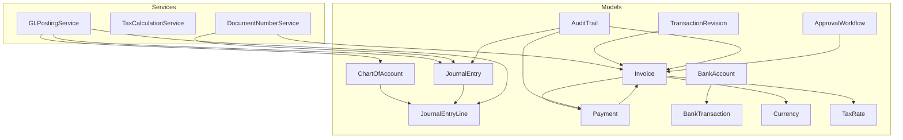
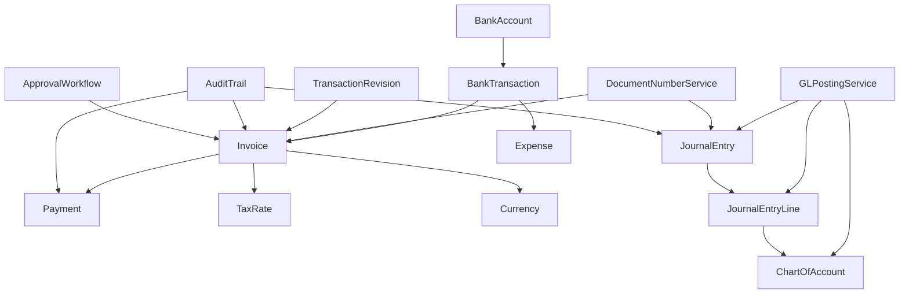
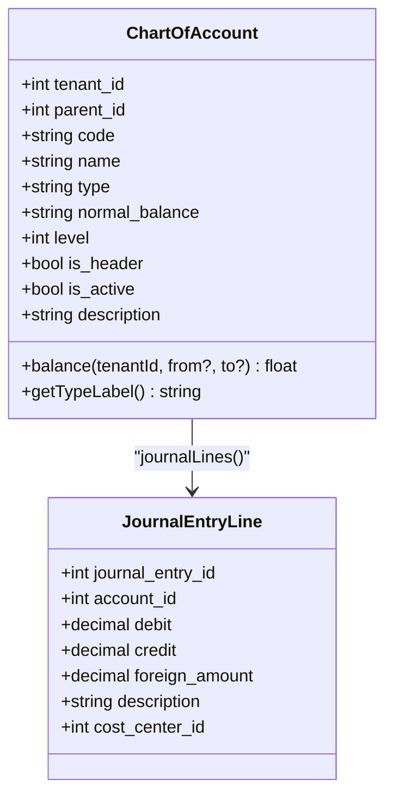
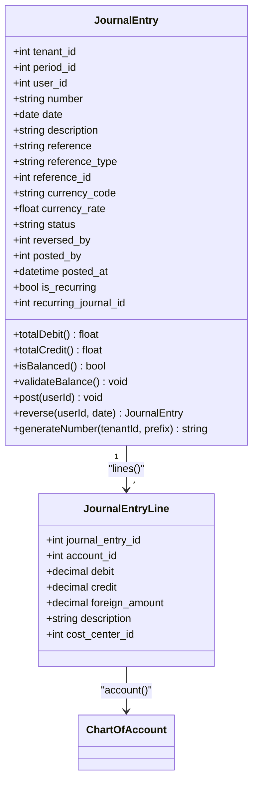
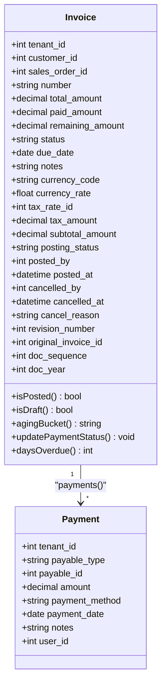
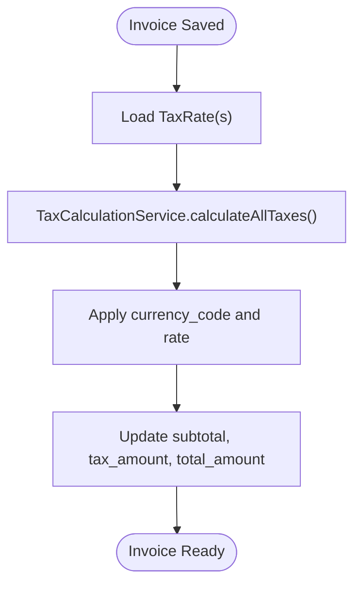
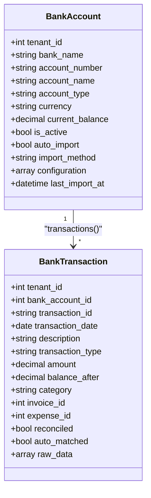
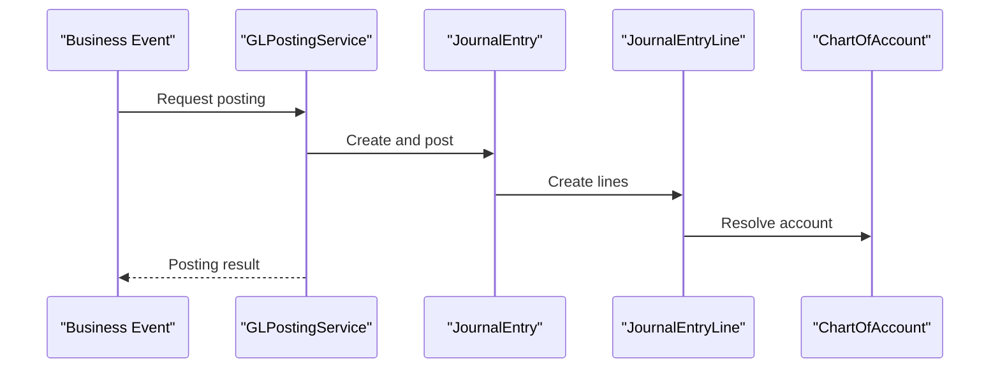
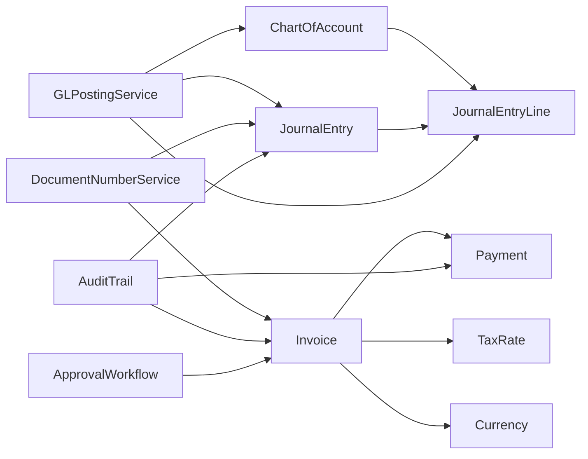
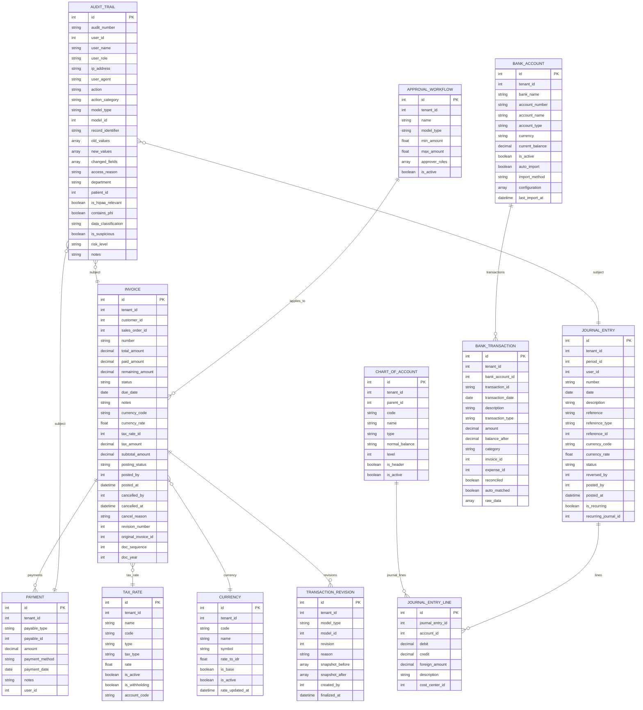

# Financial Entities

<cite>
**Referenced Files in This Document**
- [ChartOfAccount.php](file://app/Models/ChartOfAccount.php)
- [JournalEntry.php](file://app/Models/JournalEntry.php)
- [JournalEntryLine.php](file://app/Models/JournalEntryLine.php)
- [Invoice.php](file://app/Models/Invoice.php)
- [Payment.php](file://app/Models/Payment.php)
- [BankAccount.php](file://app/Models/BankAccount.php)
- [BankTransaction.php](file://app/Models/BankTransaction.php)
- [TaxRate.php](file://app/Models/TaxRate.php)
- [Currency.php](file://app/Models/Currency.php)
- [GLPostingService.php](file://app/Services/GLPostingService.php)
- [TaxCalculationService.php](file://app/Services/TaxCalculationService.php)
- [DocumentNumberService.php](file://app/Services/DocumentNumberService.php)
- [TransactionRevision.php](file://app/Models/TransactionRevision.php)
- [AuditTrail.php](file://app/Models/AuditTrail.php)
- [ApprovalWorkflow.php](file://app/Models/ApprovalWorkflow.php)
</cite>

## Table of Contents
1. [Introduction](#introduction)
2. [Project Structure](#project-structure)
3. [Core Components](#core-components)
4. [Architecture Overview](#architecture-overview)
5. [Detailed Component Analysis](#detailed-component-analysis)
6. [Dependency Analysis](#dependency-analysis)
7. [Performance Considerations](#performance-considerations)
8. [Troubleshooting Guide](#troubleshooting-guide)
9. [Conclusion](#conclusion)
10. [Appendices](#appendices)

## Introduction
This document provides comprehensive data model documentation for Qalcuity ERP’s financial domain. It covers:
- ChartOfAccount for accounting classifications and hierarchy
- JournalEntry and JournalEntryLine for double-entry bookkeeping, validation, and posting rules
- Invoice and Payment models with multi-currency support and tax calculations
- BankAccount and BankTransaction for banking integration and reconciliation
- Financial workflow patterns, approval chains, and audit trail requirements

The goal is to enable both technical and non-technical stakeholders to understand how financial data is modeled, validated, posted, reconciled, and audited.

## Project Structure
The financial models and services are organized under app/Models and app/Services. Key modules include:
- Chart of Accounts and GL posting engine
- Journal entries and lines with validation hooks
- Invoicing, payments, and tax calculation
- Banking integration and reconciliation
- Document numbering and revision controls
- Audit trails and approvals

**Diagram sources**
- [ChartOfAccount.php:14-84](file://app/Models/ChartOfAccount.php#L14-L84)
- [JournalEntry.php:13-163](file://app/Models/JournalEntry.php#L13-L163)
- [JournalEntryLine.php:8-90](file://app/Models/JournalEntryLine.php#L8-L90)
- [Invoice.php:13-182](file://app/Models/Invoice.php#L13-L182)
- [Payment.php:12-48](file://app/Models/Payment.php#L12-L48)
- [BankAccount.php:10-45](file://app/Models/BankAccount.php#L10-L45)
- [BankTransaction.php:10-56](file://app/Models/BankTransaction.php#L10-L56)
- [TransactionRevision.php:17-53](file://app/Models/TransactionRevision.php#L17-L53)
- [AuditTrail.php:8-244](file://app/Models/AuditTrail.php#L8-L244)
- [ApprovalWorkflow.php:9-32](file://app/Models/ApprovalWorkflow.php#L9-L32)
- [Currency.php:14-99](file://app/Models/Currency.php#L14-L99)
- [TaxRate.php:9-25](file://app/Models/TaxRate.php#L9-L25)
- [GLPostingService.php:26-996](file://app/Services/GLPostingService.php#L26-L996)
- [TaxCalculationService.php:29-306](file://app/Services/TaxCalculationService.php#L29-L306)
- [DocumentNumberService.php:27-132](file://app/Services/DocumentNumberService.php#L27-L132)

**Section sources**
- [ChartOfAccount.php:14-84](file://app/Models/ChartOfAccount.php#L14-L84)
- [JournalEntry.php:13-163](file://app/Models/JournalEntry.php#L13-L163)
- [JournalEntryLine.php:8-90](file://app/Models/JournalEntryLine.php#L8-L90)
- [Invoice.php:13-182](file://app/Models/Invoice.php#L13-L182)
- [Payment.php:12-48](file://app/Models/Payment.php#L12-L48)
- [BankAccount.php:10-45](file://app/Models/BankAccount.php#L10-L45)
- [BankTransaction.php:10-56](file://app/Models/BankTransaction.php#L10-L56)
- [GLPostingService.php:26-996](file://app/Services/GLPostingService.php#L26-L996)
- [TaxCalculationService.php:29-306](file://app/Services/TaxCalculationService.php#L29-L306)
- [DocumentNumberService.php:27-132](file://app/Services/DocumentNumberService.php#L27-L132)
- [TransactionRevision.php:17-53](file://app/Models/TransactionRevision.php#L17-L53)
- [AuditTrail.php:8-244](file://app/Models/AuditTrail.php#L8-L244)
- [ApprovalWorkflow.php:9-32](file://app/Models/ApprovalWorkflow.php#L9-L32)
- [Currency.php:14-99](file://app/Models/Currency.php#L14-L99)
- [TaxRate.php:9-25](file://app/Models/TaxRate.php#L9-L25)

## Core Components
This section introduces the primary financial models and their responsibilities.

- ChartOfAccount
  - Purpose: Defines the chart of accounts hierarchy and classification.
  - Key attributes: tenant association, parent-child relationship, code/name/type, normal balance direction, header flag, activity flag, and description.
  - Behavior: Computes balances over a date range filtered by posted journal entries and normal balance direction.

- JournalEntry
  - Purpose: Represents a ledger voucher with debits and credits.
  - Key attributes: tenant, period, user, number, date, description, references, currency, status, and posting metadata.
  - Validation: Ensures balanced entries and minimum presence of both debit and credit lines before posting.
  - Posting: Transitions status to posted and records who posted and when.

- JournalEntryLine
  - Purpose: Lines composing a journal entry with account mapping and amounts.
  - Validation: Triggers model-level checks to warn when a draft journal becomes imbalanced.

- Invoice
  - Purpose: Sales invoice with multi-currency support and tax computation.
  - State machine: Draft/posted/cancelled/voided with posting metadata and revision linkage.
  - Aging: Bucket calculation based on due date.
  - Payments: Tracks linked payments and recomputes paid/remaining status.

- Payment
  - Purpose: Payment application against invoices or other payables via polymorphic relations.
  - Attributes: amount, method, date, notes, and user.

- BankAccount
  - Purpose: Bank account master with currency, current balance, auto-import settings, and configuration.
  - Transactions: Links to BankTransaction records for reconciliation.

- BankTransaction
  - Purpose: Imported or matched bank transaction with reconciliation flags and optional invoice/expense linkage.

- TaxRate
  - Purpose: Defines tax types and rates used in tax calculations.

- Currency
  - Purpose: Exchange rate management with staleness detection and conversion helpers.

- GLPostingService
  - Purpose: Automates posting of journal entries from business events (sales orders, invoices, purchases, expenses, etc.) using predefined COA codes.

- TaxCalculationService
  - Purpose: Calculates taxes comprehensively, supporting multiple tax types, withholding taxes, inclusive/exclusive pricing, and Indonesian tax law specifics.

- DocumentNumberService
  - Purpose: Centralized, sequential document numbering with locking to prevent race conditions.

- TransactionRevision
  - Purpose: Immutable snapshots for posted transactions requiring change control.

- AuditTrail
  - Purpose: Comprehensive audit logging with filtering scopes, risk scoring, and formatting helpers.

- ApprovalWorkflow
  - Purpose: Configurable approval chains for financial thresholds and model types.

**Section sources**
- [ChartOfAccount.php:14-84](file://app/Models/ChartOfAccount.php#L14-L84)
- [JournalEntry.php:13-163](file://app/Models/JournalEntry.php#L13-L163)
- [JournalEntryLine.php:8-90](file://app/Models/JournalEntryLine.php#L8-L90)
- [Invoice.php:13-182](file://app/Models/Invoice.php#L13-L182)
- [Payment.php:12-48](file://app/Models/Payment.php#L12-L48)
- [BankAccount.php:10-45](file://app/Models/BankAccount.php#L10-L45)
- [BankTransaction.php:10-56](file://app/Models/BankTransaction.php#L10-L56)
- [TaxRate.php:9-25](file://app/Models/TaxRate.php#L9-L25)
- [Currency.php:14-99](file://app/Models/Currency.php#L14-L99)
- [GLPostingService.php:26-996](file://app/Services/GLPostingService.php#L26-L996)
- [TaxCalculationService.php:29-306](file://app/Services/TaxCalculationService.php#L29-L306)
- [DocumentNumberService.php:27-132](file://app/Services/DocumentNumberService.php#L27-L132)
- [TransactionRevision.php:17-53](file://app/Models/TransactionRevision.php#L17-L53)
- [AuditTrail.php:8-244](file://app/Models/AuditTrail.php#L8-L244)
- [ApprovalWorkflow.php:9-32](file://app/Models/ApprovalWorkflow.php#L9-L32)

## Architecture Overview
The financial architecture centers around:
- Double-entry bookkeeping via JournalEntry and JournalEntryLine
- Business event-driven GL postings via GLPostingService
- Invoice lifecycle with tax and payment tracking
- Multi-currency and exchange rate management
- Bank reconciliation through BankAccount and BankTransaction
- Audit and approvals for governance

**Diagram sources**
- [Invoice.php:13-182](file://app/Models/Invoice.php#L13-L182)
- [Payment.php:12-48](file://app/Models/Payment.php#L12-L48)
- [TaxRate.php:9-25](file://app/Models/TaxRate.php#L9-L25)
- [Currency.php:14-99](file://app/Models/Currency.php#L14-L99)
- [GLPostingService.php:26-996](file://app/Services/GLPostingService.php#L26-L996)
- [JournalEntry.php:13-163](file://app/Models/JournalEntry.php#L13-L163)
- [JournalEntryLine.php:8-90](file://app/Models/JournalEntryLine.php#L8-L90)
- [ChartOfAccount.php:14-84](file://app/Models/ChartOfAccount.php#L14-L84)
- [BankAccount.php:10-45](file://app/Models/BankAccount.php#L10-L45)
- [BankTransaction.php:10-56](file://app/Models/BankTransaction.php#L10-L56)
- [DocumentNumberService.php:27-132](file://app/Services/DocumentNumberService.php#L27-L132)
- [TransactionRevision.php:17-53](file://app/Models/TransactionRevision.php#L17-L53)
- [AuditTrail.php:8-244](file://app/Models/AuditTrail.php#L8-L244)
- [ApprovalWorkflow.php:9-32](file://app/Models/ApprovalWorkflow.php#L9-L32)

## Detailed Component Analysis

### ChartOfAccount Model
- Responsibilities
  - Hierarchical account classification (asset/liability/equity/revenue/expense)
  - Parent-child relationships for grouping
  - Balance computation filtered by posted journal entries and date range
  - Type labeling for localization

- Data Fields
  - Identification: tenant_id, parent_id, code, name
  - Classification: type, normal_balance, level, is_header, is_active
  - Metadata: description

- Relationships
  - Tenant association
  - Self-referencing parent/children
  - Journal lines linkage

- Balance Computation
  - Sums posted journal lines’ debit and credit
  - Applies normal_balance direction to compute net balance
  - Filters by tenant and optional date window

**Diagram sources**
- [ChartOfAccount.php:14-84](file://app/Models/ChartOfAccount.php#L14-L84)
- [JournalEntryLine.php:8-90](file://app/Models/JournalEntryLine.php#L8-L90)

**Section sources**
- [ChartOfAccount.php:14-84](file://app/Models/ChartOfAccount.php#L14-L84)

### JournalEntry and JournalEntryLine
- JournalEntry
  - Attributes: tenant, period, user, number, date, description, references, currency, status, posting metadata
  - Validation: totalDebit vs totalCredit equality and presence of both debit and credit lines
  - Posting: sets status to posted and records poster and timestamp
  - Reversal: creates reversing journal with swapped debit/credit per line
  - Numbering: delegates to DocumentNumberService

- JournalEntryLine
  - Attributes: journal_entry_id, account_id, debit, credit, foreign_amount, description, cost_center_id
  - Validation: model boot triggers to warn when draft journals become imbalanced

**Diagram sources**
- [JournalEntry.php:13-163](file://app/Models/JournalEntry.php#L13-L163)
- [JournalEntryLine.php:8-90](file://app/Models/JournalEntryLine.php#L8-L90)
- [ChartOfAccount.php:14-84](file://app/Models/ChartOfAccount.php#L14-L84)

**Section sources**
- [JournalEntry.php:13-163](file://app/Models/JournalEntry.php#L13-L163)
- [JournalEntryLine.php:8-90](file://app/Models/JournalEntryLine.php#L8-L90)

### Invoice and Payment
- Invoice
  - Attributes: tenant, customer, sales order, number, totals, status, due date, notes, currency, tax rate, tax amount, subtotal, posting state, revisions, numbering fields
  - State machine: draft/posted/cancelled/voided with badges and labels
  - Aging: bucketing logic based on days overdue
  - Payments: morphMany to Payment; recomputes paid/remaining and status

- Payment
  - Attributes: tenant, payable polymorphic target, amount, method, date, notes, user
  - Polymorphic: supports linking to Invoice or other payables

**Diagram sources**
- [Invoice.php:13-182](file://app/Models/Invoice.php#L13-L182)
- [Payment.php:12-48](file://app/Models/Payment.php#L12-L48)

**Section sources**
- [Invoice.php:13-182](file://app/Models/Invoice.php#L13-L182)
- [Payment.php:12-48](file://app/Models/Payment.php#L12-L48)

### Multi-Currency and Tax Support
- Currency
  - Provides conversions to/from IDR and staleness detection for exchange rates
  - Thresholds for stale warnings and critical alerts

- TaxRate
  - Stores tax type, rate, and flags for withholding and activity

- TaxCalculationService
  - Calculates taxes comprehensively, including PPN (VAT), PPh (withholding), tax-inclusive scenarios, and combined tax outcomes
  - Rounds using accounting rounding rules

- Invoice
  - Carries currency_code and currency_rate alongside monetary fields
  - Uses tax_rate_id and computed tax_amount

**Diagram sources**
- [TaxCalculationService.php:29-306](file://app/Services/TaxCalculationService.php#L29-L306)
- [TaxRate.php:9-25](file://app/Models/TaxRate.php#L9-L25)
- [Invoice.php:13-182](file://app/Models/Invoice.php#L13-L182)
- [Currency.php:14-99](file://app/Models/Currency.php#L14-L99)

**Section sources**
- [Currency.php:14-99](file://app/Models/Currency.php#L14-L99)
- [TaxRate.php:9-25](file://app/Models/TaxRate.php#L9-L25)
- [TaxCalculationService.php:29-306](file://app/Services/TaxCalculationService.php#L29-L306)
- [Invoice.php:13-182](file://app/Models/Invoice.php#L13-L182)

### BankAccount and BankTransaction
- BankAccount
  - Master data for bank accounts with currency, current balance, auto-import flags, and configuration
  - Transactions relationship for reconciliation

- BankTransaction
  - Imported or matched transaction with amount, balance, category, and reconciliation flags
  - Optional links to Invoice and Expense for matching

**Diagram sources**
- [BankAccount.php:10-45](file://app/Models/BankAccount.php#L10-L45)
- [BankTransaction.php:10-56](file://app/Models/BankTransaction.php#L10-L56)

**Section sources**
- [BankAccount.php:10-45](file://app/Models/BankAccount.php#L10-L45)
- [BankTransaction.php:10-56](file://app/Models/BankTransaction.php#L10-L56)

### Financial Workflow Patterns, Approvals, and Audit Trail
- GL Posting Engine
  - GLPostingService posts journal entries for numerous business events (sales orders, invoices, purchase receipts/payments, expenses, consignment, etc.)
  - Uses predefined COA codes and returns structured results for caller handling

- Document Numbering
  - DocumentNumberService centralizes sequential numbering with DB locks to avoid race conditions

- Transaction Revisions
  - TransactionRevision captures immutable snapshots for posted transactions requiring change control

- Audit Trail
  - AuditTrail logs actions with rich metadata, filtering scopes, risk levels, and formatting helpers

- Approvals
  - ApprovalWorkflow defines configurable approval chains by model type and amount thresholds

**Diagram sources**
- [GLPostingService.php:26-996](file://app/Services/GLPostingService.php#L26-L996)
- [JournalEntry.php:13-163](file://app/Models/JournalEntry.php#L13-L163)
- [JournalEntryLine.php:8-90](file://app/Models/JournalEntryLine.php#L8-L90)
- [ChartOfAccount.php:14-84](file://app/Models/ChartOfAccount.php#L14-L84)

**Section sources**
- [GLPostingService.php:26-996](file://app/Services/GLPostingService.php#L26-L996)
- [DocumentNumberService.php:27-132](file://app/Services/DocumentNumberService.php#L27-L132)
- [TransactionRevision.php:17-53](file://app/Models/TransactionRevision.php#L17-L53)
- [AuditTrail.php:8-244](file://app/Models/AuditTrail.php#L8-L244)
- [ApprovalWorkflow.php:9-32](file://app/Models/ApprovalWorkflow.php#L9-L32)

## Dependency Analysis
- Cohesion and Coupling
  - ChartOfAccount is cohesive around classification and balance computation
  - JournalEntry/JournalEntryLine enforce double-entry integrity with tight coupling
  - Invoice/Payment form a cohesive invoicing/payment loop
  - GLPostingService orchestrates posting across multiple models
  - TaxCalculationService and Currency encapsulate financial computation concerns
  - AuditTrail and ApprovalWorkflow provide cross-cutting governance

- External Dependencies
  - DocumentNumberService depends on centralized sequences
  - GLPostingService depends on COA codes and periods

**Diagram sources**
- [ChartOfAccount.php:14-84](file://app/Models/ChartOfAccount.php#L14-L84)
- [JournalEntry.php:13-163](file://app/Models/JournalEntry.php#L13-L163)
- [JournalEntryLine.php:8-90](file://app/Models/JournalEntryLine.php#L8-L90)
- [Invoice.php:13-182](file://app/Models/Invoice.php#L13-L182)
- [Payment.php:12-48](file://app/Models/Payment.php#L12-L48)
- [TaxRate.php:9-25](file://app/Models/TaxRate.php#L9-L25)
- [Currency.php:14-99](file://app/Models/Currency.php#L14-L99)
- [GLPostingService.php:26-996](file://app/Services/GLPostingService.php#L26-L996)
- [DocumentNumberService.php:27-132](file://app/Services/DocumentNumberService.php#L27-L132)
- [AuditTrail.php:8-244](file://app/Models/AuditTrail.php#L8-L244)
- [ApprovalWorkflow.php:9-32](file://app/Models/ApprovalWorkflow.php#L9-L32)

**Section sources**
- [ChartOfAccount.php:14-84](file://app/Models/ChartOfAccount.php#L14-L84)
- [JournalEntry.php:13-163](file://app/Models/JournalEntry.php#L13-L163)
- [JournalEntryLine.php:8-90](file://app/Models/JournalEntryLine.php#L8-L90)
- [Invoice.php:13-182](file://app/Models/Invoice.php#L13-L182)
- [Payment.php:12-48](file://app/Models/Payment.php#L12-L48)
- [TaxRate.php:9-25](file://app/Models/TaxRate.php#L9-L25)
- [Currency.php:14-99](file://app/Models/Currency.php#L14-L99)
- [GLPostingService.php:26-996](file://app/Services/GLPostingService.php#L26-L996)
- [DocumentNumberService.php:27-132](file://app/Services/DocumentNumberService.php#L27-L132)
- [AuditTrail.php:8-244](file://app/Models/AuditTrail.php#L8-L244)
- [ApprovalWorkflow.php:9-32](file://app/Models/ApprovalWorkflow.php#L9-L32)

## Performance Considerations
- Journal balancing
  - Prefer validating balance before posting to avoid costly corrections later
  - Use decimal casting for monetary fields to minimize floating-point errors

- Exchange rate staleness
  - Monitor Currency staleness thresholds to prevent outdated rates from skewing financial reporting

- Numbering
  - Centralized document numbering uses DB locks; batch generation where possible to reduce contention

- Reconciliation
  - Index BankTransaction fields frequently used in matching and reconciliation queries

[No sources needed since this section provides general guidance]

## Troubleshooting Guide
- JournalEntry imbalance
  - Symptom: Posting fails with balance mismatch
  - Resolution: Ensure equal total debit and credit; verify at least one debit and one credit line exist

- Stale exchange rates
  - Symptom: Currency staleness warnings or critical alerts
  - Resolution: Refresh rates or flag exceptions per policy

- Audit trail anomalies
  - Symptom: Suspicious activity flagged
  - Resolution: Review risk levels, changed fields, and access patterns; escalate as needed

- Approval workflow not triggering
  - Symptom: Transactions bypassing approvals
  - Resolution: Verify ApprovalWorkflow thresholds and active flags for the relevant model type

**Section sources**
- [JournalEntry.php:83-105](file://app/Models/JournalEntry.php#L83-L105)
- [Currency.php:50-98](file://app/Models/Currency.php#L50-L98)
- [AuditTrail.php:196-243](file://app/Models/AuditTrail.php#L196-L243)
- [ApprovalWorkflow.php:26-31](file://app/Models/ApprovalWorkflow.php#L26-L31)

## Conclusion
Qalcuity ERP’s financial models provide a robust foundation for accounting, invoicing, payments, and banking reconciliation. The design emphasizes:
- Double-entry integrity via JournalEntry and JournalEntryLine
- Automated GL posting from business events
- Multi-currency and tax-aware invoicing
- Strong governance through audit trails, approvals, and document numbering
- Practical reconciliation support via BankAccount and BankTransaction

These components work together to ensure accurate, auditable, and scalable financial operations.

[No sources needed since this section summarizes without analyzing specific files]

## Appendices

### Data Model Diagram

**Diagram sources**
- [ChartOfAccount.php:14-84](file://app/Models/ChartOfAccount.php#L14-L84)
- [JournalEntry.php:13-163](file://app/Models/JournalEntry.php#L13-L163)
- [JournalEntryLine.php:8-90](file://app/Models/JournalEntryLine.php#L8-L90)
- [Invoice.php:13-182](file://app/Models/Invoice.php#L13-L182)
- [Payment.php:12-48](file://app/Models/Payment.php#L12-L48)
- [BankAccount.php:10-45](file://app/Models/BankAccount.php#L10-L45)
- [BankTransaction.php:10-56](file://app/Models/BankTransaction.php#L10-L56)
- [TaxRate.php:9-25](file://app/Models/TaxRate.php#L9-L25)
- [Currency.php:14-99](file://app/Models/Currency.php#L14-L99)
- [TransactionRevision.php:17-53](file://app/Models/TransactionRevision.php#L17-L53)
- [AuditTrail.php:8-244](file://app/Models/AuditTrail.php#L8-L244)
- [ApprovalWorkflow.php:9-32](file://app/Models/ApprovalWorkflow.php#L9-L32)