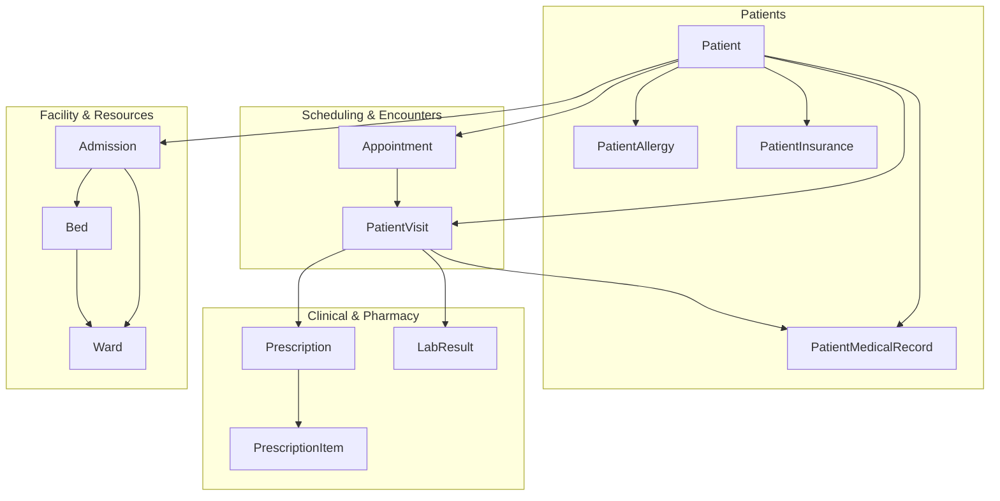
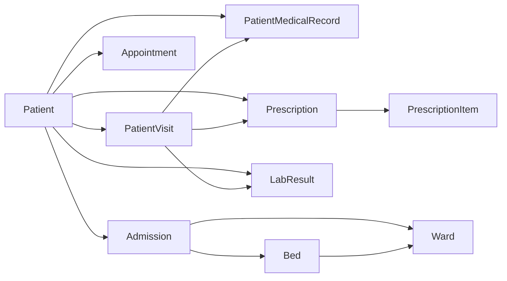

# Healthcare Entities

<cite>
**Referenced Files in This Document**
- [Patient.php](file://app/Models/Patient.php)
- [PatientAllergy.php](file://app/Models/PatientAllergy.php)
- [PatientInsurance.php](file://app/Models/PatientInsurance.php)
- [PatientMedicalRecord.php](file://app/Models/PatientMedicalRecord.php)
- [Appointment.php](file://app/Models/Appointment.php)
- [PatientVisit.php](file://app/Models/PatientVisit.php)
- [Prescription.php](file://app/Models/Prescription.php)
- [PrescriptionItem.php](file://app/Models/PrescriptionItem.php)
- [LabResult.php](file://app/Models/LabResult.php)
- [Bed.php](file://app/Models/Bed.php)
- [Ward.php](file://app/Models/Ward.php)
- [Admission.php](file://app/Models/Admission.php)
</cite>

## Table of Contents
1. [Introduction](#introduction)
2. [Project Structure](#project-structure)
3. [Core Components](#core-components)
4. [Architecture Overview](#architecture-overview)
5. [Detailed Component Analysis](#detailed-component-analysis)
6. [Dependency Analysis](#dependency-analysis)
7. [Performance Considerations](#performance-considerations)
8. [Troubleshooting Guide](#troubleshooting-guide)
9. [Conclusion](#conclusion)

## Introduction
This document describes the healthcare data models in Qalcuity ERP, focusing on patient-centric workflows, scheduling, clinical documentation, pharmacy/pharmacy-like processes, laboratory results, and facility/resource management. It consolidates entity definitions, relationships, and operational behaviors to support system design, development, and compliance.

## Project Structure
The healthcare domain is primarily implemented under the Models namespace. Key entities include:
- Patient and related demographics/insurance/allergies
- Scheduling (Appointment) and encounter (PatientVisit)
- Clinical documentation (PatientMedicalRecord)
- Pharmacy/pharmacy-like (Prescription and PrescriptionItem)
- Laboratory (LabResult)
- Facility/resource management (Ward and Bed, plus Admission)



**Diagram sources**
- [Patient.php:288-350](file://app/Models/Patient.php#L288-L350)
- [PatientAllergy.php:96-109](file://app/Models/PatientAllergy.php#L96-L109)
- [PatientInsurance.php:226-230](file://app/Models/PatientInsurance.php#L226-L230)
- [PatientMedicalRecord.php:214-235](file://app/Models/PatientMedicalRecord.php#L214-L235)
- [Appointment.php:250-303](file://app/Models/Appointment.php#L250-L303)
- [PatientVisit.php:224-267](file://app/Models/PatientVisit.php#L224-L267)
- [Prescription.php:132-169](file://app/Models/Prescription.php#L132-L169)
- [PrescriptionItem.php:92-97](file://app/Models/PrescriptionItem.php#L92-L97)
- [LabResult.php:42-70](file://app/Models/LabResult.php#L42-L70)
- [Ward.php:94-131](file://app/Models/Ward.php#L94-L131)
- [Bed.php:118-139](file://app/Models/Bed.php#L118-L139)
- [Admission.php:176-205](file://app/Models/Admission.php#L176-L205)

**Section sources**
- [Patient.php:14-63](file://app/Models/Patient.php#L14-L63)
- [Appointment.php:13-45](file://app/Models/Appointment.php#L13-L45)
- [PatientVisit.php:13-47](file://app/Models/PatientVisit.php#L13-L47)
- [Prescription.php:13-28](file://app/Models/Prescription.php#L13-L28)
- [LabResult.php:13-31](file://app/Models/LabResult.php#L13-L31)
- [Ward.php:13-30](file://app/Models/Ward.php#L13-L30)
- [Bed.php:13-26](file://app/Models/Bed.php#L13-L26)
- [Admission.php:14-46](file://app/Models/Admission.php#L14-L46)

## Core Components
This section outlines the principal entities and their roles.

- Patient
  - Stores demographics, emergency contacts, photo/document paths, blacklist flags, and core medical attributes.
  - Provides computed attributes (age, blood type with emoji, full address, patient category).
  - Scopes for active/search/blood type/allergies/chronic conditions/age range.
  - Relations to visits, appointments, medical records, allergies, insurances, prescriptions, lab orders, admissions, and bills.
  - Utility methods to increment visit/admission counts.

- PatientAllergy
  - Tracks allergens, severity, reactions, diagnosis metadata, verification, and activity status.
  - Scopes for active/severe/verified/allergen search.
  - Relations to patient and diagnosing user.

- PatientInsurance
  - Manages insurance plans, coverage limits, deductibles, copays, effective/expiry dates, and claim stats.
  - Scopes for active/valid/expiring soon/primary/provider.
  - Methods to compute copay/coverage, verify, deactivate, and set as primary.

- PatientMedicalRecord
  - Captures chief complaint, history, vitals, examination, diagnosis, treatment plan, medications, procedures, follow-up, and signature metadata.
  - Computed BMI and categories; abnormal vitals detection.
  - Scopes for follow-up due/completed/emergency.
  - Relations to patient, doctor, and visit; supports completion with signature.

- Appointment
  - Scheduling entity with auto-generated appointment numbers, date/time, duration, type, urgency, reminders, and lifecycle timestamps.
  - Status transitions: scheduled → confirmed → checked_in → in_progress → completed; cancellation/no-show handling.
  - Scopes for today/upcoming/date range/status/doctor/patient; reminder pending queries.

- PatientVisit
  - Encounter record with auto-generated visit numbers, queue tracking, chief complaint, diagnoses, outcomes, charges, and follow-up.
  - Computed durations and wait times.
  - Status transitions and scopes for today/date range/status/type/waiting/follow-up.

- Prescription and PrescriptionItem
  - Prescription: auto-numbered, diagnosis summary, validity, dispensing status, and relations to visit/patient/doctor/dispenser/items.
  - PrescriptionItem: medicine details, dosage, route, duration, quantities, dispensing state.

- LabResult
  - Test results linked to orders/tests/patients/visits/equipment/verification.
  - Casts for numeric ranges and arrays.

- Ward and Bed
  - Ward: capacity, occupancy, facilities, head nurse/supervisor, availability stats.
  - Bed: availability, type, daily rate, current patient/admission, cleaning metadata.

- Admission
  - Inpatient admission with auto-numbering, admission/discharge transfers, isolation, costs, and bed release/cleaning.

**Section sources**
- [Patient.php:14-63](file://app/Models/Patient.php#L14-L63)
- [PatientAllergy.php:12-31](file://app/Models/PatientAllergy.php#L12-L31)
- [PatientInsurance.php:12-56](file://app/Models/PatientInsurance.php#L12-L56)
- [PatientMedicalRecord.php:13-49](file://app/Models/PatientMedicalRecord.php#L13-L49)
- [Appointment.php:13-57](file://app/Models/Appointment.php#L13-L57)
- [PatientVisit.php:13-58](file://app/Models/PatientVisit.php#L13-L58)
- [Prescription.php:13-35](file://app/Models/Prescription.php#L13-L35)
- [PrescriptionItem.php:12-35](file://app/Models/PrescriptionItem.php#L12-L35)
- [LabResult.php:13-40](file://app/Models/LabResult.php#L13-L40)
- [Ward.php:13-39](file://app/Models/Ward.php#L13-L39)
- [Bed.php:13-32](file://app/Models/Bed.php#L13-L32)
- [Admission.php:14-58](file://app/Models/Admission.php#L14-L58)

## Architecture Overview
The healthcare data model centers around Patient as the core entity, with tightly coupled relationships to scheduling, encounters, clinical documentation, pharmacy/pharmacy-like workflows, labs, and facility/resource management.

```mermaid
classDiagram
class Patient {
+increments visits/admissions
+computed age/blood_type/address
+scopes(search, age-range, etc.)
}
class PatientAllergy
class PatientInsurance
class PatientMedicalRecord
class Appointment
class PatientVisit
class Prescription
class PrescriptionItem
class LabResult
class Ward
class Bed
class Admission
Patient "1" -- "many" PatientAllergy : "has"
Patient "1" -- "many" PatientInsurance : "has"
Patient "1" -- "many" PatientMedicalRecord : "has"
Patient "1" -- "many" Appointment : "has"
Patient "1" -- "many" PatientVisit : "has"
Patient "1" -- "many" Admission : "has"
PatientVisit "1" -- "many" PatientMedicalRecord : "generates"
PatientVisit "1" -- "many" Prescription : "generates"
PatientVisit "1" -- "many" LabResult : "generates"
Appointment "1" --> "1" PatientVisit : "creates/links"
Prescription "1" --> "1" PatientVisit : "via visit_id"
Prescription "1" "1" -- "many" PrescriptionItem : "contains"
Admission "1" --> "1" Ward : "located_in"
Admission "1" --> "1" Bed : "assigned_to"
Bed "1" --> "1" Ward : "belongs_to"
```

**Diagram sources**
- [Patient.php:288-350](file://app/Models/Patient.php#L288-L350)
- [PatientMedicalRecord.php:214-235](file://app/Models/PatientMedicalRecord.php#L214-L235)
- [Prescription.php:132-169](file://app/Models/Prescription.php#L132-L169)
- [LabResult.php:42-70](file://app/Models/LabResult.php#L42-L70)
- [Ward.php:94-131](file://app/Models/Ward.php#L94-L131)
- [Bed.php:118-139](file://app/Models/Bed.php#L118-L139)
- [Admission.php:176-205](file://app/Models/Admission.php#L176-L205)

## Detailed Component Analysis

### Patient
- Responsibilities
  - Unique MRN generation, QR code assignment, and soft-deletable lifecycle.
  - Computed attributes for convenience and UI labeling.
  - Aggregates visit/admission metrics and maintains last visit timestamp.
- Key behaviors
  - Scopes for active/search/blood type/allergies/chronic conditions/age range.
  - Relations to visits, appointments, medical records, allergies, insurances, prescriptions, lab orders, admissions, and bills.
- Complexity
  - CRUD operations with auto-numbering and computed fields; O(1) per operation; indexing recommended on searchable fields.

**Section sources**
- [Patient.php:94-112](file://app/Models/Patient.php#L94-L112)
- [Patient.php:117-138](file://app/Models/Patient.php#L117-L138)
- [Patient.php:179-190](file://app/Models/Patient.php#L179-L190)
- [Patient.php:217-270](file://app/Models/Patient.php#L217-L270)
- [Patient.php:288-350](file://app/Models/Patient.php#L288-L350)
- [Patient.php:363-375](file://app/Models/Patient.php#L363-L375)

### PatientAllergy
- Responsibilities
  - Track allergen type, severity, reaction, diagnosis metadata, verification, and activity.
- Key behaviors
  - Severity and allergen type labels for UI.
  - Scopes for active/severe/verified/allergen search.
  - Deactivate/verify actions.

**Section sources**
- [PatientAllergy.php:34-61](file://app/Models/PatientAllergy.php#L34-L61)
- [PatientAllergy.php:64-93](file://app/Models/PatientAllergy.php#L64-L93)
- [PatientAllergy.php:96-128](file://app/Models/PatientAllergy.php#L96-L128)

### PatientInsurance
- Responsibilities
  - Manage insurance plan details, coverage, deductibles, copays, and claim statistics.
- Key behaviors
  - Validity checks, status computation, days to expiry.
  - Coverage calculation and copay computation.
  - Scopes for active/valid/expiring soon/primary/provider.
  - Deactivate/set as primary helpers.

**Section sources**
- [PatientInsurance.php:58-97](file://app/Models/PatientInsurance.php#L58-L97)
- [PatientInsurance.php:100-112](file://app/Models/PatientInsurance.php#L100-L112)
- [PatientInsurance.php:117-169](file://app/Models/PatientInsurance.php#L117-L169)
- [PatientInsurance.php:182-222](file://app/Models/PatientInsurance.php#L182-L222)
- [PatientInsurance.php:234-251](file://app/Models/PatientInsurance.php#L234-L251)

### PatientMedicalRecord
- Responsibilities
  - Comprehensive clinical record capture with vitals, BMI computation, abnormal vitals detection, follow-up tracking, and digital signature.
- Key behaviors
  - Scopes for follow-up due/completed/emergency/date range.
  - Completion with signature and timestamp.

**Section sources**
- [PatientMedicalRecord.php:51-90](file://app/Models/PatientMedicalRecord.php#L51-L90)
- [PatientMedicalRecord.php:94-138](file://app/Models/PatientMedicalRecord.php#L94-L138)
- [PatientMedicalRecord.php:172-211](file://app/Models/PatientMedicalRecord.php#L172-L211)
- [PatientMedicalRecord.php:238-255](file://app/Models/PatientMedicalRecord.php#L238-L255)

### Appointment
- Responsibilities
  - Scheduling workflow with auto-numbering, reminders, and lifecycle management.
- Key behaviors
  - Status transitions and helper checks (can be cancelled/rescheduled).
  - Scopes for today/upcoming/date range/status/doctor/patient; reminder pending queries.

**Section sources**
- [Appointment.php:73-90](file://app/Models/Appointment.php#L73-L90)
- [Appointment.php:112-140](file://app/Models/Appointment.php#L112-L140)
- [Appointment.php:179-247](file://app/Models/Appointment.php#L179-L247)
- [Appointment.php:306-383](file://app/Models/Appointment.php#L306-L383)

### PatientVisit
- Responsibilities
  - Encounter lifecycle with queue tracking, consultation timestamps, and follow-up management.
- Key behaviors
  - Computed durations and wait times.
  - Status transitions and scopes for today/date range/status/type/waiting/follow-up.

**Section sources**
- [PatientVisit.php:79-96](file://app/Models/PatientVisit.php#L79-L96)
- [PatientVisit.php:99-120](file://app/Models/PatientVisit.php#L99-L120)
- [PatientVisit.php:123-136](file://app/Models/PatientVisit.php#L123-L136)
- [PatientVisit.php:172-219](file://app/Models/PatientVisit.php#L172-L219)
- [PatientVisit.php:271-284](file://app/Models/PatientVisit.php#L271-L284)

### Prescription and PrescriptionItem
- Responsibilities
  - Prescriptions with auto-numbering, validity, dispensing tracking, and relations to visits and items.
  - Items track medicine details, dosing, route, duration, and dispensing state.
- Key behaviors
  - Mark as dispensed and compute remaining quantity.

**Section sources**
- [Prescription.php:50-67](file://app/Models/Prescription.php#L50-L67)
- [Prescription.php:70-80](file://app/Models/Prescription.php#L70-L80)
- [Prescription.php:99-130](file://app/Models/Prescription.php#L99-L130)
- [Prescription.php:172-182](file://app/Models/Prescription.php#L172-L182)
- [PrescriptionItem.php:38-73](file://app/Models/PrescriptionItem.php#L38-L73)
- [PrescriptionItem.php:76-89](file://app/Models/PrescriptionItem.php#L76-L89)
- [PrescriptionItem.php:100-108](file://app/Models/PrescriptionItem.php#L100-L108)

### LabResult
- Responsibilities
  - Link test results to orders/tests/patients/visits/equipment/verification.
- Key behaviors
  - Strong typing via casts for numeric ranges and arrays.

**Section sources**
- [LabResult.php:42-70](file://app/Models/LabResult.php#L42-L70)

### Ward and Bed
- Responsibilities
  - Ward manages capacity, occupancy, facilities, and head/supervisor metadata; computes occupancy rate and available beds.
  - Bed tracks availability, type, daily rate, current patient/admission, and cleaning metadata; supports state transitions.
- Key behaviors
  - Scopes for availability/type/maintenance; helpers to mark as occupied/available/maintenance.

**Section sources**
- [Ward.php:44-59](file://app/Models/Ward.php#L44-L59)
- [Ward.php:64-75](file://app/Models/Ward.php#L64-L75)
- [Ward.php:88-91](file://app/Models/Ward.php#L88-L91)
- [Bed.php:37-48](file://app/Models/Bed.php#L37-L48)
- [Bed.php:88-115](file://app/Models/Bed.php#L88-L115)
- [Bed.php:144-177](file://app/Models/Bed.php#L144-L177)

### Admission
- Responsibilities
  - Inpatient admission lifecycle with auto-numbering, admission/discharge/transfers, isolation, costs, and bed management.
- Key behaviors
  - Discharge transactionally releases bed and updates status; transfer updates bed occupancy.

**Section sources**
- [Admission.php:73-90](file://app/Models/Admission.php#L73-L90)
- [Admission.php:210-233](file://app/Models/Admission.php#L210-L233)
- [Admission.php:238-264](file://app/Models/Admission.php#L238-L264)

## Dependency Analysis
- Cohesion
  - Each model encapsulates a single responsibility (e.g., Patient, Appointment, Ward).
- Coupling
  - Heavy relational coupling via foreign keys (patient_id, visit_id, doctor_id, etc.).
  - Patient aggregates multiple related entities; Admission depends on Ward/Bed.
- External dependencies
  - Laravel Eloquent ORM and soft deletes; date/time casting; array/json casts for structured fields.



**Diagram sources**
- [Patient.php:288-350](file://app/Models/Patient.php#L288-L350)
- [PatientVisit.php:224-267](file://app/Models/PatientVisit.php#L224-L267)
- [Prescription.php:132-169](file://app/Models/Prescription.php#L132-L169)
- [LabResult.php:42-70](file://app/Models/LabResult.php#L42-L70)
- [Ward.php:94-131](file://app/Models/Ward.php#L94-L131)
- [Bed.php:118-139](file://app/Models/Bed.php#L118-L139)
- [Admission.php:176-205](file://app/Models/Admission.php#L176-L205)

**Section sources**
- [Patient.php:288-350](file://app/Models/Patient.php#L288-L350)
- [PatientVisit.php:224-267](file://app/Models/PatientVisit.php#L224-L267)
- [Prescription.php:132-169](file://app/Models/Prescription.php#L132-L169)
- [LabResult.php:42-70](file://app/Models/LabResult.php#L42-L70)
- [Ward.php:94-131](file://app/Models/Ward.php#L94-L131)
- [Bed.php:118-139](file://app/Models/Bed.php#L118-L139)
- [Admission.php:176-205](file://app/Models/Admission.php#L176-L205)

## Performance Considerations
- Indexing
  - Add database indexes on frequently queried fields: patient_id, doctor_id, visit_id, appointment_date/status, visit_date/status, bed_id/ward_id, admission_date/status.
- Casting and JSON fields
  - Array/json casts reduce parsing overhead in PHP; ensure appropriate normalization for analytics.
- Soft deletes
  - Soft-deleted rows still consume space; schedule cleanup jobs for archived data.
- Auto-numbering
  - Sequential numbering is efficient; ensure uniqueness constraints and consider partitioning for high-volume days.

## Troubleshooting Guide
- Duplicate MRN/Appointment/Visit/Prescription numbers
  - Verify auto-numbering logic and uniqueness constraints; inspect generation methods for race conditions.
- Incorrect age or BMI calculations
  - Validate birth_date, vital_signs structure, and unit conversions.
- Bed availability inconsistencies after discharge/transfer
  - Ensure discharge/transfer transactions update Bed status and clear current patient/admission associations.
- Expired prescriptions or insurance
  - Use built-in helpers/scopes to filter expiring/expired items; alert workflows should trigger prior to expiry.
- Allergy verification and severity labeling
  - Confirm verification flags and severity labels align with clinical protocols.

**Section sources**
- [Patient.php:94-112](file://app/Models/Patient.php#L94-L112)
- [Appointment.php:73-90](file://app/Models/Appointment.php#L73-L90)
- [PatientVisit.php:79-96](file://app/Models/PatientVisit.php#L79-L96)
- [Prescription.php:50-67](file://app/Models/Prescription.php#L50-L67)
- [Bed.php:144-177](file://app/Models/Bed.php#L144-L177)
- [Admission.php:210-233](file://app/Models/Admission.php#L210-L233)
- [PatientInsurance.php:117-169](file://app/Models/PatientInsurance.php#L117-L169)

## Conclusion
Qalcuity ERP’s healthcare models form a cohesive, relational foundation supporting patient care workflows from scheduling and encounters to clinical documentation, pharmacy/pharmacy-like processes, laboratory results, and facility/resource management. The design emphasizes strong typing, computed attributes, scoping, and transactional operations to maintain data integrity and operational efficiency. Aligning these models with regulatory and safety requirements ensures robust, auditable, and patient-safe operations.