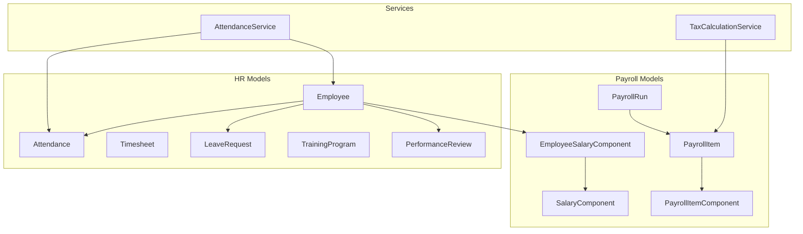
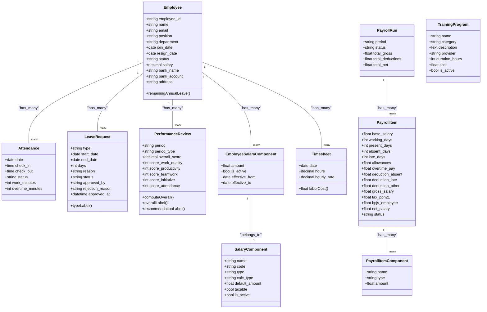
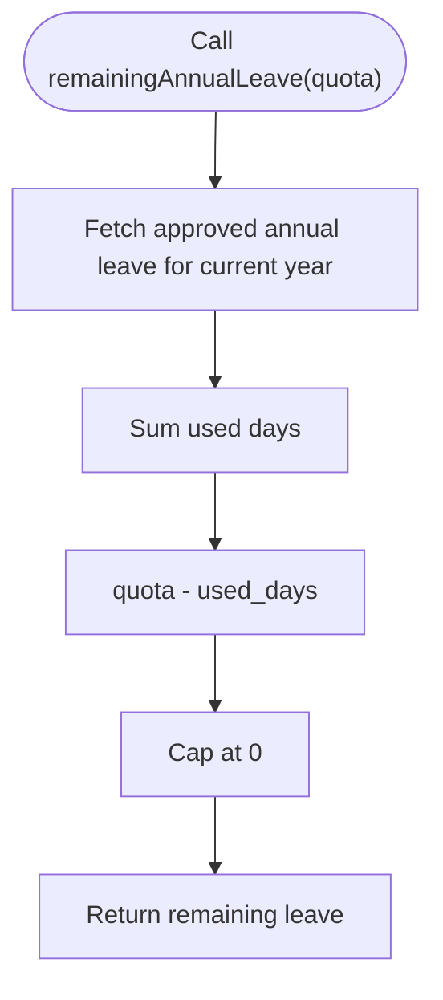
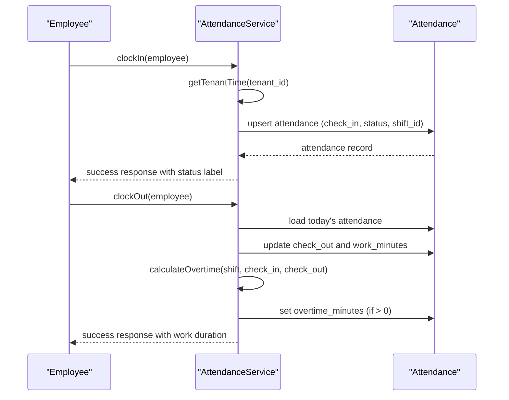
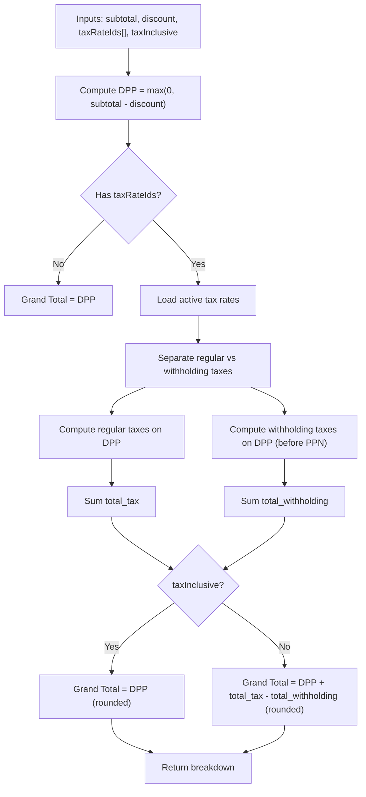
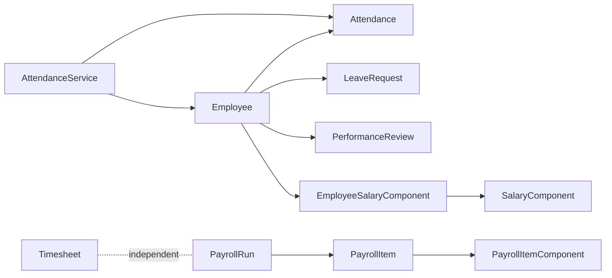

# Human Resources & Payroll Entities

<cite>
**Referenced Files in This Document**
- [Employee.php](file://app/Models/Employee.php)
- [Attendance.php](file://app/Models/Attendance.php)
- [Timesheet.php](file://app/Models/Timesheet.php)
- [PayrollRun.php](file://app/Models/PayrollRun.php)
- [PayrollItem.php](file://app/Models/PayrollItem.php)
- [PayrollItemComponent.php](file://app/Models/PayrollItemComponent.php)
- [SalaryComponent.php](file://app/Models/SalaryComponent.php)
- [EmployeeSalaryComponent.php](file://app/Models/EmployeeSalaryComponent.php)
- [LeaveRequest.php](file://app/Models/LeaveRequest.php)
- [TrainingProgram.php](file://app/Models/TrainingProgram.php)
- [PerformanceReview.php](file://app/Models/PerformanceReview.php)
- [AttendanceService.php](file://app/Services/AttendanceService.php)
- [TaxCalculationService.php](file://app/Services/TaxCalculationService.php)
</cite>

## Table of Contents
1. [Introduction](#introduction)
2. [Project Structure](#project-structure)
3. [Core Components](#core-components)
4. [Architecture Overview](#architecture-overview)
5. [Detailed Component Analysis](#detailed-component-analysis)
6. [Dependency Analysis](#dependency-analysis)
7. [Performance Considerations](#performance-considerations)
8. [Troubleshooting Guide](#troubleshooting-guide)
9. [Conclusion](#conclusion)

## Introduction
This document describes the human resources and payroll data models in Qalcuity ERP. It focuses on:
- Employee personal and organizational information, reporting relationships, and HR lifecycle records
- Attendance and timesheet models for time tracking and work hour management
- Payroll run, item, and component models for payroll processing
- Leave requests, training programs, and performance reviews for HR lifecycle management
- Payroll calculation rules, tax handling, and benefits administration

The goal is to provide a clear understanding of entity relationships, data fields, and processing logic for developers and product stakeholders.

## Project Structure
The HR/payroll domain is primarily implemented in Eloquent models under app/Models and supporting services under app/Services. Controllers and notifications orchestrate workflows but are outside the scope of this data model document.

**Diagram sources**
- [Employee.php:13-99](file://app/Models/Employee.php#L13-L99)
- [Attendance.php:10-39](file://app/Models/Attendance.php#L10-L39)
- [Timesheet.php:10-36](file://app/Models/Timesheet.php#L10-L36)
- [LeaveRequest.php:10-38](file://app/Models/LeaveRequest.php#L10-L38)
- [TrainingProgram.php:11-26](file://app/Models/TrainingProgram.php#L11-L26)
- [PerformanceReview.php:10-61](file://app/Models/PerformanceReview.php#L10-L61)
- [PayrollRun.php:9-29](file://app/Models/PayrollRun.php#L9-L29)
- [PayrollItem.php:9-25](file://app/Models/PayrollItem.php#L9-L25)
- [PayrollItemComponent.php:7-19](file://app/Models/PayrollItemComponent.php#L7-L19)
- [SalaryComponent.php:9-27](file://app/Models/SalaryComponent.php#L9-L27)
- [EmployeeSalaryComponent.php:9-33](file://app/Models/EmployeeSalaryComponent.php#L9-L33)
- [AttendanceService.php:23-367](file://app/Services/AttendanceService.php#L23-L367)
- [TaxCalculationService.php:29-306](file://app/Services/TaxCalculationService.php#L29-L306)

**Section sources**
- [Employee.php:13-99](file://app/Models/Employee.php#L13-L99)
- [Attendance.php:10-39](file://app/Models/Attendance.php#L10-L39)
- [Timesheet.php:10-36](file://app/Models/Timesheet.php#L10-L36)
- [PayrollRun.php:9-29](file://app/Models/PayrollRun.php#L9-L29)
- [PayrollItem.php:9-25](file://app/Models/PayrollItem.php#L9-L25)
- [PayrollItemComponent.php:7-19](file://app/Models/PayrollItemComponent.php#L7-L19)
- [SalaryComponent.php:9-27](file://app/Models/SalaryComponent.php#L9-L27)
- [EmployeeSalaryComponent.php:9-33](file://app/Models/EmployeeSalaryComponent.php#L9-L33)
- [LeaveRequest.php:10-38](file://app/Models/LeaveRequest.php#L10-L38)
- [TrainingProgram.php:11-26](file://app/Models/TrainingProgram.php#L11-L26)
- [PerformanceReview.php:10-61](file://app/Models/PerformanceReview.php#L10-L61)
- [AttendanceService.php:23-367](file://app/Services/AttendanceService.php#L23-L367)
- [TaxCalculationService.php:29-306](file://app/Services/TaxCalculationService.php#L29-L306)

## Core Components
This section documents the primary entities and their responsibilities.

- Employee: Stores personal and employment details, organizational hierarchy, and links to HR records and salary components.
- Attendance: Tracks daily check-in/check-out, status, work duration, and overtime per day.
- Timesheet: Records billable hours per project/user with derived labor cost.
- PayrollRun: Aggregates payroll processing results for a period with totals and GL linkage.
- PayrollItem: Per-employee payroll computation results and component breakdown.
- PayrollItemComponent: Line items for salary components within a payroll item.
- SalaryComponent: Master list of salary/benefit components (active/inactive, taxable).
- EmployeeSalaryComponent: Employee-specific overrides and effective dates for components.
- LeaveRequest: Leave applications with type, duration, approval metadata, and localized labels.
- TrainingProgram: Learning catalog entries with provider, duration, and cost.
- PerformanceReview: 5-star competency scoring, overall score, and recommendations.

**Section sources**
- [Employee.php:13-99](file://app/Models/Employee.php#L13-L99)
- [Attendance.php:10-39](file://app/Models/Attendance.php#L10-L39)
- [Timesheet.php:10-36](file://app/Models/Timesheet.php#L10-L36)
- [PayrollRun.php:9-29](file://app/Models/PayrollRun.php#L9-L29)
- [PayrollItem.php:9-25](file://app/Models/PayrollItem.php#L9-L25)
- [PayrollItemComponent.php:7-19](file://app/Models/PayrollItemComponent.php#L7-L19)
- [SalaryComponent.php:9-27](file://app/Models/SalaryComponent.php#L9-L27)
- [EmployeeSalaryComponent.php:9-33](file://app/Models/EmployeeSalaryComponent.php#L9-L33)
- [LeaveRequest.php:10-38](file://app/Models/LeaveRequest.php#L10-L38)
- [TrainingProgram.php:11-26](file://app/Models/TrainingProgram.php#L11-L26)
- [PerformanceReview.php:10-61](file://app/Models/PerformanceReview.php#L10-L61)

## Architecture Overview
The HR/payroll architecture centers around Employee as the hub, connecting to attendance, leave, performance review, and payroll items. Payroll items aggregate salary components and deductions, while services handle attendance logic and tax calculations.

**Diagram sources**
- [Employee.php:13-99](file://app/Models/Employee.php#L13-L99)
- [Attendance.php:10-39](file://app/Models/Attendance.php#L10-L39)
- [Timesheet.php:10-36](file://app/Models/Timesheet.php#L10-L36)
- [PayrollRun.php:9-29](file://app/Models/PayrollRun.php#L9-L29)
- [PayrollItem.php:9-25](file://app/Models/PayrollItem.php#L9-L25)
- [PayrollItemComponent.php:7-19](file://app/Models/PayrollItemComponent.php#L7-L19)
- [SalaryComponent.php:9-27](file://app/Models/SalaryComponent.php#L9-L27)
- [EmployeeSalaryComponent.php:9-33](file://app/Models/EmployeeSalaryComponent.php#L9-L33)
- [LeaveRequest.php:10-38](file://app/Models/LeaveRequest.php#L10-L38)
- [TrainingProgram.php:11-26](file://app/Models/TrainingProgram.php#L11-L26)
- [PerformanceReview.php:10-61](file://app/Models/PerformanceReview.php#L10-L61)

## Detailed Component Analysis

### Employee
- Purpose: Central HR profile with personal info, employment history, organizational hierarchy, and links to HR/lifecycle records.
- Key relations: manager/subordinates (self-referencing), attendances, fingerprint logs, leave requests, performance reviews, salary components.
- Utility: Annual leave balance computation for a given quota.

**Diagram sources**
- [Employee.php:89-98](file://app/Models/Employee.php#L89-L98)

**Section sources**
- [Employee.php:13-99](file://app/Models/Employee.php#L13-L99)

### Attendance
- Purpose: Daily time tracking with check-in/out, status, work duration, and overtime minutes.
- Relations: belongs to Employee and Tenant; linked to shifts via shift_id.
- Notes: Designed to integrate with shift schedules and fingerprint logs.

**Section sources**
- [Attendance.php:10-39](file://app/Models/Attendance.php#L10-L39)

### Timesheet
- Purpose: Non-attendance billing for internal/project labor with derived labor cost.
- Computed property: laborCost equals hours × hourly_rate.

**Section sources**
- [Timesheet.php:10-36](file://app/Models/Timesheet.php#L10-L36)

### PayrollRun
- Purpose: Aggregate payroll results for a period, including totals and GL linkage.
- Relations: has many PayrollItems; belongs to JournalEntry for run and payment.

**Section sources**
- [PayrollRun.php:9-29](file://app/Models/PayrollRun.php#L9-L29)

### PayrollItem
- Purpose: Per-employee payroll computation with working days, allowances, overtime pay, deductions, taxes, and net salary.
- Relations: belongs to Employee and PayrollRun; has many PayrollItemComponents.

**Section sources**
- [PayrollItem.php:9-25](file://app/Models/PayrollItem.php#L9-L25)

### PayrollItemComponent
- Purpose: Line-item breakdown of salary components within a PayrollItem.
- Fields: component identity, name, type, and amount.

**Section sources**
- [PayrollItemComponent.php:7-19](file://app/Models/PayrollItemComponent.php#L7-L19)

### SalaryComponent and EmployeeSalaryComponent
- SalaryComponent: Master list of components (name/code/type/calc_type/default_amount/taxable/is_active).
- EmployeeSalaryComponent: Employee-specific overrides with amounts and effective date range.

**Section sources**
- [SalaryComponent.php:9-27](file://app/Models/SalaryComponent.php#L9-L27)
- [EmployeeSalaryComponent.php:9-33](file://app/Models/EmployeeSalaryComponent.php#L9-L33)

### LeaveRequest
- Purpose: Capture leave applications with type, dates, duration, approval metadata, and localized labels.
- Labels: typeLabel maps internal types to Indonesian descriptors.

**Section sources**
- [LeaveRequest.php:10-38](file://app/Models/LeaveRequest.php#L10-L38)

### TrainingProgram
- Purpose: Catalog training offerings with provider, duration, cost, and activity flag.

**Section sources**
- [TrainingProgram.php:11-26](file://app/Models/TrainingProgram.php#L11-L26)

### PerformanceReview
- Purpose: Competency-based review with five scores, computed overall score, and recommendation labels.

**Section sources**
- [PerformanceReview.php:10-61](file://app/Models/PerformanceReview.php#L10-L61)

### AttendanceService (Processing Logic)
- Clock-in/out with timezone-aware timestamps and shift-aware status determination.
- Calculates work duration and optional overtime based on shift schedule.
- Grace period and late threshold configurable per tenant (placeholder).

**Diagram sources**
- [AttendanceService.php:31-210](file://app/Services/AttendanceService.php#L31-L210)
- [Attendance.php:10-39](file://app/Models/Attendance.php#L10-L39)

**Section sources**
- [AttendanceService.php:23-367](file://app/Services/AttendanceService.php#L23-L367)

### TaxCalculationService (Payroll Tax Rules)
- Supports multiple tax types, withholding taxes, and tax-inclusive pricing.
- Calculation order: subtotal → discount → DPP → regular taxes → withholding taxes → grand total.
- Includes PPN (VAT) and PPh 23 calculations with accounting rounding.

**Diagram sources**
- [TaxCalculationService.php:40-126](file://app/Services/TaxCalculationService.php#L40-L126)

**Section sources**
- [TaxCalculationService.php:29-306](file://app/Services/TaxCalculationService.php#L29-L306)

## Dependency Analysis
- Employee is central: Attendance, LeaveRequest, PerformanceReview, EmployeeSalaryComponent depend on Employee.
- PayrollRun aggregates PayrollItems; PayrollItems depend on Employees and components.
- PayrollItemComponents link to PayrollItems; SalaryComponent master data is referenced by EmployeeSalaryComponent.
- AttendanceService depends on Employee, Attendance, ShiftSchedule, WorkShift; Timesheet is independent of payroll.

**Diagram sources**
- [Employee.php:13-99](file://app/Models/Employee.php#L13-L99)
- [Attendance.php:10-39](file://app/Models/Attendance.php#L10-L39)
- [LeaveRequest.php:10-38](file://app/Models/LeaveRequest.php#L10-L38)
- [PerformanceReview.php:10-61](file://app/Models/PerformanceReview.php#L10-L61)
- [EmployeeSalaryComponent.php:9-33](file://app/Models/EmployeeSalaryComponent.php#L9-L33)
- [SalaryComponent.php:9-27](file://app/Models/SalaryComponent.php#L9-L27)
- [PayrollRun.php:9-29](file://app/Models/PayrollRun.php#L9-L29)
- [PayrollItem.php:9-25](file://app/Models/PayrollItem.php#L9-L25)
- [PayrollItemComponent.php:7-19](file://app/Models/PayrollItemComponent.php#L7-L19)
- [AttendanceService.php:23-367](file://app/Services/AttendanceService.php#L23-L367)
- [Timesheet.php:10-36](file://app/Models/Timesheet.php#L10-L36)

**Section sources**
- [Employee.php:13-99](file://app/Models/Employee.php#L13-L99)
- [Attendance.php:10-39](file://app/Models/Attendance.php#L10-L39)
- [LeaveRequest.php:10-38](file://app/Models/LeaveRequest.php#L10-L38)
- [PerformanceReview.php:10-61](file://app/Models/PerformanceReview.php#L10-L61)
- [EmployeeSalaryComponent.php:9-33](file://app/Models/EmployeeSalaryComponent.php#L9-L33)
- [SalaryComponent.php:9-27](file://app/Models/SalaryComponent.php#L9-L27)
- [PayrollRun.php:9-29](file://app/Models/PayrollRun.php#L9-L29)
- [PayrollItem.php:9-25](file://app/Models/PayrollItem.php#L9-L25)
- [PayrollItemComponent.php:7-19](file://app/Models/PayrollItemComponent.php#L7-L19)
- [AttendanceService.php:23-367](file://app/Services/AttendanceService.php#L23-L367)
- [Timesheet.php:10-36](file://app/Models/Timesheet.php#L10-L36)

## Performance Considerations
- Indexing recommendations:
  - Attendance.employee_id and Attendance.date for daily lookups
  - PayrollItem.payroll_run_id and PayrollItem.employee_id for aggregation
  - EmployeeSalaryComponent.employee_id and effective_from/effective_to for component queries
  - PayrollRun.period for run scoping
- Casting and numeric fields:
  - Use decimal/float casts for currency and precise arithmetic to avoid floating-point drift
- Timezone handling:
  - Store timestamps in UTC and render in tenant timezone; service methods already compute in tenant timezone
- Batch processing:
  - Use chunked queries for large payroll runs and leave balances to reduce memory footprint

## Troubleshooting Guide
- Attendance clock-in/out errors:
  - Duplicate check-in/out on the same day are prevented; verify daily uniqueness and shift availability.
  - Grace period and late thresholds are placeholders; confirm tenant configuration is applied.
- Payroll totals mismatch:
  - Verify PayrollItemComponent amounts and PayrollItem totals; ensure rounding aligns with accounting rules.
- Leave balance discrepancies:
  - Confirm approved annual leaves are counted within the current year and quota alignment.
- Tax calculation anomalies:
  - Ensure tax-inclusive flags are set correctly; validate withholding tax base on pre-PPN gross.

**Section sources**
- [AttendanceService.php:31-210](file://app/Services/AttendanceService.php#L31-L210)
- [TaxCalculationService.php:29-306](file://app/Services/TaxCalculationService.php#L29-L306)
- [Employee.php:89-98](file://app/Models/Employee.php#L89-L98)

## Conclusion
Qalcuity ERP’s HR/payroll models form a cohesive domain with Employee at the center, tightly integrated with attendance, leave, performance reviews, and a robust payroll pipeline. Payroll items capture granular computations, while services enforce timezone-aware attendance and precise tax calculations. The design supports scalability via componentized salary structures and configurable tax handling, with clear extension points for tenant-specific policies.