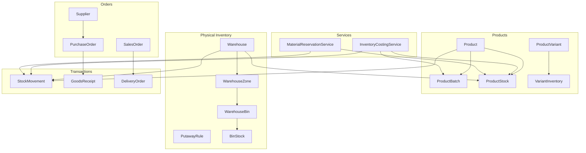
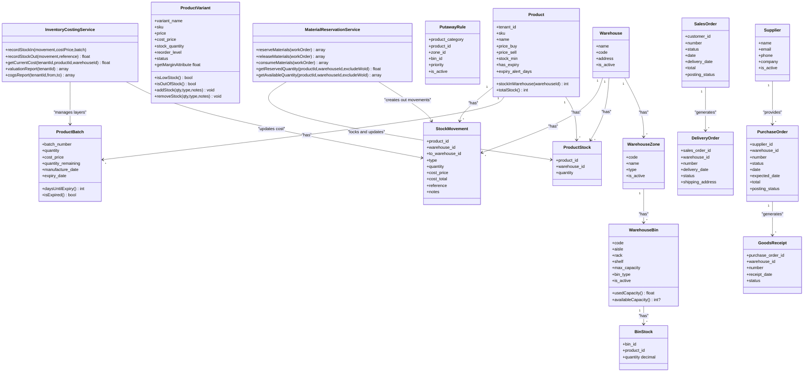
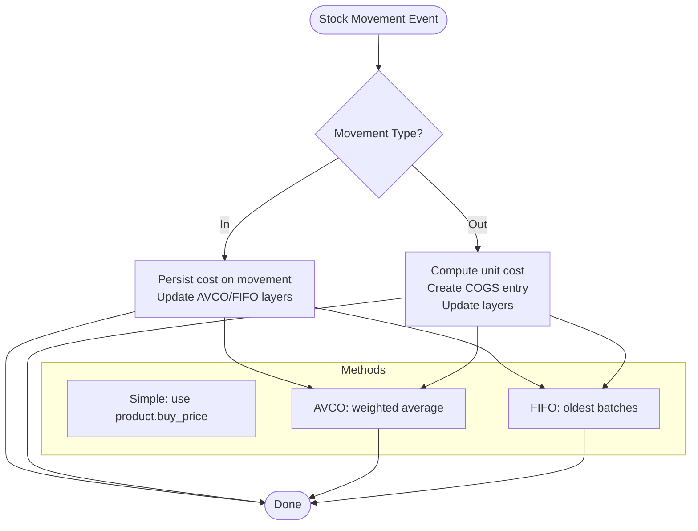
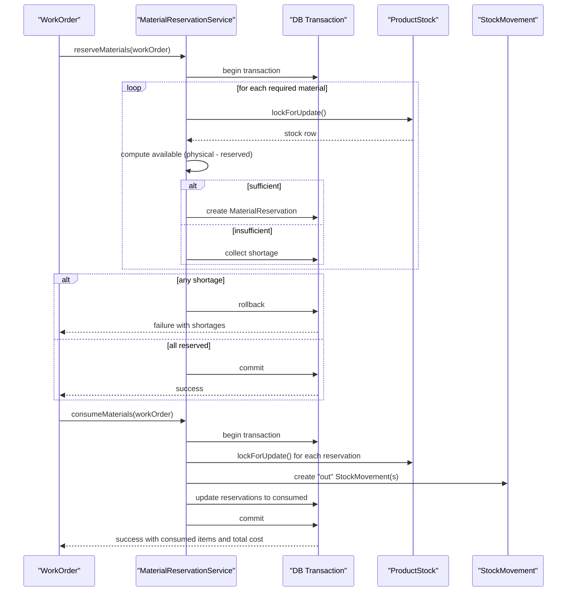
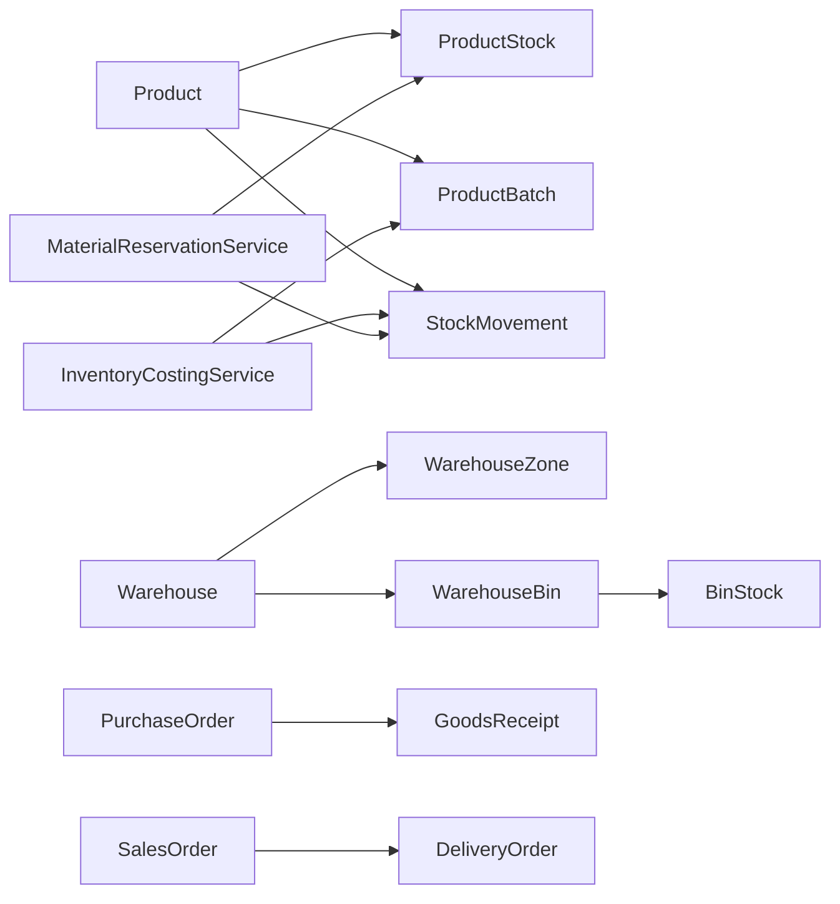

# Inventory & Supply Chain Entities

<cite>
**Referenced Files in This Document**
- [Product.php](file://app/Models/Product.php)
- [ProductVariant.php](file://app/Models/ProductVariant.php)
- [ProductBatch.php](file://app/Models/ProductBatch.php)
- [ProductStock.php](file://app/Models/ProductStock.php)
- [Warehouse.php](file://app/Models/Warehouse.php)
- [WarehouseZone.php](file://app/Models/WarehouseZone.php)
- [WarehouseBin.php](file://app/Models/WarehouseBin.php)
- [PutawayRule.php](file://app/Models/PutawayRule.php)
- [BinStock.php](file://app/Models/BinStock.php)
- [StockMovement.php](file://app/Models/StockMovement.php)
- [GoodsReceipt.php](file://app/Models/GoodsReceipt.php)
- [DeliveryOrder.php](file://app/Models/DeliveryOrder.php)
- [PurchaseOrder.php](file://app/Models/PurchaseOrder.php)
- [SalesOrder.php](file://app/Models/SalesOrder.php)
- [Supplier.php](file://app/Models/Supplier.php)
- [InventoryCostingService.php](file://app/Services/InventoryCostingService.php)
- [MaterialReservationService.php](file://app/Services/MaterialReservationService.php)
- [VariantInventory.php](file://app/Models/VariantInventory.php)
</cite>

## Table of Contents
1. [Introduction](#introduction)
2. [Project Structure](#project-structure)
3. [Core Components](#core-components)
4. [Architecture Overview](#architecture-overview)
5. [Detailed Component Analysis](#detailed-component-analysis)
6. [Dependency Analysis](#dependency-analysis)
7. [Performance Considerations](#performance-considerations)
8. [Troubleshooting Guide](#troubleshooting-guide)
9. [Conclusion](#conclusion)

## Introduction
This document describes the inventory and supply chain data models in Qalcuity ERP. It covers:
- Product and variants with pricing and batch tracking
- Warehouse and bin-level physical inventory
- Stock movements and goods receipt/delivery orders
- Purchase and sales order lifecycles
- Inventory costing methods, valuation, and reorder point logic

The goal is to help both technical and non-technical readers understand how inventory and supply chain data is modeled, how transactions flow, and how costs and valuations are computed.

## Project Structure
The inventory and supply chain domain spans several models and services:
- Product family: Product, ProductVariant, ProductBatch, ProductStock
- Physical inventory: Warehouse, WarehouseZone, WarehouseBin, PutawayRule, BinStock
- Transactions: StockMovement, GoodsReceipt, DeliveryOrder
- Orders: PurchaseOrder, SalesOrder, Supplier
- Services: InventoryCostingService (costing and valuation), MaterialReservationService (production reservations)

**Diagram sources**
- [Product.php:12-71](file://app/Models/Product.php#L12-L71)
- [ProductVariant.php:13-175](file://app/Models/ProductVariant.php#L13-L175)
- [ProductBatch.php:10-59](file://app/Models/ProductBatch.php#L10-L59)
- [ProductStock.php:8-15](file://app/Models/ProductStock.php#L8-L15)
- [Warehouse.php:12-43](file://app/Models/Warehouse.php#L12-L43)
- [WarehouseZone.php:9-18](file://app/Models/WarehouseZone.php#L9-L18)
- [WarehouseBin.php:9-24](file://app/Models/WarehouseBin.php#L9-L24)
- [PutawayRule.php:8-19](file://app/Models/PutawayRule.php#L8-L19)
- [BinStock.php:8-17](file://app/Models/BinStock.php#L8-L17)
- [StockMovement.php:10-25](file://app/Models/StockMovement.php#L10-L25)
- [GoodsReceipt.php:11-26](file://app/Models/GoodsReceipt.php#L11-L26)
- [DeliveryOrder.php:12-52](file://app/Models/DeliveryOrder.php#L12-L52)
- [PurchaseOrder.php:13-141](file://app/Models/PurchaseOrder.php#L13-L141)
- [SalesOrder.php:13-123](file://app/Models/SalesOrder.php#L13-L123)
- [Supplier.php:13-52](file://app/Models/Supplier.php#L13-L52)
- [InventoryCostingService.php:23-366](file://app/Services/InventoryCostingService.php#L23-L366)
- [MaterialReservationService.php:24-389](file://app/Services/MaterialReservationService.php#L24-L389)
- [VariantInventory.php:11-72](file://app/Models/VariantInventory.php#L11-L72)

**Section sources**
- [Product.php:12-71](file://app/Models/Product.php#L12-L71)
- [Warehouse.php:12-43](file://app/Models/Warehouse.php#L12-L43)
- [StockMovement.php:10-25](file://app/Models/StockMovement.php#L10-L25)
- [PurchaseOrder.php:13-141](file://app/Models/PurchaseOrder.php#L13-L141)
- [SalesOrder.php:13-123](file://app/Models/SalesOrder.php#L13-L123)
- [Supplier.php:13-52](file://app/Models/Supplier.php#L13-L52)
- [InventoryCostingService.php:23-366](file://app/Services/InventoryCostingService.php#L23-L366)
- [MaterialReservationService.php:24-389](file://app/Services/MaterialReservationService.php#L24-L389)

## Core Components
This section introduces the primary entities and their roles.

- Product: Core item with buy/sell prices, minimum stock, and relationships to stock, movements, and batches.
- ProductVariant: Per-variant stock, pricing, reorder level, and inventory transaction log.
- ProductBatch: Batch-level tracking with expiry, remaining quantity, and cost.
- ProductStock: Aggregate quantity per product per warehouse.
- Warehouse: Physical storage entity with zones, bins, and movements.
- WarehouseZone: Logical area inside a warehouse.
- WarehouseBin: Storage location with capacity tracking.
- PutawayRule: Routing rule to assign products to zones/bins.
- BinStock: Quantity allocated per product per bin.
- StockMovement: Movement records (in/out/transfers) with cost attribution.
- GoodsReceipt: Receipt of purchased goods into a warehouse.
- DeliveryOrder: Dispatch of goods to customers.
- PurchaseOrder: Procurement request with lifecycle and financials.
- SalesOrder: Customer order with lifecycle and financials.
- Supplier: Vendor profile and relationships.
- InventoryCostingService: Computes costs (simple/AVCO/FIFO), valuations, COGS entries.
- MaterialReservationService: Reserves materials for work orders atomically.

**Section sources**
- [Product.php:12-71](file://app/Models/Product.php#L12-L71)
- [ProductVariant.php:13-175](file://app/Models/ProductVariant.php#L13-L175)
- [ProductBatch.php:10-59](file://app/Models/ProductBatch.php#L10-L59)
- [ProductStock.php:8-15](file://app/Models/ProductStock.php#L8-L15)
- [Warehouse.php:12-43](file://app/Models/Warehouse.php#L12-L43)
- [WarehouseZone.php:9-18](file://app/Models/WarehouseZone.php#L9-L18)
- [WarehouseBin.php:9-24](file://app/Models/WarehouseBin.php#L9-L24)
- [PutawayRule.php:8-19](file://app/Models/PutawayRule.php#L8-L19)
- [BinStock.php:8-17](file://app/Models/BinStock.php#L8-L17)
- [StockMovement.php:10-25](file://app/Models/StockMovement.php#L10-L25)
- [GoodsReceipt.php:11-26](file://app/Models/GoodsReceipt.php#L11-L26)
- [DeliveryOrder.php:12-52](file://app/Models/DeliveryOrder.php#L12-L52)
- [PurchaseOrder.php:13-141](file://app/Models/PurchaseOrder.php#L13-L141)
- [SalesOrder.php:13-123](file://app/Models/SalesOrder.php#L13-L123)
- [Supplier.php:13-52](file://app/Models/Supplier.php#L13-L52)
- [InventoryCostingService.php:23-366](file://app/Services/InventoryCostingService.php#L23-L366)
- [MaterialReservationService.php:24-389](file://app/Services/MaterialReservationService.php#L24-L389)
- [VariantInventory.php:11-72](file://app/Models/VariantInventory.php#L11-L72)

## Architecture Overview
The inventory and supply chain architecture centers around:
- Product-centric models for pricing, variants, and batch tracking
- Warehouse-centric models for physical placement and capacity
- Transactional models for stock movements and order fulfillment
- Costing service for valuation and COGS computation
- Reservation service for production material allocation

**Diagram sources**
- [Product.php:12-71](file://app/Models/Product.php#L12-L71)
- [ProductVariant.php:13-175](file://app/Models/ProductVariant.php#L13-L175)
- [ProductBatch.php:10-59](file://app/Models/ProductBatch.php#L10-L59)
- [ProductStock.php:8-15](file://app/Models/ProductStock.php#L8-L15)
- [Warehouse.php:12-43](file://app/Models/Warehouse.php#L12-L43)
- [WarehouseZone.php:9-18](file://app/Models/WarehouseZone.php#L9-L18)
- [WarehouseBin.php:9-24](file://app/Models/WarehouseBin.php#L9-L24)
- [PutawayRule.php:8-19](file://app/Models/PutawayRule.php#L8-L19)
- [BinStock.php:8-17](file://app/Models/BinStock.php#L8-L17)
- [StockMovement.php:10-25](file://app/Models/StockMovement.php#L10-L25)
- [GoodsReceipt.php:11-26](file://app/Models/GoodsReceipt.php#L11-L26)
- [DeliveryOrder.php:12-52](file://app/Models/DeliveryOrder.php#L12-L52)
- [PurchaseOrder.php:13-141](file://app/Models/PurchaseOrder.php#L13-L141)
- [SalesOrder.php:13-123](file://app/Models/SalesOrder.php#L13-L123)
- [Supplier.php:13-52](file://app/Models/Supplier.php#L13-L52)
- [InventoryCostingService.php:23-366](file://app/Services/InventoryCostingService.php#L23-L366)
- [MaterialReservationService.php:24-389](file://app/Services/MaterialReservationService.php#L24-L389)

## Detailed Component Analysis

### Product Model
- Purpose: Central product definition with pricing, stock thresholds, and expiry controls.
- Key fields: identifiers, pricing, minimum stock, activity flags, expiry settings.
- Relationships: stock per warehouse, stock movements, batches.
- Methods: per-warehouse stock lookup, total stock aggregation.

**Section sources**
- [Product.php:12-71](file://app/Models/Product.php#L12-L71)

### ProductVariant Model
- Purpose: Variant-level stock, pricing, and reorder logic for SKUs derived from attributes.
- Key fields: variant metadata, pricing, cost, stock, reorder level, status, attributes.
- Behavior: automatic SKU generation, stock add/remove with transaction logging, margin calculation, scopes for stock states.
- Relationship: inventory transaction log via VariantInventory.

**Section sources**
- [ProductVariant.php:13-175](file://app/Models/ProductVariant.php#L13-L175)
- [VariantInventory.php:11-72](file://app/Models/VariantInventory.php#L11-L72)

### ProductBatch Model
- Purpose: Batch-level tracking for expiry and cost, supports expiry alerts and status filtering.
- Key fields: batch number, quantities, cost, dates, status, notes.
- Behavior: days until expiry, expired checks, scopes for active/expiring/expired batches.

**Section sources**
- [ProductBatch.php:10-59](file://app/Models/ProductBatch.php#L10-L59)

### ProductStock Model
- Purpose: Aggregated quantity per product per warehouse.
- Relationships: Product and Warehouse.

**Section sources**
- [ProductStock.php:8-15](file://app/Models/ProductStock.php#L8-L15)

### Warehouse, Zone, Bin, PutawayRule, BinStock
- Warehouse: top-level storage container with zones and bins.
- Zone: logical subdivision of a warehouse.
- Bin: physical location with capacity tracking.
- PutawayRule: routing rule to assign products to zones/bins.
- BinStock: quantity allocated per product per bin.

**Section sources**
- [Warehouse.php:12-43](file://app/Models/Warehouse.php#L12-L43)
- [WarehouseZone.php:9-18](file://app/Models/WarehouseZone.php#L9-L18)
- [WarehouseBin.php:9-24](file://app/Models/WarehouseBin.php#L9-L24)
- [PutawayRule.php:8-19](file://app/Models/PutawayRule.php#L8-L19)
- [BinStock.php:8-17](file://app/Models/BinStock.php#L8-L17)

### StockMovement Model
- Purpose: Records all stock movements (in/out/transfers) with cost attribution and references.
- Fields: product, warehouse, destination warehouse, type, quantities, cost, reference, notes.

**Section sources**
- [StockMovement.php:10-25](file://app/Models/StockMovement.php#L10-L25)

### GoodsReceipt Model
- Purpose: Tracks receipt of purchased goods against a PurchaseOrder into a Warehouse.
- Fields: PO reference, warehouse, receipt number/date, receiver, status, notes.

**Section sources**
- [GoodsReceipt.php:11-26](file://app/Models/GoodsReceipt.php#L11-L26)

### DeliveryOrder Model
- Purpose: Manages dispatch of goods from a Warehouse to a customer.
- Fields: SO reference, warehouse, delivery number/date, status, shipping address, courier/tracking, notes.
- Behavior: localized status label and color helpers.

**Section sources**
- [DeliveryOrder.php:12-52](file://app/Models/DeliveryOrder.php#L12-L52)

### PurchaseOrder Model
- Purpose: Procurement lifecycle with financials, tax, currency, numbering, and posting state.
- Fields: supplier, user, warehouse, requisition/rfq linkage, dates, totals, payment terms, posting state, revision, numbering.
- Behavior: posting status helpers and localized labels/colors.

**Section sources**
- [PurchaseOrder.php:13-141](file://app/Models/PurchaseOrder.php#L13-L141)

### SalesOrder Model
- Purpose: Customer order lifecycle with financials, tax, currency, numbering, and posting state.
- Fields: customer, user, quotation linkage, dates, totals, shipping address, payment terms, posting state, revision, numbering.
- Behavior: posting status helpers and localized labels/colors.

**Section sources**
- [SalesOrder.php:13-123](file://app/Models/SalesOrder.php#L13-L123)

### Supplier Model
- Purpose: Vendor profile and relationships to purchase orders and scorecards.
- Fields: contact info, bank details, activity flag.
- Relationships: purchase orders, scorecards.

**Section sources**
- [Supplier.php:13-52](file://app/Models/Supplier.php#L13-L52)

### Inventory Costing and Valuation
- Supported methods per tenant: simple (static cost), avco (weighted average), fifo (oldest-first).
- Stock-in: persists cost on movement and updates AVCO/FIFO layers.
- Stock-out: computes unit cost, writes COGS entry, updates layers.
- Valuation: per-product value by method; COGS summary by date range.
- Fallback: if no AVCO history, computes from movements; if no layers, falls back to product buy price.

**Diagram sources**
- [InventoryCostingService.php:23-366](file://app/Services/InventoryCostingService.php#L23-L366)
- [StockMovement.php:10-25](file://app/Models/StockMovement.php#L10-L25)
- [ProductBatch.php:10-59](file://app/Models/ProductBatch.php#L10-L59)
- [ProductStock.php:8-15](file://app/Models/ProductStock.php#L8-L15)

**Section sources**
- [InventoryCostingService.php:23-366](file://app/Services/InventoryCostingService.php#L23-L366)

### Material Reservation for Production
- Purpose: Prevents double-allocation of materials across work orders and ensures atomic consumption.
- Features: reservation creation with conflict detection, release on cancellation, atomic consumption with stock movement and COGS-like accounting.

**Diagram sources**
- [MaterialReservationService.php:24-389](file://app/Services/MaterialReservationService.php#L24-L389)
- [StockMovement.php:10-25](file://app/Models/StockMovement.php#L10-L25)
- [ProductStock.php:8-15](file://app/Models/ProductStock.php#L8-L15)

**Section sources**
- [MaterialReservationService.php:24-389](file://app/Services/MaterialReservationService.php#L24-L389)

## Dependency Analysis
Key dependencies and relationships:
- Product depends on ProductStock, ProductBatch, StockMovement.
- Warehouse depends on WarehouseZone, WarehouseBin; BinStock links bins to products.
- Orders drive receipts and deliveries; receipts and deliveries reference order headers.
- InventoryCostingService depends on StockMovement, ProductBatch, ProductAvgCost (not shown here), and CogsEntry (not shown here).
- MaterialReservationService depends on ProductStock and creates StockMovement.

**Diagram sources**
- [Product.php:12-71](file://app/Models/Product.php#L12-L71)
- [Warehouse.php:12-43](file://app/Models/Warehouse.php#L12-L43)
- [WarehouseBin.php:9-24](file://app/Models/WarehouseBin.php#L9-L24)
- [BinStock.php:8-17](file://app/Models/BinStock.php#L8-L17)
- [PurchaseOrder.php:13-141](file://app/Models/PurchaseOrder.php#L13-L141)
- [SalesOrder.php:13-123](file://app/Models/SalesOrder.php#L13-L123)
- [InventoryCostingService.php:23-366](file://app/Services/InventoryCostingService.php#L23-L366)
- [MaterialReservationService.php:24-389](file://app/Services/MaterialReservationService.php#L24-L389)

**Section sources**
- [Product.php:12-71](file://app/Models/Product.php#L12-L71)
- [Warehouse.php:12-43](file://app/Models/Warehouse.php#L12-L43)
- [PurchaseOrder.php:13-141](file://app/Models/PurchaseOrder.php#L13-L141)
- [SalesOrder.php:13-123](file://app/Models/SalesOrder.php#L13-L123)
- [InventoryCostingService.php:23-366](file://app/Services/InventoryCostingService.php#L23-L366)
- [MaterialReservationService.php:24-389](file://app/Services/MaterialReservationService.php#L24-L389)

## Performance Considerations
- Use scopes and indexed foreign keys for frequent queries (e.g., active/expiring/expired batches, low/in-stock variants).
- Batch costing updates (AVCO/FIFO) should be performed within transactions to avoid race conditions.
- Reservation logic locks rows; keep transactions short and minimize contention.
- Valuation reports join product_stocks with products and warehouses; ensure appropriate indexes on tenant_id, product_id, warehouse_id, and quantity.

## Troubleshooting Guide
- Insufficient stock when consuming materials:
  - Verify available quantity after reservations and physical stock.
  - Confirm reservation status and exclusions for competing work orders.
- FIFO layers exhausted:
  - Ensure batch records exist or synthetic FIFO layers are created on receipt.
  - Confirm remaining quantities and statuses are updated after consumption.
- Posting state confusion:
  - Use posting status helpers to interpret draft/posted/cancelled states consistently.
- Expiry and alert logic:
  - Confirm expiry_date and status filters for active/expiring/expired batches.

**Section sources**
- [MaterialReservationService.php:24-389](file://app/Services/MaterialReservationService.php#L24-L389)
- [InventoryCostingService.php:23-366](file://app/Services/InventoryCostingService.php#L23-L366)
- [ProductBatch.php:10-59](file://app/Models/ProductBatch.php#L10-L59)
- [PurchaseOrder.php:13-141](file://app/Models/PurchaseOrder.php#L13-L141)
- [SalesOrder.php:13-123](file://app/Models/SalesOrder.php#L13-L123)

## Conclusion
Qalcuity ERP’s inventory and supply chain models form a cohesive system:
- Products and variants provide flexible pricing and stock control.
- Warehouses, zones, and bins enable precise physical inventory management.
- Stock movements, receipts, and deliveries track inventory flow end-to-end.
- Costing service supports multiple methods and produces accurate valuations and COGS.
- Reservation service prevents double-allocation and enables reliable production consumption.

These models and services collectively support robust inventory visibility, accurate costing, and efficient order fulfillment across procurement and sales.