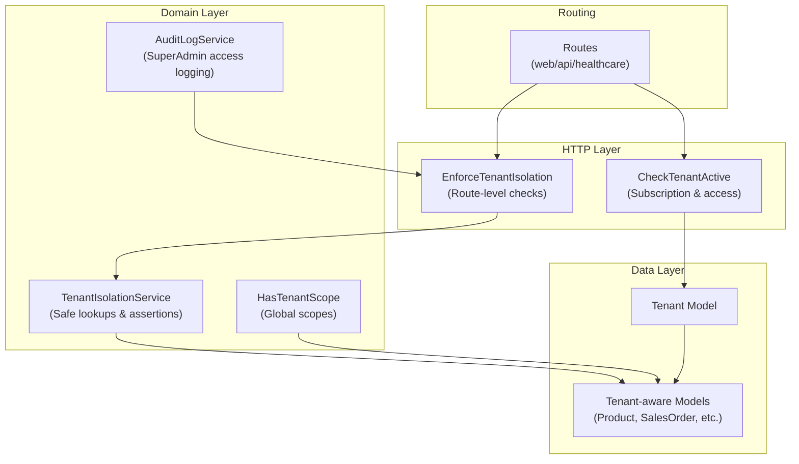
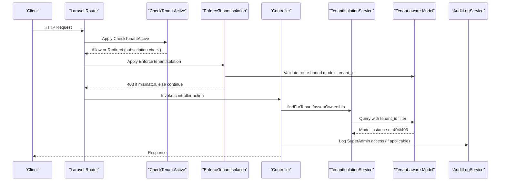
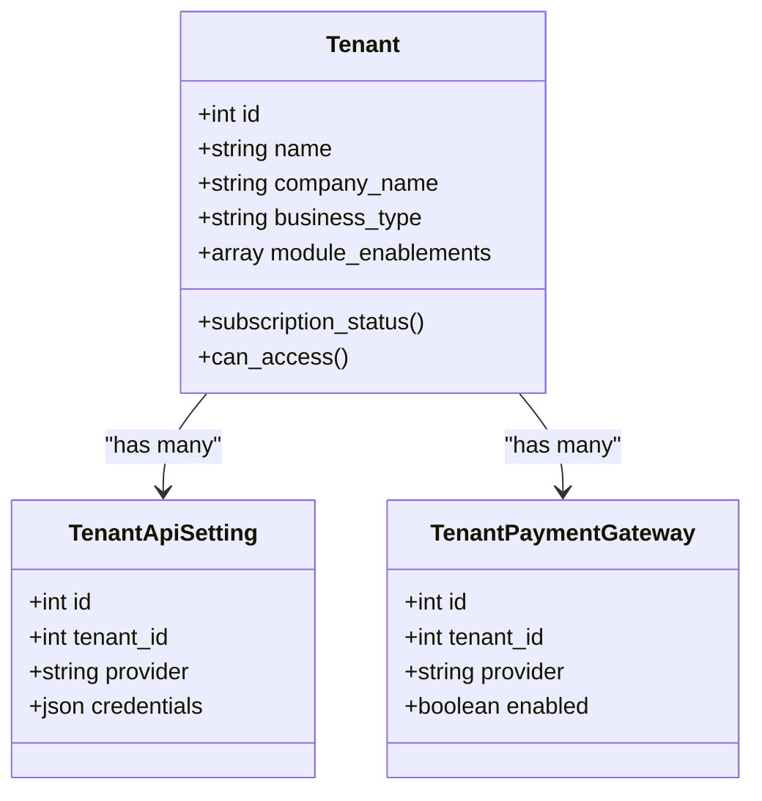
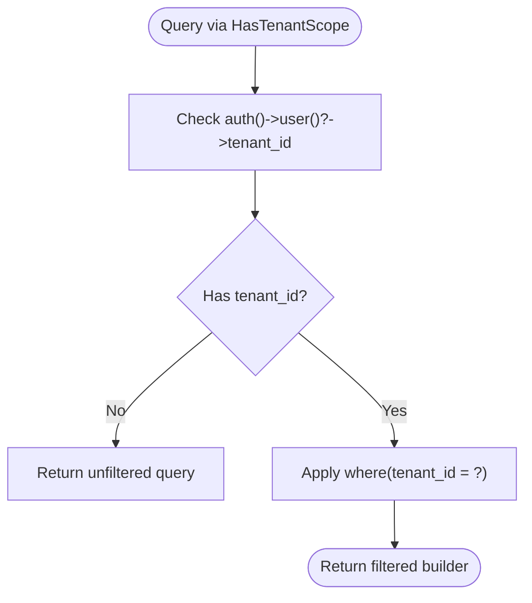
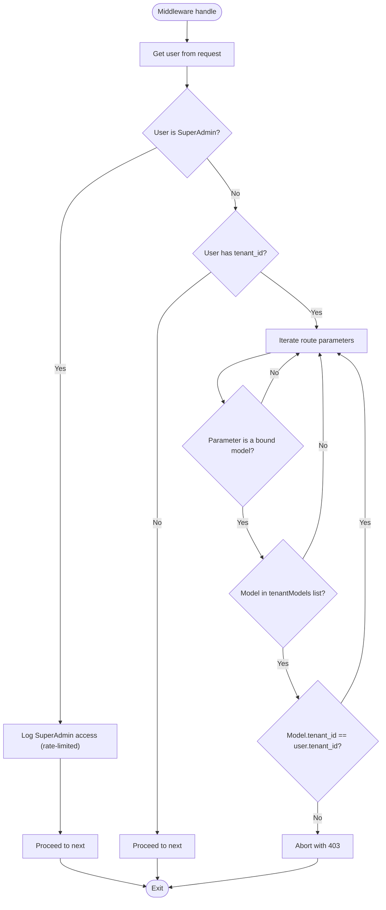
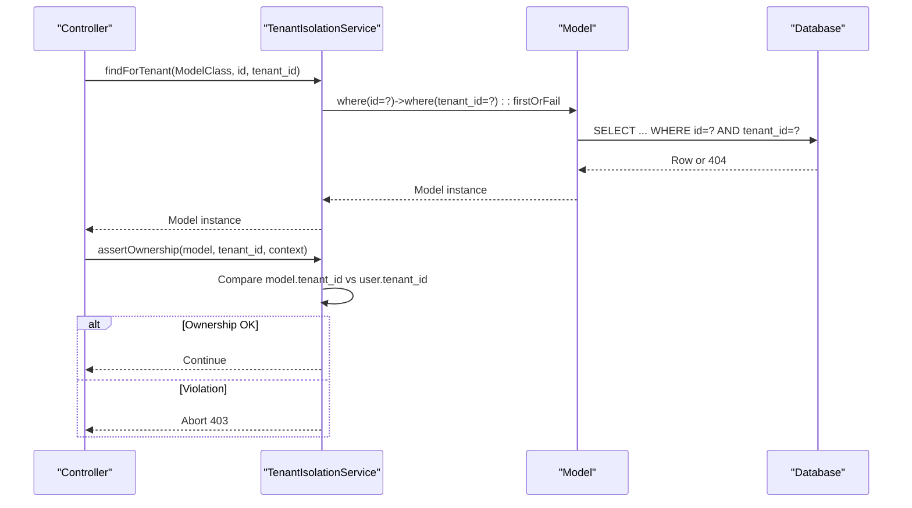
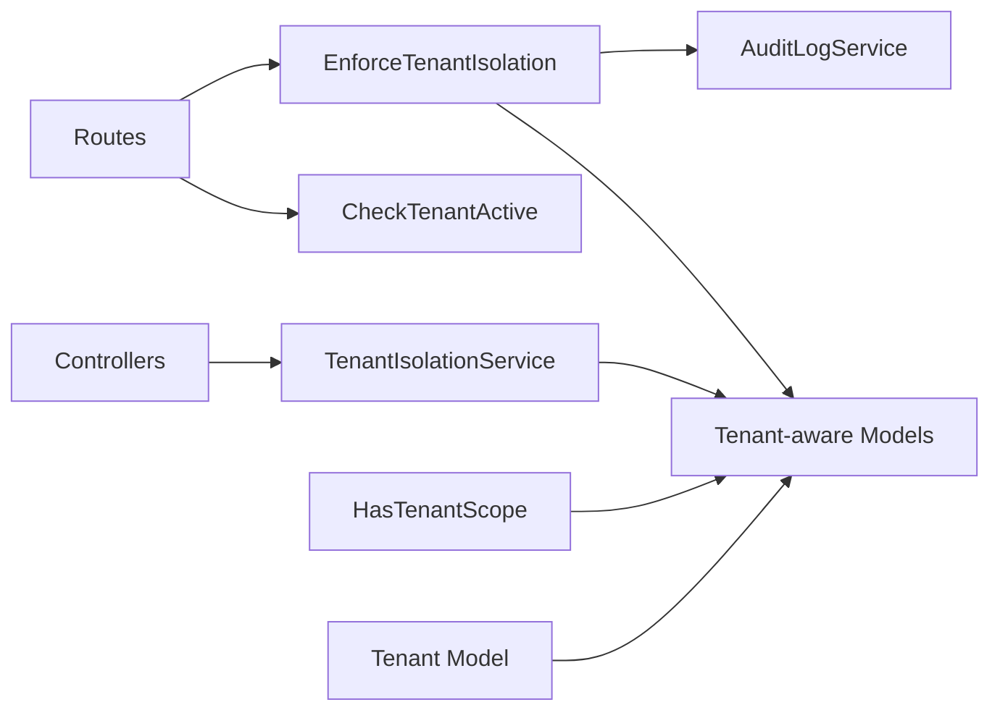

# Multi-Tenant Architecture

<cite>
**Referenced Files in This Document**
- [HasTenantScope.php](file://app/Models/Concerns/HasTenantScope.php)
- [EnforceTenantIsolation.php](file://app/Http/Middleware/EnforceTenantIsolation.php)
- [CheckTenantActive.php](file://app/Http/Middleware/CheckTenantActive.php)
- [TenantIsolationService.php](file://app/Services/TenantIsolationService.php)
- [Tenant.php](file://app/Models/Tenant.php)
- [TenantDataMigrationService.php](file://app/Services/TenantDataMigrationService.php)
- [TenantApiSetting.php](file://app/Models/TenantApiSetting.php)
- [TenantPaymentGateway.php](file://app/Models/TenantPaymentGateway.php)
- [AuditLogService.php](file://app/Services/Security/AuditLogService.php)
- [app.php](file://bootstrap/app.php)
- [routes/api.php](file://routes/api.php)
- [routes/web.php](file://routes/web.php)
- [routes/healthcare.php](file://routes/healthcare.php)
- [routes/auth.php](file://routes/auth.php)
- [routes/console.php](file://routes/console.php)
- [routes_list.txt](file://routes_list.txt)
- [routes_dump.json](file://routes_dump.json)
- [scripts/audit-tenant-indexes.php](file://scripts/audit-tenant-indexes.php)
- [scripts/tenant-index-audit.json](file://scripts/tenant-index-audit.json)
- [optimize_mysql.sql](file://optimize_mysql.sql)
</cite>

## Table of Contents
1. [Introduction](#introduction)
2. [Project Structure](#project-structure)
3. [Core Components](#core-components)
4. [Architecture Overview](#architecture-overview)
5. [Detailed Component Analysis](#detailed-component-analysis)
6. [Dependency Analysis](#dependency-analysis)
7. [Performance Considerations](#performance-considerations)
8. [Troubleshooting Guide](#troubleshooting-guide)
9. [Conclusion](#conclusion)
10. [Appendices](#appendices)

## Introduction
This document provides comprehensive data model documentation for Qalcuity ERP's multi-tenant architecture. It explains how tenant isolation is enforced using the HasTenantScope trait and middleware, details the Tenant model and its business categorization, outlines shared versus tenant-specific data patterns, and documents cross-tenant access controls. It also covers tenant data lifecycle, migration strategies, and performance optimization techniques tailored for multi-tenant deployments.

## Project Structure
Qalcuity ERP organizes multi-tenant concerns across models, middleware, services, and routing layers. The key components include:
- Tenant model and related settings/models
- Global scoping trait for tenant-aware models
- Middleware for runtime tenant isolation checks
- Service utilities for safe tenant-scoped operations
- Route groups and middleware application for tenant enforcement
- Scripts and SQL for index auditing and performance tuning

**Diagram sources**
- [EnforceTenantIsolation.php:19-226](file://app/Http/Middleware/EnforceTenantIsolation.php#L19-L226)
- [CheckTenantActive.php:9-39](file://app/Http/Middleware/CheckTenantActive.php#L9-L39)
- [HasTenantScope.php:23-56](file://app/Models/Concerns/HasTenantScope.php#L23-L56)
- [TenantIsolationService.php:16-67](file://app/Services/TenantIsolationService.php#L16-L67)
- [AuditLogService.php](file://app/Services/Security/AuditLogService.php)
- [routes/web.php](file://routes/web.php)
- [routes/api.php](file://routes/api.php)
- [routes/healthcare.php](file://routes/healthcare.php)

**Section sources**
- [app.php:43-55](file://bootstrap/app.php#L43-L55)
- [routes/web.php](file://routes/web.php)
- [routes/api.php](file://routes/api.php)
- [routes/healthcare.php](file://routes/healthcare.php)

## Core Components
- HasTenantScope trait: Provides convenient scopes to filter models by tenant and assert ownership. It avoids applying a global scope universally to prevent leaking cross-tenant data to super admins or affecting shared models.
- EnforceTenantIsolation middleware: Validates tenant ownership during route model binding and audits super admin access to tenant data.
- CheckTenantActive middleware: Ensures logged-in users belong to an active tenant and can access the system based on subscription status.
- TenantIsolationService: Offers safe lookup and ownership assertion helpers for controllers, returning appropriate HTTP errors when tenant boundaries are violated.
- Tenant model: Central entity representing a tenant with business categorization and module enablement metadata.
- Tenant settings models: TenantApiSetting and TenantPaymentGateway encapsulate tenant-specific integrations and payment configurations.

**Section sources**
- [HasTenantScope.php:7-56](file://app/Models/Concerns/HasTenantScope.php#L7-L56)
- [EnforceTenantIsolation.php:10-159](file://app/Http/Middleware/EnforceTenantIsolation.php#L10-L159)
- [CheckTenantActive.php:9-39](file://app/Http/Middleware/CheckTenantActive.php#L9-L39)
- [TenantIsolationService.php:8-67](file://app/Services/TenantIsolationService.php#L8-L67)
- [Tenant.php](file://app/Models/Tenant.php)
- [TenantApiSetting.php](file://app/Models/TenantApiSetting.php)
- [TenantPaymentGateway.php](file://app/Models/TenantPaymentGateway.php)

## Architecture Overview
The multi-tenant architecture enforces isolation at three layers:
- Data layer: Models include a tenant_id column and use HasTenantScope for convenient scoping. Controllers may also apply tenant filters directly.
- Runtime layer: EnforceTenantIsolation validates route-bound models and blocks unauthorized access. CheckTenantActive ensures only active tenants can access the system.
- Audit/compliance layer: SuperAdmin access to tenant data is audited with rate-limited logging.

**Diagram sources**
- [CheckTenantActive.php:11-37](file://app/Http/Middleware/CheckTenantActive.php#L11-L37)
- [EnforceTenantIsolation.php:28-159](file://app/Http/Middleware/EnforceTenantIsolation.php#L28-L159)
- [TenantIsolationService.php:25-56](file://app/Services/TenantIsolationService.php#L25-L56)
- [AuditLogService.php](file://app/Services/Security/AuditLogService.php)

## Detailed Component Analysis

### Tenant Model and Business Type Categorization
The Tenant model represents a tenant account and is central to multi-tenant operations. It typically includes attributes such as identifiers, business type, and subscription/module metadata. Business type categorization enables module enablement and feature gating per tenant.

**Diagram sources**
- [Tenant.php](file://app/Models/Tenant.php)
- [TenantApiSetting.php](file://app/Models/TenantApiSetting.php)
- [TenantPaymentGateway.php](file://app/Models/TenantPaymentGateway.php)

**Section sources**
- [Tenant.php](file://app/Models/Tenant.php)
- [TenantApiSetting.php](file://app/Models/TenantApiSetting.php)
- [TenantPaymentGateway.php](file://app/Models/TenantPaymentGateway.php)

### Tenant Isolation Mechanism: HasTenantScope Trait
The HasTenantScope trait provides two convenient scopes:
- forCurrentTenant: Filters by the currently authenticated user's tenant_id.
- forTenant: Filters by a specific tenant_id.
It also includes an assertion method to enforce ownership and abort with 403 when violated.

**Diagram sources**
- [HasTenantScope.php:29-36](file://app/Models/Concerns/HasTenantScope.php#L29-L36)
- [HasTenantScope.php:42-44](file://app/Models/Concerns/HasTenantScope.php#L42-L44)
- [HasTenantScope.php:51-54](file://app/Models/Concerns/HasTenantScope.php#L51-L54)

**Section sources**
- [HasTenantScope.php:7-56](file://app/Models/Concerns/HasTenantScope.php#L7-L56)

### Middleware Enforcement: EnforceTenantIsolation
EnforceTenantIsolation performs:
- Super admin bypass with compliance logging
- Guest bypass (no tenant_id)
- Route model binding validation for a curated set of tenant-aware models
- Audit logging for SuperAdmin access attempts with rate limiting

**Diagram sources**
- [EnforceTenantIsolation.php:28-159](file://app/Http/Middleware/EnforceTenantIsolation.php#L28-L159)
- [EnforceTenantIsolation.php:164-224](file://app/Http/Middleware/EnforceTenantIsolation.php#L164-L224)

**Section sources**
- [EnforceTenantIsolation.php:10-159](file://app/Http/Middleware/EnforceTenantIsolation.php#L10-L159)
- [AuditLogService.php](file://app/Services/Security/AuditLogService.php)

### Cross-Tenant Access Controls
Cross-tenant access is controlled by:
- Middleware validation of route-bound models against a whitelist of tenant-aware models
- Safe lookup and ownership assertion via TenantIsolationService
- Explicit tenant_id filtering in controllers for models not covered by the trait
- Super admin access logging for compliance

**Diagram sources**
- [TenantIsolationService.php:25-56](file://app/Services/TenantIsolationService.php#L25-L56)

**Section sources**
- [TenantIsolationService.php:8-67](file://app/Services/TenantIsolationService.php#L8-L67)
- [EnforceTenantIsolation.php:46-159](file://app/Http/Middleware/EnforceTenantIsolation.php#L46-L159)

### Shared vs Tenant-Specific Data Patterns
Shared data patterns:
- Models without tenant_id are considered shared (e.g., system-wide settings, reference data)
- Global scopes are intentionally not applied universally to avoid leaking cross-tenant data to super admins

Tenant-specific data patterns:
- Models with tenant_id use HasTenantScope for convenient scoping
- Controllers enforce tenant filtering explicitly when needed
- Migration strategies should add tenant_id to existing tables and backfill historical data

**Section sources**
- [HasTenantScope.php:12-22](file://app/Models/Concerns/HasTenantScope.php#L12-L22)

### Tenant Data Lifecycle and Migration Strategies
Tenant data lifecycle:
- Creation: Onboarding flows create Tenant and initial User with trial plan and admin role
- Activation: CheckTenantActive ensures tenant can access the system based on subscription status
- Operations: EnforceTenantIsolation and TenantIsolationService maintain isolation during CRUD operations
- Archival/Cleanup: Tenant-scoped archival and orphaned data cleanup services operate per tenant

Migration strategies:
- Add tenant_id to existing tables and backfill historical data
- Create tenant-specific indexes for tenant_id and frequently filtered columns
- Use tenant-scoped batch jobs for archival and cleanup
- Maintain separate backup and restore procedures per tenant

**Section sources**
- [CheckTenantActive.php:15-35](file://app/Http/Middleware/CheckTenantActive.php#L15-L35)
- [TenantDataMigrationService.php](file://app/Services/TenantDataMigrationService.php)
- [scripts/audit-tenant-indexes.php](file://scripts/audit-tenant-indexes.php)
- [scripts/tenant-index-audit.json](file://scripts/tenant-index-audit.json)

## Dependency Analysis
The multi-tenant architecture exhibits clear separation of concerns:
- Middleware depends on user context and model binding to enforce isolation
- Services depend on Eloquent models and logging for safe operations
- Models rely on traits for scoping and ownership assertions
- Routes define which middleware groups apply to different endpoints

**Diagram sources**
- [routes/web.php](file://routes/web.php)
- [routes/api.php](file://routes/api.php)
- [routes/healthcare.php](file://routes/healthcare.php)
- [CheckTenantActive.php:11-37](file://app/Http/Middleware/CheckTenantActive.php#L11-L37)
- [EnforceTenantIsolation.php:28-159](file://app/Http/Middleware/EnforceTenantIsolation.php#L28-L159)
- [TenantIsolationService.php:25-56](file://app/Services/TenantIsolationService.php#L25-L56)
- [HasTenantScope.php:29-44](file://app/Models/Concerns/HasTenantScope.php#L29-L44)

**Section sources**
- [app.php:43-55](file://bootstrap/app.php#L43-L55)
- [routes/web.php](file://routes/web.php)
- [routes/api.php](file://routes/api.php)
- [routes/healthcare.php](file://routes/healthcare.php)

## Performance Considerations
- Indexing: Ensure tenant_id is indexed on tenant-specific tables and composite indexes for frequent filters
- Scoping: Prefer HasTenantScope for automatic tenant filtering to reduce controller-level duplication
- Batch operations: Use tenant-scoped batch jobs for archival and cleanup to minimize lock contention
- Caching: Tenant-scoped cache keys improve isolation and reduce cross-tenant cache pollution
- Queries: Avoid N+1 queries by eager loading tenant-specific relations and using batch operations

[No sources needed since this section provides general guidance]

## Troubleshooting Guide
Common issues and resolutions:
- 403 Access Denied: Indicates tenant ownership mismatch; verify route parameters and model tenant_id alignment
- SuperAdmin access not logged: Ensure middleware is applied to routes and audit service is configured
- Subscription access blocked: Check tenant subscription status and redirect logic in CheckTenantActive
- Missing tenant_id in queries: Confirm HasTenantScope is applied or controller scoping is implemented

**Section sources**
- [EnforceTenantIsolation.php:152-155](file://app/Http/Middleware/EnforceTenantIsolation.php#L152-L155)
- [EnforceTenantIsolation.php:164-224](file://app/Http/Middleware/EnforceTenantIsolation.php#L164-L224)
- [CheckTenantActive.php:31-34](file://app/Http/Middleware/CheckTenantActive.php#L31-L34)
- [TenantIsolationService.php:43-55](file://app/Services/TenantIsolationService.php#L43-L55)

## Conclusion
Qalcuity ERP’s multi-tenant architecture combines explicit middleware enforcement, tenant-aware model scoping, and service-layer helpers to ensure strong tenant isolation. The Tenant model and related settings support business categorization and module enablement, while compliance logging and strict access controls protect cross-tenant data. Proper indexing, batch operations, and tenant-scoped caching further optimize performance for multi-tenant deployments.

## Appendices

### Tenant-Aware Models Coverage
The middleware maintains an explicit list of tenant-aware models validated during route model binding. This list includes core business entities such as products, orders, invoices, HR records, financial modules, and operational assets.

**Section sources**
- [EnforceTenantIsolation.php:47-141](file://app/Http/Middleware/EnforceTenantIsolation.php#L47-L141)

### Route Groups and Middleware Application
Middleware is applied selectively to route groups to ensure proper context availability (e.g., route parameters for isolation checks). CheckTenantActive is appended to the web group, while EnforceTenantIsolation is applied per-route group where needed.

**Section sources**
- [app.php:43-55](file://bootstrap/app.php#L43-L55)

### Index Audit and Performance Tuning
Scripts and SQL artifacts support tenant index auditing and MySQL optimization for multi-tenant workloads.

**Section sources**
- [scripts/audit-tenant-indexes.php](file://scripts/audit-tenant-indexes.php)
- [scripts/tenant-index-audit.json](file://scripts/tenant-index-audit.json)
- [optimize_mysql.sql](file://optimize_mysql.sql)