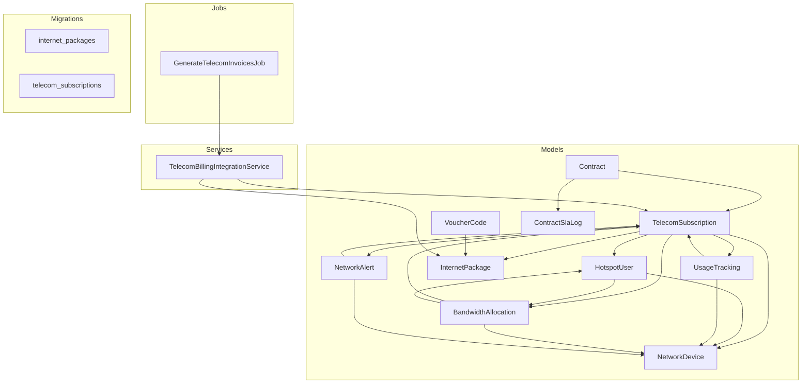
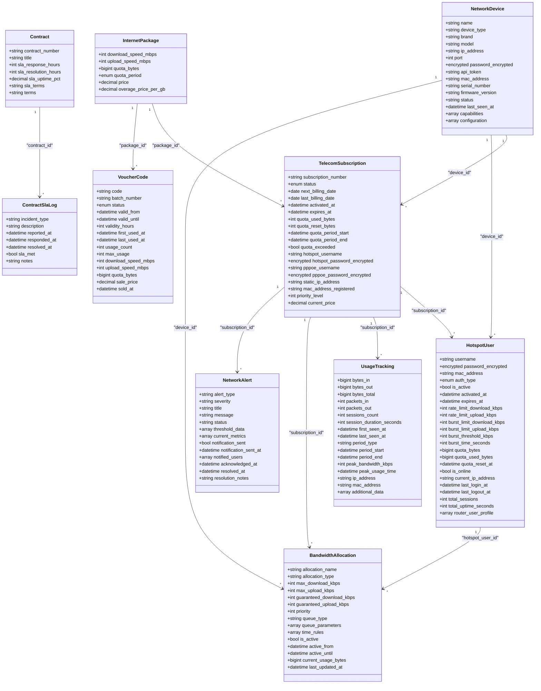
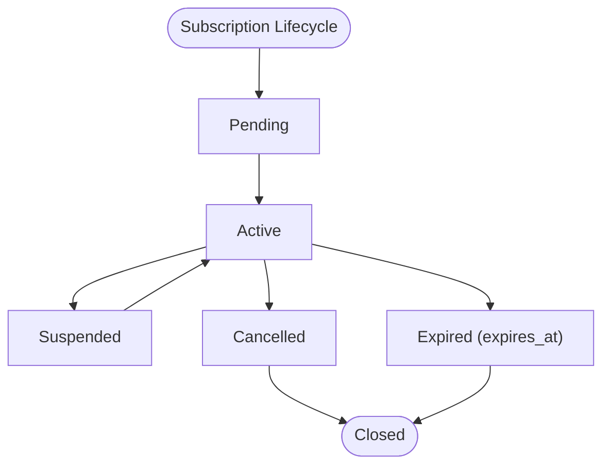
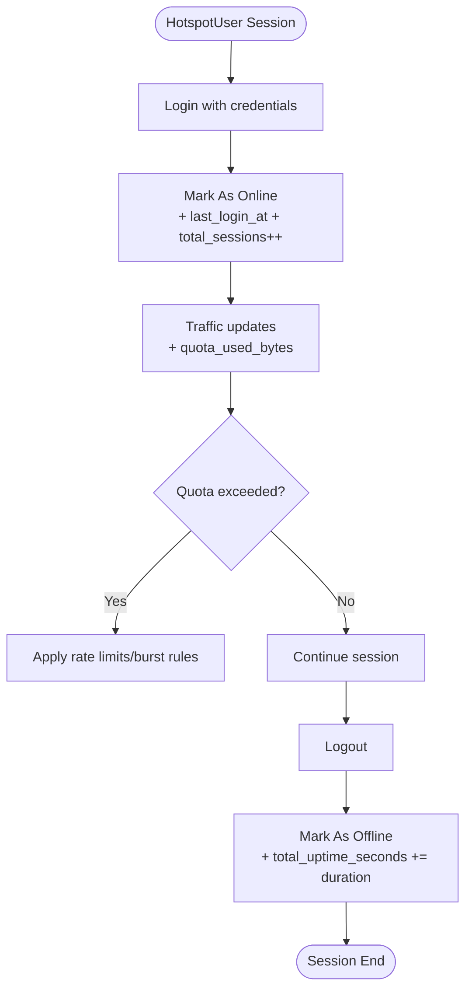
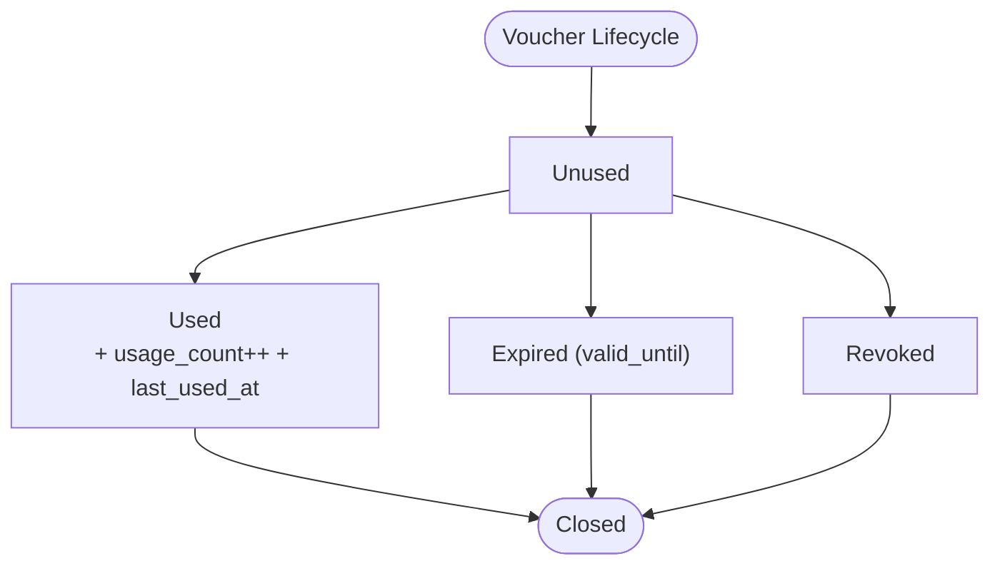
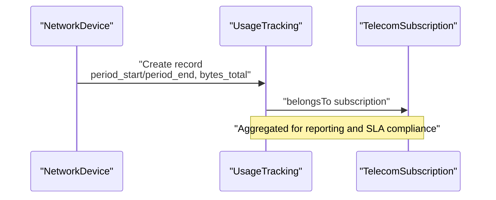
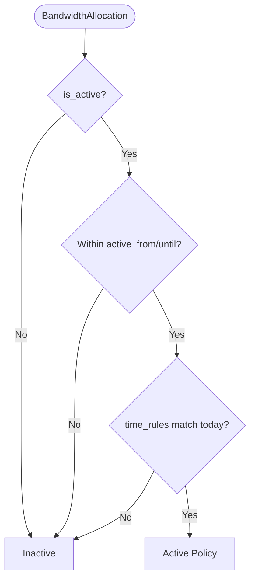
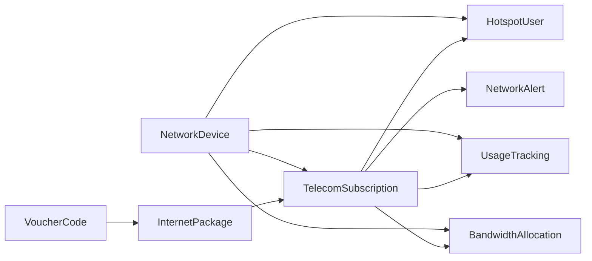

# Telecom Entities

<cite>
**Referenced Files in This Document**
- [TelecomSubscription.php](file://app/Models/TelecomSubscription.php)
- [HotspotUser.php](file://app/Models/HotspotUser.php)
- [VoucherCode.php](file://app/Models/VoucherCode.php)
- [UsageTracking.php](file://app/Models/UsageTracking.php)
- [BandwidthAllocation.php](file://app/Models/BandwidthAllocation.php)
- [InternetPackage.php](file://app/Models/InternetPackage.php)
- [NetworkDevice.php](file://app/Models/NetworkDevice.php)
- [NetworkAlert.php](file://app/Models/NetworkAlert.php)
- [Contract.php](file://app/Models/Contract.php)
- [ContractSlaLog.php](file://app/Models/ContractSlaLog.php)
- [TelecomBillingIntegrationService.php](file://app/Services/Telecom/TelecomBillingIntegrationService.php)
- [GenerateTelecomInvoicesJob.php](file://app/Jobs/GenerateTelecomInvoicesJob.php)
- [2026_04_04_000002_create_internet_packages_table.php](file://database/migrations/2026_04_04_000002_create_internet_packages_table.php)
- [2026_04_04_000003_create_telecom_subscriptions_table.php](file://database/migrations/2026_04_04_000003_create_telecom_subscriptions_table.php)
- [UsageController.php](file://app/Http/Controllers/Api/Telecom/UsageController.php)
</cite>

## Table of Contents
1. [Introduction](#introduction)
2. [Project Structure](#project-structure)
3. [Core Components](#core-components)
4. [Architecture Overview](#architecture-overview)
5. [Detailed Component Analysis](#detailed-component-analysis)
6. [Dependency Analysis](#dependency-analysis)
7. [Performance Considerations](#performance-considerations)
8. [Troubleshooting Guide](#troubleshooting-guide)
9. [Conclusion](#conclusion)

## Introduction
This document describes the telecom data models used by Qalcuity ERP for service provisioning, wireless access management, network monitoring, and billing. It focuses on:
- TelecomSubscription for provisioning and billing lifecycle
- HotspotUser and VoucherCode for guest Wi‑Fi access
- UsageTracking and BandwidthAllocation for monitoring and capacity planning
- Telecom billing patterns, usage-based pricing, and service level agreements

## Project Structure
The telecom domain spans models, services, jobs, and migrations that define entities, relationships, and workflows for provisioning, access control, monitoring, and invoicing.

**Diagram sources**
- [TelecomSubscription.php:12-130](file://app/Models/TelecomSubscription.php#L12-L130)
- [HotspotUser.php:12-101](file://app/Models/HotspotUser.php#L12-L101)
- [VoucherCode.php:10-90](file://app/Models/VoucherCode.php#L10-L90)
- [UsageTracking.php:10-75](file://app/Models/UsageTracking.php#L10-L75)
- [BandwidthAllocation.php:10-81](file://app/Models/BandwidthAllocation.php#L10-L81)
- [InternetPackage.php:12-81](file://app/Models/InternetPackage.php#L12-L81)
- [NetworkDevice.php:13-97](file://app/Models/NetworkDevice.php#L13-L97)
- [NetworkAlert.php:10-82](file://app/Models/NetworkAlert.php#L10-L82)
- [Contract.php:11-45](file://app/Models/Contract.php#L11-L45)
- [ContractSlaLog.php:10-43](file://app/Models/ContractSlaLog.php#L10-L43)
- [TelecomBillingIntegrationService.php:13-93](file://app/Services/Telecom/TelecomBillingIntegrationService.php#L13-L93)
- [GenerateTelecomInvoicesJob.php:13-46](file://app/Jobs/GenerateTelecomInvoicesJob.php#L13-L46)
- [2026_04_04_000002_create_internet_packages_table.php:13-54](file://database/migrations/2026_04_04_000002_create_internet_packages_table.php#L13-L54)
- [2026_04_04_000003_create_telecom_subscriptions_table.php:13-33](file://database/migrations/2026_04_04_000003_create_telecom_subscriptions_table.php#L13-L33)

**Section sources**
- [TelecomSubscription.php:12-130](file://app/Models/TelecomSubscription.php#L12-L130)
- [InternetPackage.php:12-81](file://app/Models/InternetPackage.php#L12-L81)
- [HotspotUser.php:12-101](file://app/Models/HotspotUser.php#L12-L101)
- [VoucherCode.php:10-90](file://app/Models/VoucherCode.php#L10-L90)
- [UsageTracking.php:10-75](file://app/Models/UsageTracking.php#L10-L75)
- [BandwidthAllocation.php:10-81](file://app/Models/BandwidthAllocation.php#L10-L81)
- [NetworkDevice.php:13-97](file://app/Models/NetworkDevice.php#L13-L97)
- [NetworkAlert.php:10-82](file://app/Models/NetworkAlert.php#L10-L82)
- [Contract.php:11-45](file://app/Models/Contract.php#L11-L45)
- [ContractSlaLog.php:10-43](file://app/Models/ContractSlaLog.php#L10-L43)
- [TelecomBillingIntegrationService.php:13-93](file://app/Services/Telecom/TelecomBillingIntegrationService.php#L13-L93)
- [GenerateTelecomInvoicesJob.php:13-46](file://app/Jobs/GenerateTelecomInvoicesJob.php#L13-L46)
- [2026_04_04_000002_create_internet_packages_table.php:13-54](file://database/migrations/2026_04_04_000002_create_internet_packages_table.php#L13-L54)
- [2026_04_04_000003_create_telecom_subscriptions_table.php:13-33](file://database/migrations/2026_04_04_000003_create_telecom_subscriptions_table.php#L13-L33)

## Core Components
- TelecomSubscription: central entity for provisioning, billing cycle, quotas, and access credentials (hotspot and PPPoE).
- HotspotUser: per-subscription Wi‑Fi user accounts with rate limits, burst controls, quotas, and session metrics.
- VoucherCode: promotional or retail vouchers linked to packages, validity windows, and usage caps.
- UsageTracking: per-period traffic metrics and peak usage timestamps for monitoring and reporting.
- BandwidthAllocation: QoS policies for subscriptions and users, including max/guaranteed rates, priorities, and time-based rules.
- Supporting models: InternetPackage (service plans), NetworkDevice (routers/APs), NetworkAlert (alarms), Contract/ContractSlaLog (SLA).

**Section sources**
- [TelecomSubscription.php:16-65](file://app/Models/TelecomSubscription.php#L16-L65)
- [HotspotUser.php:16-69](file://app/Models/HotspotUser.php#L16-L69)
- [VoucherCode.php:13-50](file://app/Models/VoucherCode.php#L13-L50)
- [UsageTracking.php:13-51](file://app/Models/UsageTracking.php#L13-L51)
- [BandwidthAllocation.php:13-49](file://app/Models/BandwidthAllocation.php#L13-L49)
- [InternetPackage.php:16-57](file://app/Models/InternetPackage.php#L16-L57)
- [NetworkDevice.php:17-49](file://app/Models/NetworkDevice.php#L17-L49)
- [NetworkAlert.php:13-42](file://app/Models/NetworkAlert.php#L13-L42)
- [Contract.php:14-36](file://app/Models/Contract.php#L14-L36)
- [ContractSlaLog.php:13-27](file://app/Models/ContractSlaLog.php#L13-L27)

## Architecture Overview
The telecom subsystem integrates provisioning, access, monitoring, and billing via explicit model relationships and service/job orchestration.

**Diagram sources**
- [InternetPackage.php:12-81](file://app/Models/InternetPackage.php#L12-L81)
- [TelecomSubscription.php:12-130](file://app/Models/TelecomSubscription.php#L12-L130)
- [HotspotUser.php:12-101](file://app/Models/HotspotUser.php#L12-L101)
- [VoucherCode.php:10-90](file://app/Models/VoucherCode.php#L10-L90)
- [UsageTracking.php:10-75](file://app/Models/UsageTracking.php#L10-L75)
- [BandwidthAllocation.php:10-81](file://app/Models/BandwidthAllocation.php#L10-L81)
- [NetworkDevice.php:13-97](file://app/Models/NetworkDevice.php#L13-L97)
- [NetworkAlert.php:10-82](file://app/Models/NetworkAlert.php#L10-L82)
- [Contract.php:11-45](file://app/Models/Contract.php#L11-L45)
- [ContractSlaLog.php:10-43](file://app/Models/ContractSlaLog.php#L10-L43)

## Detailed Component Analysis

### TelecomSubscription
Responsibilities:
- Provisioning lifecycle: pending, active, suspended, cancelled, expired
- Billing cycle management: monthly/quarterly/semi-annual/annual
- Quota tracking: used, reset, period boundaries
- Access credentials: encrypted hotspot and PPPoE secrets
- Relationships: belongs to Tenant, Customer, InternetPackage, NetworkDevice; has many HotspotUser, UsageTracking, BandwidthAllocation, NetworkAlert

Key behaviors:
- Status transitions: activate, suspend, cancel
- Quota reset and calculation of next reset based on package quota period
- Scopes for active/expired/quota-exceeded/expiring-soon
- Encrypted attributes for sensitive credentials

**Diagram sources**
- [TelecomSubscription.php:134-203](file://app/Models/TelecomSubscription.php#L134-L203)

**Section sources**
- [TelecomSubscription.php:16-65](file://app/Models/TelecomSubscription.php#L16-L65)
- [TelecomSubscription.php:134-203](file://app/Models/TelecomSubscription.php#L134-L203)
- [TelecomSubscription.php:273-302](file://app/Models/TelecomSubscription.php#L273-L302)
- [2026_04_04_000003_create_telecom_subscriptions_table.php:20-33](file://database/migrations/2026_04_04_000003_create_telecom_subscriptions_table.php#L20-L33)

### HotspotUser
Responsibilities:
- Per-subscription Wi‑Fi user account management
- Rate limiting and burst controls (download/upload kbps)
- Quota enforcement and remaining quota computation
- Online/offline session tracking and uptime aggregation
- Relationships: belongs to Tenant, TelecomSubscription, NetworkDevice; has many BandwidthAllocation

Key behaviors:
- Password encryption/decryption
- Quota exceeded checks and remaining quota formatting
- Session counters and IP address tracking
- Scopes for active/online/expired

**Diagram sources**
- [HotspotUser.php:184-204](file://app/Models/HotspotUser.php#L184-L204)
- [HotspotUser.php:137-145](file://app/Models/HotspotUser.php#L137-L145)

**Section sources**
- [HotspotUser.php:16-69](file://app/Models/HotspotUser.php#L16-L69)
- [HotspotUser.php:105-121](file://app/Models/HotspotUser.php#L105-L121)
- [HotspotUser.php:137-145](file://app/Models/HotspotUser.php#L137-L145)
- [HotspotUser.php:184-204](file://app/Models/HotspotUser.php#L184-L204)
- [HotspotUser.php:228-248](file://app/Models/HotspotUser.php#L228-L248)

### VoucherCode
Responsibilities:
- Retail/voucherized access provisioning aligned with InternetPackage
- Validity windows, usage counts, and redemption tracking
- Speed and quota caps inherited from package
- Relationships: belongs to Tenant, InternetPackage, User (generated_by), Customer (used_by/sold_to)

Key behaviors:
- Status lifecycle: unused → used → expired/revoked
- Validity checks and “can be used” evaluation
- Scopes for unused/valid/batch filtering

**Diagram sources**
- [VoucherCode.php:137-158](file://app/Models/VoucherCode.php#L137-L158)
- [VoucherCode.php:110-122](file://app/Models/VoucherCode.php#L110-L122)

**Section sources**
- [VoucherCode.php:13-50](file://app/Models/VoucherCode.php#L13-L50)
- [VoucherCode.php:110-122](file://app/Models/VoucherCode.php#L110-L122)
- [VoucherCode.php:137-158](file://app/Models/VoucherCode.php#L137-L158)
- [VoucherCode.php:198-222](file://app/Models/VoucherCode.php#L198-L222)

### UsageTracking
Responsibilities:
- Capture per-period traffic metrics (bytes in/out/total), sessions, durations, and peak bandwidth
- Associate records to TelecomSubscription and NetworkDevice
- Human-readable formatting helpers for bytes and durations

Key behaviors:
- Scopes for period type, date range, and high usage ranking
- Formatting utilities for display

**Diagram sources**
- [UsageTracking.php:10-75](file://app/Models/UsageTracking.php#L10-L75)
- [UsageTracking.php:139-158](file://app/Models/UsageTracking.php#L139-L158)

**Section sources**
- [UsageTracking.php:13-51](file://app/Models/UsageTracking.php#L13-L51)
- [UsageTracking.php:139-158](file://app/Models/UsageTracking.php#L139-L158)

### BandwidthAllocation
Responsibilities:
- Define QoS policies for subscriptions and users
- Enforce max and guaranteed rates, priority queues, and time-based rules
- Track current usage and activity windows

Key behaviors:
- Time-based activation checks against configured time_rules
- Attribute helpers to convert kbps to Mbps and format current usage
- Scopes for active, type, and priority ordering

**Diagram sources**
- [BandwidthAllocation.php:86-106](file://app/Models/BandwidthAllocation.php#L86-L106)
- [BandwidthAllocation.php:111-129](file://app/Models/BandwidthAllocation.php#L111-L129)

**Section sources**
- [BandwidthAllocation.php:13-49](file://app/Models/BandwidthAllocation.php#L13-L49)
- [BandwidthAllocation.php:86-106](file://app/Models/BandwidthAllocation.php#L86-L106)
- [BandwidthAllocation.php:134-145](file://app/Models/BandwidthAllocation.php#L134-L145)
- [BandwidthAllocation.php:167-186](file://app/Models/BandwidthAllocation.php#L167-L186)

### InternetPackage
Responsibilities:
- Service plan definition: speeds, burst, quota, rollover, pricing, features
- Link to TelecomSubscription and VoucherCode
- Overage calculation for usage-based billing

Key behaviors:
- Unlimited quota detection and GB conversion
- Formatted price display
- Scopes for active/public/ordering

**Section sources**
- [InternetPackage.php:16-57](file://app/Models/InternetPackage.php#L16-L57)
- [InternetPackage.php:138-146](file://app/Models/InternetPackage.php#L138-L146)
- [2026_04_04_000002_create_internet_packages_table.php:13-54](file://database/migrations/2026_04_04_000002_create_internet_packages_table.php#L13-L54)

### NetworkDevice and NetworkAlert
Responsibilities:
- NetworkDevice: router/AP inventory, connectivity status, and associations to subscriptions/users/allocations/alerts
- NetworkAlert: severity/status tracking, acknowledgments, resolutions, and notifications

**Section sources**
- [NetworkDevice.php:17-49](file://app/Models/NetworkDevice.php#L17-L49)
- [NetworkDevice.php:118-143](file://app/Models/NetworkDevice.php#L118-L143)
- [NetworkAlert.php:13-42](file://app/Models/NetworkAlert.php#L13-L42)
- [NetworkAlert.php:111-131](file://app/Models/NetworkAlert.php#L111-L131)

### Contract and ContractSlaLog (SLA)
Responsibilities:
- Contract captures SLA targets (response/resolution hours, uptime %) and terms
- ContractSlaLog tracks incidents and SLA compliance metrics

**Section sources**
- [Contract.php:14-36](file://app/Models/Contract.php#L14-L36)
- [Contract.php:64-69](file://app/Models/Contract.php#L64-L69)
- [ContractSlaLog.php:19-43](file://app/Models/ContractSlaLog.php#L19-L43)

## Dependency Analysis
Telecom models are tightly coupled around provisioning and monitoring:
- TelecomSubscription depends on InternetPackage and NetworkDevice
- HotspotUser depends on TelecomSubscription and NetworkDevice
- BandwidthAllocation depends on TelecomSubscription, HotspotUser, and NetworkDevice
- UsageTracking depends on TelecomSubscription and NetworkDevice
- VoucherCode depends on InternetPackage
- NetworkAlert depends on TelecomSubscription and NetworkDevice
- Billing integration orchestrates TelecomSubscription and Invoice creation

**Diagram sources**
- [TelecomSubscription.php:86-96](file://app/Models/TelecomSubscription.php#L86-L96)
- [HotspotUser.php:82-92](file://app/Models/HotspotUser.php#L82-L92)
- [UsageTracking.php:64-74](file://app/Models/UsageTracking.php#L64-L74)
- [BandwidthAllocation.php:69-80](file://app/Models/BandwidthAllocation.php#L69-L80)
- [NetworkDevice.php:78-97](file://app/Models/NetworkDevice.php#L78-L97)
- [NetworkAlert.php:63-65](file://app/Models/NetworkAlert.php#L63-L65)
- [VoucherCode.php:63-65](file://app/Models/VoucherCode.php#L63-L65)

**Section sources**
- [TelecomSubscription.php:86-130](file://app/Models/TelecomSubscription.php#L86-L130)
- [HotspotUser.php:82-101](file://app/Models/HotspotUser.php#L82-L101)
- [UsageTracking.php:64-75](file://app/Models/UsageTracking.php#L64-L75)
- [BandwidthAllocation.php:69-81](file://app/Models/BandwidthAllocation.php#L69-L81)
- [NetworkDevice.php:78-97](file://app/Models/NetworkDevice.php#L78-L97)
- [NetworkAlert.php:63-66](file://app/Models/NetworkAlert.php#L63-L66)
- [VoucherCode.php:63-65](file://app/Models/VoucherCode.php#L63-L65)

## Performance Considerations
- Indexing: ensure foreign keys (tenant_id, customer_id, package_id, device_id, subscription_id) are indexed in migrations for fast joins and scopes.
- Scopes and queries: leverage scopes (active/expired/quota exceeded, online/active, valid/unused) to minimize ad-hoc filtering.
- Encryption overhead: encrypted fields incur CPU cost; cache decrypted values only when necessary and avoid frequent re-encryption.
- BandwidthAllocation time_rules: evaluate time windows efficiently; precompute daily windows if needed.
- UsageTracking aggregation: summarize at period boundaries to reduce row counts for reporting.

[No sources needed since this section provides general guidance]

## Troubleshooting Guide
Common issues and diagnostics:
- Subscription status anomalies: verify activate/suspend/cancel transitions and expiry checks.
- Quota not resetting: confirm next reset calculation and resetQuota invocation.
- HotspotUser quota exceeded: validate quota_bytes vs quota_used_bytes and remaining_quota formatting.
- BandwidthAllocation inactive: check is_active flag, active_from/until, and time_rules matching current day/time.
- Voucher validity: ensure status reflects unused/used/expired and usage_count/max_usage thresholds.
- Alerts not resolving: track acknowledgment/resolution flows and notification_sent flags.

**Section sources**
- [TelecomSubscription.php:162-203](file://app/Models/TelecomSubscription.php#L162-L203)
- [HotspotUser.php:137-157](file://app/Models/HotspotUser.php#L137-L157)
- [BandwidthAllocation.php:86-106](file://app/Models/BandwidthAllocation.php#L86-L106)
- [VoucherCode.php:110-122](file://app/Models/VoucherCode.php#L110-L122)
- [NetworkAlert.php:111-131](file://app/Models/NetworkAlert.php#L111-L131)

## Conclusion
Qalcuity ERP’s telecom module provides a cohesive model set for provisioning, access control, monitoring, and billing. TelecomSubscription anchors the lifecycle and quotas, HotspotUser manages guest access, VoucherCode enables flexible sales, UsageTracking and BandwidthAllocation support capacity planning and QoS, and Contract/ContractSlaLog formalizes SLA expectations. The TelecomBillingIntegrationService and scheduled job automate recurring invoicing aligned with package billing cycles and usage.