# Database Schema Evolution

<cite>
**Referenced Files in This Document**
- [database.php](file://config/database.php)
- [migration.php](file://config/migration.php)
- [0001_01_01_000000_create_users_table.php](file://database/migrations/0001_01_01_000000_create_users_table.php)
- [User.php](file://app/Models/User.php)
- [Tenant.php](file://app/Models/Tenant.php)
- [TenantDataMigrationService.php](file://app/Services/TenantDataMigrationService.php)
- [2026_04_06_090000_create_error_handling_tables.php](file://database/migrations/2026_04_06_090000_create_error_handling_tables.php)
- [2026_04_10_050000_add_missing_foreign_key_constraints.php](file://database/migrations/2026_04_10_050000_add_missing_foreign_key_constraints.php)
- [2026_01_01_000024_create_advanced_document_management_tables.php](file://database/migrations/2026_01_01_000024_create_advanced_document_management_tables.php)
- [2026_04_08_1000001_create_telemedicine_tables.php](file://database/migrations/2026_04_08_1000001_create_telemedicine_tables.php)
- [2026_04_10_000001_create_telemedicine_settings.php](file://database/migrations/2026_04_10_000001_create_telemedicine_settings.php)
- [2026_04_08_1900001_create_telemedicine_resource_inventory_tables.php](file://database/migrations/2026_04_08_1900001_create_telemedicine_resource_inventory_tables.php)
- [2026_04_06_120000_create_multi_company_tables.php](file://database/migrations/2026_04_06_120000_create_multi_company_tables.php)
- [TelemedicineSetting.php](file://app/Models/TelemedicineSetting.php)
- [NotificationPreference.php](file://app/Models/NotificationPreference.php)
- [Department.php](file://app/Models/Department.php)
- [CompanyGroup.php](file://app/Models/CompanyGroup.php)
- [MIGRATION_AUDIT_REPORT.md](file://MIGRATION_AUDIT_REPORT.md)
- [TASK_LIST_DETAILED.md](file://TASK_LIST_DETAILED.md)
</cite>

## Update Summary
**Changes Made**
- Added comprehensive document management system with versioning, approval workflows, and cloud storage integration
- Integrated advanced telemedicine infrastructure including consultation management, recording systems, prescription workflows, and comprehensive resource inventory tracking
- Implemented multi-company consolidation and inter-entity transaction management
- Enhanced notification infrastructure with comprehensive preference management and channel support
- Added organizational structure tables for hierarchical department management
- Expanded error handling and recovery mechanisms with automated backup and conflict resolution systems

## Table of Contents
1. [Introduction](#introduction)
2. [Project Structure](#project-structure)
3. [Core Components](#core-components)
4. [Architecture Overview](#architecture-overview)
5. [Detailed Component Analysis](#detailed-component-analysis)
6. [Advanced Schema Extensions](#advanced-schema-extensions)
7. [Dependency Analysis](#dependency-analysis)
8. [Performance Considerations](#performance-considerations)
9. [Troubleshooting Guide](#troubleshooting-guide)
10. [Conclusion](#conclusion)

## Introduction
This document explains how the qalcuityERP codebase manages database schema evolution through Laravel migrations, tenant isolation, and robust error handling mechanisms. The system has been significantly extended to support advanced document management, telemedicine operations, multi-company consolidation, and comprehensive notification infrastructure. It covers the migration configuration, schema definition patterns, tenant-aware models, and operational safeguards for safe schema changes across multiple tenants.

## Project Structure
The schema evolution system centers around four pillars:
- Configuration: Database connections and migration optimization settings
- Migrations: Versioned schema definitions and corrective adjustments
- Models: Tenant-aware Eloquent models that enforce multi-tenancy constraints
- Extended Services: Advanced document management, telemedicine, and multi-company operations

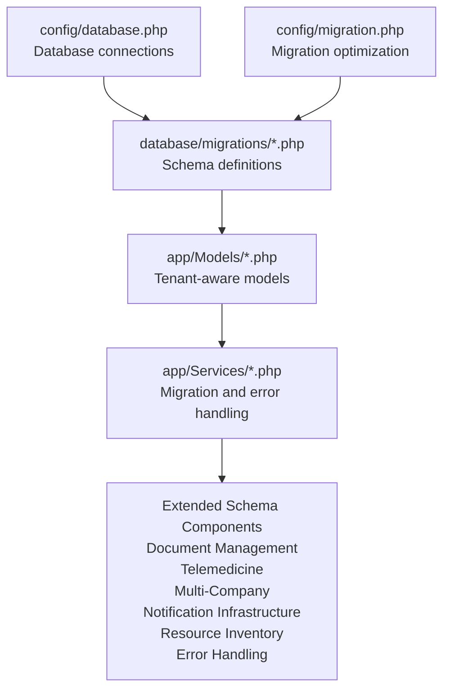

**Diagram sources**
- [database.php:1-185](file://config/database.php#L1-L185)
- [migration.php:1-24](file://config/migration.php#L1-L24)
- [0001_01_01_000000_create_users_table.php:1-52](file://database/migrations/0001_01_01_000000_create_users_table.php#L1-L52)
- [User.php:15-280](file://app/Models/User.php#L15-L280)
- [Tenant.php:10-223](file://app/Models/Tenant.php#L10-L223)
- [TenantDataMigrationService.php:301-350](file://app/Services/TenantDataMigrationService.php#L301-L350)
- [2026_01_01_000024_create_advanced_document_management_tables.php:1-187](file://database/migrations/2026_01_01_000024_create_advanced_document_management_tables.php#L1-L187)
- [2026_04_08_1000001_create_telemedicine_tables.php:1-266](file://database/migrations/2026_04_08_1000001_create_telemedicine_tables.php#L1-L266)

**Section sources**
- [database.php:1-185](file://config/database.php#L1-L185)
- [migration.php:1-24](file://config/migration.php#L1-L24)

## Core Components
- Database configuration supports SQLite, MySQL/MariaDB, PostgreSQL, and SQL Server drivers with dedicated connection settings and Redis options.
- Migration optimization settings enable foreign key toggles, single-transaction execution, and batch sizing to improve development performance.
- Initial migrations define foundational tables including users, password reset tokens, sessions, and tenant relationships.
- Tenant-aware models encapsulate multi-tenancy constraints and relationship patterns.

**Section sources**
- [database.php:33-117](file://config/database.php#L33-L117)
- [migration.php:14-22](file://config/migration.php#L14-L22)
- [0001_01_01_000000_create_users_table.php:11-50](file://database/migrations/0001_01_01_000000_create_users_table.php#L11-L50)
- [User.php:19-57](file://app/Models/User.php#L19-L57)
- [Tenant.php:13-57](file://app/Models/Tenant.php#L13-L57)

## Architecture Overview
The schema evolution architecture integrates configuration-driven database connectivity, versioned migrations, and tenant-aware models. The system now includes comprehensive operational safeguards including error handling tables, restore points, conflict resolution, foreign key constraint enforcement, and extensive schema extensions for document management, telemedicine, multi-company operations, and notification infrastructure.

```mermaid
graph TB
subgraph "Configuration Layer"
DBConn["Database Connections"]
MigOpt["Migration Optimization"]
end
subgraph "Schema Layer"
Users["users table"]
PasswordReset["password_reset_tokens table"]
Sessions["sessions table"]
ErrorHandling["Error handling tables"]
RestorePoints["Restore points"]
EditConflicts["Edit conflicts"]
DocumentMgmt["Document Management Tables"]
Telemedicine["Telemedicine Tables"]
TeleResource["Telemedicine Resource Inventory"]
MultiCompany["Multi-Company Tables"]
NotificationInfra["Notification Infrastructure"]
end
subgraph "Domain Layer"
TenantModel["Tenant model"]
UserModel["User model"]
MigrationService["TenantDataMigrationService"]
DocumentModel["Document models"]
TelemedicineModel["Telemedicine models"]
TeleResourceModel["Telemedicine resource models"]
MultiCompanyModel["Multi-company models"]
NotificationModel["Notification models"]
end
DBConn --> Users
MigOpt --> Users
Users --> UserModel
TenantModel --> UserModel
ErrorHandling --> MigrationService
RestorePoints --> MigrationService
EditConflicts --> MigrationService
DocumentMgmt --> DocumentModel
Telemedicine --> TelemedicineModel
TeleResource --> TeleResourceModel
MultiCompany --> MultiCompanyModel
NotificationInfra --> NotificationModel
```

**Diagram sources**
- [database.php:33-117](file://config/database.php#L33-L117)
- [migration.php:14-22](file://config/migration.php#L14-L22)
- [0001_01_01_000000_create_users_table.php:13-39](file://database/migrations/0001_01_01_000000_create_users_table.php#L13-L39)
- [2026_04_06_090000_create_error_handling_tables.php:52-80](file://database/migrations/2026_04_06_090000_create_error_handling_tables.php#L52-L80)
- [2026_01_01_000024_create_advanced_document_management_tables.php:43-147](file://database/migrations/2026_01_01_000024_create_advanced_document_management_tables.php#L43-L147)
- [2026_04_08_1000001_create_telemedicine_tables.php:20-251](file://database/migrations/2026_04_08_1000001_create_telemedicine_tables.php#L20-251)
- [2026_04_08_1900001_create_telemedicine_resource_inventory_tables.php:60-148](file://database/migrations/2026_04_08_1900001_create_telemedicine_resource_inventory_tables.php#L60-L148)
- [2026_04_06_120000_create_multi_company_tables.php:13-234](file://database/migrations/2026_04_06_120000_create_multi_company_tables.php#L13-234)
- [Tenant.php:77-90](file://app/Models/Tenant.php#L77-L90)
- [User.php:61-64](file://app/Models/User.php#L61-L64)
- [TenantDataMigrationService.php:301-350](file://app/Services/TenantDataMigrationService.php#L301-L350)

## Detailed Component Analysis

### Database Configuration
- Supports multiple drivers with environment-based overrides for host, port, database name, credentials, charset, collation, and SSL options.
- Defines migration repository table and update behavior for published migrations.
- Includes Redis client configuration for caching and queues.

**Section sources**
- [database.php:20-117](file://config/database.php#L20-L117)
- [database.php:130-133](file://config/database.php#L130-L133)
- [database.php:146-182](file://config/database.php#L146-L182)

### Migration Optimization Settings
- Disables foreign key checks during migrations for faster execution when enabled.
- Allows single-transaction mode for all migrations when feasible.
- Configurable batch size for controlled execution during development.

**Section sources**
- [migration.php:14-22](file://config/migration.php#L14-L22)

### Initial Schema Definitions
- Creates users table with tenant foreign key, role enumeration, and activity flag.
- Adds password reset tokens and sessions tables for authentication lifecycle.
- Establishes tenant relationship via tenant_id on users.

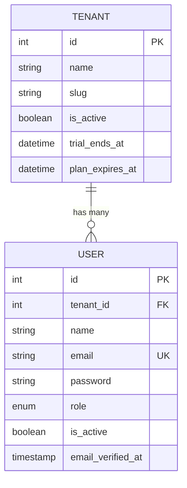

**Diagram sources**
- [0001_01_01_000000_create_users_table.php:13-24](file://database/migrations/0001_01_01_000000_create_users_table.php#L13-L24)
- [Tenant.php:13-47](file://app/Models/Tenant.php#L13-L47)
- [User.php:19-40](file://app/Models/User.php#L19-L40)

**Section sources**
- [0001_01_01_000000_create_users_table.php:11-50](file://database/migrations/0001_01_01_000000_create_users_table.php#L11-L50)
- [User.php:61-64](file://app/Models/User.php#L61-L64)
- [Tenant.php:77-80](file://app/Models/Tenant.php#L77-L80)

### Tenant-Aware Models
- User model defines fillable attributes, hidden fields, casting rules, and tenant relationship.
- Tenant model manages module visibility, subscription status, and business context helpers.

**Section sources**
- [User.php:19-57](file://app/Models/User.php#L19-L57)
- [User.php:61-64](file://app/Models/User.php#L61-L64)
- [Tenant.php:13-57](file://app/Models/Tenant.php#L13-L57)
- [Tenant.php:64-75](file://app/Models/Tenant.php#L64-L75)

### Error Handling and Restore Points
- Error handling tables capture migration failures, backup types, statuses, and timestamps with tenant scoping.
- Restore points table stores snapshots and triggers for safe rollbacks before major changes.
- Edit conflicts table tracks multi-user editing conflicts requiring resolution.
- Enhanced error logs provide actionable solutions and recovery queue for failed operations.

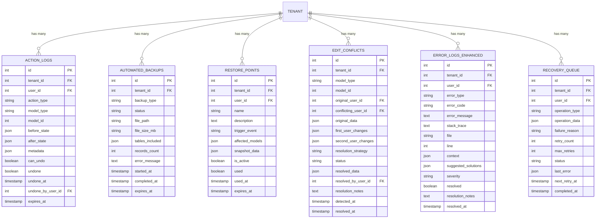

**Diagram sources**
- [2026_04_06_090000_create_error_handling_tables.php:14-144](file://database/migrations/2026_04_06_090000_create_error_handling_tables.php#L14-L144)

**Section sources**
- [2026_04_06_090000_create_error_handling_tables.php:14-160](file://database/migrations/2026_04_06_090000_create_error_handling_tables.php#L14-L160)

### Foreign Key Constraint Enforcement
- Corrective migrations add missing foreign key constraints with defensive error handling.
- Scans existing foreign keys and conditionally adds constraints to prevent referential integrity issues.

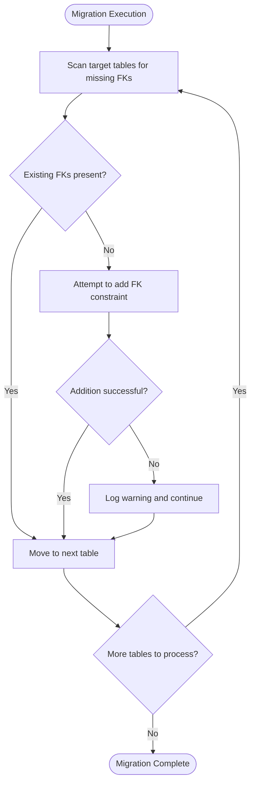

**Diagram sources**
- [2026_04_10_050000_add_missing_foreign_key_constraints.php:78-108](file://database/migrations/2026_04_10_050000_add_missing_foreign_key_constraints.php#L78-L108)

**Section sources**
- [2026_04_10_050000_add_missing_foreign_key_constraints.php:78-108](file://database/migrations/2026_04_10_050000_add_missing_foreign_key_constraints.php#L78-L108)

### Tenant Data Migration Service
- Provides utilities for moving, merging, and deleting tenant data while reassigning foreign key references.
- Includes placeholder logic for discovering references and reassigning them across tables.

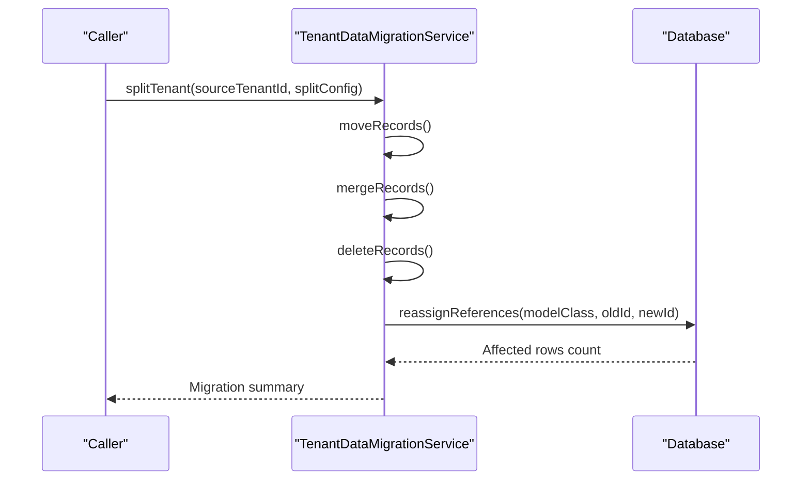

**Diagram sources**
- [TenantDataMigrationService.php:301-350](file://app/Services/TenantDataMigrationService.php#L301-L350)

**Section sources**
- [TenantDataMigrationService.php:301-350](file://app/Services/TenantDataMigrationService.php#L301-L350)

### Migration Audit and Testing
- Migration audit report documents fixes, indexes, foreign keys, and testing procedures.
- Task list confirms deliverables including fixed migrations, performance indexes, foreign key constraints, and migration test documentation.

**Section sources**
- [MIGRATION_AUDIT_REPORT.md:1-200](file://MIGRATION_AUDIT_REPORT.md#L1-L200)
- [TASK_LIST_DETAILED.md:76-87](file://TASK_LIST_DETAILED.md#L76-L87)

## Advanced Schema Extensions

### Document Management System
The system now includes comprehensive document management capabilities with versioning, approval workflows, and cloud storage integration.

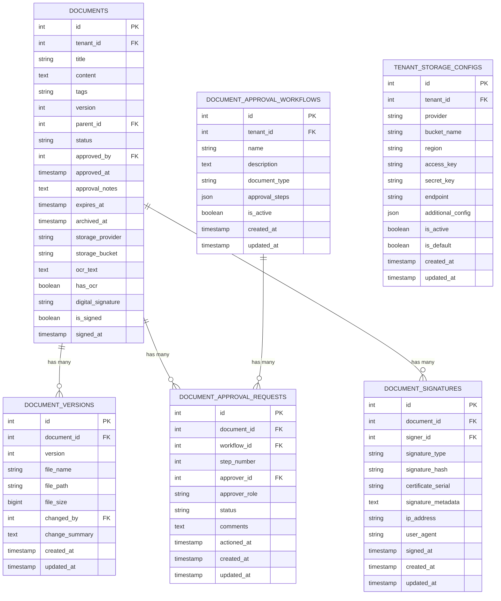

**Diagram sources**
- [2026_01_01_000024_create_advanced_document_management_tables.php:13-147](file://database/migrations/2026_01_01_000024_create_advanced_document_management_tables.php#L13-L147)

**Section sources**
- [2026_01_01_000024_create_advanced_document_management_tables.php:11-187](file://database/migrations/2026_01_01_000024_create_advanced_document_management_tables.php#L11-L187)

### Telemedicine Infrastructure
Advanced telemedicine capabilities include consultation management, recording systems, prescription workflows, comprehensive resource inventory tracking, and detailed operational analytics.

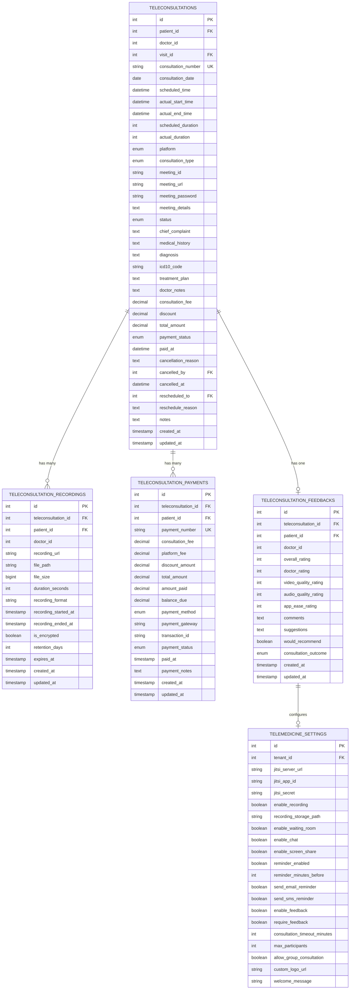

**Diagram sources**
- [2026_04_10_000001_create_telemedicine_settings.php:13-49](file://database/migrations/2026_04_10_000001_create_telemedicine_settings.php#L13-L49)
- [2026_04_08_1000001_create_telemedicine_tables.php:20-251](file://database/migrations/2026_04_08_1000001_create_telemedicine_tables.php#L20-251)

**Section sources**
- [2026_04_10_000001_create_telemedicine_settings.php:11-61](file://database/migrations/2026_04_10_000001_create_telemedicine_settings.php#L11-L61)
- [2026_04_08_1000001_create_telemedicine_tables.php:11-266](file://database/migrations/2026_04_08_1000001_create_telemedicine_tables.php#L11-L266)

### Telemedicine Resource Inventory
Comprehensive telemedicine resource inventory tracking includes equipment management, supply tracking, maintenance scheduling, and utilization analytics.

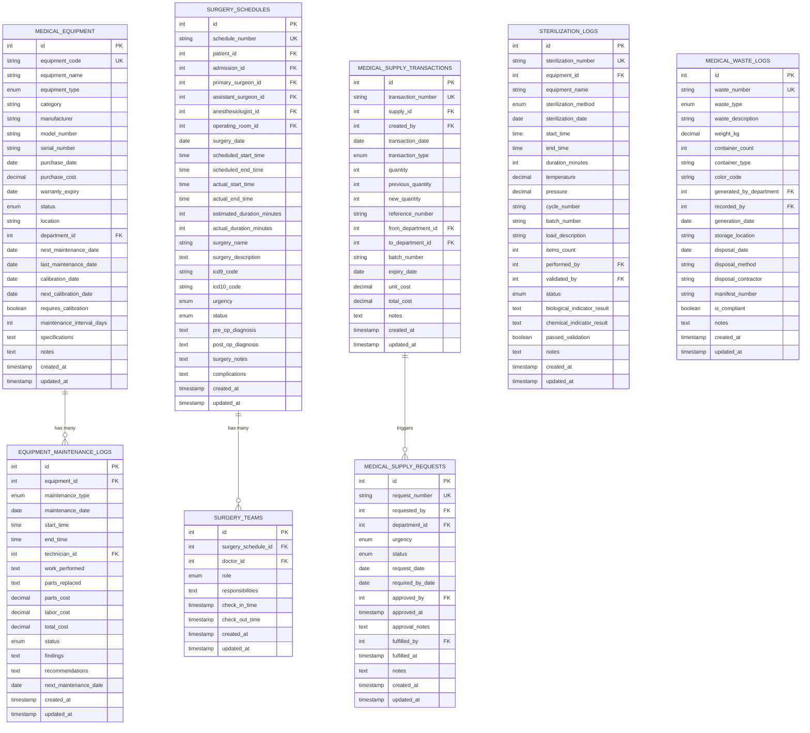

**Diagram sources**
- [2026_04_08_1900001_create_telemedicine_resource_inventory_tables.php:198-391](file://database/migrations/2026_04_08_1900001_create_telemedicine_resource_inventory_tables.php#L198-L391)

**Section sources**
- [2026_04_08_1900001_create_telemedicine_resource_inventory_tables.php:1-445](file://database/migrations/2026_04_08_1900001_create_telemedicine_resource_inventory_tables.php#L1-L445)

### Multi-Company Consolidation
Comprehensive multi-company infrastructure supports inter-entity transactions, consolidated reporting, shared services, and inventory transfers.

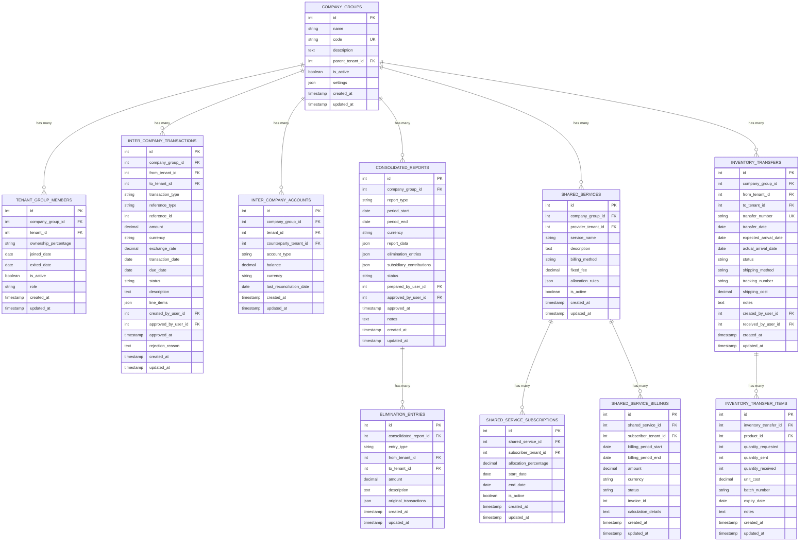

**Diagram sources**
- [2026_04_06_120000_create_multi_company_tables.php:13-234](file://database/migrations/2026_04_06_120000_create_multi_company_tables.php#L13-234)

**Section sources**
- [2026_04_06_120000_create_multi_company_tables.php:11-255](file://database/migrations/2026_04_06_120000_create_multi_company_tables.php#L11-L255)

### Notification Infrastructure
Enhanced notification system with comprehensive preference management, multi-channel support, and module-specific configurations.

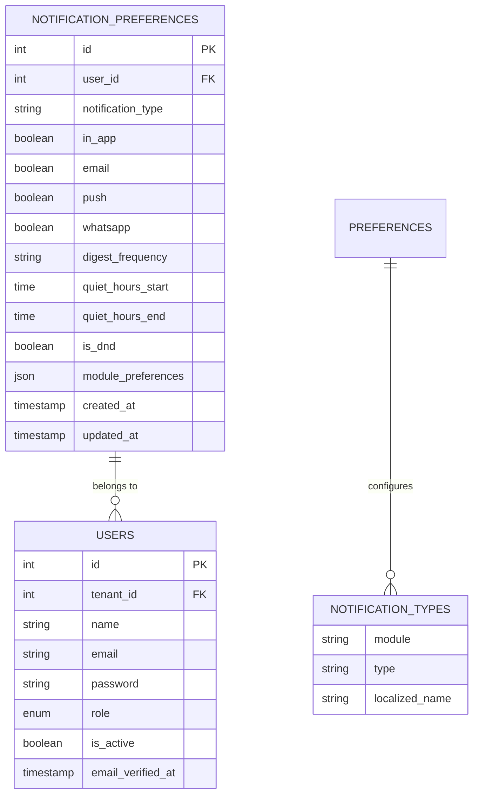

**Diagram sources**
- [NotificationPreference.php:10-147](file://app/Models/NotificationPreference.php#L10-L147)

**Section sources**
- [NotificationPreference.php:8-148](file://app/Models/NotificationPreference.php#L8-L148)

### Organizational Structure
Hierarchical department management with parent-child relationships, department heads, and multi-type department support.

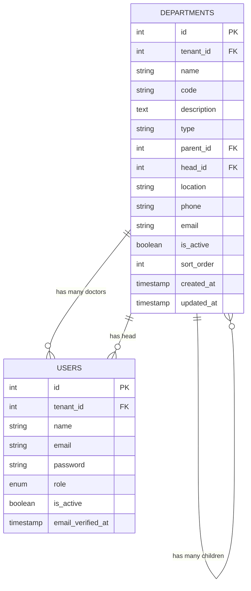

**Diagram sources**
- [Department.php:13-124](file://app/Models/Department.php#L13-L124)

**Section sources**
- [Department.php:9-126](file://app/Models/Department.php#L9-L126)

## Dependency Analysis
The schema evolution system exhibits strong cohesion within configuration, migrations, and models, with clear separation of concerns and extensive new dependencies:
- Configuration depends on environment variables and defines defaults for all supported databases.
- Migrations depend on configuration and apply schema changes consistently across environments.
- Models depend on migrations and enforce tenant isolation and data integrity.
- Services depend on models and migrations to perform safe tenant data operations.
- Extended components depend on core models and introduce new domain-specific relationships.

```mermaid
graph TB
Config["config/database.php"]
MigOpt["config/migration.php"]
MigUsers["migrations/*_create_users_table.php"]
MigFix["migrations/*_add_missing_foreign_key_constraints.php"]
MigErr["migrations/*_create_error_handling_tables.php"]
MigDoc["migrations/*_create_advanced_document_management_tables.php"]
MigTele["migrations/*_create_telemedicine_tables.php"]
MigTeleSettings["migrations/*_create_telemedicine_settings.php"]
MigTeleRes["migrations/*_create_telemedicine_resource_inventory_tables.php"]
MigMulti["migrations/*_create_multi_company_tables.php"]
UserModel["app/Models/User.php"]
TenantModel["app/Models/Tenant.php"]
DocModel["app/Models/* (Document related)"]
TeleModel["app/Models/* (Telemedicine related)"]
TeleResModel["app/Models/* (Telemedicine resource related)"]
MultiModel["app/Models/* (Multi-company related)"]
NotifModel["app/Models/NotificationPreference.php"]
DeptModel["app/Models/Department.php"]
CompanyGroupModel["app/Models/CompanyGroup.php"]
MigService["app/Services/TenantDataMigrationService.php"]
Config --> MigUsers
MigOpt --> MigUsers
MigUsers --> UserModel
MigFix --> UserModel
MigErr --> MigService
TenantModel --> UserModel
MigDoc --> DocModel
MigTele --> TeleModel
MigTeleSettings --> TeleModel
MigTeleRes --> TeleResModel
MigMulti --> MultiModel
NotifModel --> UserModel
DeptModel --> UserModel
CompanyGroupModel --> UserModel
MigService --> UserModel
```

**Diagram sources**
- [database.php:1-185](file://config/database.php#L1-L185)
- [migration.php:1-24](file://config/migration.php#L1-L24)
- [0001_01_01_000000_create_users_table.php:1-52](file://database/migrations/0001_01_01_000000_create_users_table.php#L1-L52)
- [2026_04_10_050000_add_missing_foreign_key_constraints.php:78-108](file://database/migrations/2026_04_10_050000_add_missing_foreign_key_constraints.php#L78-L108)
- [2026_04_06_090000_create_error_handling_tables.php:52-80](file://database/migrations/2026_04_06_090000_create_error_handling_tables.php#L52-L80)
- [2026_01_01_000024_create_advanced_document_management_tables.php:1-187](file://database/migrations/2026_01_01_000024_create_advanced_document_management_tables.php#L1-L187)
- [2026_04_08_1000001_create_telemedicine_tables.php:1-266](file://database/migrations/2026_04_08_1000001_create_telemedicine_tables.php#L1-L266)
- [2026_04_08_1900001_create_telemedicine_resource_inventory_tables.php:1-445](file://database/migrations/2026_04_08_1900001_create_telemedicine_resource_inventory_tables.php#L1-L445)
- [2026_04_06_120000_create_multi_company_tables.php:1-255](file://database/migrations/2026_04_06_120000_create_multi_company_tables.php#L1-L255)
- [User.php:15-280](file://app/Models/User.php#L15-L280)
- [Tenant.php:10-223](file://app/Models/Tenant.php#L10-L223)
- [TelemedicineSetting.php:1-110](file://app/Models/TelemedicineSetting.php#L1-L110)
- [NotificationPreference.php:1-148](file://app/Models/NotificationPreference.php#L1-L148)
- [Department.php:1-126](file://app/Models/Department.php#L1-L126)
- [CompanyGroup.php:1-47](file://app/Models/CompanyGroup.php#L1-L47)
- [TenantDataMigrationService.php:301-350](file://app/Services/TenantDataMigrationService.php#L301-L350)

**Section sources**
- [database.php:1-185](file://config/database.php#L1-L185)
- [migration.php:1-24](file://config/migration.php#L1-L24)
- [0001_01_01_000000_create_users_table.php:1-52](file://database/migrations/0001_01_01_000000_create_users_table.php#L1-L52)
- [User.php:15-280](file://app/Models/User.php#L15-L280)
- [Tenant.php:10-223](file://app/Models/Tenant.php#L10-L223)
- [TenantDataMigrationService.php:301-350](file://app/Services/TenantDataMigrationService.php#L301-L350)

## Performance Considerations
- Enable foreign key disabling during migrations for faster development cycles when appropriate.
- Use single transaction mode to reduce overhead when migrating small batches.
- Set batch size to control memory usage and execution time during large migrations.
- Index tenant_id and frequently queried columns to maintain query performance under multi-tenancy.
- Implement proper indexing strategies for new document management, telemedicine, and multi-company tables.
- Consider partitioning strategies for large historical datasets in telemedicine and document management systems.
- Optimize cloud storage integration with appropriate caching and CDN configurations.
- Implement soft deletes for resource-intensive entities like telemedicine recordings and equipment.
- Use unique constraints judiciously to prevent duplicate entries in high-volume scenarios.

## Troubleshooting Guide
Common issues and resolutions:
- Foreign key constraint failures: Use corrective migrations to add missing constraints with defensive error handling.
- Migration rollback challenges: Utilize restore points to snapshot critical data before major changes.
- Multi-user edit conflicts: Track and resolve conflicts using the edit conflicts table.
- Audit and reporting: Review migration audit reports and task lists to confirm fixes and testing coverage.
- Document version conflicts: Monitor document approval workflows and version histories for resolution.
- Telemedicine integration issues: Verify Jitsi server connectivity and configuration settings.
- Multi-company data synchronization: Ensure proper inter-company transaction processing and elimination entries.
- Notification delivery failures: Check notification preferences and channel configurations.
- Resource inventory conflicts: Monitor equipment maintenance schedules and supply tracking for resolution.
- Backup and recovery: Utilize automated backup system and recovery queue for failed operations.

**Section sources**
- [2026_04_10_050000_add_missing_foreign_key_constraints.php:78-108](file://database/migrations/2026_04_10_050000_add_missing_foreign_key_constraints.php#L78-L108)
- [2026_04_06_090000_create_error_handling_tables.php:52-80](file://database/migrations/2026_04_06_090000_create_error_handling_tables.php#L52-L80)
- [MIGRATION_AUDIT_REPORT.md:1-200](file://MIGRATION_AUDIT_REPORT.md#L1-L200)
- [TASK_LIST_DETAILED.md:76-87](file://TASK_LIST_DETAILED.md#L76-L87)

## Conclusion
The qalcuityERP schema evolution system combines configurable database connectivity, optimized migration execution, tenant-aware models, and robust operational safeguards. The recent extensive extensions now support comprehensive document management with versioning and approval workflows, advanced telemedicine operations with consultation tracking, recording systems, and comprehensive resource inventory management, multi-company consolidation with inter-entity transaction management, and sophisticated notification infrastructure with comprehensive preference management. The expanded error handling system includes automated backup, restore points, conflict resolution, and recovery queue mechanisms. By leveraging corrective migrations, enhanced error handling tables, restore points, foreign key enforcement, and these new advanced schema components, the platform ensures reliable schema changes across multiple tenants while maintaining performance and data integrity.