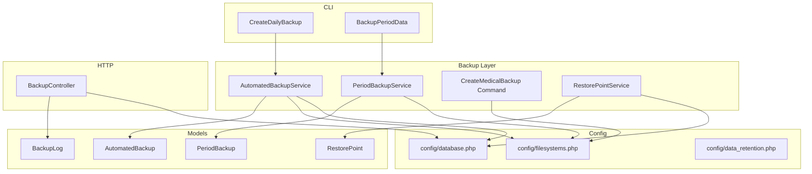
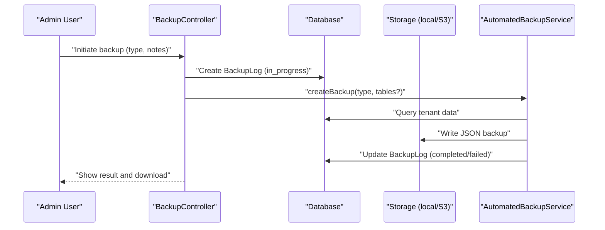
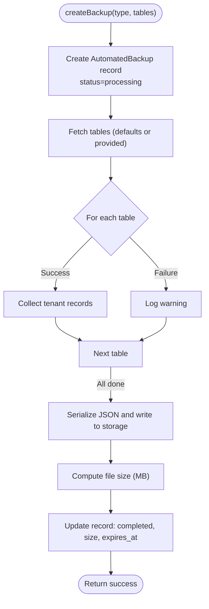
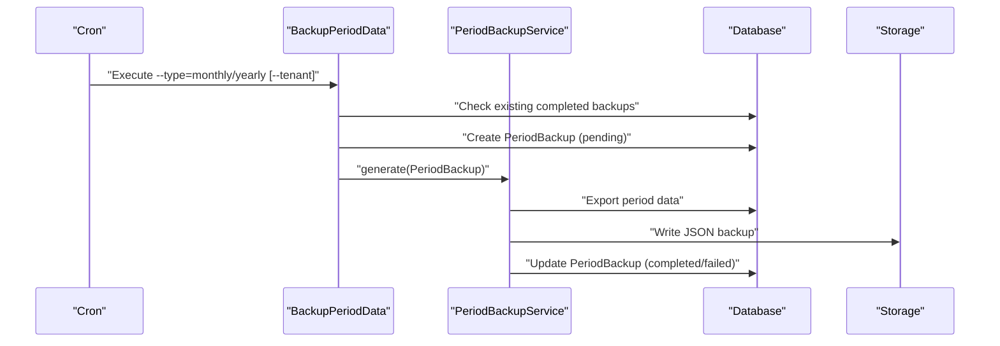
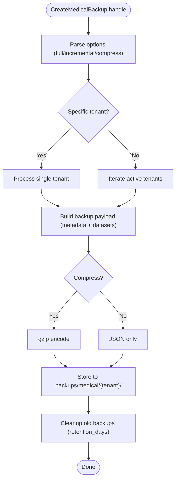
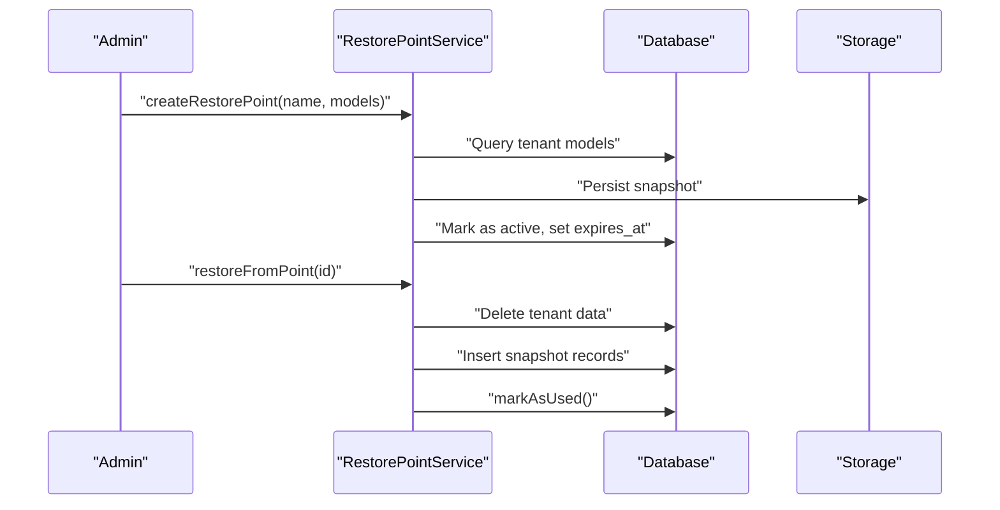
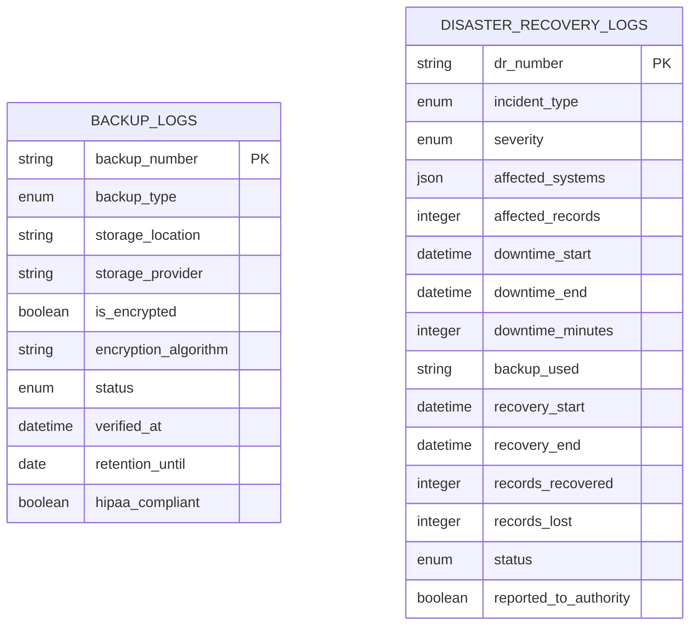
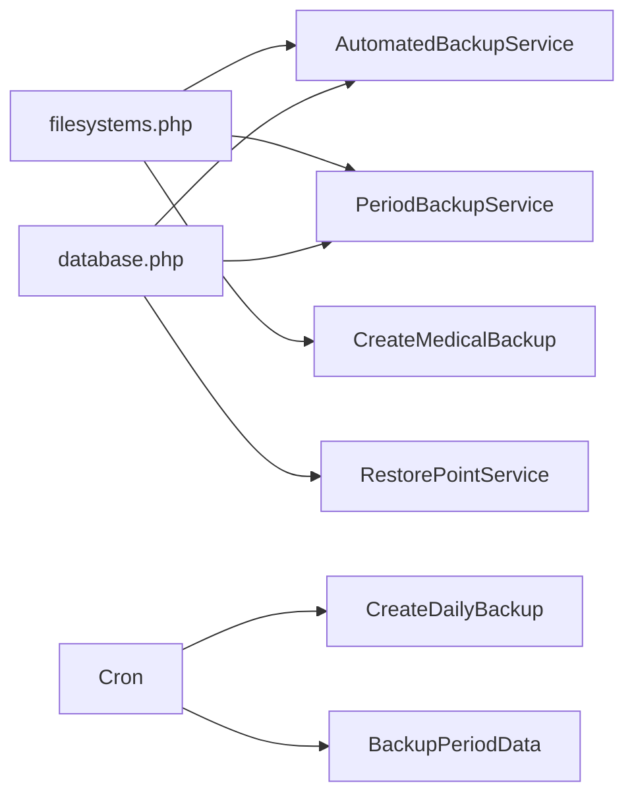

# Backup & Disaster Recovery

<cite>
**Referenced Files in This Document**
- [AutomatedBackupService.php](file://app/Services/AutomatedBackupService.php)
- [AutomatedBackup.php](file://app/Models/AutomatedBackup.php)
- [PeriodBackupService.php](file://app/Services/PeriodBackupService.php)
- [PeriodBackup.php](file://app/Models/PeriodBackup.php)
- [CreateDailyBackup.php](file://app/Console/Commands/CreateDailyBackup.php)
- [BackupPeriodData.php](file://app/Console/Commands/BackupPeriodData.php)
- [CreateMedicalBackup.php](file://app/Console/Commands/CreateMedicalBackup.php)
- [BackupController.php](file://app/Http/Controllers/Healthcare/BackupController.php)
- [BackupLog.php](file://app/Models/BackupLog.php)
- [RestorePointService.php](file://app/Services/RestorePointService.php)
- [RestorePoint.php](file://app/Models/RestorePoint.php)
- [database.php](file://config/database.php)
- [filesystems.php](file://config/filesystems.php)
- [data_retention.php](file://config/data_retention.php)
- [2026_04_08_1400001_create_regulatory_compliance_tables.php](file://database/migrations/2026_04_08_1400001_create_regulatory_compliance_tables.php)
- [2026_04_06_090000_create_error_handling_tables.php](file://database/migrations/2026_04_06_090000_create_error_handling_tables.php)
- [ErrorHandlingController.php](file://app/Http/Controllers/ErrorHandlingController.php)
</cite>

## Table of Contents
1. [Introduction](#introduction)
2. [Project Structure](#project-structure)
3. [Core Components](#core-components)
4. [Architecture Overview](#architecture-overview)
5. [Detailed Component Analysis](#detailed-component-analysis)
6. [Dependency Analysis](#dependency-analysis)
7. [Performance Considerations](#performance-considerations)
8. [Troubleshooting Guide](#troubleshooting-guide)
9. [Conclusion](#conclusion)
10. [Appendices](#appendices)

## Introduction
This document defines backup and disaster recovery (DR) practices for Qalcuity ERP. It covers automated backup strategies for databases, file storage, and application data, including full and incremental approaches, scheduling, retention, and compliance. It also documents DR procedures, failover readiness, point-in-time recovery, backup verification, and security controls. Finally, it provides step-by-step recovery procedures, RTO/RPO targets, and testing protocols.

## Project Structure
Qalcuity ERP implements backup and DR capabilities across services, console commands, controllers, models, and configuration files. The system supports:
- Tenant-aware JSON backups for application data
- Periodic transactional backups by accounting period
- Healthcare-specific compressed backups for medical records
- Restore points for pre-change protection
- Regulatory-compliance-backed backup and DR logging
- Configurable filesystems and database connections

**Diagram sources**
- [AutomatedBackupService.php:1-224](file://app/Services/AutomatedBackupService.php#L1-L224)
- [PeriodBackupService.php:1-243](file://app/Services/PeriodBackupService.php#L1-L243)
- [CreateMedicalBackup.php:1-230](file://app/Console/Commands/CreateMedicalBackup.php#L1-L230)
- [RestorePointService.php:1-169](file://app/Services/RestorePointService.php#L1-L169)
- [AutomatedBackup.php:1-71](file://app/Models/AutomatedBackup.php#L1-L71)
- [PeriodBackup.php:1-41](file://app/Models/PeriodBackup.php#L1-L41)
- [BackupLog.php:1-35](file://app/Models/BackupLog.php#L1-L35)
- [RestorePoint.php:1-64](file://app/Models/RestorePoint.php#L1-L64)
- [CreateDailyBackup.php:1-74](file://app/Console/Commands/CreateDailyBackup.php#L1-L74)
- [BackupPeriodData.php:1-79](file://app/Console/Commands/BackupPeriodData.php#L1-L79)
- [BackupController.php:1-129](file://app/Http/Controllers/Healthcare/BackupController.php#L1-L129)
- [database.php:1-185](file://config/database.php#L1-L185)
- [filesystems.php:1-81](file://config/filesystems.php#L1-L81)
- [data_retention.php:1-293](file://config/data_retention.php#L1-L293)

**Section sources**
- [AutomatedBackupService.php:1-224](file://app/Services/AutomatedBackupService.php#L1-L224)
- [PeriodBackupService.php:1-243](file://app/Services/PeriodBackupService.php#L1-L243)
- [CreateMedicalBackup.php:1-230](file://app/Console/Commands/CreateMedicalBackup.php#L1-L230)
- [RestorePointService.php:1-169](file://app/Services/RestorePointService.php#L1-L169)
- [AutomatedBackup.php:1-71](file://app/Models/AutomatedBackup.php#L1-L71)
- [PeriodBackup.php:1-41](file://app/Models/PeriodBackup.php#L1-L41)
- [BackupLog.php:1-35](file://app/Models/BackupLog.php#L1-L35)
- [RestorePoint.php:1-64](file://app/Models/RestorePoint.php#L1-L64)
- [CreateDailyBackup.php:1-74](file://app/Console/Commands/CreateDailyBackup.php#L1-L74)
- [BackupPeriodData.php:1-79](file://app/Console/Commands/BackupPeriodData.php#L1-L79)
- [BackupController.php:1-129](file://app/Http/Controllers/Healthcare/BackupController.php#L1-L129)
- [database.php:1-185](file://config/database.php#L1-L185)
- [filesystems.php:1-81](file://config/filesystems.php#L1-L81)
- [data_retention.php:1-293](file://config/data_retention.php#L1-L293)

## Core Components
- AutomatedBackupService: Creates tenant-scoped JSON backups, tracks metadata, sets expiration, and supports restore.
- PeriodBackupService: Exports transactional data for a defined period into a structured JSON file.
- CreateDailyBackup: CLI orchestration for daily/weekly/monthly backups across tenants.
- BackupPeriodData: CLI for monthly/yearly period backups.
- CreateMedicalBackup: Healthcare-focused backup with optional compression and retention cleanup.
- BackupController: Web UI for initiating database backups, restoring, downloading, and deleting backups.
- RestorePointService: Captures snapshots before major changes to enable point-in-time recovery.
- Regulatory-compliance tables: Dedicated schema for backup logs and DR incident tracking.

Key capabilities:
- Full backups: Complete dataset export for a tenant or period.
- Incremental backups: Change-based exports (e.g., last 24 hours) for medical records.
- Retention: Configurable cleanup and expiration policies.
- Verification: Backup size checks and restore validations.
- Compliance: HIPAA-compliant fields and DR incident logging.

**Section sources**
- [AutomatedBackupService.php:1-224](file://app/Services/AutomatedBackupService.php#L1-L224)
- [PeriodBackupService.php:1-243](file://app/Services/PeriodBackupService.php#L1-L243)
- [CreateDailyBackup.php:1-74](file://app/Console/Commands/CreateDailyBackup.php#L1-L74)
- [BackupPeriodData.php:1-79](file://app/Console/Commands/BackupPeriodData.php#L1-L79)
- [CreateMedicalBackup.php:1-230](file://app/Console/Commands/CreateMedicalBackup.php#L1-L230)
- [BackupController.php:1-129](file://app/Http/Controllers/Healthcare/BackupController.php#L1-L129)
- [RestorePointService.php:1-169](file://app/Services/RestorePointService.php#L1-L169)
- [2026_04_08_1400001_create_regulatory_compliance_tables.php:232-326](file://database/migrations/2026_04_08_1400001_create_regulatory_compliance_tables.php#L232-L326)

## Architecture Overview
The backup and DR architecture integrates services, commands, and models with configuration-driven storage and database connectivity.

**Diagram sources**
- [BackupController.php:42-81](file://app/Http/Controllers/Healthcare/BackupController.php#L42-L81)
- [AutomatedBackupService.php:15-92](file://app/Services/AutomatedBackupService.php#L15-L92)
- [BackupLog.php:1-35](file://app/Models/BackupLog.php#L1-L35)
- [filesystems.php:31-63](file://config/filesystems.php#L31-L63)

## Detailed Component Analysis

### Automated Backup Service
- Purpose: Create tenant-scoped JSON backups, track metadata, compute sizes, and manage expirations.
- Backup types: daily, weekly, monthly, manual, pre_change.
- Tables included: configurable set; defaults include core business entities.
- Restore: Reads JSON, clears tenant data, inserts records.
- Expiration: Based on backup type (e.g., weekly, monthly, default 30 days).

**Diagram sources**
- [AutomatedBackupService.php:15-92](file://app/Services/AutomatedBackupService.php#L15-L92)
- [AutomatedBackup.php:14-34](file://app/Models/AutomatedBackup.php#L14-L34)

**Section sources**
- [AutomatedBackupService.php:1-224](file://app/Services/AutomatedBackupService.php#L1-L224)
- [AutomatedBackup.php:1-71](file://app/Models/AutomatedBackup.php#L1-L71)

### Periodic Transactional Backups
- Purpose: Export transactional data for a defined period (monthly/yearly) into a structured JSON file.
- Scope: Sales orders, invoices, purchase orders, journal entries, transactions, stock movements, payroll runs, plus master lists.
- Storage: JSON file in storage/app/backups/{tenant_id}/ with summary metadata.

**Diagram sources**
- [BackupPeriodData.php:10-79](file://app/Console/Commands/BackupPeriodData.php#L10-L79)
- [PeriodBackupService.php:32-92](file://app/Services/PeriodBackupService.php#L32-L92)
- [PeriodBackup.php:13-25](file://app/Models/PeriodBackup.php#L13-L25)

**Section sources**
- [PeriodBackupService.php:1-243](file://app/Services/PeriodBackupService.php#L1-L243)
- [PeriodBackup.php:1-41](file://app/Models/PeriodBackup.php#L1-L41)
- [BackupPeriodData.php:1-79](file://app/Console/Commands/BackupPeriodData.php#L1-L79)

### Healthcare Medical Records Backup
- Purpose: Create healthcare-specific backups of patient, EMR, appointments, prescriptions, lab results, and billing.
- Modes: Full, Standard (default), Incremental (last 24 hours).
- Compression: Optional gzip compression.
- Retention: Cleanup based on data_retention config.

**Diagram sources**
- [CreateMedicalBackup.php:32-230](file://app/Console/Commands/CreateMedicalBackup.php#L32-L230)
- [data_retention.php:208-227](file://config/data_retention.php#L208-L227)

**Section sources**
- [CreateMedicalBackup.php:1-230](file://app/Console/Commands/CreateMedicalBackup.php#L1-L230)
- [data_retention.php:1-293](file://config/data_retention.php#L1-L293)

### Restore Points (Point-in-Time Recovery)
- Purpose: Capture tenant snapshots before major changes to enable quick rollback.
- Trigger events: Manual or automated.
- Expiration: Active restore points expire after a short window (e.g., 7 days).
- Restore: Clears tenant data and re-inserts captured records.

**Diagram sources**
- [RestorePointService.php:14-77](file://app/Services/RestorePointService.php#L14-L77)
- [RestorePoint.php:46-62](file://app/Models/RestorePoint.php#L46-L62)
- [ErrorHandlingController.php:127-159](file://app/Http/Controllers/ErrorHandlingController.php#L127-L159)

**Section sources**
- [RestorePointService.php:1-169](file://app/Services/RestorePointService.php#L1-L169)
- [RestorePoint.php:1-64](file://app/Models/RestorePoint.php#L1-L64)
- [ErrorHandlingController.php:116-159](file://app/Http/Controllers/ErrorHandlingController.php#L116-L159)

### Regulatory-Compliant Backup and DR Logging
- Backup logs: Track backup number, type, location, encryption, status, verification, retention, compliance flags.
- DR logs: Track incidents, severity, affected systems, downtime, recovery actions, and compliance reporting.

**Diagram sources**
- [2026_04_08_1400001_create_regulatory_compliance_tables.php:232-326](file://database/migrations/2026_04_08_1400001_create_regulatory_compliance_tables.php#L232-L326)

**Section sources**
- [2026_04_08_1400001_create_regulatory_compliance_tables.php:232-326](file://database/migrations/2026_04_08_1400001_create_regulatory_compliance_tables.php#L232-L326)

## Dependency Analysis
- Storage: Local filesystem and S3 disks configured; backups are written to storage paths.
- Database: Multi-tenant isolation via tenant_id; MySQL/MariaDB/PostgreSQL/SQLServer drivers supported.
- Scheduling: Console commands orchestrated via cron to run daily/weekly/monthly and periodic backups.
- Compliance: Dedicated tables and flags to support HIPAA-like retention and verification.

**Diagram sources**
- [filesystems.php:31-63](file://config/filesystems.php#L31-L63)
- [database.php:33-117](file://config/database.php#L33-L117)
- [CreateDailyBackup.php:31-72](file://app/Console/Commands/CreateDailyBackup.php#L31-L72)
- [BackupPeriodData.php:18-77](file://app/Console/Commands/BackupPeriodData.php#L18-L77)

**Section sources**
- [filesystems.php:1-81](file://config/filesystems.php#L1-L81)
- [database.php:1-185](file://config/database.php#L1-L185)
- [CreateDailyBackup.php:1-74](file://app/Console/Commands/CreateDailyBackup.php#L1-L74)
- [BackupPeriodData.php:1-79](file://app/Console/Commands/BackupPeriodData.php#L1-L79)

## Performance Considerations
- Full backups: Serialize large datasets; consider batching and compression to reduce IO.
- Incremental backups: Filter by updated_at to minimize payload size.
- Storage: Prefer S3 for durability and offsite retention; monitor throughput and costs.
- Scheduling: Align backup windows with low-traffic periods; stagger tenant processing.
- Restore: Truncate then bulk insert; ensure indexes disabled during large restores and rebuilt afterward.

## Troubleshooting Guide
Common issues and resolutions:
- Backup fails: Check service logs, validate database connectivity, confirm storage permissions.
- Restore fails: Verify backup status is completed, ensure JSON integrity, check tenant isolation.
- Excessive storage usage: Review retention policies and cleanup tasks; adjust retention_days.
- DR incident tracking: Use DR logs to correlate backups, downtime, and recovery metrics.

Operational checks:
- Verify backup files exist and sizes are reasonable.
- Confirm backup records show completed status and expiration dates.
- Validate restore points are active and not expired.
- Review DR logs for incident trends and recovery effectiveness.

**Section sources**
- [AutomatedBackupService.php:76-92](file://app/Services/AutomatedBackupService.php#L76-L92)
- [RestorePointService.php:54-77](file://app/Services/RestorePointService.php#L54-L77)
- [CreateMedicalBackup.php:206-227](file://app/Console/Commands/CreateMedicalBackup.php#L206-L227)
- [2026_04_08_1400001_create_regulatory_compliance_tables.php:266-311](file://database/migrations/2026_04_08_1400001_create_regulatory_compliance_tables.php#L266-L311)

## Conclusion
Qalcuity ERP provides robust, tenant-aware backup and DR capabilities with full and incremental options, scheduling, retention, and compliance logging. The system supports point-in-time recovery via restore points and structured period backups. By enforcing secure storage, verification, and DR incident tracking, organizations can meet RPO/RTO targets and maintain business continuity.

## Appendices

### Backup Strategies and Scheduling
- Full backups: Daily for core datasets; Monthly/Yearly for periodical archival.
- Incremental backups: Healthcare medical records incremental (last 24 hours) with compression.
- Scheduling: Cron-based automation for tenant-wide backups and period exports.

**Section sources**
- [CreateDailyBackup.php:13-31](file://app/Console/Commands/CreateDailyBackup.php#L13-L31)
- [BackupPeriodData.php:12-21](file://app/Console/Commands/BackupPeriodData.php#L12-L21)
- [CreateMedicalBackup.php:16-27](file://app/Console/Commands/CreateMedicalBackup.php#L16-L27)

### Retention Policies
- Backup retention: Configurable per backup type and global retention_days.
- Data archival: Separate retention policies for activity logs, AI logs, anomalies, and compliance holds.

**Section sources**
- [AutomatedBackupService.php:214-222](file://app/Services/AutomatedBackupService.php#L214-L222)
- [CreateMedicalBackup.php:208-227](file://app/Console/Commands/CreateMedicalBackup.php#L208-L227)
- [data_retention.php:21-239](file://config/data_retention.php#L21-L239)

### Disaster Recovery Procedures
- Detection: Monitor DR logs for incidents and severity.
- Containment: Isolate affected systems, assess impact, and activate recovery plans.
- Recovery: Identify the appropriate backup (by number), restore, and validate data integrity.
- Post-mortem: Record lessons learned and preventive measures; update DR logs.

**Section sources**
- [2026_04_08_1400001_create_regulatory_compliance_tables.php:266-311](file://database/migrations/2026_04_08_1400001_create_regulatory_compliance_tables.php#L266-L311)

### Point-in-Time Recovery (Restore Points)
- Create: Snapshot critical models before major changes.
- Activate: Restore tenant data from snapshot; mark point as used.
- Expiration: Automatic cleanup of expired points.

**Section sources**
- [RestorePointService.php:14-77](file://app/Services/RestorePointService.php#L14-L77)
- [RestorePoint.php:46-62](file://app/Models/RestorePoint.php#L46-L62)

### Backup Storage Security and Encryption
- Storage: Local and S3 disks; configure credentials and visibility appropriately.
- Encryption: HIPAA-compliant flags and encryption fields in backup logs; consider S3 server-side encryption.

**Section sources**
- [filesystems.php:31-63](file://config/filesystems.php#L31-L63)
- [2026_04_08_1400001_create_regulatory_compliance_tables.php:232-245](file://database/migrations/2026_04_08_1400001_create_regulatory_compliance_tables.php#L232-L245)

### Compliance Requirements
- Backup logs: Track encryption, retention, and compliance flags.
- DR logs: Document incidents, affected systems, downtime, and regulatory notifications.

**Section sources**
- [2026_04_08_1400001_create_regulatory_compliance_tables.php:232-326](file://database/migrations/2026_04_08_1400001_create_regulatory_compliance_tables.php#L232-L326)

### Step-by-Step Recovery Procedures
- Database backup restore (web):
  1. Navigate to backups list and select a completed backup.
  2. Confirm restore action; the system executes the restore command.
  3. Validate database connectivity and application functionality.

- Tenant JSON backup restore:
  1. Use the automated backup service to restore from a completed backup record.
  2. Confirm tables and record counts; verify tenant isolation.

- Periodic backup restore:
  1. Locate the period backup JSON file.
  2. Import data into the target tenant; validate totals and references.

- Medical records restore:
  1. Identify the latest compressed or uncompressed backup.
  2. Decompress if needed and restore into the tenant’s dataset.

- Restore point rollback:
  1. Select an active, non-expired restore point.
  2. Execute restore; mark point as used.

**Section sources**
- [BackupController.php:88-107](file://app/Http/Controllers/Healthcare/BackupController.php#L88-L107)
- [AutomatedBackupService.php:97-157](file://app/Services/AutomatedBackupService.php#L97-L157)
- [PeriodBackupService.php:32-92](file://app/Services/PeriodBackupService.php#L32-L92)
- [CreateMedicalBackup.php:75-117](file://app/Console/Commands/CreateMedicalBackup.php#L75-L117)
- [RestorePointService.php:54-121](file://app/Services/RestorePointService.php#L54-L121)

### RTO/RPO Targets and Testing Protocols
- RPO: Target near-real-time incremental backups for critical datasets; full backups as safety nets.
- RTO: Optimize restore scripts and storage; test monthly restore drills with realistic data volumes.
- Testing: Validate backup integrity (file size, checksums), restoration speed, and application validation post-restore.

[No sources needed since this section provides general guidance]