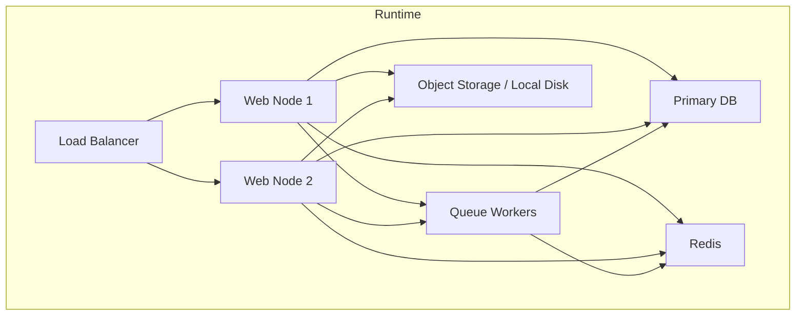
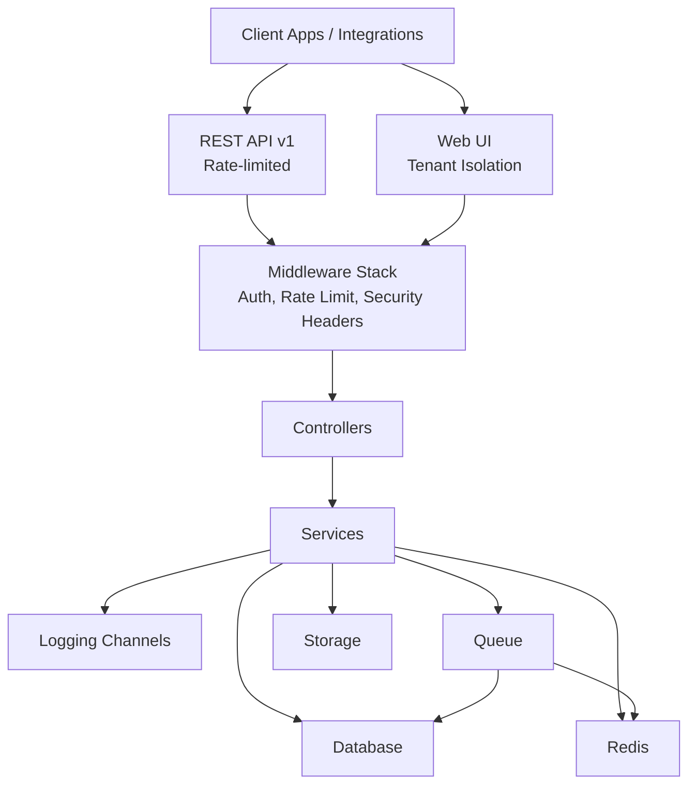
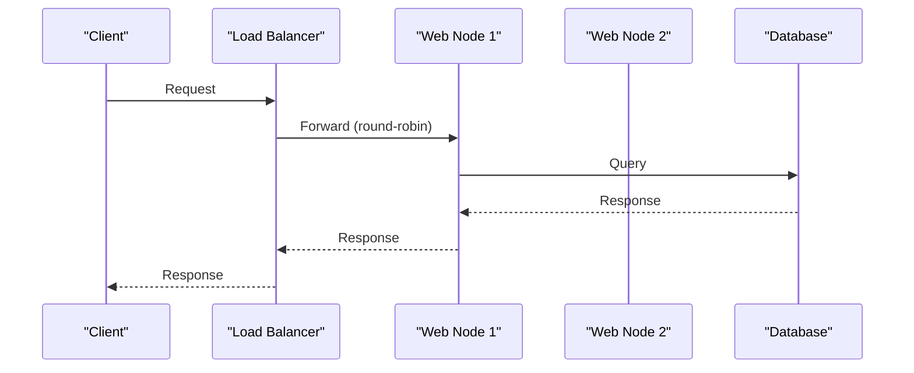
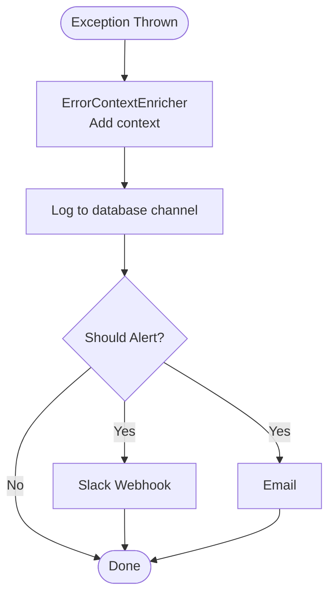
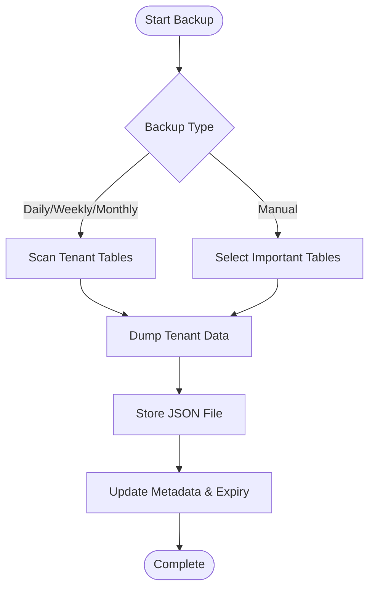
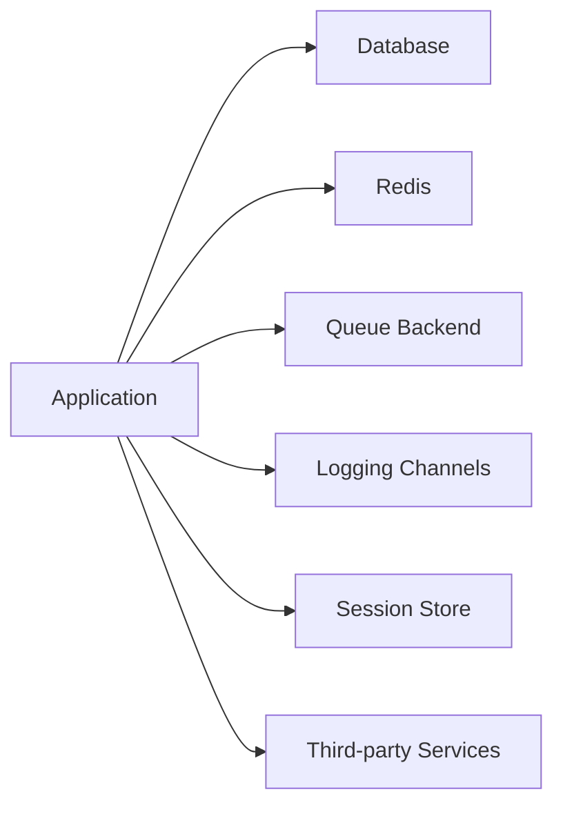

# Deployment & Operations

<cite>
**Referenced Files in This Document**
- [composer.json](file://composer.json)
- [bootstrap/app.php](file://bootstrap/app.php)
- [config/app.php](file://config/app.php)
- [config/database.php](file://config/database.php)
- [config/queue.php](file://config/queue.php)
- [config/logging.php](file://config/logging.php)
- [config/services.php](file://config/services.php)
- [config/cache.php](file://config/cache.php)
- [config/session.php](file://config/session.php)
- [routes/api.php](file://routes/api.php)
- [routes/web.php](file://routes/web.php)
- [routes/console.php](file://routes/console.php)
- [app/Services/AutomatedBackupService.php](file://app/Services/AutomatedBackupService.php)
- [app/Console/Commands/CreateDailyBackup.php](file://app/Console/Commands/CreateDailyBackup.php)
- [app/Console/Commands/CreateMedicalBackup.php](file://app/Console/Commands/CreateMedicalBackup.php)
- [app/Services/ErrorAlertingService.php](file://app/Services/ErrorAlertingService.php)
</cite>

## Table of Contents
1. [Introduction](#introduction)
2. [Project Structure](#project-structure)
3. [Core Components](#core-components)
4. [Architecture Overview](#architecture-overview)
5. [Detailed Component Analysis](#detailed-component-analysis)
6. [Dependency Analysis](#dependency-analysis)
7. [Performance Considerations](#performance-considerations)
8. [Troubleshooting Guide](#troubleshooting-guide)
9. [Conclusion](#conclusion)
10. [Appendices](#appendices)

## Introduction
This document provides comprehensive deployment and operations guidance for Qalcuity ERP. It covers production deployment strategies, containerization options, load balancing and scaling, monitoring and logging, alerting, performance optimization, backup and disaster recovery, maintenance schedules, CI/CD and automated testing, operational metrics, capacity planning, and troubleshooting procedures. The guidance is grounded in the repository’s configuration, routing, scheduling, and operational services.

## Project Structure
Qalcuity ERP is a Laravel application with a modular monolith architecture. Key areas for operations include:
- Routing: Public API endpoints, tenant-protected routes, and health checks
- Scheduling: Cron-driven tasks for backups, notifications, integrations, and maintenance
- Configuration: Database, queue, logging, caching, sessions, and third-party services
- Operational services: Automated backup, error alerting, and tenant isolation

[No sources needed since this diagram shows conceptual workflow, not actual code structure]

## Core Components
- Application runtime and middleware stack configured in the bootstrap file
- API surface defined under routes with rate-limiting and tenant isolation middleware
- Scheduling orchestration for recurring tasks and maintenance
- Logging channels for application, database, healthcare audit, and alerting
- Queue configuration supporting multiple backends
- Database connectivity and Redis configuration
- Session and cache configuration
- Third-party service integrations (payment gateways, Slack, etc.)

**Section sources**
- [bootstrap/app.php:1-89](file://bootstrap/app.php#L1-L89)
- [routes/api.php:1-165](file://routes/api.php#L1-L165)
- [routes/web.php:1-800](file://routes/web.php#L1-L800)
- [routes/console.php:1-489](file://routes/console.php#L1-L489)
- [config/logging.php:1-216](file://config/logging.php#L1-L216)
- [config/queue.php:1-130](file://config/queue.php#L1-L130)
- [config/database.php:1-185](file://config/database.php#L1-L185)
- [config/cache.php:1-131](file://config/cache.php#L1-L131)
- [config/session.php:1-234](file://config/session.php#L1-L234)
- [config/services.php:1-70](file://config/services.php#L1-L70)

## Architecture Overview
The system relies on:
- Stateless web tier behind a load balancer
- Shared database with tenant isolation enforced at the application layer
- Redis for caching and queues
- Queues for asynchronous tasks and integrations
- Scheduled tasks managed by cron and Laravel scheduler
- Health endpoints for readiness and liveness checks

**Diagram sources**
- [routes/api.php:28-165](file://routes/api.php#L28-L165)
- [routes/web.php:104-800](file://routes/web.php#L104-L800)
- [bootstrap/app.php:18-55](file://bootstrap/app.php#L18-L55)
- [config/database.php:33-185](file://config/database.php#L33-L185)
- [config/queue.php:32-129](file://config/queue.php#L32-L129)
- [config/logging.php:53-216](file://config/logging.php#L53-L216)

## Detailed Component Analysis

### Load Balancing and Scaling
- Horizontal scaling: Stateless web nodes behind a load balancer
- Sticky sessions: Not required; session driver is database-backed
- Health checks: Public endpoints for health, readiness, and live probes
- Rate limiting: Applied at the API layer via middleware

**Diagram sources**
- [routes/api.php:159-165](file://routes/api.php#L159-L165)
- [config/session.php:21-90](file://config/session.php#L21-L90)

**Section sources**
- [routes/api.php:159-165](file://routes/api.php#L159-L165)
- [config/session.php:21-90](file://config/session.php#L21-L90)

### Containerization Options
- Build artifacts: Composer dependencies and Node assets built during setup
- Runtime: PHP-FPM + Nginx or Apache; queue workers and scheduler run as separate processes
- Persistence: Database and local storage; external object storage recommended for logs/backups
- Environment: PHP 8.3+, MySQL/MariaDB/PostgreSQL/SQL Server supported

**Section sources**
- [composer.json:11-34](file://composer.json#L11-L34)
- [composer.json:47-82](file://composer.json#L47-L82)
- [config/database.php:33-116](file://config/database.php#L33-L116)

### Monitoring and Logging
- Default stack channel with layered channels
- Healthcare-specific channels for audit, security, and compliance
- Database channel for error tracking
- Alert channel for critical errors via Slack webhook
- Error enrichment and alert thresholds implemented in service

**Diagram sources**
- [bootstrap/app.php:56-88](file://bootstrap/app.php#L56-L88)
- [config/logging.php:130-216](file://config/logging.php#L130-L216)
- [app/Services/ErrorAlertingService.php:42-94](file://app/Services/ErrorAlertingService.php#L42-L94)

**Section sources**
- [bootstrap/app.php:56-88](file://bootstrap/app.php#L56-L88)
- [config/logging.php:53-216](file://config/logging.php#L53-L216)
- [app/Services/ErrorAlertingService.php:17-302](file://app/Services/ErrorAlertingService.php#L17-L302)

### Alerting Mechanisms
- Configurable alert channels per severity level
- Threshold-based alerting to avoid noise
- Slack and email delivery with structured payloads
- Test alert capability

**Section sources**
- [app/Services/ErrorAlertingService.php:22-94](file://app/Services/ErrorAlertingService.php#L22-L94)
- [config/services.php:31-61](file://config/services.php#L31-L61)

### Backup and Disaster Recovery
- Automated tenant backups with JSON exports and retention policies
- Daily/Weekly/Monthly backup scheduling
- Healthcare module specialized backup for medical records with compression and incremental modes
- Backup cleanup and expiry management
- Restore process per tenant

**Diagram sources**
- [app/Services/AutomatedBackupService.php:15-92](file://app/Services/AutomatedBackupService.php#L15-L92)
- [app/Console/Commands/CreateDailyBackup.php:31-72](file://app/Console/Commands/CreateDailyBackup.php#L31-L72)
- [app/Console/Commands/CreateMedicalBackup.php:32-117](file://app/Console/Commands/CreateMedicalBackup.php#L32-L117)

**Section sources**
- [app/Services/AutomatedBackupService.php:10-224](file://app/Services/AutomatedBackupService.php#L10-L224)
- [app/Console/Commands/CreateDailyBackup.php:8-74](file://app/Console/Commands/CreateDailyBackup.php#L8-L74)
- [app/Console/Commands/CreateMedicalBackup.php:9-230](file://app/Console/Commands/CreateMedicalBackup.php#L9-L230)
- [routes/console.php:240-253](file://routes/console.php#L240-L253)

### Maintenance Schedules
- Daily/weekly/monthly tasks for insights, reports, depreciation, currency rates, loyalty points, anomaly detection, audit purges, and backups
- Hourly/daily intervals for marketplace syncs, router polling, and webhook retries
- Cleanup jobs for failed jobs, old sessions, and old webhook deliveries

**Section sources**
- [routes/console.php:34-489](file://routes/console.php#L34-L489)

### CI/CD Pipeline Setup
- Composer-based installation and asset build
- Development stack includes concurrent server, queue listener, and log tailing
- Testing via PHPUnit

Recommended steps:
- Install dependencies and build assets in CI
- Run tests and static analysis
- Tag and promote images to registry
- Deploy to web nodes and run migrations
- Start queue workers and scheduler

**Section sources**
- [composer.json:47-82](file://composer.json#L47-L82)

### Operational Metrics and Capacity Planning
- Track API throughput, latency, and error rates via logs and health endpoints
- Monitor queue backlog and worker utilization
- Capacity planning guided by:
  - Database I/O and connection limits
  - Redis memory and persistence settings
  - Storage growth for logs and backups
  - CPU/memory per worker node

[No sources needed since this section provides general guidance]

### Performance Optimization
- Use Redis for caching and session store
- Tune queue retry and block settings
- Enable database query logging and slow query thresholds
- Optimize database indexes and connection pooling
- Use CDN for static assets and offload logs to external storage

**Section sources**
- [config/cache.php:35-131](file://config/cache.php#L35-L131)
- [config/queue.php:32-129](file://config/queue.php#L32-L129)
- [config/database.php:146-185](file://config/database.php#L146-L185)

## Dependency Analysis
Key operational dependencies:
- Database: SQLite, MySQL/MariaDB, PostgreSQL, SQL Server
- Redis: Caching and queue transport
- Queue backends: Database, Redis, SQS, Beanstalkd
- Logging: File, daily rotation, Slack, stderr
- Sessions: Database-backed
- Third-party services: Payment gateways, Slack, email/SMS providers

**Diagram sources**
- [config/database.php:33-185](file://config/database.php#L33-L185)
- [config/queue.php:32-129](file://config/queue.php#L32-L129)
- [config/logging.php:53-216](file://config/logging.php#L53-L216)
- [config/session.php:21-90](file://config/session.php#L21-L90)
- [config/services.php:17-69](file://config/services.php#L17-L69)

**Section sources**
- [config/database.php:33-185](file://config/database.php#L33-L185)
- [config/queue.php:32-129](file://config/queue.php#L32-L129)
- [config/logging.php:53-216](file://config/logging.php#L53-L216)
- [config/session.php:21-90](file://config/session.php#L21-L90)
- [config/services.php:17-69](file://config/services.php#L17-L69)

## Performance Considerations
- Use Redis for high-throughput caching and pub/sub
- Configure queue retry-after and block-for settings to balance latency and throughput
- Implement database connection pooling and tune busy timeouts
- Offload logs and backups to external storage
- Scale horizontally by adding web nodes and queue workers

[No sources needed since this section provides general guidance]

## Troubleshooting Guide
Common operational issues and remedies:
- Authentication failures: Verify API token middleware and rate limits
- Tenant isolation errors: Confirm tenant context middleware applied to routes
- Queue failures: Inspect failed jobs table and adjust retry settings
- Logging not captured: Validate channel configuration and permissions
- Backup failures: Review backup logs and storage permissions

**Section sources**
- [bootstrap/app.php:18-55](file://bootstrap/app.php#L18-L55)
- [routes/api.php:31-50](file://routes/api.php#L31-L50)
- [config/queue.php:123-129](file://config/queue.php#L123-L129)
- [config/logging.php:53-216](file://config/logging.php#L53-L216)
- [app/Services/AutomatedBackupService.php:76-92](file://app/Services/AutomatedBackupService.php#L76-L92)

## Conclusion
Qalcuity ERP’s operations model emphasizes tenant isolation, robust logging and alerting, scheduled maintenance, and flexible backup strategies. By leveraging the provided configuration and services, teams can deploy reliably, scale efficiently, and maintain high availability with clear observability and recovery procedures.

## Appendices

### API Rate Limits and Middleware
- API read endpoints: throttled by dedicated middleware
- API write endpoints: throttled by dedicated middleware
- Webhook inbound endpoints: throttled by dedicated middleware
- Additional middleware: role-based access, permission checks, CSRF, security headers, tenant isolation

**Section sources**
- [routes/api.php:31-61](file://routes/api.php#L31-L61)
- [bootstrap/app.php:18-55](file://bootstrap/app.php#L18-L55)

### Health and Readiness
- Health endpoints: health, detailed, ready, live
- Use ready/live for load balancer health checks

**Section sources**
- [routes/api.php:159-165](file://routes/api.php#L159-L165)