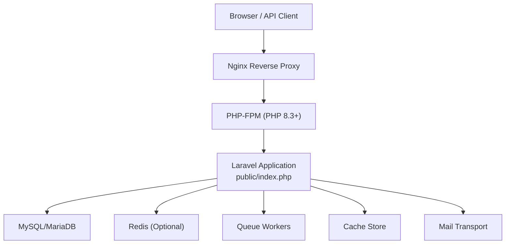
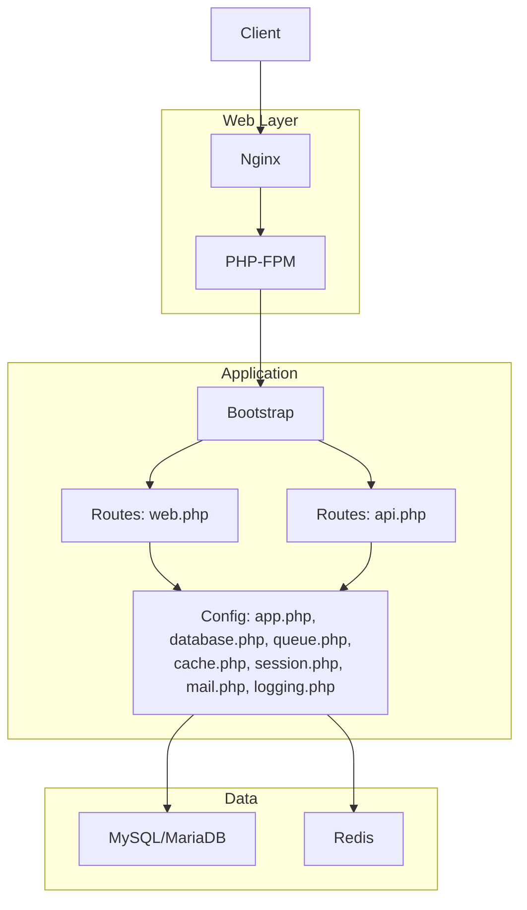
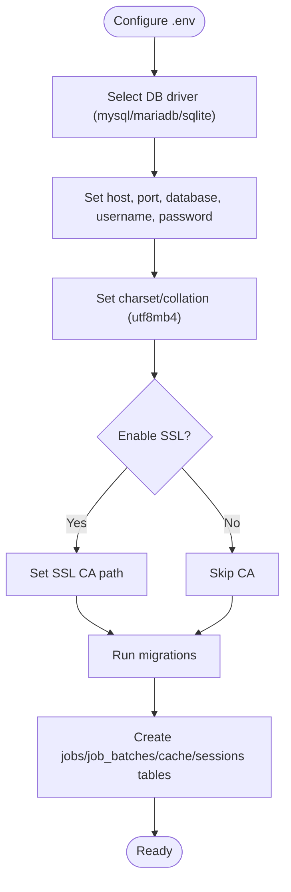
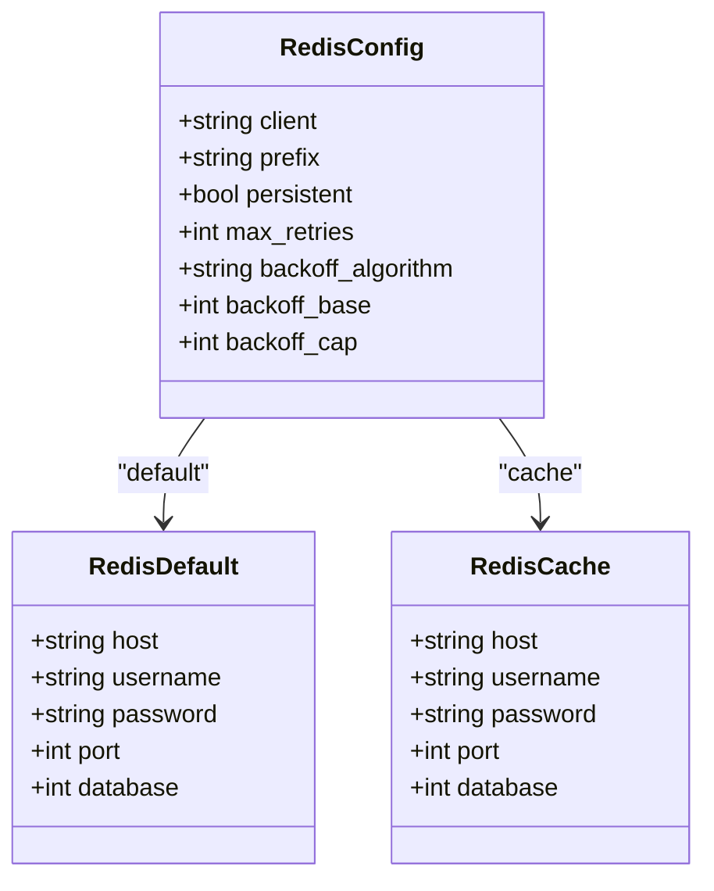
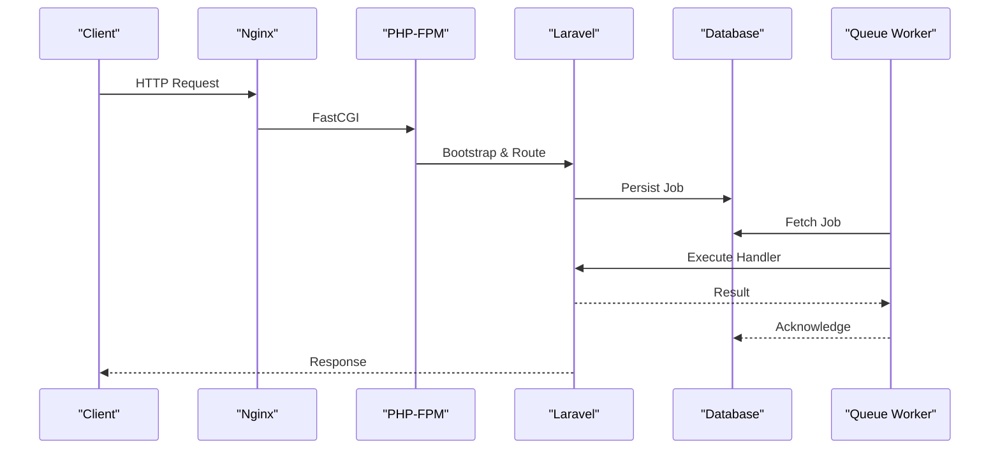
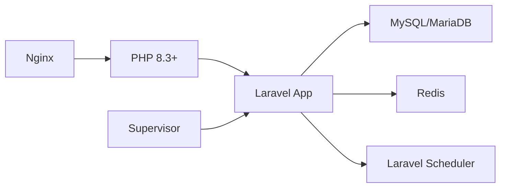

# Infrastructure Setup

<cite>
**Referenced Files in This Document**
- [composer.json](file://composer.json)
- [README.md](file://README.md)
- [config/app.php](file://config/app.php)
- [config/database.php](file://config/database.php)
- [config/queue.php](file://config/queue.php)
- [config/cache.php](file://config/cache.php)
- [config/session.php](file://config/session.php)
- [config/mail.php](file://config/mail.php)
- [config/logging.php](file://config/logging.php)
- [routes/web.php](file://routes/web.php)
- [routes/api.php](file://routes/api.php)
- [public/index.php](file://public/index.php)
</cite>

## Table of Contents
1. [Introduction](#introduction)
2. [Project Structure](#project-structure)
3. [Core Components](#core-components)
4. [Architecture Overview](#architecture-overview)
5. [Detailed Component Analysis](#detailed-component-analysis)
6. [Dependency Analysis](#dependency-analysis)
7. [Performance Considerations](#performance-considerations)
8. [Troubleshooting Guide](#troubleshooting-guide)
9. [Conclusion](#conclusion)
10. [Appendices](#appendices)

## Introduction
This document provides comprehensive infrastructure setup guidance for deploying Qalcuity ERP across shared hosting, VPS, and enterprise environments. It covers server requirements, PHP and database compatibility, Redis configuration, queue worker setup, reverse proxy and SSL, and operational best practices. Deployment-specific steps for aaPanel-managed VPS are included, along with guidance for containerized and cloud-native deployments.

## Project Structure
Qalcuity ERP is a Laravel 13 application. The web server serves the public directory, which bootstraps the framework and routes requests to controllers. Configuration is centralized under config/*. Environment variables are managed via .env and injected through Laravel’s configuration system.

**Diagram sources**
- [public/index.php:1-21](file://public/index.php#L1-L21)
- [config/app.php:1-127](file://config/app.php#L1-L127)
- [config/database.php:1-185](file://config/database.php#L1-L185)
- [config/queue.php:1-130](file://config/queue.php#L1-L130)
- [config/cache.php:1-131](file://config/cache.php#L1-L131)
- [config/mail.php:1-119](file://config/mail.php#L1-L119)

**Section sources**
- [public/index.php:1-21](file://public/index.php#L1-L21)
- [routes/web.php:1-800](file://routes/web.php#L1-L800)
- [routes/api.php:1-165](file://routes/api.php#L1-L165)

## Core Components
- PHP runtime: Version 8.3+ is required by the project.
- Database: MySQL 8.0 recommended; MariaDB supported; SQLite available for development.
- Queue: Database-backed queues by default; Redis supported.
- Cache: Database-backed cache by default; Redis supported.
- Sessions: Database-backed sessions by default; Redis supported.
- Logging: Multiple channels including daily rotation and healthcare-specific channels.
- Mail: SMTP and multiple transport drivers supported.
- Reverse proxy: Nginx recommended; configuration provided for aaPanel-managed VPS.

**Section sources**
- [composer.json:11-25](file://composer.json#L11-L25)
- [config/database.php:20-185](file://config/database.php#L20-L185)
- [config/queue.php:16-130](file://config/queue.php#L16-L130)
- [config/cache.php:18-131](file://config/cache.php#L18-L131)
- [config/session.php:21-234](file://config/session.php#L21-L234)
- [config/logging.php:21-216](file://config/logging.php#L21-L216)
- [config/mail.php:17-119](file://config/mail.php#L17-L119)

## Architecture Overview
Qalcuity ERP follows a standard Laravel architecture:
- Entry point: public/index.php initializes the framework and handles requests.
- Routing: web.php and api.php define HTTP routes and middleware stacks.
- Persistence: Database configuration supports MySQL/MariaDB with optional SSL CA and strict mode.
- Asynchrony: Queue workers process background jobs; scheduler runs scheduled tasks.
- Observability: Logging channels include healthcare audit and security channels.

**Diagram sources**
- [public/index.php:1-21](file://public/index.php#L1-L21)
- [routes/web.php:1-800](file://routes/web.php#L1-L800)
- [routes/api.php:1-165](file://routes/api.php#L1-L165)
- [config/app.php:1-127](file://config/app.php#L1-L127)
- [config/database.php:1-185](file://config/database.php#L1-L185)
- [config/queue.php:1-130](file://config/queue.php#L1-L130)
- [config/cache.php:1-131](file://config/cache.php#L1-L131)
- [config/session.php:1-234](file://config/session.php#L1-L234)
- [config/mail.php:1-119](file://config/mail.php#L1-L119)
- [config/logging.php:1-216](file://config/logging.php#L1-L216)

## Detailed Component Analysis

### PHP and Runtime Requirements
- PHP version requirement: ^8.3.
- Recommended stack: PHP 8.3+ with required extensions for image processing, compression, cryptography, and XML/JSON parsing.
- Production runtime: PHP-FPM behind Nginx.

**Section sources**
- [composer.json:11-25](file://composer.json#L11-L25)
- [README.md:94-129](file://README.md#L94-L129)

### Database Setup (MySQL/MariaDB)
- Default connection: sqlite for development; mysql/mariadb for production.
- SSL/TLS: Optional CA path supported for secure connections.
- Strict mode enabled; UTF8MB4 charset recommended.
- Additional tables: jobs, job_batches, cache, sessions are created via artisan commands.

**Diagram sources**
- [config/database.php:47-85](file://config/database.php#L47-L85)
- [README.md:131-139](file://README.md#L131-L139)

**Section sources**
- [config/database.php:20-185](file://config/database.php#L20-L185)
- [README.md:131-139](file://README.md#L131-L139)

### Redis Configuration
- Clients: phpredis recommended; cluster support configurable.
- Options: prefix, persistent connections, retry/backoff policies.
- Databases: default and cache databases separated for isolation.
- Usage: queue driver and cache store can target Redis.

**Diagram sources**
- [config/database.php:146-182](file://config/database.php#L146-L182)

**Section sources**
- [config/database.php:146-182](file://config/database.php#L146-L182)

### Queue Workers
- Default queue driver: database; Redis supported.
- Worker lifecycle: supervised via Supervisor on aaPanel-managed VPS.
- Recommended concurrency: multiple processes; timeouts and retry policies configured.
- Scheduled tasks: Laravel scheduler runs periodic jobs.

**Diagram sources**
- [config/queue.php:16-130](file://config/queue.php#L16-L130)
- [README.md:344-400](file://README.md#L344-L400)

**Section sources**
- [config/queue.php:16-130](file://config/queue.php#L16-L130)
- [README.md:402-432](file://README.md#L402-L432)

### Cache and Sessions
- Cache: database by default; redis supported; prefix applied.
- Sessions: database by default; redis supported; cookie policy configurable.
- Locking: cache and session stores support lock connections.

**Section sources**
- [config/cache.php:18-131](file://config/cache.php#L18-L131)
- [config/session.php:21-234](file://config/session.php#L21-L234)

### Logging and Observability
- Default channel: stack; daily rotation recommended.
- Healthcare-specific channels: audit, security, compliance with extended retention and access controls.
- Database channel for error tracking; alert channel for critical events.

**Section sources**
- [config/logging.php:21-216](file://config/logging.php#L21-L216)

### Mail Configuration
- Default mailer: smtp; SES, Postmark, Resend, Sendmail, Log supported.
- Global sender identity configurable; EHLO domain derived from APP_URL.

**Section sources**
- [config/mail.php:17-119](file://config/mail.php#L17-L119)

### Reverse Proxy and Load Balancing
- Nginx configuration provided for aaPanel-managed VPS with PHP-FPM socket, gzip, asset caching, and security hardening.
- Force HTTPS recommended after SSL provisioning.

**Section sources**
- [README.md:293-342](file://README.md#L293-L342)
- [README.md:496-505](file://README.md#L496-L505)

### SSL Certificate Setup
- Provision via aaPanel Let’s Encrypt; enable force HTTPS.
- Ensure APP_URL uses https scheme.

**Section sources**
- [README.md:496-505](file://README.md#L496-L505)

### Containerization and Cloud Platforms
- Docker: Use PHP 8.3+ with required extensions; mount storage and cache directories; expose port 80; set APP_KEY and database credentials via environment.
- Kubernetes: Deploy PHP-FPM and Nginx as separate pods; use ConfigMaps for environment; PersistentVolumes for storage; Services for internal routing.
- Cloud platforms (AWS, Azure, GCP): Provision EC2/ECS/GCE with PHP runtime, RDS-compatible MySQL/MariaDB, ElastiCache/Cloud Memorystore Redis, and managed SSL certificates.

[No sources needed since this section provides general guidance]

### Step-by-Step Deployment Guides

#### Shared Hosting
- Verify PHP 8.3+ and required extensions.
- Upload application to public_html or subdirectory.
- Configure .env with database credentials and APP_URL.
- Run migrations and create jobs/cache/session tables.
- Point domain to public directory and enable HTTPS.

**Section sources**
- [composer.json:11-25](file://composer.json#L11-L25)
- [README.md:142-163](file://README.md#L142-L163)
- [README.md:180-231](file://README.md#L180-L231)
- [README.md:258-275](file://README.md#L258-L275)

#### VPS (aaPanel-managed)
- Install Nginx, MySQL 8.0, PHP 8.3, phpMyAdmin.
- Create website with root pointing to public/.
- Configure .env for production, APP_KEY, database, mailer, and Gemini API key.
- Install dependencies, build assets, run migrations, and create required tables.
- Set permissions and storage link.
- Configure Nginx as provided; enable SSL with Let’s Encrypt and force HTTPS.
- Set up Supervisor workers and Laravel scheduler via aaPanel Cron.
- Cache configuration, routes, views, and events.

**Section sources**
- [README.md:79-139](file://README.md#L79-L139)
- [README.md:166-177](file://README.md#L166-L177)
- [README.md:180-231](file://README.md#L180-L231)
- [README.md:234-275](file://README.md#L234-L275)
- [README.md:278-291](file://README.md#L278-L291)
- [README.md:293-342](file://README.md#L293-L342)
- [README.md:344-400](file://README.md#L344-L400)
- [README.md:402-432](file://README.md#L402-L432)
- [README.md:434-494](file://README.md#L434-L494)
- [README.md:496-505](file://README.md#L496-L505)

#### Enterprise Infrastructure
- Provision scalable MySQL/MariaDB and Redis clusters.
- Deploy PHP-FPM and Nginx behind a load balancer.
- Use Kubernetes or platform services for autoscaling and rolling updates.
- Enforce TLS termination at load balancer; internal traffic between Nginx and PHP-FPM over Unix sockets.
- Configure health checks and readiness probes.

**Section sources**
- [config/database.php:146-182](file://config/database.php#L146-L182)
- [README.md:293-342](file://README.md#L293-L342)

## Dependency Analysis
Key infrastructure dependencies and their relationships:
- PHP 8.3+ runtime with required extensions.
- Database connectivity (MySQL/MariaDB) with optional SSL CA.
- Optional Redis for queues and cache.
- Nginx for reverse proxy and static asset serving.
- Supervisor for queue worker supervision.
- Laravel scheduler for recurring tasks.

**Diagram sources**
- [composer.json:11-25](file://composer.json#L11-L25)
- [config/database.php:146-182](file://config/database.php#L146-L182)
- [config/queue.php:16-130](file://config/queue.php#L16-L130)
- [README.md:293-342](file://README.md#L293-L342)
- [README.md:344-400](file://README.md#L344-L400)

**Section sources**
- [composer.json:11-25](file://composer.json#L11-L25)
- [config/database.php:20-185](file://config/database.php#L20-L185)
- [config/queue.php:16-130](file://config/queue.php#L16-L130)
- [README.md:293-342](file://README.md#L293-L342)

## Performance Considerations
- Enable opcode caching and optimize autoloader in production.
- Use database and Redis for cache and sessions to reduce I/O.
- Tune PHP-FPM process manager and pool sizes based on workload.
- Enable gzip and long-lived caching for static assets.
- Monitor queue backlog and scale workers horizontally.

[No sources needed since this section provides general guidance]

## Troubleshooting Guide
Common issues and remedies:
- 500 errors: check Laravel logs, regenerate APP_KEY, clear caches.
- Queue not processing: verify Supervisor status, inspect worker logs, check failed jobs.
- Permission denied: fix ownership and permissions for storage and bootstrap/cache.
- Composer memory limits: increase memory limit during install.
- Nginx 404 on routes: ensure try_files directive and public root are correct.
- Scheduler not running: confirm cron task is added and executes every minute.

**Section sources**
- [README.md:508-560](file://README.md#L508-L560)

## Conclusion
Qalcuity ERP requires PHP 8.3+, a modern relational database (MySQL/MariaDB), and optional Redis for queues and cache. The provided aaPanel guide covers a robust VPS deployment with Nginx, Supervisor, and Laravel scheduler. For containerized or cloud-native deployments, mirror the environment variables and service dependencies outlined in this document. Ensure HTTPS is enforced and logs are rotated for compliance and observability.

## Appendices

### Environment Variables Reference
- Application: APP_ENV, APP_KEY, APP_DEBUG, APP_URL, APP_TIMEZONE, APP_LOCALE, LOG_CHANNEL.
- Database: DB_CONNECTION, DB_HOST, DB_PORT, DB_DATABASE, DB_USERNAME, DB_PASSWORD, DB_CHARSET, DB_COLLATION, MYSQL_ATTR_SSL_CA.
- Cache: CACHE_STORE, DB_CACHE_CONNECTION, DB_CACHE_TABLE, DB_CACHE_LOCK_CONNECTION, DB_CACHE_LOCK_TABLE, REDIS_CACHE_CONNECTION, REDIS_CACHE_LOCK_CONNECTION.
- Sessions: SESSION_DRIVER, SESSION_CONNECTION, SESSION_TABLE, SESSION_LIFETIME, SESSION_SECURE_COOKIE, SESSION_SAME_SITE.
- Queue: QUEUE_CONNECTION, DB_QUEUE_CONNECTION, DB_QUEUE_TABLE, DB_QUEUE, REDIS_QUEUE_CONNECTION, REDIS_QUEUE, QUEUE_FAILED_DRIVER.
- Mail: MAIL_MAILER, MAIL_HOST, MAIL_PORT, MAIL_USERNAME, MAIL_PASSWORD, MAIL_FROM_ADDRESS, MAIL_FROM_NAME.
- Gemini AI: GEMINI_API_KEY, GEMINI_MODEL.

**Section sources**
- [config/app.php:16-127](file://config/app.php#L16-L127)
- [config/database.php:20-185](file://config/database.php#L20-L185)
- [config/cache.php:18-131](file://config/cache.php#L18-L131)
- [config/session.php:21-234](file://config/session.php#L21-L234)
- [config/queue.php:16-130](file://config/queue.php#L16-L130)
- [config/mail.php:17-119](file://config/mail.php#L17-L119)
- [README.md:180-231](file://README.md#L180-L231)