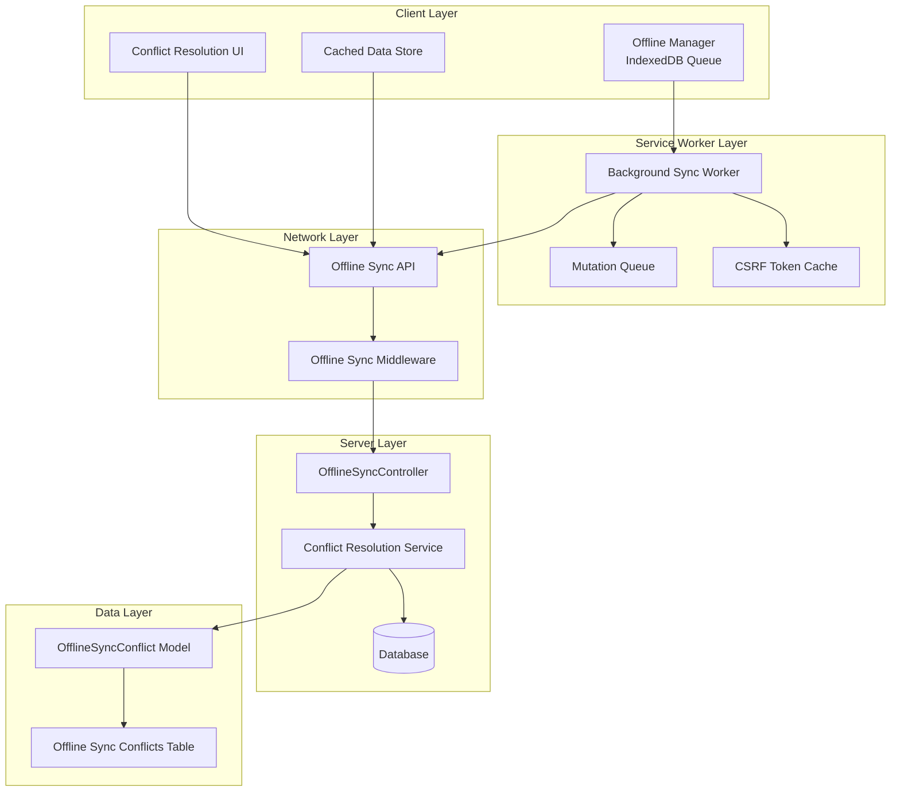
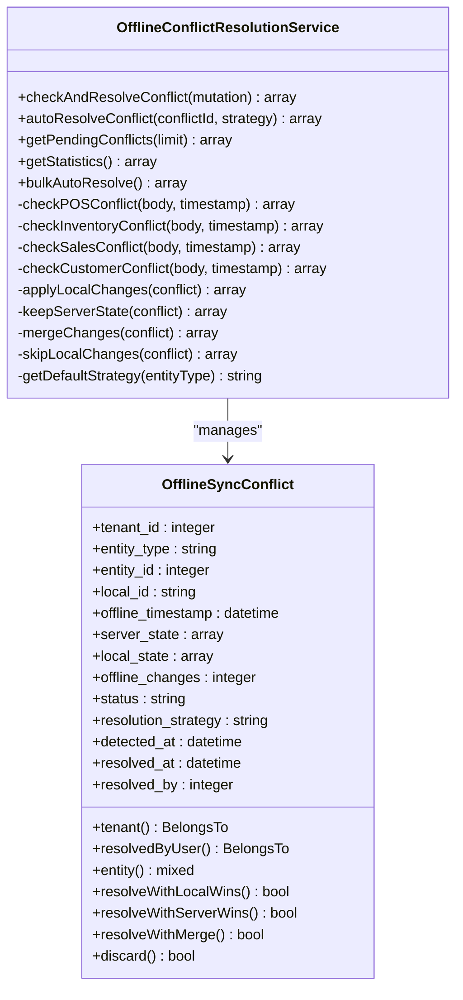
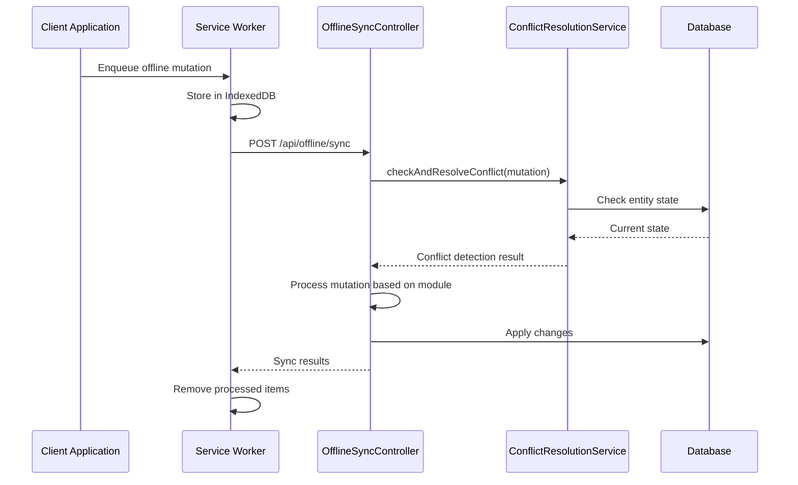
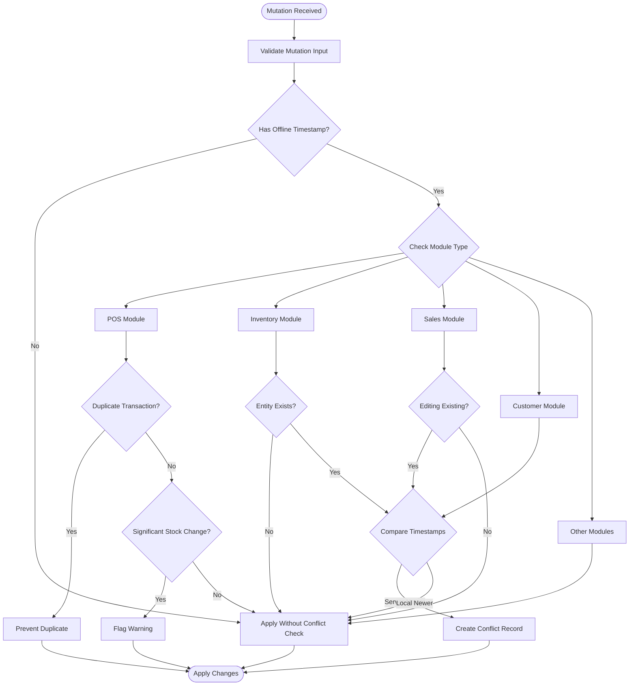
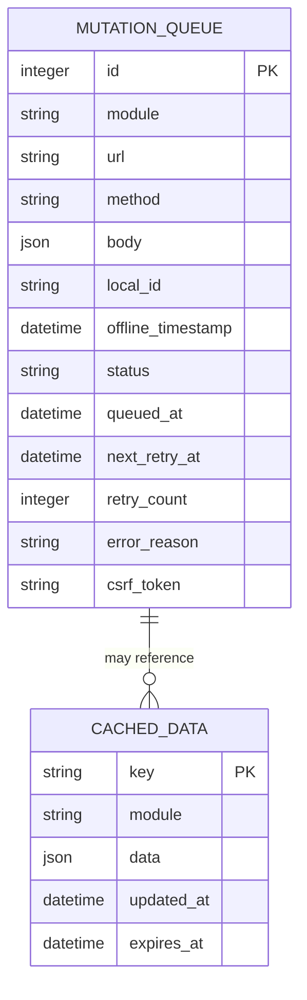
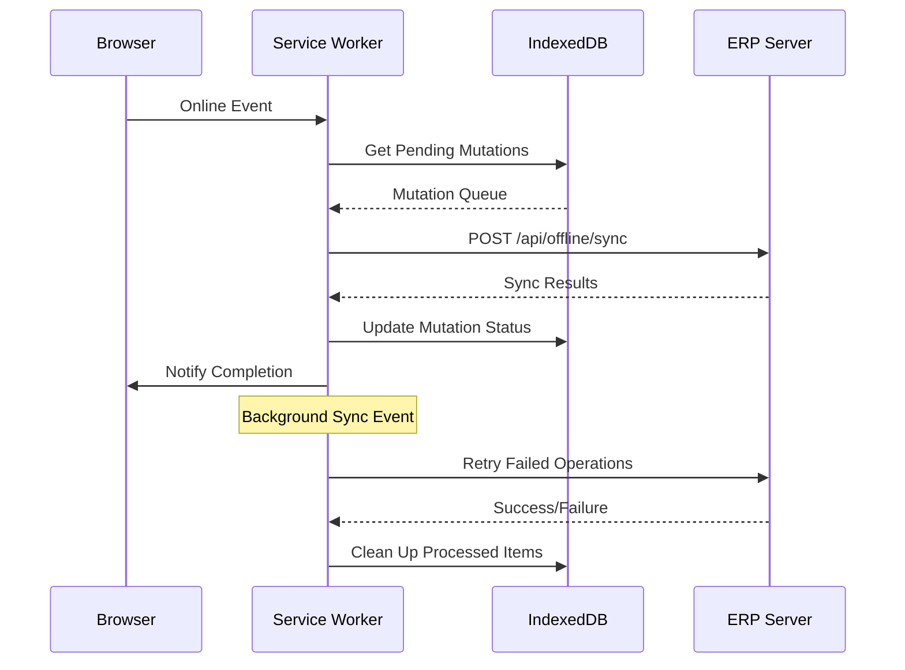
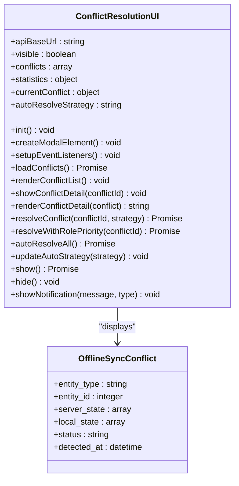
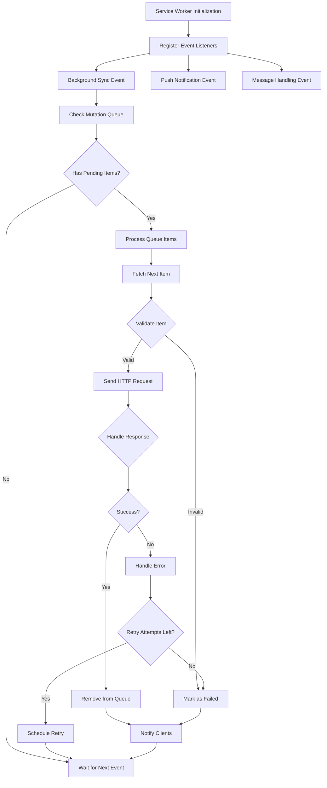
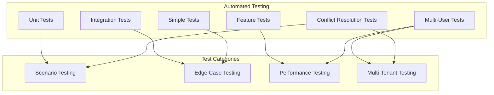

# Offline Synchronization Infrastructure

<cite>
**Referenced Files in This Document**
- [OfflineConflictResolutionService.php](file://app/Services/OfflineConflictResolutionService.php)
- [OfflineSyncController.php](file://app/Http/Controllers/OfflineSyncController.php)
- [HandleOfflineSync.php](file://app/Http/Middleware/HandleOfflineSync.php)
- [OfflineSyncConflict.php](file://app/Models/OfflineSyncConflict.php)
- [2026_04_08_060000_create_offline_sync_conflicts_table.php](file://database/migrations/2026_04_08_060000_create_offline_sync_conflicts_table.php)
- [api.php](file://routes/api.php)
- [conflict-resolution.js](file://resources/js/conflict-resolution.js)
- [offline-manager.js](file://resources/js/offline-manager.js)
- [sw.js](file://public/sw.js)
- [OFFLINE_SYNC_TESTING_GUIDE.md](file://tests/OFFLINE_SYNC_TESTING_GUIDE.md)
- [OfflineSyncConflictResolutionTest.php](file://tests/Feature/OfflineSyncConflictResolutionTest.php)
- [MultipleUsersOfflineSyncTest.php](file://tests/Feature/MultipleUsersOfflineSyncTest.php)
- [SimpleOfflineSyncTest.php](file://tests/Feature/SimpleOfflineSyncTest.php)
</cite>

## Update Summary
**Changes Made**
- Expanded testing framework documentation with comprehensive test coverage
- Added detailed testing procedures for multi-user scenarios and conflict resolution
- Updated testing guidelines to include new test categories and scenarios
- Enhanced documentation with specific test case implementations
- Added comprehensive test scenario coverage for edge cases and performance

## Table of Contents
1. [Introduction](#introduction)
2. [System Architecture](#system-architecture)
3. [Core Components](#core-components)
4. [Conflict Resolution Engine](#conflict-resolution-engine)
5. [Offline Data Management](#offline-data-management)
6. [User Interface Components](#user-interface-components)
7. [Service Worker Implementation](#service-worker-implementation)
8. [Testing Framework](#testing-framework)
9. [Performance Optimization](#performance-optimization)
10. [Security Considerations](#security-considerations)
11. [Deployment Guidelines](#deployment-guidelines)
12. [Troubleshooting Guide](#troubleshooting-guide)

## Introduction

The Offline Synchronization Infrastructure is a comprehensive system designed to handle data synchronization in disconnected environments while preventing data conflicts and ensuring data integrity. This system addresses the critical challenge of maintaining consistent business data when users operate in offline conditions, particularly in mobile and field operations contexts.

The infrastructure consists of five interconnected layers: client-side queuing and caching, service worker background synchronization, server-side conflict detection and resolution, database conflict tracking, and user interface for conflict management. This multi-layered approach ensures robust offline capabilities while maintaining data consistency across distributed systems.

**Updated** Enhanced with comprehensive testing framework covering multi-user scenarios, conflict resolution strategies, and edge case handling.

## System Architecture

The offline synchronization system follows a layered architecture pattern that separates concerns between client-side operations, background processing, server-side validation, and user interaction.

**Diagram sources**
- [offline-manager.js:1-800](file://resources/js/offline-manager.js#L1-L800)
- [sw.js:260-401](file://public/sw.js#L260-L401)
- [OfflineSyncController.php:1-401](file://app/Http/Controllers/OfflineSyncController.php#L1-L401)
- [OfflineConflictResolutionService.php:1-564](file://app/Services/OfflineConflictResolutionService.php#L1-L564)

The architecture ensures that offline operations are isolated from online operations while providing seamless integration when connectivity is restored. The system maintains strict separation of concerns with dedicated components for queuing, conflict detection, resolution, and user interface.

## Core Components

### Offline Conflict Resolution Service

The Offline Conflict Resolution Service serves as the central intelligence engine for detecting and resolving data conflicts that arise from concurrent modifications made during offline periods.

**Diagram sources**
- [OfflineConflictResolutionService.php:31-564](file://app/Services/OfflineConflictResolutionService.php#L31-L564)
- [OfflineSyncConflict.php:9-92](file://app/Models/OfflineSyncConflict.php#L9-L92)

The service implements sophisticated conflict detection algorithms that analyze offline mutations against current server state to identify potential conflicts. It supports four primary resolution strategies: local_wins, server_wins, merge, and skip, with intelligent defaults based on entity type.

### Offline Sync Controller

The Offline Sync Controller provides the RESTful API endpoints that handle bulk synchronization operations, conflict management, and cache operations for offline-capable applications.

**Diagram sources**
- [OfflineSyncController.php:53-149](file://app/Http/Controllers/OfflineSyncController.php#L53-L149)
- [sw.js:277-315](file://public/sw.js#L277-L315)

The controller implements comprehensive validation, tenant isolation, and error handling to ensure reliable offline synchronization across multi-tenant deployments.

**Section sources**
- [OfflineConflictResolutionService.php:1-564](file://app/Services/OfflineConflictResolutionService.php#L1-L564)
- [OfflineSyncController.php:1-401](file://app/Http/Controllers/OfflineSyncController.php#L1-L401)

## Conflict Resolution Engine

### Smart Conflict Detection

The conflict detection system employs sophisticated algorithms to identify potential data conflicts before applying offline changes. The system analyzes multiple factors including timestamp comparisons, entity state validation, and user role prioritization.

**Diagram sources**
- [OfflineConflictResolutionService.php:44-315](file://app/Services/OfflineConflictResolutionService.php#L44-L315)

The conflict detection algorithm considers multiple factors including entity existence, timestamp comparisons, and module-specific validation rules to minimize false positives while catching genuine conflicts.

### Auto-Resolution Strategies

The system implements four primary auto-resolution strategies, each optimized for specific use cases and data types:

| Strategy | Use Case | Description | Impact |
|----------|----------|-------------|---------|
| **local_wins** | Customer data, POS transactions | Applies offline changes regardless of server state | Preserves user intent |
| **server_wins** | Sales orders, financial data | Discards offline changes in favor of server state | Maintains data consistency |
| **merge** | Inventory adjustments, non-conflicting fields | Combines changes intelligently | Maximizes data preservation |
| **skip** | Duplicate prevention, invalid operations | Ignores conflicting operation | Prevents data corruption |

**Section sources**
- [OfflineConflictResolutionService.php:318-477](file://app/Services/OfflineConflictResolutionService.php#L318-L477)

## Offline Data Management

### IndexedDB Queue Management

The offline data management system utilizes IndexedDB for persistent storage of queued mutations, cached data, and synchronization state. This approach ensures data persistence across browser sessions and device restarts.

**Diagram sources**
- [offline-manager.js:38-64](file://resources/js/offline-manager.js#L38-L64)
- [offline-manager.js:467-522](file://resources/js/offline-manager.js#L467-L522)

The queue management system implements sophisticated retry logic with exponential backoff, error categorization, and automatic cleanup of resolved or failed items.

### Service Worker Background Synchronization

The service worker implementation handles background synchronization tasks, ensuring that offline operations continue even when the main application is not active.

**Diagram sources**
- [sw.js:268-315](file://public/sw.js#L268-L315)
- [sw.js:277-315](file://public/sw.js#L277-L315)

The service worker implements comprehensive error handling, retry mechanisms, and progress notification to maintain reliable offline synchronization.

**Section sources**
- [offline-manager.js:1-800](file://resources/js/offline-manager.js#L1-L800)
- [sw.js:260-401](file://public/sw.js#L260-L401)

## User Interface Components

### Conflict Resolution Interface

The conflict resolution user interface provides an intuitive way for users to review and resolve data conflicts that arise from offline operations. The interface displays field-level differences and provides multiple resolution options.

**Diagram sources**
- [conflict-resolution.js:10-509](file://resources/js/conflict-resolution.js#L10-L509)

The interface implements role-based conflict resolution, field-level comparison visualization, and batch processing capabilities to handle multiple conflicts efficiently.

### Offline Status Indicators

The system provides comprehensive offline status indicators that help users understand their current connectivity status and pending synchronization operations.

**Section sources**
- [conflict-resolution.js:1-509](file://resources/js/conflict-resolution.js#L1-L509)

## Service Worker Implementation

### Background Sync Architecture

The service worker implementation provides robust background synchronization capabilities that operate independently of the main application lifecycle. This ensures that offline operations continue seamlessly even when users close the application.

**Diagram sources**
- [sw.js:268-315](file://public/sw.js#L268-L315)

The service worker implements comprehensive error handling, retry logic with exponential backoff, and progress notification to ensure reliable offline synchronization.

### IndexedDB Operations

The service worker manages all IndexedDB operations for persistent storage of offline data, including mutation queues, cached data, and synchronization state.

**Section sources**
- [sw.js:260-401](file://public/sw.js#L260-L401)

## Testing Framework

### Comprehensive Test Coverage

The offline synchronization system includes extensive testing coverage through integration tests, unit tests, and manual testing procedures to ensure reliability and correctness across all components.

**Updated** Enhanced with comprehensive testing framework including MultipleUsersOfflineSyncTest, OfflineSyncConflictResolutionTest, and SimpleOfflineSyncTest covering multi-user conflicts, duplicate prevention, field-level merging, and role-based priority resolution.

**Diagram sources**
- [OFFLINE_SYNC_TESTING_GUIDE.md:1-375](file://tests/OFFLINE_SYNC_TESTING_GUIDE.md#L1-L375)
- [OfflineSyncConflictResolutionTest.php:1-492](file://tests/Feature/OfflineSyncConflictResolutionTest.php#L1-L492)
- [MultipleUsersOfflineSyncTest.php:1-491](file://tests/Feature/MultipleUsersOfflineSyncTest.php#L1-L491)
- [SimpleOfflineSyncTest.php:1-74](file://tests/Feature/SimpleOfflineSyncTest.php#L1-L74)

The testing framework covers critical scenarios including multi-user conflict resolution, duplicate transaction prevention, field-level merging, role-based priority resolution, and tenant isolation testing.

### Test Scenarios

The system includes comprehensive test scenarios covering various offline synchronization edge cases:

1. **Multi-User Inventory Conflicts**: Simultaneous modifications by different user roles with role-based priority resolution
2. **POS Transaction Deduplication**: Prevention of duplicate transaction processing with local_transaction_id validation
3. **Field-Level Customer Data Merging**: Intelligent merging of non-conflicting field updates with smart conflict detection
4. **Exponential Backoff Retry**: Proper handling of server errors and rate limiting with configurable retry policies
5. **Role-Based Priority Resolution**: Automatic conflict resolution based on user hierarchy and permissions
6. **Cross-Tenant Isolation**: Tenant-specific conflict isolation and data separation
7. **Three-Way Conflicts**: Complex scenarios involving multiple users editing the same entity concurrently
8. **Permission-Based Sync**: User permissions affecting offline sync success and validation

**Section sources**
- [OFFLINE_SYNC_TESTING_GUIDE.md:1-375](file://tests/OFFLINE_SYNC_TESTING_GUIDE.md#L1-L375)
- [OfflineSyncConflictResolutionTest.php:1-492](file://tests/Feature/OfflineSyncConflictResolutionTest.php#L1-L492)
- [MultipleUsersOfflineSyncTest.php:1-491](file://tests/Feature/MultipleUsersOfflineSyncTest.php#L1-L491)
- [SimpleOfflineSyncTest.php:1-74](file://tests/Feature/SimpleOfflineSyncTest.php#L1-L74)

### Test Categories and Coverage

The testing framework encompasses multiple categories with specific coverage objectives:

**Integration Tests**: Validate end-to-end offline sync workflows and conflict resolution processes
- POS transaction duplicate prevention
- Inventory conflict detection and resolution
- Customer data field-level merging
- Auto-resolve strategy implementation

**Multi-User Tests**: Comprehensive testing of concurrent offline scenarios
- Role-based priority conflict resolution
- Cross-tenant isolation validation
- Three-way conflict scenarios
- Permission-based sync validation

**Edge Case Tests**: Validation of system resilience under extreme conditions
- Exponential backoff retry logic
- Large mutation payload handling
- Conflict modal availability
- Backoff delay optimization

**Performance Tests**: Load testing and performance validation
- Conflict detection performance (< 100ms per mutation)
- Auto-resolve performance (< 200ms per conflict)
- Bulk sync performance (50 mutations < 5 seconds)
- UI render performance (conflict modal < 300ms)

**Section sources**
- [OFFLINE_SYNC_TESTING_GUIDE.md:222-375](file://tests/OFFLINE_SYNC_TESTING_GUIDE.md#L222-L375)

## Performance Optimization

### Queue Management Efficiency

The offline synchronization system implements several performance optimizations to ensure efficient handling of large volumes of offline operations:

- **Batch Processing**: Automatic batching of mutations to reduce API call overhead
- **Index Optimization**: Strategic indexing in IndexedDB for fast query performance
- **Memory Management**: Efficient memory usage through lazy loading and cleanup
- **Connection Pooling**: Optimized HTTP connection handling for reduced latency

### Caching Strategy

The system implements intelligent caching strategies to minimize bandwidth usage and improve response times:

- **TTL Management**: Configurable time-to-live for cached data
- **Cache Invalidation**: Automatic cache invalidation based on data changes
- **Selective Caching**: Intelligent selection of data for offline access
- **Cache Compression**: Efficient storage of cached data structures

## Security Considerations

### Authentication and Authorization

The offline synchronization system maintains strict security boundaries through comprehensive authentication and authorization mechanisms:

- **Tenant Isolation**: Automatic tenant separation in all operations
- **CSRF Protection**: Robust CSRF token management for offline operations
- **Role-Based Access**: User role validation for conflict resolution decisions
- **Data Validation**: Comprehensive input validation and sanitization

### Data Integrity

The system implements multiple layers of data integrity protection:

- **Conflict Detection**: Advanced algorithms to prevent data corruption
- **Transaction Management**: Atomic operations for complex multi-entity changes
- **Audit Logging**: Complete audit trail of all synchronization activities
- **Error Recovery**: Automatic recovery from partial failures

## Deployment Guidelines

### System Requirements

The offline synchronization infrastructure requires specific deployment configurations to ensure optimal performance and reliability:

- **Browser Support**: Modern browsers with Service Worker and IndexedDB support
- **Server Resources**: Adequate server capacity for background processing
- **Database Configuration**: Optimized database settings for high-concurrency scenarios
- **Network Requirements**: Reliable network connectivity for synchronization operations

### Configuration Options

The system provides extensive configuration options for different deployment scenarios:

- **Retry Policies**: Configurable retry attempts and backoff strategies
- **Queue Limits**: Adjustable queue sizes and retention policies
- **Cache Settings**: Customizable cache TTL and storage limits
- **Conflict Resolution**: Flexible conflict resolution strategies per entity type

## Troubleshooting Guide

### Common Issues and Solutions

The offline synchronization system includes comprehensive troubleshooting capabilities and diagnostic tools:

**Queue Management Issues**
- **Symptom**: Mutations not syncing after reconnect
- **Solution**: Check IndexedDB storage and queue status
- **Prevention**: Monitor queue length and implement cleanup policies

**Conflict Resolution Problems**
- **Symptom**: Conflicts not appearing in UI
- **Solution**: Verify conflict detection logic and database connectivity
- **Prevention**: Implement proper conflict resolution strategies

**Performance Degradation**
- **Symptom**: Slow synchronization performance
- **Solution**: Optimize database queries and implement batching
- **Prevention**: Monitor system metrics and implement scaling strategies

### Diagnostic Tools

The system provides built-in diagnostic tools for troubleshooting offline synchronization issues:

- **Console Logging**: Comprehensive logging of all synchronization activities
- **Performance Monitoring**: Real-time performance metrics and alerts
- **Error Tracking**: Centralized error reporting and analysis
- **Debug Mode**: Enhanced logging for development and testing environments

**Section sources**
- [OFFLINE_SYNC_TESTING_GUIDE.md:247-375](file://tests/OFFLINE_SYNC_TESTING_GUIDE.md#L247-L375)