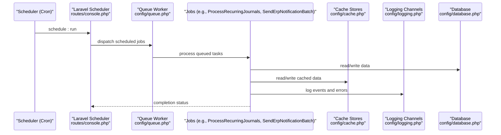
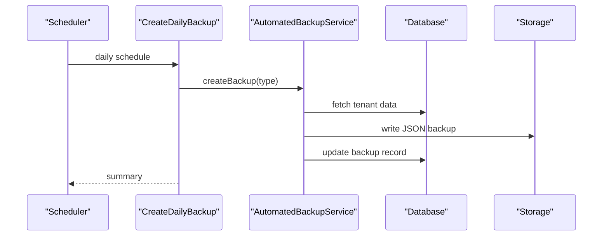
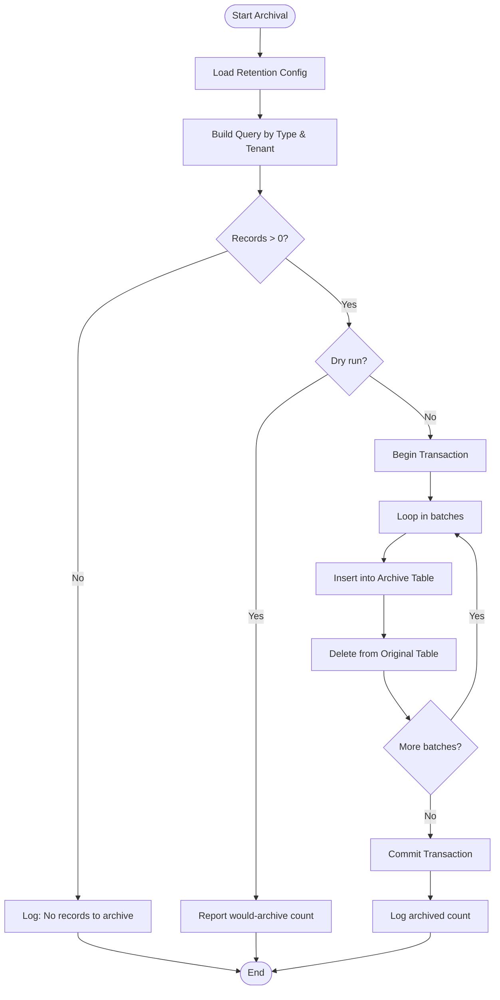
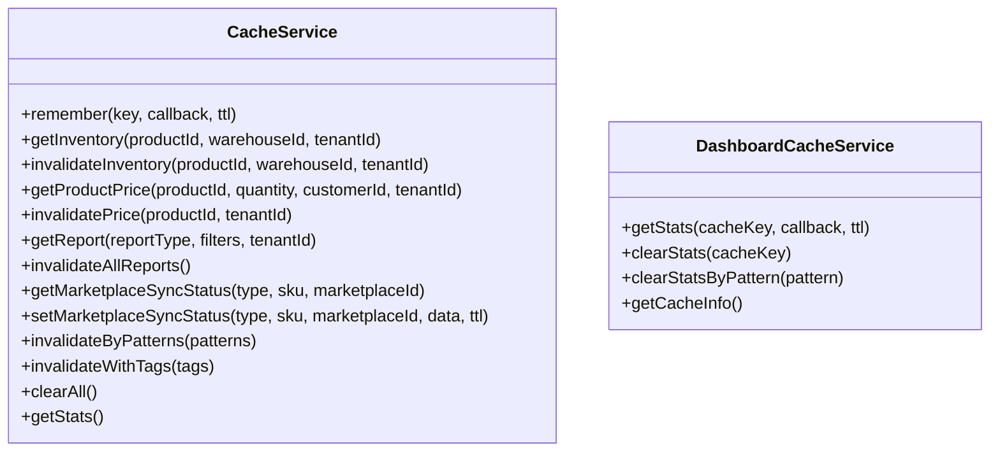
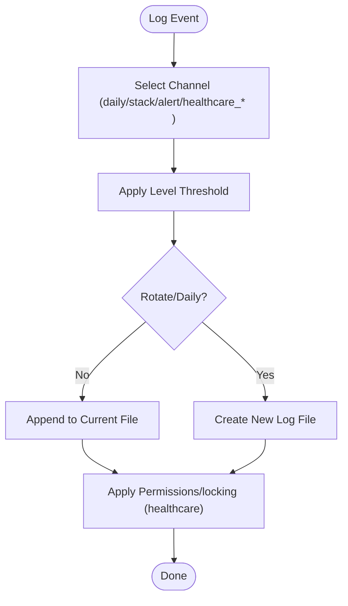
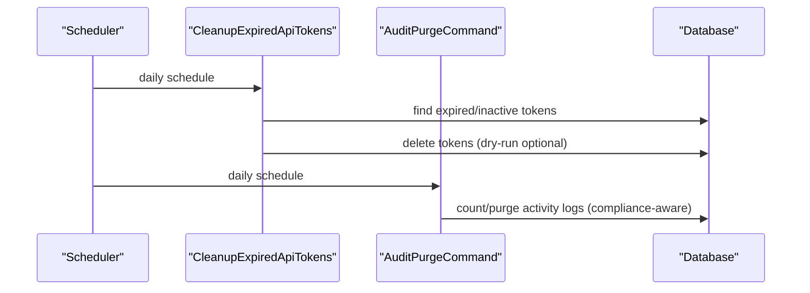
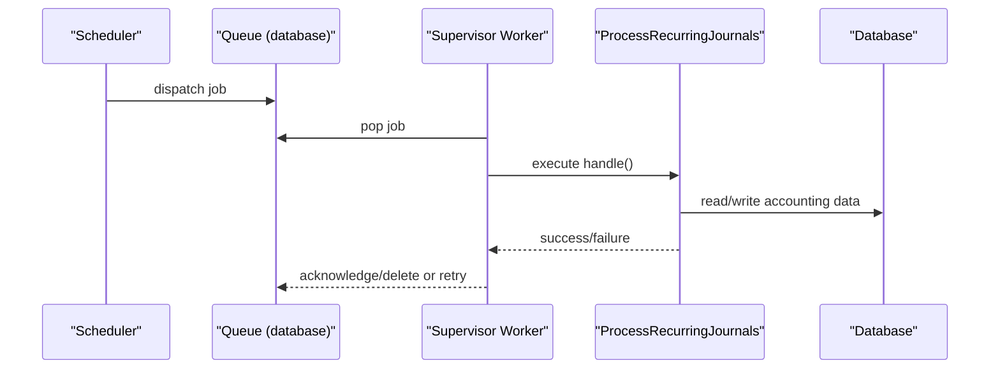
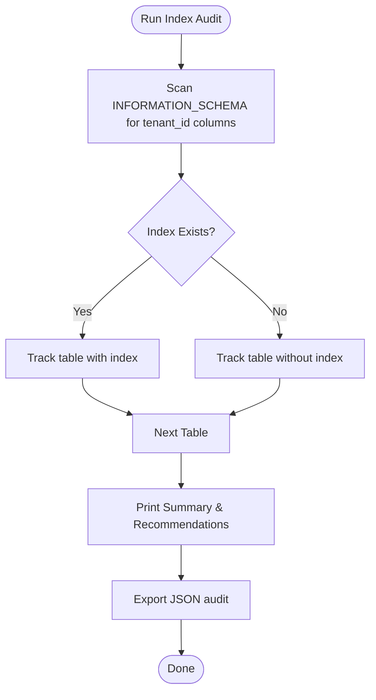
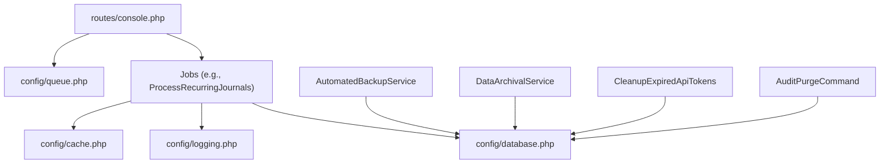

# Maintenance & Automation

<cite>
**Referenced Files in This Document**
- [README.md](file://README.md)
- [routes/console.php](file://routes/console.php)
- [config/queue.php](file://config/queue.php)
- [config/cache.php](file://config/cache.php)
- [config/logging.php](file://config/logging.php)
- [config/database.php](file://config/database.php)
- [config/data_retention.php](file://config/data_retention.php)
- [app/Console/Commands/CreateDailyBackup.php](file://app/Console/Commands/CreateDailyBackup.php)
- [app/Console/Commands/CleanupOldData.php](file://app/Console/Commands/CleanupOldData.php)
- [app/Console/Commands/AuditPurgeCommand.php](file://app/Console/Commands/AuditPurgeCommand.php)
- [app/Console/Commands/CleanupExpiredApiTokens.php](file://app/Console/Commands/CleanupExpiredApiTokens.php)
- [app/Services/AutomatedBackupService.php](file://app/Services/AutomatedBackupService.php)
- [app/Services/DataArchivalService.php](file://app/Services/DataArchivalService.php)
- [app/Services/CacheService.php](file://app/Services/CacheService.php)
- [app/Services/DashboardCacheService.php](file://app/Services/DashboardCacheService.php)
- [app/Jobs/ProcessRecurringJournals.php](file://app/Jobs/ProcessRecurringJournals.php)
- [app/Jobs/SendErpNotificationBatch.php](file://app/Jobs/SendErpNotificationBatch.php)
- [scripts/audit-tenant-indexes.php](file://scripts/audit-tenant-indexes.php)
</cite>

## Table of Contents
1. [Introduction](#introduction)
2. [Project Structure](#project-structure)
3. [Core Components](#core-components)
4. [Architecture Overview](#architecture-overview)
5. [Detailed Component Analysis](#detailed-component-analysis)
6. [Dependency Analysis](#dependency-analysis)
7. [Performance Considerations](#performance-considerations)
8. [Troubleshooting Guide](#troubleshooting-guide)
9. [Conclusion](#conclusion)
10. [Appendices](#appendices)

## Introduction
This document provides comprehensive maintenance and automation guidance for Qalcuity ERP operations. It covers routine maintenance tasks, system updates, patch management, automated maintenance scripts, scheduled jobs, background task management, database maintenance, cache management, log rotation, automated deployment pipelines, rollback procedures, blue-green deployment strategies, system health checks, preventive maintenance schedules, and performance tuning automation. It also includes maintenance workflow templates, change management procedures, and operational runbooks for common maintenance scenarios.

## Project Structure
Qalcuity ERP leverages Laravel’s scheduling, queue, cache, logging, and configuration systems to automate operations. Key areas include:
- Scheduled tasks orchestrated via routes/console.php
- Queue workers managed by Supervisor and configured in config/queue.php
- Cache strategies via config/cache.php and services
- Logging via config/logging.php with channels for daily rotation and specialized healthcare channels
- Data retention and archival via config/data_retention.php and services
- Backup and restore via console commands and services
- Index auditing via scripts/audit-tenant-indexes.php

```mermaid
graph TB
subgraph "Operations Layer"
SCHED["Laravel Scheduler<br/>routes/console.php"]
QUEUE["Queue Workers<br/>config/queue.php"]
CACHE["Cache Stores<br/>config/cache.php"]
LOG["Logging Channels<br/>config/logging.php"]
DB["Database<br/>config/database.php"]
DATA_RET["Data Retention Policies<br/>config/data_retention.php"]
end
subgraph "Maintenance Scripts"
CMD_BACKUP["CreateDailyBackup<br/>app/Console/Commands/CreateDailyBackup.php"]
CMD_CLEAN_OLD["CleanupOldData<br/>app/Console/Commands/CleanupOldData.php"]
CMD_AUDIT_PURGE["AuditPurgeCommand<br/>app/Console/Commands/AuditPurgeCommand.php"]
CMD_TOKEN_CLEAN["CleanupExpiredApiTokens<br/>app/Console/Commands/CleanupExpiredApiTokens.php"]
ARCHIVE["DataArchivalService<br/>app/Services/DataArchivalService.php"]
BACKUP_SVC["AutomatedBackupService<br/>app/Services/AutomatedBackupService.php"]
CACHE_SVC["CacheService<br/>app/Services/CacheService.php"]
DASH_CACHE_SVC["DashboardCacheService<br/>app/Services/DashboardCacheService.php"]
end
SCHED --> QUEUE
QUEUE --> CMD_BACKUP
QUEUE --> CMD_CLEAN_OLD
QUEUE --> CMD_AUDIT_PURGE
QUEUE --> CMD_TOKEN_CLEAN
QUEUE --> ARCHIVE
QUEUE --> BACKUP_SVC
QUEUE --> CACHE_SVC
QUEUE --> DASH_CACHE_SVC
QUEUE --> DB
CACHE <- --> CACHE_SVC
CACHE <- --> DASH_CACHE_SVC
LOG --> DB
DATA_RET --> ARCHIVE
```

**Diagram sources**
- [routes/console.php:1-489](file://routes/console.php#L1-L489)
- [config/queue.php:1-130](file://config/queue.php#L1-L130)
- [config/cache.php:1-131](file://config/cache.php#L1-L131)
- [config/logging.php:1-216](file://config/logging.php#L1-L216)
- [config/database.php:1-185](file://config/database.php#L1-L185)
- [config/data_retention.php:1-293](file://config/data_retention.php#L1-L293)
- [app/Console/Commands/CreateDailyBackup.php:1-74](file://app/Console/Commands/CreateDailyBackup.php#L1-L74)
- [app/Console/Commands/CleanupOldData.php:1-62](file://app/Console/Commands/CleanupOldData.php#L1-L62)
- [app/Console/Commands/AuditPurgeCommand.php:1-95](file://app/Console/Commands/AuditPurgeCommand.php#L1-L95)
- [app/Console/Commands/CleanupExpiredApiTokens.php:1-123](file://app/Console/Commands/CleanupExpiredApiTokens.php#L1-L123)
- [app/Services/DataArchivalService.php:1-360](file://app/Services/DataArchivalService.php#L1-L360)
- [app/Services/AutomatedBackupService.php:1-224](file://app/Services/AutomatedBackupService.php#L1-L224)
- [app/Services/CacheService.php:1-275](file://app/Services/CacheService.php#L1-L275)
- [app/Services/DashboardCacheService.php:1-72](file://app/Services/DashboardCacheService.php#L1-L72)

**Section sources**
- [README.md:1-576](file://README.md#L1-L576)
- [routes/console.php:1-489](file://routes/console.php#L1-L489)
- [config/queue.php:1-130](file://config/queue.php#L1-L130)
- [config/cache.php:1-131](file://config/cache.php#L1-L131)
- [config/logging.php:1-216](file://config/logging.php#L1-L216)
- [config/database.php:1-185](file://config/database.php#L1-L185)
- [config/data_retention.php:1-293](file://config/data_retention.php#L1-L293)

## Core Components
- Scheduled Tasks: Orchestrated via routes/console.php, covering AI insights, ERP notifications, trials/expiry checks, asset depreciation, currency rates, loyalty points, e-commerce sync, monthly reports, recurring journals, reminders, cleanup, backups, deferred amortization, anomaly detection, audit purges, user pattern analysis, telecom polling, workflow processing, and scheduled reports.
- Queue Infrastructure: Configured in config/queue.php with database-backed queues and Supervisor-managed workers; documented in README.md for production setup.
- Cache Management: Centralized via config/cache.php and services (CacheService, DashboardCacheService) with intelligent invalidation and TTL strategies.
- Logging: Configured in config/logging.php with daily rotation, healthcare-specific channels, and alerting hooks.
- Data Retention & Archival: Defined in config/data_retention.php and executed via DataArchivalService.
- Backups: Automated via CreateDailyBackup command and AutomatedBackupService.
- Index Auditing: Provided by scripts/audit-tenant-indexes.php to identify missing tenant_id indexes.

**Section sources**
- [routes/console.php:1-489](file://routes/console.php#L1-L489)
- [config/queue.php:1-130](file://config/queue.php#L1-L130)
- [config/cache.php:1-131](file://config/cache.php#L1-L131)
- [config/logging.php:1-216](file://config/logging.php#L1-L216)
- [config/data_retention.php:1-293](file://config/data_retention.php#L1-L293)
- [app/Console/Commands/CreateDailyBackup.php:1-74](file://app/Console/Commands/CreateDailyBackup.php#L1-L74)
- [app/Services/AutomatedBackupService.php:1-224](file://app/Services/AutomatedBackupService.php#L1-L224)
- [app/Services/DataArchivalService.php:1-360](file://app/Services/DataArchivalService.php#L1-L360)
- [app/Services/CacheService.php:1-275](file://app/Services/CacheService.php#L1-L275)
- [app/Services/DashboardCacheService.php:1-72](file://app/Services/DashboardCacheService.php#L1-L72)
- [scripts/audit-tenant-indexes.php:1-119](file://scripts/audit-tenant-indexes.php#L1-L119)

## Architecture Overview
The maintenance and automation architecture integrates scheduled tasks, queue workers, cache, logging, and data retention policies to ensure reliable, scalable operations.



**Diagram sources**
- [routes/console.php:1-489](file://routes/console.php#L1-L489)
- [config/queue.php:1-130](file://config/queue.php#L1-L130)
- [config/cache.php:1-131](file://config/cache.php#L1-L131)
- [config/logging.php:1-216](file://config/logging.php#L1-L216)
- [config/database.php:1-185](file://config/database.php#L1-L185)

## Detailed Component Analysis

### Automated Backup System
- Purpose: Create tenant-scoped backups, track expiration, and support restoration.
- Components:
  - Console command CreateDailyBackup dispatches backups across tenants.
  - AutomatedBackupService orchestrates backup creation, persistence, and cleanup.
- Operations:
  - Backup creation per tenant with table selection and JSON serialization.
  - Expiration-based cleanup and history retrieval.
  - Restore from backup with transactional inserts and error handling.



**Diagram sources**
- [routes/console.php:340-362](file://routes/console.php#L340-L362)
- [app/Console/Commands/CreateDailyBackup.php:1-74](file://app/Console/Commands/CreateDailyBackup.php#L1-L74)
- [app/Services/AutomatedBackupService.php:1-224](file://app/Services/AutomatedBackupService.php#L1-L224)

**Section sources**
- [app/Console/Commands/CreateDailyBackup.php:1-74](file://app/Console/Commands/CreateDailyBackup.php#L1-L74)
- [app/Services/AutomatedBackupService.php:1-224](file://app/Services/AutomatedBackupService.php#L1-L224)
- [routes/console.php:340-362](file://routes/console.php#L340-L362)

### Data Archival and Cleanup
- Purpose: Move historical data to archive tables based on retention policies to improve performance.
- Components:
  - DataArchivalService with configurable retention days per entity type.
  - Cleanup jobs for failed jobs, old sessions, and prune operations.
- Operations:
  - Batch archival with transactional move and dynamic archive table creation.
  - Dry-run support and statistics collection.
  - Restore archived data back to main tables.



**Diagram sources**
- [app/Services/DataArchivalService.php:1-360](file://app/Services/DataArchivalService.php#L1-L360)
- [config/data_retention.php:1-293](file://config/data_retention.php#L1-L293)

**Section sources**
- [app/Services/DataArchivalService.php:1-360](file://app/Services/DataArchivalService.php#L1-L360)
- [config/data_retention.php:1-293](file://config/data_retention.php#L1-L293)
- [routes/console.php:210-237](file://routes/console.php#L210-L237)

### Cache Management
- Purpose: Reduce database load with intelligent caching and automatic invalidation.
- Components:
  - CacheService with domain-specific prefixes, TTLs, and invalidation patterns.
  - DashboardCacheService for dashboard statistics.
- Operations:
  - Cache::remember for memoization with TTL.
  - Pattern-based invalidation and fallback tag-based invalidation.
  - Stats and clear-all utilities for monitoring and maintenance.



**Diagram sources**
- [app/Services/CacheService.php:1-275](file://app/Services/CacheService.php#L1-L275)
- [app/Services/DashboardCacheService.php:1-72](file://app/Services/DashboardCacheService.php#L1-L72)

**Section sources**
- [app/Services/CacheService.php:1-275](file://app/Services/CacheService.php#L1-L275)
- [app/Services/DashboardCacheService.php:1-72](file://app/Services/DashboardCacheService.php#L1-L72)
- [config/cache.php:1-131](file://config/cache.php#L1-L131)

### Logging and Log Rotation
- Purpose: Manage logs with daily rotation, healthcare-specific channels, and alerting.
- Components:
  - Channels: stack, daily, slack, syslog, stderr, database, alert, healthcare_audit, healthcare_security, healthcare_compliance.
  - Configuration: log levels, retention, processors, and permissions for healthcare logs.



**Diagram sources**
- [config/logging.php:1-216](file://config/logging.php#L1-L216)

**Section sources**
- [config/logging.php:1-216](file://config/logging.php#L1-L216)

### API Token and Audit Cleanup
- Purpose: Secure token lifecycle and maintain audit hygiene.
- Components:
  - CleanupExpiredApiTokens: expired and inactive tokens.
  - AuditPurgeCommand: purge old audit logs respecting compliance holds.



**Diagram sources**
- [routes/console.php:212-280](file://routes/console.php#L212-L280)
- [app/Console/Commands/CleanupExpiredApiTokens.php:1-123](file://app/Console/Commands/CleanupExpiredApiTokens.php#L1-L123)
- [app/Console/Commands/AuditPurgeCommand.php:1-95](file://app/Console/Commands/AuditPurgeCommand.php#L1-L95)

**Section sources**
- [app/Console/Commands/CleanupExpiredApiTokens.php:1-123](file://app/Console/Commands/CleanupExpiredApiTokens.php#L1-L123)
- [app/Console/Commands/AuditPurgeCommand.php:1-95](file://app/Console/Commands/AuditPurgeCommand.php#L1-L95)
- [routes/console.php:212-280](file://routes/console.php#L212-L280)

### Background Jobs and Queue Management
- Purpose: Process asynchronous tasks reliably with retries and timeouts.
- Components:
  - Queue configuration for database, beanstalkd, redis, SQS, and failover.
  - Jobs: ProcessRecurringJournals, SendErpNotificationBatch, and many others.
- Operations:
  - Supervisor-managed workers with process control and log rotation.
  - Job-level retry and timeout settings.



**Diagram sources**
- [routes/console.php:194-201](file://routes/console.php#L194-L201)
- [app/Jobs/ProcessRecurringJournals.php:1-90](file://app/Jobs/ProcessRecurringJournals.php#L1-L90)
- [config/queue.php:1-130](file://config/queue.php#L1-L130)
- [README.md:344-400](file://README.md#L344-L400)

**Section sources**
- [routes/console.php:194-201](file://routes/console.php#L194-L201)
- [app/Jobs/ProcessRecurringJournals.php:1-90](file://app/Jobs/ProcessRecurringJournals.php#L1-L90)
- [config/queue.php:1-130](file://config/queue.php#L1-L130)
- [README.md:344-400](file://README.md#L344-L400)

### Database Index Audit
- Purpose: Identify missing tenant_id indexes to improve query performance.
- Components:
  - scripts/audit-tenant-indexes.php generates recommendations and exports JSON.



**Diagram sources**
- [scripts/audit-tenant-indexes.php:1-119](file://scripts/audit-tenant-indexes.php#L1-L119)

**Section sources**
- [scripts/audit-tenant-indexes.php:1-119](file://scripts/audit-tenant-indexes.php#L1-L119)

## Dependency Analysis
- Scheduler depends on queue configuration and workers.
- Jobs depend on cache and logging for observability.
- Backup and archival services depend on database connectivity and storage.
- Logging channels depend on filesystem permissions and healthcare-specific retention.



**Diagram sources**
- [routes/console.php:1-489](file://routes/console.php#L1-L489)
- [config/queue.php:1-130](file://config/queue.php#L1-L130)
- [config/cache.php:1-131](file://config/cache.php#L1-L131)
- [config/logging.php:1-216](file://config/logging.php#L1-L216)
- [config/database.php:1-185](file://config/database.php#L1-L185)
- [app/Services/AutomatedBackupService.php:1-224](file://app/Services/AutomatedBackupService.php#L1-L224)
- [app/Services/DataArchivalService.php:1-360](file://app/Services/DataArchivalService.php#L1-L360)
- [app/Console/Commands/CleanupExpiredApiTokens.php:1-123](file://app/Console/Commands/CleanupExpiredApiTokens.php#L1-L123)
- [app/Console/Commands/AuditPurgeCommand.php:1-95](file://app/Console/Commands/AuditPurgeCommand.php#L1-L95)

**Section sources**
- [routes/console.php:1-489](file://routes/console.php#L1-L489)
- [config/queue.php:1-130](file://config/queue.php#L1-L130)
- [config/cache.php:1-131](file://config/cache.php#L1-L131)
- [config/logging.php:1-216](file://config/logging.php#L1-L216)
- [config/database.php:1-185](file://config/database.php#L1-L185)
- [app/Services/AutomatedBackupService.php:1-224](file://app/Services/AutomatedBackupService.php#L1-L224)
- [app/Services/DataArchivalService.php:1-360](file://app/Services/DataArchivalService.php#L1-L360)
- [app/Console/Commands/CleanupExpiredApiTokens.php:1-123](file://app/Console/Commands/CleanupExpiredApiTokens.php#L1-L123)
- [app/Console/Commands/AuditPurgeCommand.php:1-95](file://app/Console/Commands/AuditPurgeCommand.php#L1-L95)

## Performance Considerations
- Use database-backed queues for reliability and horizontal scaling.
- Implement cache TTLs appropriate to data volatility (e.g., inventory shorter than configuration).
- Batch archival operations and prune failed jobs regularly to control growth.
- Monitor cache driver capabilities (Redis pattern deletion vs. tags for other stores).
- Ensure tenant_id indexes exist for frequently queried tables to avoid full scans.
- Rotate logs daily and apply healthcare-specific retention and permissions.

[No sources needed since this section provides general guidance]

## Troubleshooting Guide
Common issues and resolutions:
- Error 500 after deploy: regenerate APP_KEY, clear caches, check storage permissions.
- Queue not running: verify Supervisor status, restart workers, inspect worker logs, check failed jobs.
- Permission denied: fix ownership and permissions for storage and bootstrap/cache.
- Composer memory limit: increase memory limit during install.
- Nginx 404 for routes: confirm root points to public and try_files directive is present.
- Scheduler not executing: verify cron runs schedule:run and check schedule:list.

**Section sources**
- [README.md:508-576](file://README.md#L508-L576)

## Conclusion
Qalcuity ERP’s maintenance and automation framework combines scheduled tasks, queue workers, cache strategies, logging, and data retention policies to deliver robust, scalable operations. By following the procedures and templates outlined here, teams can ensure reliable system updates, efficient database maintenance, secure token lifecycle management, and smooth automated deployments with rollback and blue-green strategies.

[No sources needed since this section summarizes without analyzing specific files]

## Appendices

### Maintenance Workflow Templates
- Routine Maintenance Template
  - Verify system health (queues, scheduler, cache, logs).
  - Run data archival and cleanup jobs.
  - Review audit purges and token cleanup outcomes.
  - Confirm backup creation and retention.
  - Monitor cache hit ratios and invalidation patterns.
- Patch Management Template
  - Pre-deploy: backup, disable scheduler briefly, run migrations, rebuild caches.
  - Deploy: execute automated deployment script, restart queue workers.
  - Post-deploy: validate scheduler, test critical jobs, monitor logs.
- Rollback Procedure
  - Stop workers, revert code, restore database from last known good backup, restart services, validate.
- Blue-Green Deployment
  - Maintain two identical environments; switch traffic after validation; roll back by switching back.

[No sources needed since this section provides general guidance]

### Operational Runbooks
- Daily
  - Monitor scheduled tasks, queue workers, and logs.
  - Run cleanup jobs (failed jobs, old sessions, prune).
- Weekly
  - Review audit purges, token cleanup, and archival statistics.
  - Validate cache invalidation patterns and TTLs.
- Monthly
  - Validate backup integrity and retention.
  - Review recurring journals and monthly reports.
- Quarterly
  - Audit tenant_id indexes and optimize slow queries.
  - Review healthcare audit and security logs retention.

[No sources needed since this section provides general guidance]