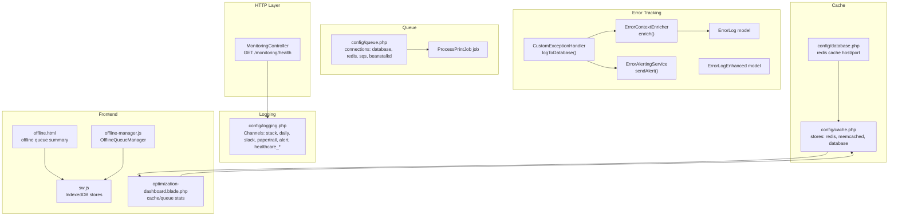
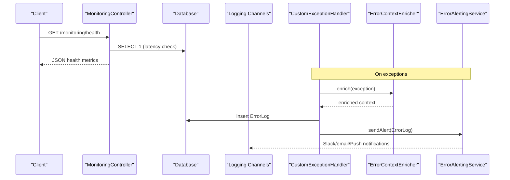
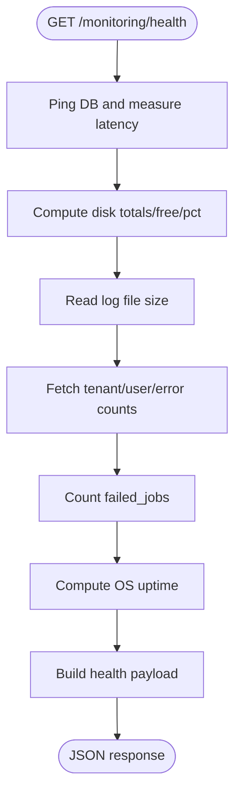
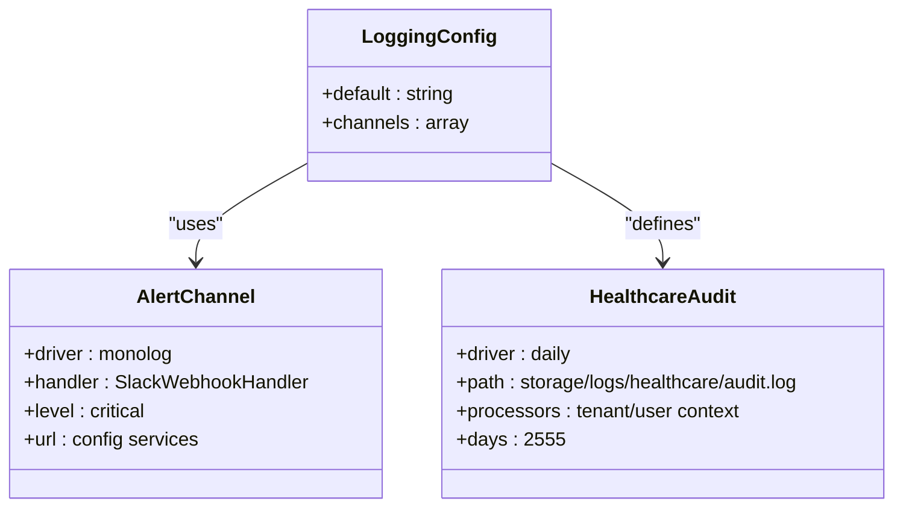
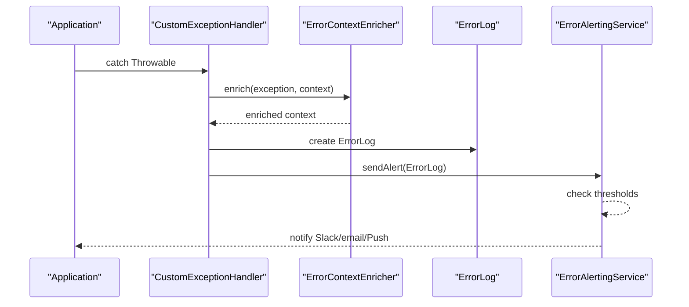
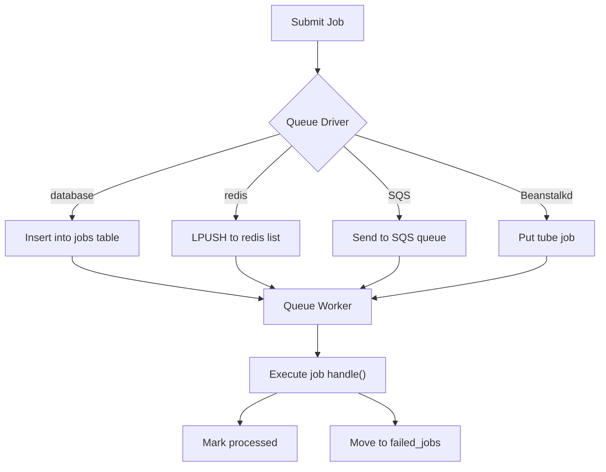
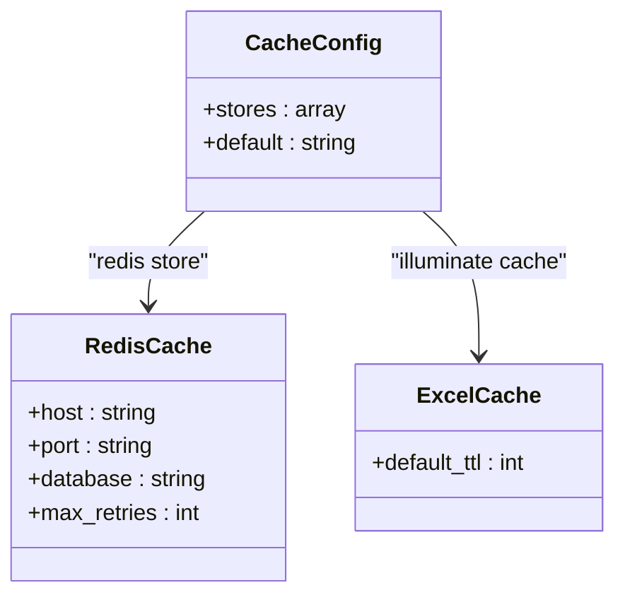
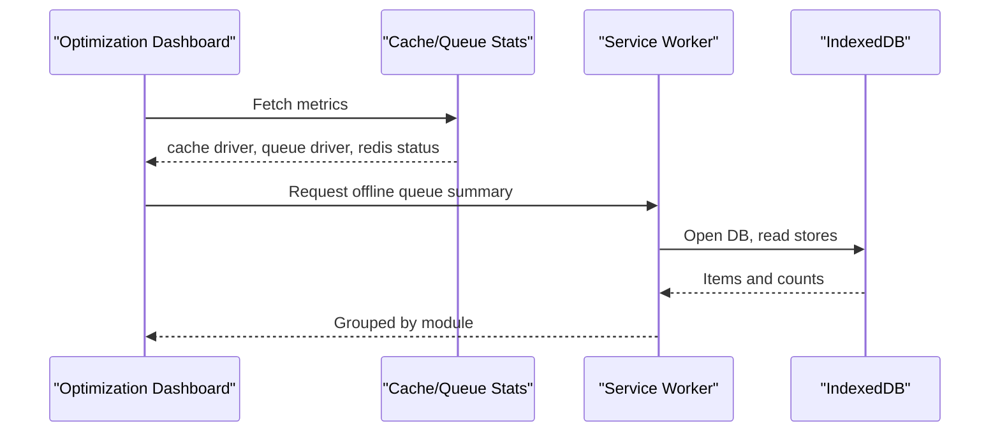
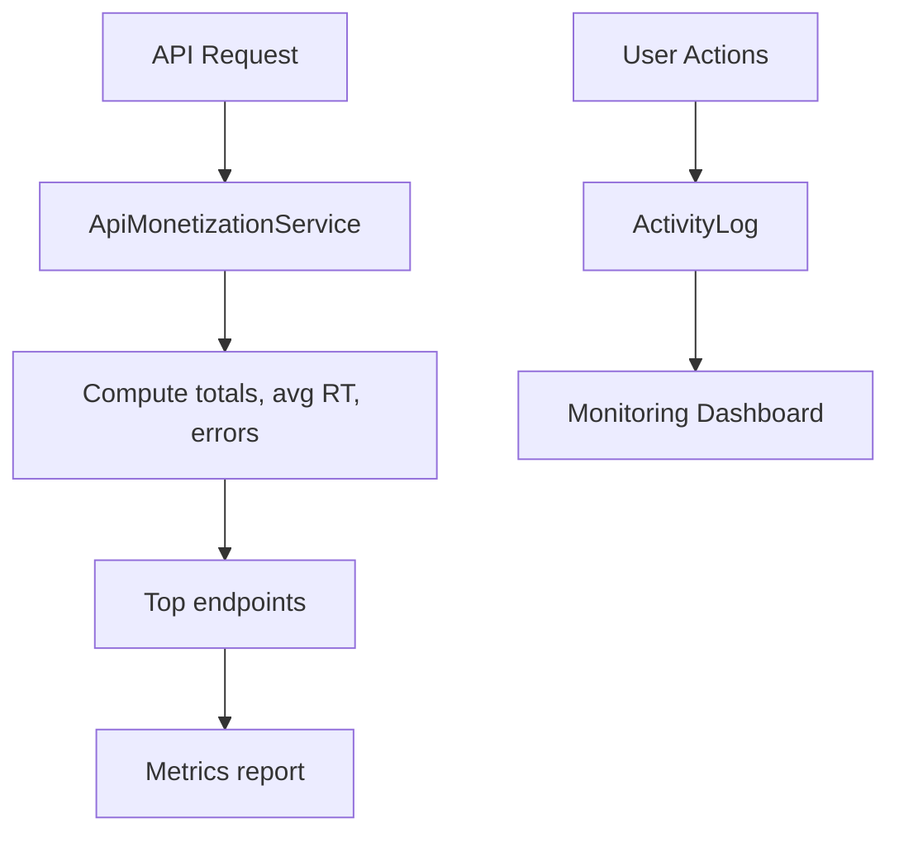
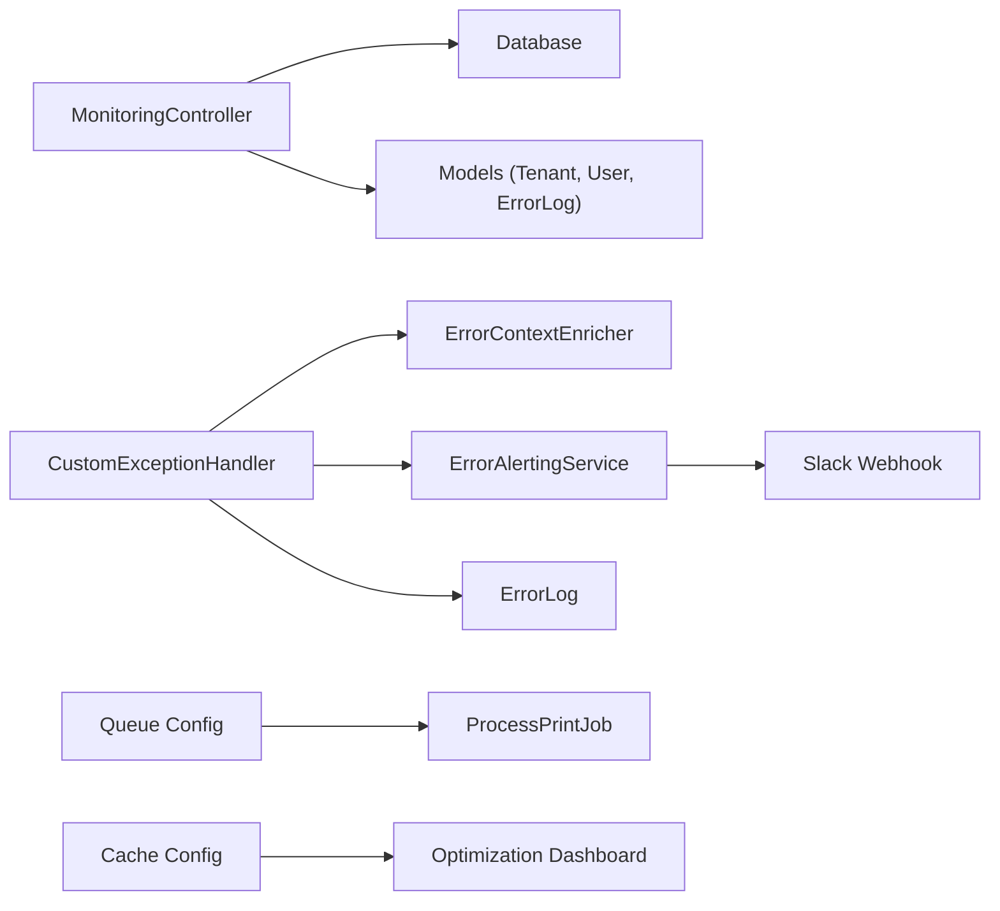

# Monitoring & Alerting

<cite>
**Referenced Files in This Document**
- [MonitoringController.php](file://app/Http/Controllers/SuperAdmin/MonitoringController.php)
- [logging.php](file://config/logging.php)
- [queue.php](file://config/queue.php)
- [ErrorAlertingService.php](file://app/Services/ErrorAlertingService.php)
- [ErrorContextEnricher.php](file://app/Services/ErrorContextEnricher.php)
- [ErrorLog.php](file://app/Models/ErrorLog.php)
- [ErrorLogEnhanced.php](file://app/Models/ErrorLogEnhanced.php)
- [CustomExceptionHandler.php](file://app/Exceptions/CustomExceptionHandler.php)
- [services.php](file://config/services.php)
- [queue.php](file://config/queue.php)
- [cache.php](file://config/cache.php)
- [database.php](file://config/database.php)
- [excel.php](file://config/excel.php)
- [ProcessPrintJob.php](file://app/Jobs/ProcessPrintJob.php)
- [QueueManagementController.php](file://app/Http/Controllers/Healthcare/QueueManagementController.php)
- [QueueManagement.php](file://app/Models/QueueManagement.php)
- [offline.html](file://public/offline.html)
- [sw.js](file://public/sw.js)
- [offline-manager.js](file://resources/js/offline-manager.js)
- [optimization-dashboard.blade.php](file://resources/views/ai/optimization-dashboard.blade.php)
- [ApiMonetizationService.php](file://app/Services/Marketplace/ApiMonetizationService.php)
- [web.php](file://routes/web.php)
</cite>

## Table of Contents
1. [Introduction](#introduction)
2. [Project Structure](#project-structure)
3. [Core Components](#core-components)
4. [Architecture Overview](#architecture-overview)
5. [Detailed Component Analysis](#detailed-component-analysis)
6. [Dependency Analysis](#dependency-analysis)
7. [Performance Considerations](#performance-considerations)
8. [Troubleshooting Guide](#troubleshooting-guide)
9. [Conclusion](#conclusion)
10. [Appendices](#appendices)

## Introduction
This document describes monitoring and alerting for Qalcuity ERP operations. It covers system metrics collection, health checks, log aggregation, error tracking, alerting rules, database performance, queue processing, API response metrics, and user activity indicators. It also outlines integrations with Prometheus/Grafana/New Relic (conceptual), APM tools, and alerting systems such as PagerDuty and Slack. Guidance is provided for configuring custom metrics, thresholds, and incident response procedures.

## Project Structure
Monitoring and alerting capabilities are implemented across:
- Health and system metrics controller
- Logging configuration and channels
- Error tracking and alerting services
- Queue configuration and job processing
- Cache configuration and statistics
- Frontend dashboards and offline queue management
- Routes exposing monitoring endpoints

**Diagram sources**
- [MonitoringController.php:138-178](file://app/Http/Controllers/SuperAdmin/MonitoringController.php#L138-L178)
- [logging.php:53-213](file://config/logging.php#L53-L213)
- [CustomExceptionHandler.php:72-113](file://app/Exceptions/CustomExceptionHandler.php#L72-L113)
- [ErrorContextEnricher.php:24-34](file://app/Services/ErrorContextEnricher.php#L24-L34)
- [ErrorAlertingService.php:42-72](file://app/Services/ErrorAlertingService.php#L42-L72)
- [queue.php:32-92](file://config/queue.php#L32-L92)
- [ProcessPrintJob.php:14-47](file://app/Jobs/ProcessPrintJob.php#L14-L47)
- [cache.php:35-79](file://config/cache.php#L35-L79)
- [database.php:169-184](file://config/database.php#L169-L184)
- [offline.html:186-210](file://public/offline.html#L186-L210)
- [sw.js:316-353](file://public/sw.js#L316-L353)
- [offline-manager.js:1-38](file://resources/js/offline-manager.js#L1-L38)
- [optimization-dashboard.blade.php:250-286](file://resources/views/ai/optimization-dashboard.blade.php#L250-L286)

**Section sources**
- [MonitoringController.php:138-178](file://app/Http/Controllers/SuperAdmin/MonitoringController.php#L138-L178)
- [logging.php:53-213](file://config/logging.php#L53-L213)
- [queue.php:32-92](file://config/queue.php#L32-L92)
- [cache.php:35-79](file://config/cache.php#L35-L79)
- [database.php:169-184](file://config/database.php#L169-L184)
- [offline.html:186-210](file://public/offline.html#L186-L210)
- [sw.js:316-353](file://public/sw.js#L316-L353)
- [offline-manager.js:1-38](file://resources/js/offline-manager.js#L1-L38)
- [optimization-dashboard.blade.php:250-286](file://resources/views/ai/optimization-dashboard.blade.php#L250-L286)

## Core Components
- Health and system metrics endpoint: Returns database connectivity, latency, disk usage, log size, PHP/Laravel versions, tenant/user counts, error volume, failed queue jobs, and uptime.
- Logging configuration: Supports multiple channels including Slack alerts, Papertrail, healthcare audit/security/compliance channels, and database-backed error logs.
- Error tracking and alerting: Centralized enrichment of error context, persistence to database, and alert dispatch to Slack/email/Push with thresholds.
- Queue configuration and processing: Configurable queue drivers, failed job tracking, and job-specific timeouts.
- Cache configuration and stats: Redis/memcached/database stores with cache TTLs and stats retrieval.
- Frontend dashboards and offline queues: Dashboard widgets for cache/queue stats and offline queue management via service worker and IndexedDB.

**Section sources**
- [MonitoringController.php:138-178](file://app/Http/Controllers/SuperAdmin/MonitoringController.php#L138-L178)
- [logging.php:130-213](file://config/logging.php#L130-L213)
- [ErrorAlertingService.php:42-94](file://app/Services/ErrorAlertingService.php#L42-L94)
- [queue.php:32-92](file://config/queue.php#L32-L92)
- [cache.php:35-79](file://config/cache.php#L35-L79)
- [offline-manager.js:1-38](file://resources/js/offline-manager.js#L1-L38)

## Architecture Overview
The monitoring and alerting architecture integrates HTTP endpoints, logging channels, error tracking, queue processing, and frontend dashboards.

**Diagram sources**
- [MonitoringController.php:138-178](file://app/Http/Controllers/SuperAdmin/MonitoringController.php#L138-L178)
- [CustomExceptionHandler.php:72-113](file://app/Exceptions/CustomExceptionHandler.php#L72-L113)
- [ErrorContextEnricher.php:24-34](file://app/Services/ErrorContextEnricher.php#L24-L34)
- [ErrorAlertingService.php:42-72](file://app/Services/ErrorAlertingService.php#L42-L72)
- [logging.php:141-153](file://config/logging.php#L141-L153)

## Detailed Component Analysis

### Health and System Metrics Endpoint
- Purpose: Provide system health and operational metrics.
- Metrics exposed:
  - Database connectivity and latency
  - Disk capacity and usage percentage
  - Log file size
  - PHP and Laravel versions
  - Tenant and user counts
  - Error volume (today)
  - Failed queue job count
  - Uptime
- Implementation: Controller method returns a JSON payload used by dashboards and external monitoring.

**Diagram sources**
- [MonitoringController.php:138-178](file://app/Http/Controllers/SuperAdmin/MonitoringController.php#L138-L178)

**Section sources**
- [MonitoringController.php:138-178](file://app/Http/Controllers/SuperAdmin/MonitoringController.php#L138-L178)

### Logging Configuration and Channels
- Channels:
  - Stack, single, daily
  - Slack, Papertrail, stderr, syslog, errorlog
  - Database channel for error logs
  - Alert channel for critical errors to Slack
  - Healthcare-specific audit, security, and compliance channels with extended retention and processors
- Integration points:
  - Slack webhook for critical alerts
  - Papertrail handler for remote log aggregation
  - Healthcare channels for HIPAA-compliant audit trails

**Diagram sources**
- [logging.php:53-213](file://config/logging.php#L53-L213)

**Section sources**
- [logging.php:53-213](file://config/logging.php#L53-L213)

### Error Tracking and Alerting
- Error enrichment: Captures request/session context, user/tenant identity, system state, and exception metadata.
- Persistence: Stores errors in database with deduplication and occurrence counting.
- Alerting: Threshold-based dispatch to Slack, email, and push with color-coded severity.
- Exception handler integration: Logs exceptions to database and triggers alerting.

**Diagram sources**
- [CustomExceptionHandler.php:72-113](file://app/Exceptions/CustomExceptionHandler.php#L72-L113)
- [ErrorContextEnricher.php:24-34](file://app/Services/ErrorContextEnricher.php#L24-L34)
- [ErrorAlertingService.php:42-94](file://app/Services/ErrorAlertingService.php#L42-L94)
- [ErrorLog.php:13-48](file://app/Models/ErrorLog.php#L13-L48)

**Section sources**
- [CustomExceptionHandler.php:72-113](file://app/Exceptions/CustomExceptionHandler.php#L72-L113)
- [ErrorContextEnricher.php:24-34](file://app/Services/ErrorContextEnricher.php#L24-L34)
- [ErrorAlertingService.php:42-94](file://app/Services/ErrorAlertingService.php#L42-L94)
- [ErrorLog.php:13-48](file://app/Models/ErrorLog.php#L13-L48)
- [ErrorLogEnhanced.php:14-37](file://app/Models/ErrorLogEnhanced.php#L14-L37)

### Queue Processing and Monitoring
- Queue configuration supports multiple drivers (database, redis, SQS, Beanstalkd) with retry and batching options.
- Failed job tracking persists failures to a dedicated table.
- Job-specific timeouts are defined (e.g., print job processing).
- Offline queue management uses IndexedDB and a service worker to persist mutations and sync when online.

**Diagram sources**
- [queue.php:32-92](file://config/queue.php#L32-L92)
- [ProcessPrintJob.php:18-47](file://app/Jobs/ProcessPrintJob.php#L18-L47)
- [offline.html:186-210](file://public/offline.html#L186-L210)
- [sw.js:316-353](file://public/sw.js#L316-L353)
- [offline-manager.js:1-38](file://resources/js/offline-manager.js#L1-L38)

**Section sources**
- [queue.php:32-92](file://config/queue.php#L32-L92)
- [ProcessPrintJob.php:18-47](file://app/Jobs/ProcessPrintJob.php#L18-L47)
- [offline.html:186-210](file://public/offline.html#L186-L210)
- [sw.js:316-353](file://public/sw.js#L316-L353)
- [offline-manager.js:1-38](file://resources/js/offline-manager.js#L1-L38)

### Cache Configuration and Statistics
- Cache stores include array, database, file, memcached, and redis.
- Redis cache configuration supports host, port, database selection, and retry/backoff settings.
- Excel export cache defaults and TTL are configurable.
- Cache statistics retrieval is available for monitoring dashboards.

**Diagram sources**
- [cache.php:35-79](file://config/cache.php#L35-L79)
- [database.php:169-184](file://config/database.php#L169-L184)
- [excel.php:263-292](file://config/excel.php#L263-L292)

**Section sources**
- [cache.php:35-79](file://config/cache.php#L35-L79)
- [database.php:169-184](file://config/database.php#L169-L184)
- [excel.php:263-292](file://config/excel.php#L263-L292)

### Frontend Dashboards and Offline Queue Management
- Optimization dashboard displays cache driver, queue driver, Redis availability, and optimization feature statuses.
- Offline queue manager persists mutations in IndexedDB and auto-syncs when online.
- Service worker manages offline queue stores and provides counts and module breakdowns.

**Diagram sources**
- [optimization-dashboard.blade.php:250-286](file://resources/views/ai/optimization-dashboard.blade.php#L250-L286)
- [offline.html:186-210](file://public/offline.html#L186-L210)
- [sw.js:316-353](file://public/sw.js#L316-L353)
- [offline-manager.js:1-38](file://resources/js/offline-manager.js#L1-L38)

**Section sources**
- [optimization-dashboard.blade.php:250-286](file://resources/views/ai/optimization-dashboard.blade.php#L250-L286)
- [offline.html:186-210](file://public/offline.html#L186-L210)
- [sw.js:316-353](file://public/sw.js#L316-L353)
- [offline-manager.js:1-38](file://resources/js/offline-manager.js#L1-L38)

### API Response Metrics and User Activity
- API monetization service computes total requests, average response time, error counts, error rate, and top endpoints.
- User activity metrics include recent actions, AI usage, and anomaly alerts surfaced in monitoring views.
- Queue management exposes wait times and ticket statuses for operational insights.

**Diagram sources**
- [ApiMonetizationService.php:162-187](file://app/Services/Marketplace/ApiMonetizationService.php#L162-L187)
- [MonitoringController.php:24-87](file://app/Http/Controllers/SuperAdmin/MonitoringController.php#L24-L87)
- [QueueManagementController.php:191-204](file://app/Http/Controllers/Healthcare/QueueManagementController.php#L191-L204)

**Section sources**
- [ApiMonetizationService.php:162-187](file://app/Services/Marketplace/ApiMonetizationService.php#L162-L187)
- [MonitoringController.php:24-87](file://app/Http/Controllers/SuperAdmin/MonitoringController.php#L24-L87)
- [QueueManagementController.php:191-204](file://app/Http/Controllers/Healthcare/QueueManagementController.php#L191-L204)

## Dependency Analysis
- Controller depends on database for health checks and on models for counts.
- Exception handler depends on error enricher and alerting service.
- Logging configuration integrates with Slack/Papertrail and healthcare channels.
- Queue configuration integrates with job processing and failed job tracking.
- Cache configuration integrates with stats retrieval and Excel export caching.

**Diagram sources**
- [MonitoringController.php:138-178](file://app/Http/Controllers/SuperAdmin/MonitoringController.php#L138-L178)
- [CustomExceptionHandler.php:72-113](file://app/Exceptions/CustomExceptionHandler.php#L72-L113)
- [ErrorAlertingService.php:42-72](file://app/Services/ErrorAlertingService.php#L42-L72)
- [queue.php:32-92](file://config/queue.php#L32-L92)
- [cache.php:35-79](file://config/cache.php#L35-L79)
- [optimization-dashboard.blade.php:250-286](file://resources/views/ai/optimization-dashboard.blade.php#L250-L286)

**Section sources**
- [MonitoringController.php:138-178](file://app/Http/Controllers/SuperAdmin/MonitoringController.php#L138-L178)
- [CustomExceptionHandler.php:72-113](file://app/Exceptions/CustomExceptionHandler.php#L72-L113)
- [ErrorAlertingService.php:42-72](file://app/Services/ErrorAlertingService.php#L42-L72)
- [queue.php:32-92](file://config/queue.php#L32-L92)
- [cache.php:35-79](file://config/cache.php#L35-L79)
- [optimization-dashboard.blade.php:250-286](file://resources/views/ai/optimization-dashboard.blade.php#L250-L286)

## Performance Considerations
- Database queries: Consolidated union queries for module health avoid timeouts and reduce round-trips.
- Cache TTLs: Excel export cache TTLs and general cache defaults balance freshness and performance.
- Queue retries: Configurable retry_after and failover connections improve resilience.
- Frontend performance: Debounce search, lazy-load components, and virtual scrolling recommended for large lists.

**Section sources**
- [MonitoringController.php:196-405](file://app/Http/Controllers/SuperAdmin/MonitoringController.php#L196-L405)
- [excel.php:263-292](file://config/excel.php#L263-L292)
- [queue.php:32-92](file://config/queue.php#L32-L92)
- [BUG_REPORT_AND_DEVELOPMENT_ROADMAP.md:639-689](file://BUG_REPORT_AND_DEVELOPMENT_ROADMAP.md#L639-L689)

## Troubleshooting Guide
- Health endpoint returns database latency and connectivity status; investigate slow queries or connection issues if latency spikes.
- Slack alerts require a configured webhook URL; verify service configuration and channel permissions.
- Failed jobs indicate queue processing issues; review failed_jobs table and queue worker logs.
- Healthcare audit/security logs require proper retention days and file permissions; ensure compliance channels are enabled.
- Offline queue sync issues: confirm service worker is active and IndexedDB stores exist.

**Section sources**
- [MonitoringController.php:138-178](file://app/Http/Controllers/SuperAdmin/MonitoringController.php#L138-L178)
- [logging.php:141-153](file://config/logging.php#L141-L153)
- [queue.php:123-127](file://config/queue.php#L123-L127)
- [offline.html:186-210](file://public/offline.html#L186-L210)
- [sw.js:316-353](file://public/sw.js#L316-L353)

## Conclusion
Qalcuity ERP provides built-in health checks, robust error tracking with contextual enrichment, configurable alerting to Slack/email/Push, and queue/queue-worker monitoring. Logging channels support centralized log aggregation and compliance-specific auditing. Frontend dashboards surface cache/queue stats and offline queue status. For advanced observability, integrate with Prometheus/Grafana/New Relic by scraping health endpoints and exporting logs to remote collectors, and augment with APM tools for deeper transaction tracing.

## Appendices

### Health Check Endpoint Definition
- Path: GET /monitoring/health
- Response fields:
  - db_ok, db_latency_ms
  - disk_total_gb, disk_free_gb, disk_used_pct
  - log_size_mb
  - php_version, laravel_version
  - total_tenants, active_tenants, total_users
  - errors_today
  - queue_failed
  - uptime

**Section sources**
- [MonitoringController.php:138-178](file://app/Http/Controllers/SuperAdmin/MonitoringController.php#L138-L178)

### Error Tracking and Alerting Configuration
- Alert channels: Slack, email, push
- Thresholds: default, exception, timeout
- Alert levels: emergency, alert, critical, error, warning
- Slack webhook URL sourced from service configuration

**Section sources**
- [ErrorAlertingService.php:22-37](file://app/Services/ErrorAlertingService.php#L22-L37)
- [ErrorAlertingService.php:42-94](file://app/Services/ErrorAlertingService.php#L42-L94)
- [services.php:31-36](file://config/services.php#L31-L36)

### Queue Configuration Reference
- Drivers: sync, database, beanstalkd, sqs, redis, deferred, background, failover
- Failed jobs: driver, database/table
- Retry timing and batching options

**Section sources**
- [queue.php:32-92](file://config/queue.php#L32-L92)
- [queue.php:123-127](file://config/queue.php#L123-L127)

### Cache Configuration Reference
- Stores: array, database, file, memcached, redis
- Redis cache host/port/db and retry/backoff settings
- Excel export cache TTL

**Section sources**
- [cache.php:35-79](file://config/cache.php#L35-L79)
- [database.php:169-184](file://config/database.php#L169-L184)
- [excel.php:263-292](file://config/excel.php#L263-L292)

### Frontend Dashboard Metrics
- Cache driver, queue driver, Redis availability
- Optimization feature statuses and supported patterns
- Offline queue counts grouped by module

**Section sources**
- [optimization-dashboard.blade.php:250-286](file://resources/views/ai/optimization-dashboard.blade.php#L250-L286)
- [offline.html:186-210](file://public/offline.html#L186-L210)
- [sw.js:316-353](file://public/sw.js#L316-L353)

### API Response Metrics
- Total requests, average response time, error count, error rate
- Top endpoints by request volume

**Section sources**
- [ApiMonetizationService.php:162-187](file://app/Services/Marketplace/ApiMonetizationService.php#L162-L187)

### Incident Response Procedures
- Acknowledge critical alerts via Slack/email
- Investigate recent errors in monitoring view
- Review failed jobs and queue backlog
- Verify cache/store health and Redis connectivity
- Confirm offline queue sync status and resolve conflicts

**Section sources**
- [web.php:2523-2533](file://routes/web.php#L2523-L2533)
- [offline.html:186-210](file://public/offline.html#L186-L210)