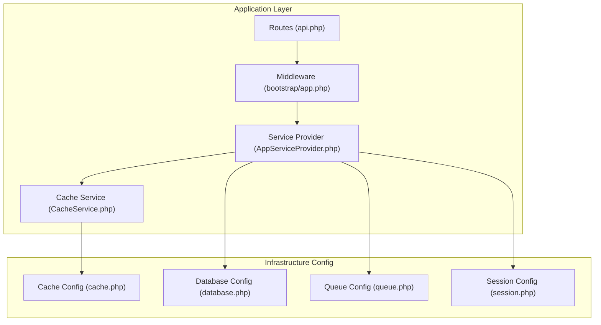
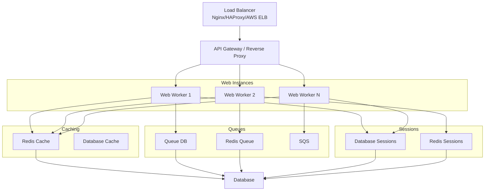
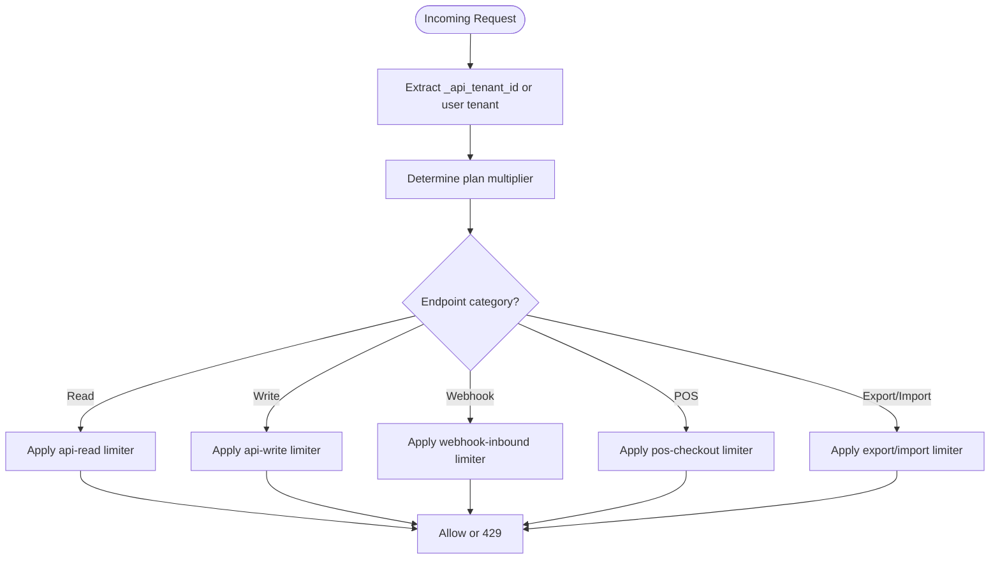
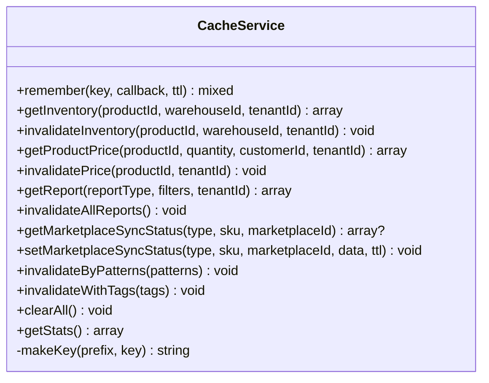
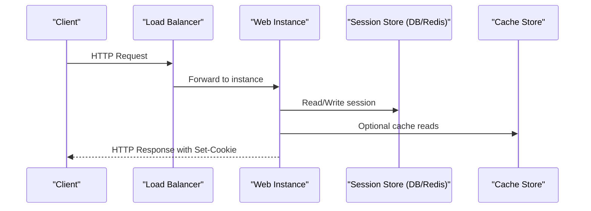
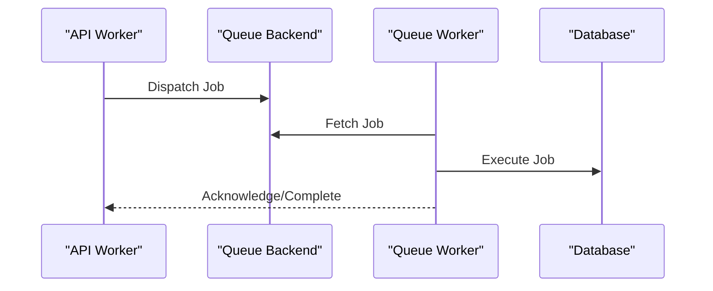
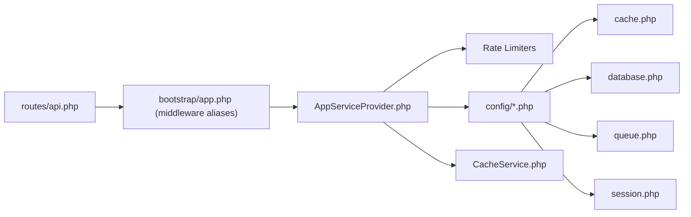

# Scaling & Load Balancing

<cite>
**Referenced Files in This Document**
- [app.php](file://bootstrap/app.php)
- [AppServiceProvider.php](file://app/Providers/AppServiceProvider.php)
- [api.php](file://routes/api.php)
- [cache.php](file://config/cache.php)
- [database.php](file://config/database.php)
- [queue.php](file://config/queue.php)
- [session.php](file://config/session.php)
- [composer.json](file://composer.json)
- [CacheService.php](file://app/Services/CacheService.php)
- [SessionManagementService.php](file://app/Services/Security/SessionManagementService.php)
- [index.html](file://public/api-docs/index.html)
</cite>

## Table of Contents
1. [Introduction](#introduction)
2. [Project Structure](#project-structure)
3. [Core Components](#core-components)
4. [Architecture Overview](#architecture-overview)
5. [Detailed Component Analysis](#detailed-component-analysis)
6. [Dependency Analysis](#dependency-analysis)
7. [Performance Considerations](#performance-considerations)
8. [Troubleshooting Guide](#troubleshooting-guide)
9. [Conclusion](#conclusion)
10. [Appendices](#appendices)

## Introduction
This document provides comprehensive guidance for scaling and load balancing Qalcuity ERP. It covers horizontal and vertical scaling strategies, auto-scaling configuration, capacity planning methodologies, load balancer setup (Nginx, HAProxy, AWS ELB), session management across instances, database connection pooling, queue worker scaling, background job distribution, distributed caching strategies, microservices architecture considerations, API gateway setup, and CDN configuration. It also includes performance benchmarking guidelines, capacity planning formulas, and scaling decision matrices tailored to different business scenarios.

## Project Structure
Qalcuity ERP is a Laravel application with modular services and a strong separation of concerns. Key areas relevant to scaling and load balancing include:
- Routing and middleware pipeline for rate limiting and tenant isolation
- Configuration for cache, database, queue, and session drivers
- Service providers for rate limiting and system settings injection
- Composer scripts for development and local queue listening
- Dedicated cache service for intelligent cache management

**Diagram sources**
- [api.php:1-437](file://routes/api.php#L1-L437)
- [app.php:18-55](file://bootstrap/app.php#L18-L55)
- [AppServiceProvider.php:26-75](file://app/Providers/AppServiceProvider.php#L26-L75)
- [CacheService.php:14-275](file://app/Services/CacheService.php#L14-L275)
- [cache.php:5-131](file://config/cache.php#L5-L131)
- [database.php:6-185](file://config/database.php#L6-L185)
- [queue.php:3-130](file://config/queue.php#L3-L130)
- [session.php:5-234](file://config/session.php#L5-L234)

**Section sources**
- [api.php:1-437](file://routes/api.php#L1-L437)
- [app.php:18-55](file://bootstrap/app.php#L18-L55)
- [AppServiceProvider.php:26-75](file://app/Providers/AppServiceProvider.php#L26-L75)
- [CacheService.php:14-275](file://app/Services/CacheService.php#L14-L275)
- [cache.php:5-131](file://config/cache.php#L5-L131)
- [database.php:6-185](file://config/database.php#L6-L185)
- [queue.php:3-130](file://config/queue.php#L3-L130)
- [session.php:5-234](file://config/session.php#L5-L234)

## Core Components
- Rate limiting and tenant-aware API limits are configured centrally in the service provider and enforced via middleware applied to API routes.
- Cache, database, queue, and session configurations define the runtime drivers and tunables for horizontal scalability.
- A dedicated cache service centralizes cache key management, TTL policies, and invalidation strategies.
- Composer scripts enable local development with queue workers and monitoring.

Key implementation references:
- Rate limiting and plan-based multipliers: [AppServiceProvider.php:142-245](file://app/Providers/AppServiceProvider.php#L142-L245)
- API route groups with rate-limit middleware: [api.php:28-50](file://routes/api.php#L28-L50)
- Cache configuration and stores: [cache.php:5-131](file://config/cache.php#L5-L131)
- Database and Redis configuration: [database.php:6-185](file://config/database.php#L6-L185)
- Queue configuration and drivers: [queue.php:3-130](file://config/queue.php#L3-L130)
- Session configuration and drivers: [session.php:5-234](file://config/session.php#L5-L234)
- Local queue worker script: [composer.json:58-58](file://composer.json#L58-L58)

**Section sources**
- [AppServiceProvider.php:142-245](file://app/Providers/AppServiceProvider.php#L142-L245)
- [api.php:28-50](file://routes/api.php#L28-L50)
- [cache.php:5-131](file://config/cache.php#L5-L131)
- [database.php:6-185](file://config/database.php#L6-L185)
- [queue.php:3-130](file://config/queue.php#L3-L130)
- [session.php:5-234](file://config/session.php#L5-L234)
- [composer.json:58-58](file://composer.json#L58-L58)

## Architecture Overview
Qalcuity ERP’s runtime architecture for scaling integrates:
- API gateway-like routing with tenant-aware rate limits
- Distributed caching via Redis or database-backed stores
- Background job processing through queue backends (database, Redis, SQS)
- Centralized session storage for multi-instance deployments
- Tenant isolation middleware ensuring per-tenant resource boundaries

[No sources needed since this diagram shows conceptual workflow, not actual code structure]

## Detailed Component Analysis

### Rate Limiting and Capacity Planning
- Plan-based multipliers scale API limits per tenant plan.
- Separate read/write limits apply to different endpoint categories.
- Webhook and export/import endpoints have dedicated limits.
- Middleware enforces limits per tenant or IP fallback.

**Diagram sources**
- [AppServiceProvider.php:142-245](file://app/Providers/AppServiceProvider.php#L142-L245)
- [api.php:30-50](file://routes/api.php#L30-L50)

**Section sources**
- [AppServiceProvider.php:142-245](file://app/Providers/AppServiceProvider.php#L142-L245)
- [api.php:30-50](file://routes/api.php#L30-L50)

### Cache Strategy and Invalidation
- Centralized cache service provides domain-specific prefixes, TTLs, and invalidation patterns.
- Supports Redis and database cache backends; pattern-based invalidation optimized for Redis.
- Tenant-scoped keys ensure isolation across multi-tenant deployments.

**Diagram sources**
- [CacheService.php:14-275](file://app/Services/CacheService.php#L14-L275)

**Section sources**
- [CacheService.php:14-275](file://app/Services/CacheService.php#L14-L275)
- [cache.php:5-131](file://config/cache.php#L5-L131)

### Session Management Across Instances
- Sessions can be persisted to database or Redis for multi-instance deployments.
- Session cookie configuration supports secure, HTTP-only, and SameSite attributes.
- A dedicated session management service tracks device, IP, and location metadata.

**Diagram sources**
- [session.php:21-104](file://config/session.php#L21-L104)
- [SessionManagementService.php:13-41](file://app/Services/Security/SessionManagementService.php#L13-L41)

**Section sources**
- [session.php:21-104](file://config/session.php#L21-L104)
- [SessionManagementService.php:13-41](file://app/Services/Security/SessionManagementService.php#L13-L41)

### Queue Workers and Background Jobs
- Queue backends include database, Redis, Beanstalkd, and SQS.
- Retry and block settings are configurable per driver.
- Composer scripts demonstrate local queue listening for development.

**Diagram sources**
- [queue.php:32-92](file://config/queue.php#L32-L92)
- [composer.json:58-58](file://composer.json#L58-L58)

**Section sources**
- [queue.php:32-92](file://config/queue.php#L32-L92)
- [composer.json:58-58](file://composer.json#L58-L58)

### Database Connection Pooling and Tuning
- Database configuration supports SQLite, MySQL/MariaDB, PostgreSQL, and SQL Server.
- Redis client options include cluster, prefix, persistence, and retry/backoff settings.
- Recommended pooling strategies:
  - Use persistent connections for Redis where supported.
  - Configure connection timeouts and retries aligned with queue retry settings.
  - Use separate Redis databases for cache vs queues.

**Section sources**
- [database.php:33-182](file://config/database.php#L33-L182)

### Load Balancer Setup (Nginx, HAProxy, AWS ELB)
- Place a reverse proxy (Nginx/HAProxy) or AWS ELB in front of web instances.
- Enable sticky sessions only if required; otherwise rely on shared session storage (DB/Redis).
- Terminate TLS at the load balancer and forward to web instances over HTTP.
- Configure health checks against the health endpoint exposed by the framework.

[No sources needed since this section provides general guidance]

### Microservices and API Gateway Considerations
- Current monolith routes are organized by module under a single API surface.
- For future microservices, adopt an API gateway (e.g., Kong, AWS API Gateway) to:
  - Enforce rate limits per service
  - Manage authentication and authorization
  - Aggregate responses and handle retries
- Keep tenant isolation middleware per service boundary.

[No sources needed since this section provides general guidance]

### CDN Configuration
- Serve static assets (JS/CSS/images) via CDN to reduce origin load.
- Use cache headers aligned with cache service TTLs.
- Consider edge caching for frequently accessed reports and marketplace sync statuses.

[No sources needed since this section provides general guidance]

## Dependency Analysis
The application’s scaling-relevant dependencies center around configuration-driven drivers and service provider orchestration.

**Diagram sources**
- [api.php:1-437](file://routes/api.php#L1-L437)
- [app.php:18-55](file://bootstrap/app.php#L18-L55)
- [AppServiceProvider.php:26-75](file://app/Providers/AppServiceProvider.php#L26-L75)
- [cache.php:5-131](file://config/cache.php#L5-L131)
- [database.php:6-185](file://config/database.php#L6-L185)
- [queue.php:3-130](file://config/queue.php#L3-L130)
- [session.php:5-234](file://config/session.php#L5-L234)
- [CacheService.php:14-275](file://app/Services/CacheService.php#L14-L275)

**Section sources**
- [api.php:1-437](file://routes/api.php#L1-L437)
- [app.php:18-55](file://bootstrap/app.php#L18-L55)
- [AppServiceProvider.php:26-75](file://app/Providers/AppServiceProvider.php#L26-L75)
- [cache.php:5-131](file://config/cache.php#L5-L131)
- [database.php:6-185](file://config/database.php#L6-L185)
- [queue.php:3-130](file://config/queue.php#L3-L130)
- [session.php:5-234](file://config/session.php#L5-L234)
- [CacheService.php:14-275](file://app/Services/CacheService.php#L14-L275)

## Performance Considerations
- Prefer Redis for cache and queues in production for lower latency and better throughput.
- Tune queue retry_after and backoff parameters to balance reliability and latency.
- Use database-backed cache for environments without Redis; monitor lock contention.
- Align session store with chosen cache/DB strategy for multi-instance deployments.
- Monitor cache hit rates and adjust TTLs based on data volatility.

[No sources needed since this section provides general guidance]

## Troubleshooting Guide
Common scaling issues and remedies:
- Rate limit exceeded: Verify plan-based multipliers and endpoint categorization.
- Session inconsistencies across instances: Ensure shared session store (DB/Redis) is reachable and configured consistently.
- Queue backlog: Increase worker count, tune retry settings, and consider SQS for high throughput.
- Cache misses: Review cache key prefixes and TTLs; leverage invalidation patterns for Redis.

**Section sources**
- [AppServiceProvider.php:142-245](file://app/Providers/AppServiceProvider.php#L142-L245)
- [session.php:21-104](file://config/session.php#L21-L104)
- [queue.php:32-92](file://config/queue.php#L32-L92)
- [cache.php:5-131](file://config/cache.php#L5-L131)

## Conclusion
Qalcuity ERP’s configuration and service layer provide a solid foundation for scalable deployments. By leveraging Redis-backed cache and queues, shared session storage, tenant-aware rate limiting, and a reverse proxy fronting multiple web instances, the system can achieve predictable horizontal growth. Adopting an API gateway and CDN further enhances performance and operational control for enterprise-scale usage.

[No sources needed since this section summarizes without analyzing specific files]

## Appendices

### Capacity Planning Formulas
- Target RPS per instance = (Throughput per tenant) × (Tenant multiplier) × (Instance availability factor)
- Required instances = Total peak RPS / (RPS per instance × Utilization threshold)
- Queue depth = (Jobs per minute) × (Queue retention minutes)
- Cache hit ratio target = 0.8–0.95 depending on data volatility

[No sources needed since this section provides general guidance]

### Scaling Decision Matrix
- Scenario: Small business (<100 users)
  - Strategy: Vertical scaling (single instance with Redis cache/queue)
  - Load Balancer: Optional; use local queue worker
- Scenario: Medium business (100–1000 users)
  - Strategy: Horizontal scaling (2–4 instances), Redis cache/queue, DB sessions
  - Load Balancer: Nginx/HAProxy with health checks
- Scenario: Enterprise (>1000 users)
  - Strategy: Auto-scaling groups, Redis cluster, SQS, CDN, API gateway
  - Load Balancer: AWS ELB with WAF and TLS termination

[No sources needed since this section provides general guidance]

### Benchmarking Guidelines
- Baseline metrics: P50/P95/P99 latency, RPS, error rate, cache hit ratio, queue lag
- Stress test with synthetic traffic simulating peak usage patterns
- Validate rate limits and tenant isolation under concurrent load
- Monitor CPU, memory, network, and Redis/DB utilization during tests

[No sources needed since this section provides general guidance]

### API Limits Reference
- Read endpoints: Base 60/min, scaled by plan multiplier
- Write endpoints: Base 20/min, scaled by plan multiplier
- Webhooks: 30/min per IP
- POS checkout: 60/min per user
- Export/Import: 10/min and 5/min respectively

**Section sources**
- [AppServiceProvider.php:157-209](file://app/Providers/AppServiceProvider.php#L157-L209)
- [index.html:612-639](file://public/api-docs/index.html#L612-L639)