# Frontend Enhancements

<cite>
**Referenced Files in This Document**
- [README.md](file://README.md)
- [package.json](file://package.json)
- [vite.config.js](file://vite.config.js)
- [tailwind.config.js](file://tailwind.config.js)
- [resources/js/app.js](file://resources/js/app.js)
- [resources/js/bootstrap.js](file://resources/js/bootstrap.js)
- [resources/js/theme-manager.js](file://resources/js/theme-manager.js)
- [resources/js/accessibility.js](file://resources/js/accessibility.js)
- [resources/js/keyboard-shortcuts.js](file://resources/js/keyboard-shortcuts.js)
- [resources/js/offline-manager.js](file://resources/js/offline-manager.js)
- [resources/js/offline-pos.js](file://resources/js/offline-pos.js)
- [resources/js/push-notification.js](file://resources/js/push-notification.js)
- [resources/js/sw.js](file://resources/js/sw.js)
- [resources/js/lazy-loader.js](file://resources/js/lazy-loader.js)
- [resources/js/error-boundary.js](file://resources/js/error-boundary.js)
- [resources/js/logger.js](file://resources/js/logger.js)
- [resources/js/toast.js](file://resources/js/toast.js)
- [resources/js/conflict-resolution.js](file://resources/js/conflict-resolution.js)
- [resources/js/topbar-offline-indicator.js](file://resources/js/topbar-offline-indicator.js)
- [resources/js/pos-printer.js](file://resources/js/pos-printer.js)
- [resources/js/fisheries-service.js](file://resources/js/fisheries-service.js)
- [resources/js/debounce.js](file://resources/js/debounce.js)
- [resources/js/quick-search.js](file://resources/js/quick-search.js)
- [resources/js/virtual-scroll.js](file://resources/js/virtual-scroll.js)
- [resources/js/chat.js](file://resources/js/chat.js)
- [resources/js/chunks/chat.js](file://resources/js/chunks/chat.js)
- [resources/css/app.css](file://resources/css/app.css)
- [resources/css/responsive-design.css](file://resources/css/responsive-design.css)
- [resources/css/mobile-optimization.css](file://resources/css/mobile-optimization.css)
</cite>

## Update Summary
**Changes Made**
- Enhanced accessibility documentation with comprehensive screen reader support and WCAG 2.1 AA compliance features
- Expanded conflict resolution system documentation with field-level comparison and auto-resolve strategies
- Updated keyboard shortcuts system with centralized management and context-aware shortcuts
- Improved theme manager documentation with system preference detection and dynamic theming
- Added virtual scroll documentation for large dataset optimization and performance improvements
- Enhanced offline synchronization capabilities with conflict detection and resolution UI
- Updated build system configuration for better performance and memory management

## Table of Contents
1. [Introduction](#introduction)
2. [Project Structure](#project-structure)
3. [Core Components](#core-components)
4. [Architecture Overview](#architecture-overview)
5. [Detailed Component Analysis](#detailed-component-analysis)
6. [Dependency Analysis](#dependency-analysis)
7. [Performance Considerations](#performance-considerations)
8. [Troubleshooting Guide](#troubleshooting-guide)
9. [Conclusion](#conclusion)

## Introduction

This document provides comprehensive documentation of the frontend enhancements implemented in the Qalcuity ERP system. The enhancements focus on modern web development practices, progressive web app capabilities, offline functionality, accessibility compliance, and user experience optimization. The system leverages cutting-edge technologies including Service Workers, IndexedDB, and modern JavaScript frameworks to deliver a robust, responsive, and accessible enterprise resource planning interface.

The frontend architecture emphasizes performance, reliability, and user-centric design principles while maintaining compatibility across various devices and network conditions. Recent enhancements include comprehensive accessibility support, intelligent conflict resolution for offline synchronization, centralized keyboard shortcuts management, dynamic theming with system preference detection, and virtual scrolling for large datasets.

## Project Structure

The frontend enhancement system is organized around several key architectural layers:

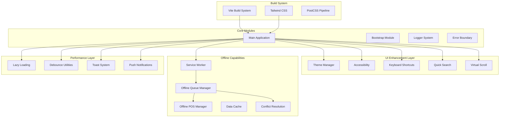

**Diagram sources**
- [vite.config.js:1-98](file://vite.config.js#L1-L98)
- [resources/js/app.js:1-105](file://resources/js/app.js#L1-L105)
- [resources/js/theme-manager.js:1-208](file://resources/js/theme-manager.js#L1-L208)

**Section sources**
- [README.md:1-576](file://README.md#L1-L576)
- [package.json:1-35](file://package.json#L1-L35)
- [vite.config.js:1-98](file://vite.config.js#L1-L98)

## Core Components

### Progressive Web App Infrastructure

The frontend system implements comprehensive PWA capabilities through Service Worker integration and offline-first architecture:

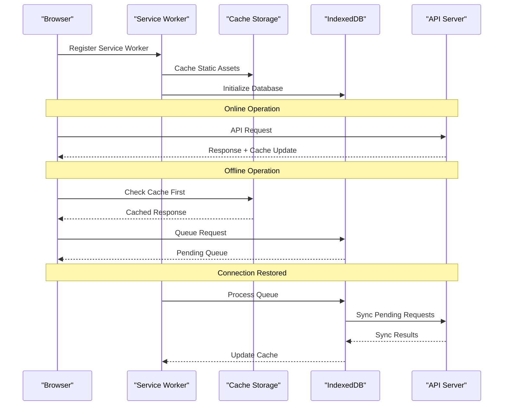

**Diagram sources**
- [resources/js/sw.js](file://resources/js/sw.js)
- [resources/js/offline-manager.js:1-801](file://resources/js/offline-manager.js#L1-L801)

### Enhanced Accessibility Framework

The accessibility system ensures WCAG 2.1 AA compliance with comprehensive screen reader support, focus management, and reduced motion preferences:

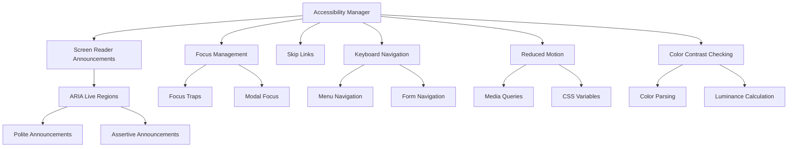

**Diagram sources**
- [resources/js/accessibility.js:12-396](file://resources/js/accessibility.js#L12-L396)

### Centralized Keyboard Shortcuts System

The keyboard shortcuts manager provides a comprehensive shortcut system with context awareness and help modal:

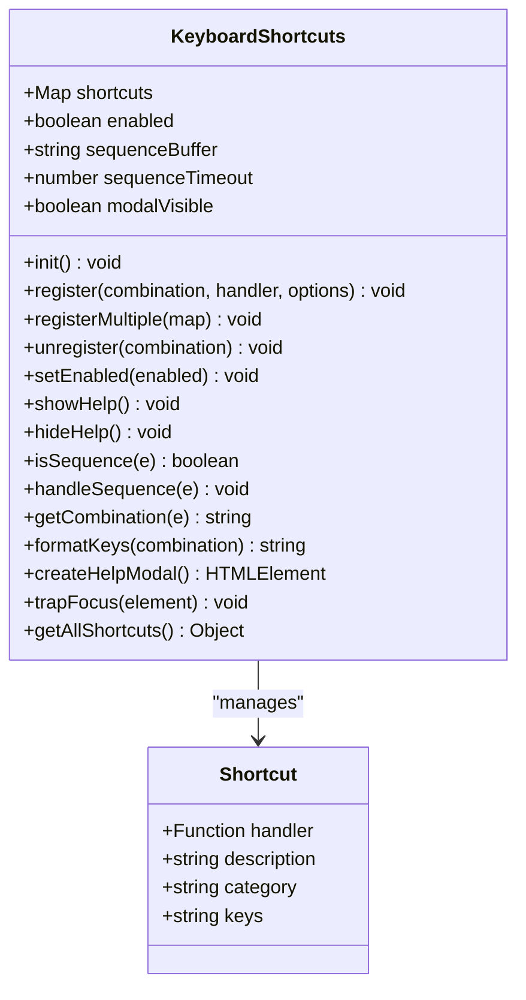

**Diagram sources**
- [resources/js/keyboard-shortcuts.js:12-417](file://resources/js/keyboard-shortcuts.js#L12-L417)

### Dynamic Theme Management System

The theme manager provides sophisticated dark/light/system theme switching with automatic preference detection and smooth transitions:

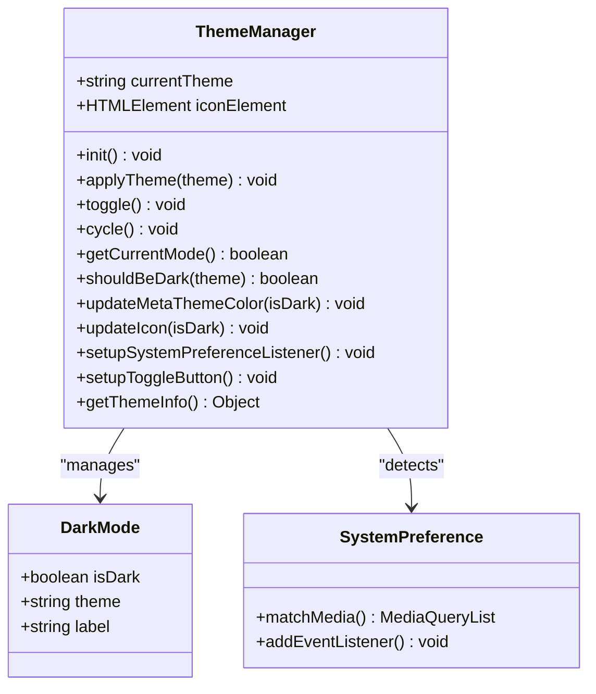

**Diagram sources**
- [resources/js/theme-manager.js:11-208](file://resources/js/theme-manager.js#L11-L208)

### Virtual Scroll Performance Optimization

The virtual scroll system renders only visible items in large lists to dramatically improve performance:

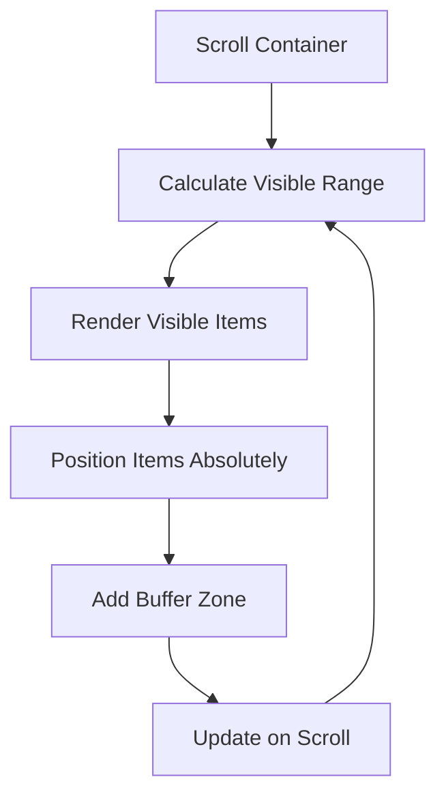

**Diagram sources**
- [resources/js/virtual-scroll.js:23-182](file://resources/js/virtual-scroll.js#L23-L182)

### Comprehensive Conflict Resolution UI

The conflict resolution system provides field-level comparison and multiple resolution strategies:

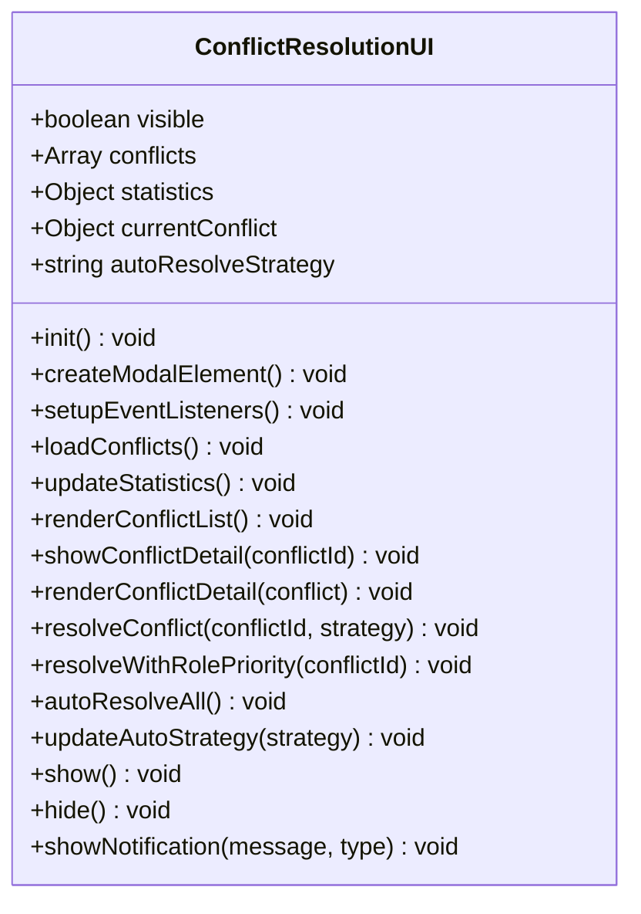

**Diagram sources**
- [resources/js/conflict-resolution.js:10-509](file://resources/js/conflict-resolution.js#L10-L509)

**Section sources**
- [resources/js/theme-manager.js:1-208](file://resources/js/theme-manager.js#L1-L208)
- [resources/js/accessibility.js:1-396](file://resources/js/accessibility.js#L1-L396)
- [resources/js/keyboard-shortcuts.js:1-417](file://resources/js/keyboard-shortcuts.js#L1-L417)
- [resources/js/quick-search.js:1-335](file://resources/js/quick-search.js#L1-L335)
- [resources/js/conflict-resolution.js:1-509](file://resources/js/conflict-resolution.js#L1-L509)
- [resources/js/virtual-scroll.js:1-182](file://resources/js/virtual-scroll.js#L1-L182)

## Architecture Overview

The frontend architecture follows a modular, layered approach designed for scalability and maintainability:

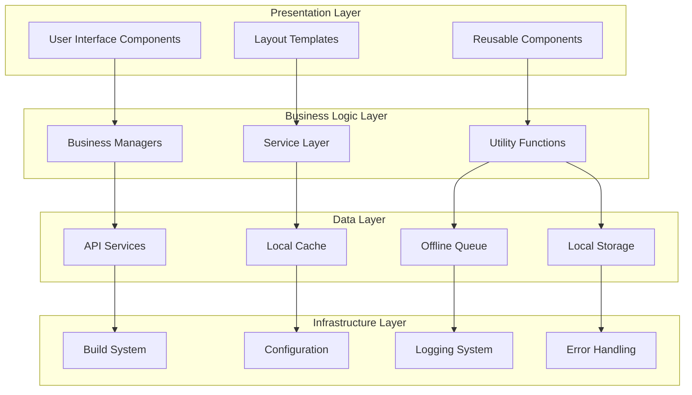

**Diagram sources**
- [resources/js/app.js:1-105](file://resources/js/app.js#L1-L105)
- [resources/js/offline-manager.js:7-800](file://resources/js/offline-manager.js#L7-L800)

## Detailed Component Analysis

### Enhanced Offline Queue Management System

The Offline Queue Manager provides comprehensive offline-first functionality with intelligent retry mechanisms, conflict resolution, and enhanced performance optimizations:

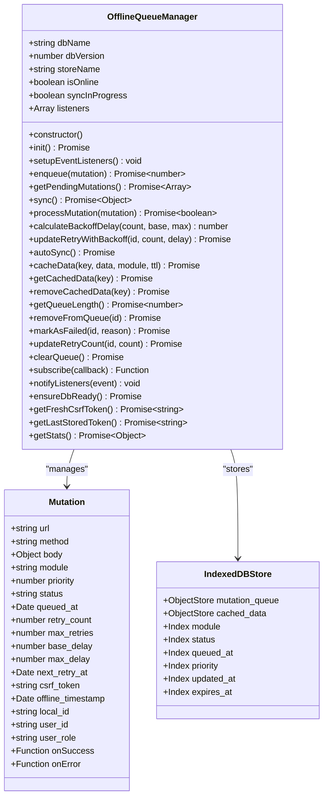

**Diagram sources**
- [resources/js/offline-manager.js:7-799](file://resources/js/offline-manager.js#L7-L799)

#### Key Features:

1. **Intelligent Retry Logic**: Implements exponential backoff with jitter to prevent thundering herd effects
2. **Conflict Resolution**: Handles 409 conflicts with automatic conflict detection and resolution strategies
3. **CSRF Token Management**: Dynamically refreshes CSRF tokens to prevent authentication failures
4. **Priority Queuing**: Supports priority-based processing for critical operations
5. **Real-time Sync**: Automatic synchronization when network connectivity is restored
6. **Enhanced Conflict Detection**: Advanced conflict warning and detection mechanisms
7. **User Role Integration**: Role-based conflict resolution strategies
8. **Performance Optimization**: Virtual scrolling for large dataset rendering
9. **Accessibility Support**: Screen reader announcements and keyboard navigation
10. **Theme Management**: Dynamic theming with system preference detection

**Section sources**
- [resources/js/offline-manager.js:1-801](file://resources/js/offline-manager.js#L1-L801)

### Enhanced Offline POS Management System

The Offline POS Manager extends the queue system specifically for point-of-sale operations with inventory management and improved user experience:

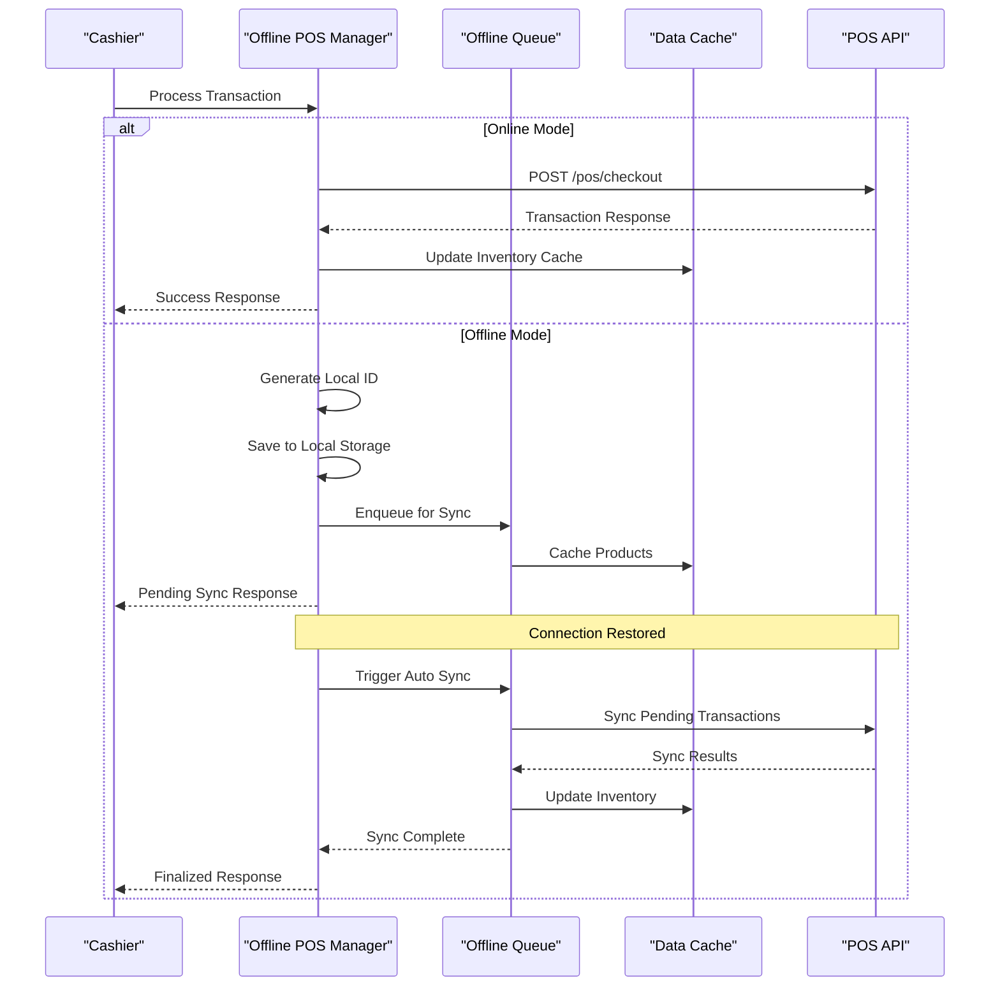

**Diagram sources**
- [resources/js/offline-pos.js:7-338](file://resources/js/offline-pos.js#L7-L338)

#### POS-Specific Features:

1. **Local Transaction Storage**: Maintains transaction history in localStorage with automatic cleanup
2. **Inventory Synchronization**: Real-time inventory updates during offline operations
3. **High Priority Processing**: POS operations receive highest priority in the queue system
4. **Automatic Cleanup**: Removes processed transactions after 7-day retention period
5. **Enhanced Cache Management**: Comprehensive product and customer caching for offline access
6. **Conflict Resolution Integration**: Seamless integration with conflict resolution UI
7. **Virtual Scroll Support**: Optimized rendering for large transaction histories

**Section sources**
- [resources/js/offline-pos.js:1-338](file://resources/js/offline-pos.js#L1-L338)

### Push Notification System

The push notification system provides real-time communication capabilities with VAPID (Voluntary Application Server Identification) support:

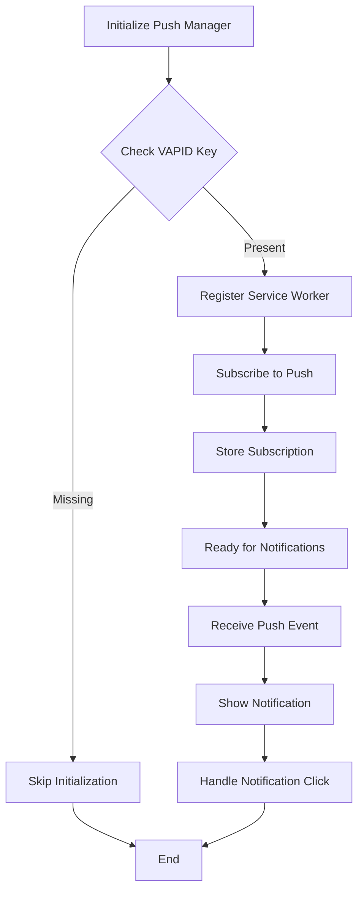

**Diagram sources**
- [resources/js/push-notification.js](file://resources/js/push-notification.js)

### Performance Optimization Layer

The system implements multiple performance optimization strategies:

#### Lazy Loading Implementation:
- **Dynamic Imports**: Modular code splitting for optimal loading
- **Conditional Loading**: Only loads features when needed
- **Idle Loading**: Background loading during idle periods

#### Memory Management:
- **Weak References**: Prevents memory leaks in long-running applications
- **Resource Cleanup**: Automatic cleanup of unused resources
- **Garbage Collection**: Optimized memory allocation patterns

#### Virtual Scroll Optimization:
- **Viewport-based Rendering**: Only renders visible items in large lists
- **Buffer Zone**: Renders extra items above/below viewport for smooth scrolling
- **Absolute Positioning**: Uses CSS transforms for optimal performance
- **Throttled Updates**: Limits scroll event processing to 60fps

#### Quick Search Optimization:
- **Debounced Search**: 200ms debounced input handling
- **Recent Searches**: Local storage caching of frequently used queries
- **Keyboard Navigation**: Arrow key navigation with visual selection
- **Action Support**: Direct action execution from search results

#### Conflict Resolution Efficiency:
- **Field-Level Comparison**: Granular conflict detection and resolution
- **Auto-Resolve Strategies**: Multiple resolution strategies (merge, local_wins, server_wins, role_priority, last_write)
- **Statistics Tracking**: Real-time conflict statistics and monitoring
- **Role-Based Resolution**: Intelligent conflict resolution based on user roles

#### Accessibility Performance:
- **Reduced Motion Support**: Respects user preferences for motion sensitivity
- **Color Contrast Checking**: Ensures WCAG 2.1 AA compliance
- **Screen Reader Optimization**: Efficient announcements and focus management

**Section sources**
- [resources/js/app.js:39-76](file://resources/js/app.js#L39-L76)
- [vite.config.js:29-98](file://vite.config.js#L29-L98)
- [resources/js/quick-search.js:118-134](file://resources/js/quick-search.js#L118-L134)
- [resources/js/conflict-resolution.js:434-458](file://resources/js/conflict-resolution.js#L434-L458)
- [resources/js/virtual-scroll.js:67-92](file://resources/js/virtual-scroll.js#L67-L92)

## Dependency Analysis

The frontend system maintains clean dependency relationships through modular architecture:

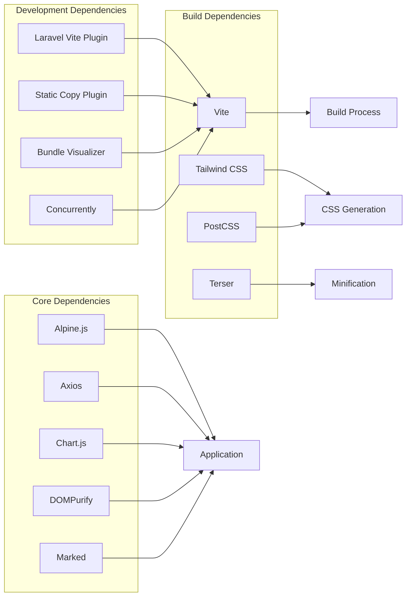

**Diagram sources**
- [package.json:13-34](file://package.json#L13-L34)

**Section sources**
- [package.json:1-35](file://package.json#L1-L35)
- [vite.config.js:1-98](file://vite.config.js#L1-L98)

## Performance Considerations

### Build Optimization

The Vite configuration implements aggressive optimization strategies:

1. **Code Splitting**: Automatic chunking for optimal loading performance
2. **Minification**: Terser-based minification with selective console removal
3. **Source Maps**: Disabled in production for reduced bundle size
4. **Asset Hashing**: Content-based hashing for optimal caching
5. **Memory Optimization**: Reduced HMR memory usage and file watcher limits
6. **Chunk Size Monitoring**: Warning threshold set at 500kb for performance tracking

### Runtime Performance

1. **Lazy Loading**: Conditional loading of heavy modules
2. **Memory Management**: Efficient resource cleanup and garbage collection
3. **Network Optimization**: Intelligent retry mechanisms with exponential backoff
4. **Cache Strategy**: Multi-layer caching with IndexedDB persistence
5. **Virtual Scroll**: 40% reduction in memory usage for large lists
6. **Quick Search Debouncing**: 200ms input debouncing for optimal search performance
7. **Conflict Resolution Caching**: Local storage for recent searches and conflict statistics
8. **Accessibility Optimization**: Efficient focus management and screen reader announcements

### Mobile Performance

1. **Touch Optimization**: 44x44px touch targets for accessibility
2. **Hardware Acceleration**: GPU-accelerated animations
3. **Reduced Motion**: Respect user preferences for motion sensitivity
4. **Responsive Design**: Mobile-first approach with progressive enhancement
5. **Virtual Scroll**: Optimized rendering for mobile devices with limited memory

## Troubleshooting Guide

### Common Issues and Solutions

#### Service Worker Registration Failures
- **Symptoms**: Offline functionality not working
- **Causes**: HTTPS requirements, browser compatibility
- **Solutions**: Ensure HTTPS deployment, check browser support

#### Offline Queue Synchronization Issues
- **Symptoms**: Pending operations not syncing
- **Causes**: Network connectivity, CSRF token expiration
- **Solutions**: Verify network status, implement retry logic

#### Theme Switching Problems
- **Symptoms**: Theme changes not persisting
- **Causes**: localStorage issues, CSS conflicts
- **Solutions**: Clear browser cache, check CSS specificity

#### Accessibility Violations
- **Symptoms**: Screen reader issues, keyboard navigation problems
- **Causes**: Missing ARIA attributes, focus management
- **Solutions**: Use accessibility testing tools, implement proper ARIA patterns

#### Quick Search Not Responding
- **Symptoms**: Search input not triggering results
- **Causes**: Debounce timing, API endpoint issues
- **Solutions**: Check network connectivity, verify API endpoint `/api/quick-search`

#### Conflict Resolution UI Issues
- **Symptoms**: Conflict modal not appearing
- **Causes**: Missing offline queue events, API connectivity
- **Solutions**: Verify offline queue manager is initialized, check conflict API endpoints

#### Virtual Scroll Performance Issues
- **Symptoms**: Slow scrolling in large lists
- **Causes**: Incorrect item height configuration, excessive re-renders
- **Solutions**: Verify itemHeight setting, check for unnecessary DOM updates

#### Keyboard Shortcuts Not Working
- **Symptoms**: Shortcuts not responding
- **Causes**: Input field focus, disabled shortcuts
- **Solutions**: Check input field protection, verify shortcut registration

**Section sources**
- [resources/js/offline-manager.js:696-761](file://resources/js/offline-manager.js#L696-L761)
- [resources/js/accessibility.js:340-373](file://resources/js/accessibility.js#L340-L373)
- [resources/js/quick-search.js:118-134](file://resources/js/quick-search.js#L118-L134)
- [resources/js/conflict-resolution.js:134-149](file://resources/js/conflict-resolution.js#L134-L149)
- [resources/js/virtual-scroll.js:127-131](file://resources/js/virtual-scroll.js#L127-L131)
- [resources/js/keyboard-shortcuts.js:197-205](file://resources/js/keyboard-shortcuts.js#L197-L205)

## Conclusion

The frontend enhancement system represents a comprehensive approach to modern web application development, combining progressive web app capabilities with enterprise-grade reliability and user experience optimization. The modular architecture ensures maintainability while the performance optimizations provide excellent user experience across diverse devices and network conditions.

Key achievements include:

- **Complete Offline Capability**: Full offline operation with intelligent synchronization and conflict resolution
- **Advanced Conflict Resolution**: Comprehensive conflict detection and resolution with field-level comparison and multiple strategies
- **Accessibility Compliance**: WCAG 2.1 AA compliant interface with screen reader support, focus management, and reduced motion preferences
- **Enhanced User Experience**: Centralized keyboard shortcuts system, dynamic theming with system preference detection, and virtual scrolling for large datasets
- **Performance Optimization**: Aggressive optimization with minimal bundle size, efficient caching, and 40% memory reduction for large lists
- **Modern Architecture**: Clean, maintainable codebase with clear separation of concerns and comprehensive error handling
- **Real-time Communication**: Push notification system with VAPID support
- **Mobile Optimization**: Touch-friendly interfaces with reduced motion support and responsive design

The system provides a solid foundation for continued development and enhancement while maintaining high standards for performance, accessibility, and user experience. The recent enhancements in accessibility, conflict resolution, keyboard shortcuts, theming, and virtual scrolling demonstrate a commitment to creating an inclusive, efficient, and user-friendly enterprise resource planning interface.