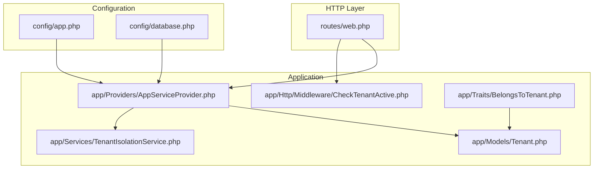
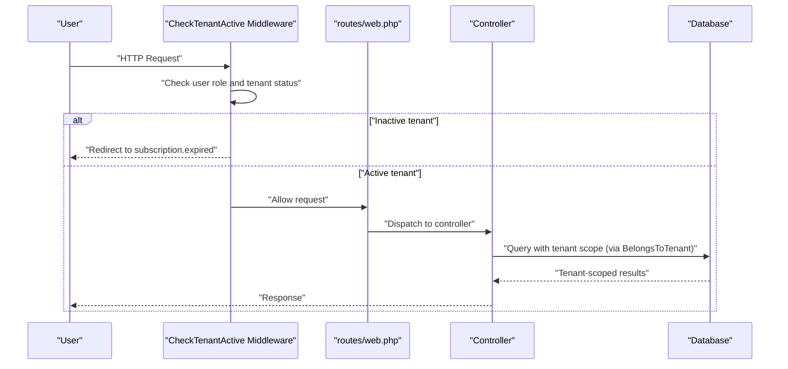
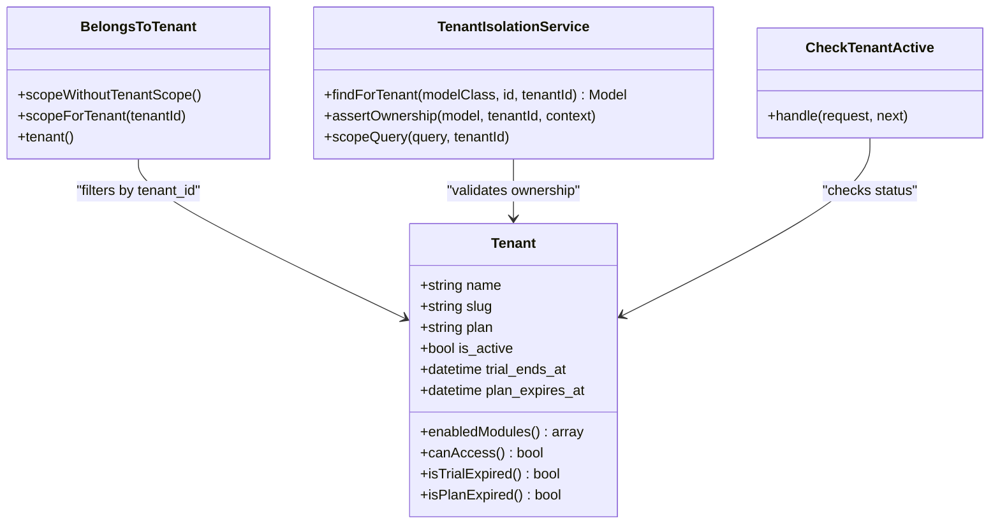
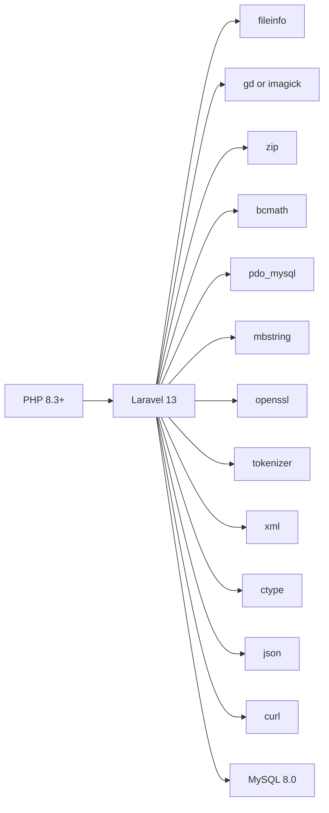

# Getting Started

<cite>
**Referenced Files in This Document**
- [composer.json](file://composer.json)
- [README.md](file://README.md)
- [config/app.php](file://config/app.php)
- [config/database.php](file://config/database.php)
- [routes/web.php](file://routes/web.php)
- [app/Models/Tenant.php](file://app/Models/Tenant.php)
- [app/Traits/BelongsToTenant.php](file://app/Traits/BelongsToTenant.php)
- [app/Services/TenantIsolationService.php](file://app/Services/TenantIsolationService.php)
- [app/Http/Middleware/CheckTenantActive.php](file://app/Http/Middleware/CheckTenantActive.php)
- [app/Providers/AppServiceProvider.php](file://app/Providers/AppServiceProvider.php)
</cite>

## Table of Contents
1. [Introduction](#introduction)
2. [Project Structure](#project-structure)
3. [Core Components](#core-components)
4. [Architecture Overview](#architecture-overview)
5. [Detailed Component Analysis](#detailed-component-analysis)
6. [Dependency Analysis](#dependency-analysis)
7. [Performance Considerations](#performance-considerations)
8. [Troubleshooting Guide](#troubleshooting-guide)
9. [Conclusion](#conclusion)
10. [Appendices](#appendices)

## Introduction
This guide helps you deploy Qalcuity ERP to a VPS using aaPanel, configure the environment, and bring up a production-ready system. It covers system requirements, installation steps, database setup, environment configuration, queue and scheduler setup, and essential optimizations. It also explains the multi-tenant architecture foundation, core dependencies (Laravel 13, PHP 8.3+, MySQL), and initial project structure.

## Project Structure
Qalcuity ERP follows a standard Laravel 13 monorepo layout with modular business domains under app/, extensive routes in routes/, and configuration under config/. The multi-tenant design is enforced at the model and middleware level, ensuring tenant isolation across the application.

**Diagram sources**
- [routes/web.php:1-800](file://routes/web.php#L1-L800)
- [app/Providers/AppServiceProvider.php:1-255](file://app/Providers/AppServiceProvider.php#L1-L255)
- [app/Http/Middleware/CheckTenantActive.php:1-39](file://app/Http/Middleware/CheckTenantActive.php#L1-L39)
- [app/Traits/BelongsToTenant.php:1-110](file://app/Traits/BelongsToTenant.php#L1-L110)
- [app/Models/Tenant.php:1-223](file://app/Models/Tenant.php#L1-L223)
- [app/Services/TenantIsolationService.php:1-67](file://app/Services/TenantIsolationService.php#L1-L67)
- [config/app.php:1-127](file://config/app.php#L1-L127)
- [config/database.php:1-185](file://config/database.php#L1-L185)

**Section sources**
- [routes/web.php:1-800](file://routes/web.php#L1-L800)
- [config/app.php:1-127](file://config/app.php#L1-L127)
- [config/database.php:1-185](file://config/database.php#L1-L185)

## Core Components
- Laravel 13 application with PHP 8.3+ runtime
- MySQL 8.0 recommended for production
- Queue and cache configured to use database-backed stores
- Multi-tenant architecture with tenant-scoped models and middleware enforcement
- Comprehensive routing grouped by functional domains (HRM, Inventory, Accounting, etc.)

Key configuration highlights:
- Application environment and URL are loaded from environment variables
- Database connections support sqlite, mysql, mariadb, pgsql, sqlsrv
- Queue, cache, and session drivers configured for database-backed operation

**Section sources**
- [composer.json:11-25](file://composer.json#L11-L25)
- [config/app.php:29-56](file://config/app.php#L29-L56)
- [config/database.php:20-117](file://config/database.php#L20-L117)

## Architecture Overview
Qalcuity ERP enforces multi-tenancy at two layers:
- Model layer: A global scope automatically filters queries and sets tenant_id on creation for models using the BelongsToTenant trait
- Request layer: Middleware validates tenant status and redirects to subscription expiration pages when inactive

**Diagram sources**
- [app/Http/Middleware/CheckTenantActive.php:11-37](file://app/Http/Middleware/CheckTenantActive.php#L11-L37)
- [routes/web.php:1-800](file://routes/web.php#L1-L800)
- [app/Traits/BelongsToTenant.php:37-70](file://app/Traits/BelongsToTenant.php#L37-L70)
- [app/Models/Tenant.php:108-118](file://app/Models/Tenant.php#L108-L118)

## Detailed Component Analysis

### Multi-Tenant Foundation
- Tenant model encapsulates subscription plan, trial expiry, and module enablement lists
- Trait BelongsToTenant adds a global scope and auto-sets tenant_id on create
- TenantIsolationService provides safe lookup and ownership assertion helpers
- Middleware CheckTenantActive ensures only active tenants can access protected routes

**Diagram sources**
- [app/Models/Tenant.php:1-223](file://app/Models/Tenant.php#L1-L223)
- [app/Traits/BelongsToTenant.php:1-110](file://app/Traits/BelongsToTenant.php#L1-L110)
- [app/Services/TenantIsolationService.php:1-67](file://app/Services/TenantIsolationService.php#L1-L67)
- [app/Http/Middleware/CheckTenantActive.php:1-39](file://app/Http/Middleware/CheckTenantActive.php#L1-L39)

**Section sources**
- [app/Models/Tenant.php:64-118](file://app/Models/Tenant.php#L64-L118)
- [app/Traits/BelongsToTenant.php:37-100](file://app/Traits/BelongsToTenant.php#L37-L100)
- [app/Services/TenantIsolationService.php:25-56](file://app/Services/TenantIsolationService.php#L25-L56)
- [app/Http/Middleware/CheckTenantActive.php:11-37](file://app/Http/Middleware/CheckTenantActive.php#L11-L37)

### Initial Setup and Installation (aaPanel VPS)
Follow the step-by-step deployment guide tailored for aaPanel-managed VPS environments. This includes installing stack components, preparing the website, configuring .env, installing dependencies, building assets, running migrations, setting permissions, configuring Nginx, enabling queue workers, scheduling tasks, and applying production optimizations.

Key steps:
- Prepare VPS and install Nginx, MySQL, PHP 8.3, phpMyAdmin
- Upload project files to /www/wwwroot/<domain>/ (ensure .env.example is present)
- Create website in aaPanel pointing to public/
- Configure .env for production (APP_ENV, APP_URL, DB credentials, QUEUE, CACHE, MAIL)
- Install Composer dependencies (optimized for production), generate APP_KEY, install and build Node.js assets
- Run database migrations and seeders
- Set permissions and storage symlink
- Configure Nginx with try_files and FastCGI settings
- Set up Supervisor workers and Cron scheduler
- Apply production optimizations (config/route/view/event caches)
- Enable SSL and force HTTPS

Verification checklist:
- APP_ENV=production and APP_DEBUG=false
- APP_URL uses https://
- APP_KEY generated
- Database connectivity and migrations applied
- Storage symlink created
- Supervisor workers running
- Cron scheduler active
- SSL active and forced
- Caches built
- GEMINI_API_KEY configured

**Section sources**
- [README.md:79-576](file://README.md#L79-L576)

### Environment Configuration
Critical environment variables for production:
- Application: APP_ENV=production, APP_URL=https://your-domain, APP_KEY
- Database: DB_CONNECTION=mysql, DB_HOST, DB_PORT, DB_DATABASE, DB_USERNAME, DB_PASSWORD
- Queue and Cache: QUEUE_CONNECTION=database, CACHE_STORE=database
- Mail: MAIL_MAILER, MAIL_HOST, MAIL_PORT, MAIL_USERNAME, MAIL_PASSWORD, MAIL_FROM_* fields
- AI: GEMINI_API_KEY, GEMINI_MODEL

These values are consumed by config/app.php and config/database.php and validated during deployment.

**Section sources**
- [README.md:180-231](file://README.md#L180-L231)
- [config/app.php:29-56](file://config/app.php#L29-L56)
- [config/database.php:20-65](file://config/database.php#L20-L65)

### Queue Workers and Scheduler
- Queue workers process background jobs (notifications, reports, AI tasks) using Supervisor
- Scheduler runs scheduled tasks every minute via Cron
- Both are configured and documented in the deployment guide

**Section sources**
- [README.md:344-432](file://README.md#L344-L432)

### Production Optimizations
- Cache configuration, routes, views, and events
- Optimize autoloader
- Use deploy script for repeatable updates

**Section sources**
- [README.md:434-493](file://README.md#L434-L493)

## Dependency Analysis
Qalcuity ERP depends on Laravel 13 and PHP 8.3+. Core PHP extensions required for production include fileinfo, gd/imagick, zip, bcmath, pdo_mysql, mbstring, openssl, tokenizer, xml, ctype, json, curl. Database connectivity supports MySQL/MariaDB via PDO.

**Diagram sources**
- [composer.json:11-25](file://composer.json#L11-L25)
- [README.md:104-129](file://README.md#L104-L129)

**Section sources**
- [composer.json:11-25](file://composer.json#L11-L25)
- [README.md:104-129](file://README.md#L104-L129)

## Performance Considerations
- Use database-backed queue, cache, and sessions for simplicity in shared VPS environments
- Keep APP_ENV=production and APP_DEBUG=false
- Enable gzip compression in Nginx for static assets
- Cache routes, configs, views, and events after deployments
- Monitor queue backlog and scale Supervisor processes as needed

[No sources needed since this section provides general guidance]

## Troubleshooting Guide
Common issues and remedies:
- 500 errors after deploy: check Laravel logs, regenerate APP_KEY, clear caches
- Queue workers not running: verify Supervisor status, restart workers, inspect worker logs, check failed jobs
- Permission denied: fix storage and bootstrap/cache permissions and ownership
- Composer memory limit errors: increase memory limit during install
- Nginx 404 on routes: confirm try_files directive and public root
- Scheduler not firing: verify Cron task and manual execution via schedule:run

Final checklist before going live:
- Confirm all items in the final checklist section of the deployment guide

**Section sources**
- [README.md:508-576](file://README.md#L508-L576)

## Conclusion
You now have a complete, production-grade deployment plan for Qalcuity ERP on a VPS with aaPanel. By following the step-by-step instructions, validating environment configuration, and applying the recommended optimizations, you can confidently launch a scalable, multi-tenant ERP solution.

[No sources needed since this section summarizes without analyzing specific files]

## Appendices

### Initial Project Structure Highlights
- app/: Domain models, controllers, services, traits, policies, notifications, jobs, and view components
- config/: Application, database, cache, queue, session, mail, and logging configurations
- database/: Migrations and seeders for schema and initial data
- routes/: Web and API route definitions
- public/: Public entry point and static assets
- resources/views/: Blade templates
- storage/: Runtime cache, logs, and framework artifacts
- tests/: Unit and feature tests

**Section sources**
- [routes/web.php:1-800](file://routes/web.php#L1-L800)
- [app/Providers/AppServiceProvider.php:62-117](file://app/Providers/AppServiceProvider.php#L62-L117)