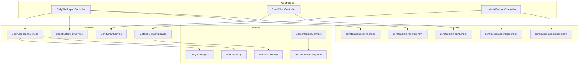
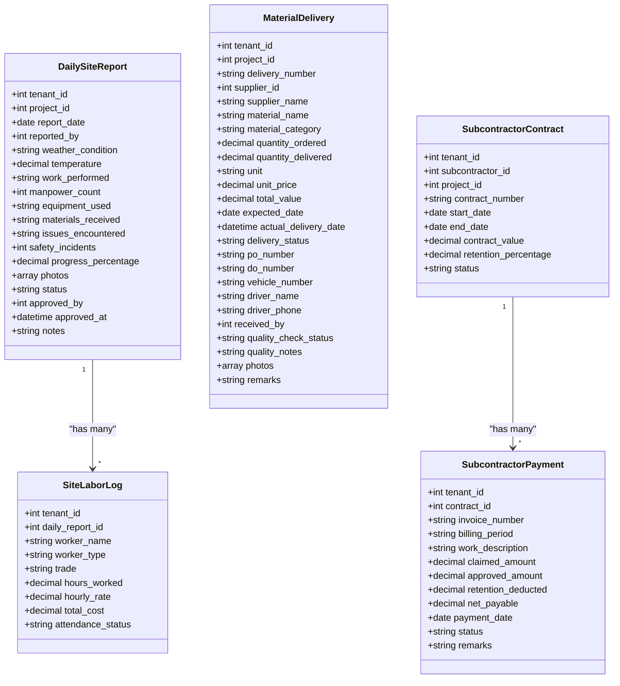
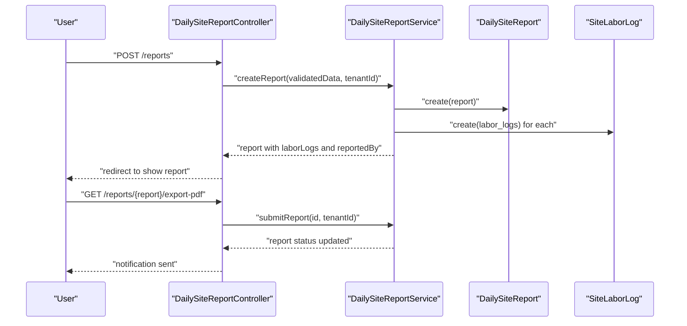
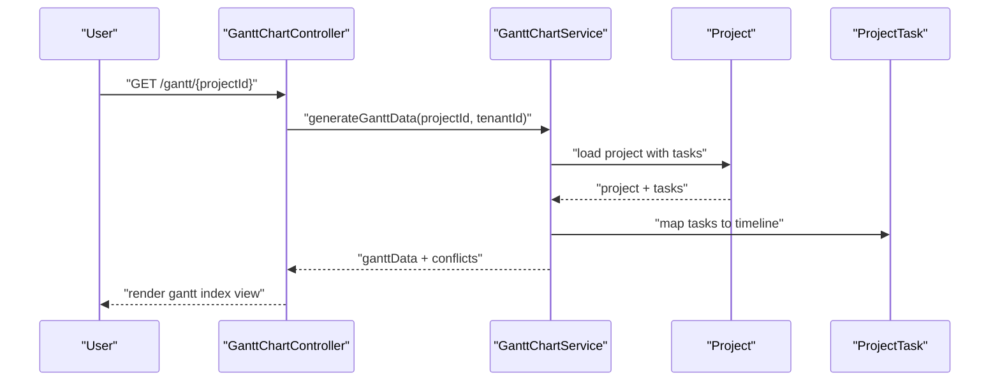
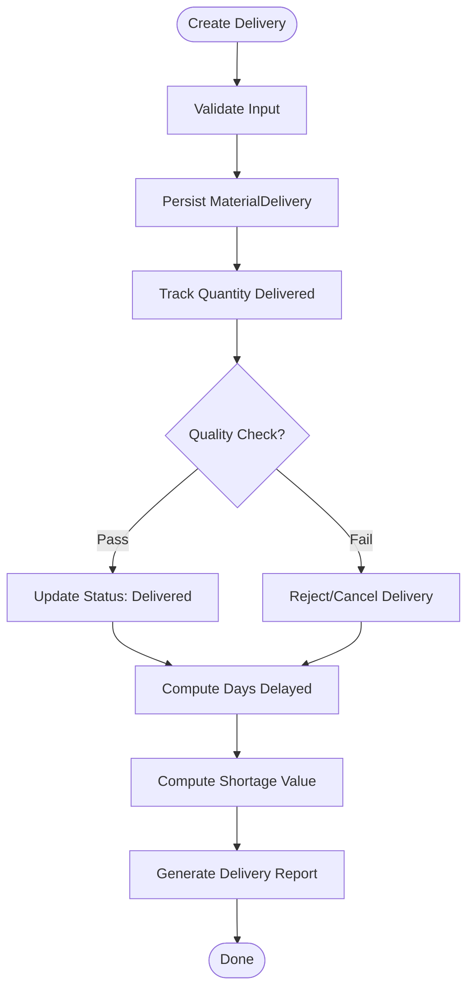
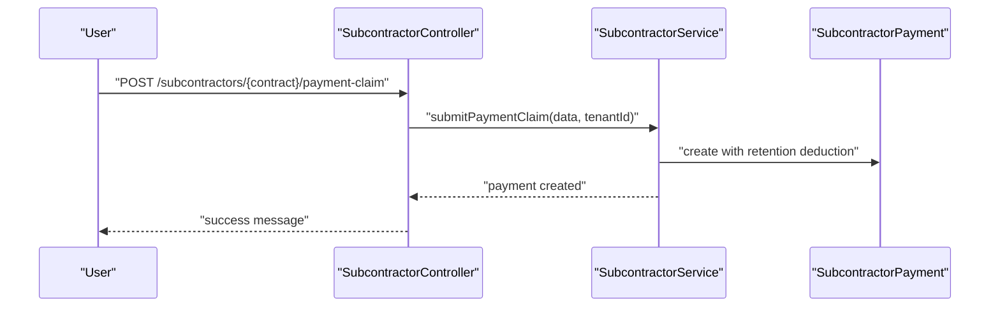
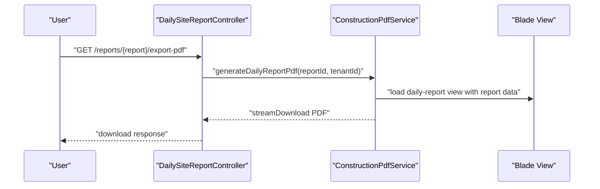
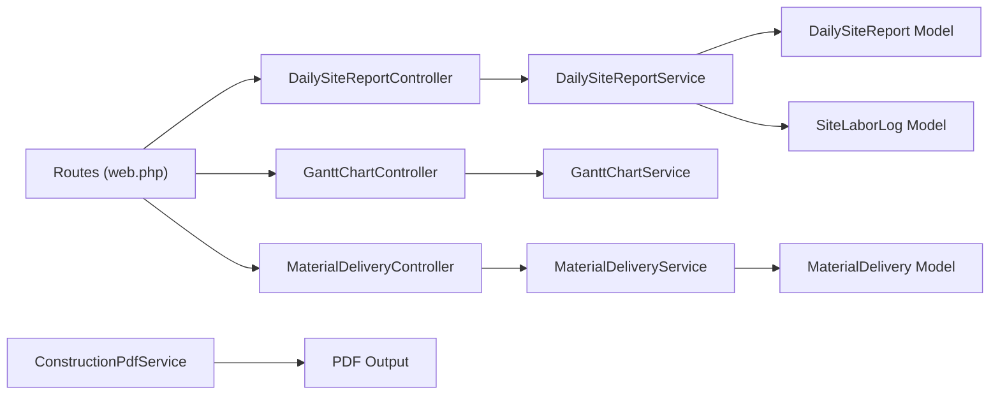

# Construction Analytics & Reporting

<cite>
**Referenced Files in This Document**
- [DailySiteReport.php](file://app/Models/DailySiteReport.php)
- [SiteLaborLog.php](file://app/Models/SiteLaborLog.php)
- [MaterialDelivery.php](file://app/Models/MaterialDelivery.php)
- [SubcontractorContract.php](file://app/Models/SubcontractorContract.php)
- [SubcontractorPayment.php](file://app/Models/SubcontractorPayment.php)
- [DailySiteReportService.php](file://app/Services/DailySiteReportService.php)
- [ConstructionPdfService.php](file://app/Services/ConstructionPdfService.php)
- [GanttChartService.php](file://app/Services/GanttChartService.php)
- [MaterialDeliveryService.php](file://app/Services/MaterialDeliveryService.php)
- [DailySiteReportController.php](file://app/Http/Controllers/Construction/DailySiteReportController.php)
- [GanttChartController.php](file://app/Http/Controllers/Construction/GanttChartController.php)
- [MaterialDeliveryController.php](file://app/Http/Controllers/Construction/MaterialDeliveryController.php)
- [2026_04_06_050001_create_daily_site_reports_table.php](file://database/migrations/2026_04_06_050001_create_daily_site_reports_table.php)
- [2026_04_06_050002_create_material_deliveries_table.php](file://database/migrations/2026_04_06_050002_create_material_deliveries_table.php)
- [2026_04_06_050000_create_subcontractor_tables.php](file://database/migrations/2026_04_06_050000_create_subcontractor_tables.php)
- [web.php](file://routes/web.php)
- [index.blade.php](file://resources/views/construction/reports/index.blade.php)
- [show.blade.php](file://resources/views/construction/reports/show.blade.php)
- [index.blade.php](file://resources/views/construction/gantt/index.blade.php)
- [index.blade.php](file://resources/views/construction/deliveries/index.blade.php)
- [show.blade.php](file://resources/views/construction/deliveries/show.blade.php)
</cite>

## Table of Contents
1. [Introduction](#introduction)
2. [Project Structure](#project-structure)
3. [Core Components](#core-components)
4. [Architecture Overview](#architecture-overview)
5. [Detailed Component Analysis](#detailed-component-analysis)
6. [Dependency Analysis](#dependency-analysis)
7. [Performance Considerations](#performance-considerations)
8. [Troubleshooting Guide](#troubleshooting-guide)
9. [Conclusion](#conclusion)

## Introduction
This document describes the Construction Analytics and Reporting subsystem within the platform. It focuses on how daily site reporting, labor analytics, material delivery tracking, subcontractor payment workflows, and project scheduling integrate to produce actionable insights. The system supports:
- Project performance metrics and productivity tracking
- Cost variance analysis via labor and material tracking
- Safety performance indicators through incident logging
- Quality metrics via delivery quality checks
- Automated report generation and PDF exports
- Customizable dashboards and trend analysis
- Executive reporting and compliance-ready summaries

## Project Structure
The Construction domain is organized around:
- Models representing core entities (daily site reports, labor logs, deliveries, subcontractor contracts/payments)
- Services encapsulating business logic for analytics, PDF generation, scheduling, and delivery tracking
- Controllers orchestrating requests, applying authorization, and delegating to services
- Blade views rendering dashboards, reports, and printable summaries
- Routes exposing endpoints for reporting, scheduling, and delivery workflows

**Diagram sources**
- [DailySiteReportController.php:1-176](file://app/Http/Controllers/Construction/DailySiteReportController.php#L1-L176)
- [GanttChartController.php:1-47](file://app/Http/Controllers/Construction/GanttChartController.php#L1-L47)
- [MaterialDeliveryController.php:1-190](file://app/Http/Controllers/Construction/MaterialDeliveryController.php#L1-L190)
- [DailySiteReportService.php:1-206](file://app/Services/DailySiteReportService.php#L1-L206)
- [GanttChartService.php:1-173](file://app/Services/GanttChartService.php#L1-L173)
- [MaterialDeliveryService.php:1-229](file://app/Services/MaterialDeliveryService.php#L1-L229)
- [ConstructionPdfService.php:1-94](file://app/Services/ConstructionPdfService.php#L1-L94)
- [DailySiteReport.php:1-97](file://app/Models/DailySiteReport.php#L1-L97)
- [SiteLaborLog.php:1-55](file://app/Models/SiteLaborLog.php#L1-L55)
- [MaterialDelivery.php:1-50](file://app/Models/MaterialDelivery.php#L1-L50)
- [SubcontractorContract.php:1-89](file://app/Models/SubcontractorContract.php#L1-L89)
- [SubcontractorPayment.php:1-51](file://app/Models/SubcontractorPayment.php#L1-L51)
- [index.blade.php](file://resources/views/construction/reports/index.blade.php)
- [show.blade.php](file://resources/views/construction/reports/show.blade.php)
- [index.blade.php](file://resources/views/construction/gantt/index.blade.php)
- [index.blade.php](file://resources/views/construction/deliveries/index.blade.php)
- [show.blade.php](file://resources/views/construction/deliveries/show.blade.php)

**Section sources**
- [DailySiteReportController.php:1-176](file://app/Http/Controllers/Construction/DailySiteReportController.php#L1-L176)
- [GanttChartController.php:1-47](file://app/Http/Controllers/Construction/GanttChartController.php#L1-L47)
- [MaterialDeliveryController.php:1-190](file://app/Http/Controllers/Construction/MaterialDeliveryController.php#L1-L190)
- [DailySiteReportService.php:1-206](file://app/Services/DailySiteReportService.php#L1-L206)
- [GanttChartService.php:1-173](file://app/Services/GanttChartService.php#L1-L173)
- [MaterialDeliveryService.php:1-229](file://app/Services/MaterialDeliveryService.php#L1-L229)
- [ConstructionPdfService.php:1-94](file://app/Services/ConstructionPdfService.php#L1-L94)
- [DailySiteReport.php:1-97](file://app/Models/DailySiteReport.php#L1-L97)
- [SiteLaborLog.php:1-55](file://app/Models/SiteLaborLog.php#L1-L55)
- [MaterialDelivery.php:1-50](file://app/Models/MaterialDelivery.php#L1-L50)
- [SubcontractorContract.php:1-89](file://app/Models/SubcontractorContract.php#L1-L89)
- [SubcontractorPayment.php:1-51](file://app/Models/SubcontractorPayment.php#L1-L51)
- [web.php:2328-2366](file://routes/web.php#L2328-L2366)

## Core Components
- Daily Site Report: Captures daily progress, manpower, weather, equipment, materials, issues, safety incidents, and photos. Supports submission/approval lifecycle and links to labor logs.
- Site Labor Log: Tracks worker hours, rates, costs, attendance, and trade classification for cost analysis.
- Material Delivery: Tracks supplier, material category, quantities ordered/delivered, unit price, delays, quality checks, and photos.
- Subcontractor Contract/Payment: Manages contract activation, progress billing, retention calculations, and payment approvals.
- Analytics Services:
  - DailySiteReportService: Summarizes progress, manpower, labor costs, and safety incidents; performs labor cost analysis by trade/type.
  - GanttChartService: Generates timeline, critical path, and conflict detection for project tasks.
  - MaterialDeliveryService: Computes delivery summaries, delay tracking, shortage valuation, and quality trends.
  - ConstructionPdfService: Produces PDFs for daily reports, project summaries, and contracts.
- Controllers: Orchestrate workflows, enforce authorization, and delegate to services and views.

**Section sources**
- [DailySiteReport.php:1-97](file://app/Models/DailySiteReport.php#L1-L97)
- [SiteLaborLog.php:1-55](file://app/Models/SiteLaborLog.php#L1-L55)
- [MaterialDelivery.php:1-50](file://app/Models/MaterialDelivery.php#L1-L50)
- [SubcontractorContract.php:1-89](file://app/Models/SubcontractorContract.php#L1-L89)
- [SubcontractorPayment.php:1-51](file://app/Models/SubcontractorPayment.php#L1-L51)
- [DailySiteReportService.php:1-206](file://app/Services/DailySiteReportService.php#L1-L206)
- [GanttChartService.php:1-173](file://app/Services/GanttChartService.php#L1-L173)
- [MaterialDeliveryService.php:1-229](file://app/Services/MaterialDeliveryService.php#L1-L229)
- [ConstructionPdfService.php:1-94](file://app/Services/ConstructionPdfService.php#L1-L94)
- [DailySiteReportController.php:1-176](file://app/Http/Controllers/Construction/DailySiteReportController.php#L1-L176)
- [GanttChartController.php:1-47](file://app/Http/Controllers/Construction/GanttChartController.php#L1-L47)
- [MaterialDeliveryController.php:1-190](file://app/Http/Controllers/Construction/MaterialDeliveryController.php#L1-L190)

## Architecture Overview
The system follows a layered architecture:
- Presentation Layer: Controllers and Blade views
- Application Layer: Services implementing analytics and workflows
- Domain Layer: Eloquent models with tenant scoping and relations
- Persistence Layer: Migrations define construction analytics and reporting tables

**Diagram sources**
- [DailySiteReport.php:1-97](file://app/Models/DailySiteReport.php#L1-L97)
- [SiteLaborLog.php:1-55](file://app/Models/SiteLaborLog.php#L1-L55)
- [MaterialDelivery.php:1-50](file://app/Models/MaterialDelivery.php#L1-L50)
- [SubcontractorContract.php:1-89](file://app/Models/SubcontractorContract.php#L1-L89)
- [SubcontractorPayment.php:1-51](file://app/Models/SubcontractorPayment.php#L1-L51)

## Detailed Component Analysis

### Daily Site Reporting and Labor Analytics
Daily Site Reports capture progress, safety, and workforce details. The service aggregates metrics and labor costs, enabling productivity and cost variance analysis.

**Diagram sources**
- [DailySiteReportController.php:79-102](file://app/Http/Controllers/Construction/DailySiteReportController.php#L79-L102)
- [DailySiteReportService.php:17-56](file://app/Services/DailySiteReportService.php#L17-L56)
- [DailySiteReport.php:1-97](file://app/Models/DailySiteReport.php#L1-L97)
- [SiteLaborLog.php:1-55](file://app/Models/SiteLaborLog.php#L1-L55)

Key capabilities:
- Reports summary: total reports, average progress, total manpower, total labor cost, safety incidents, weather distribution, recent reports.
- Labor cost analysis: total workers, hours, cost; breakdown by trade and worker type.
- PDF export: printable daily report with photos and approvals.

**Section sources**
- [DailySiteReportService.php:100-135](file://app/Services/DailySiteReportService.php#L100-L135)
- [DailySiteReportService.php:140-169](file://app/Services/DailySiteReportService.php#L140-L169)
- [ConstructionPdfService.php:16-36](file://app/Services/ConstructionPdfService.php#L16-L36)
- [DailySiteReportController.php:28-61](file://app/Http/Controllers/Construction/DailySiteReportController.php#L28-L61)
- [DailySiteReportController.php:169-174](file://app/Http/Controllers/Construction/DailySiteReportController.php#L169-L174)
- [2026_04_06_050001_create_daily_site_reports_table.php:29-56](file://database/migrations/2026_04_06_050001_create_daily_site_reports_table.php#L29-L56)

### Gantt Chart and Project Scheduling
The Gantt service generates timeline metrics, identifies critical path tasks, and detects scheduling conflicts to support trend analysis and predictive modeling of delays.

**Diagram sources**
- [GanttChartController.php:22-33](file://app/Http/Controllers/Construction/GanttChartController.php#L22-L33)
- [GanttChartService.php:17-57](file://app/Services/GanttChartService.php#L17-L57)
- [GanttChartService.php:107-123](file://app/Services/GanttChartService.php#L107-L123)
- [GanttChartService.php:128-162](file://app/Services/GanttChartService.php#L128-L162)

Highlights:
- Timeline summary: total days, elapsed, remaining, completion percentage, overdue flag.
- Critical path: top tasks by weight and due date.
- Conflict detection: adjacent task overlaps.

**Section sources**
- [GanttChartService.php:62-102](file://app/Services/GanttChartService.php#L62-L102)
- [GanttChartService.php:107-123](file://app/Services/GanttChartService.php#L107-L123)
- [GanttChartService.php:128-162](file://app/Services/GanttChartService.php#L128-L162)
- [GanttChartController.php:22-43](file://app/Http/Controllers/Construction/GanttChartController.php#L22-L43)
- [index.blade.php:1-93](file://resources/views/construction/gantt/index.blade.php#L1-L93)

### Material Delivery Tracking and Cost Variance
Material delivery records enable variance analysis between ordered and delivered quantities, delay tracking, and quality outcomes.

**Diagram sources**
- [MaterialDeliveryController.php:70-94](file://app/Http/Controllers/Construction/MaterialDeliveryController.php#L70-L94)
- [MaterialDeliveryService.php:16-47](file://app/Services/MaterialDeliveryService.php#L16-L47)
- [MaterialDeliveryService.php:198-208](file://app/Services/MaterialDeliveryService.php#L198-L208)
- [MaterialDeliveryService.php:213-229](file://app/Services/MaterialDeliveryService.php#L213-L229)

Capabilities:
- Delivery summary: counts, values, delays, statuses.
- Delayed deliveries report and shortage valuation.
- Quality check outcomes and photos.

**Section sources**
- [MaterialDeliveryService.php:16-47](file://app/Services/MaterialDeliveryService.php#L16-L47)
- [MaterialDeliveryService.php:198-208](file://app/Services/MaterialDeliveryService.php#L198-L208)
- [MaterialDeliveryService.php:213-229](file://app/Services/MaterialDeliveryService.php#L213-L229)
- [MaterialDeliveryController.php:23-52](file://app/Http/Controllers/Construction/MaterialDeliveryController.php#L23-L52)
- [MaterialDeliveryController.php:173-188](file://app/Http/Controllers/Construction/MaterialDeliveryController.php#L173-L188)
- [2026_04_06_050002_create_material_deliveries_table.php:13-47](file://database/migrations/2026_04_06_050002_create_material_deliveries_table.php#L13-L47)

### Subcontractor Contracts and Payments
Subcontractor workflows support progress billing, retention calculations, and payment approvals for cost variance tracking.

**Diagram sources**
- [MaterialDeliveryController.php:2353-2355](file://app/Http/Controllers/Construction/MaterialDeliveryController.php#L2353-L2355)
- [SubcontractorService.php:86-110](file://app/Services/SubcontractorService.php#L86-L110)

**Section sources**
- [SubcontractorService.php:86-110](file://app/Services/SubcontractorService.php#L86-L110)
- [SubcontractorContract.php:69-89](file://app/Models/SubcontractorContract.php#L69-L89)
- [SubcontractorPayment.php:1-51](file://app/Models/SubcontractorPayment.php#L1-L51)
- [2026_04_06_050000_create_subcontractor_tables.php:58-76](file://database/migrations/2026_04_06_050000_create_subcontractor_tables.php#L58-L76)

### Automated Report Generation and PDF Export
The system provides automated PDF generation for:
- Daily site reports
- Project summaries (including reports and deliveries)
- Subcontractor contracts

**Diagram sources**
- [DailySiteReportController.php:169-174](file://app/Http/Controllers/Construction/DailySiteReportController.php#L169-L174)
- [ConstructionPdfService.php:16-36](file://app/Services/ConstructionPdfService.php#L16-L36)

**Section sources**
- [ConstructionPdfService.php:16-36](file://app/Services/ConstructionPdfService.php#L16-L36)
- [ConstructionPdfService.php:64-92](file://app/Services/ConstructionPdfService.php#L64-L92)

### Real-Time Dashboards and Views
Dashboards aggregate KPIs and trends:
- Daily site reports dashboard: project selection, period filters, summary cards, recent reports, labor cost analysis.
- Gantt chart dashboard: timeline summary, milestones, conflicts, and export.
- Material deliveries dashboard: summary, recent entries, delayed and shortage reports.

**Section sources**
- [DailySiteReportController.php:28-61](file://app/Http/Controllers/Construction/DailySiteReportController.php#L28-L61)
- [index.blade.php](file://resources/views/construction/reports/index.blade.php)
- [index.blade.php:1-93](file://resources/views/construction/gantt/index.blade.php#L1-L93)
- [index.blade.php](file://resources/views/construction/deliveries/index.blade.php)

## Dependency Analysis
- Controllers depend on Services for business logic and on Models for persistence.
- Services encapsulate analytics computations and cross-entity aggregations.
- Views render aggregated data from Services and Models.
- Routes connect endpoints to Controllers.

**Diagram sources**
- [web.php:2328-2366](file://routes/web.php#L2328-L2366)
- [DailySiteReportController.php:1-176](file://app/Http/Controllers/Construction/DailySiteReportController.php#L1-L176)
- [GanttChartController.php:1-47](file://app/Http/Controllers/Construction/GanttChartController.php#L1-L47)
- [MaterialDeliveryController.php:1-190](file://app/Http/Controllers/Construction/MaterialDeliveryController.php#L1-L190)
- [DailySiteReportService.php:1-206](file://app/Services/DailySiteReportService.php#L1-L206)
- [GanttChartService.php:1-173](file://app/Services/GanttChartService.php#L1-L173)
- [MaterialDeliveryService.php:1-229](file://app/Services/MaterialDeliveryService.php#L1-L229)
- [ConstructionPdfService.php:1-94](file://app/Services/ConstructionPdfService.php#L1-L94)
- [DailySiteReport.php:1-97](file://app/Models/DailySiteReport.php#L1-L97)
- [SiteLaborLog.php:1-55](file://app/Models/SiteLaborLog.php#L1-L55)
- [MaterialDelivery.php:1-50](file://app/Models/MaterialDelivery.php#L1-L50)

**Section sources**
- [web.php:2328-2366](file://routes/web.php#L2328-L2366)
- [DailySiteReportController.php:1-176](file://app/Http/Controllers/Construction/DailySiteReportController.php#L1-L176)
- [GanttChartController.php:1-47](file://app/Http/Controllers/Construction/GanttChartController.php#L1-L47)
- [MaterialDeliveryController.php:1-190](file://app/Http/Controllers/Construction/MaterialDeliveryController.php#L1-L190)

## Performance Considerations
- Indexing: Reports and deliveries use composite indexes on tenant/project/date/status to accelerate filtering and aggregation.
- Aggregation efficiency: Services compute summaries and analyses in bulk using model queries to minimize N+1 queries.
- Pagination: Controllers paginate recent lists to avoid heavy loads on dashboard pages.
- PDF generation: Streamed downloads reduce memory overhead for large documents.

[No sources needed since this section provides general guidance]

## Troubleshooting Guide
Common issues and resolutions:
- Incomplete report submission: Ensure required fields (work performed, manpower count, progress percentage) are filled before submitting.
- Missing labor cost data: Verify labor logs are attached to the report; confirm worker type and trade classifications.
- Delivery quality failures: Review rejection reasons and reprocess with corrected quantities or photos.
- Gantt conflicts: Address overlapping tasks by adjusting due dates or splitting work packages.
- PDF generation errors: Confirm report exists and belongs to the current tenant; check storage permissions.

**Section sources**
- [DailySiteReportService.php:67-74](file://app/Services/DailySiteReportService.php#L67-L74)
- [MaterialDeliveryController.php:155-168](file://app/Http/Controllers/Construction/MaterialDeliveryController.php#L155-L168)
- [GanttChartService.php:144-154](file://app/Services/GanttChartService.php#L144-L154)

## Conclusion
The Construction Analytics and Reporting system integrates daily reporting, labor analytics, material delivery tracking, subcontractor payments, and scheduling to deliver comprehensive insights. It supports automated reporting, real-time dashboards, and executive summaries, enabling proactive decision-making and compliance-ready documentation.