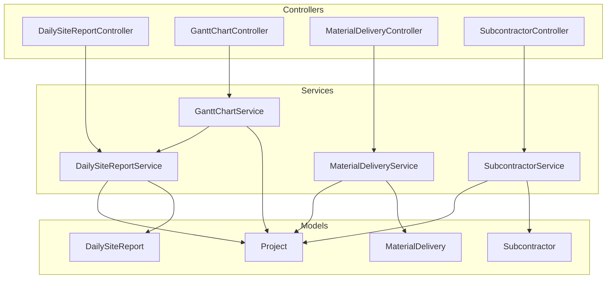
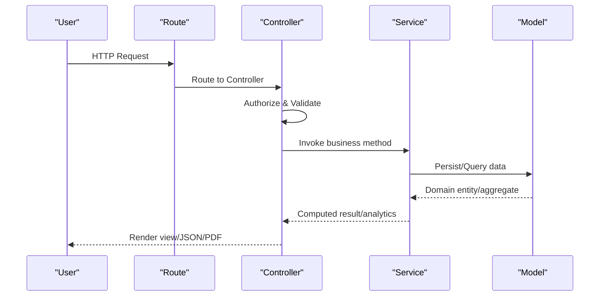
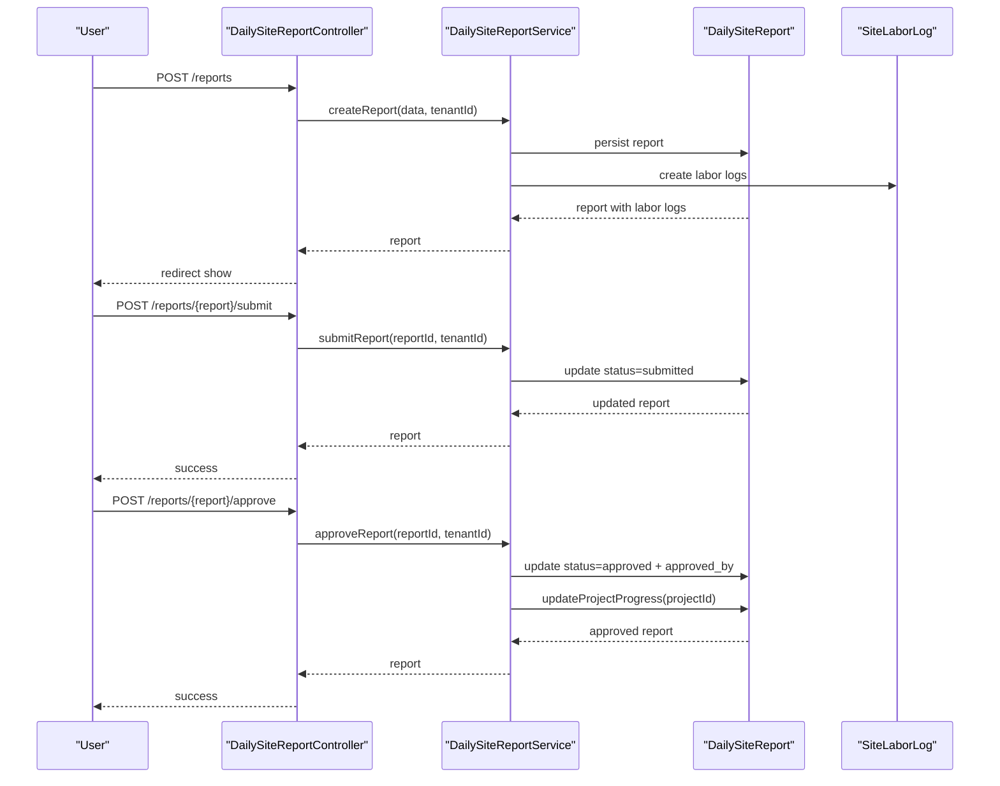
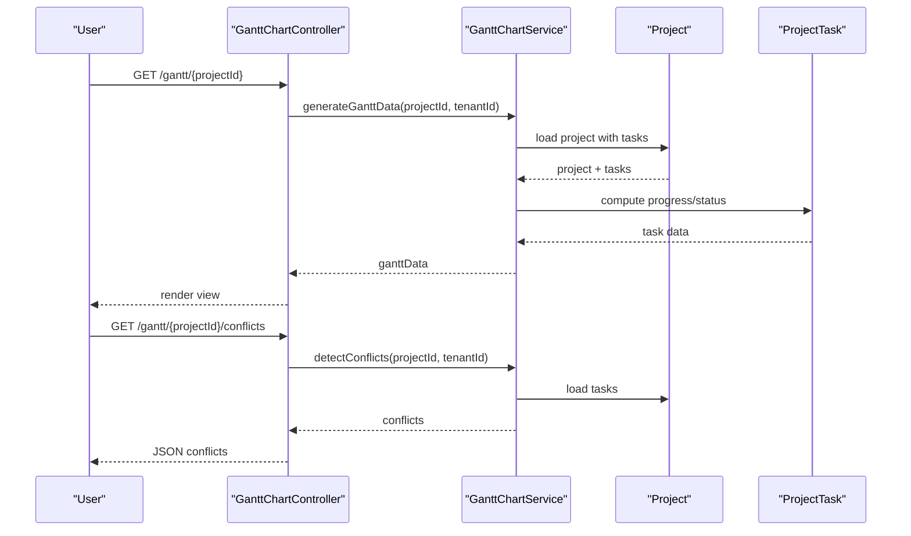
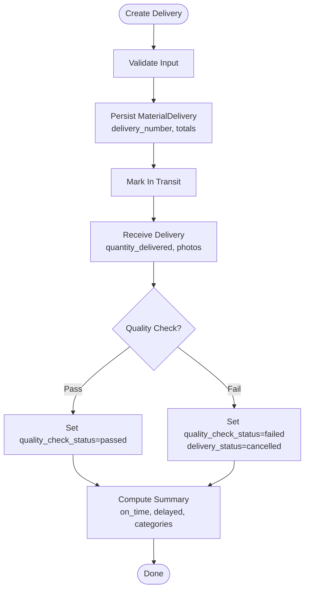
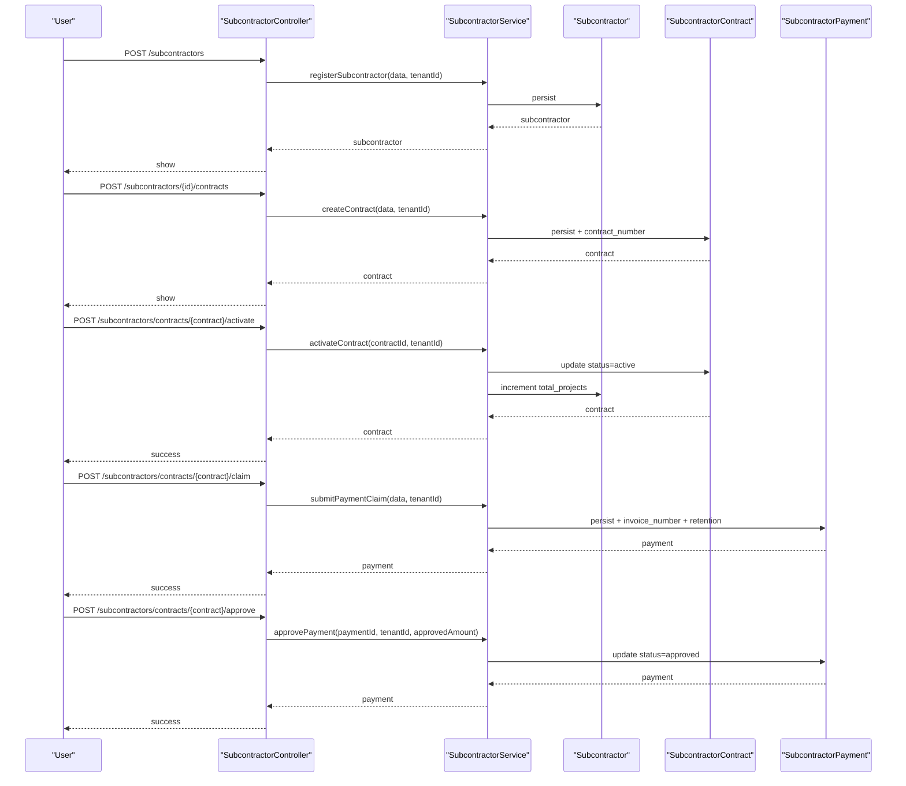
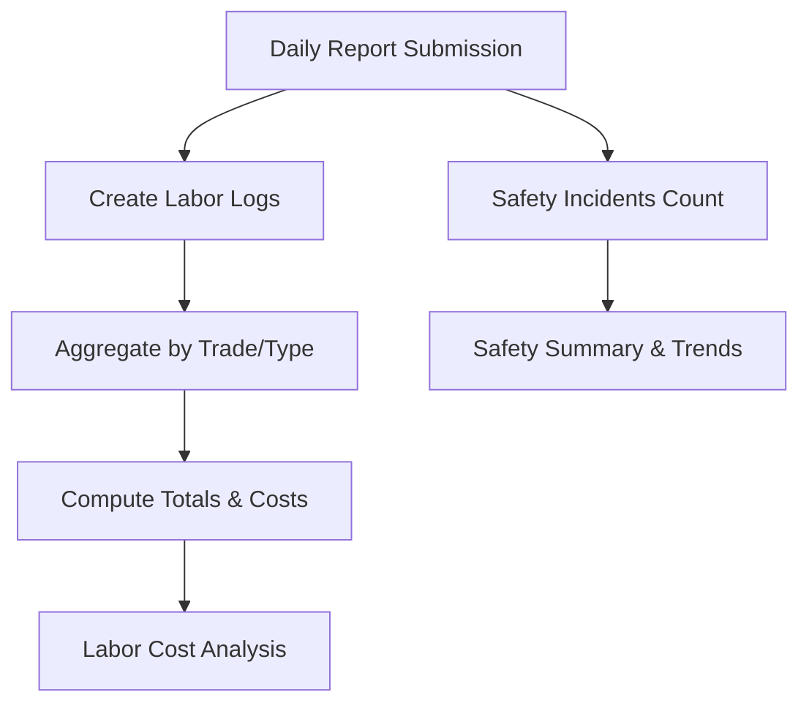
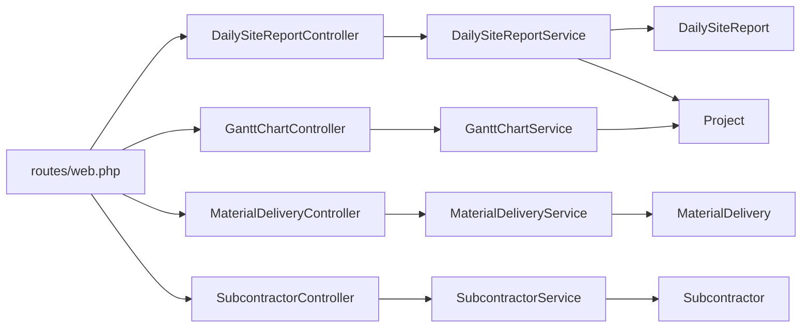

# Construction Management Module

<cite>
**Referenced Files in This Document**
- [DailySiteReportController.php](file://app/Http/Controllers/Construction/DailySiteReportController.php)
- [GanttChartController.php](file://app/Http/Controllers/Construction/GanttChartController.php)
- [MaterialDeliveryController.php](file://app/Http/Controllers/Construction/MaterialDeliveryController.php)
- [SubcontractorController.php](file://app/Http/Controllers/Construction/SubcontractorController.php)
- [DailySiteReportService.php](file://app/Services/DailySiteReportService.php)
- [GanttChartService.php](file://app/Services/GanttChartService.php)
- [MaterialDeliveryService.php](file://app/Services/MaterialDeliveryService.php)
- [SubcontractorService.php](file://app/Services/SubcontractorService.php)
- [DailySiteReport.php](file://app/Models/DailySiteReport.php)
- [MaterialDelivery.php](file://app/Models/MaterialDelivery.php)
- [Subcontractor.php](file://app/Models/Subcontractor.php)
- [Project.php](file://app/Models/Project.php)
- [web.php](file://routes/web.php)
</cite>

## Table of Contents
1. [Introduction](#introduction)
2. [Project Structure](#project-structure)
3. [Core Components](#core-components)
4. [Architecture Overview](#architecture-overview)
5. [Detailed Component Analysis](#detailed-component-analysis)
6. [Dependency Analysis](#dependency-analysis)
7. [Performance Considerations](#performance-considerations)
8. [Troubleshooting Guide](#troubleshooting-guide)
9. [Conclusion](#conclusion)

## Introduction
This document describes the Construction Management Module, focusing on daily site reporting, project scheduling with Gantt charts, material delivery tracking, subcontractor coordination and payments, workforce management, safety compliance monitoring, and construction analytics. It also covers project volume tracking, task management, resource allocation, quality control processes, construction-specific reporting requirements, mobile data collection capabilities, offline sync functionality, and construction document management workflows.

## Project Structure
The Construction Management Module is organized around four primary controllers that expose web endpoints and leverage dedicated services for business logic, with supporting models for persistence and domain entities.

**Diagram sources**
- [DailySiteReportController.php:14-176](file://app/Http/Controllers/Construction/DailySiteReportController.php#L14-L176)
- [GanttChartController.php:10-67](file://app/Http/Controllers/Construction/GanttChartController.php#L10-L67)
- [MaterialDeliveryController.php:11-190](file://app/Http/Controllers/Construction/MaterialDeliveryController.php#L11-L190)
- [SubcontractorController.php:12-174](file://app/Http/Controllers/Construction/SubcontractorController.php#L12-L174)
- [DailySiteReportService.php:12-206](file://app/Services/DailySiteReportService.php#L12-L206)
- [GanttChartService.php:12-173](file://app/Services/GanttChartService.php#L12-L173)
- [MaterialDeliveryService.php:11-254](file://app/Services/MaterialDeliveryService.php#L11-L254)
- [SubcontractorService.php:12-232](file://app/Services/SubcontractorService.php#L12-L232)
- [DailySiteReport.php:14-97](file://app/Models/DailySiteReport.php#L14-L97)
- [MaterialDelivery.php:13-121](file://app/Models/MaterialDelivery.php#L13-L121)
- [Subcontractor.php:14-79](file://app/Models/Subcontractor.php#L14-L79)
- [Project.php:11-82](file://app/Models/Project.php#L11-L82)

**Section sources**
- [DailySiteReportController.php:14-176](file://app/Http/Controllers/Construction/DailySiteReportController.php#L14-L176)
- [GanttChartController.php:10-67](file://app/Http/Controllers/Construction/GanttChartController.php#L10-L67)
- [MaterialDeliveryController.php:11-190](file://app/Http/Controllers/Construction/MaterialDeliveryController.php#L11-L190)
- [SubcontractorController.php:12-174](file://app/Http/Controllers/Construction/SubcontractorController.php#L12-L174)
- [web.php:2324-2334](file://routes/web.php#L2324-L2334)

## Core Components
- Daily Site Reporting: Creation, submission, approval, labor cost analysis, and PDF export.
- Project Scheduling with Gantt Charts: Timeline generation, conflict detection, and JSON export.
- Material Delivery Tracking: End-to-end tracking from order to quality check with delay and shortage analytics.
- Subcontractor Coordination and Payments: Registration, contract lifecycle, progress billing, approvals, and payment tracking.
- Workforce Management: Labor logs aggregation and cost analysis per trade/type.
- Safety Compliance Monitoring: Safety incident counts captured in daily reports.
- Construction Analytics: Summary metrics, trend analysis, and performance indicators.

**Section sources**
- [DailySiteReportController.php:28-176](file://app/Http/Controllers/Construction/DailySiteReportController.php#L28-L176)
- [GanttChartController.php:22-66](file://app/Http/Controllers/Construction/GanttChartController.php#L22-L66)
- [MaterialDeliveryController.php:23-190](file://app/Http/Controllers/Construction/MaterialDeliveryController.php#L23-L190)
- [SubcontractorController.php:24-174](file://app/Http/Controllers/Construction/SubcontractorController.php#L24-L174)
- [DailySiteReportService.php:17-206](file://app/Services/DailySiteReportService.php#L17-L206)
- [GanttChartService.php:17-173](file://app/Services/GanttChartService.php#L17-L173)
- [MaterialDeliveryService.php:16-254](file://app/Services/MaterialDeliveryService.php#L16-L254)
- [SubcontractorService.php:17-232](file://app/Services/SubcontractorService.php#L17-L232)

## Architecture Overview
The module follows a layered architecture:
- Controllers orchestrate requests, enforce authorization, and delegate to Services.
- Services encapsulate business logic, coordinate model updates, and compute analytics.
- Models define persistence and relationships, including tenant scoping and computed helpers.
- Routes define the web surface for construction features.

**Diagram sources**
- [web.php:2324-2334](file://routes/web.php#L2324-L2334)
- [DailySiteReportController.php:28-176](file://app/Http/Controllers/Construction/DailySiteReportController.php#L28-L176)
- [GanttChartController.php:22-66](file://app/Http/Controllers/Construction/GanttChartController.php#L22-L66)
- [MaterialDeliveryController.php:23-190](file://app/Http/Controllers/Construction/MaterialDeliveryController.php#L23-L190)
- [SubcontractorController.php:24-174](file://app/Http/Controllers/Construction/SubcontractorController.php#L24-L174)
- [DailySiteReportService.php:17-206](file://app/Services/DailySiteReportService.php#L17-L206)
- [GanttChartService.php:17-173](file://app/Services/GanttChartService.php#L17-L173)
- [MaterialDeliveryService.php:16-254](file://app/Services/MaterialDeliveryService.php#L16-L254)
- [SubcontractorService.php:17-232](file://app/Services/SubcontractorService.php#L17-L232)

## Detailed Component Analysis

### Daily Site Reporting System
- Purpose: Capture daily work performed, manpower, equipment, materials received, weather, safety incidents, progress percentage, and optional photos. Enable submission/approval workflow and labor cost analysis.
- Key flows:
  - Create report with labor logs and photos.
  - Submit for approval with completeness checks.
  - Approve report and update project progress.
  - Generate labor cost analysis by trade/type.
  - Export report to PDF via service.

**Diagram sources**
- [DailySiteReportController.php:79-154](file://app/Http/Controllers/Construction/DailySiteReportController.php#L79-L154)
- [DailySiteReportService.php:17-95](file://app/Services/DailySiteReportService.php#L17-L95)
- [DailySiteReport.php:14-97](file://app/Models/DailySiteReport.php#L14-L97)

**Section sources**
- [DailySiteReportController.php:28-176](file://app/Http/Controllers/Construction/DailySiteReportController.php#L28-L176)
- [DailySiteReportService.php:17-206](file://app/Services/DailySiteReportService.php#L17-L206)
- [DailySiteReport.php:14-97](file://app/Models/DailySiteReport.php#L14-L97)

### Project Scheduling with Gantt Charts
- Purpose: Visualize project tasks, timelines, and critical path; detect scheduling conflicts; export data for visualization.
- Key flows:
  - Generate Gantt data including tasks, project timeline, and critical path.
  - Detect task overlaps/conflicts.
  - Export Gantt JSON for client-side rendering.

**Diagram sources**
- [GanttChartController.php:22-66](file://app/Http/Controllers/Construction/GanttChartController.php#L22-L66)
- [GanttChartService.php:17-173](file://app/Services/GanttChartService.php#L17-L173)
- [Project.php:11-82](file://app/Models/Project.php#L11-L82)

**Section sources**
- [GanttChartController.php:22-66](file://app/Http/Controllers/Construction/GanttChartController.php#L22-L66)
- [GanttChartService.php:17-173](file://app/Services/GanttChartService.php#L17-L173)
- [Project.php:11-82](file://app/Models/Project.php#L11-L82)

### Material Delivery Tracking and Management
- Purpose: Track material orders, in-transit status, receipts, quality checks, delays, shortages, and value analytics.
- Key flows:
  - Create delivery with auto-generated number and totals.
  - Mark in-transit, receive delivery with photos and quality notes.
  - Pass/fail quality checks; compute delays and shortages.
  - Generate summaries by status, category, and recent activity.

**Diagram sources**
- [MaterialDeliveryController.php:70-136](file://app/Http/Controllers/Construction/MaterialDeliveryController.php#L70-L136)
- [MaterialDeliveryService.php:16-129](file://app/Services/MaterialDeliveryService.php#L16-L129)
- [MaterialDelivery.php:13-121](file://app/Models/MaterialDelivery.php#L13-L121)

**Section sources**
- [MaterialDeliveryController.php:23-190](file://app/Http/Controllers/Construction/MaterialDeliveryController.php#L23-L190)
- [MaterialDeliveryService.php:16-254](file://app/Services/MaterialDeliveryService.php#L16-L254)
- [MaterialDelivery.php:13-121](file://app/Models/MaterialDelivery.php#L13-L121)

### Subcontractor Coordination and Payments
- Purpose: Manage subcontractors, contracts, progress billing, approvals, and payments with retention handling.
- Key flows:
  - Register subcontractor with profile details.
  - Create contract with scope, value, dates, retention, warranty.
  - Activate contract and increment project count.
  - Submit payment claims with retention calculations.
  - Approve payments and mark as paid.

**Diagram sources**
- [SubcontractorController.php:54-172](file://app/Http/Controllers/Construction/SubcontractorController.php#L54-L172)
- [SubcontractorService.php:17-151](file://app/Services/SubcontractorService.php#L17-L151)
- [Subcontractor.php:14-79](file://app/Models/Subcontractor.php#L14-L79)

**Section sources**
- [SubcontractorController.php:24-174](file://app/Http/Controllers/Construction/SubcontractorController.php#L24-L174)
- [SubcontractorService.php:17-232](file://app/Services/SubcontractorService.php#L17-L232)
- [Subcontractor.php:14-79](file://app/Models/Subcontractor.php#L14-L79)

### Workforce Management and Safety Compliance
- Workforce Management:
  - Labor logs per report capture worker name/type/trade/hours/rate/cost and attendance status.
  - Labor cost analysis aggregates totals by trade and worker type.
- Safety Compliance Monitoring:
  - Safety incidents count recorded per report; used in summary and trend analysis.

**Diagram sources**
- [DailySiteReportService.php:38-169](file://app/Services/DailySiteReportService.php#L38-L169)
- [DailySiteReport.php:70-95](file://app/Models/DailySiteReport.php#L70-L95)

**Section sources**
- [DailySiteReportService.php:138-169](file://app/Services/DailySiteReportService.php#L138-L169)
- [DailySiteReport.php:70-95](file://app/Models/DailySiteReport.php#L70-L95)

### Construction Analytics
- Daily Site Reports:
  - Summary metrics: total reports, avg progress, manpower, labor costs, safety incidents, weather distribution.
  - Recent reports snapshot for quick review.
- Material Deliveries:
  - Status breakdown, on-time vs delayed, pending, total value, average delay, category-wise stats, recent deliveries.
  - Delayed deliveries and shortage reports.
- Subcontractors:
  - Performance summary: ratings, completed projects, on-time rate, average contract duration, financial metrics (total contract value, paid, outstanding, retention held).

**Section sources**
- [DailySiteReportService.php:98-169](file://app/Services/DailySiteReportService.php#L98-L169)
- [MaterialDeliveryService.php:134-235](file://app/Services/MaterialDeliveryService.php#L134-L235)
- [SubcontractorService.php:156-193](file://app/Services/SubcontractorService.php#L156-L193)

### Project Volume Tracking, Task Management, Resource Allocation, and Quality Control
- Project Volume Tracking:
  - Project progress updated from latest approved daily report; project-level recalculation supports weighted progress from tasks.
- Task Management:
  - Tasks included in Gantt data; critical path identification; conflict detection.
- Resource Allocation:
  - Labor logs per report enable assignment and cost attribution; subcontractor contracts link scope and resources.
- Quality Control:
  - Material delivery quality checks (passed/failed/pending) with notes and photos; subcontractor performance ratings inform future allocations.

**Section sources**
- [DailySiteReportService.php:188-204](file://app/Services/DailySiteReportService.php#L188-L204)
- [Project.php:50-61](file://app/Models/Project.php#L50-L61)
- [GanttChartService.php:107-123](file://app/Services/GanttChartService.php#L107-L123)
- [MaterialDeliveryService.php:96-129](file://app/Services/MaterialDeliveryService.php#L96-L129)
- [SubcontractorService.php:156-193](file://app/Services/SubcontractorService.php#L156-L193)

### Construction-Specific Reporting Requirements and Document Management
- Reporting:
  - Daily site report PDF export via service.
  - JSON export of Gantt data for visualization.
  - Delayed deliveries and shortage reports for management review.
- Document Management:
  - Photo attachments for daily reports and material deliveries stored under controlled paths.
  - Delivery documents (PO/DO) tracked alongside deliveries.

**Section sources**
- [DailySiteReportController.php:169-174](file://app/Http/Controllers/Construction/DailySiteReportController.php#L169-L174)
- [GanttChartController.php:58-65](file://app/Http/Controllers/Construction/GanttChartController.php#L58-L65)
- [MaterialDeliveryController.php:173-188](file://app/Http/Controllers/Construction/MaterialDeliveryController.php#L173-L188)
- [DailySiteReportService.php:174-186](file://app/Services/DailySiteReportService.php#L174-L186)
- [MaterialDeliveryService.php:240-252](file://app/Services/MaterialDeliveryService.php#L240-L252)

### Mobile Data Collection and Offline Sync
- Current evidence indicates photo upload support for daily reports and material deliveries, suggesting mobile-friendly forms.
- No explicit offline synchronization or service-worker-based caching logic was found in the analyzed files.

**Section sources**
- [DailySiteReportController.php:93-96](file://app/Http/Controllers/Construction/DailySiteReportController.php#L93-L96)
- [MaterialDeliveryController.php:129-131](file://app/Http/Controllers/Construction/MaterialDeliveryController.php#L129-L131)

## Dependency Analysis
- Controllers depend on Services for business logic and on Models for persistence.
- Services depend on Models and external helpers (e.g., Storage for photos).
- Models encapsulate tenant scoping and computed helpers (e.g., delivery delay calculation).
- Routes bind controllers to URIs for construction features.

**Diagram sources**
- [web.php:2324-2334](file://routes/web.php#L2324-L2334)
- [DailySiteReportController.php:14-23](file://app/Http/Controllers/Construction/DailySiteReportController.php#L14-L23)
- [GanttChartController.php:10-17](file://app/Http/Controllers/Construction/GanttChartController.php#L10-L17)
- [MaterialDeliveryController.php:11-18](file://app/Http/Controllers/Construction/MaterialDeliveryController.php#L11-L18)
- [SubcontractorController.php:12-19](file://app/Http/Controllers/Construction/SubcontractorController.php#L12-L19)
- [DailySiteReportService.php:12-206](file://app/Services/DailySiteReportService.php#L12-L206)
- [GanttChartService.php:12-173](file://app/Services/GanttChartService.php#L12-L173)
- [MaterialDeliveryService.php:11-254](file://app/Services/MaterialDeliveryService.php#L11-L254)
- [SubcontractorService.php:12-232](file://app/Services/SubcontractorService.php#L12-L232)
- [DailySiteReport.php:14-97](file://app/Models/DailySiteReport.php#L14-L97)
- [MaterialDelivery.php:13-121](file://app/Models/MaterialDelivery.php#L13-L121)
- [Subcontractor.php:14-79](file://app/Models/Subcontractor.php#L14-L79)
- [Project.php:11-82](file://app/Models/Project.php#L11-L82)

**Section sources**
- [web.php:2324-2334](file://routes/web.php#L2324-L2334)
- [DailySiteReportController.php:14-23](file://app/Http/Controllers/Construction/DailySiteReportController.php#L14-L23)
- [GanttChartController.php:10-17](file://app/Http/Controllers/Construction/GanttChartController.php#L10-L17)
- [MaterialDeliveryController.php:11-18](file://app/Http/Controllers/Construction/MaterialDeliveryController.php#L11-L18)
- [SubcontractorController.php:12-19](file://app/Http/Controllers/Construction/SubcontractorController.php#L12-L19)

## Performance Considerations
- Aggregation queries: Summary computations (counts, sums, averages) are executed per request; consider caching periodic summaries for frequently accessed dashboards.
- Photo storage: File uploads increase storage and retrieval overhead; ensure appropriate disk quotas and CDN configuration.
- Gantt computation: Timeline and critical path calculations iterate tasks; for large projects, precompute and cache where feasible.
- Database indexing: Ensure tenant_id, project_id, status, and date fields are indexed to optimize filtering and sorting.

## Troubleshooting Guide
- Daily Site Report submission fails:
  - Ensure report completeness (work performed, manpower count, progress percentage).
  - Verify required fields and numeric validations.
- Material delivery status inconsistencies:
  - Confirm receipt quantities meet or exceed ordered quantities for “delivered” state.
  - Review quality check status transitions for failed deliveries.
- Gantt conflicts:
  - Investigate overlapping task due dates; adjust schedules or dependencies.
- Subcontractor payment approvals:
  - Validate claimed amount against contract retention; ensure contract is active.

**Section sources**
- [DailySiteReportService.php:67-74](file://app/Services/DailySiteReportService.php#L67-L74)
- [MaterialDeliveryService.php:80-94](file://app/Services/MaterialDeliveryService.php#L80-L94)
- [GanttChartService.php:144-155](file://app/Services/GanttChartService.php#L144-L155)
- [SubcontractorService.php:122-134](file://app/Services/SubcontractorService.php#L122-L134)

## Conclusion
The Construction Management Module provides a robust foundation for daily reporting, scheduling, deliveries, subcontractor management, workforce analytics, and quality control. Controllers, services, and models are cleanly separated, enabling maintainability and extensibility. To enhance field operations, consider implementing offline-first data collection and synchronization mechanisms, along with caching strategies for analytics dashboards.