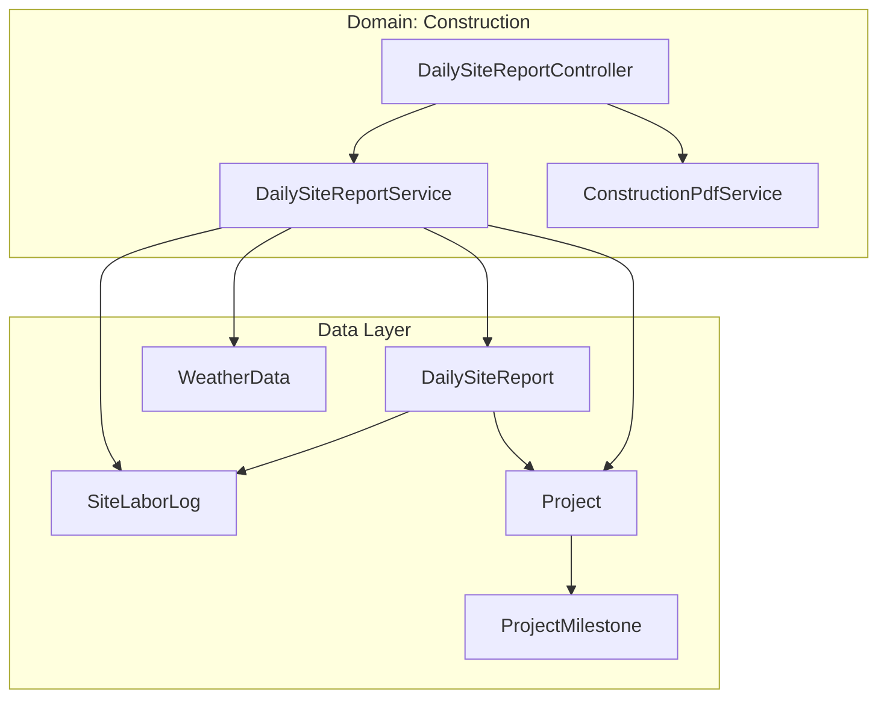
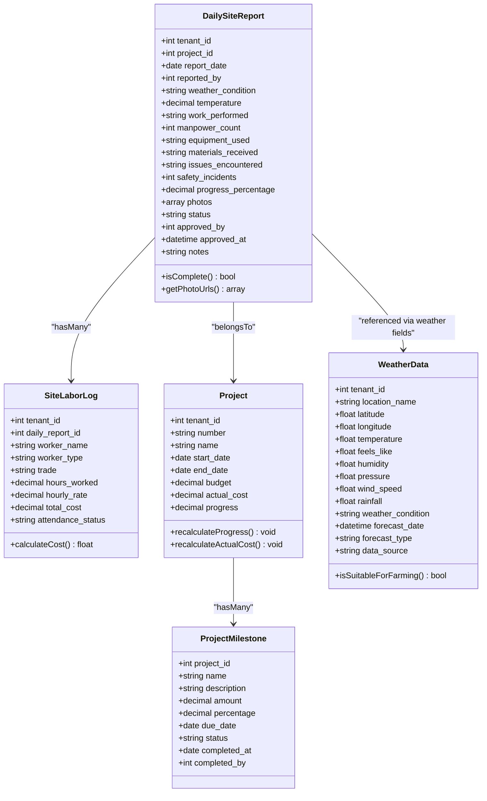
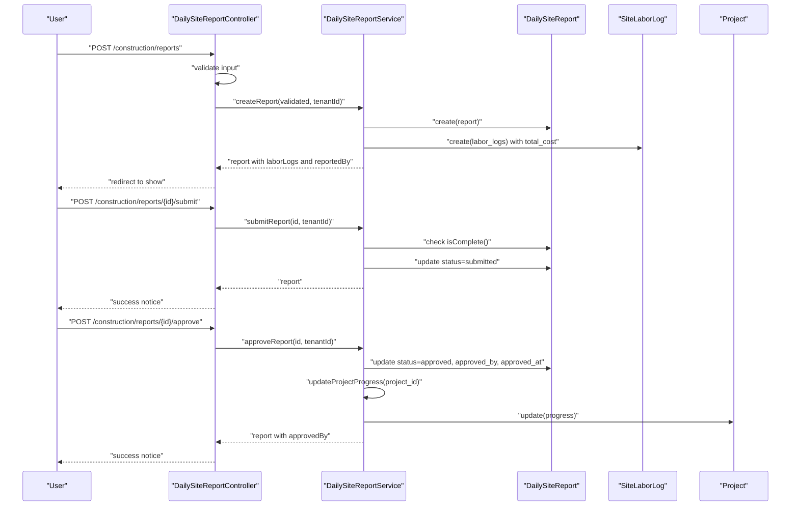
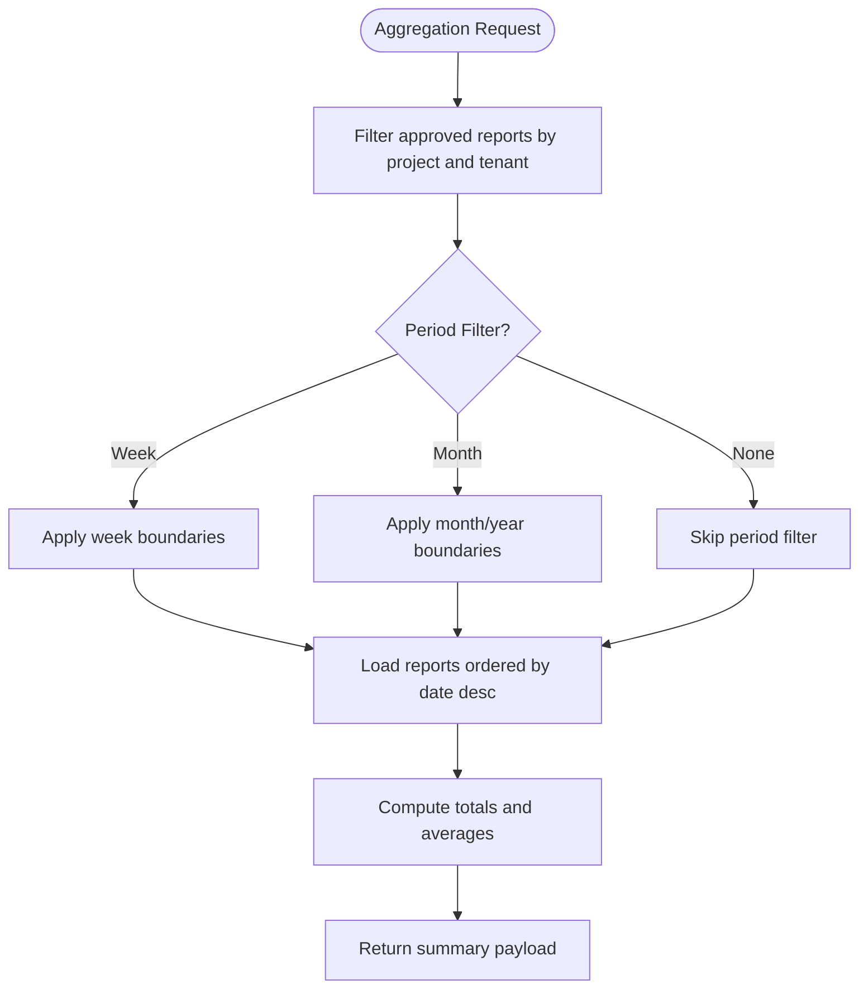
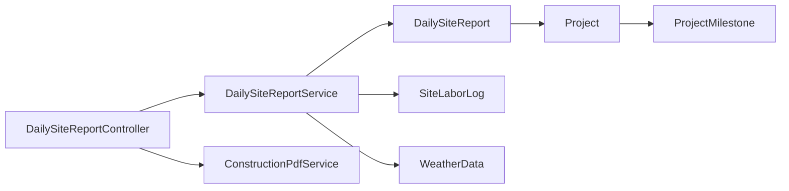

# Daily Site Reporting

<cite>
**Referenced Files in This Document**
- [DailySiteReport.php](file://app/Models/DailySiteReport.php)
- [SiteLaborLog.php](file://app/Models/SiteLaborLog.php)
- [Project.php](file://app/Models/Project.php)
- [ProjectMilestone.php](file://app/Models/ProjectMilestone.php)
- [WeatherData.php](file://app/Models/WeatherData.php)
- [DailySiteReportService.php](file://app/Services/DailySiteReportService.php)
- [ConstructionPdfService.php](file://app/Services/ConstructionPdfService.php)
- [DailySiteReportController.php](file://app/Http/Controllers/Construction/DailySiteReportController.php)
</cite>

## Table of Contents
1. [Introduction](#introduction)
2. [Project Structure](#project-structure)
3. [Core Components](#core-components)
4. [Architecture Overview](#architecture-overview)
5. [Detailed Component Analysis](#detailed-component-analysis)
6. [Dependency Analysis](#dependency-analysis)
7. [Performance Considerations](#performance-considerations)
8. [Troubleshooting Guide](#troubleshooting-guide)
9. [Conclusion](#conclusion)
10. [Appendices](#appendices)

## Introduction
This document describes the Daily Site Reporting system for construction projects. It covers the end-to-end workflow for capturing daily construction progress, including site conditions, workforce attendance, safety observations, weather impact, and project milestone updates. It also documents the reporting interface, photo documentation, real-time progress visualization, automated progress calculations, mobile data collection considerations, offline reporting potential, integration with project scheduling systems, reporting templates, compliance requirements, and stakeholder notification workflows.

## Project Structure
The Daily Site Reporting system is implemented as a cohesive module under the construction domain:
- Models define the persisted entities for daily reports, labor logs, projects, milestones, and weather data.
- Services encapsulate business logic for report creation, submission/approval, progress calculation, and PDF generation.
- Controllers expose the web interface and APIs for creating, reviewing, submitting, approving, and exporting reports.
- Views render dashboards and forms for report entry and review.
- Notifications coordinate stakeholder alerts for submission and approval events.

**Diagram sources**
- [DailySiteReportController.php:1-176](file://app/Http/Controllers/Construction/DailySiteReportController.php#L1-L176)
- [DailySiteReportService.php:1-206](file://app/Services/DailySiteReportService.php#L1-L206)
- [ConstructionPdfService.php:1-94](file://app/Services/ConstructionPdfService.php#L1-L94)
- [DailySiteReport.php:1-97](file://app/Models/DailySiteReport.php#L1-L97)
- [SiteLaborLog.php:1-55](file://app/Models/SiteLaborLog.php#L1-L55)
- [Project.php:1-82](file://app/Models/Project.php#L1-L82)
- [ProjectMilestone.php:1-33](file://app/Models/ProjectMilestone.php#L1-L33)
- [WeatherData.php:1-194](file://app/Models/WeatherData.php#L1-L194)

**Section sources**
- [DailySiteReportController.php:1-176](file://app/Http/Controllers/Construction/DailySiteReportController.php#L1-L176)
- [DailySiteReportService.php:1-206](file://app/Services/DailySiteReportService.php#L1-L206)
- [ConstructionPdfService.php:1-94](file://app/Services/ConstructionPdfService.php#L1-L94)
- [DailySiteReport.php:1-97](file://app/Models/DailySiteReport.php#L1-L97)
- [SiteLaborLog.php:1-55](file://app/Models/SiteLaborLog.php#L1-L55)
- [Project.php:1-82](file://app/Models/Project.php#L1-L82)
- [ProjectMilestone.php:1-33](file://app/Models/ProjectMilestone.php#L1-L33)
- [WeatherData.php:1-194](file://app/Models/WeatherData.php#L1-L194)

## Core Components
- DailySiteReport: Captures the daily construction snapshot including weather, temperature, work performed, manpower count, equipment/materials, issues, safety incidents, progress percentage, photos, status, approvals, and notes.
- SiteLaborLog: Tracks individual worker attendance, hours worked, hourly rate, total cost, trade, and attendance status linked to a daily report.
- Project: Stores project metadata, schedule, budget, actual costs, and progress. Provides progress recalculation helpers.
- ProjectMilestone: Defines milestones with due dates, percentages, amounts, and completion tracking.
- WeatherData: Stores weather metrics and supports suitability checks and recommendations.
- DailySiteReportService: Orchestrates report lifecycle (create, submit, approve), photo upload handling, labor log creation, progress summaries, labor cost analysis, and project progress updates.
- ConstructionPdfService: Generates PDF exports for daily reports and project summaries.
- DailySiteReportController: Exposes web endpoints for dashboard, creation, viewing, submission, approval, labor analysis, and PDF export.

**Section sources**
- [DailySiteReport.php:14-96](file://app/Models/DailySiteReport.php#L14-L96)
- [SiteLaborLog.php:13-54](file://app/Models/SiteLaborLog.php#L13-L54)
- [Project.php:11-81](file://app/Models/Project.php#L11-L81)
- [ProjectMilestone.php:10-32](file://app/Models/ProjectMilestone.php#L10-L32)
- [WeatherData.php:16-193](file://app/Models/WeatherData.php#L16-L193)
- [DailySiteReportService.php:12-205](file://app/Services/DailySiteReportService.php#L12-L205)
- [ConstructionPdfService.php:11-93](file://app/Services/ConstructionPdfService.php#L11-L93)
- [DailySiteReportController.php:14-175](file://app/Http/Controllers/Construction/DailySiteReportController.php#L14-L175)

## Architecture Overview
The system follows a layered architecture:
- Presentation: Web controller actions render views and serve JSON for analysis endpoints.
- Application: Services encapsulate domain logic and enforce business rules.
- Domain: Models represent entities and relationships.
- Persistence: Eloquent models persist to the database with tenant scoping.

**Diagram sources**
- [DailySiteReport.php:14-96](file://app/Models/DailySiteReport.php#L14-L96)
- [SiteLaborLog.php:13-54](file://app/Models/SiteLaborLog.php#L13-L54)
- [Project.php:11-81](file://app/Models/Project.php#L11-L81)
- [ProjectMilestone.php:10-32](file://app/Models/ProjectMilestone.php#L10-L32)
- [WeatherData.php:16-193](file://app/Models/WeatherData.php#L16-L193)

## Detailed Component Analysis

### Daily Site Report Creation and Submission
- The controller validates incoming report data and delegates creation to the service.
- Photos are uploaded to the public storage and stored as JSON array paths.
- Labor logs are created alongside the report with derived total cost.
- Submission transitions the report to “submitted” after completeness validation.
- Approval sets status to “approved,” records approver and timestamp, and updates project progress.

**Diagram sources**
- [DailySiteReportController.php:79-154](file://app/Http/Controllers/Construction/DailySiteReportController.php#L79-L154)
- [DailySiteReportService.php:17-95](file://app/Services/DailySiteReportService.php#L17-L95)
- [DailySiteReport.php:70-95](file://app/Models/DailySiteReport.php#L70-L95)
- [SiteLaborLog.php:42-53](file://app/Models/SiteLaborLog.php#L42-L53)
- [Project.php:50-61](file://app/Models/Project.php#L50-L61)

**Section sources**
- [DailySiteReportController.php:79-154](file://app/Http/Controllers/Construction/DailySiteReportController.php#L79-L154)
- [DailySiteReportService.php:17-95](file://app/Services/DailySiteReportService.php#L17-L95)
- [DailySiteReport.php:70-95](file://app/Models/DailySiteReport.php#L70-L95)
- [SiteLaborLog.php:42-53](file://app/Models/SiteLaborLog.php#L42-L53)
- [Project.php:50-61](file://app/Models/Project.php#L50-L61)

### Real-Time Progress Visualization and Automated Calculations
- The service aggregates approved reports to compute:
  - Average progress percentage
  - Total manpower
  - Total labor cost
  - Safety incidents
  - Weather condition distribution
  - Recent reports snapshot
- Labor cost analysis groups by trade and worker type, computing counts, hours, costs, and average rates.
- Project progress is automatically updated to match the latest approved report’s progress percentage.

**Diagram sources**
- [DailySiteReportService.php:100-135](file://app/Services/DailySiteReportService.php#L100-L135)
- [DailySiteReportService.php:140-169](file://app/Services/DailySiteReportService.php#L140-L169)

**Section sources**
- [DailySiteReportService.php:100-169](file://app/Services/DailySiteReportService.php#L100-L169)

### Photo Documentation Capabilities
- Photos are validated as images and stored under a dedicated public disk folder.
- Stored paths are saved as a JSON array in the report record.
- Utility method resolves absolute storage paths for rendering or export.

**Section sources**
- [DailySiteReportController.php:93-93](file://app/Http/Controllers/Construction/DailySiteReportController.php#L93-L93)
- [DailySiteReportService.php:174-186](file://app/Services/DailySiteReportService.php#L174-L186)
- [DailySiteReport.php:78-85](file://app/Models/DailySiteReport.php#L78-L85)

### Reporting Interface and Templates
- Dashboards list recent reports per project with filters for period and project selection.
- Create form captures required and optional fields, including labor logs.
- Show view renders report details, photos, and associated labor logs.
- PDF templates are rendered server-side for daily reports and project summaries.

**Section sources**
- [DailySiteReportController.php:28-61](file://app/Http/Controllers/Construction/DailySiteReportController.php#L28-L61)
- [DailySiteReportController.php:66-74](file://app/Http/Controllers/Construction/DailySiteReportController.php#L66-L74)
- [DailySiteReportController.php:107-114](file://app/Http/Controllers/Construction/DailySiteReportController.php#L107-L114)
- [ConstructionPdfService.php:16-36](file://app/Services/ConstructionPdfService.php#L16-L36)
- [ConstructionPdfService.php:64-92](file://app/Services/ConstructionPdfService.php#L64-L92)

### Weather Impact Documentation
- Weather fields are captured in the report (condition and temperature).
- The WeatherData model provides utilities for suitability checks and recommendations, which can inform risk assessments and adjust expectations for progress.

**Section sources**
- [DailySiteReport.php:22-23](file://app/Models/DailySiteReport.php#L22-L23)
- [WeatherData.php:85-146](file://app/Models/WeatherData.php#L85-L146)

### Project Milestone Updates
- Milestones are part of the project model and can be referenced in reporting narratives or summaries.
- While the service does not directly update milestone statuses, approved reports can be used to justify milestone completions and inform milestone progress tracking.

**Section sources**
- [ProjectMilestone.php:10-32](file://app/Models/ProjectMilestone.php#L10-L32)
- [Project.php:47-47](file://app/Models/Project.php#L47-L47)

### Stakeholder Notification Workflows
- Submission triggers notifications to approvers (admin/manager roles) within the tenant.
- Approval triggers a notification to the reporter.
- These notifications integrate with the tenant’s user base and role hierarchy.

**Section sources**
- [DailySiteReportController.php:126-133](file://app/Http/Controllers/Construction/DailySiteReportController.php#L126-L133)
- [DailySiteReportController.php:150-151](file://app/Http/Controllers/Construction/DailySiteReportController.php#L150-L151)

### Integration with Project Scheduling Systems
- Project progress is automatically synchronized with the latest approved report’s progress percentage.
- This enables downstream dashboards and scheduling tools to reflect real-time progress.

**Section sources**
- [DailySiteReportService.php:191-204](file://app/Services/DailySiteReportService.php#L191-L204)
- [Project.php:50-61](file://app/Models/Project.php#L50-L61)

### Mobile Data Collection and Offline Reporting
- The system accepts image uploads and JSON arrays for photos, enabling mobile capture.
- No explicit offline synchronization or caching logic is present in the referenced files; however, the upload mechanism and JSON-based fields support mobile-first data capture.

**Section sources**
- [DailySiteReportController.php:93-93](file://app/Http/Controllers/Construction/DailySiteReportController.php#L93-L93)
- [DailySiteReportService.php:174-186](file://app/Services/DailySiteReportService.php#L174-L186)
- [DailySiteReport.php:31-31](file://app/Models/DailySiteReport.php#L31-L31)

## Dependency Analysis
- Controllers depend on services and models to orchestrate workflows.
- Services encapsulate persistence and calculations, reducing controller complexity.
- Models define relationships and computed attributes.
- PDF service depends on report data and Blade templates.

**Diagram sources**
- [DailySiteReportController.php:14-23](file://app/Http/Controllers/Construction/DailySiteReportController.php#L14-L23)
- [DailySiteReportService.php:5-7](file://app/Services/DailySiteReportService.php#L5-L7)
- [DailySiteReport.php:14-73](file://app/Models/DailySiteReport.php#L14-L73)
- [SiteLaborLog.php:13-44](file://app/Models/SiteLaborLog.php#L13-L44)
- [Project.php:11-47](file://app/Models/Project.php#L11-L47)
- [ProjectMilestone.php:10-31](file://app/Models/ProjectMilestone.php#L10-L31)
- [WeatherData.php:16-61](file://app/Models/WeatherData.php#L16-L61)

**Section sources**
- [DailySiteReportController.php:14-23](file://app/Http/Controllers/Construction/DailySiteReportController.php#L14-L23)
- [DailySiteReportService.php:5-7](file://app/Services/DailySiteReportService.php#L5-L7)
- [DailySiteReport.php:14-73](file://app/Models/DailySiteReport.php#L14-L73)
- [SiteLaborLog.php:13-44](file://app/Models/SiteLaborLog.php#L13-L44)
- [Project.php:11-47](file://app/Models/Project.php#L11-L47)
- [ProjectMilestone.php:10-31](file://app/Models/ProjectMilestone.php#L10-L31)
- [WeatherData.php:16-61](file://app/Models/WeatherData.php#L16-L61)

## Performance Considerations
- Aggregation queries for summaries and labor analysis should leverage database indexing on tenant_id, project_id, status, and report_date.
- Photo storage and retrieval: ensure appropriate disk configuration and consider CDN for large-scale deployments.
- PDF generation is server-side; batch generation and caching strategies can mitigate load spikes during exports.
- Consider pagination for recent reports and limit the number of aggregated items to avoid heavy computations.

## Troubleshooting Guide
- Incomplete report submission: The service enforces completeness before allowing submission. Ensure required fields are filled.
- Missing photos: Verify upload validation rules and storage permissions.
- Labor cost discrepancies: Confirm derived total_cost matches hours_worked × hourly_rate.
- Progress not updating: Ensure the report is approved and belongs to the correct project.

**Section sources**
- [DailySiteReportService.php:67-69](file://app/Services/DailySiteReportService.php#L67-L69)
- [SiteLaborLog.php:50-53](file://app/Models/SiteLaborLog.php#L50-L53)
- [DailySiteReportService.php:191-204](file://app/Services/DailySiteReportService.php#L191-L204)

## Conclusion
The Daily Site Reporting system provides a robust foundation for construction progress tracking, integrating site conditions, workforce attendance, safety observations, weather impact, and project milestones. Its modular design supports real-time progress visualization, automated progress calculations, photo documentation, and stakeholder notifications. While explicit offline synchronization is not implemented in the referenced files, the upload and JSON-based data model supports mobile-first workflows. Integration with project scheduling systems is achieved through automatic progress updates tied to approved reports.

## Appendices
- Compliance and governance: Enforce tenant scoping and role-based access controls at the controller level. Ensure audit trails for approvals and exports.
- Reporting templates: Customize PDF templates and dashboard views to align with organizational branding and regulatory needs.
- Scalability: Add background jobs for PDF generation, implement caching for summaries, and monitor storage growth for photos.