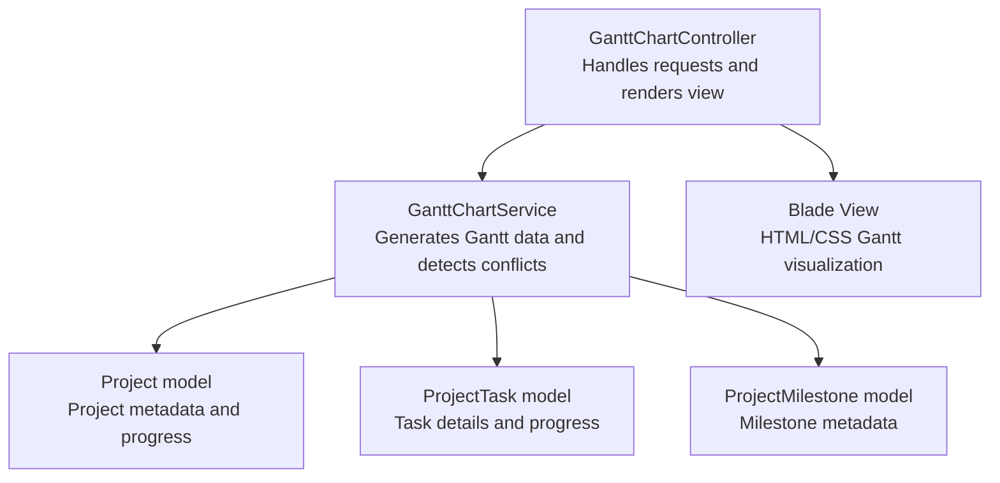
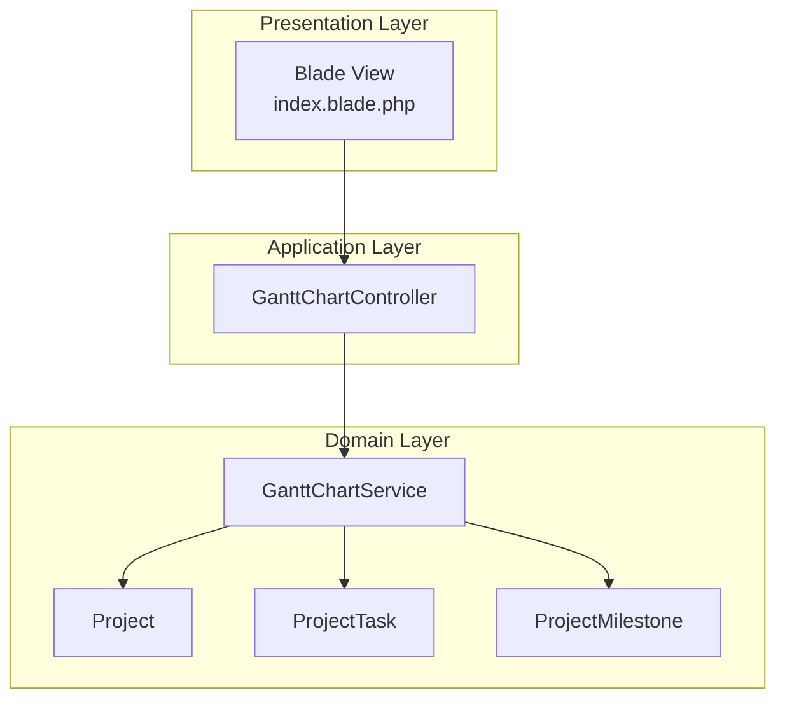
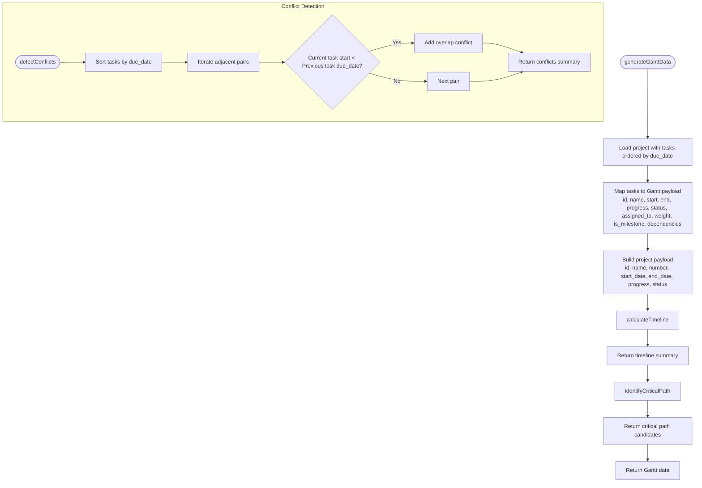
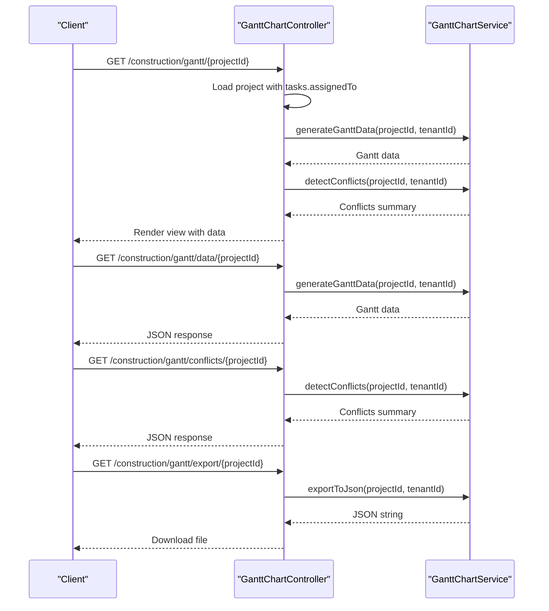
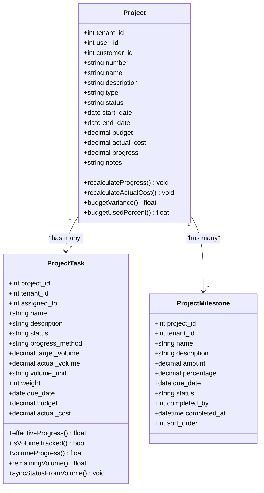
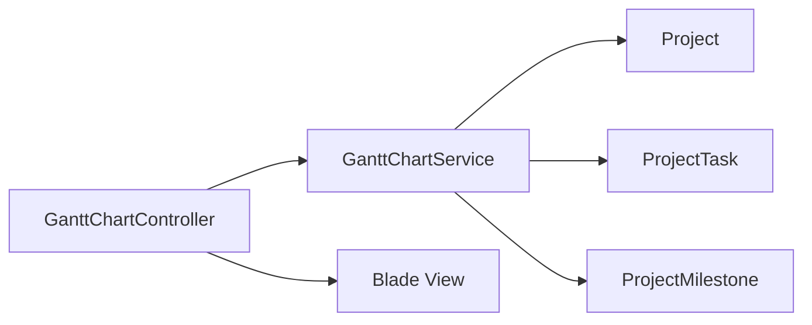

# Gantt Chart Project Scheduling

<cite>
**Referenced Files in This Document**
- [GanttChartService.php](file://app/Services/GanttChartService.php)
- [GanttChartController.php](file://app/Http/Controllers/Construction/GanttChartController.php)
- [Project.php](file://app/Models/Project.php)
- [ProjectTask.php](file://app/Models/ProjectTask.php)
- [ProjectMilestone.php](file://app/Models/ProjectMilestone.php)
- [index.blade.php](file://resources/views/construction/gantt/index.blade.php)
</cite>

## Table of Contents
1. [Introduction](#introduction)
2. [Project Structure](#project-structure)
3. [Core Components](#core-components)
4. [Architecture Overview](#architecture-overview)
5. [Detailed Component Analysis](#detailed-component-analysis)
6. [Dependency Analysis](#dependency-analysis)
7. [Performance Considerations](#performance-considerations)
8. [Troubleshooting Guide](#troubleshooting-guide)
9. [Conclusion](#conclusion)

## Introduction
This document describes the Gantt Chart Project Scheduling system implemented in the ERP codebase. It covers how project timelines are generated, task dependencies and conflicts are identified, milestones are tracked, and progress is visualized. It also documents the current capabilities around critical path analysis, bottleneck identification, and integration points with resource allocation and budget tracking. Areas such as automated scheduling algorithms, drag-and-drop scheduling, capacity planning, constraint handling, change impact assessment, and real-time progress synchronization are noted as currently unimplemented but suitable targets for future enhancement.

## Project Structure
The Gantt Chart feature is organized around a service layer that encapsulates scheduling logic, a controller that exposes endpoints and renders the view, and Blade templates that present the Gantt visualization. Data models for projects, tasks, and milestones provide the domain entities.

**Diagram sources**
- [GanttChartController.php:10-66](file://app/Http/Controllers/Construction/GanttChartController.php#L10-L66)
- [GanttChartService.php:12-172](file://app/Services/GanttChartService.php#L12-L172)
- [Project.php:11-81](file://app/Models/Project.php#L11-L81)
- [ProjectTask.php:11-100](file://app/Models/ProjectTask.php#L11-L100)
- [ProjectMilestone.php:10-32](file://app/Models/ProjectMilestone.php#L10-L32)
- [index.blade.php:1-169](file://resources/views/construction/gantt/index.blade.php#L1-L169)

**Section sources**
- [GanttChartController.php:10-66](file://app/Http/Controllers/Construction/GanttChartController.php#L10-L66)
- [GanttChartService.php:12-172](file://app/Services/GanttChartService.php#L12-L172)
- [Project.php:11-81](file://app/Models/Project.php#L11-L81)
- [ProjectTask.php:11-100](file://app/Models/ProjectTask.php#L11-L100)
- [ProjectMilestone.php:10-32](file://app/Models/ProjectMilestone.php#L10-L32)
- [index.blade.php:1-169](file://resources/views/construction/gantt/index.blade.php#L1-L169)

## Core Components
- GanttChartService: Central logic for generating Gantt data, calculating timeline metrics, identifying critical path candidates, and detecting scheduling conflicts.
- GanttChartController: HTTP entry points for viewing the Gantt page, retrieving JSON data, checking conflicts, and exporting Gantt data.
- Project model: Stores project metadata, budget, costs, and progress, with methods to recalculate progress and budget variance.
- ProjectTask model: Stores task details, progress calculation logic (including volume-based progress), and status synchronization.
- ProjectMilestone model: Stores milestone metadata linked to a project.
- Blade template: Renders a simple HTML/CSS Gantt visualization and displays timeline summary, conflicts, and critical path highlights.

Key responsibilities:
- Timeline creation: Uses project start/end dates and task due dates to compute total/elapsed/remaining days and completion percentage.
- Progress visualization: Aggregates task progress into a project-level weighted average and displays per-task progress bars.
- Milestone tracking: Treats high-weight tasks as milestones and lists them separately.
- Conflict detection: Identifies potential overlaps between adjacent tasks sorted by due date.
- Critical path: Selects top tasks by weight and due date as candidates for critical path analysis.

**Section sources**
- [GanttChartService.php:17-172](file://app/Services/GanttChartService.php#L17-L172)
- [GanttChartController.php:22-65](file://app/Http/Controllers/Construction/GanttChartController.php#L22-L65)
- [Project.php:50-81](file://app/Models/Project.php#L50-L81)
- [ProjectTask.php:66-100](file://app/Models/ProjectTask.php#L66-L100)
- [ProjectMilestone.php:13-32](file://app/Models/ProjectMilestone.php#L13-L32)
- [index.blade.php:31-166](file://resources/views/construction/gantt/index.blade.php#L31-L166)

## Architecture Overview
The system follows a layered architecture:
- Presentation: Blade view renders the Gantt UI and summary cards.
- Application: Controller orchestrates data retrieval and passes it to the view.
- Domain: Service encapsulates scheduling logic and data transformations.
- Persistence: Eloquent models represent Projects, Tasks, and Milestones.

**Diagram sources**
- [GanttChartController.php:10-66](file://app/Http/Controllers/Construction/GanttChartController.php#L10-L66)
- [GanttChartService.php:12-172](file://app/Services/GanttChartService.php#L12-L172)
- [Project.php:11-81](file://app/Models/Project.php#L11-L81)
- [ProjectTask.php:11-100](file://app/Models/ProjectTask.php#L11-L100)
- [ProjectMilestone.php:10-32](file://app/Models/ProjectMilestone.php#L10-L32)
- [index.blade.php:1-169](file://resources/views/construction/gantt/index.blade.php#L1-L169)

## Detailed Component Analysis

### GanttChartService
Responsibilities:
- Generate Gantt data for a project, including project metadata, task list with progress and assignment, and timeline summary.
- Calculate timeline metrics: total days, elapsed days, remaining days, completion percentage, and overdue status.
- Identify critical path candidates by selecting tasks with highest weight and due date among active tasks.
- Detect scheduling conflicts by scanning adjacent tasks sorted by due date for overlaps.
- Export Gantt data to JSON for external visualization.

Processing logic highlights:
- Timeline calculation uses project start/end dates or falls back to earliest task creation date and latest task due date.
- Critical path selection filters out cancelled/done tasks, sorts by weight and due date, and limits to top 5.
- Conflict detection compares each task’s created_at against the previous task’s due_date after sorting by due_date.

**Diagram sources**
- [GanttChartService.php:17-172](file://app/Services/GanttChartService.php#L17-L172)

**Section sources**
- [GanttChartService.php:17-172](file://app/Services/GanttChartService.php#L17-L172)

### GanttChartController
Responsibilities:
- Render the Gantt view with project metadata, Gantt data, and conflict information.
- Provide JSON endpoint for Gantt data consumption by external clients.
- Expose conflict-checking endpoint for client-side validation.
- Offer export endpoint to download Gantt data as JSON.

**Diagram sources**
- [GanttChartController.php:22-65](file://app/Http/Controllers/Construction/GanttChartController.php#L22-L65)
- [GanttChartService.php:17-172](file://app/Services/GanttChartService.php#L17-L172)

**Section sources**
- [GanttChartController.php:22-65](file://app/Http/Controllers/Construction/GanttChartController.php#L22-L65)

### Project Model
Responsibilities:
- Store project metadata, budget, actual cost, and progress.
- Recalculate project progress as a weighted average of task progress.
- Recalculate actual cost from project expenses.
- Compute budget variance and budget utilization percentage.

**Diagram sources**
- [Project.php:11-81](file://app/Models/Project.php#L11-L81)
- [ProjectTask.php:11-100](file://app/Models/ProjectTask.php#L11-L100)
- [ProjectMilestone.php:10-32](file://app/Models/ProjectMilestone.php#L10-L32)

**Section sources**
- [Project.php:50-81](file://app/Models/Project.php#L50-L81)
- [ProjectTask.php:66-100](file://app/Models/ProjectTask.php#L66-L100)
- [ProjectMilestone.php:13-32](file://app/Models/ProjectMilestone.php#L13-L32)

### ProjectTask Model
Responsibilities:
- Track task-level progress via status or volume-based method.
- Compute effective progress for project aggregation.
- Synchronize task status based on volume progress thresholds.
- Link to assigned user and maintain volume logs.

Progress calculation logic:
- Volume-based progress: actual/target * 100 capped at 100.
- Status-based progress: done=100%, in_progress=50%, review=75%, default=0%.
- Cancelled tasks contribute 0% to progress.

**Section sources**
- [ProjectTask.php:39-100](file://app/Models/ProjectTask.php#L39-L100)

### ProjectMilestone Model
Responsibilities:
- Store milestone metadata including due date, amount, and completion tracking.
- Link milestones to a project and the user who completed them.

**Section sources**
- [ProjectMilestone.php:13-32](file://app/Models/ProjectMilestone.php#L13-L32)

### Frontend Visualization (Blade Template)
Highlights:
- Displays project timeline summary cards: total duration, elapsed, remaining, and overdue status.
- Shows a simple Gantt visualization using stacked bars with progress percentages.
- Highlights milestones with a star icon and indicates task assignments and weights.
- Lists critical path tasks with prominence and progress.
- Provides conflict alerts with actionable messages.

Limitations:
- No drag-and-drop scheduling interface is implemented in the current template.
- Real-time updates and live synchronization are not present.

**Section sources**
- [index.blade.php:31-166](file://resources/views/construction/gantt/index.blade.php#L31-L166)

## Dependency Analysis
The system exhibits clear separation of concerns:
- Controller depends on Service for data generation and conflict detection.
- Service depends on Models for data retrieval and calculations.
- View depends on Controller-provided data arrays.

**Diagram sources**
- [GanttChartController.php:10-66](file://app/Http/Controllers/Construction/GanttChartController.php#L10-L66)
- [GanttChartService.php:12-172](file://app/Services/GanttChartService.php#L12-L172)
- [Project.php:11-81](file://app/Models/Project.php#L11-L81)
- [ProjectTask.php:11-100](file://app/Models/ProjectTask.php#L11-L100)
- [ProjectMilestone.php:10-32](file://app/Models/ProjectMilestone.php#L10-L32)
- [index.blade.php:1-169](file://resources/views/construction/gantt/index.blade.php#L1-L169)

**Section sources**
- [GanttChartController.php:10-66](file://app/Http/Controllers/Construction/GanttChartController.php#L10-L66)
- [GanttChartService.php:12-172](file://app/Services/GanttChartService.php#L12-L172)
- [Project.php:11-81](file://app/Models/Project.php#L11-L81)
- [ProjectTask.php:11-100](file://app/Models/ProjectTask.php#L11-L100)
- [ProjectMilestone.php:10-32](file://app/Models/ProjectMilestone.php#L10-L32)
- [index.blade.php:1-169](file://resources/views/construction/gantt/index.blade.php#L1-L169)

## Performance Considerations
- Data loading: The service loads project with tasks and sorts tasks by due date. For large datasets, consider adding database indexes on due_date and project_id to improve query performance.
- Timeline computation: Uses Carbon arithmetic on potentially large date sets; ensure date fields are properly indexed.
- Critical path selection: Applies filtering and ordering with limit; keep the limit reasonable to avoid heavy client-side rendering.
- Conflict detection: Iterates adjacent pairs after sorting; complexity is O(n log n) due to sorting plus O(n) scan, acceptable for moderate task counts.

[No sources needed since this section provides general guidance]

## Troubleshooting Guide
Common scenarios and remedies:
- Empty task list: The view displays a message and a link to create the first task. Verify that tasks exist for the project and that the tenant filter matches the authenticated user.
- Overlapping tasks alert: Review the conflict messages and adjust task due dates or created_at timestamps to remove overlaps.
- Critical path appears empty: Ensure tasks have non-zero weight and are not in cancelled/completed status.
- Export/download fails: Confirm the export endpoint is called with the correct project ID and that the server returns a 200 status with JSON content.

**Section sources**
- [index.blade.php:121-135](file://resources/views/construction/gantt/index.blade.php#L121-L135)
- [GanttChartController.php:58-65](file://app/Http/Controllers/Construction/GanttChartController.php#L58-L65)
- [GanttChartService.php:128-162](file://app/Services/GanttChartService.php#L128-L162)

## Conclusion
The Gantt Chart Project Scheduling system provides a solid foundation for timeline creation, progress visualization, milestone tracking, and basic conflict detection. It integrates project and task models to compute weighted progress and offers a simple HTML/CSS Gantt view. Future enhancements could include:
- Automated scheduling algorithms and constraint handling for deterministic planning.
- Drag-and-drop scheduling interface for intuitive timeline editing.
- Capacity planning and resource allocation features integrated with the task assignment model.
- Real-time progress synchronization and change impact assessment.
- Full critical path computation with dependency modeling and forward/backward pass analysis.
- Integration with budget tracking and quality control workflows for holistic project oversight.

[No sources needed since this section summarizes without analyzing specific files]