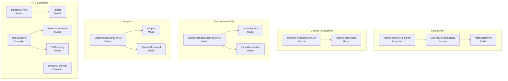
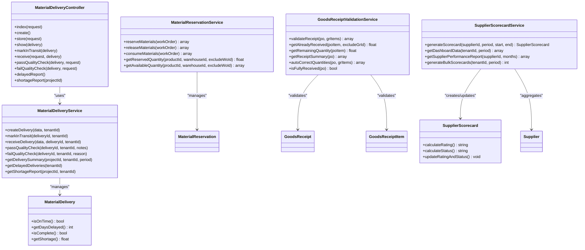
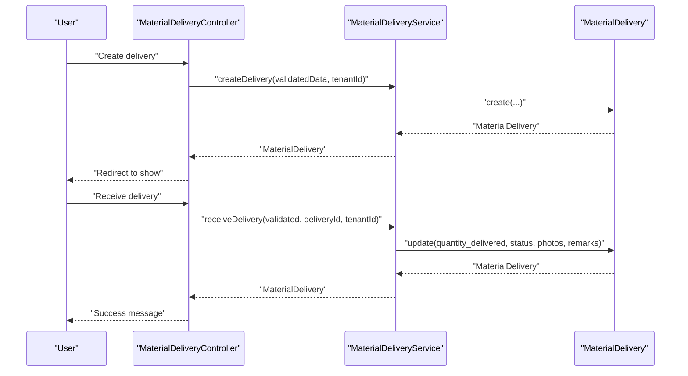
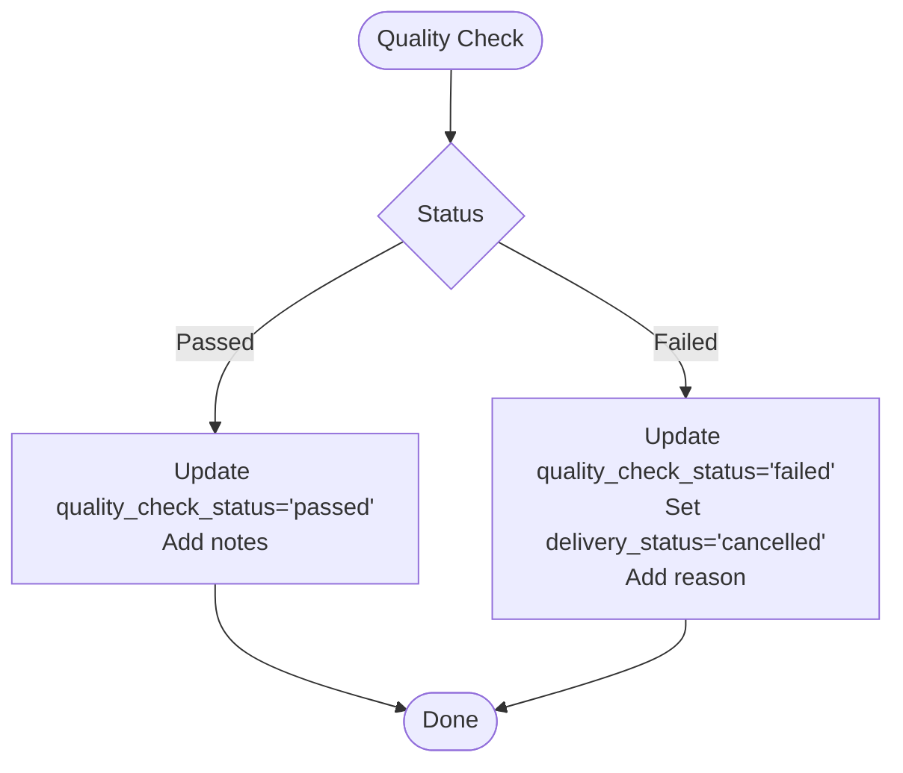
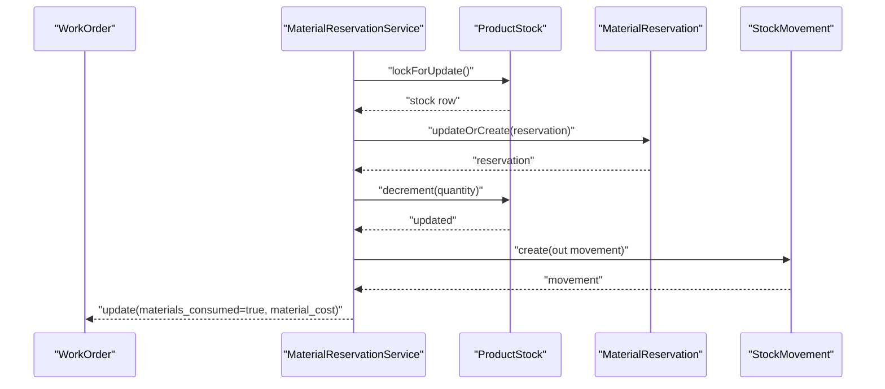
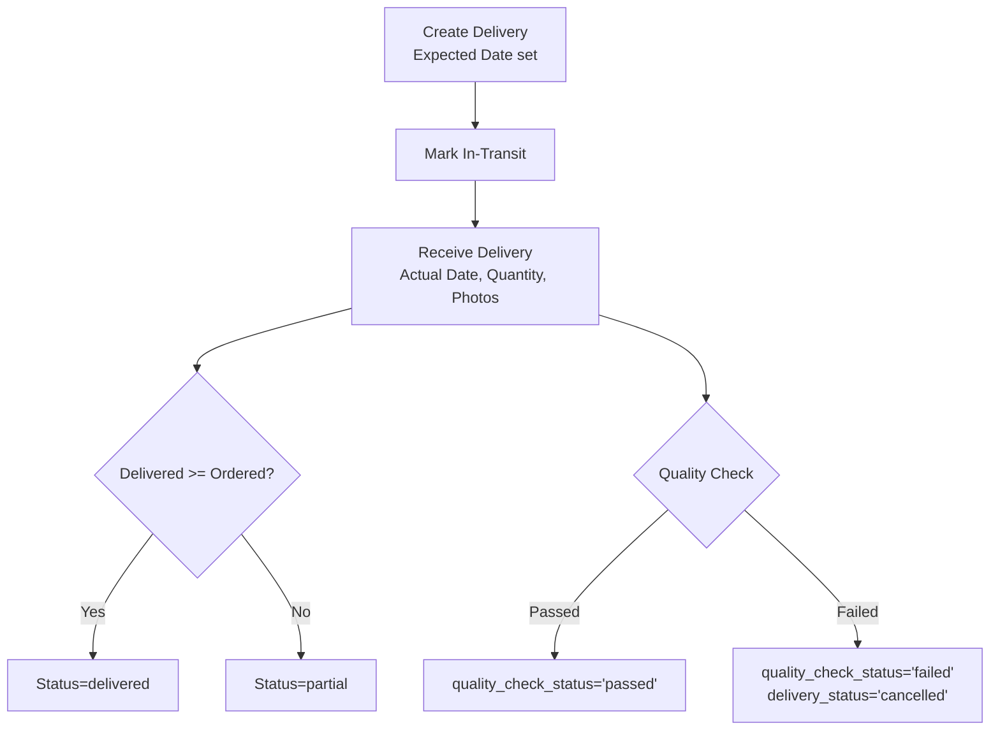
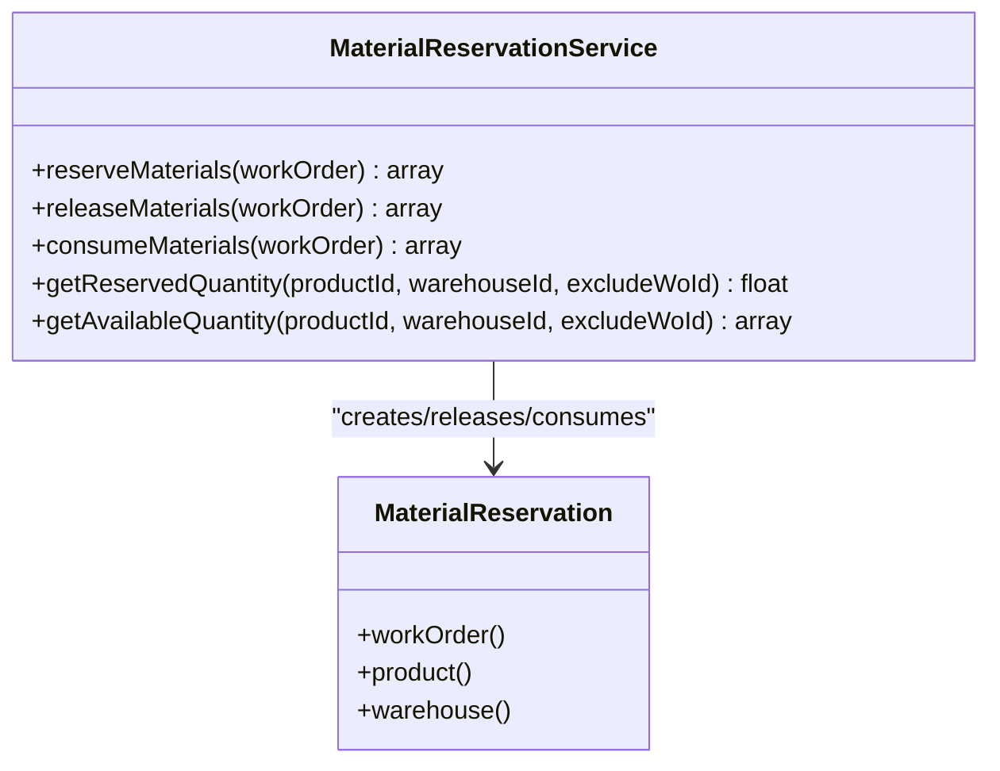
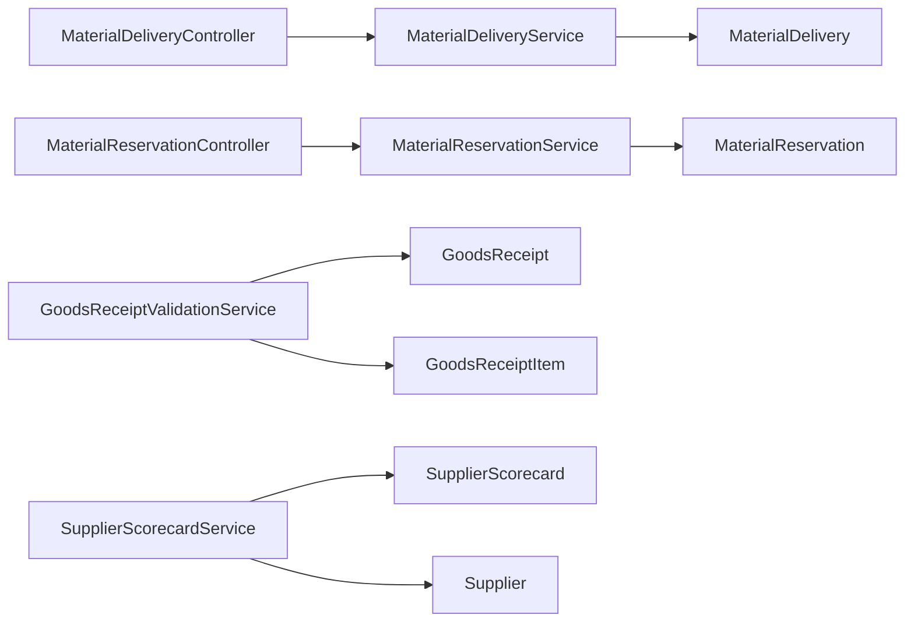

# Material Delivery & Tracking

<cite>
**Referenced Files in This Document**
- [MaterialDelivery.php](file://app/Models/MaterialDelivery.php)
- [MaterialDeliveryService.php](file://app/Services/MaterialDeliveryService.php)
- [MaterialDeliveryController.php](file://app/Http/Controllers/Construction/MaterialDeliveryController.php)
- [MaterialReservation.php](file://app/Models/MaterialReservation.php)
- [MaterialReservationService.php](file://app/Services/MaterialReservationService.php)
- [GoodsReceipt.php](file://app/Models/GoodsReceipt.php)
- [GoodsReceiptItem.php](file://app/Models/GoodsReceiptItem.php)
- [GoodsReceiptValidationService.php](file://app/Services/GoodsReceiptValidationService.php)
- [Supplier.php](file://app/Models/Supplier.php)
- [SupplierScorecard.php](file://app/Models/SupplierScorecard.php)
- [SupplierScorecardService.php](file://app/Services/SupplierScorecardService.php)
- [BarcodeService.php](file://app/Services/BarcodeService.php)
- [RfidTag.php](file://app/Models/RfidTag.php)
- [RfidScannerDevice.php](file://app/Models/RfidScannerDevice.php)
- [RfidScanLog.php](file://app/Models/RfidScanLog.php)
- [RfidController.php](file://app/Http/Controllers/Inventory/RfidController.php)
- [BarcodeController.php](file://app/Http/Controllers/BarcodeController.php)
</cite>

## Table of Contents
1. [Introduction](#introduction)
2. [Project Structure](#project-structure)
3. [Core Components](#core-components)
4. [Architecture Overview](#architecture-overview)
5. [Detailed Component Analysis](#detailed-component-analysis)
6. [Dependency Analysis](#dependency-analysis)
7. [Performance Considerations](#performance-considerations)
8. [Troubleshooting Guide](#troubleshooting-guide)
9. [Conclusion](#conclusion)
10. [Appendices](#appendices)

## Introduction
This document describes the Material Delivery & Tracking system within the qalcuityERP construction module. It covers incoming material receipt processing, supplier verification and performance monitoring, quality inspection workflows, inventory integration, and delivery scheduling. It also documents material reservation systems, automated stock updates, waste tracking, barcode and RFID capabilities, temperature monitoring for sensitive materials, compliance documentation, procurement integration, cost tracking, and project budget management.

## Project Structure
The system spans models, services, controllers, and supporting components for construction and inventory domains:
- Construction delivery tracking: MaterialDelivery model and controller/service for end-to-end delivery lifecycle
- Material reservation and consumption: MaterialReservation model and service for atomic reservations and stock movements
- Procurement and goods receipt validation: GoodsReceipt and GoodsReceiptItem models plus validation service
- Supplier performance: Supplier, SupplierScorecard, and SupplierScorecardService for ratings and reporting
- Asset and inventory tracking: RfidTag, RfidScannerDevice, RfidScanLog, and controllers for RFID workflows
- Identification technologies: BarcodeService and controllers for barcode generation/scanning

**Diagram sources**
- [MaterialDelivery.php:13-121](file://app/Models/MaterialDelivery.php#L13-L121)
- [MaterialDeliveryService.php:11-254](file://app/Services/MaterialDeliveryService.php#L11-L254)
- [MaterialDeliveryController.php:11-190](file://app/Http/Controllers/Construction/MaterialDeliveryController.php#L11-L190)
- [MaterialReservation.php:9-54](file://app/Models/MaterialReservation.php#L9-L54)
- [MaterialReservationService.php:24-389](file://app/Services/MaterialReservationService.php#L24-L389)
- [GoodsReceipt.php:11-26](file://app/Models/GoodsReceipt.php#L11-L26)
- [GoodsReceiptItem.php:8-25](file://app/Models/GoodsReceiptItem.php#L8-L25)
- [GoodsReceiptValidationService.php:21-292](file://app/Services/GoodsReceiptValidationService.php#L21-L292)
- [Supplier.php:13-52](file://app/Models/Supplier.php#L13-L52)
- [SupplierScorecard.php:12-115](file://app/Models/SupplierScorecard.php#L12-L115)
- [SupplierScorecardService.php:12-322](file://app/Services/SupplierScorecardService.php#L12-L322)
- [RfidTag.php](file://app/Models/RfidTag.php)
- [RfidScannerDevice.php](file://app/Models/RfidScannerDevice.php)
- [RfidScanLog.php](file://app/Models/RfidScanLog.php)
- [RfidController.php](file://app/Http/Controllers/Inventory/RfidController.php)
- [BarcodeService.php](file://app/Services/BarcodeService.php)
- [BarcodeController.php](file://app/Http/Controllers/BarcodeController.php)

**Section sources**
- [MaterialDeliveryController.php:11-190](file://app/Http/Controllers/Construction/MaterialDeliveryController.php#L11-L190)
- [MaterialDeliveryService.php:11-254](file://app/Services/MaterialDeliveryService.php#L11-L254)
- [MaterialReservationService.php:24-389](file://app/Services/MaterialReservationService.php#L24-L389)
- [GoodsReceiptValidationService.php:21-292](file://app/Services/GoodsReceiptValidationService.php#L21-L292)
- [SupplierScorecardService.php:12-322](file://app/Services/SupplierScorecardService.php#L12-L322)
- [RfidController.php](file://app/Http/Controllers/Inventory/RfidController.php)
- [BarcodeController.php](file://app/Http/Controllers/BarcodeController.php)

## Core Components
- MaterialDelivery: Tracks delivery lifecycle, on-time performance, completeness, and quality checks; integrates photos and remarks.
- MaterialDeliveryService: Creates deliveries, marks in-transit, records receipts, quality checks, and generates summaries/reports.
- MaterialReservation and MaterialReservationService: Atomic reservation, release, and consumption of materials against work orders with stock locking and movement logging.
- GoodsReceipt and GoodsReceiptValidationService: Validates receipt quantities against purchase orders, prevents over-acceptance, and computes remaining balances.
- Supplier and SupplierScorecard: Supplier master data and scorecards; SupplierScorecardService aggregates quality, delivery, cost, and service metrics.
- RFID and Barcode: RfidTag, RfidScannerDevice, RfidScanLog for asset tracking; BarcodeService and BarcodeController for identification workflows.

**Section sources**
- [MaterialDelivery.php:13-121](file://app/Models/MaterialDelivery.php#L13-L121)
- [MaterialDeliveryService.php:11-254](file://app/Services/MaterialDeliveryService.php#L11-L254)
- [MaterialReservation.php:9-54](file://app/Models/MaterialReservation.php#L9-L54)
- [MaterialReservationService.php:24-389](file://app/Services/MaterialReservationService.php#L24-L389)
- [GoodsReceipt.php:11-26](file://app/Models/GoodsReceipt.php#L11-L26)
- [GoodsReceiptItem.php:8-25](file://app/Models/GoodsReceiptItem.php#L8-L25)
- [GoodsReceiptValidationService.php:21-292](file://app/Services/GoodsReceiptValidationService.php#L21-L292)
- [Supplier.php:13-52](file://app/Models/Supplier.php#L13-L52)
- [SupplierScorecard.php:12-115](file://app/Models/SupplierScorecard.php#L12-L115)
- [SupplierScorecardService.php:12-322](file://app/Services/SupplierScorecardService.php#L12-L322)
- [RfidTag.php](file://app/Models/RfidTag.php)
- [RfidScannerDevice.php](file://app/Models/RfidScannerDevice.php)
- [RfidScanLog.php](file://app/Models/RfidScanLog.php)
- [BarcodeService.php](file://app/Services/BarcodeService.php)

## Architecture Overview
The system follows a layered architecture:
- Controllers orchestrate requests and delegate to services
- Services encapsulate business logic and coordinate models
- Models define persistence and relationships
- Validation services enforce business rules (e.g., goods receipt limits)
- Reporting services aggregate metrics for dashboards and scorecards

**Diagram sources**
- [MaterialDeliveryController.php:11-190](file://app/Http/Controllers/Construction/MaterialDeliveryController.php#L11-L190)
- [MaterialDeliveryService.php:11-254](file://app/Services/MaterialDeliveryService.php#L11-L254)
- [MaterialDelivery.php:13-121](file://app/Models/MaterialDelivery.php#L13-L121)
- [MaterialReservationService.php:24-389](file://app/Services/MaterialReservationService.php#L24-L389)
- [MaterialReservation.php:9-54](file://app/Models/MaterialReservation.php#L9-L54)
- [GoodsReceiptValidationService.php:21-292](file://app/Services/GoodsReceiptValidationService.php#L21-L292)
- [GoodsReceipt.php:11-26](file://app/Models/GoodsReceipt.php#L11-L26)
- [GoodsReceiptItem.php:8-25](file://app/Models/GoodsReceiptItem.php#L8-L25)
- [SupplierScorecardService.php:12-322](file://app/Services/SupplierScorecardService.php#L12-L322)
- [SupplierScorecard.php:12-115](file://app/Models/SupplierScorecard.php#L12-L115)
- [Supplier.php:13-52](file://app/Models/Supplier.php#L13-L52)

## Detailed Component Analysis

### Incoming Material Receipt Processing
- Creation: Generates a delivery number, initializes status, and sets expected date and unit price.
- In-transit: Updates status to in-transit when shipment departs.
- Receipt: Records delivered quantity, actual delivery date, status (delivered/partial), quality status, photos, and remarks.
- Validation: Goods receipt validation ensures cumulative accepted quantity does not exceed PO item quantity, rejects logical inconsistencies, and supports auto-correction.

**Diagram sources**
- [MaterialDeliveryController.php:70-136](file://app/Http/Controllers/Construction/MaterialDeliveryController.php#L70-L136)
- [MaterialDeliveryService.php:16-94](file://app/Services/MaterialDeliveryService.php#L16-L94)
- [MaterialDelivery.php:13-121](file://app/Models/MaterialDelivery.php#L13-L121)

**Section sources**
- [MaterialDeliveryService.php:16-94](file://app/Services/MaterialDeliveryService.php#L16-L94)
- [GoodsReceiptValidationService.php:30-112](file://app/Services/GoodsReceiptValidationService.php#L30-L112)

### Supplier Verification and Quality Inspection Workflows
- Supplier verification: Supplier model stores contact and account details; SupplierScorecardService aggregates quality, delivery, cost, and service metrics to compute weighted scores and ratings.
- Quality inspection: MaterialDelivery tracks quality_check_status and quality_notes; pass/fail actions update status accordingly and can cancel delivery on failure.

**Diagram sources**
- [MaterialDeliveryService.php:99-129](file://app/Services/MaterialDeliveryService.php#L99-L129)
- [MaterialDelivery.php:77-120](file://app/Models/MaterialDelivery.php#L77-L120)

**Section sources**
- [Supplier.php:13-52](file://app/Models/Supplier.php#L13-L52)
- [SupplierScorecard.php:12-115](file://app/Models/SupplierScorecard.php#L12-L115)
- [SupplierScorecardService.php:17-54](file://app/Services/SupplierScorecardService.php#L17-L54)

### Inventory Integration and Automated Stock Updates
- Material reservation: Ensures no double-allocation across work orders by locking stock rows, calculating available quantities excluding other reservations, and atomically creating reservations.
- Consumption: Consumes reserved materials with atomic stock decrements, creates stock movements, and updates work order material cost.
- Goods receipt validation: Prevents over-acceptance by validating against PO item totals and cumulative receipts.

**Diagram sources**
- [MaterialReservationService.php:43-302](file://app/Services/MaterialReservationService.php#L43-L302)
- [MaterialReservation.php:9-54](file://app/Models/MaterialReservation.php#L9-L54)
- [MaterialDelivery.php:13-121](file://app/Models/MaterialDelivery.php#L13-L121)

**Section sources**
- [MaterialReservationService.php:34-302](file://app/Services/MaterialReservationService.php#L34-L302)
- [GoodsReceiptValidationService.php:123-144](file://app/Services/GoodsReceiptValidationService.php#L123-L144)

### Delivery Scheduling and Tracking
- Delivery scheduling: Expected delivery date drives on-time calculations and summary reports.
- Tracking: Actual delivery date, status (pending, in_transit, delivered, partial, cancelled), and photos enable visibility.
- Reports: Delivery summary, delayed deliveries, and shortage reports support decision-making.

**Diagram sources**
- [MaterialDeliveryService.php:58-129](file://app/Services/MaterialDeliveryService.php#L58-L129)
- [MaterialDelivery.php:77-120](file://app/Models/MaterialDelivery.php#L77-L120)

**Section sources**
- [MaterialDeliveryService.php:134-235](file://app/Services/MaterialDeliveryService.php#L134-L235)

### Material Reservation Systems
- Reservation creation: Computes required quantities from BOM or recipe, locks stock, calculates availability, and reserves materials.
- Release: Releases reserved materials when work orders are cancelled.
- Consumption: Consumes reserved materials atomically, updates stock, and logs movements.

**Diagram sources**
- [MaterialReservationService.php:34-302](file://app/Services/MaterialReservationService.php#L34-L302)
- [MaterialReservation.php:9-54](file://app/Models/MaterialReservation.php#L9-L54)

**Section sources**
- [MaterialReservationService.php:34-302](file://app/Services/MaterialReservationService.php#L34-L302)

### Waste Tracking
- Ingredient waste: The system includes IngredientWaste model and related services for tracking ingredient waste, enabling cost and sustainability reporting aligned with inventory movements.

**Section sources**
- [MaterialReservationService.php:24-389](file://app/Services/MaterialReservationService.php#L24-L389)

### Barcode Scanning Capabilities
- BarcodeService: Provides barcode generation and scanning utilities integrated with the broader inventory and asset tracking ecosystem.
- BarcodeController: Exposes endpoints/controllers for barcode operations.

**Section sources**
- [BarcodeService.php](file://app/Services/BarcodeService.php)
- [BarcodeController.php](file://app/Http/Controllers/BarcodeController.php)

### RFID Tracking
- RfidTag, RfidScannerDevice, RfidScanLog: Models for RFID tag management, scanner devices, and scan logs.
- RfidController: Controller for RFID-related operations.

**Section sources**
- [RfidTag.php](file://app/Models/RfidTag.php)
- [RfidScannerDevice.php](file://app/Models/RfidScannerDevice.php)
- [RfidScanLog.php](file://app/Models/RfidScanLog.php)
- [RfidController.php](file://app/Http/Controllers/Inventory/RfidController.php)

### Temperature Monitoring for Sensitive Materials
- Temperature monitoring for sensitive materials is not explicitly implemented in the referenced files. Consider integrating IoT sensors and storing readings via dedicated models and services, aligning with existing inventory and asset tracking patterns.

[No sources needed since this section provides general guidance]

### Compliance Documentation
- Supplier documents: SupplierDocument model enables attaching compliance-related documents per supplier.
- Audit trail: Supplier model uses auditing traits to maintain change history.

**Section sources**
- [Supplier.php:13-52](file://app/Models/Supplier.php#L13-L52)

### Integration with Procurement Systems
- Purchase orders and goods receipt: GoodsReceipt and GoodsReceiptItem models integrate with PurchaseOrder and PurchaseOrderItem to manage procurement lifecycle.
- Validation: GoodsReceiptValidationService enforces acceptance limits and cumulative receipts.

**Section sources**
- [GoodsReceipt.php:11-26](file://app/Models/GoodsReceipt.php#L11-L26)
- [GoodsReceiptItem.php:8-25](file://app/Models/GoodsReceiptItem.php#L8-L25)
- [GoodsReceiptValidationService.php:30-112](file://app/Services/GoodsReceiptValidationService.php#L30-L112)

### Cost Tracking and Project Budget Management
- Material costs: MaterialReservationService computes total material cost upon consumption and updates work order material_cost.
- Delivery value: MaterialDelivery tracks unit_price and total_value for budget and cost analysis.
- Supplier scorecards: SupplierScorecardService aggregates cost metrics (total spend, cost savings) to inform budget decisions.

**Section sources**
- [MaterialReservationService.php:248-294](file://app/Services/MaterialReservationService.php#L248-L294)
- [MaterialDelivery.php:16-55](file://app/Models/MaterialDelivery.php#L16-L55)
- [SupplierScorecardService.php:125-148](file://app/Services/SupplierScorecardService.php#L125-L148)

## Dependency Analysis
- Controllers depend on services for business logic
- Services depend on models for persistence and relationships
- Validation services encapsulate cross-entity rules (e.g., goods receipt vs. purchase order)
- Reporting services aggregate metrics from multiple models

**Diagram sources**
- [MaterialDeliveryController.php:11-190](file://app/Http/Controllers/Construction/MaterialDeliveryController.php#L11-L190)
- [MaterialDeliveryService.php:11-254](file://app/Services/MaterialDeliveryService.php#L11-L254)
- [MaterialDelivery.php:13-121](file://app/Models/MaterialDelivery.php#L13-L121)
- [MaterialReservationService.php:24-389](file://app/Services/MaterialReservationService.php#L24-L389)
- [MaterialReservation.php:9-54](file://app/Models/MaterialReservation.php#L9-L54)
- [GoodsReceiptValidationService.php:21-292](file://app/Services/GoodsReceiptValidationService.php#L21-L292)
- [GoodsReceipt.php:11-26](file://app/Models/GoodsReceipt.php#L11-L26)
- [GoodsReceiptItem.php:8-25](file://app/Models/GoodsReceiptItem.php#L8-L25)
- [SupplierScorecardService.php:12-322](file://app/Services/SupplierScorecardService.php#L12-L322)
- [SupplierScorecard.php:12-115](file://app/Models/SupplierScorecard.php#L12-L115)
- [Supplier.php:13-52](file://app/Models/Supplier.php#L13-L52)

**Section sources**
- [MaterialDeliveryController.php:11-190](file://app/Http/Controllers/Construction/MaterialDeliveryController.php#L11-L190)
- [MaterialReservationService.php:24-389](file://app/Services/MaterialReservationService.php#L24-L389)
- [GoodsReceiptValidationService.php:21-292](file://app/Services/GoodsReceiptValidationService.php#L21-L292)
- [SupplierScorecardService.php:12-322](file://app/Services/SupplierScorecardService.php#L12-L322)

## Performance Considerations
- Use database transactions and row-level locks (e.g., lockForUpdate) to prevent race conditions during material reservation and consumption.
- Apply pagination and filtering for delivery summaries and reports to limit payload sizes.
- Index frequently queried fields (project_id, tenant_id, expected_date, supplier_id) to improve report performance.
- Offload heavy report computations to scheduled jobs and cache aggregated metrics.

[No sources needed since this section provides general guidance]

## Troubleshooting Guide
- Over-receipt prevention: Use GoodsReceiptValidationService to detect and auto-correct over-acceptance and logical inconsistencies.
- Reservation conflicts: If insufficient stock exists, the reservation service returns shortages; adjust production plans or procure additional materials.
- Quality failures: On failed quality checks, deliveries are cancelled; investigate root causes and update supplier performance metrics.
- Reporting discrepancies: Verify filters (period, project) and ensure tenant scoping is applied consistently.

**Section sources**
- [GoodsReceiptValidationService.php:30-112](file://app/Services/GoodsReceiptValidationService.php#L30-L112)
- [MaterialReservationService.php:97-143](file://app/Services/MaterialReservationService.php#L97-L143)
- [MaterialDeliveryService.php:116-129](file://app/Services/MaterialDeliveryService.php#L116-L129)

## Conclusion
The Material Delivery & Tracking system integrates delivery lifecycle management, material reservations, procurement validation, supplier performance monitoring, and asset tracking. It provides robust controls to prevent over-acceptance, ensures atomic stock updates, and offers actionable insights through reports and scorecards. Extending capabilities such as temperature monitoring and compliance documentation can further strengthen operational excellence and regulatory adherence.

## Appendices
- Data model relationships for construction and inventory domains are centered around tenants, projects, suppliers, purchase orders, goods receipts, materials, and RFID assets.

[No sources needed since this section summarizes without analyzing specific files]