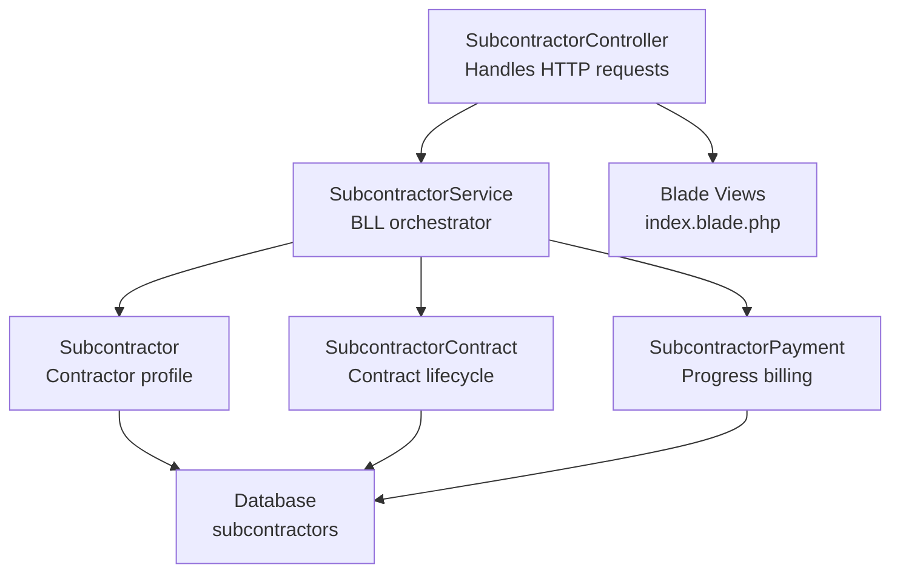
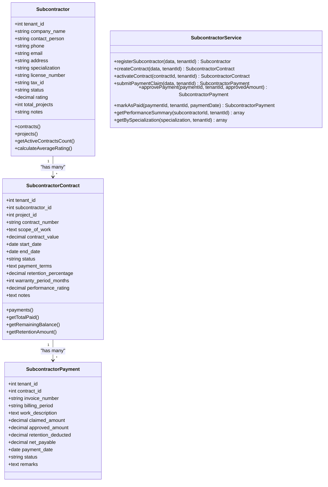
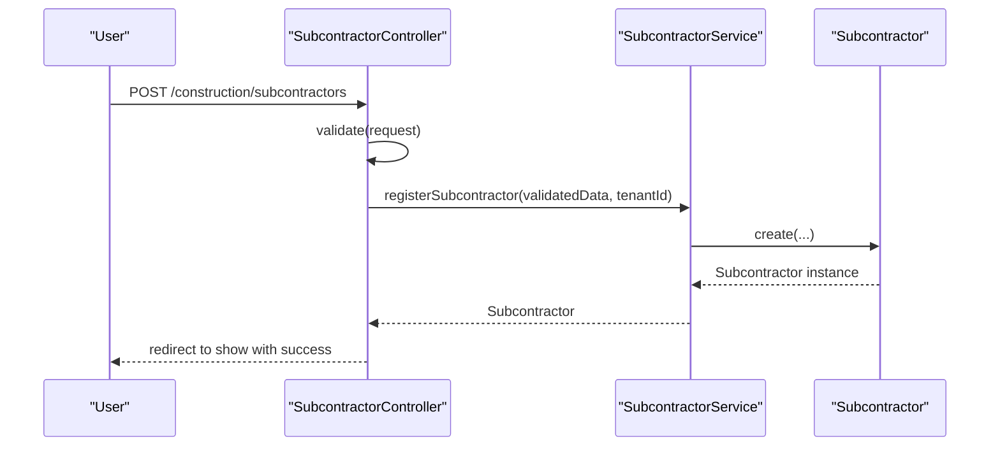
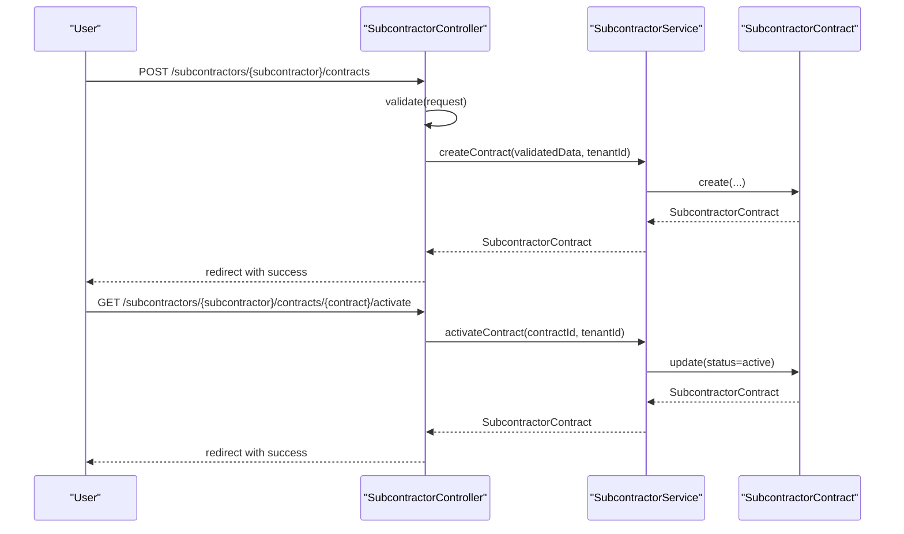
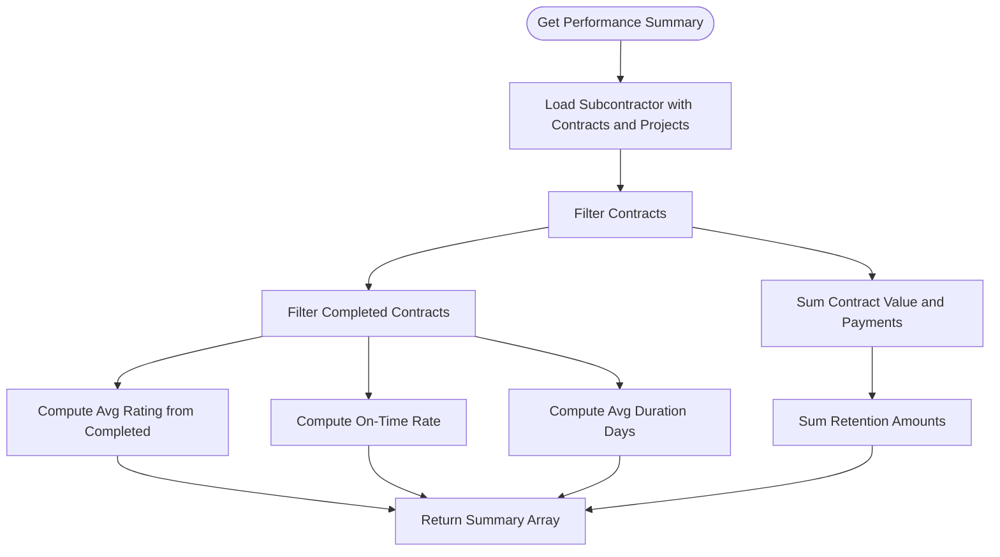
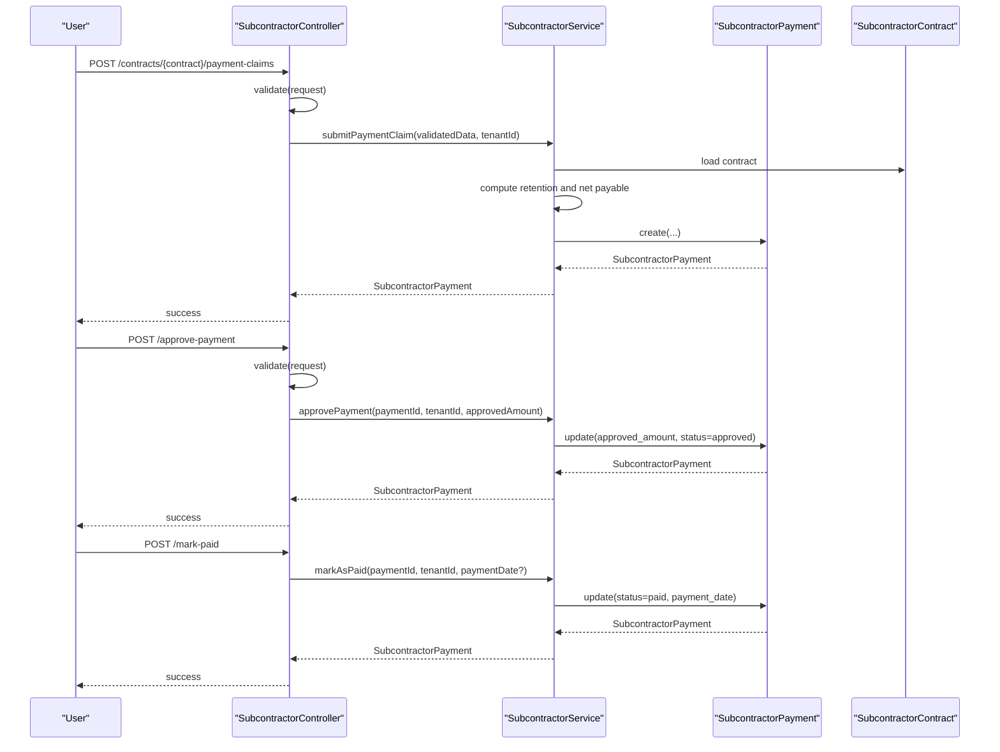
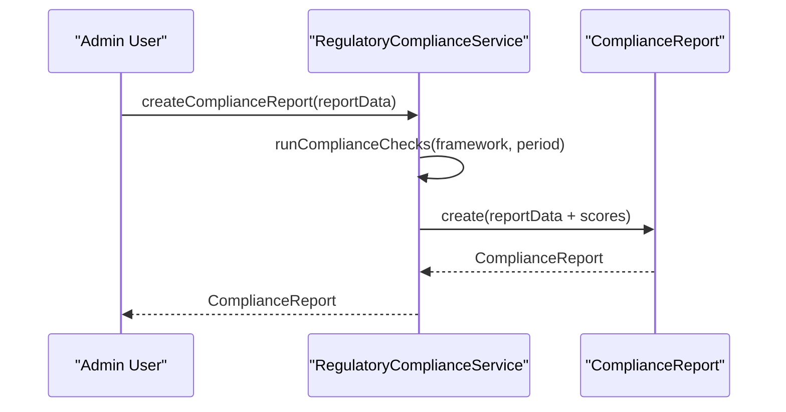
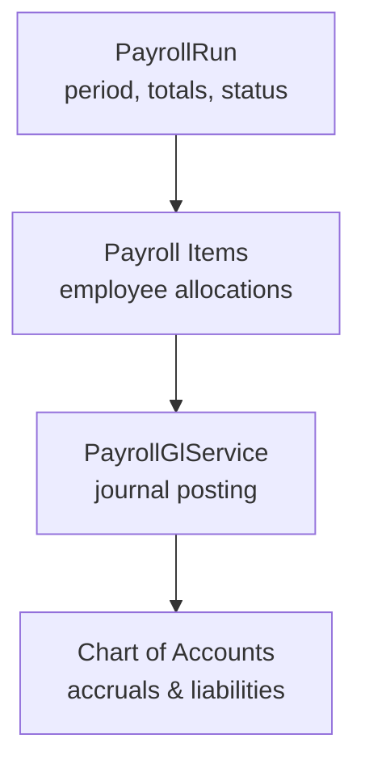
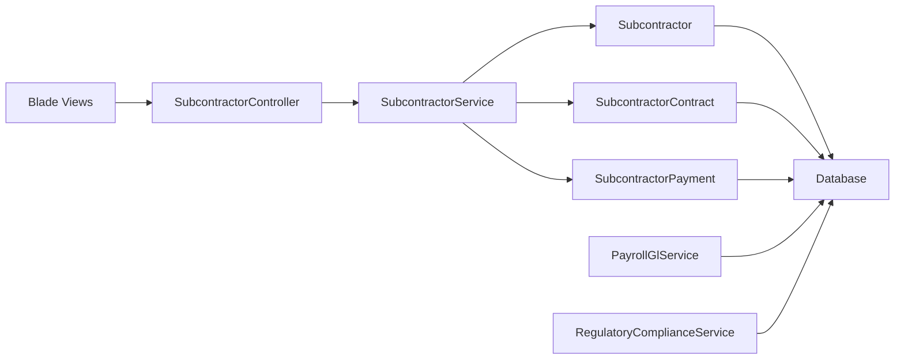

# Subcontractor Management

<cite>
**Referenced Files in This Document**
- [Subcontractor.php](file://app/Models/Subcontractor.php)
- [SubcontractorContract.php](file://app/Models/SubcontractorContract.php)
- [SubcontractorPayment.php](file://app/Models/SubcontractorPayment.php)
- [SubcontractorService.php](file://app/Services/SubcontractorService.php)
- [SubcontractorController.php](file://app/Http/Controllers/Construction/SubcontractorController.php)
- [create_subcontractor_tables.php](file://database/migrations/2026_04_06_050000_create_subcontractor_tables.php)
- [Project.php](file://app/Models/Project.php)
- [ContractActivatedNotification.php](file://app/Notifications/Construction/ContractActivatedNotification.php)
- [index.blade.php](file://resources/views/construction/subcontractors/index.blade.php)
- [PayrollGlService.php](file://app/Services/PayrollGlService.php)
- [create_payroll_tables.php](file://database/migrations/2026_01_01_000020_create_payroll_tables.php)
- [RegulatoryComplianceService.php](file://app/Services/RegulatoryComplianceService.php)
- [2026_01_01_000020_create_payroll_tables.php](file://database/migrations/2026_01_01_000020_create_payroll_tables.php)
</cite>

## Table of Contents
1. [Introduction](#introduction)
2. [Project Structure](#project-structure)
3. [Core Components](#core-components)
4. [Architecture Overview](#architecture-overview)
5. [Detailed Component Analysis](#detailed-component-analysis)
6. [Dependency Analysis](#dependency-analysis)
7. [Performance Considerations](#performance-considerations)
8. [Troubleshooting Guide](#troubleshooting-guide)
9. [Conclusion](#conclusion)
10. [Appendices](#appendices)

## Introduction
This document describes the Subcontractor Management system within the construction domain. It covers the full lifecycle from contractor onboarding and contract management, through performance evaluation and payment processing, to compliance monitoring. It also outlines how subcontractor data integrates with payroll accounting and regulatory reporting capabilities present in the system.

## Project Structure
The Subcontractor Management feature is implemented using Laravel’s MVC pattern with dedicated models, a service layer, and controller actions. Database persistence is handled via migrations that define three core tables: subcontractors, subcontractor_contracts, and subcontractor_payments. Views render lists and forms for managing subcontractors and contracts.



**Diagram sources**
- [SubcontractorController.php:12-174](file://app/Http/Controllers/Construction/SubcontractorController.php#L12-L174)
- [SubcontractorService.php:12-232](file://app/Services/SubcontractorService.php#L12-L232)
- [Subcontractor.php:14-79](file://app/Models/Subcontractor.php#L14-L79)
- [SubcontractorContract.php:14-90](file://app/Models/SubcontractorContract.php#L14-L90)
- [SubcontractorPayment.php:13-52](file://app/Models/SubcontractorPayment.php#L13-L52)
- [create_subcontractor_tables.php:11-87](file://database/migrations/2026_04_06_050000_create_subcontractor_tables.php#L11-L87)
- [index.blade.php:63-79](file://resources/views/construction/subcontractors/index.blade.php#L63-L79)

**Section sources**
- [SubcontractorController.php:12-174](file://app/Http/Controllers/Construction/SubcontractorController.php#L12-L174)
- [SubcontractorService.php:12-232](file://app/Services/SubcontractorService.php#L12-L232)
- [create_subcontractor_tables.php:11-87](file://database/migrations/2026_04_06_050000_create_subcontractor_tables.php#L11-L87)
- [index.blade.php:63-79](file://resources/views/construction/subcontractors/index.blade.php#L63-L79)

## Core Components
- Subcontractor model: Stores contractor profile, license, tax ID, specialization, status, rating, and project counts. Provides relationships to contracts and projects.
- SubcontractorContract model: Stores contract metadata, value, dates, status, payment terms, retention percentage, warranty period, and performance rating. Links to subcontractor and project.
- SubcontractorPayment model: Manages progress billing claims, approvals, retention deductions, net payable, and payment status.
- SubcontractorService: Implements business logic for registration, contract creation/activation, payment claims/approval/payout, and performance summaries.
- SubcontractorController: Exposes endpoints for listing, creating, viewing, activating contracts, and submitting/approving payments.
- Migrations: Define schema and indexes for subcontractor tables.
- Views: Present lists and forms for UI interactions.

**Section sources**
- [Subcontractor.php:14-79](file://app/Models/Subcontractor.php#L14-L79)
- [SubcontractorContract.php:14-90](file://app/Models/SubcontractorContract.php#L14-L90)
- [SubcontractorPayment.php:13-52](file://app/Models/SubcontractorPayment.php#L13-L52)
- [SubcontractorService.php:12-232](file://app/Services/SubcontractorService.php#L12-L232)
- [SubcontractorController.php:12-174](file://app/Http/Controllers/Construction/SubcontractorController.php#L12-L174)
- [create_subcontractor_tables.php:11-87](file://database/migrations/2026_04_06_050000_create_subcontractor_tables.php#L11-L87)

## Architecture Overview
The system follows a layered architecture:
- Presentation: Controller handles HTTP requests and renders views.
- Application: Service encapsulates business workflows.
- Domain: Models represent entities and enforce data casting and relations.
- Persistence: Migrations define relational schema.



**Diagram sources**
- [Subcontractor.php:14-79](file://app/Models/Subcontractor.php#L14-L79)
- [SubcontractorContract.php:14-90](file://app/Models/SubcontractorContract.php#L14-L90)
- [SubcontractorPayment.php:13-52](file://app/Models/SubcontractorPayment.php#L13-L52)
- [SubcontractorService.php:12-232](file://app/Services/SubcontractorService.php#L12-L232)

## Detailed Component Analysis

### Contractor Onboarding
- Registration captures company details, contact info, license, tax ID, specialization, and notes.
- Default status is active, rating starts at zero, and project counter initialized to zero.
- UI filters support specialization and status for listing.



**Diagram sources**
- [SubcontractorController.php:54-72](file://app/Http/Controllers/Construction/SubcontractorController.php#L54-L72)
- [SubcontractorService.php:17-34](file://app/Services/SubcontractorService.php#L17-L34)

**Section sources**
- [SubcontractorController.php:54-72](file://app/Http/Controllers/Construction/SubcontractorController.php#L54-L72)
- [SubcontractorService.php:17-34](file://app/Services/SubcontractorService.php#L17-L34)
- [index.blade.php:63-79](file://resources/views/construction/subcontractors/index.blade.php#L63-L79)

### Contract Management
- Contracts are created with auto-generated contract numbers, scope, value, dates, payment terms, retention percentage, warranty period, and notes.
- Activation transitions status to active and increments the subcontractor’s total project count.
- Contracts link to subcontractors and projects; payments reference contracts.



**Diagram sources**
- [SubcontractorController.php:98-135](file://app/Http/Controllers/Construction/SubcontractorController.php#L98-L135)
- [SubcontractorService.php:39-81](file://app/Services/SubcontractorService.php#L39-L81)
- [SubcontractorContract.php:14-90](file://app/Models/SubcontractorContract.php#L14-L90)

**Section sources**
- [SubcontractorController.php:98-135](file://app/Http/Controllers/Construction/SubcontractorController.php#L98-L135)
- [SubcontractorService.php:39-81](file://app/Services/SubcontractorService.php#L39-L81)
- [create_subcontractor_tables.php:34-55](file://database/migrations/2026_04_06_050000_create_subcontractor_tables.php#L34-L55)

### Performance Evaluation
- Average rating computed from completed contracts with non-null performance ratings.
- Active contracts count derived from contract status.
- Performance summary aggregates financial and metric KPIs for reporting.



**Diagram sources**
- [SubcontractorService.php:156-209](file://app/Services/SubcontractorService.php#L156-L209)
- [Subcontractor.php:69-77](file://app/Models/Subcontractor.php#L69-L77)

**Section sources**
- [SubcontractorService.php:156-209](file://app/Services/SubcontractorService.php#L156-L209)
- [Subcontractor.php:69-77](file://app/Models/Subcontractor.php#L69-L77)

### Payment Processing
- Progress billing claims compute retention and net payable amounts and generate invoice numbers.
- Approval updates approved amount and status; marking as paid sets status and optional payment date.
- Remaining balances and retention amounts are calculable per contract.



**Diagram sources**
- [SubcontractorController.php:140-172](file://app/Http/Controllers/Construction/SubcontractorController.php#L140-L172)
- [SubcontractorService.php:86-151](file://app/Services/SubcontractorService.php#L86-L151)
- [SubcontractorContract.php:69-88](file://app/Models/SubcontractorContract.php#L69-L88)
- [SubcontractorPayment.php:13-52](file://app/Models/SubcontractorPayment.php#L13-L52)

**Section sources**
- [SubcontractorController.php:140-172](file://app/Http/Controllers/Construction/SubcontractorController.php#L140-L172)
- [SubcontractorService.php:86-151](file://app/Services/SubcontractorService.php#L86-L151)
- [SubcontractorContract.php:69-88](file://app/Models/SubcontractorContract.php#L69-L88)
- [SubcontractorPayment.php:13-52](file://app/Models/SubcontractorPayment.php#L13-L52)

### Compliance Monitoring
- The system includes a RegulatoryComplianceService capable of generating compliance reports and tracking checks, findings, and corrective actions.
- While subcontractor qualification tracking, safety training verification, insurance documentation, and bonding requirements are not explicitly modeled in the current schema, the compliance module provides a foundation for integrating such controls and generating compliance reports.



**Diagram sources**
- [RegulatoryComplianceService.php:139-163](file://app/Services/RegulatoryComplianceService.php#L139-L163)

**Section sources**
- [RegulatoryComplianceService.php:139-163](file://app/Services/RegulatoryComplianceService.php#L139-L163)

### Integration with Payroll Systems and Tax Reporting
- Payroll processing is supported by dedicated payroll tables and a Payroll GL service that posts journal entries for gross, deductions, taxes, and BPJS contributions.
- Payroll runs are tracked per period with totals and status, enabling integration with subcontractor payment flows for tax reporting and accruals.



**Diagram sources**
- [create_payroll_tables.php:10-32](file://database/migrations/2026_01_01_000020_create_payroll_tables.php#L10-L32)
- [PayrollGlService.php:49-149](file://app/Services/PayrollGlService.php#L49-L149)

**Section sources**
- [create_payroll_tables.php:10-32](file://database/migrations/2026_01_01_000020_create_payroll_tables.php#L10-L32)
- [PayrollGlService.php:49-149](file://app/Services/PayrollGlService.php#L49-L149)

## Dependency Analysis
- Controller depends on SubcontractorService for business operations.
- Service depends on models for persistence and calculations.
- Models depend on tenant scoping and relationships.
- Views depend on controller-provided data for rendering lists and forms.
- Payroll and compliance services operate independently but can be leveraged for subcontractor-related financial and regulatory reporting.



**Diagram sources**
- [SubcontractorController.php:12-174](file://app/Http/Controllers/Construction/SubcontractorController.php#L12-L174)
- [SubcontractorService.php:12-232](file://app/Services/SubcontractorService.php#L12-L232)
- [Subcontractor.php:14-79](file://app/Models/Subcontractor.php#L14-L79)
- [SubcontractorContract.php:14-90](file://app/Models/SubcontractorContract.php#L14-L90)
- [SubcontractorPayment.php:13-52](file://app/Models/SubcontractorPayment.php#L13-L52)
- [index.blade.php:63-79](file://resources/views/construction/subcontractors/index.blade.php#L63-L79)
- [PayrollGlService.php:49-149](file://app/Services/PayrollGlService.php#L49-L149)
- [RegulatoryComplianceService.php:139-163](file://app/Services/RegulatoryComplianceService.php#L139-L163)

**Section sources**
- [SubcontractorController.php:12-174](file://app/Http/Controllers/Construction/SubcontractorController.php#L12-L174)
- [SubcontractorService.php:12-232](file://app/Services/SubcontractorService.php#L12-L232)
- [index.blade.php:63-79](file://resources/views/construction/subcontractors/index.blade.php#L63-L79)

## Performance Considerations
- Indexes on tenant-scoped fields and status improve filtering and pagination for large datasets.
- Aggregations in performance summaries rely on Eloquent collections; consider database-level rollups for very large portfolios.
- Payment calculations are performed in PHP; ensure appropriate decimal precision and avoid repeated queries by eager-loading related data.

[No sources needed since this section provides general guidance]

## Troubleshooting Guide
- Validation failures: Ensure request payloads match controller validation rules for subcontractor registration, contract creation, and payment claims.
- Authorization: Contract activation requires authorization checks; confirm user permissions for the target contract.
- Notifications: Contract activation triggers notifications; verify email configuration and delivery.
- Payment lifecycle: Confirm statuses transition correctly (pending → approved → paid) and that retention and net payable computations align with contract terms.

**Section sources**
- [SubcontractorController.php:56-66](file://app/Http/Controllers/Construction/SubcontractorController.php#L56-L66)
- [SubcontractorController.php:100-110](file://app/Http/Controllers/Construction/SubcontractorController.php#L100-L110)
- [SubcontractorController.php:142-147](file://app/Http/Controllers/Construction/SubcontractorController.php#L142-L147)
- [SubcontractorController.php:122-135](file://app/Http/Controllers/Construction/SubcontractorController.php#L122-L135)
- [ContractActivatedNotification.php](file://app/Notifications/Construction/ContractActivatedNotification.php)

## Conclusion
The Subcontractor Management system provides a robust foundation for contractor onboarding, contract lifecycle management, performance tracking, and payment processing. Its modular design enables extension for compliance monitoring, safety training verification, insurance documentation, and bonding requirements by leveraging the existing compliance and payroll services.

[No sources needed since this section summarizes without analyzing specific files]

## Appendices

### Data Models Diagram
```mermaid
erDiagram
SUBCONTRACTORS {
bigint id PK
bigint tenant_id FK
string company_name
string contact_person
string phone
string email
text address
string specialization
string license_number
string tax_id
string status
decimal rating
int total_projects
text notes
timestamps created_at, updated_at
}
SUBCONTRACTOR_CONTRACTS {
bigint id PK
bigint tenant_id FK
bigint subcontractor_id FK
bigint project_id FK
string contract_number UK
text scope_of_work
decimal contract_value
date start_date
date end_date
string status
text payment_terms
decimal retention_percentage
int warranty_period_months
decimal performance_rating
text notes
timestamps created_at, updated_at
}
SUBCONTRACTOR_PAYMENTS {
bigint id PK
bigint tenant_id FK
bigint contract_id FK
string invoice_number UK
string billing_period
text work_description
decimal claimed_amount
decimal approved_amount
decimal retention_deducted
decimal net_payable
date payment_date
string status
text remarks
timestamps created_at, updated_at
}
PROJECTS {
bigint id PK
bigint tenant_id FK
string number
string name
text description
string type
string status
date start_date
date end_date
decimal budget
decimal actual_cost
decimal progress
text notes
}
SUBCONTRACTORS ||--o{ SUBCONTRACTOR_CONTRACTS : "has many"
SUBCONTRACTOR_CONTRACTS ||--o{ SUBCONTRACTOR_PAYMENTS : "has many"
PROJECTS ||--o{ SUBCONTRACTOR_CONTRACTS : "linked via FK"
```

**Diagram sources**
- [create_subcontractor_tables.php:13-87](file://database/migrations/2026_04_06_050000_create_subcontractor_tables.php#L13-L87)
- [Project.php:11-82](file://app/Models/Project.php#L11-L82)