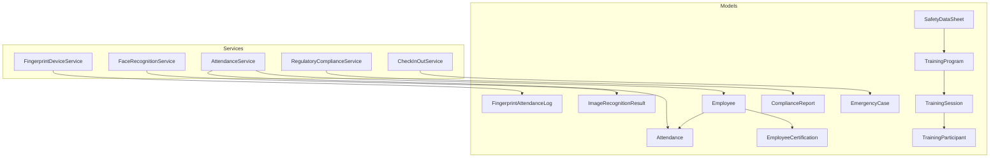
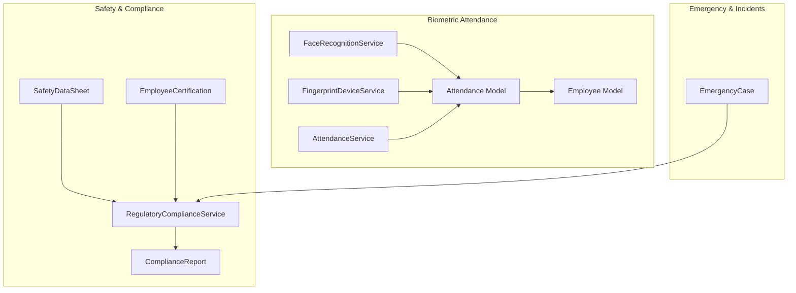
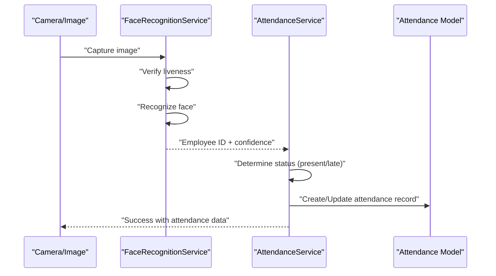
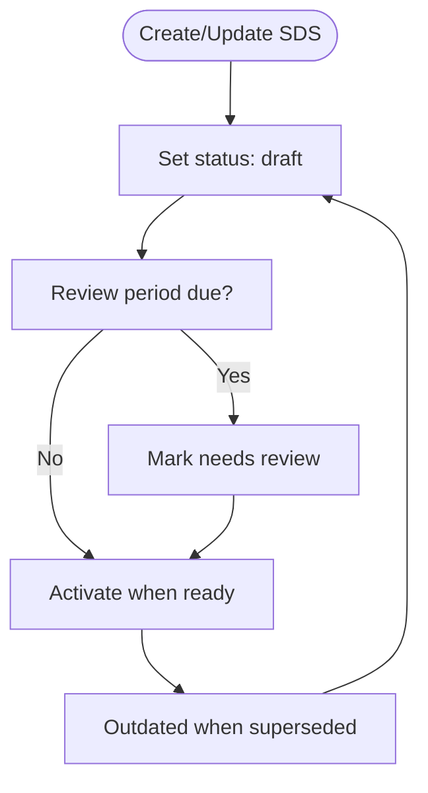
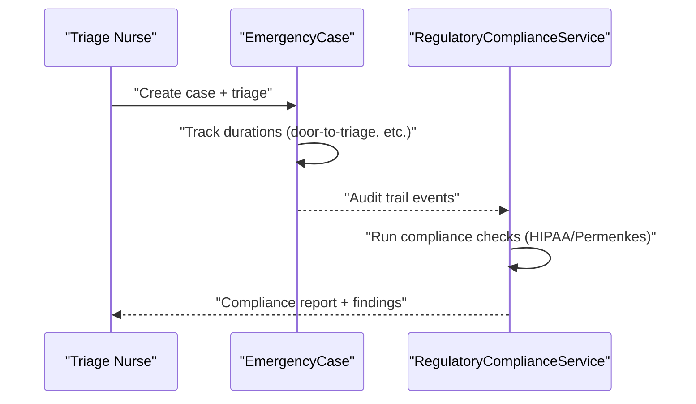
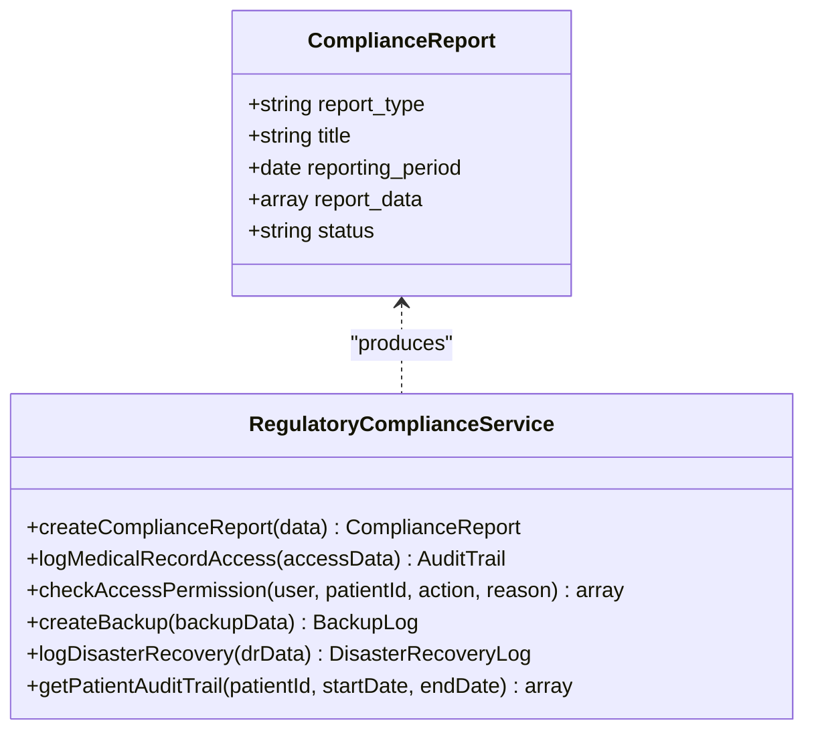
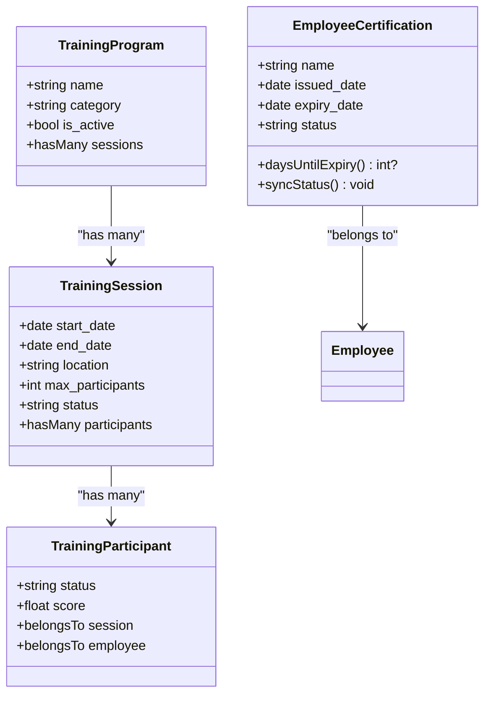
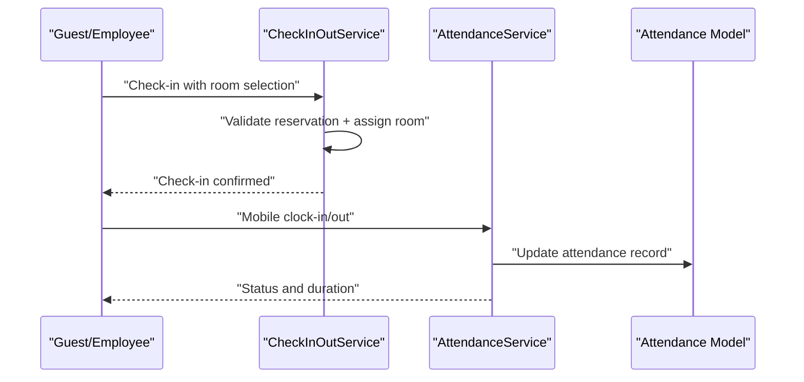
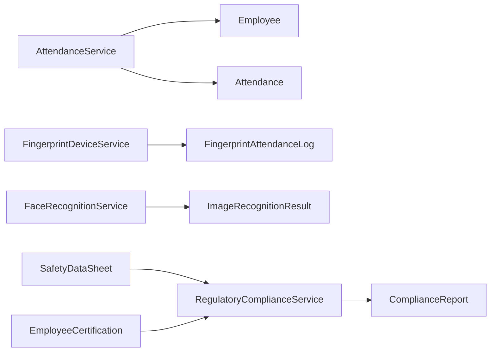

# Workforce & Safety Compliance

<cite>
**Referenced Files in This Document**
- [Attendance.php](file://app/Models/Attendance.php)
- [FingerprintAttendanceLog.php](file://app/Models/FingerprintAttendanceLog.php)
- [ImageRecognitionResult.php](file://app/Models/ImageRecognitionResult.php)
- [Employee.php](file://app/Models/Employee.php)
- [EmployeeCertification.php](file://app/Models/EmployeeCertification.php)
- [SafetyDataSheet.php](file://app/Models/SafetyDataSheet.php)
- [TrainingProgram.php](file://app/Models/TrainingProgram.php)
- [TrainingSession.php](file://app/Models/TrainingSession.php)
- [TrainingParticipant.php](file://app/Models/TrainingParticipant.php)
- [ComplianceReport.php](file://app/Models/ComplianceReport.php)
- [EmergencyCase.php](file://app/Models/EmergencyCase.php)
- [FingerprintDeviceService.php](file://app/Services/FingerprintDeviceService.php)
- [FaceRecognitionService.php](file://app/Services/FaceRecognitionService.php)
- [AttendanceService.php](file://app/Services/AttendanceService.php)
- [CheckInOutService.php](file://app/Services/CheckInOutService.php)
- [RegulatoryComplianceService.php](file://app/Services/RegulatoryComplianceService.php)
</cite>

## Table of Contents
1. [Introduction](#introduction)
2. [Project Structure](#project-structure)
3. [Core Components](#core-components)
4. [Architecture Overview](#architecture-overview)
5. [Detailed Component Analysis](#detailed-component-analysis)
6. [Dependency Analysis](#dependency-analysis)
7. [Performance Considerations](#performance-considerations)
8. [Troubleshooting Guide](#troubleshooting-guide)
9. [Conclusion](#conclusion)
10. [Appendices](#appendices)

## Introduction
This document describes the Workforce and Safety Compliance systems implemented in the codebase. It covers:
- Employee attendance tracking via fingerprint and face recognition
- Safety equipment verification and safety data sheet lifecycle
- Hazard assessment workflows and incident reporting
- Compliance documentation and regulatory reporting
- Integration touchpoints with HR/payroll and regulatory frameworks
- Safety training management, certification tracking, and emergency response
- Mobile check-in/check-out systems, location-based attendance, and real-time compliance dashboards

The goal is to provide a practical, code-backed guide for building, operating, and maintaining these capabilities.

## Project Structure
The Workforce and Safety Compliance domain spans models, services, and supporting components:
- Attendance and biometric models: Attendance, FingerprintAttendanceLog, ImageRecognitionResult
- Employee and HR-related models: Employee, EmployeeCertification
- Safety and compliance models: SafetyDataSheet, TrainingProgram, TrainingSession, TrainingParticipant, ComplianceReport, EmergencyCase
- Services implementing business logic: AttendanceService, FingerprintDeviceService, FaceRecognitionService, CheckInOutService, RegulatoryComplianceService

**Diagram sources**
- [Attendance.php:1-40](file://app/Models/Attendance.php#L1-L40)
- [FingerprintAttendanceLog.php:1-50](file://app/Models/FingerprintAttendanceLog.php#L1-L50)
- [ImageRecognitionResult.php:1-44](file://app/Models/ImageRecognitionResult.php#L1-L44)
- [Employee.php:1-100](file://app/Models/Employee.php#L1-L100)
- [EmployeeCertification.php:1-52](file://app/Models/EmployeeCertification.php#L1-L52)
- [SafetyDataSheet.php:1-126](file://app/Models/SafetyDataSheet.php#L1-L126)
- [TrainingProgram.php:1-27](file://app/Models/TrainingProgram.php#L1-L27)
- [TrainingSession.php:1-34](file://app/Models/TrainingSession.php#L1-L34)
- [TrainingParticipant.php:1-20](file://app/Models/TrainingParticipant.php#L1-L20)
- [ComplianceReport.php:1-45](file://app/Models/ComplianceReport.php#L1-L45)
- [EmergencyCase.php:1-291](file://app/Models/EmergencyCase.php#L1-L291)
- [AttendanceService.php:1-368](file://app/Services/AttendanceService.php#L1-L368)
- [FingerprintDeviceService.php:1-348](file://app/Services/FingerprintDeviceService.php#L1-L348)
- [FaceRecognitionService.php:1-313](file://app/Services/FaceRecognitionService.php#L1-L313)
- [CheckInOutService.php:1-549](file://app/Services/CheckInOutService.php#L1-L549)
- [RegulatoryComplianceService.php:1-581](file://app/Services/RegulatoryComplianceService.php#L1-L581)

**Section sources**
- [Attendance.php:1-40](file://app/Models/Attendance.php#L1-L40)
- [Employee.php:1-100](file://app/Models/Employee.php#L1-L100)
- [FingerprintDeviceService.php:1-348](file://app/Services/FingerprintDeviceService.php#L1-L348)
- [FaceRecognitionService.php:1-313](file://app/Services/FaceRecognitionService.php#L1-L313)
- [AttendanceService.php:1-368](file://app/Services/AttendanceService.php#L1-L368)
- [CheckInOutService.php:1-549](file://app/Services/CheckInOutService.php#L1-L549)
- [RegulatoryComplianceService.php:1-581](file://app/Services/RegulatoryComplianceService.php#L1-L581)

## Core Components
- AttendanceService: Handles clock-in, clock-out, shift-aware status determination, grace period, and overtime calculation with timezone-awareness.
- FingerprintDeviceService: Tests device connectivity, syncs logs, registers/removes fingerprints, and processes attendance logs.
- FaceRecognitionService: Integrates with a Python-based face recognition microservice for liveness verification, face recognition, detection, and camera capture.
- Employee and Attendance models: Store employee metadata, fingerprint identifiers, and daily attendance records with status and durations.
- FingerprintAttendanceLog and ImageRecognitionResult: Track raw biometric scan events and recognition outcomes.
- EmployeeCertification: Tracks certifications, expiry, and status badges.
- SafetyDataSheet: Manages safety data sheets lifecycle (draft, active, outdated) and review triggers.
- TrainingProgram/Session/Participant: Supports training catalog, scheduling, and participant tracking.
- ComplianceReport: Aggregates compliance checks and outcomes for frameworks like HIPAA and Permenkes.
- EmergencyCase: Captures emergency cases with triage levels, durations, and disposition tracking.
- CheckInOutService: Manages hotel-style check-in/check-out workflows (relevant for facility-based attendance and location-based check-ins).

**Section sources**
- [AttendanceService.php:1-368](file://app/Services/AttendanceService.php#L1-L368)
- [FingerprintDeviceService.php:1-348](file://app/Services/FingerprintDeviceService.php#L1-L348)
- [FaceRecognitionService.php:1-313](file://app/Services/FaceRecognitionService.php#L1-L313)
- [Attendance.php:1-40](file://app/Models/Attendance.php#L1-L40)
- [Employee.php:1-100](file://app/Models/Employee.php#L1-L100)
- [FingerprintAttendanceLog.php:1-50](file://app/Models/FingerprintAttendanceLog.php#L1-L50)
- [ImageRecognitionResult.php:1-44](file://app/Models/ImageRecognitionResult.php#L1-L44)
- [EmployeeCertification.php:1-52](file://app/Models/EmployeeCertification.php#L1-L52)
- [SafetyDataSheet.php:1-126](file://app/Models/SafetyDataSheet.php#L1-L126)
- [TrainingProgram.php:1-27](file://app/Models/TrainingProgram.php#L1-L27)
- [TrainingSession.php:1-34](file://app/Models/TrainingSession.php#L1-L34)
- [TrainingParticipant.php:1-20](file://app/Models/TrainingParticipant.php#L1-L20)
- [ComplianceReport.php:1-45](file://app/Models/ComplianceReport.php#L1-L45)
- [EmergencyCase.php:1-291](file://app/Models/EmergencyCase.php#L1-L291)
- [CheckInOutService.php:1-549](file://app/Services/CheckInOutService.php#L1-L549)

## Architecture Overview
The system integrates three primary flows:
- Biometric attendance: FaceRecognitionService and FingerprintDeviceService feed AttendanceService and Attendance models.
- Safety and compliance: SafetyDataSheet and EmployeeCertification support safety workflows; RegulatoryComplianceService generates compliance reports aligned with HIPAA and Permenkes.
- Emergency and incident reporting: EmergencyCase captures triage and outcomes; ComplianceReport stores findings and recommendations.

**Diagram sources**
- [FaceRecognitionService.php:1-313](file://app/Services/FaceRecognitionService.php#L1-L313)
- [FingerprintDeviceService.php:1-348](file://app/Services/FingerprintDeviceService.php#L1-L348)
- [AttendanceService.php:1-368](file://app/Services/AttendanceService.php#L1-L368)
- [Attendance.php:1-40](file://app/Models/Attendance.php#L1-L40)
- [Employee.php:1-100](file://app/Models/Employee.php#L1-L100)
- [SafetyDataSheet.php:1-126](file://app/Models/SafetyDataSheet.php#L1-L126)
- [EmployeeCertification.php:1-52](file://app/Models/EmployeeCertification.php#L1-L52)
- [RegulatoryComplianceService.php:1-581](file://app/Services/RegulatoryComplianceService.php#L1-L581)
- [ComplianceReport.php:1-45](file://app/Models/ComplianceReport.php#L1-L45)
- [EmergencyCase.php:1-291](file://app/Models/EmergencyCase.php#L1-L291)

## Detailed Component Analysis

### Attendance and Biometric Tracking
- Face Recognition Attendance:
  - Liveness verification, face recognition, and optional camera capture are delegated to a Python microservice via FaceRecognitionService.
  - On successful recognition, AttendanceService records clock-in/out with status derived from shift and grace period.
- Fingerprint Attendance:
  - FingerprintDeviceService tests device connectivity, syncs logs, registers/removes fingerprints, and processes logs to update Attendance and Employee records.

**Diagram sources**
- [FaceRecognitionService.php:149-195](file://app/Services/FaceRecognitionService.php#L149-L195)
- [AttendanceService.php:31-110](file://app/Services/AttendanceService.php#L31-L110)
- [Attendance.php:10-40](file://app/Models/Attendance.php#L10-L40)

**Section sources**
- [FaceRecognitionService.php:1-313](file://app/Services/FaceRecognitionService.php#L1-L313)
- [AttendanceService.php:1-368](file://app/Services/AttendanceService.php#L1-L368)
- [Attendance.php:1-40](file://app/Models/Attendance.php#L1-L40)
- [Employee.php:1-100](file://app/Models/Employee.php#L1-L100)
- [FingerprintDeviceService.php:1-348](file://app/Services/FingerprintDeviceService.php#L1-L348)
- [FingerprintAttendanceLog.php:1-50](file://app/Models/FingerprintAttendanceLog.php#L1-L50)
- [ImageRecognitionResult.php:1-44](file://app/Models/ImageRecognitionResult.php#L1-L44)

### Safety Equipment Verification and SDS Lifecycle
- SafetyDataSheet manages product safety documents with status transitions (draft → active → outdated), versioning, and review triggers.
- Integration touchpoints:
  - TrainingProgram/Session/Participant can be used to schedule safety training linked to SDS topics.
  - EmployeeCertification tracks completion and expiry of safety-related credentials.

**Diagram sources**
- [SafetyDataSheet.php:52-90](file://app/Models/SafetyDataSheet.php#L52-L90)
- [TrainingProgram.php:1-27](file://app/Models/TrainingProgram.php#L1-L27)
- [TrainingSession.php:1-34](file://app/Models/TrainingSession.php#L1-L34)
- [TrainingParticipant.php:1-20](file://app/Models/TrainingParticipant.php#L1-L20)
- [EmployeeCertification.php:1-52](file://app/Models/EmployeeCertification.php#L1-L52)

**Section sources**
- [SafetyDataSheet.php:1-126](file://app/Models/SafetyDataSheet.php#L1-L126)
- [TrainingProgram.php:1-27](file://app/Models/TrainingProgram.php#L1-L27)
- [TrainingSession.php:1-34](file://app/Models/TrainingSession.php#L1-L34)
- [TrainingParticipant.php:1-20](file://app/Models/TrainingParticipant.php#L1-L20)
- [EmployeeCertification.php:1-52](file://app/Models/EmployeeCertification.php#L1-L52)

### Hazard Assessment and Incident Reporting
- EmergencyCase captures arrival, triage, treatment, and disposition metrics with triage levels and critical flags.
- RegulatoryComplianceService supports compliance reporting aligned with HIPAA and Permenkes, including audit trails and backup checks.

**Diagram sources**
- [EmergencyCase.php:244-260](file://app/Models/EmergencyCase.php#L244-L260)
- [RegulatoryComplianceService.php:286-370](file://app/Services/RegulatoryComplianceService.php#L286-L370)

**Section sources**
- [EmergencyCase.php:1-291](file://app/Models/EmergencyCase.php#L1-L291)
- [RegulatoryComplianceService.php:1-581](file://app/Services/RegulatoryComplianceService.php#L1-L581)

### Compliance Documentation and Regulatory Reporting
- ComplianceReport aggregates requirement checks, statuses, and scores for selected frameworks.
- RegulatoryComplianceService orchestrates access control logging, anonymization requests, backups, disaster recovery incidents, and audit trail retrieval.

**Diagram sources**
- [ComplianceReport.php:1-45](file://app/Models/ComplianceReport.php#L1-L45)
- [RegulatoryComplianceService.php:139-176](file://app/Services/RegulatoryComplianceService.php#L139-L176)

**Section sources**
- [ComplianceReport.php:1-45](file://app/Models/ComplianceReport.php#L1-L45)
- [RegulatoryComplianceService.php:1-581](file://app/Services/RegulatoryComplianceService.php#L1-L581)

### Safety Training Management and Certification Tracking
- TrainingProgram catalogs courses; TrainingSession schedules sessions; TrainingParticipant enrolls employees and tracks status/scores.
- EmployeeCertification links to training completion and tracks expiry with badge classes.

**Diagram sources**
- [TrainingProgram.php:1-27](file://app/Models/TrainingProgram.php#L1-L27)
- [TrainingSession.php:1-34](file://app/Models/TrainingSession.php#L1-L34)
- [TrainingParticipant.php:1-20](file://app/Models/TrainingParticipant.php#L1-L20)
- [EmployeeCertification.php:1-52](file://app/Models/EmployeeCertification.php#L1-L52)
- [Employee.php:1-100](file://app/Models/Employee.php#L1-L100)

**Section sources**
- [TrainingProgram.php:1-27](file://app/Models/TrainingProgram.php#L1-L27)
- [TrainingSession.php:1-34](file://app/Models/TrainingSession.php#L1-L34)
- [TrainingParticipant.php:1-20](file://app/Models/TrainingParticipant.php#L1-L20)
- [EmployeeCertification.php:1-52](file://app/Models/EmployeeCertification.php#L1-L52)
- [Employee.php:1-100](file://app/Models/Employee.php#L1-L100)

### Mobile Check-in/Check-out and Location-based Attendance
- CheckInOutService coordinates hotel-style check-in/check-out, room assignment, and charge calculations.
- AttendanceService handles clock-in/out with shift-aware status and timezone-aware timestamps.
- FaceRecognitionService and FingerprintDeviceService enable mobile-friendly biometric check-in/check-out.

**Diagram sources**
- [CheckInOutService.php:41-148](file://app/Services/CheckInOutService.php#L41-L148)
- [AttendanceService.php:31-210](file://app/Services/AttendanceService.php#L31-L210)
- [Attendance.php:10-40](file://app/Models/Attendance.php#L10-L40)

**Section sources**
- [CheckInOutService.php:1-549](file://app/Services/CheckInOutService.php#L1-L549)
- [AttendanceService.php:1-368](file://app/Services/AttendanceService.php#L1-L368)
- [Attendance.php:1-40](file://app/Models/Attendance.php#L1-L40)
- [FaceRecognitionService.php:1-313](file://app/Services/FaceRecognitionService.php#L1-L313)
- [FingerprintDeviceService.php:1-348](file://app/Services/FingerprintDeviceService.php#L1-L348)

## Dependency Analysis
- AttendanceService depends on Employee, Attendance, ShiftSchedule, and WorkShift to compute status and overtime.
- FaceRecognitionService and FingerprintDeviceService depend on external microservices and device SDKs respectively.
- RegulatoryComplianceService depends on AuditTrail, BackupLog, DisasterRecoveryLog, and ComplianceReport to produce compliance insights.
- SafetyDataSheet integrates with training and certification workflows to ensure compliance with safety protocols.

**Diagram sources**
- [AttendanceService.php:1-368](file://app/Services/AttendanceService.php#L1-L368)
- [Employee.php:1-100](file://app/Models/Employee.php#L1-L100)
- [Attendance.php:1-40](file://app/Models/Attendance.php#L1-L40)
- [FingerprintDeviceService.php:1-348](file://app/Services/FingerprintDeviceService.php#L1-L348)
- [FingerprintAttendanceLog.php:1-50](file://app/Models/FingerprintAttendanceLog.php#L1-L50)
- [FaceRecognitionService.php:1-313](file://app/Services/FaceRecognitionService.php#L1-L313)
- [ImageRecognitionResult.php:1-44](file://app/Models/ImageRecognitionResult.php#L1-L44)
- [RegulatoryComplianceService.php:1-581](file://app/Services/RegulatoryComplianceService.php#L1-L581)
- [ComplianceReport.php:1-45](file://app/Models/ComplianceReport.php#L1-L45)
- [SafetyDataSheet.php:1-126](file://app/Models/SafetyDataSheet.php#L1-L126)
- [EmployeeCertification.php:1-52](file://app/Models/EmployeeCertification.php#L1-L52)

**Section sources**
- [AttendanceService.php:1-368](file://app/Services/AttendanceService.php#L1-L368)
- [RegulatoryComplianceService.php:1-581](file://app/Services/RegulatoryComplianceService.php#L1-L581)

## Performance Considerations
- Biometric processing:
  - Offload heavy image processing to dedicated microservices (FaceRecognitionService) to avoid blocking the main application.
  - Cache frequently accessed fingerprint templates and face encodings where feasible.
- Attendance computation:
  - Use batch updates for sync operations to minimize database overhead.
  - Index Attendance.date, Attendance.employee_id, and Employee.fingerprint_uid for fast lookups.
- Compliance reporting:
  - Paginate and stream large audit trails; precompute compliance metrics where possible.
- Real-time dashboards:
  - Use background jobs for heavy computations; cache aggregated metrics for dashboard rendering.

## Troubleshooting Guide
- Face recognition failures:
  - Validate camera capture and network connectivity to the Python microservice.
  - Inspect FaceRecognitionService error logs and returned messages.
- Fingerprint device connectivity:
  - Confirm device IP/port configuration and firewall rules.
  - Use FingerprintDeviceService testConnection to diagnose issues.
- Attendance discrepancies:
  - Verify shift schedules and grace periods; confirm timezone settings.
  - Cross-check AttendanceService status derivation against shift start times.
- Compliance report anomalies:
  - Review RegulatoryComplianceService check results and audit trail counts.
  - Ensure backups and DR logs are properly recorded and verified.

**Section sources**
- [FaceRecognitionService.php:57-108](file://app/Services/FaceRecognitionService.php#L57-L108)
- [FingerprintDeviceService.php:17-50](file://app/Services/FingerprintDeviceService.php#L17-L50)
- [AttendanceService.php:311-334](file://app/Services/AttendanceService.php#L311-L334)
- [RegulatoryComplianceService.php:286-370](file://app/Services/RegulatoryComplianceService.php#L286-L370)

## Conclusion
The Workforce and Safety Compliance subsystems leverage modular services and robust models to support:
- Reliable biometric attendance via face and fingerprint
- Safety lifecycle management with SDS and certifications
- Comprehensive compliance reporting aligned with HIPAA and Permenkes
- Emergency case tracking and audit-ready workflows
- Practical integration points for HR/payroll and regulatory submissions

Extending these capabilities involves adding device integrations, enhancing training workflows, and enriching compliance checks with additional regulatory frameworks.

## Appendices
- Integration touchpoints:
  - HR/Payroll: AttendanceService and Attendance model provide core time and attendance data for payroll runs.
  - Regulatory reporting: RegulatoryComplianceService produces standardized reports consumable by compliance teams.
- Mobile UX:
  - FaceRecognitionService captureFromCamera enables mobile check-in/out experiences.
  - CheckInOutService supports facility-based check-ins for location-aware attendance.