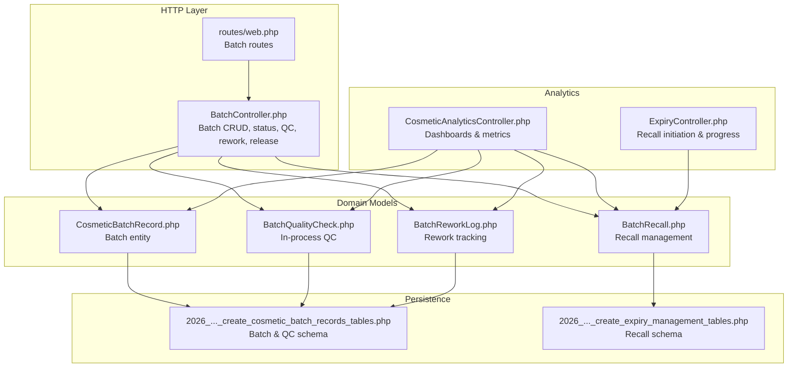
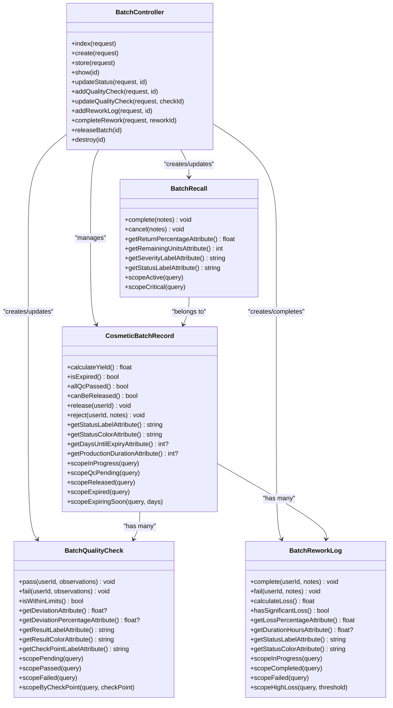
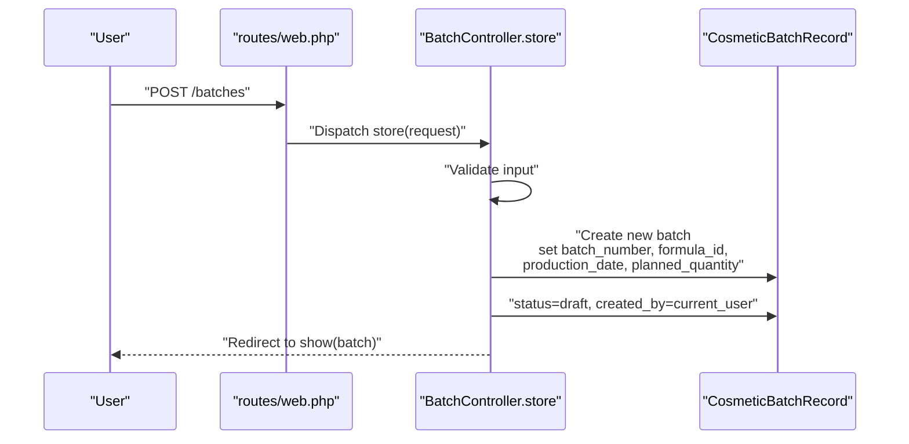
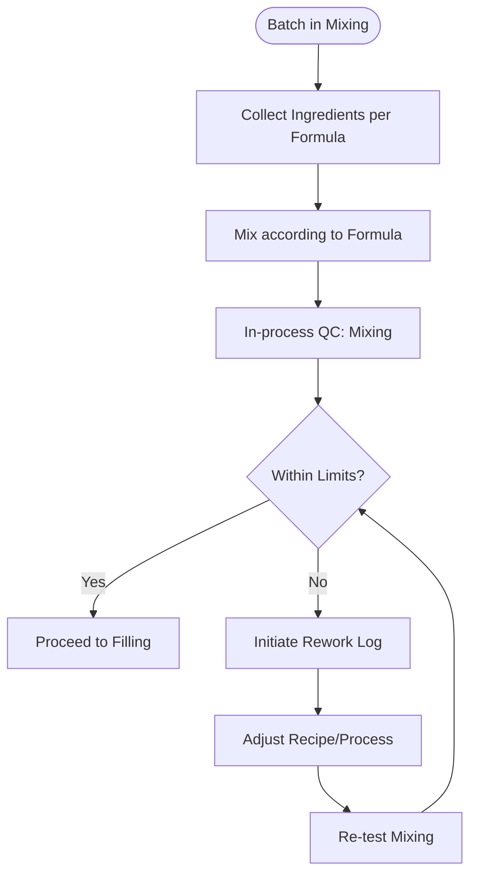
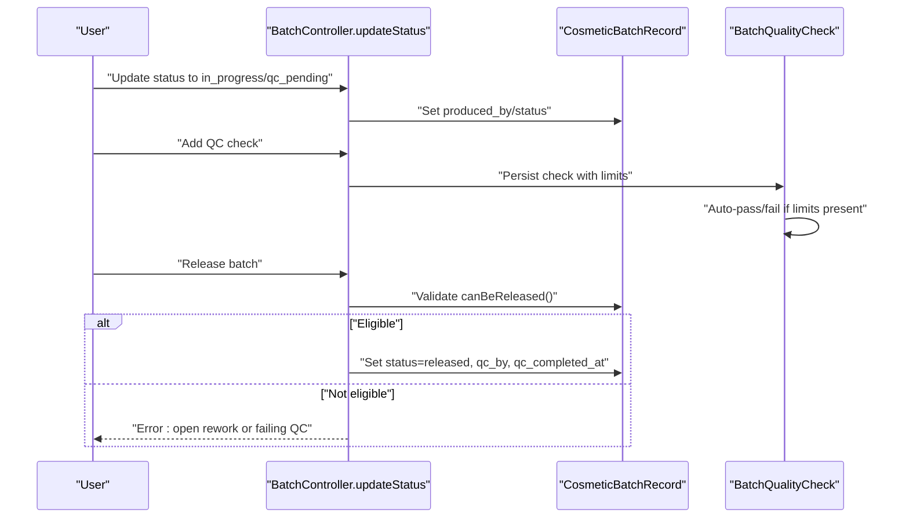
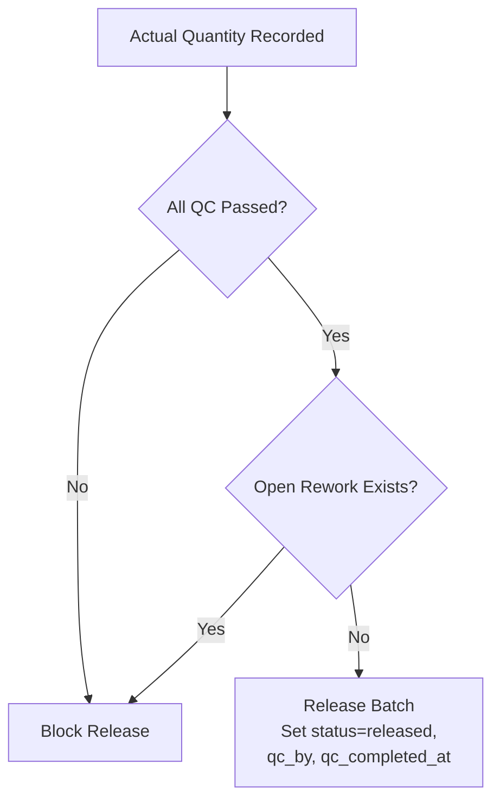
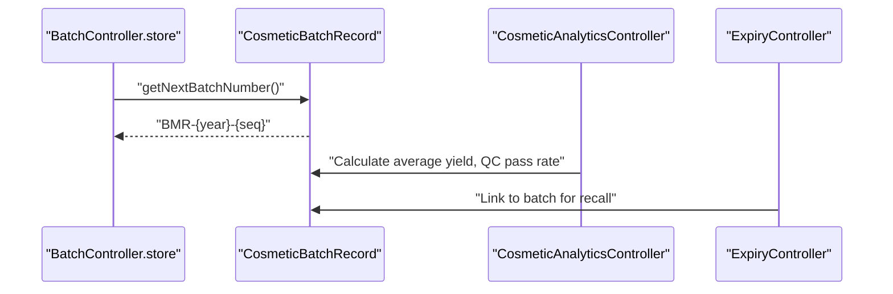
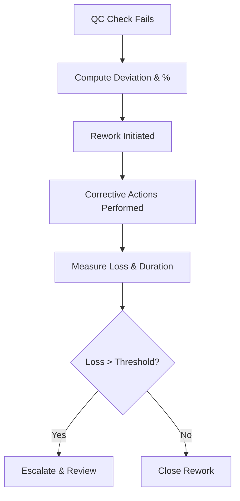
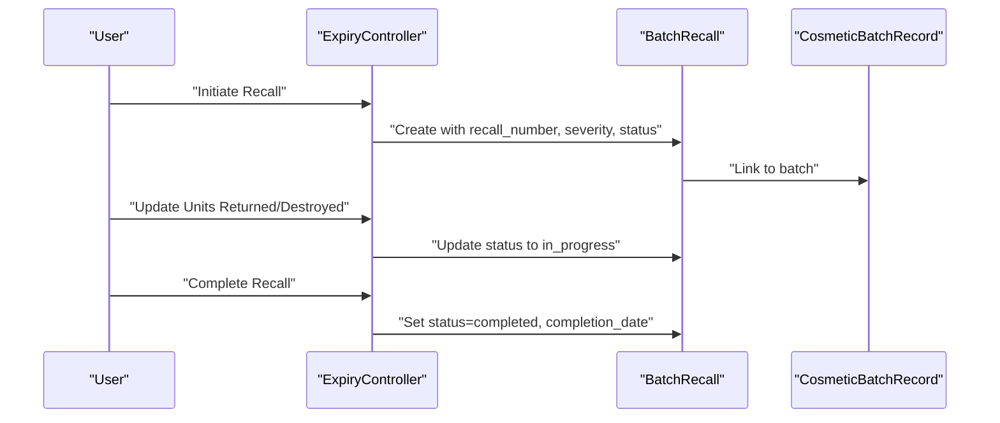
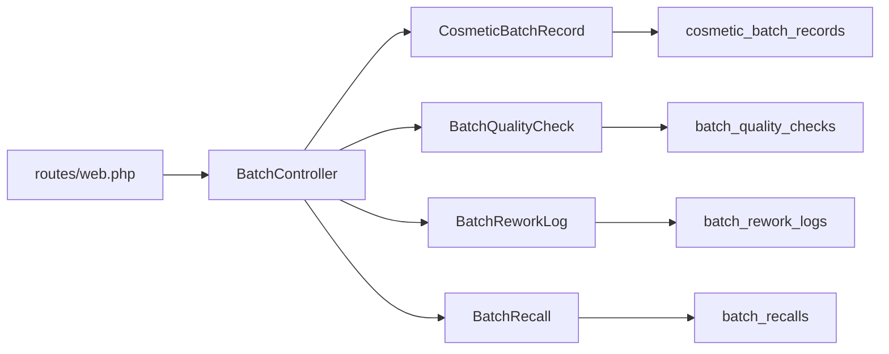

# Batch Production Tracking

<cite>
**Referenced Files in This Document**
- [BatchController.php](file://app/Http/Controllers/Cosmetic/BatchController.php)
- [CosmeticBatchRecord.php](file://app/Models/CosmeticBatchRecord.php)
- [BatchQualityCheck.php](file://app/Models/BatchQualityCheck.php)
- [BatchReworkLog.php](file://app/Models/BatchReworkLog.php)
- [BatchRecall.php](file://app/Models/BatchRecall.php)
- [web.php](file://routes/web.php)
- [2026_04_07_140000_create_cosmetic_batch_records_tables.php](file://database/migrations/2026_04_07_140000_create_cosmetic_batch_records_tables.php)
- [2026_04_07_190000_create_expiry_management_tables.php](file://database/migrations/2026_04_07_190000_create_expiry_management_tables.php)
- [CosmeticAnalyticsController.php](file://app/Http/Controllers/Cosmetic/CosmeticAnalyticsController.php)
- [ExpiryController.php](file://app/Http/Controllers/Cosmetic/ExpiryController.php)
- [WorkOrder.php](file://app/Models/WorkOrder.php)
</cite>

## Table of Contents
1. [Introduction](#introduction)
2. [Project Structure](#project-structure)
3. [Core Components](#core-components)
4. [Architecture Overview](#architecture-overview)
5. [Detailed Component Analysis](#detailed-component-analysis)
6. [Dependency Analysis](#dependency-analysis)
7. [Performance Considerations](#performance-considerations)
8. [Troubleshooting Guide](#troubleshooting-guide)
9. [Conclusion](#conclusion)
10. [Appendices](#appendices)

## Introduction
This document describes the Batch Production Tracking system for cosmetic products within the qalcuityERP platform. It covers end-to-end workflows from batch creation and production scheduling to raw material allocation, mixing and in-process quality checks, rework, batch release, and finished goods inspection. It also documents batch record keeping, lot numbering, expiration and recall management, traceability, and corrective actions. While the system is implemented for cosmetic batches, the underlying architecture and data models can be extended to support pharmaceutical products with appropriate regulatory adaptations.

## Project Structure
The Batch Production Tracking system is centered around:
- A dedicated controller for cosmetic batch lifecycle management
- Core domain models for batch records, quality checks, rework logs, and recalls
- Routing endpoints for batch operations
- Database migrations defining the schema for batch records, QC checks, rework logs, and recalls
- Analytics and expiry/recall controllers for monitoring and traceability

**Diagram sources**
- [web.php:979-992](file://routes/web.php#L979-L992)
- [BatchController.php:1-355](file://app/Http/Controllers/Cosmetic/BatchController.php#L1-L355)
- [CosmeticBatchRecord.php:1-312](file://app/Models/CosmeticBatchRecord.php#L1-L312)
- [BatchQualityCheck.php:1-218](file://app/Models/BatchQualityCheck.php#L1-L218)
- [BatchReworkLog.php:1-227](file://app/Models/BatchReworkLog.php#L1-L227)
- [BatchRecall.php:1-129](file://app/Models/BatchRecall.php#L1-L129)
- [2026_04_07_140000_create_cosmetic_batch_records_tables.php:26-49](file://database/migrations/2026_04_07_140000_create_cosmetic_batch_records_tables.php#L26-L49)
- [2026_04_07_190000_create_expiry_management_tables.php:36-51](file://database/migrations/2026_04_07_190000_create_expiry_management_tables.php#L36-L51)
- [CosmeticAnalyticsController.php:1-424](file://app/Http/Controllers/Cosmetic/CosmeticAnalyticsController.php#L1-L424)
- [ExpiryController.php:96-132](file://app/Http/Controllers/Cosmetic/ExpiryController.php#L96-L132)

**Section sources**
- [web.php:979-992](file://routes/web.php#L979-L992)
- [BatchController.php:1-355](file://app/Http/Controllers/Cosmetic/BatchController.php#L1-L355)
- [CosmeticBatchRecord.php:1-312](file://app/Models/CosmeticBatchRecord.php#L1-L312)
- [BatchQualityCheck.php:1-218](file://app/Models/BatchQualityCheck.php#L1-L218)
- [BatchReworkLog.php:1-227](file://app/Models/BatchReworkLog.php#L1-L227)
- [BatchRecall.php:1-129](file://app/Models/BatchRecall.php#L1-L129)
- [2026_04_07_140000_create_cosmetic_batch_records_tables.php:26-49](file://database/migrations/2026_04_07_140000_create_cosmetic_batch_records_tables.php#L26-L49)
- [2026_04_07_190000_create_expiry_management_tables.php:36-51](file://database/migrations/2026_04_07_190000_create_expiry_management_tables.php#L36-L51)
- [CosmeticAnalyticsController.php:1-424](file://app/Http/Controllers/Cosmetic/CosmeticAnalyticsController.php#L1-L424)
- [ExpiryController.php:96-132](file://app/Http/Controllers/Cosmetic/ExpiryController.php#L96-L132)

## Core Components
- BatchController: Orchestrates batch lifecycle operations including creation, status updates, adding quality checks, adding rework logs, completing rework, and releasing batches.
- CosmeticBatchRecord: Central entity representing a batch with attributes such as batch number, planned/actual quantities, yield percentage, expiry date, status, and timestamps. Provides helpers for status checks, yield calculation, expiry checks, and release eligibility.
- BatchQualityCheck: Represents in-process quality checks at defined check points (mixing, filling, packaging, final). Stores target/actual values, limits, inspector, observations, and result.
- BatchReworkLog: Tracks corrective actions taken during batch production, including reasons, actions, quantities before/after, loss calculations, duration, and status.
- BatchRecall: Manages product recall events linked to a batch, including recall number, reason, severity, affected regions, progress tracking, and resolution notes.
- Routes: Define endpoints for batch listing, creation, viewing, status updates, QC operations, rework operations, and release.

Key capabilities:
- Batch creation with auto-generated batch numbers
- Production scheduling via planned vs. actual quantities and yield calculation
- In-process quality checkpoints with pass/fail determination
- Rework initiation, tracking, and completion with loss quantification
- Batch release gating on QC pass and absence of open rework
- Recall initiation and progress tracking with recovery metrics

**Section sources**
- [BatchController.php:17-355](file://app/Http/Controllers/Cosmetic/BatchController.php#L17-L355)
- [CosmeticBatchRecord.php:16-312](file://app/Models/CosmeticBatchRecord.php#L16-L312)
- [BatchQualityCheck.php:13-218](file://app/Models/BatchQualityCheck.php#L13-L218)
- [BatchReworkLog.php:13-227](file://app/Models/BatchReworkLog.php#L13-L227)
- [BatchRecall.php:17-129](file://app/Models/BatchRecall.php#L17-L129)
- [web.php:979-992](file://routes/web.php#L979-L992)

## Architecture Overview
The system follows a layered MVC pattern:
- HTTP routing defines endpoints for batch operations
- Controllers coordinate requests, validate inputs, and orchestrate model operations
- Models encapsulate business logic, validations, and persistence
- Migrations define relational schemas for batch records, QC checks, rework logs, and recalls
- Analytics and expiry controllers extend functionality for dashboards and recall management

**Diagram sources**
- [BatchController.php:1-355](file://app/Http/Controllers/Cosmetic/BatchController.php#L1-L355)
- [CosmeticBatchRecord.php:1-312](file://app/Models/CosmeticBatchRecord.php#L1-L312)
- [BatchQualityCheck.php:1-218](file://app/Models/BatchQualityCheck.php#L1-L218)
- [BatchReworkLog.php:1-227](file://app/Models/BatchReworkLog.php#L1-L227)
- [BatchRecall.php:1-129](file://app/Models/BatchRecall.php#L1-L129)

## Detailed Component Analysis

### Batch Creation and Production Scheduling
- Creation endpoint validates formula, dates, and quantities; auto-generates batch number; sets initial status to draft.
- Production scheduling is supported by planned vs. actual quantities and yield calculation.
- Expiry date is stored per batch; helpers compute days until expiry and whether expired.

**Diagram sources**
- [web.php](file://routes/web.php#L983)
- [BatchController.php:85-114](file://app/Http/Controllers/Cosmetic/BatchController.php#L85-L114)
- [CosmeticBatchRecord.php:212-217](file://app/Models/CosmeticBatchRecord.php#L212-L217)

**Section sources**
- [BatchController.php:85-114](file://app/Http/Controllers/Cosmetic/BatchController.php#L85-L114)
- [CosmeticBatchRecord.php:149-161](file://app/Models/CosmeticBatchRecord.php#L149-L161)
- [CosmeticBatchRecord.php:166-185](file://app/Models/CosmeticBatchRecord.php#L166-L185)

### Raw Material Allocation and Mixing Procedures
- The system tracks batch formulas and ingredients via the associated formula relationship.
- In-process quality checks are modeled at check points (mixing, filling, packaging, final), enabling targeted testing during mixing and subsequent steps.
- Actual quantities and limits drive pass/fail determinations for QC checks.

**Diagram sources**
- [BatchController.php:119-144](file://app/Http/Controllers/Cosmetic/BatchController.php#L119-L144)
- [BatchQualityCheck.php:115-123](file://app/Models/BatchQualityCheck.php#L115-L123)
- [BatchReworkLog.php:160-184](file://app/Models/BatchReworkLog.php#L160-L184)

**Section sources**
- [BatchController.php:119-144](file://app/Http/Controllers/Cosmetic/BatchController.php#L119-L144)
- [BatchQualityCheck.php:115-123](file://app/Models/BatchQualityCheck.php#L115-L123)
- [BatchReworkLog.php:160-184](file://app/Models/BatchReworkLog.php#L160-L184)

### In-Process Testing and Batch Completion
- QC checks capture target/actual values and limits; pass/fail is determined automatically when limits are provided.
- Batch status transitions to QC pending after production; release requires all QC checks to pass and no open rework.
- Yield percentage is calculated from actual/planned quantities.

**Diagram sources**
- [BatchController.php:149-187](file://app/Http/Controllers/Cosmetic/BatchController.php#L149-L187)
- [BatchController.php:192-258](file://app/Http/Controllers/Cosmetic/BatchController.php#L192-L258)
- [BatchController.php:319-335](file://app/Http/Controllers/Cosmetic/BatchController.php#L319-L335)
- [CosmeticBatchRecord.php:235-257](file://app/Models/CosmeticBatchRecord.php#L235-L257)
- [BatchQualityCheck.php:155-176](file://app/Models/BatchQualityCheck.php#L155-L176)

**Section sources**
- [BatchController.php:149-187](file://app/Http/Controllers/Cosmetic/BatchController.php#L149-L187)
- [BatchController.php:192-258](file://app/Http/Controllers/Cosmetic/BatchController.php#L192-L258)
- [BatchController.php:319-335](file://app/Http/Controllers/Cosmetic/BatchController.php#L319-L335)
- [CosmeticBatchRecord.php:235-257](file://app/Models/CosmeticBatchRecord.php#L235-L257)
- [BatchQualityCheck.php:155-176](file://app/Models/BatchQualityCheck.php#L155-L176)

### Batch Release and Finished Goods Inspection
- Release is gated by actual quantity recorded, all QC checks passing, and no open rework.
- On release, the QC inspector and completion timestamp are recorded.

**Diagram sources**
- [CosmeticBatchRecord.php:235-257](file://app/Models/CosmeticBatchRecord.php#L235-L257)
- [BatchController.php:319-335](file://app/Http/Controllers/Cosmetic/BatchController.php#L319-L335)

**Section sources**
- [CosmeticBatchRecord.php:235-257](file://app/Models/CosmeticBatchRecord.php#L235-L257)
- [BatchController.php:319-335](file://app/Http/Controllers/Cosmetic/BatchController.php#L319-L335)

### Batch Record Keeping, Lot Numbering, and Expiration
- Batch numbers are auto-generated with a standardized format including year and sequential counter.
- Expiry date is tracked per batch; helpers compute days until expiry and whether expired.
- Expiration alerts and analytics are integrated via dedicated controllers and models.

**Diagram sources**
- [CosmeticBatchRecord.php:212-217](file://app/Models/CosmeticBatchRecord.php#L212-L217)
- [CosmeticAnalyticsController.php:25-424](file://app/Http/Controllers/Cosmetic/CosmeticAnalyticsController.php#L25-L424)
- [ExpiryController.php:96-132](file://app/Http/Controllers/Cosmetic/ExpiryController.php#L96-L132)

**Section sources**
- [CosmeticBatchRecord.php:212-217](file://app/Models/CosmeticBatchRecord.php#L212-L217)
- [CosmeticAnalyticsController.php:25-424](file://app/Http/Controllers/Cosmetic/CosmeticAnalyticsController.php#L25-L424)
- [ExpiryController.php:96-132](file://app/Http/Controllers/Cosmetic/ExpiryController.php#L96-L132)

### Production Deviations and Corrective Actions
- Deviations are captured in QC checks via target/actual comparisons and deviation calculations.
- Rework logs track corrective actions, quantify losses, and measure durations.
- Significant loss thresholds trigger escalation signals.

**Diagram sources**
- [BatchQualityCheck.php:128-149](file://app/Models/BatchQualityCheck.php#L128-L149)
- [BatchReworkLog.php:106-147](file://app/Models/BatchReworkLog.php#L106-L147)
- [BatchReworkLog.php:132-135](file://app/Models/BatchReworkLog.php#L132-L135)

**Section sources**
- [BatchQualityCheck.php:128-149](file://app/Models/BatchQualityCheck.php#L128-L149)
- [BatchReworkLog.php:106-147](file://app/Models/BatchReworkLog.php#L106-L147)
- [BatchReworkLog.php:132-135](file://app/Models/BatchReworkLog.php#L132-L135)

### Batch Traceability, Recall Procedures, and Disposition Decisions
- Each recall is uniquely numbered and linked to a batch, capturing reason, severity, affected regions, and progress.
- Recall progress includes units returned, destroyed, and remaining units; completion closes the recall with resolution notes.
- Disposition decisions are inferred from release eligibility and recall outcomes.

**Diagram sources**
- [ExpiryController.php:96-132](file://app/Http/Controllers/Cosmetic/ExpiryController.php#L96-L132)
- [BatchRecall.php:64-105](file://app/Models/BatchRecall.php#L64-L105)
- [BatchRecall.php:119-128](file://app/Models/BatchRecall.php#L119-L128)

**Section sources**
- [ExpiryController.php:96-132](file://app/Http/Controllers/Cosmetic/ExpiryController.php#L96-L132)
- [BatchRecall.php:64-105](file://app/Models/BatchRecall.php#L64-L105)
- [BatchRecall.php:119-128](file://app/Models/BatchRecall.php#L119-L128)

### Extension to Pharmaceutical Products
- The existing WorkOrder model demonstrates broader manufacturing concepts (start/completion timestamps, materials reserved/consumed flags, outputs, operations) that can inform pharma workflows.
- For pharmaceutical compliance, consider adding:
  - Master Production Records (MPR)
  - Batch documentation attachments
  - Regulatory audit trail enhancements
  - Additional QC templates and standards
  - Sterility, potency, and stability testing integrations

**Section sources**
- [WorkOrder.php:50-96](file://app/Models/WorkOrder.php#L50-L96)

## Dependency Analysis
- Controllers depend on models for business logic and persistence.
- Models encapsulate validations, calculations, and enumerations for statuses/results.
- Routes bind HTTP endpoints to controller actions.
- Migrations define foreign keys and indexes supporting tenant scoping and performance.

**Diagram sources**
- [web.php:979-992](file://routes/web.php#L979-L992)
- [BatchController.php:1-355](file://app/Http/Controllers/Cosmetic/BatchController.php#L1-L355)
- [CosmeticBatchRecord.php:1-312](file://app/Models/CosmeticBatchRecord.php#L1-L312)
- [BatchQualityCheck.php:1-218](file://app/Models/BatchQualityCheck.php#L1-L218)
- [BatchReworkLog.php:1-227](file://app/Models/BatchReworkLog.php#L1-L227)
- [BatchRecall.php:1-129](file://app/Models/BatchRecall.php#L1-L129)
- [2026_04_07_140000_create_cosmetic_batch_records_tables.php:26-49](file://database/migrations/2026_04_07_140000_create_cosmetic_batch_records_tables.php#L26-L49)
- [2026_04_07_190000_create_expiry_management_tables.php:36-51](file://database/migrations/2026_04_07_190000_create_expiry_management_tables.php#L36-L51)

**Section sources**
- [web.php:979-992](file://routes/web.php#L979-L992)
- [BatchController.php:1-355](file://app/Http/Controllers/Cosmetic/BatchController.php#L1-L355)
- [CosmeticBatchRecord.php:1-312](file://app/Models/CosmeticBatchRecord.php#L1-L312)
- [BatchQualityCheck.php:1-218](file://app/Models/BatchQualityCheck.php#L1-L218)
- [BatchReworkLog.php:1-227](file://app/Models/BatchReworkLog.php#L1-L227)
- [BatchRecall.php:1-129](file://app/Models/BatchRecall.php#L1-L129)
- [2026_04_07_140000_create_cosmetic_batch_records_tables.php:26-49](file://database/migrations/2026_04_07_140000_create_cosmetic_batch_records_tables.php#L26-L49)
- [2026_04_07_190000_create_expiry_management_tables.php:36-51](file://database/migrations/2026_04_07_190000_create_expiry_management_tables.php#L36-L51)

## Performance Considerations
- Indexes on tenant_id, status, formula_id, batch_number, and date ranges improve filtering and reporting performance.
- Pagination is used in batch listing to limit result sets.
- Calculations for yield, deviations, and loss percentages are computed on demand; caching or denormalized fields can be considered for heavy analytics workloads.

[No sources needed since this section provides general guidance]

## Troubleshooting Guide
Common issues and resolutions:
- Batch cannot be released: Verify actual quantity is recorded, all QC checks have passed, and no open rework exists.
- QC check not auto-marked: Ensure lower/upper limits and actual value are provided so pass/fail logic can evaluate.
- Rework completion loss missing: Confirm quantity_after is set; loss is calculated as difference and saved.
- Recall progress not updating: Ensure units_returned and units_destroyed are within valid ranges and status transitions are applied.

**Section sources**
- [CosmeticBatchRecord.php:235-257](file://app/Models/CosmeticBatchRecord.php#L235-L257)
- [BatchQualityCheck.php:220-224](file://app/Models/BatchQualityCheck.php#L220-L224)
- [BatchReworkLog.php:306-308](file://app/Models/BatchReworkLog.php#L306-L308)
- [ExpiryController.php:114-132](file://app/Http/Controllers/Cosmetic/ExpiryController.php#L114-L132)

## Conclusion
The Batch Production Tracking system provides a robust foundation for managing cosmetic batch lifecycles, from creation and scheduling to quality assurance, rework, and release. Its modular design supports extension to pharmaceutical contexts with minimal adjustments to accommodate stricter regulatory requirements while preserving traceability, recall readiness, and disposition decision-making.

[No sources needed since this section summarizes without analyzing specific files]

## Appendices

### API and Endpoint Reference
- List batches: GET /batches
- Create batch: POST /batches
- View batch: GET /batches/{id}
- Update batch status: POST /batches/{id}/status
- Add quality check: POST /batches/{id}/quality-check
- Update quality check: POST /batches/quality-check/{checkId}
- Add rework log: POST /batches/{id}/rework
- Complete rework: POST /batches/rework/{reworkId}/complete
- Release batch: POST /batches/{id}/release
- Delete batch: DELETE /batches/{id}

**Section sources**
- [web.php:979-992](file://routes/web.php#L979-L992)