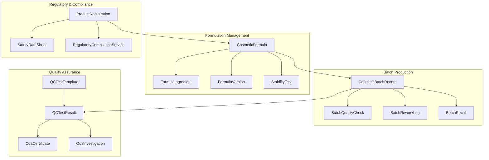
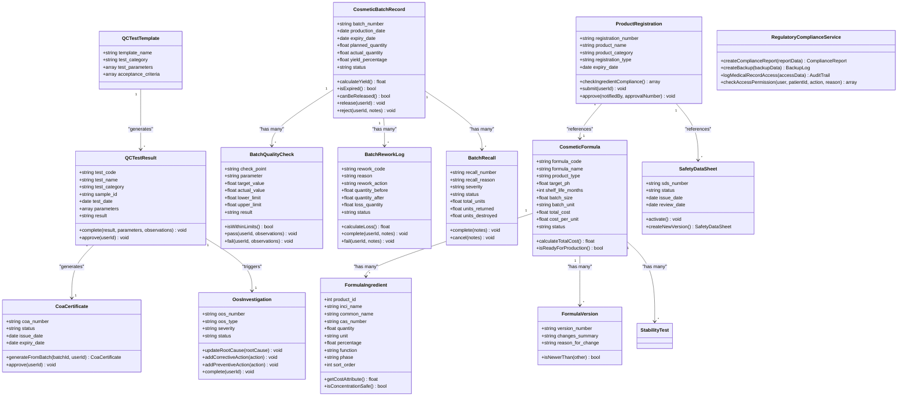
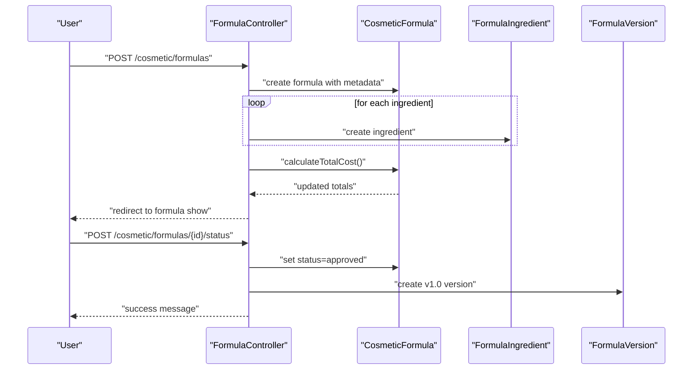
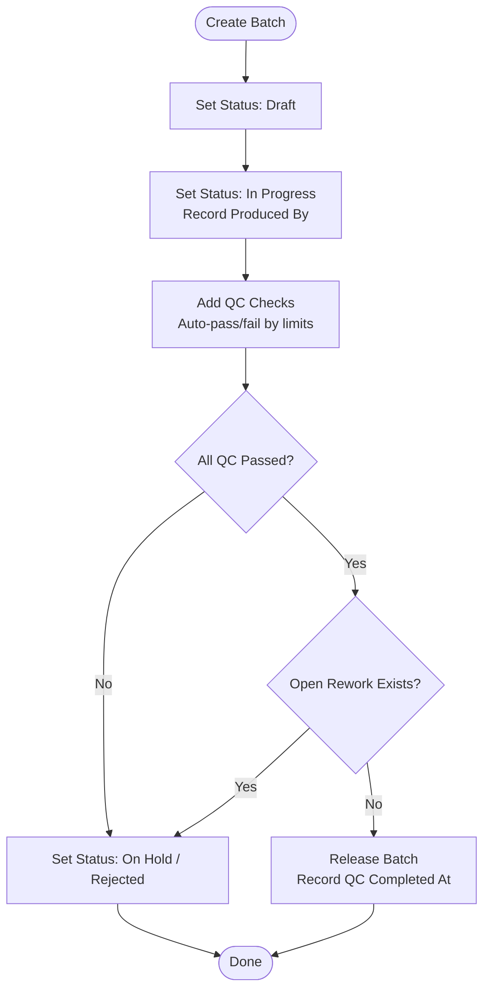
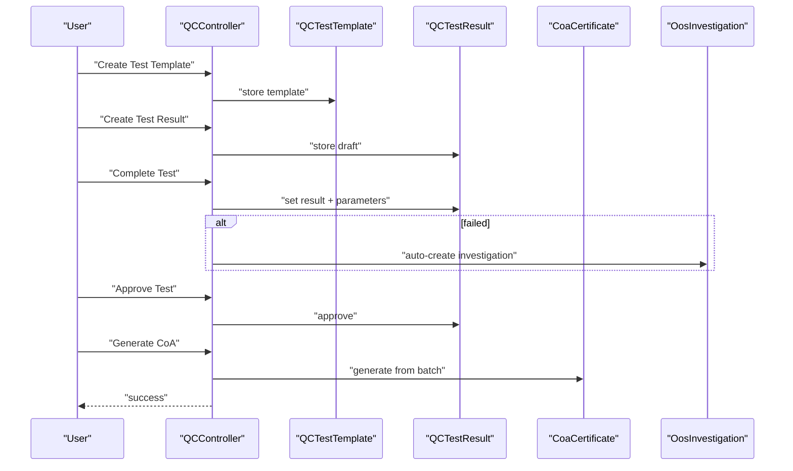
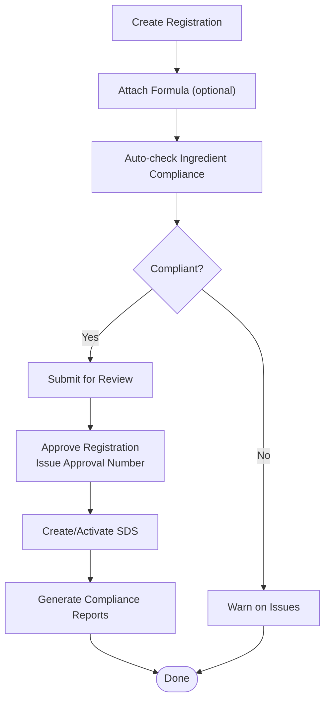
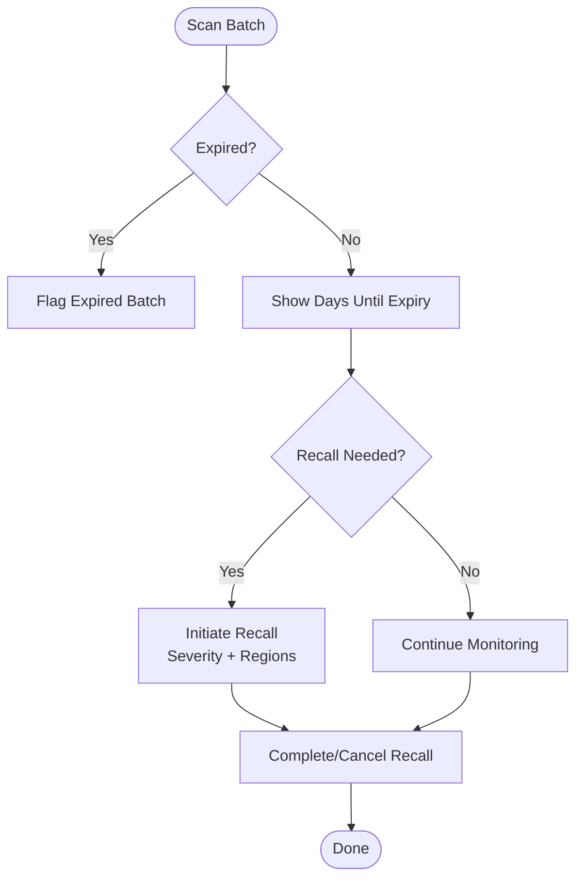
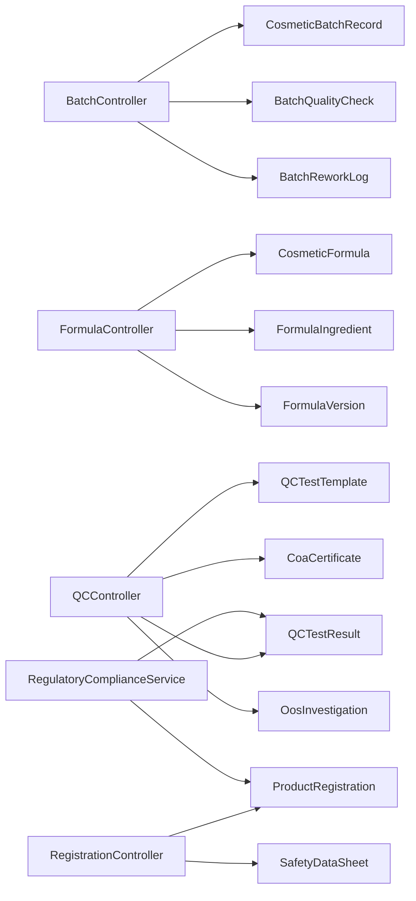

# Cosmetic & Pharmaceutical Module

<cite>
**Referenced Files in This Document**
- [CosmeticBatchRecord.php](file://app/Models/CosmeticBatchRecord.php)
- [CosmeticFormula.php](file://app/Models/CosmeticFormula.php)
- [FormulaIngredient.php](file://app/Models/FormulaIngredient.php)
- [FormulaVersion.php](file://app/Models/FormulaVersion.php)
- [BatchQualityCheck.php](file://app/Models/BatchQualityCheck.php)
- [BatchReworkLog.php](file://app/Models/BatchReworkLog.php)
- [BatchRecall.php](file://app/Models/BatchRecall.php)
- [BatchController.php](file://app/Http/Controllers/Cosmetic/BatchController.php)
- [FormulaController.php](file://app/Http/Controllers/Cosmetic/FormulaController.php)
- [QCController.php](file://app/Http/Controllers/Cosmetic/QCController.php)
- [RegistrationController.php](file://app/Http/Controllers/Cosmetic/RegistrationController.php)
- [RegulatoryComplianceService.php](file://app/Services/RegulatoryComplianceService.php)
</cite>

## Table of Contents
1. [Introduction](#introduction)
2. [Project Structure](#project-structure)
3. [Core Components](#core-components)
4. [Architecture Overview](#architecture-overview)
5. [Detailed Component Analysis](#detailed-component-analysis)
6. [Dependency Analysis](#dependency-analysis)
7. [Performance Considerations](#performance-considerations)
8. [Troubleshooting Guide](#troubleshooting-guide)
9. [Conclusion](#conclusion)

## Introduction
This document describes the Cosmetic & Pharmaceutical Module within the qalcuityERP system. It focuses on product formulation management, batch production tracking, quality control testing, regulatory compliance, expiration date management, ingredient tracking, and Good Manufacturing Practice (GMP) compliance. It also covers product registration processes, safety data sheet management, stability testing, batch release procedures, and regulatory reporting requirements. Finally, it addresses cosmetic labeling compliance, pharmaceutical quality assurance, and supply chain traceability for both industries.

## Project Structure
The module is organized around Laravel Eloquent models representing domain entities and controller actions orchestrating workflows. Key areas include:
- Formulation lifecycle: creation, approval, versioning, stability testing
- Batch lifecycle: creation, production, QC checks, rework, release, recall
- Quality assurance: test templates, test results, certificates of analysis (CoA), out-of-specification investigations
- Regulatory and compliance: registration tracking, safety data sheets, compliance reports
- Expiration and traceability: batch expiry calculation, status scoping, and audit-ready attributes

**Diagram sources**
- [CosmeticFormula.php:12-239](file://app/Models/CosmeticFormula.php#L12-L239)
- [FormulaIngredient.php:10-199](file://app/Models/FormulaIngredient.php#L10-L199)
- [FormulaVersion.php:10-105](file://app/Models/FormulaVersion.php#L10-L105)
- [CosmeticBatchRecord.php:12-312](file://app/Models/CosmeticBatchRecord.php#L12-L312)
- [BatchQualityCheck.php:10-218](file://app/Models/BatchQualityCheck.php#L10-L218)
- [BatchReworkLog.php:10-227](file://app/Models/BatchReworkLog.php#L10-L227)
- [BatchRecall.php:12-129](file://app/Models/BatchRecall.php#L12-L129)
- [QCController.php:13-301](file://app/Http/Controllers/Cosmetic/QCController.php#L13-L301)
- [RegistrationController.php:13-251](file://app/Http/Controllers/Cosmetic/RegistrationController.php#L13-L251)
- [RegulatoryComplianceService.php:17-581](file://app/Services/RegulatoryComplianceService.php#L17-L581)

**Section sources**
- [BatchController.php:12-355](file://app/Http/Controllers/Cosmetic/BatchController.php#L12-L355)
- [FormulaController.php:13-308](file://app/Http/Controllers/Cosmetic/FormulaController.php#L13-L308)
- [QCController.php:13-301](file://app/Http/Controllers/Cosmetic/QCController.php#L13-L301)
- [RegistrationController.php:13-251](file://app/Http/Controllers/Cosmetic/RegistrationController.php#L13-L251)
- [RegulatoryComplianceService.php:17-581](file://app/Services/RegulatoryComplianceService.php#L17-L581)

## Core Components
- Formulation lifecycle: creation, approval, versioning, stability testing, and readiness checks
- Batch lifecycle: creation, production, QC checkpoints, rework tracking, release gating, and recall management
- Quality assurance: standardized test templates, test execution, certificate generation, and OOS investigations
- Regulatory and compliance: product registration tracking, ingredient restrictions, safety data sheets, and compliance reporting
- Expiration and traceability: batch expiry calculation, status scoping, and audit-ready attributes

**Section sources**
- [CosmeticFormula.php:12-239](file://app/Models/CosmeticFormula.php#L12-L239)
- [FormulaIngredient.php:10-199](file://app/Models/FormulaIngredient.php#L10-L199)
- [FormulaVersion.php:10-105](file://app/Models/FormulaVersion.php#L10-L105)
- [CosmeticBatchRecord.php:12-312](file://app/Models/CosmeticBatchRecord.php#L12-L312)
- [BatchQualityCheck.php:10-218](file://app/Models/BatchQualityCheck.php#L10-L218)
- [BatchReworkLog.php:10-227](file://app/Models/BatchReworkLog.php#L10-L227)
- [BatchRecall.php:12-129](file://app/Models/BatchRecall.php#L12-L129)
- [QCController.php:13-301](file://app/Http/Controllers/Cosmetic/QCController.php#L13-L301)
- [RegistrationController.php:13-251](file://app/Http/Controllers/Cosmetic/RegistrationController.php#L13-L251)
- [RegulatoryComplianceService.php:17-581](file://app/Services/RegulatoryComplianceService.php#L17-L581)

## Architecture Overview
The module follows a layered MVC pattern with strong separation of concerns:
- Controllers orchestrate user actions and delegate to model/business logic
- Models encapsulate domain entities, relationships, validations, and helper methods
- Services provide cross-cutting capabilities (e.g., regulatory compliance)
- Views render dashboards and forms for batch, formula, QC, and registration workflows

**Diagram sources**
- [CosmeticFormula.php:12-239](file://app/Models/CosmeticFormula.php#L12-L239)
- [FormulaIngredient.php:10-199](file://app/Models/FormulaIngredient.php#L10-L199)
- [FormulaVersion.php:10-105](file://app/Models/FormulaVersion.php#L10-L105)
- [CosmeticBatchRecord.php:12-312](file://app/Models/CosmeticBatchRecord.php#L12-L312)
- [BatchQualityCheck.php:10-218](file://app/Models/BatchQualityCheck.php#L10-L218)
- [BatchReworkLog.php:10-227](file://app/Models/BatchReworkLog.php#L10-L227)
- [BatchRecall.php:12-129](file://app/Models/BatchRecall.php#L12-L129)
- [QCController.php:13-301](file://app/Http/Controllers/Cosmetic/QCController.php#L13-L301)
- [RegistrationController.php:13-251](file://app/Http/Controllers/Cosmetic/RegistrationController.php#L13-L251)
- [RegulatoryComplianceService.php:17-581](file://app/Services/RegulatoryComplianceService.php#L17-L581)

## Detailed Component Analysis

### Formulation Management
- Creation and metadata: name, type, brand, target pH, shelf life, batch size/unit, notes
- Ingredients: INCI/common names, CAS numbers, quantities, units, percentages, function, phase, sort order
- Costing: automatic total cost and per-unit cost calculation from ingredients
- Approval and versioning: status transitions, initial version creation upon approval
- Stability testing: initiation and completion with acceptance criteria
- Readiness checks: approval, ingredients presence, measured pH, passing stability test

**Diagram sources**
- [FormulaController.php:13-308](file://app/Http/Controllers/Cosmetic/FormulaController.php#L13-L308)
- [CosmeticFormula.php:12-239](file://app/Models/CosmeticFormula.php#L12-L239)
- [FormulaIngredient.php:10-199](file://app/Models/FormulaIngredient.php#L10-L199)
- [FormulaVersion.php:10-105](file://app/Models/FormulaVersion.php#L10-L105)

**Section sources**
- [FormulaController.php:13-308](file://app/Http/Controllers/Cosmetic/FormulaController.php#L13-L308)
- [CosmeticFormula.php:12-239](file://app/Models/CosmeticFormula.php#L12-L239)
- [FormulaIngredient.php:10-199](file://app/Models/FormulaIngredient.php#L10-L199)
- [FormulaVersion.php:10-105](file://app/Models/FormulaVersion.php#L10-L105)

### Batch Production Tracking
- Creation: batch number generation, production date, expiry date, planned quantity
- Status transitions: draft → in_progress → qc_pending → released/rejected/on_hold
- Yield calculation: actual vs planned quantity
- Expiration: expiry date checks and days-to-expiry attribute
- Release gating: requires actual quantity, all QC passed, no open rework

**Diagram sources**
- [BatchController.php:12-355](file://app/Http/Controllers/Cosmetic/BatchController.php#L12-L355)
- [CosmeticBatchRecord.php:12-312](file://app/Models/CosmeticBatchRecord.php#L12-L312)
- [BatchQualityCheck.php:10-218](file://app/Models/BatchQualityCheck.php#L10-L218)
- [BatchReworkLog.php:10-227](file://app/Models/BatchReworkLog.php#L10-L227)

**Section sources**
- [BatchController.php:12-355](file://app/Http/Controllers/Cosmetic/BatchController.php#L12-L355)
- [CosmeticBatchRecord.php:12-312](file://app/Models/CosmeticBatchRecord.php#L12-L312)

### Quality Control Testing
- Templates: reusable test categories, parameters, acceptance criteria
- Results: execution with parameters, pass/fail/inconclusive, auto-OOS creation on failure
- Certificates of Analysis: batch-derived CoA generation and approval
- OOS investigations: root cause, corrective/preventive actions, completion

**Diagram sources**
- [QCController.php:13-301](file://app/Http/Controllers/Cosmetic/QCController.php#L13-L301)
- [BatchQualityCheck.php:10-218](file://app/Models/BatchQualityCheck.php#L10-L218)

**Section sources**
- [QCController.php:13-301](file://app/Http/Controllers/Cosmetic/QCController.php#L13-L301)

### Regulatory Compliance and Product Registration
- Product registration: registration number, product name, category, type, expiry, submission/approval
- Ingredient restrictions: banned/restricted/limited lists with max limits and regulation references
- Safety data sheets: hazard statements, precautionary measures, first aid/fire fighting, handling/storage, activation and versioning
- Compliance reporting: HIPAA/Permenkes checks, audit trails, backups, disaster recovery logging

**Diagram sources**
- [RegistrationController.php:13-251](file://app/Http/Controllers/Cosmetic/RegistrationController.php#L13-L251)
- [RegulatoryComplianceService.php:17-581](file://app/Services/RegulatoryComplianceService.php#L17-L581)

**Section sources**
- [RegistrationController.php:13-251](file://app/Http/Controllers/Cosmetic/RegistrationController.php#L13-L251)
- [RegulatoryComplianceService.php:17-581](file://app/Services/RegulatoryComplianceService.php#L17-L581)

### Expiration Date Management and Traceability
- Batch expiry: expiry date field, isExpired(), days until expiry
- Status scoping: in_progress, qc_pending, released, expired, expiring soon
- Batch recall: severity levels, return/destroyed metrics, completion/cancellation
- Audit-ready attributes: timestamps, user references, status labels/colors

**Diagram sources**
- [CosmeticBatchRecord.php:12-312](file://app/Models/CosmeticBatchRecord.php#L12-L312)
- [BatchRecall.php:12-129](file://app/Models/BatchRecall.php#L12-L129)

**Section sources**
- [CosmeticBatchRecord.php:12-312](file://app/Models/CosmeticBatchRecord.php#L12-L312)
- [BatchRecall.php:12-129](file://app/Models/BatchRecall.php#L12-L129)

### Ingredient Tracking and Safety
- Ingredient functions/phases: emollient, preservative, active, fragrance, emulsifier, thickener, humectant, surfactant, colorant, solvent, pH adjuster, antioxidant
- Concentration safety thresholds per function
- CAS number linking for traceability
- Cost attribution via linked products

**Section sources**
- [FormulaIngredient.php:10-199](file://app/Models/FormulaIngredient.php#L10-L199)

## Dependency Analysis
- Controllers depend on models for persistence and business logic
- Models encapsulate relationships, validations, and helper methods
- Services provide cross-domain compliance and reporting capabilities
- Tight coupling is minimized through clear method contracts and Eloquent relationships

**Diagram sources**
- [BatchController.php:12-355](file://app/Http/Controllers/Cosmetic/BatchController.php#L12-L355)
- [FormulaController.php:13-308](file://app/Http/Controllers/Cosmetic/FormulaController.php#L13-L308)
- [QCController.php:13-301](file://app/Http/Controllers/Cosmetic/QCController.php#L13-L301)
- [RegistrationController.php:13-251](file://app/Http/Controllers/Cosmetic/RegistrationController.php#L13-L251)
- [RegulatoryComplianceService.php:17-581](file://app/Services/RegulatoryComplianceService.php#L17-L581)

**Section sources**
- [BatchController.php:12-355](file://app/Http/Controllers/Cosmetic/BatchController.php#L12-L355)
- [FormulaController.php:13-308](file://app/Http/Controllers/Cosmetic/FormulaController.php#L13-L308)
- [QCController.php:13-301](file://app/Http/Controllers/Cosmetic/QCController.php#L13-L301)
- [RegistrationController.php:13-251](file://app/Http/Controllers/Cosmetic/RegistrationController.php#L13-L251)
- [RegulatoryComplianceService.php:17-581](file://app/Services/RegulatoryComplianceService.php#L17-L581)

## Performance Considerations
- Use pagination for large datasets (e.g., batches, tests, registrations)
- Leverage Eloquent relationships with eager loading to avoid N+1 queries
- Apply scopes for filtering and sorting to reduce controller logic
- Cache frequently accessed configuration data (e.g., ingredient restrictions)
- Index database columns used in filters (status, formula_id, batch_number, test_code)

## Troubleshooting Guide
Common issues and resolutions:
- Batch cannot be released: verify actual quantity is recorded, all QC checks passed, and no open rework
- QC result not calculated: ensure limits and actual values are set; pass/fail determined automatically when limits are present
- Formula cost mismatch: recalculate total cost after ingredient updates
- SDS not activating: ensure proper status transitions and versioning
- Compliance report errors: confirm required checks and data availability for selected framework

**Section sources**
- [CosmeticBatchRecord.php:234-257](file://app/Models/CosmeticBatchRecord.php#L234-L257)
- [BatchQualityCheck.php:114-123](file://app/Models/BatchQualityCheck.php#L114-L123)
- [FormulaController.php:138-140](file://app/Http/Controllers/Cosmetic/FormulaController.php#L138-L140)
- [RegistrationController.php:228-249](file://app/Http/Controllers/Cosmetic/RegistrationController.php#L228-L249)
- [RegulatoryComplianceService.php:284-297](file://app/Services/RegulatoryComplianceService.php#L284-L297)

## Conclusion
The Cosmetic & Pharmaceutical Module provides a robust foundation for managing formulations, batch production, quality control, regulatory compliance, and traceability. Its modular design supports scalability, maintainability, and adherence to industry standards, enabling efficient operations across both cosmetic and pharmaceutical domains.