# Distribution & Packaging

<cite>
**Referenced Files in This Document**
- [2026_04_07_200000_create_distribution_channels_tables.php](file://database/migrations/2026_04_07_200000_create_distribution_channels_tables.php)
- [2026_04_06_070000_create_integration_tables.php](file://database/migrations/2026_04_06_070000_create_integration_tables.php)
- [2026_04_07_150000_create_qc_laboratory_tables.php](file://database/migrations/2026_04_07_150000_create_qc_laboratory_tables.php)
- [DistributionChannel.php](file://app/Models/DistributionChannel.php)
- [ChannelPricing.php](file://app/Models/ChannelPricing.php)
- [ChannelInventory.php](file://app/Models/ChannelInventory.php)
- [ChannelSalesPerformance.php](file://app/Models/ChannelSalesPerformance.php)
- [LogisticsProvider.php](file://app/Models/LogisticsProvider.php)
- [Shipment.php](file://app/Models/Shipment.php)
- [PackagingMaterial.php](file://app/Models/PackagingMaterial.php)
- [LabelVersion.php](file://app/Models/LabelVersion.php)
- [LabelComplianceCheck.php](file://app/Models/LabelComplianceCheck.php)
- [QCTestTemplate.php](file://app/Models/QCTestTemplate.php)
- [QCTestResult.php](file://app/Models/QCTestResult.php)
- [CoaCertificate.php](file://app/Models/CoaCertificate.php)
- [OosInvestigation.php](file://app/Models/OosInvestigation.php)
- [LogisticsTrackingService.php](file://app/Services/Integrations/LogisticsTrackingService.php)
- [PackagingController.php](file://app/Http/Controllers/Cosmetic/PackagingController.php)
- [index.blade.php (Packaging Materials)](file://resources/views/cosmetic/packaging/index.blade.php)
- [label-show.blade.php](file://resources/views/cosmetic/packaging/label-show.blade.php)
- [index.blade.php (QC)](file://resources/views/cosmetic/qc/index.blade.php)
- [templates.blade.php](file://resources/views/cosmetic/qc/templates.blade.php)
- [bin-label.blade.php](file://resources/views/wms/bin-label.blade.php)
- [avery.blade.php](file://resources/views/products/labels/avery.blade.php)
</cite>

## Table of Contents
1. [Introduction](#introduction)
2. [Project Structure](#project-structure)
3. [Core Components](#core-components)
4. [Architecture Overview](#architecture-overview)
5. [Detailed Component Analysis](#detailed-component-analysis)
6. [Dependency Analysis](#dependency-analysis)
7. [Performance Considerations](#performance-considerations)
8. [Troubleshooting Guide](#troubleshooting-guide)
9. [Conclusion](#conclusion)
10. [Appendices](#appendices)

## Introduction
This document describes the Distribution and Packaging subsystems implemented in the repository. It covers:
- Packaging design requirements and material selection criteria
- Packaging validation via labeling and compliance checks
- Distribution channel management, pricing, inventory, and sales performance
- Logistics coordination and supply chain tracking
- Quality control and compliance for both cosmetic and pharmaceutical contexts
- Labeling standards, barcoding, and retail presentation

The goal is to provide a practical, code-backed guide for building, validating, and operating robust distribution and packaging workflows.

## Project Structure
The Distribution and Packaging domain spans database schemas, models, controllers, services, and views:
- Database migrations define distribution channels, channel pricing, channel inventory, channel sales performance, logistics providers, and shipments
- Models encapsulate business logic for channels, pricing, inventory, sales, logistics, packaging materials, labels, QC templates/results, COA certificates, and OOS investigations
- Controllers orchestrate UI flows for packaging materials and labeling
- Services integrate with logistics providers for shipment creation and tracking
- Views render packaging dashboards, label compliance pages, QC templates/tests, and printable labels

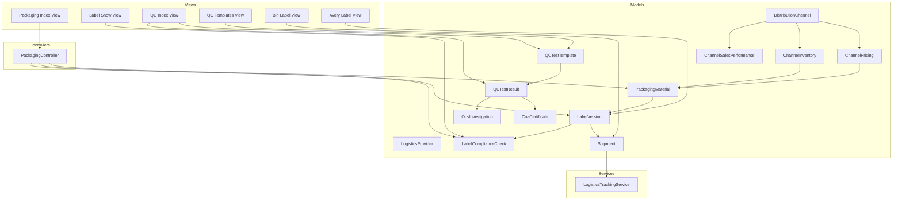

**Diagram sources**
- [2026_04_07_200000_create_distribution_channels_tables.php:11-101](file://database/migrations/2026_04_07_200000_create_distribution_channels_tables.php#L11-L101)
- [2026_04_06_070000_create_integration_tables.php:125-149](file://database/migrations/2026_04_06_070000_create_integration_tables.php#L125-L149)
- [2026_04_07_150000_create_qc_laboratory_tables.php:31-49](file://database/migrations/2026_04_07_150000_create_qc_laboratory_tables.php#L31-L49)
- [DistributionChannel.php:12-52](file://app/Models/DistributionChannel.php#L12-L52)
- [ChannelPricing.php:11-75](file://app/Models/ChannelPricing.php#L11-L75)
- [ChannelInventory.php:11-81](file://app/Models/ChannelInventory.php#L11-L81)
- [ChannelSalesPerformance.php:11-95](file://app/Models/ChannelSalesPerformance.php#L11-L95)
- [LogisticsProvider.php:10-39](file://app/Models/LogisticsProvider.php#L10-L39)
- [Shipment.php:10-49](file://app/Models/Shipment.php#L10-L49)
- [PackagingMaterial.php:12-106](file://app/Models/PackagingMaterial.php#L12-L106)
- [LabelVersion.php:13-167](file://app/Models/LabelVersion.php#L13-L167)
- [LabelComplianceCheck.php:11-124](file://app/Models/LabelComplianceCheck.php#L11-L124)
- [QCTestTemplate.php:13-97](file://app/Models/QCTestTemplate.php#L13-L97)
- [QCTestResult.php:177-216](file://app/Models/QCTestResult.php#L177-L216)
- [CoaCertificate.php:12-165](file://app/Models/CoaCertificate.php#L12-L165)
- [OosInvestigation.php:12-189](file://app/Models/OosInvestigation.php#L12-L189)
- [LogisticsTrackingService.php:10-41](file://app/Services/Integrations/LogisticsTrackingService.php#L10-L41)
- [PackagingController.php:13-29](file://app/Http/Controllers/Cosmetic/PackagingController.php#L13-L29)
- [index.blade.php (Packaging Materials):1-278](file://resources/views/cosmetic/packaging/index.blade.php#L1-L278)
- [label-show.blade.php:182-199](file://resources/views/cosmetic/packaging/label-show.blade.php#L182-L199)
- [index.blade.php (QC):177-196](file://resources/views/cosmetic/qc/index.blade.php#L177-L196)
- [templates.blade.php:98-116](file://resources/views/cosmetic/qc/templates.blade.php#L98-L116)
- [bin-label.blade.php:51-113](file://resources/views/wms/bin-label.blade.php#L51-L113)
- [avery.blade.php:101-117](file://resources/views/products/labels/avery.blade.php#L101-L117)

**Section sources**
- [2026_04_07_200000_create_distribution_channels_tables.php:11-101](file://database/migrations/2026_04_07_200000_create_distribution_channels_tables.php#L11-L101)
- [2026_04_06_070000_create_integration_tables.php:125-149](file://database/migrations/2026_04_06_070000_create_integration_tables.php#L125-L149)
- [2026_04_07_150000_create_qc_laboratory_tables.php:31-49](file://database/migrations/2026_04_07_150000_create_qc_laboratory_tables.php#L31-L49)
- [PackagingController.php:13-29](file://app/Http/Controllers/Cosmetic/PackagingController.php#L13-L29)
- [index.blade.php (Packaging Materials):1-278](file://resources/views/cosmetic/packaging/index.blade.php#L1-L278)

## Core Components
- Distribution Channels: manage channel types, contact info, commission/discount rates, and lifecycle
- Channel Pricing: maintain base vs channel-specific pricing, MOQ, bulk discounts, and validity windows
- Channel Inventory: allocate, reserve, sell, and track available stock per channel
- Channel Sales Performance: daily aggregation of sales, units, commissions, discounts, and net revenue
- Logistics Providers: configure carriers, credentials, and defaults
- Shipments: create, track, and update shipment status with history and delivery timestamps
- Packaging Materials: categorize materials (primary/secondary/tertiary), supplier, cost, dimensions, recyclability
- Labeling and Compliance: label versions with effective/expiry dates, approval workflow, and compliance checks
- Quality Control: templates and results for tests, COA generation, and OOS investigations
- Services: logistics integration for shipment creation and tracking

**Section sources**
- [DistributionChannel.php:12-52](file://app/Models/DistributionChannel.php#L12-L52)
- [ChannelPricing.php:11-75](file://app/Models/ChannelPricing.php#L11-L75)
- [ChannelInventory.php:11-81](file://app/Models/ChannelInventory.php#L11-L81)
- [ChannelSalesPerformance.php:11-95](file://app/Models/ChannelSalesPerformance.php#L11-L95)
- [LogisticsProvider.php:10-39](file://app/Models/LogisticsProvider.php#L10-L39)
- [Shipment.php:10-49](file://app/Models/Shipment.php#L10-L49)
- [PackagingMaterial.php:12-106](file://app/Models/PackagingMaterial.php#L12-L106)
- [LabelVersion.php:13-167](file://app/Models/LabelVersion.php#L13-L167)
- [LabelComplianceCheck.php:11-124](file://app/Models/LabelComplianceCheck.php#L11-L124)
- [QCTestTemplate.php:13-97](file://app/Models/QCTestTemplate.php#L13-L97)
- [QCTestResult.php:177-216](file://app/Models/QCTestResult.php#L177-L216)
- [CoaCertificate.php:12-165](file://app/Models/CoaCertificate.php#L12-L165)
- [OosInvestigation.php:12-189](file://app/Models/OosInvestigation.php#L12-L189)
- [LogisticsTrackingService.php:10-41](file://app/Services/Integrations/LogisticsTrackingService.php#L10-L41)

## Architecture Overview
The system integrates distribution, packaging, and logistics through cohesive models and services:
- Distribution channels connect to pricing, inventory, and sales performance
- Packaging materials feed label versions and compliance checks
- Quality control templates and results support COA issuance and OOS investigations
- Logistics providers and shipments enable end-to-end supply chain tracking

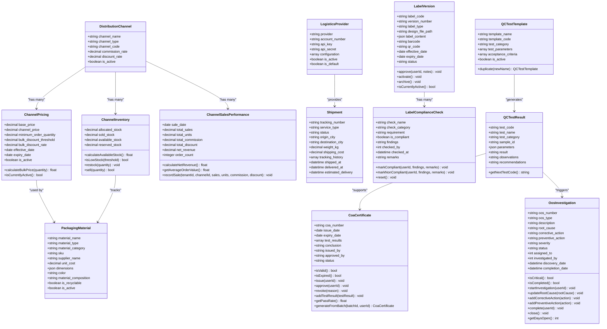

**Diagram sources**
- [DistributionChannel.php:12-52](file://app/Models/DistributionChannel.php#L12-L52)
- [ChannelPricing.php:11-75](file://app/Models/ChannelPricing.php#L11-L75)
- [ChannelInventory.php:11-81](file://app/Models/ChannelInventory.php#L11-L81)
- [ChannelSalesPerformance.php:11-95](file://app/Models/ChannelSalesPerformance.php#L11-L95)
- [LogisticsProvider.php:10-39](file://app/Models/LogisticsProvider.php#L10-L39)
- [Shipment.php:10-49](file://app/Models/Shipment.php#L10-L49)
- [PackagingMaterial.php:12-106](file://app/Models/PackagingMaterial.php#L12-L106)
- [LabelVersion.php:13-167](file://app/Models/LabelVersion.php#L13-L167)
- [LabelComplianceCheck.php:11-124](file://app/Models/LabelComplianceCheck.php#L11-L124)
- [QCTestTemplate.php:13-97](file://app/Models/QCTestTemplate.php#L13-L97)
- [QCTestResult.php:177-216](file://app/Models/QCTestResult.php#L177-L216)
- [CoaCertificate.php:12-165](file://app/Models/CoaCertificate.php#L12-L165)
- [OosInvestigation.php:12-189](file://app/Models/OosInvestigation.php#L12-L189)

## Detailed Component Analysis

### Distribution Channel Management
- Purpose: Define and manage distribution partners (retail, online marketplace, distributor, reseller/MLM), including contact details, commission/discount rates, and activity status.
- Key capabilities:
  - Channel type labels and code generation
  - Active/inactive filtering and indexing
  - Association with pricing, inventory, and sales performance

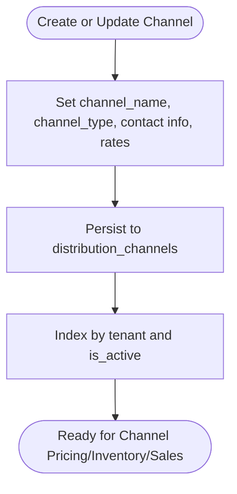

**Diagram sources**
- [DistributionChannel.php:12-52](file://app/Models/DistributionChannel.php#L12-L52)
- [2026_04_07_200000_create_distribution_channels_tables.php:14-32](file://database/migrations/2026_04_07_200000_create_distribution_channels_tables.php#L14-L32)

**Section sources**
- [DistributionChannel.php:12-52](file://app/Models/DistributionChannel.php#L12-L52)
- [2026_04_07_200000_create_distribution_channels_tables.php:14-32](file://database/migrations/2026_04_07_200000_create_distribution_channels_tables.php#L14-L32)

### Channel Pricing
- Purpose: Maintain base and channel-specific pricing, MOQ, bulk discount thresholds/rates, and validity windows.
- Key capabilities:
  - Bulk price calculation based on threshold and rate
  - Active window validation (effective/expiry dates)
  - Unique constraint per channel/formula

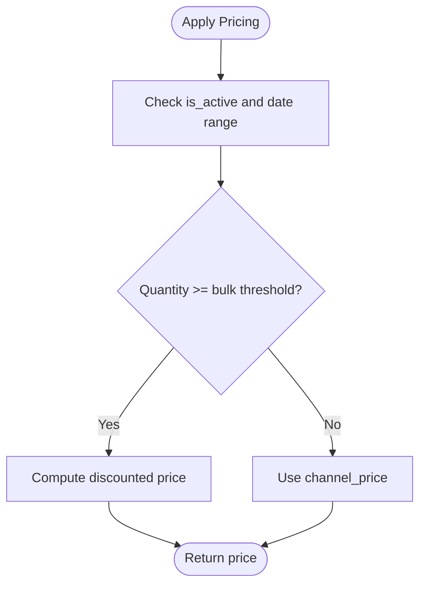

**Diagram sources**
- [ChannelPricing.php:40-62](file://app/Models/ChannelPricing.php#L40-L62)

**Section sources**
- [ChannelPricing.php:11-75](file://app/Models/ChannelPricing.php#L11-L75)
- [2026_04_07_200000_create_distribution_channels_tables.php:35-52](file://database/migrations/2026_04_07_200000_create_distribution_channels_tables.php#L35-L52)

### Channel Inventory
- Purpose: Track stock allocation, reservations, sales, and availability per channel/product.
- Key capabilities:
  - Available stock computation
  - Low stock detection with threshold
  - Restocking and sales validation

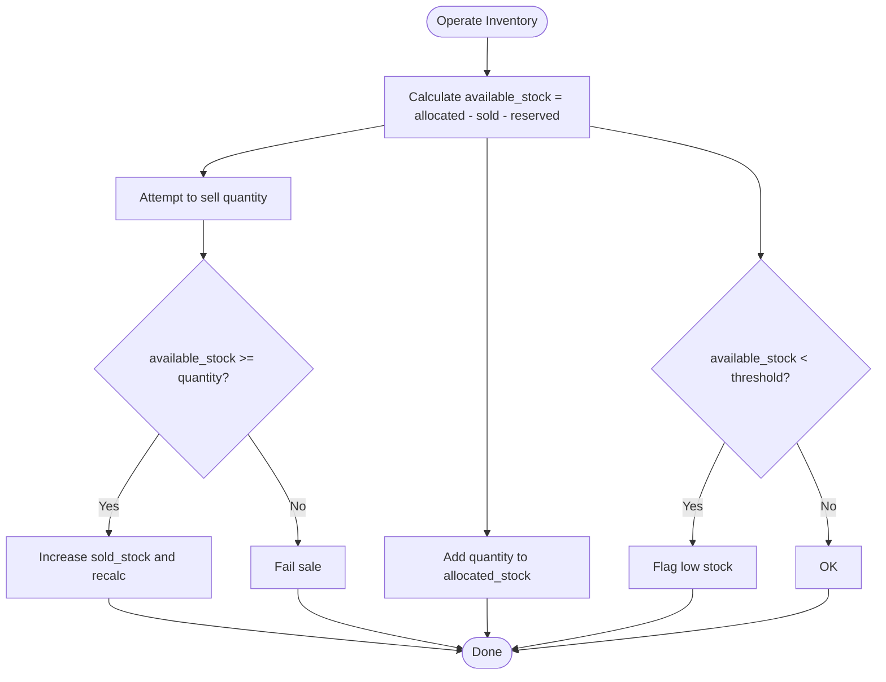

**Diagram sources**
- [ChannelInventory.php:34-68](file://app/Models/ChannelInventory.php#L34-L68)

**Section sources**
- [ChannelInventory.php:11-81](file://app/Models/ChannelInventory.php#L11-L81)
- [2026_04_07_200000_create_distribution_channels_tables.php:54-74](file://database/migrations/2026_04_07_200000_create_distribution_channels_tables.php#L54-L74)

### Channel Sales Performance
- Purpose: Aggregate daily sales metrics by channel for reporting and analytics.
- Key capabilities:
  - Net revenue calculation
  - Average order value computation
  - Date-range scoping and daily record creation

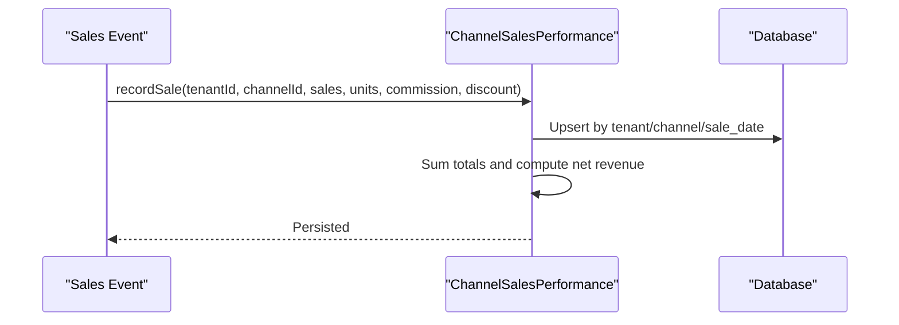

**Diagram sources**
- [ChannelSalesPerformance.php:54-70](file://app/Models/ChannelSalesPerformance.php#L54-L70)

**Section sources**
- [ChannelSalesPerformance.php:11-95](file://app/Models/ChannelSalesPerformance.php#L11-L95)
- [2026_04_07_200000_create_distribution_channels_tables.php:75-88](file://database/migrations/2026_04_07_200000_create_distribution_channels_tables.php#L75-L88)

### Logistics Coordination and Supply Chain Tracking
- Purpose: Configure logistics providers and create/manage shipments with tracking.
- Key capabilities:
  - Provider configuration and defaults
  - Shipment creation and status updates
  - Integration with carrier APIs for AWB generation

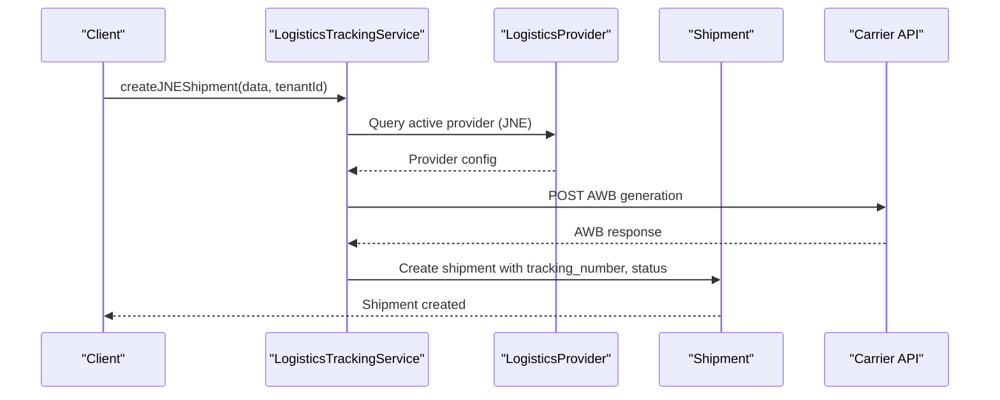

**Diagram sources**
- [LogisticsTrackingService.php:15-41](file://app/Services/Integrations/LogisticsTrackingService.php#L15-L41)
- [LogisticsProvider.php:10-39](file://app/Models/LogisticsProvider.php#L10-L39)
- [Shipment.php:10-49](file://app/Models/Shipment.php#L10-L49)
- [2026_04_06_070000_create_integration_tables.php:134-149](file://database/migrations/2026_04_06_070000_create_integration_tables.php#L134-L149)

**Section sources**
- [LogisticsTrackingService.php:10-41](file://app/Services/Integrations/LogisticsTrackingService.php#L10-L41)
- [LogisticsProvider.php:10-39](file://app/Models/LogisticsProvider.php#L10-L39)
- [Shipment.php:10-49](file://app/Models/Shipment.php#L10-L49)
- [2026_04_06_070000_create_integration_tables.php:134-149](file://database/migrations/2026_04_06_070000_create_integration_tables.php#L134-L149)

### Packaging Design Requirements and Material Selection
- Purpose: Manage packaging materials with attributes supporting design, sourcing, and sustainability.
- Key capabilities:
  - Material categorization (primary/secondary/tertiary)
  - Supplier, cost, dimensions, composition, color
  - Recyclability flagging and SKUs
  - Filtering and statistics for dashboards

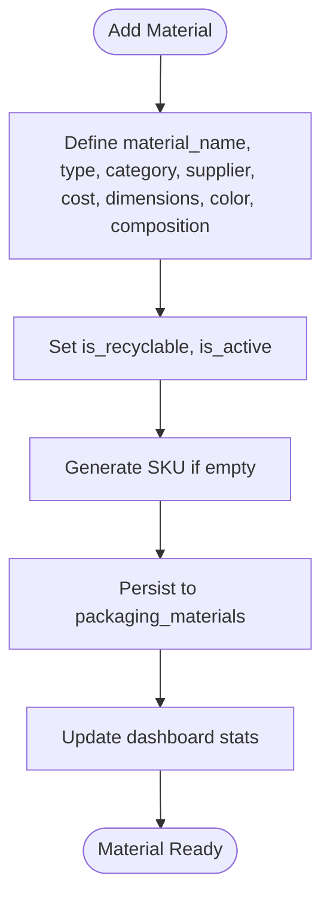

**Diagram sources**
- [PackagingMaterial.php:17-72](file://app/Models/PackagingMaterial.php#L17-L72)
- [PackagingController.php:15-29](file://app/Http/Controllers/Cosmetic/PackagingController.php#L15-L29)
- [index.blade.php (Packaging Materials):14-26](file://resources/views/cosmetic/packaging/index.blade.php#L14-L26)

**Section sources**
- [PackagingMaterial.php:12-106](file://app/Models/PackagingMaterial.php#L12-L106)
- [PackagingController.php:13-29](file://app/Http/Controllers/Cosmetic/PackagingController.php#L13-L29)
- [index.blade.php (Packaging Materials):1-278](file://resources/views/cosmetic/packaging/index.blade.php#L1-L278)

### Packaging Validation and Labeling Standards
- Purpose: Ensure label compliance and manage label versions with approval workflows.
- Key capabilities:
  - Label version lifecycle (draft, in review, approved, active, archived)
  - Compliance checks with categories (mandatory, optional, regulatory)
  - Approval and activation controls
  - Compliance status aggregation

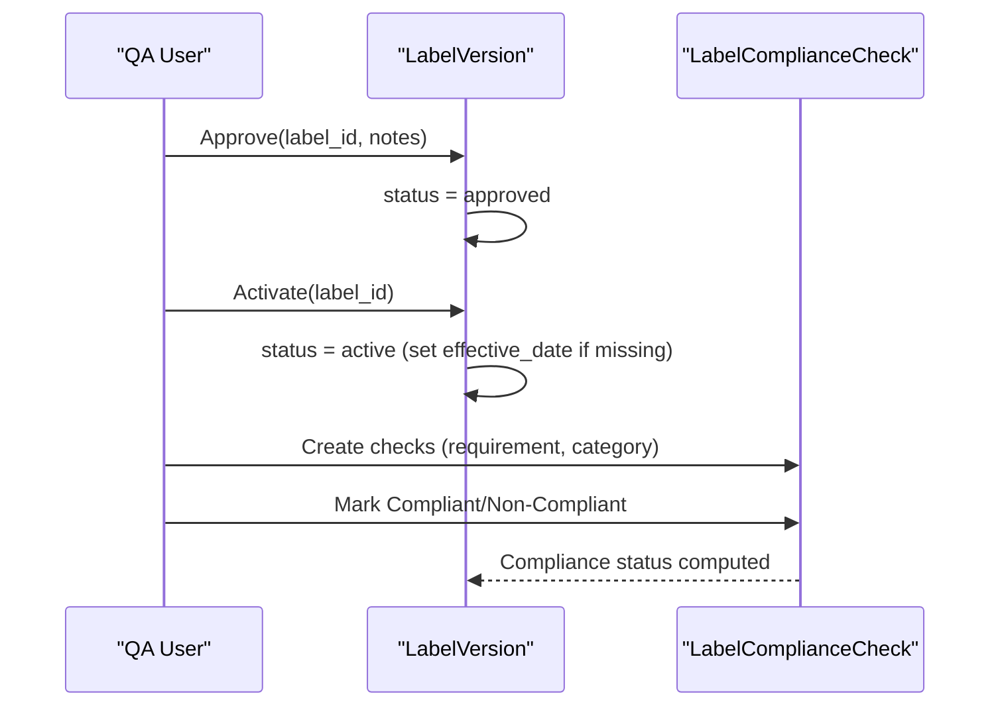

**Diagram sources**
- [LabelVersion.php:94-121](file://app/Models/LabelVersion.php#L94-L121)
- [LabelComplianceCheck.php:53-89](file://app/Models/LabelComplianceCheck.php#L53-L89)
- [label-show.blade.php:182-199](file://resources/views/cosmetic/packaging/label-show.blade.php#L182-L199)

**Section sources**
- [LabelVersion.php:13-167](file://app/Models/LabelVersion.php#L13-L167)
- [LabelComplianceCheck.php:11-124](file://app/Models/LabelComplianceCheck.php#L11-L124)
- [label-show.blade.php:182-199](file://resources/views/cosmetic/packaging/label-show.blade.php#L182-L199)

### Barcoding Systems and Retail Presentation
- Purpose: Support barcoding and printable label designs for retail and warehouse.
- Key capabilities:
  - Barcode rendering in label views
  - Price display and metadata formatting
  - Batch and single label layouts

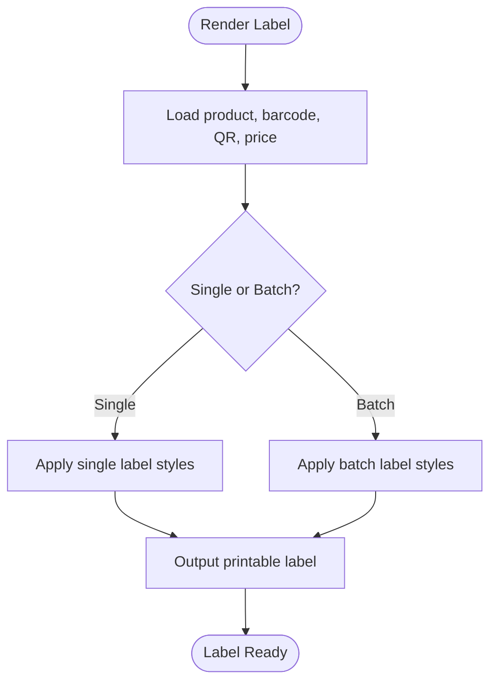

**Diagram sources**
- [avery.blade.php:101-117](file://resources/views/products/labels/avery.blade.php#L101-L117)
- [bin-label.blade.php:51-113](file://resources/views/wms/bin-label.blade.php#L51-L113)

**Section sources**
- [avery.blade.php:101-117](file://resources/views/products/labels/avery.blade.php#L101-L117)
- [bin-label.blade.php:51-113](file://resources/views/wms/bin-label.blade.php#L51-L113)

### Quality Control and Compliance for Cosmetics and Pharmaceuticals
- Purpose: Enforce regulatory compliance via templates, test results, COA issuance, and OOS investigations.
- Key capabilities:
  - Test templates with parameters and acceptance criteria
  - Test results with statuses and approvals
  - COA generation and pass-rate reporting
  - OOS investigation lifecycle (investigating/completed/closed)

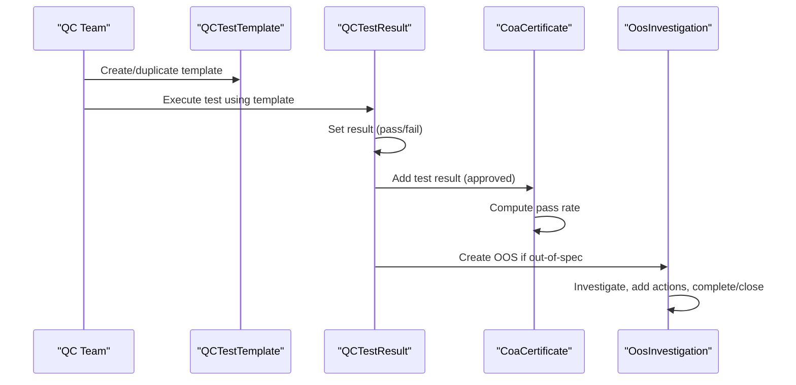

**Diagram sources**
- [QCTestTemplate.php:62-95](file://app/Models/QCTestTemplate.php#L62-L95)
- [QCTestResult.php:177-216](file://app/Models/QCTestResult.php#L177-L216)
- [CoaCertificate.php:83-163](file://app/Models/CoaCertificate.php#L83-L163)
- [OosInvestigation.php:87-130](file://app/Models/OosInvestigation.php#L87-L130)
- [index.blade.php (QC):177-196](file://resources/views/cosmetic/qc/index.blade.php#L177-L196)
- [templates.blade.php:98-116](file://resources/views/cosmetic/qc/templates.blade.php#L98-L116)

**Section sources**
- [QCTestTemplate.php:13-97](file://app/Models/QCTestTemplate.php#L13-L97)
- [QCTestResult.php:177-216](file://app/Models/QCTestResult.php#L177-L216)
- [CoaCertificate.php:12-165](file://app/Models/CoaCertificate.php#L12-L165)
- [OosInvestigation.php:12-189](file://app/Models/OosInvestigation.php#L12-L189)
- [index.blade.php (QC):177-196](file://resources/views/cosmetic/qc/index.blade.php#L177-L196)
- [templates.blade.php:98-116](file://resources/views/cosmetic/qc/templates.blade.php#L98-L116)

## Dependency Analysis
- Distribution channels depend on pricing, inventory, and sales performance
- Packaging materials underpin label versions and compliance checks
- Quality control templates and results feed COA and OOS workflows
- Logistics providers and shipments integrate with external carrier APIs
- Controllers depend on models for UI rendering and data operations

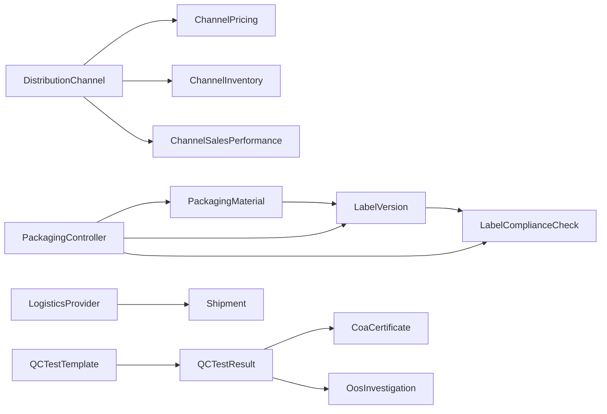

**Diagram sources**
- [DistributionChannel.php:12-52](file://app/Models/DistributionChannel.php#L12-L52)
- [ChannelPricing.php:11-75](file://app/Models/ChannelPricing.php#L11-L75)
- [ChannelInventory.php:11-81](file://app/Models/ChannelInventory.php#L11-L81)
- [ChannelSalesPerformance.php:11-95](file://app/Models/ChannelSalesPerformance.php#L11-L95)
- [PackagingMaterial.php:12-106](file://app/Models/PackagingMaterial.php#L12-L106)
- [LabelVersion.php:13-167](file://app/Models/LabelVersion.php#L13-L167)
- [LabelComplianceCheck.php:11-124](file://app/Models/LabelComplianceCheck.php#L11-L124)
- [QCTestTemplate.php:13-97](file://app/Models/QCTestTemplate.php#L13-L97)
- [QCTestResult.php:177-216](file://app/Models/QCTestResult.php#L177-L216)
- [CoaCertificate.php:12-165](file://app/Models/CoaCertificate.php#L12-L165)
- [OosInvestigation.php:12-189](file://app/Models/OosInvestigation.php#L12-L189)
- [LogisticsProvider.php:10-39](file://app/Models/LogisticsProvider.php#L10-L39)
- [Shipment.php:10-49](file://app/Models/Shipment.php#L10-L49)
- [PackagingController.php:13-29](file://app/Http/Controllers/Cosmetic/PackagingController.php#L13-L29)

**Section sources**
- [PackagingController.php:13-29](file://app/Http/Controllers/Cosmetic/PackagingController.php#L13-L29)
- [2026_04_07_200000_create_distribution_channels_tables.php:11-101](file://database/migrations/2026_04_07_200000_create_distribution_channels_tables.php#L11-L101)
- [2026_04_06_070000_create_integration_tables.php:125-149](file://database/migrations/2026_04_06_070000_create_integration_tables.php#L125-L149)
- [2026_04_07_150000_create_qc_laboratory_tables.php:31-49](file://database/migrations/2026_04_07_150000_create_qc_laboratory_tables.php#L31-L49)

## Performance Considerations
- Indexing: Ensure tenant-scoped indexes on distribution channels, channel pricing, channel inventory, channel sales performance, and shipments to optimize queries
- Aggregation: Prefer precomputed aggregates (e.g., compliance percentages) to reduce runtime calculations
- Bulk operations: Use bulk discount thresholds judiciously to avoid frequent recalculations
- Label rendering: Cache frequently used label designs and barcodes to improve print throughput
- Logging: Limit verbose logs during high-volume shipment creation and tracking updates

[No sources needed since this section provides general guidance]

## Troubleshooting Guide
- Channel pricing not applied:
  - Verify pricing is active and within effective/expiry dates
  - Confirm formula/channel uniqueness and correct quantities for bulk thresholds
- Low stock alerts:
  - Adjust threshold or trigger restock workflows proactively
  - Validate reservation and sold stock counts
- Label compliance:
  - Ensure label version is active and not expired
  - Confirm all mandatory checks are marked compliant
- Shipment tracking:
  - Verify provider configuration and API keys
  - Check shipment status transitions and tracking history updates
- QC and COA:
  - Ensure test results are approved before adding to COA
  - Investigate OOS cases promptly and complete corrective actions

**Section sources**
- [ChannelPricing.php:49-62](file://app/Models/ChannelPricing.php#L49-L62)
- [ChannelInventory.php:42-68](file://app/Models/ChannelInventory.php#L42-L68)
- [LabelVersion.php:76-92](file://app/Models/LabelVersion.php#L76-L92)
- [LogisticsTrackingService.php:22-24](file://app/Services/Integrations/LogisticsTrackingService.php#L22-L24)
- [CoaCertificate.php:67-81](file://app/Models/CoaCertificate.php#L67-L81)
- [OosInvestigation.php:87-130](file://app/Models/OosInvestigation.php#L87-L130)

## Conclusion
The Distribution and Packaging subsystems provide a comprehensive foundation for managing distribution channels, packaging materials, labeling compliance, logistics tracking, and quality control. By leveraging the defined models, controllers, services, and views, organizations can enforce packaging integrity, regulatory compliance, and supply chain visibility while maintaining efficient operations across cosmetic and pharmaceutical product lines.

[No sources needed since this section summarizes without analyzing specific files]

## Appendices

### Packaging Integrity Testing and Child-Resistant/Tamper-Evident Features
- Packaging integrity testing:
  - Integrate physical and microbiological test templates aligned with product categories
  - Use batch records and QC results to support COA issuance
- Child-resistant and tamper-evident:
  - Capture cap/tamper band specifications in packaging materials
  - Include regulatory checklists in label compliance checks
  - Track OOS investigations for closure-related issues

**Section sources**
- [QCTestTemplate.php:13-97](file://app/Models/QCTestTemplate.php#L13-L97)
- [QCTestResult.php:177-216](file://app/Models/QCTestResult.php#L177-L216)
- [CoaCertificate.php:12-165](file://app/Models/CoaCertificate.php#L12-L165)
- [PackagingMaterial.php:12-106](file://app/Models/PackagingMaterial.php#L12-L106)
- [LabelComplianceCheck.php:11-124](file://app/Models/LabelComplianceCheck.php#L11-L124)

### Labeling Requirements and Barcoding Systems
- Label versions:
  - Maintain effective/expiry dates and approval workflows
  - Use label types (primary, secondary, insert, outer) consistently
- Barcoding:
  - Render barcodes and QR codes in label views
  - Ensure barcode values align with product identifiers

**Section sources**
- [LabelVersion.php:13-167](file://app/Models/LabelVersion.php#L13-L167)
- [avery.blade.php:101-117](file://resources/views/products/labels/avery.blade.php#L101-L117)
- [bin-label.blade.php:51-113](file://resources/views/wms/bin-label.blade.php#L51-L113)

### Retail Presentation Standards
- Packaging materials:
  - Use standardized categories and types for consistent presentation
  - Highlight recyclability and sustainability attributes
- Labeling:
  - Ensure legible fonts, barcodes, and pricing in label designs
  - Maintain compliance checklists for regulatory requirements

**Section sources**
- [PackagingMaterial.php:12-106](file://app/Models/PackagingMaterial.php#L12-L106)
- [LabelVersion.php:13-167](file://app/Models/LabelVersion.php#L13-L167)
- [label-show.blade.php:182-199](file://resources/views/cosmetic/packaging/label-show.blade.php#L182-L199)