# Expiration & Expiry Management

<cite>
**Referenced Files in This Document**
- [2026_04_07_190000_create_expiry_management_tables.php](file://database/migrations/2026_04_07_190000_create_expiry_management_tables.php)
- [2026_04_07_130000_create_cosmetic_formula_tables.php](file://database/migrations/2026_04_07_130000_create_cosmetic_formula_tables.php)
- [web.php](file://routes/web.php)
- [ExpiryController.php](file://app/Http/Controllers/Cosmetic/ExpiryController.php)
- [ExpiryAlert.php](file://app/Models/ExpiryAlert.php)
- [BatchRecall.php](file://app/Models/BatchRecall.php)
- [ExpiryReport.php](file://app/Models/ExpiryReport.php)
- [StabilityTest.php](file://app/Models/StabilityTest.php)
- [CosmeticBatchRecord.php](file://app/Models/CosmeticBatchRecord.php)
- [CosmeticFormula.php](file://app/Models/CosmeticFormula.php)
- [2026_04_06_041804_create_ingredient_wastes_table.php](file://database/migrations/2026_04_06_041804_create_ingredient_wastes_table.php)
- [IngredientWasteTrackingService.php](file://app/Services/IngredientWasteTrackingService.php)
- [IngredientWaste.php](file://app/Models/IngredientWaste.php)
- [WasteTrackingController.php](file://app/Http/Controllers/Fnb/WasteTrackingController.php)
- [NotificationPreference.php](file://app/Models/NotificationPreference.php)
- [LowStockEmailNotification.php](file://app/Notifications/LowStockEmailNotification.php)
</cite>

## Table of Contents
1. [Introduction](#introduction)
2. [Project Structure](#project-structure)
3. [Core Components](#core-components)
4. [Architecture Overview](#architecture-overview)
5. [Detailed Component Analysis](#detailed-component-analysis)
6. [Dependency Analysis](#dependency-analysis)
7. [Performance Considerations](#performance-considerations)
8. [Troubleshooting Guide](#troubleshooting-guide)
9. [Conclusion](#conclusion)
10. [Appendices](#appendices)

## Introduction
This document describes the Expiration and Expiry Management system implemented in the application. It covers shelf-life determination, stability testing, expiration date calculation, product rotation strategies, expiry alert systems, inventory tracking, product recall procedures, waste management protocols, storage conditions, packaging impact, labeling requirements, consumer communication, and regulatory reporting for cosmetic and pharmaceutical products. The system integrates dedicated models, controllers, migrations, services, and notifications to support end-to-end lifecycle management from formula development through expiry and recall.

## Project Structure
The expiration and expiry management functionality spans migrations, models, controllers, services, and routing. The following diagram shows the high-level structure and relationships among the key components.

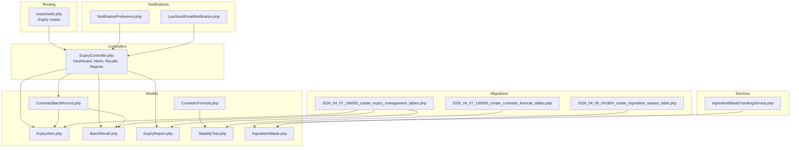

**Diagram sources**
- [web.php:1076-1088](file://routes/web.php#L1076-L1088)
- [ExpiryController.php:1-209](file://app/Http/Controllers/Cosmetic/ExpiryController.php#L1-L209)
- [ExpiryAlert.php:1-123](file://app/Models/ExpiryAlert.php#L1-L123)
- [BatchRecall.php:1-129](file://app/Models/BatchRecall.php#L1-L129)
- [ExpiryReport.php:1-97](file://app/Models/ExpiryReport.php#L1-L97)
- [StabilityTest.php:1-277](file://app/Models/StabilityTest.php#L1-L277)
- [CosmeticBatchRecord.php:1-312](file://app/Models/CosmeticBatchRecord.php#L1-L312)
- [CosmeticFormula.php:1-239](file://app/Models/CosmeticFormula.php#L1-L239)
- [IngredientWasteTrackingService.php:1-205](file://app/Services/IngredientWasteTrackingService.php#L1-L205)
- [IngredientWaste.php:1-59](file://app/Models/IngredientWaste.php#L1-L59)
- [2026_04_07_190000_create_expiry_management_tables.php:1-92](file://database/migrations/2026_04_07_190000_create_expiry_management_tables.php#L1-L92)
- [2026_04_07_130000_create_cosmetic_formula_tables.php:92-110](file://database/migrations/2026_04_07_130000_create_cosmetic_formula_tables.php#L92-L110)
- [2026_04_06_041804_create_ingredient_wastes_table.php:1-43](file://database/migrations/2026_04_06_041804_create_ingredient_wastes_table.php#L1-L43)
- [NotificationPreference.php:49-85](file://app/Models/NotificationPreference.php#L49-L85)
- [LowStockEmailNotification.php:1-43](file://app/Notifications/LowStockEmailNotification.php#L1-L43)

**Section sources**
- [web.php:1076-1088](file://routes/web.php#L1076-L1088)
- [ExpiryController.php:1-209](file://app/Http/Controllers/Cosmetic/ExpiryController.php#L1-L209)
- [2026_04_07_190000_create_expiry_management_tables.php:1-92](file://database/migrations/2026_04_07_190000_create_expiry_management_tables.php#L1-L92)
- [2026_04_07_130000_create_cosmetic_formula_tables.php:92-110](file://database/migrations/2026_04_07_130000_create_cosmetic_formula_tables.php#L92-L110)
- [2026_04_06_041804_create_ingredient_wastes_table.php:1-43](file://database/migrations/2026_04_06_041804_create_ingredient_wastes_table.php#L1-L43)

## Core Components
- ExpiryAlert: Tracks alerts for batches nearing expiry, expired, best-before dates, and PAO (Period After Opening). Supports severity levels, thresholds, read/actioned states, and actions taken.
- BatchRecall: Manages product recall events with statuses, severities, affected regions, unit counts, and resolution notes.
- ExpiryReport: Generates compliance reports with aggregated statistics, loss values, and period summaries.
- StabilityTest: Records stability testing (accelerated, real-time, freeze-thaw, photostability) with storage conditions, test outcomes, and durations.
- CosmeticBatchRecord: Stores batch metadata including production/expiry dates, status, QC checks, and expiry calculations.
- CosmeticFormula: Holds formula details including shelf life months, target/actual pH, and stability test associations.
- IngredientWasteTrackingService and IngredientWaste: Track ingredient waste categorized by type (including expired), enabling cost analysis and recommendations.
- Routing and Controller: Provide dashboard, alert management, recall workflows, and report generation.

**Section sources**
- [ExpiryAlert.php:1-123](file://app/Models/ExpiryAlert.php#L1-L123)
- [BatchRecall.php:1-129](file://app/Models/BatchRecall.php#L1-L129)
- [ExpiryReport.php:1-97](file://app/Models/ExpiryReport.php#L1-L97)
- [StabilityTest.php:1-277](file://app/Models/StabilityTest.php#L1-L277)
- [CosmeticBatchRecord.php:1-312](file://app/Models/CosmeticBatchRecord.php#L1-L312)
- [CosmeticFormula.php:1-239](file://app/Models/CosmeticFormula.php#L1-L239)
- [IngredientWasteTrackingService.php:1-205](file://app/Services/IngredientWasteTrackingService.php#L1-L205)
- [IngredientWaste.php:1-59](file://app/Models/IngredientWaste.php#L1-L59)
- [web.php:1076-1088](file://routes/web.php#L1076-L1088)
- [ExpiryController.php:1-209](file://app/Http/Controllers/Cosmetic/ExpiryController.php#L1-L209)

## Architecture Overview
The system follows a layered architecture:
- Presentation: Web routes and controller actions render dashboards and manage workflows.
- Domain: Models encapsulate business logic for alerts, recalls, reports, stability tests, batches, and formulas.
- Persistence: Migrations define schema for expiry management, stability testing, and waste tracking.
- Services: Dedicated services handle analytics and recommendations for waste.
- Notifications: Preferences and notifications integrate with alerting and reminders.

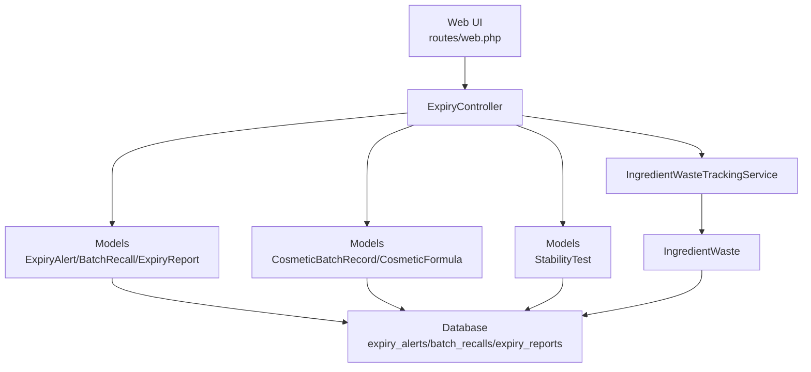

**Diagram sources**
- [web.php:1076-1088](file://routes/web.php#L1076-L1088)
- [ExpiryController.php:1-209](file://app/Http/Controllers/Cosmetic/ExpiryController.php#L1-L209)
- [ExpiryAlert.php:1-123](file://app/Models/ExpiryAlert.php#L1-L123)
- [BatchRecall.php:1-129](file://app/Models/BatchRecall.php#L1-L129)
- [ExpiryReport.php:1-97](file://app/Models/ExpiryReport.php#L1-L97)
- [CosmeticBatchRecord.php:1-312](file://app/Models/CosmeticBatchRecord.php#L1-L312)
- [CosmeticFormula.php:1-239](file://app/Models/CosmeticFormula.php#L1-L239)
- [StabilityTest.php:1-277](file://app/Models/StabilityTest.php#L1-L277)
- [IngredientWasteTrackingService.php:1-205](file://app/Services/IngredientWasteTrackingService.php#L1-L205)
- [IngredientWaste.php:1-59](file://app/Models/IngredientWaste.php#L1-L59)

## Detailed Component Analysis

### Shelf-Life Determination and Stability Testing
Shelf-life determination is supported by:
- Formula-level shelf-life in months and target/actual pH.
- Stability testing records with test types (accelerated, real-time, freeze-thaw, photostability), storage conditions, and outcomes.
- Test duration and overdue checks, plus pass/fail result handling.

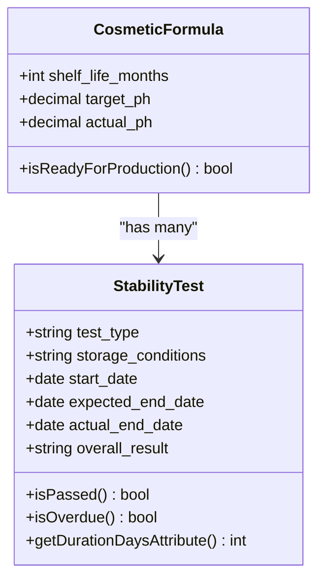

**Diagram sources**
- [CosmeticFormula.php:1-239](file://app/Models/CosmeticFormula.php#L1-L239)
- [StabilityTest.php:1-277](file://app/Models/StabilityTest.php#L1-L277)

**Section sources**
- [CosmeticFormula.php:1-239](file://app/Models/CosmeticFormula.php#L1-L239)
- [StabilityTest.php:1-277](file://app/Models/StabilityTest.php#L1-L277)
- [2026_04_07_130000_create_cosmetic_formula_tables.php:92-110](file://database/migrations/2026_04_07_130000_create_cosmetic_formula_tables.php#L92-L110)

### Expiration Date Calculation and Product Rotation
- Expiration date calculation is derived from batch records and can be queried for expired and expiring-soon batches.
- Product rotation strategies are supported by:
  - Scopes to filter expired and expiring batches.
  - Recommendations from waste tracking service for expired inventory.
  - Batch status controls and QC approvals impacting release readiness.

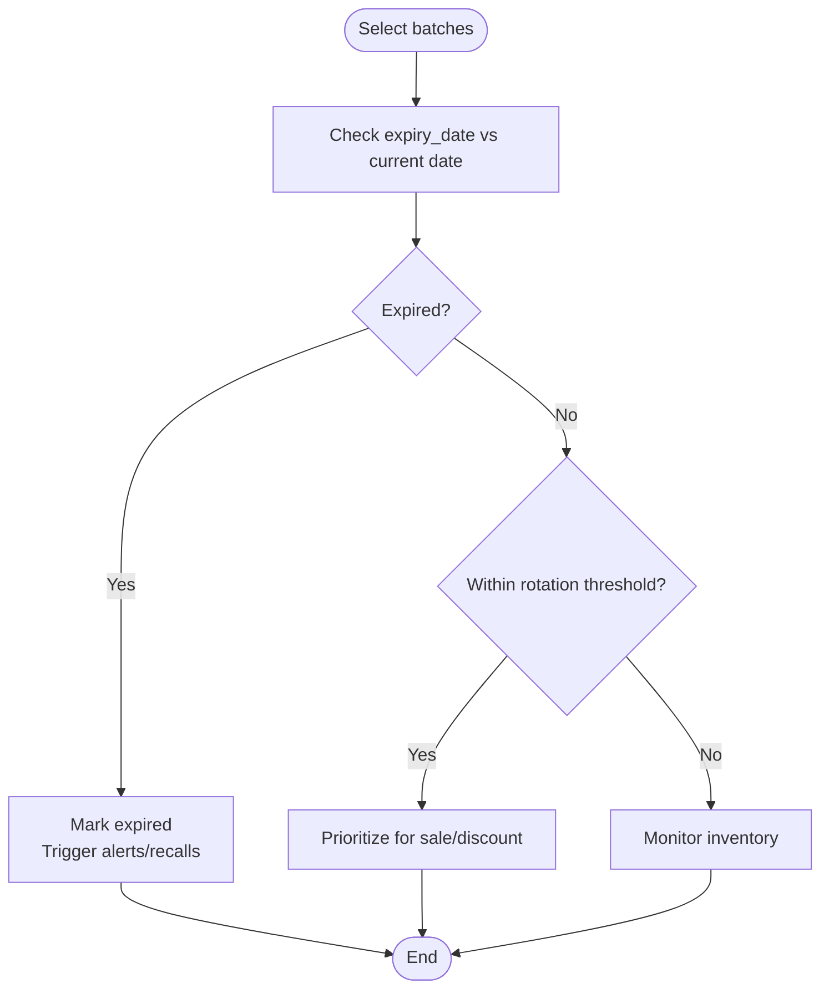

**Diagram sources**
- [CosmeticBatchRecord.php:164-185](file://app/Models/CosmeticBatchRecord.php#L164-L185)
- [ExpiryAlert.php:80-110](file://app/Models/ExpiryAlert.php#L80-L110)
- [IngredientWasteTrackingService.php:138-183](file://app/Services/IngredientWasteTrackingService.php#L138-L183)

**Section sources**
- [CosmeticBatchRecord.php:1-312](file://app/Models/CosmeticBatchRecord.php#L1-L312)
- [ExpiryAlert.php:1-123](file://app/Models/ExpiryAlert.php#L1-L123)
- [IngredientWasteTrackingService.php:138-183](file://app/Services/IngredientWasteTrackingService.php#L138-L183)

### Expiry Alert System
- Alert types include PAO expiry, best-before, near expiry, and expired.
- Severity levels and thresholds enable prioritized workflows.
- Actions such as discounted, disposed, recalled, returned are tracked with timestamps.

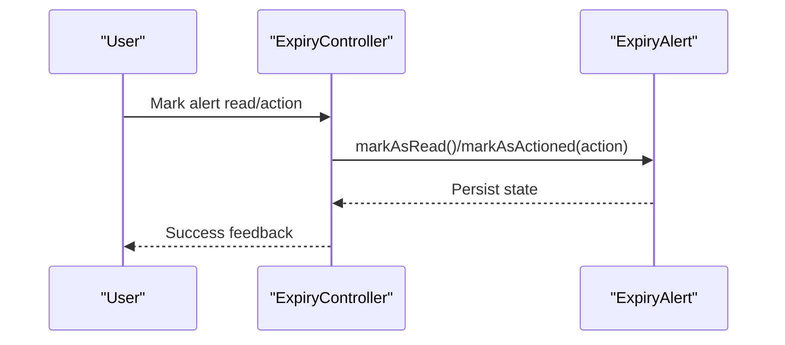

**Diagram sources**
- [ExpiryController.php:52-69](file://app/Http/Controllers/Cosmetic/ExpiryController.php#L52-L69)
- [ExpiryAlert.php:64-78](file://app/Models/ExpiryAlert.php#L64-L78)

**Section sources**
- [ExpiryAlert.php:1-123](file://app/Models/ExpiryAlert.php#L1-L123)
- [ExpiryController.php:52-69](file://app/Http/Controllers/Cosmetic/ExpiryController.php#L52-L69)

### Inventory Tracking and Waste Management
- Ingredient waste tracking captures expired items, spoilage, and other categories with cost and department attribution.
- Waste analytics include daily trends, top wasted items, and recommendations for cost reduction.
- Waste tracking integrates with inventory updates when applicable.

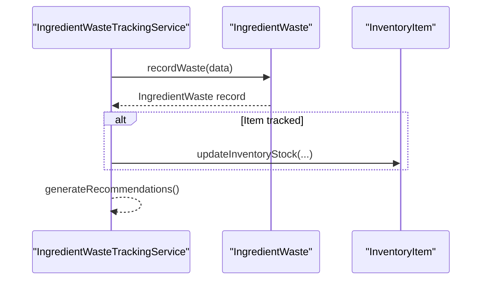

**Diagram sources**
- [IngredientWasteTrackingService.php:14-41](file://app/Services/IngredientWasteTrackingService.php#L14-L41)
- [IngredientWaste.php:1-59](file://app/Models/IngredientWaste.php#L1-L59)
- [2026_04_06_041804_create_ingredient_wastes_table.php:1-43](file://database/migrations/2026_04_06_041804_create_ingredient_wastes_table.php#L1-L43)

**Section sources**
- [IngredientWasteTrackingService.php:1-205](file://app/Services/IngredientWasteTrackingService.php#L1-L205)
- [IngredientWaste.php:1-59](file://app/Models/IngredientWaste.php#L1-L59)
- [2026_04_06_041804_create_ingredient_wastes_table.php:1-43](file://database/migrations/2026_04_06_041804_create_ingredient_wastes_table.php#L1-L43)

### Product Recall Procedures
- Recall initiation with automated numbering, severity, and affected regions.
- Progress updates for returned and destroyed units, with status transitions.
- Completion and cancellation with resolution notes.

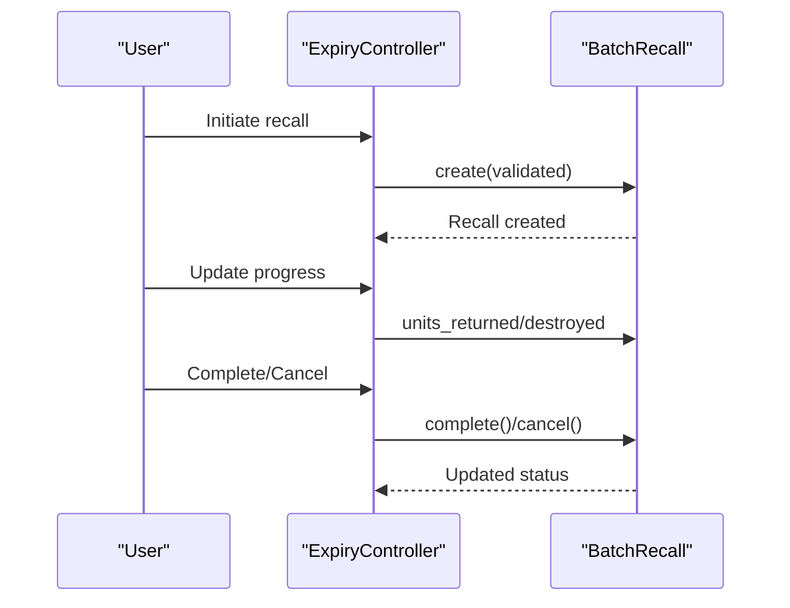

**Diagram sources**
- [ExpiryController.php:92-152](file://app/Http/Controllers/Cosmetic/ExpiryController.php#L92-L152)
- [BatchRecall.php:63-105](file://app/Models/BatchRecall.php#L63-L105)

**Section sources**
- [BatchRecall.php:1-129](file://app/Models/BatchRecall.php#L1-L129)
- [ExpiryController.php:92-152](file://app/Http/Controllers/Cosmetic/ExpiryController.php#L92-L152)

### Regulatory Reporting and Compliance
- Expiry reports include report numbers, periods, monitored batches, expired and recalled counts, and loss values.
- Report types include monthly, quarterly, annual, and ad-hoc.
- Expiry rates and recall rates are computed from aggregated data.

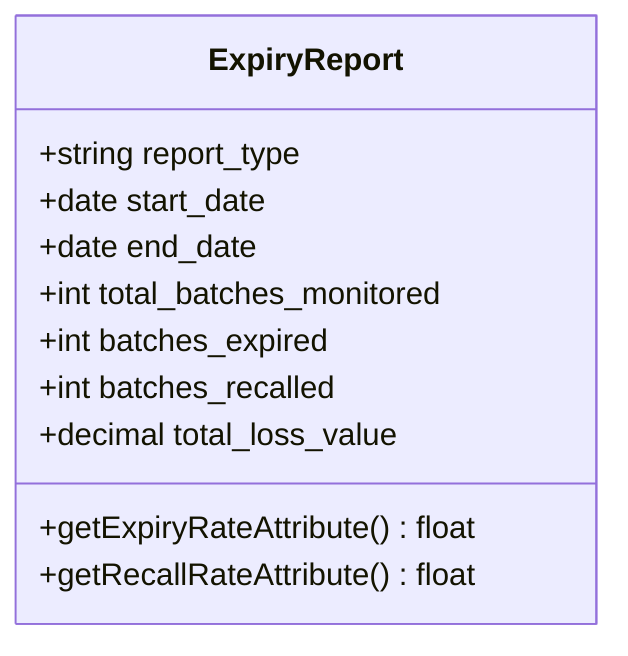

**Diagram sources**
- [ExpiryReport.php:1-97](file://app/Models/ExpiryReport.php#L1-L97)
- [ExpiryController.php:154-207](file://app/Http/Controllers/Cosmetic/ExpiryController.php#L154-L207)

**Section sources**
- [ExpiryReport.php:1-97](file://app/Models/ExpiryReport.php#L1-L97)
- [ExpiryController.php:154-207](file://app/Http/Controllers/Cosmetic/ExpiryController.php#L154-L207)

### Temperature Storage, Light Protection, and Packaging Impact
- Stability testing supports storage condition recording (e.g., temperature and humidity) and photostability testing.
- Packaging impact can be inferred from appearance, viscosity, microbial results, and separation observations recorded during stability tests.

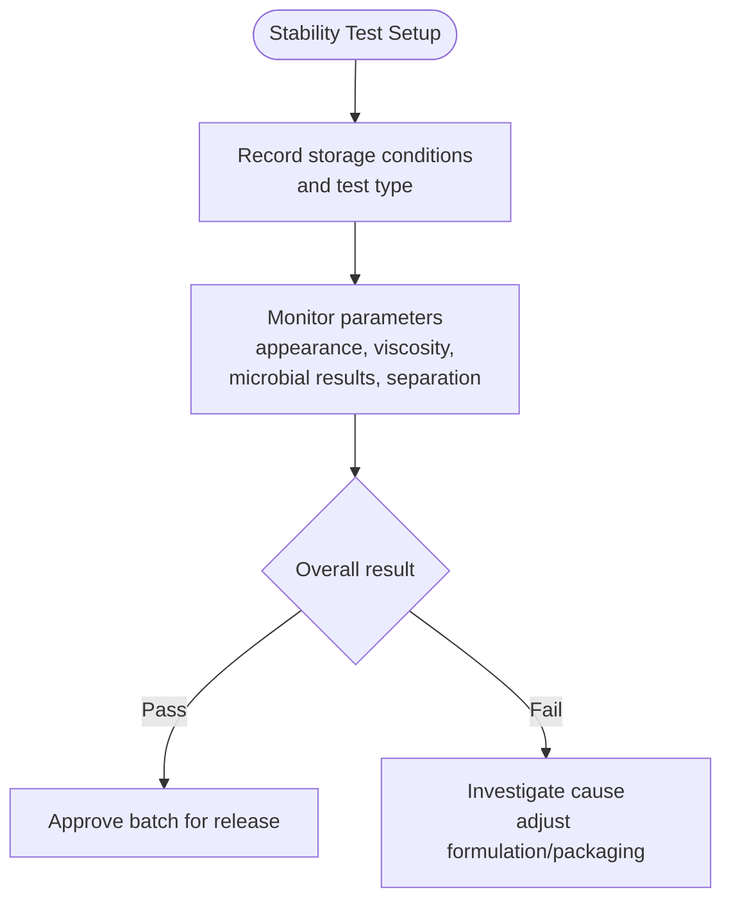

**Diagram sources**
- [StabilityTest.php:1-277](file://app/Models/StabilityTest.php#L1-L277)
- [2026_04_07_130000_create_cosmetic_formula_tables.php:92-110](file://database/migrations/2026_04_07_130000_create_cosmetic_formula_tables.php#L92-L110)

**Section sources**
- [StabilityTest.php:1-277](file://app/Models/StabilityTest.php#L1-L277)
- [2026_04_07_130000_create_cosmetic_formula_tables.php:92-110](file://database/migrations/2026_04_07_130000_create_cosmetic_formula_tables.php#L92-L110)

### Expiry Date Labeling and Consumer Communication
- Notification preferences normalize expiry-related types to a canonical category for unified handling.
- Low-stock notifications demonstrate a pattern for communicating inventory-related messages to users.

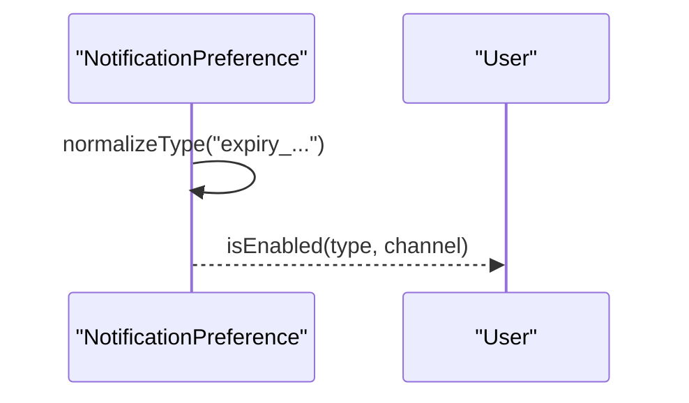

**Diagram sources**
- [NotificationPreference.php:79-85](file://app/Models/NotificationPreference.php#L79-L85)
- [LowStockEmailNotification.php:1-43](file://app/Notifications/LowStockEmailNotification.php#L1-L43)

**Section sources**
- [NotificationPreference.php:49-85](file://app/Models/NotificationPreference.php#L49-L85)
- [LowStockEmailNotification.php:1-43](file://app/Notifications/LowStockEmailNotification.php#L1-L43)

## Dependency Analysis
The following diagram highlights key dependencies among models and services supporting expiry management.

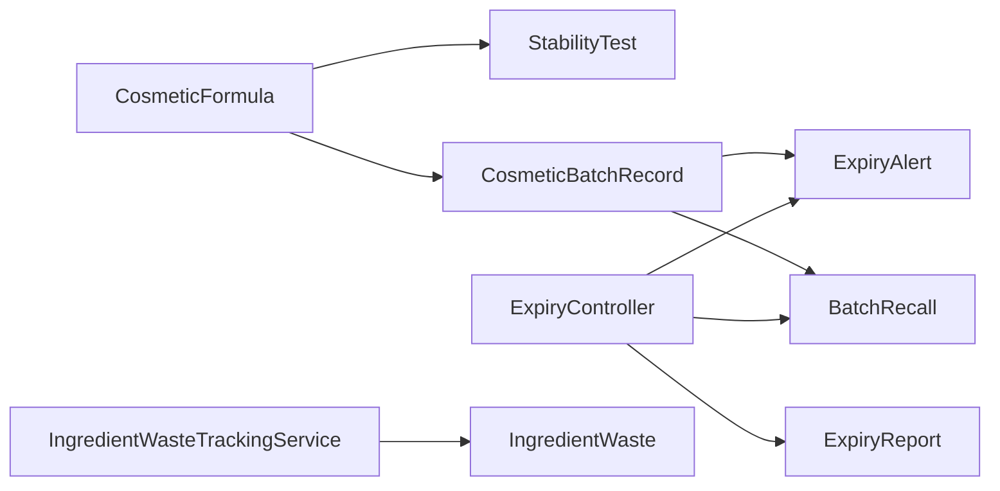

**Diagram sources**
- [CosmeticFormula.php:1-239](file://app/Models/CosmeticFormula.php#L1-L239)
- [StabilityTest.php:1-277](file://app/Models/StabilityTest.php#L1-L277)
- [CosmeticBatchRecord.php:1-312](file://app/Models/CosmeticBatchRecord.php#L1-L312)
- [ExpiryAlert.php:1-123](file://app/Models/ExpiryAlert.php#L1-L123)
- [BatchRecall.php:1-129](file://app/Models/BatchRecall.php#L1-L129)
- [ExpiryReport.php:1-97](file://app/Models/ExpiryReport.php#L1-L97)
- [IngredientWasteTrackingService.php:1-205](file://app/Services/IngredientWasteTrackingService.php#L1-L205)
- [IngredientWaste.php:1-59](file://app/Models/IngredientWaste.php#L1-L59)
- [ExpiryController.php:1-209](file://app/Http/Controllers/Cosmetic/ExpiryController.php#L1-L209)

**Section sources**
- [ExpiryController.php:1-209](file://app/Http/Controllers/Cosmetic/ExpiryController.php#L1-L209)
- [ExpiryAlert.php:1-123](file://app/Models/ExpiryAlert.php#L1-L123)
- [BatchRecall.php:1-129](file://app/Models/BatchRecall.php#L1-L129)
- [ExpiryReport.php:1-97](file://app/Models/ExpiryReport.php#L1-L97)
- [StabilityTest.php:1-277](file://app/Models/StabilityTest.php#L1-L277)
- [CosmeticBatchRecord.php:1-312](file://app/Models/CosmeticBatchRecord.php#L1-L312)
- [CosmeticFormula.php:1-239](file://app/Models/CosmeticFormula.php#L1-L239)
- [IngredientWasteTrackingService.php:1-205](file://app/Services/IngredientWasteTrackingService.php#L1-L205)
- [IngredientWaste.php:1-59](file://app/Models/IngredientWaste.php#L1-L59)

## Performance Considerations
- Indexes on frequently filtered columns (e.g., tenant_id, severity, status, alert_date) improve query performance for dashboards and reporting.
- Use scopes and paginated queries for large datasets (alerts, recalls, reports).
- Aggregate computations in reports should leverage database-level aggregations to minimize application overhead.
- Consider background jobs for heavy report generation and stability test overdue notifications.

## Troubleshooting Guide
- Expiry alerts not appearing:
  - Verify tenant scoping and alert thresholds.
  - Confirm batch expiry dates are set and not in the future.
- Recall progress not updating:
  - Ensure validated fields (returned/destroyed units) are provided and within bounds.
  - Check status transitions and required fields.
- Stability tests stuck:
  - Confirm expected end dates and status transitions.
  - Validate test results and completion observations.
- Waste recommendations not generated:
  - Ensure sufficient waste records exist and expired category data is populated.

**Section sources**
- [ExpiryController.php:114-152](file://app/Http/Controllers/Cosmetic/ExpiryController.php#L114-L152)
- [ExpiryAlert.php:87-110](file://app/Models/ExpiryAlert.php#L87-L110)
- [BatchRecall.php:108-116](file://app/Models/BatchRecall.php#L108-L116)
- [StabilityTest.php:223-247](file://app/Models/StabilityTest.php#L223-L247)
- [IngredientWasteTrackingService.php:138-183](file://app/Services/IngredientWasteTrackingService.php#L138-L183)

## Conclusion
The Expiration and Expiry Management system provides a robust foundation for shelf-life determination, stability testing, alerting, recall management, reporting, and waste tracking. By leveraging models, services, and controllers, it supports proactive inventory rotation, compliance reporting, and operational improvements. Extending storage condition monitoring and packaging impact assessments within stability tests further strengthens the system’s ability to predict and mitigate expiry risks.

## Appendices
- Regulatory reporting templates and compliance exports can be extended from the existing ExpiryReport model and controller actions.
- Notification channels and preferences can be expanded to include expiry-specific channels beyond in-app notifications.