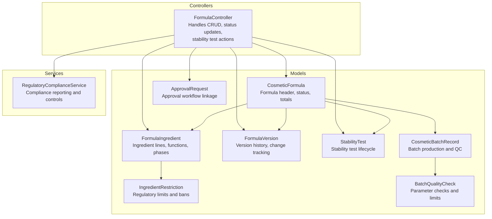
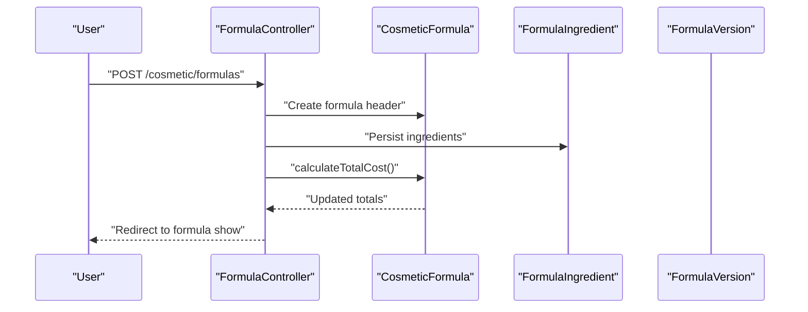
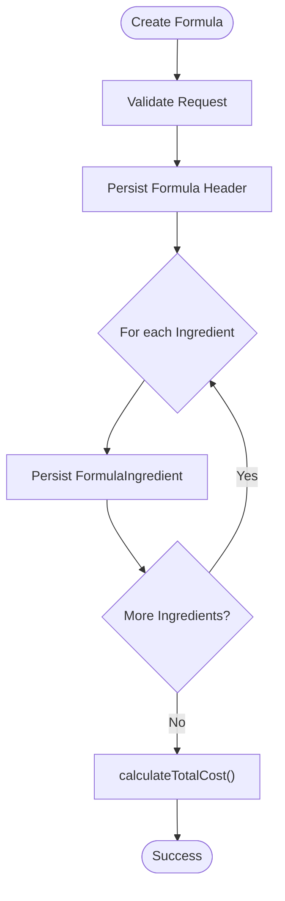
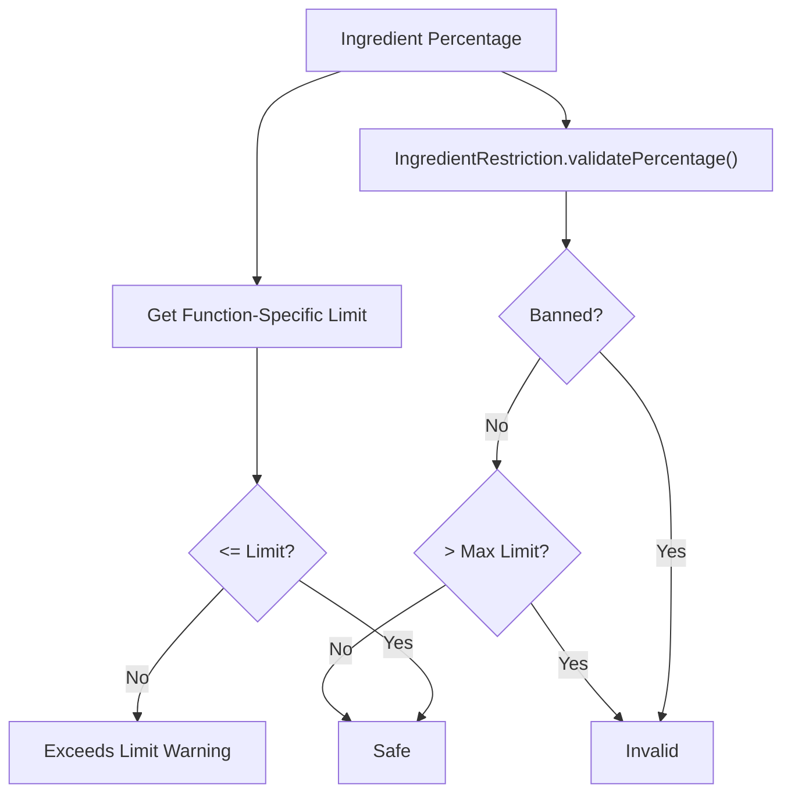
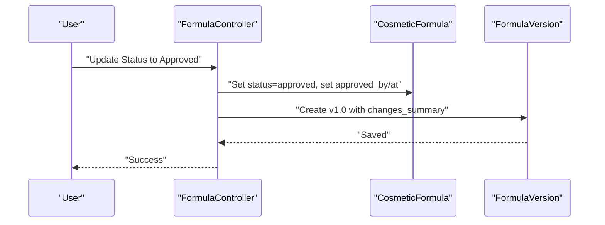
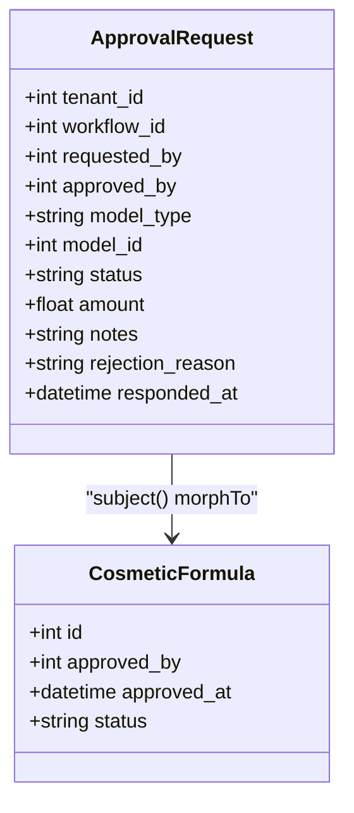
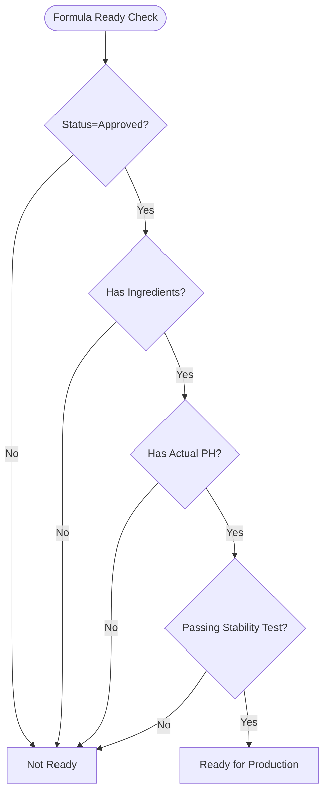
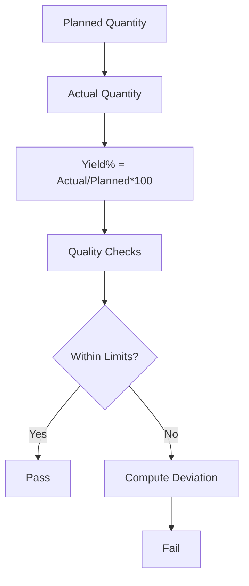
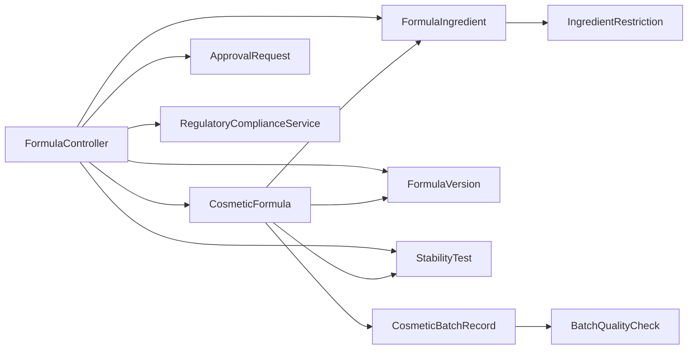

# Formulation Management

<cite>
**Referenced Files in This Document**
- [FormulaController.php](file://app/Http/Controllers/Cosmetic/FormulaController.php)
- [CosmeticFormula.php](file://app/Models/CosmeticFormula.php)
- [FormulaIngredient.php](file://app/Models/FormulaIngredient.php)
- [FormulaVersion.php](file://app/Models/FormulaVersion.php)
- [IngredientRestriction.php](file://app/Models/IngredientRestriction.php)
- [StabilityTest.php](file://app/Models/StabilityTest.php)
- [CosmeticBatchRecord.php](file://app/Models/CosmeticBatchRecord.php)
- [BatchQualityCheck.php](file://app/Models/BatchQualityCheck.php)
- [ApprovalRequest.php](file://app/Models/ApprovalRequest.php)
- [RegulatoryComplianceService.php](file://app/Services/RegulatoryComplianceService.php)
</cite>

## Table of Contents
1. [Introduction](#introduction)
2. [Project Structure](#project-structure)
3. [Core Components](#core-components)
4. [Architecture Overview](#architecture-overview)
5. [Detailed Component Analysis](#detailed-component-analysis)
6. [Dependency Analysis](#dependency-analysis)
7. [Performance Considerations](#performance-considerations)
8. [Troubleshooting Guide](#troubleshooting-guide)
9. [Conclusion](#conclusion)
10. [Appendices](#appendices)

## Introduction
This document describes the Formulation Management system within the qalcuityERP platform. It covers formula creation, ingredient selection, concentration calculations, formula versioning, and ingredient substitution rules. It also explains the formulation approval workflow, ingredient safety assessments, compatibility testing, and regulatory ingredient restrictions. Additionally, it documents formula validation processes, batch size calculations, scaling procedures, formula change management, ingredient sourcing verification, supplier qualification requirements, and formula documentation standards for both cosmetic and pharmaceutical applications.

## Project Structure
The Formulation Management system spans controllers, models, and services that orchestrate formula lifecycle, ingredient handling, stability testing, batch quality control, approvals, and regulatory compliance.

**Diagram sources**
- [FormulaController.php:1-308](file://app/Http/Controllers/Cosmetic/FormulaController.php#L1-L308)
- [CosmeticFormula.php:1-239](file://app/Models/CosmeticFormula.php#L1-L239)
- [FormulaIngredient.php:1-199](file://app/Models/FormulaIngredient.php#L1-L199)
- [FormulaVersion.php:1-105](file://app/Models/FormulaVersion.php#L1-L105)
- [IngredientRestriction.php:1-87](file://app/Models/IngredientRestriction.php#L1-L87)
- [StabilityTest.php:1-277](file://app/Models/StabilityTest.php#L1-L277)
- [CosmeticBatchRecord.php:1-312](file://app/Models/CosmeticBatchRecord.php#L1-L312)
- [BatchQualityCheck.php:1-218](file://app/Models/BatchQualityCheck.php#L1-L218)
- [ApprovalRequest.php:1-25](file://app/Models/ApprovalRequest.php#L1-L25)
- [RegulatoryComplianceService.php:1-581](file://app/Services/RegulatoryComplianceService.php#L1-L581)

**Section sources**
- [FormulaController.php:1-308](file://app/Http/Controllers/Cosmetic/FormulaController.php#L1-L308)
- [CosmeticFormula.php:1-239](file://app/Models/CosmeticFormula.php#L1-L239)
- [FormulaIngredient.php:1-199](file://app/Models/FormulaIngredient.php#L1-L199)
- [FormulaVersion.php:1-105](file://app/Models/FormulaVersion.php#L1-L105)
- [IngredientRestriction.php:1-87](file://app/Models/IngredientRestriction.php#L1-L87)
- [StabilityTest.php:1-277](file://app/Models/StabilityTest.php#L1-L277)
- [CosmeticBatchRecord.php:1-312](file://app/Models/CosmeticBatchRecord.php#L1-L312)
- [BatchQualityCheck.php:1-218](file://app/Models/BatchQualityCheck.php#L1-L218)
- [ApprovalRequest.php:1-25](file://app/Models/ApprovalRequest.php#L1-L25)
- [RegulatoryComplianceService.php:1-581](file://app/Services/RegulatoryComplianceService.php#L1-L581)

## Core Components
- CosmeticFormula: Central entity for a formula, including metadata, status, batch sizing, costs, and helper methods for readiness and PH tolerance.
- FormulaIngredient: Line items representing ingredients with function, phase, quantity, unit, percentage, and safety checks.
- FormulaVersion: Version history with semantic versioning helpers and change tracking.
- IngredientRestriction: Regulatory constraints per ingredient (banned, restricted, limited) with limit enforcement.
- StabilityTest: Stability testing lifecycle with initial/final measurements and overall result.
- CosmeticBatchRecord: Batch production record with planned vs actual quantities, QC, expiry, and release controls.
- BatchQualityCheck: Parameter checks against targets and limits with deviation metrics.
- ApprovalRequest: Approval workflow linkage for model changes.
- RegulatoryComplianceService: Compliance reporting and controls (used generically in the system; not specific to formulations but relevant for documentation standards).

**Section sources**
- [CosmeticFormula.php:1-239](file://app/Models/CosmeticFormula.php#L1-L239)
- [FormulaIngredient.php:1-199](file://app/Models/FormulaIngredient.php#L1-L199)
- [FormulaVersion.php:1-105](file://app/Models/FormulaVersion.php#L1-L105)
- [IngredientRestriction.php:1-87](file://app/Models/IngredientRestriction.php#L1-L87)
- [StabilityTest.php:1-277](file://app/Models/StabilityTest.php#L1-L277)
- [CosmeticBatchRecord.php:1-312](file://app/Models/CosmeticBatchRecord.php#L1-L312)
- [BatchQualityCheck.php:1-218](file://app/Models/BatchQualityCheck.php#L1-L218)
- [ApprovalRequest.php:1-25](file://app/Models/ApprovalRequest.php#L1-L25)
- [RegulatoryComplianceService.php:1-581](file://app/Services/RegulatoryComplianceService.php#L1-L581)

## Architecture Overview
The system follows a layered MVC pattern:
- Controllers handle HTTP requests and delegate to models/services.
- Models encapsulate domain logic (calculations, validations, status transitions).
- Services support cross-cutting concerns (compliance reporting).
- Views render lists, forms, and dashboards for formulas, batches, and tests.

**Diagram sources**
- [FormulaController.php:81-146](file://app/Http/Controllers/Cosmetic/FormulaController.php#L81-L146)
- [CosmeticFormula.php:137-151](file://app/Models/CosmeticFormula.php#L137-L151)
- [FormulaIngredient.php:1-199](file://app/Models/FormulaIngredient.php#L1-L199)

**Section sources**
- [FormulaController.php:1-308](file://app/Http/Controllers/Cosmetic/FormulaController.php#L1-L308)
- [CosmeticFormula.php:1-239](file://app/Models/CosmeticFormula.php#L1-L239)

## Detailed Component Analysis

### Formula Creation and Ingredient Selection
- Creation validates formula metadata and ingredients, assigns a formula code, persists ingredients, and computes total cost and cost-per-unit.
- Ingredients include INCINAME, common name, CAS number, quantity, unit, percentage, function, phase, sort order, and optional product linkage.
- Functions and phases are labeled for UI and categorization; ingredient cost is derived from linked product average cost.

**Diagram sources**
- [FormulaController.php:81-146](file://app/Http/Controllers/Cosmetic/FormulaController.php#L81-L146)
- [CosmeticFormula.php:137-151](file://app/Models/CosmeticFormula.php#L137-L151)
- [FormulaIngredient.php:124-133](file://app/Models/FormulaIngredient.php#L124-L133)

**Section sources**
- [FormulaController.php:81-146](file://app/Http/Controllers/Cosmetic/FormulaController.php#L81-L146)
- [FormulaIngredient.php:1-199](file://app/Models/FormulaIngredient.php#L1-L199)
- [CosmeticFormula.php:137-151](file://app/Models/CosmeticFormula.php#L137-L151)

### Concentration Calculations and Ingredient Safety Assessments
- FormulaIngredient exposes a safety assessment method that compares ingredient percentage against function-specific safe limits.
- IngredientRestriction enforces regulatory constraints: banned ingredients are invalid, and limited ingredients must not exceed max limits.

**Diagram sources**
- [FormulaIngredient.php:173-185](file://app/Models/FormulaIngredient.php#L173-L185)
- [IngredientRestriction.php:64-85](file://app/Models/IngredientRestriction.php#L64-L85)

**Section sources**
- [FormulaIngredient.php:173-185](file://app/Models/FormulaIngredient.php#L173-L185)
- [IngredientRestriction.php:64-85](file://app/Models/IngredientRestriction.php#L64-L85)

### Formula Versioning and Change Management
- On approval, a FormulaVersion record is created with an initial version number and change summary.
- Version numbering supports major/minor increments and comparison utilities.
- FormulaVersion tracks who changed the formula and approval notes.

**Diagram sources**
- [FormulaController.php:182-219](file://app/Http/Controllers/Cosmetic/FormulaController.php#L182-L219)
- [FormulaVersion.php:75-90](file://app/Models/FormulaVersion.php#L75-L90)

**Section sources**
- [FormulaController.php:182-219](file://app/Http/Controllers/Cosmetic/FormulaController.php#L182-L219)
- [FormulaVersion.php:1-105](file://app/Models/FormulaVersion.php#L1-L105)

### Ingredient Substitution Rules
- IngredientRestriction defines whether an ingredient is banned or limited and provides a validation outcome with message.
- FormulaIngredient’s safety warning surfaces concentration exceeding recommended limits.
- Substitution decisions should consider:
  - Regulatory bans or limits
  - Functional equivalence (function)
  - Phase placement (phase)
  - Concentration safety thresholds

**Section sources**
- [IngredientRestriction.php:52-85](file://app/Models/IngredientRestriction.php#L52-L85)
- [FormulaIngredient.php:173-197](file://app/Models/FormulaIngredient.php#L173-L197)

### Formulation Approval Workflow
- ApprovalRequest links approval workflows to model instances (e.g., formulas).
- The controller updates formula status and captures approver metadata.
- ApprovalRequest supports requester/approver resolution and morphic association to the subject model.

**Diagram sources**
- [ApprovalRequest.php:1-25](file://app/Models/ApprovalRequest.php#L1-L25)
- [FormulaController.php:182-219](file://app/Http/Controllers/Cosmetic/FormulaController.php#L182-L219)

**Section sources**
- [ApprovalRequest.php:1-25](file://app/Models/ApprovalRequest.php#L1-L25)
- [FormulaController.php:182-219](file://app/Http/Controllers/Cosmetic/FormulaController.php#L182-L219)

### Ingredient Safety Assessments and Compatibility Testing
- StabilityTest captures initial and final attributes (PH, appearance, viscosity, microbial results) and overall result.
- Tests can be accelerated, real-time, freeze-thaw, or photostability; durations and overdue checks are supported.
- CosmeticFormula provides readiness checks requiring approval, ingredient presence, measured PH, and passing stability test.

**Diagram sources**
- [CosmeticFormula.php:214-237](file://app/Models/CosmeticFormula.php#L214-L237)
- [StabilityTest.php:147-158](file://app/Models/StabilityTest.php#L147-L158)

**Section sources**
- [StabilityTest.php:1-277](file://app/Models/StabilityTest.php#L1-L277)
- [CosmeticFormula.php:214-237](file://app/Models/CosmeticFormula.php#L214-L237)

### Regulatory Ingredient Restrictions
- IngredientRestriction supports three restriction types with labels and validation outcomes.
- Validation returns compliant/invalid with messages for bans and limits.

**Section sources**
- [IngredientRestriction.php:30-85](file://app/Models/IngredientRestriction.php#L30-L85)

### Formula Validation Processes
- FormulaController validates inputs for formula metadata and ingredients.
- CosmeticFormula calculates total cost and cost-per-unit and checks PH tolerance.
- FormulaIngredient computes ingredient cost from linked product and assesses concentration safety.

**Section sources**
- [FormulaController.php:83-103](file://app/Http/Controllers/Cosmetic/FormulaController.php#L83-L103)
- [CosmeticFormula.php:137-164](file://app/Models/CosmeticFormula.php#L137-L164)
- [FormulaIngredient.php:124-133](file://app/Models/FormulaIngredient.php#L124-L133)

### Batch Size Calculations and Scaling Procedures
- CosmeticFormula stores batch_size and batch_unit; total cost and cost-per-unit are computed.
- CosmeticBatchRecord stores planned_quantity and actual_quantity; yield percentage is calculated.
- BatchQualityCheck compares actual values against target and lower/upper limits with deviation metrics.

**Diagram sources**
- [CosmeticFormula.php:137-151](file://app/Models/CosmeticFormula.php#L137-L151)
- [CosmeticBatchRecord.php:149-161](file://app/Models/CosmeticBatchRecord.php#L149-L161)
- [BatchQualityCheck.php:115-150](file://app/Models/BatchQualityCheck.php#L115-L150)

**Section sources**
- [CosmeticFormula.php:137-151](file://app/Models/CosmeticFormula.php#L137-L151)
- [CosmeticBatchRecord.php:149-161](file://app/Models/CosmeticBatchRecord.php#L149-L161)
- [BatchQualityCheck.php:115-150](file://app/Models/BatchQualityCheck.php#L115-L150)

### Formula Change Management
- FormulaVersion tracks version numbers, reasons for change, and changers.
- Version comparison and next-version calculation support controlled evolution.

**Section sources**
- [FormulaVersion.php:64-90](file://app/Models/FormulaVersion.php#L64-L90)

### Ingredient Sourcing Verification and Supplier Qualification
- FormulaIngredient optionally links to a Product; ingredient cost is derived from product average cost.
- Supplier qualification and sourcing verification are not modeled in the referenced files; however, linking ingredients to products enables cost tracking and sourcing traceability.

**Section sources**
- [FormulaIngredient.php:124-133](file://app/Models/FormulaIngredient.php#L124-L133)

### Formula Documentation Standards
- RegulatoryComplianceService provides mechanisms for generating compliance reports and maintaining audit trails, which are applicable to documentation standards for both cosmetic and pharmaceutical applications.

**Section sources**
- [RegulatoryComplianceService.php:139-176](file://app/Services/RegulatoryComplianceService.php#L139-L176)

## Dependency Analysis
- Controllers depend on models for persistence and logic.
- Models encapsulate domain rules (costs, safety, readiness).
- Services support compliance reporting and controls.
- ApprovalRequest ties approval workflows to model instances.

**Diagram sources**
- [FormulaController.php:1-308](file://app/Http/Controllers/Cosmetic/FormulaController.php#L1-L308)
- [CosmeticFormula.php:1-239](file://app/Models/CosmeticFormula.php#L1-L239)
- [FormulaIngredient.php:1-199](file://app/Models/FormulaIngredient.php#L1-L199)
- [FormulaVersion.php:1-105](file://app/Models/FormulaVersion.php#L1-L105)
- [IngredientRestriction.php:1-87](file://app/Models/IngredientRestriction.php#L1-L87)
- [StabilityTest.php:1-277](file://app/Models/StabilityTest.php#L1-L277)
- [CosmeticBatchRecord.php:1-312](file://app/Models/CosmeticBatchRecord.php#L1-L312)
- [BatchQualityCheck.php:1-218](file://app/Models/BatchQualityCheck.php#L1-L218)
- [ApprovalRequest.php:1-25](file://app/Models/ApprovalRequest.php#L1-L25)
- [RegulatoryComplianceService.php:1-581](file://app/Services/RegulatoryComplianceService.php#L1-L581)

**Section sources**
- [FormulaController.php:1-308](file://app/Http/Controllers/Cosmetic/FormulaController.php#L1-L308)
- [CosmeticFormula.php:1-239](file://app/Models/CosmeticFormula.php#L1-L239)
- [FormulaIngredient.php:1-199](file://app/Models/FormulaIngredient.php#L1-L199)
- [FormulaVersion.php:1-105](file://app/Models/FormulaVersion.php#L1-L105)
- [IngredientRestriction.php:1-87](file://app/Models/IngredientRestriction.php#L1-L87)
- [StabilityTest.php:1-277](file://app/Models/StabilityTest.php#L1-L277)
- [CosmeticBatchRecord.php:1-312](file://app/Models/CosmeticBatchRecord.php#L1-L312)
- [BatchQualityCheck.php:1-218](file://app/Models/BatchQualityCheck.php#L1-L218)
- [ApprovalRequest.php:1-25](file://app/Models/ApprovalRequest.php#L1-L25)
- [RegulatoryComplianceService.php:1-581](file://app/Services/RegulatoryComplianceService.php#L1-L581)

## Performance Considerations
- Aggregation queries (sums, counts) are used for totals and counts; ensure appropriate indexing on tenant_id, formula_id, and status filters.
- Batch calculations (yield percentage) are computed on demand; caching may be considered for frequently accessed summaries.
- Stability test and batch QC queries use scopes; pagination is applied in controllers to limit result sets.

## Troubleshooting Guide
- Formula creation failures: Validate request payload and ensure ingredients array is present and well-formed.
- Approval issues: Confirm that the formula meets readiness criteria (approval, ingredients, measured PH, passing stability test).
- Safety warnings: Review ingredient percentages against function-specific limits and regulatory restrictions.
- Batch release problems: Ensure actual quantity is recorded, all QC checks have passed, and no open rework exists.

**Section sources**
- [FormulaController.php:83-103](file://app/Http/Controllers/Cosmetic/FormulaController.php#L83-L103)
- [FormulaController.php:182-219](file://app/Http/Controllers/Cosmetic/FormulaController.php#L182-L219)
- [FormulaIngredient.php:173-185](file://app/Models/FormulaIngredient.php#L173-L185)
- [IngredientRestriction.php:64-85](file://app/Models/IngredientRestriction.php#L64-L85)
- [CosmeticBatchRecord.php:235-257](file://app/Models/CosmeticBatchRecord.php#L235-L257)

## Conclusion
The Formulation Management system integrates formula creation, ingredient safety, regulatory compliance, stability testing, batch quality control, and approval workflows. It provides robust mechanisms for versioning, scaling, and documentation, enabling controlled and traceable formulation development suitable for both cosmetic and pharmaceutical contexts.

## Appendices
- RegulatoryComplianceService offers compliance reporting and audit trail capabilities that align with documentation standards for both cosmetic and pharmaceutical applications.

**Section sources**
- [RegulatoryComplianceService.php:139-176](file://app/Services/RegulatoryComplianceService.php#L139-L176)