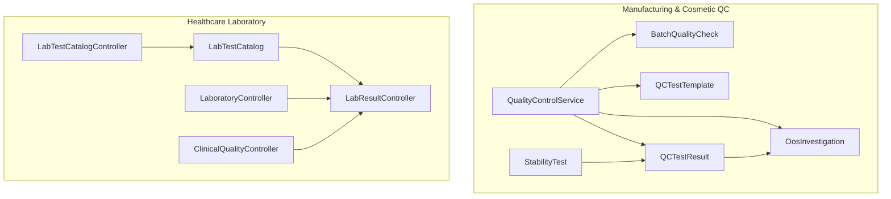
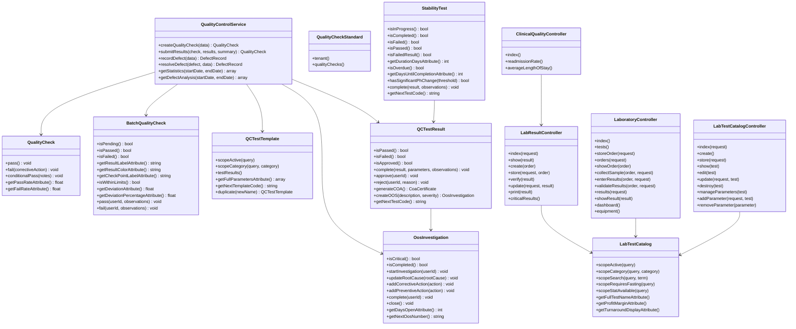
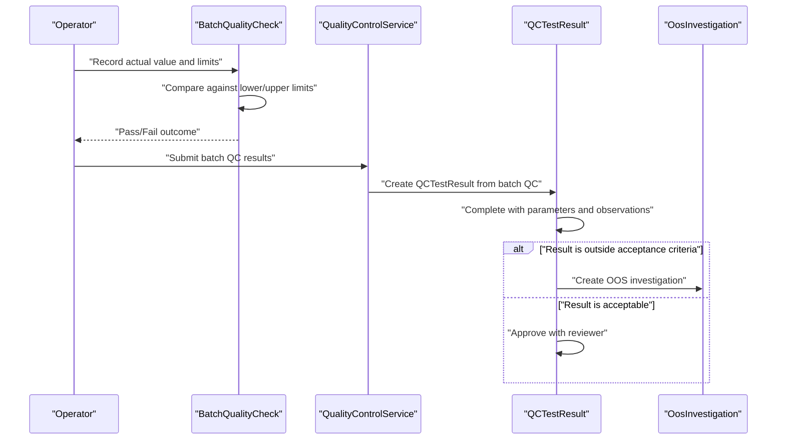
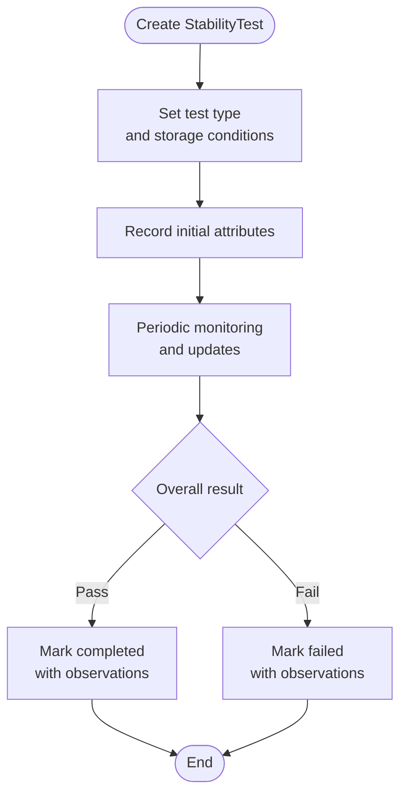
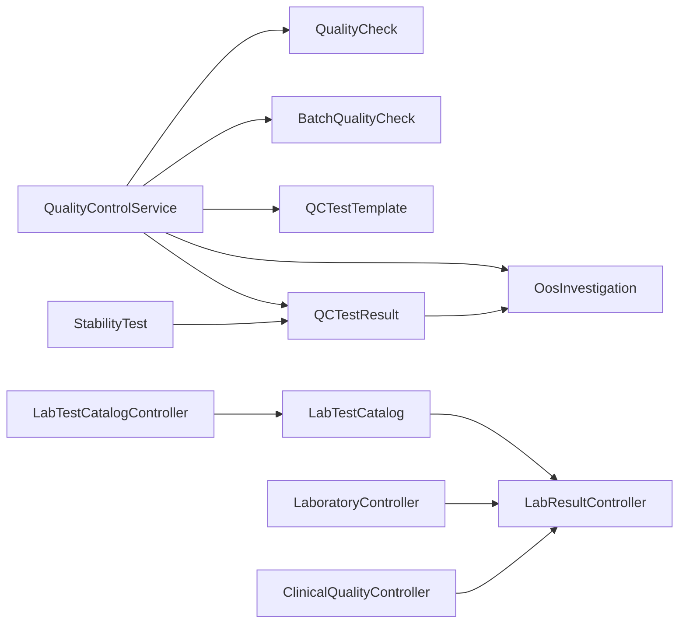

# Quality Control Testing

<cite>
**Referenced Files in This Document**
- [QCTestTemplate.php](file://app/Models/QCTestTemplate.php)
- [QCTestResult.php](file://app/Models/QCTestResult.php)
- [BatchQualityCheck.php](file://app/Models/BatchQualityCheck.php)
- [QualityCheck.php](file://app/Models/QualityCheck.php)
- [QualityCheckStandard.php](file://app/Models/QualityCheckStandard.php)
- [QualityGrade.php](file://app/Models/QualityGrade.php)
- [StabilityTest.php](file://app/Models/StabilityTest.php)
- [OosInvestigation.php](file://app/Models/OosInvestigation.php)
- [QualityControlService.php](file://app/Services/Manufacturing/QualityControlService.php)
- [LabTestCatalog.php](file://app/Models/LabTestCatalog.php)
- [LabResultController.php](file://app/Http/Controllers/Healthcare/LabResultController.php)
- [LabTestCatalogController.php](file://app/Http/Controllers/Healthcare/LabTestCatalogController.php)
- [LaboratoryController.php](file://app/Http/Controllers/Healthcare/LaboratoryController.php)
- [ClinicalQualityController.php](file://app/Http/Controllers/Healthcare/ClinicalQualityController.php)
</cite>

## Table of Contents
1. [Introduction](#introduction)
2. [Project Structure](#project-structure)
3. [Core Components](#core-components)
4. [Architecture Overview](#architecture-overview)
5. [Detailed Component Analysis](#detailed-component-analysis)
6. [Dependency Analysis](#dependency-analysis)
7. [Performance Considerations](#performance-considerations)
8. [Troubleshooting Guide](#troubleshooting-guide)
9. [Conclusion](#conclusion)
10. [Appendices](#appendices)

## Introduction
This document describes the Quality Control (QC) testing processes implemented in the system, covering test method development, quality specifications, testing protocols, result interpretation, and regulatory compliance pathways for both cosmetic and pharmaceutical/healthcare contexts. It explains incoming material testing, in-process controls, finished product testing, and stability studies. It also covers test template creation, batch testing requirements, out-of-specification (OOS) investigations, deviation handling, safety testing requirements, microbial limits, potency testing, and regulatory compliance.

## Project Structure
The QC domain spans models, services, and controllers across two primary areas:
- Manufacturing and Cosmetic QC: batch checks, test templates/results, stability testing, and OOS handling.
- Healthcare Laboratory: test catalog, result capture, verification, and reporting.

**Diagram sources**
- [QualityControlService.php:13-260](file://app/Services/Manufacturing/QualityControlService.php#L13-L260)
- [BatchQualityCheck.php:10-218](file://app/Models/BatchQualityCheck.php#L10-L218)
- [QCTestTemplate.php:13-97](file://app/Models/QCTestTemplate.php#L13-L97)
- [QCTestResult.php:13-217](file://app/Models/QCTestResult.php#L13-L217)
- [StabilityTest.php:10-277](file://app/Models/StabilityTest.php#L10-L277)
- [OosInvestigation.php:12-189](file://app/Models/OosInvestigation.php#L12-L189)
- [LabTestCatalog.php:8-119](file://app/Models/LabTestCatalog.php#L8-L119)
- [LabResultController.php:12-174](file://app/Http/Controllers/Healthcare/LabResultController.php#L12-L174)
- [LaboratoryController.php:12-253](file://app/Http/Controllers/Healthcare/LaboratoryController.php#L12-L253)
- [LabTestCatalogController.php:10-183](file://app/Http/Controllers/Healthcare/LabTestCatalogController.php#L10-L183)
- [ClinicalQualityController.php:10-74](file://app/Http/Controllers/Healthcare/ClinicalQualityController.php#L10-L74)

**Section sources**
- [QualityControlService.php:13-260](file://app/Services/Manufacturing/QualityControlService.php#L13-L260)
- [QCTestTemplate.php:13-97](file://app/Models/QCTestTemplate.php#L13-L97)
- [QCTestResult.php:13-217](file://app/Models/QCTestResult.php#L13-L217)
- [BatchQualityCheck.php:10-218](file://app/Models/BatchQualityCheck.php#L10-L218)
- [StabilityTest.php:10-277](file://app/Models/StabilityTest.php#L10-L277)
- [OosInvestigation.php:12-189](file://app/Models/OosInvestigation.php#L12-L189)
- [LabTestCatalog.php:8-119](file://app/Models/LabTestCatalog.php#L8-L119)
- [LabResultController.php:12-174](file://app/Http/Controllers/Healthcare/LabResultController.php#L12-L174)
- [LaboratoryController.php:12-253](file://app/Http/Controllers/Healthcare/LaboratoryController.php#L12-L253)
- [LabTestCatalogController.php:10-183](file://app/Http/Controllers/Healthcare/LabTestCatalogController.php#L10-L183)
- [ClinicalQualityController.php:10-74](file://app/Http/Controllers/Healthcare/ClinicalQualityController.php#L10-L74)

## Core Components
- Test Templates and Results (Cosmetic/Pharmaceutical):
  - QCTestTemplate defines reusable test templates with categories (e.g., microbial, heavy metal, preservative efficacy, physical, chemical) and acceptance criteria.
  - QCTestResult captures per-batch test outcomes, statuses, approvals, observations, and links to templates and batches.
- Batch Quality Checks:
  - BatchQualityCheck records in-process control checks (mixing, filling, packaging, final QC) with target/actual values, limits, deviations, and inspector actions.
- Standards and Grading:
  - QualityCheckStandard defines standardized inspection parameters and stages.
  - QualityCheck executes sampling-based inspections with pass/fail/conditional-pass outcomes and integrates with work orders.
  - QualityGrade defines product grade tiers with pricing multipliers and criteria.
- Stability Studies:
  - StabilityTest manages accelerated, real-time, freeze-thaw, photostability, and other stability tests with initial/final attributes, overall results, and status tracking.
- OOS Investigations:
  - OosInvestigation tracks out-of-specification events across laboratory, manufacturing, stability, and complaints with severity, status, and timelines.
- Laboratory Catalog and Results (Healthcare):
  - LabTestCatalog catalogs tests with categories, turnaround times, costs, and package flags.
  - LabResultController handles result entry, verification, critical result handling, and printing.
  - LaboratoryController orchestrates orders, samples, results entry, and validation.
  - LabTestCatalogController manages catalog maintenance and parameters.
  - ClinicalQualityController computes clinical quality metrics using lab and patient data.

**Section sources**
- [QCTestTemplate.php:13-97](file://app/Models/QCTestTemplate.php#L13-L97)
- [QCTestResult.php:13-217](file://app/Models/QCTestResult.php#L13-L217)
- [BatchQualityCheck.php:10-218](file://app/Models/BatchQualityCheck.php#L10-L218)
- [QualityCheck.php:8-138](file://app/Models/QualityCheck.php#L8-L138)
- [QualityCheckStandard.php:7-34](file://app/Models/QualityCheckStandard.php#L7-L34)
- [QualityGrade.php:10-47](file://app/Models/QualityGrade.php#L10-L47)
- [StabilityTest.php:10-277](file://app/Models/StabilityTest.php#L10-L277)
- [OosInvestigation.php:12-189](file://app/Models/OosInvestigation.php#L12-L189)
- [LabTestCatalog.php:8-119](file://app/Models/LabTestCatalog.php#L8-L119)
- [LabResultController.php:12-174](file://app/Http/Controllers/Healthcare/LabResultController.php#L12-L174)
- [LaboratoryController.php:12-253](file://app/Http/Controllers/Healthcare/LaboratoryController.php#L12-L253)
- [LabTestCatalogController.php:10-183](file://app/Http/Controllers/Healthcare/LabTestCatalogController.php#L10-L183)
- [ClinicalQualityController.php:10-74](file://app/Http/Controllers/Healthcare/ClinicalQualityController.php#L10-L74)

## Architecture Overview
The QC architecture separates concerns across domains:
- Manufacturing/Pharmaceutical QC: service-driven inspection workflows, batch control, and stability tracking.
- Healthcare Laboratory: catalog-driven test management and result lifecycle with verification and reporting.

**Diagram sources**
- [QualityControlService.php:13-260](file://app/Services/Manufacturing/QualityControlService.php#L13-L260)
- [QualityCheck.php:8-138](file://app/Models/QualityCheck.php#L8-L138)
- [BatchQualityCheck.php:10-218](file://app/Models/BatchQualityCheck.php#L10-L218)
- [QCTestTemplate.php:13-97](file://app/Models/QCTestTemplate.php#L13-L97)
- [QCTestResult.php:13-217](file://app/Models/QCTestResult.php#L13-L217)
- [StabilityTest.php:10-277](file://app/Models/StabilityTest.php#L10-L277)
- [OosInvestigation.php:12-189](file://app/Models/OosInvestigation.php#L12-L189)
- [LabTestCatalog.php:8-119](file://app/Models/LabTestCatalog.php#L8-L119)
- [LabResultController.php:12-174](file://app/Http/Controllers/Healthcare/LabResultController.php#L12-L174)
- [LaboratoryController.php:12-253](file://app/Http/Controllers/Healthcare/LaboratoryController.php#L12-L253)
- [LabTestCatalogController.php:10-183](file://app/Http/Controllers/Healthcare/LabTestCatalogController.php#L10-L183)
- [ClinicalQualityController.php:10-74](file://app/Http/Controllers/Healthcare/ClinicalQualityController.php#L10-L74)

## Detailed Component Analysis

### Test Method Development and Templates
- Purpose: Define standardized testing procedures and acceptance criteria for various categories (microbial, heavy metal, preservative efficacy, patch test, physical, chemical).
- Key capabilities:
  - Active and category-scoped retrieval.
  - Full parameter aggregation combining test parameters with acceptance criteria.
  - Automatic template code generation and duplication for versioning.
- Usage pattern:
  - Create templates with structured parameters and criteria.
  - Assign templates to batch tests via QCTestResult.
  - Use scopes to filter active templates and categories.

**Section sources**
- [QCTestTemplate.php:13-97](file://app/Models/QCTestTemplate.php#L13-L97)

### Batch Testing Protocols and In-Process Controls
- Purpose: Track and control quality checkpoints during production (mixing, filling, packaging, final QC).
- Key capabilities:
  - Target vs. actual values with lower/upper limits.
  - Deviation calculation and percentage computation.
  - Pass/fail actions with inspector attribution and observations.
  - Pending/Pass/Fail state transitions and summaries.
- Usage pattern:
  - Create batch QC entries at each checkpoint.
  - Record actual measurements and compare against limits.
  - Update status upon passing or failing.

**Section sources**
- [BatchQualityCheck.php:10-218](file://app/Models/BatchQualityCheck.php#L10-L218)

### Finished Product Testing and Result Interpretation
- Purpose: Capture and interpret final product test outcomes linked to batch records.
- Key capabilities:
  - Result states: pass, fail, inconclusive, pending.
  - Status states: draft, completed, approved, rejected.
  - Approve/reject workflows with approver attribution and timestamps.
  - Generate Certificates of Analysis (COA) from approved results.
  - Create OOS investigations automatically upon failure.
- Usage pattern:
  - Complete tests with measured parameters and observations.
  - Approve results after review.
  - Trigger OOS when results fall outside acceptance criteria.

**Section sources**
- [QCTestResult.php:13-217](file://app/Models/QCTestResult.php#L13-L217)

### Incoming Material Testing and Sampling Plans
- Purpose: Establish sampling plans and acceptance criteria for incoming materials aligned with standards.
- Key capabilities:
  - QualityCheckStandard defines parameters, units, min/max thresholds, and critical flags.
  - QualityCheck creates inspection records with stage, sample sizes, and outcomes.
  - Automatic pass/fail/conditional-pass determination based on critical failures and summary counts.
  - Integration with work orders to update quality status.
- Usage pattern:
  - Select a standard for the material type.
  - Create a quality check with default parameters from the standard.
  - Submit results and summary; system updates status and work order accordingly.

**Section sources**
- [QualityCheck.php:8-138](file://app/Models/QualityCheck.php#L8-L138)
- [QualityCheckStandard.php:7-34](file://app/Models/QualityCheckStandard.php#L7-L34)
- [QualityControlService.php:13-260](file://app/Services/Manufacturing/QualityControlService.php#L13-L260)

### Stability Studies and Potency Testing
- Purpose: Monitor product stability under various conditions and track potency-related attributes.
- Key capabilities:
  - Test types: accelerated, real-time, freeze-thaw, photostability.
  - Initial and final attributes (pH, appearance, viscosity, microbial results).
  - Duration calculations and overdue detection.
  - Significant change detection (e.g., pH).
  - Completion with overall result and observations.
- Usage pattern:
  - Create stability tests with storage conditions and expected timelines.
  - Record initial attributes at start.
  - Periodically update and finalize when completed or failed.

**Section sources**
- [StabilityTest.php:10-277](file://app/Models/StabilityTest.php#L10-L277)

### Out-of-Specification (OOS) Investigations and Deviations
- Purpose: Investigate and resolve out-of-specification events across laboratory, manufacturing, stability, and complaints.
- Key capabilities:
  - Severity levels (low, medium, high, critical).
  - Status tracking: open, investigating, completed, closed.
  - Root cause, corrective, and preventive actions.
  - Days open calculation and timeline tracking.
  - Automatic OOS number generation.
- Usage pattern:
  - Automatically create OOS from failed QCTestResult.
  - Start investigations, assign investigators, and document actions.
  - Complete/close investigations upon resolution.

**Section sources**
- [OosInvestigation.php:12-189](file://app/Models/OosInvestigation.php#L12-L189)
- [QCTestResult.php:147-160](file://app/Models/QCTestResult.php#L147-L160)

### Safety Testing Requirements and Microbial Limits
- Purpose: Enforce safety and compliance through microbial and heavy metal testing.
- Key capabilities:
  - Template categories include microbial and heavy metal testing.
  - Acceptance criteria embedded in templates guide pass/fail decisions.
  - Batch QC supports limits and deviations for safety-critical attributes.
- Usage pattern:
  - Select appropriate templates for safety testing.
  - Compare measured values against acceptance criteria.
  - Record deviations and initiate OOS when necessary.

**Section sources**
- [QCTestTemplate.php:36-47](file://app/Models/QCTestTemplate.php#L36-L47)
- [BatchQualityCheck.php:115-123](file://app/Models/BatchQualityCheck.php#L115-L123)

### Potency Testing and Regulatory Compliance
- Purpose: Ensure product potency meets specifications and support regulatory submissions.
- Key capabilities:
  - Stability tests capture potency-related attributes (e.g., viscosity, pH).
  - Approved test results can generate Certificates of Analysis (COA).
  - OOS investigations support regulatory change control and deviation handling.
- Usage pattern:
  - Conduct stability studies and record outcomes.
  - Generate COAs from approved results for regulatory documentation.
  - Investigate and resolve OOS events with documented actions.

**Section sources**
- [QCTestResult.php:129-145](file://app/Models/QCTestResult.php#L129-L145)
- [StabilityTest.php:147-158](file://app/Models/StabilityTest.php#L147-L158)
- [OosInvestigation.php:87-130](file://app/Models/OosInvestigation.php#L87-L130)

### Healthcare Laboratory Catalog and Result Lifecycle
- Purpose: Manage test catalog, sample collection, result entry, verification, and reporting.
- Key capabilities:
  - LabTestCatalog: categories, turnaround times, pricing, package flags.
  - LaboratoryController: orders, sample collection, results entry, validation.
  - LabResultController: result entry, verification, critical result handling, printing.
  - LabTestCatalogController: catalog maintenance and parameter management.
  - ClinicalQualityController: compute quality metrics using lab and patient data.
- Usage pattern:
  - Select tests from the catalog and create orders.
  - Collect samples and enter results with verification.
  - Generate reports and monitor critical results.

**Section sources**
- [LabTestCatalog.php:8-119](file://app/Models/LabTestCatalog.php#L8-L119)
- [LaboratoryController.php:12-253](file://app/Http/Controllers/Healthcare/LaboratoryController.php#L12-L253)
- [LabResultController.php:12-174](file://app/Http/Controllers/Healthcare/LabResultController.php#L12-L174)
- [LabTestCatalogController.php:10-183](file://app/Http/Controllers/Healthcare/LabTestCatalogController.php#L10-L183)
- [ClinicalQualityController.php:10-74](file://app/Http/Controllers/Healthcare/ClinicalQualityController.php#L10-L74)

### Sequence: Batch QC and Result Approval

**Diagram sources**
- [BatchQualityCheck.php:155-176](file://app/Models/BatchQualityCheck.php#L155-L176)
- [QualityControlService.php:66-107](file://app/Services/Manufacturing/QualityControlService.php#L66-L107)
- [QCTestResult.php:98-127](file://app/Models/QCTestResult.php#L98-L127)
- [OosInvestigation.php:87-130](file://app/Models/OosInvestigation.php#L87-L130)

### Flowchart: Stability Test Lifecycle

**Diagram sources**
- [StabilityTest.php:268-276](file://app/Models/StabilityTest.php#L268-L276)

## Dependency Analysis
- Cohesion:
  - Manufacturing QC components (QualityControlService, QualityCheck, BatchQualityCheck, QCTestTemplate/Result, StabilityTest, OosInvestigation) are tightly coupled around batch and product quality workflows.
  - Healthcare Laboratory components (LabTestCatalog, LaboratoryController, LabResultController, LabTestCatalogController, ClinicalQualityController) are cohesive around test catalog and result lifecycle.
- Coupling:
  - QCTestResult depends on QCTestTemplate and batch records; it can trigger OosInvestigation and COA generation.
  - StabilityTest can be linked to batch records and informs QCTestResult outcomes.
  - QualityControlService coordinates QC activities and updates work order quality status.
  - LabResultController depends on LabTestCatalog and LaboratoryController for order/result orchestration.
- External dependencies:
  - Authentication and authorization are used implicitly for actor attribution (tested_by, approved_by, checked_by, verified_by).
  - Notifications for critical results are referenced but implementation is externalized.

**Diagram sources**
- [QualityControlService.php:13-260](file://app/Services/Manufacturing/QualityControlService.php#L13-L260)
- [QCTestResult.php:13-217](file://app/Models/QCTestResult.php#L13-L217)
- [OosInvestigation.php:12-189](file://app/Models/OosInvestigation.php#L12-L189)
- [StabilityTest.php:10-277](file://app/Models/StabilityTest.php#L10-L277)
- [LabTestCatalog.php:8-119](file://app/Models/LabTestCatalog.php#L8-L119)
- [LabResultController.php:12-174](file://app/Http/Controllers/Healthcare/LabResultController.php#L12-L174)
- [LaboratoryController.php:12-253](file://app/Http/Controllers/Healthcare/LaboratoryController.php#L12-L253)
- [LabTestCatalogController.php:10-183](file://app/Http/Controllers/Healthcare/LabTestCatalogController.php#L10-L183)
- [ClinicalQualityController.php:10-74](file://app/Http/Controllers/Healthcare/ClinicalQualityController.php#L10-L74)

**Section sources**
- [QualityControlService.php:13-260](file://app/Services/Manufacturing/QualityControlService.php#L13-L260)
- [QCTestResult.php:13-217](file://app/Models/QCTestResult.php#L13-L217)
- [OosInvestigation.php:12-189](file://app/Models/OosInvestigation.php#L12-L189)
- [StabilityTest.php:10-277](file://app/Models/StabilityTest.php#L10-L277)
- [LabTestCatalog.php:8-119](file://app/Models/LabTestCatalog.php#L8-L119)
- [LabResultController.php:12-174](file://app/Http/Controllers/Healthcare/LabResultController.php#L12-L174)
- [LaboratoryController.php:12-253](file://app/Http/Controllers/Healthcare/LaboratoryController.php#L12-L253)
- [LabTestCatalogController.php:10-183](file://app/Http/Controllers/Healthcare/LabTestCatalogController.php#L10-L183)
- [ClinicalQualityController.php:10-74](file://app/Http/Controllers/Healthcare/ClinicalQualityController.php#L10-L74)

## Performance Considerations
- Indexing and Scoping:
  - Use scopes (e.g., active templates, category filters, overdue stability tests) to minimize query overhead.
  - Apply pagination for large result sets (catalog listings, QC statistics).
- Aggregation and Reporting:
  - Statistics queries (pass/fail rates, defect analysis) should leverage database grouping and aggregation to avoid heavy client-side computations.
- Critical Result Handling:
  - Critical result notifications should be asynchronous to avoid blocking result entry.
- Data Types:
  - Decimal casting for numeric fields ensures precision and efficient comparisons.

[No sources needed since this section provides general guidance]

## Troubleshooting Guide
- Batch QC does not reflect pass/fail:
  - Verify actual values and limits are populated; confirm isWithinLimits logic and pass/fail methods are invoked.
  - Check inspector attribution and timestamps.
- Test result not generating COA:
  - Ensure batch_id exists and result is approved; confirm generateCOA logic conditions.
- OOS not created on failure:
  - Confirm createOOS is called on failed results; verify severity and description inputs.
- Stability test overdue:
  - Check expected_end_date and status; use isOverdue helper to detect delays.
- Lab result verification:
  - Ensure verify endpoint updates verified_by and verified_at; handle critical result notifications appropriately.

**Section sources**
- [BatchQualityCheck.php:155-176](file://app/Models/BatchQualityCheck.php#L155-L176)
- [QCTestResult.php:129-145](file://app/Models/QCTestResult.php#L129-L145)
- [OosInvestigation.php:87-130](file://app/Models/OosInvestigation.php#L87-L130)
- [StabilityTest.php:176-183](file://app/Models/StabilityTest.php#L176-L183)
- [LabResultController.php:101-113](file://app/Http/Controllers/Healthcare/LabResultController.php#L101-L113)

## Conclusion
The system provides a robust QC framework spanning manufacturing/pharmaceutical and healthcare laboratory domains. It supports standardized test templates, in-process controls, finished product testing, stability studies, and OOS investigations. With clear result interpretation, approval workflows, and regulatory-ready outputs like COAs, it enables compliance and continuous improvement across cosmetic and pharmaceutical operations.

[No sources needed since this section summarizes without analyzing specific files]

## Appendices

### Regulatory Compliance Notes
- COA Generation:
  - Approved QCTestResult can generate a Certificate of Analysis for regulatory submission.
- OOS Investigation:
  - Supports severity classification, root cause, corrective/preventive actions, and closure tracking.
- Stability Data:
  - Provides structured stability outcomes suitable for shelf-life and storage condition justification.

**Section sources**
- [QCTestResult.php:129-145](file://app/Models/QCTestResult.php#L129-L145)
- [OosInvestigation.php:75-130](file://app/Models/OosInvestigation.php#L75-L130)
- [StabilityTest.php:197-218](file://app/Models/StabilityTest.php#L197-L218)