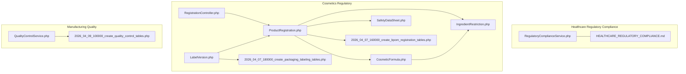
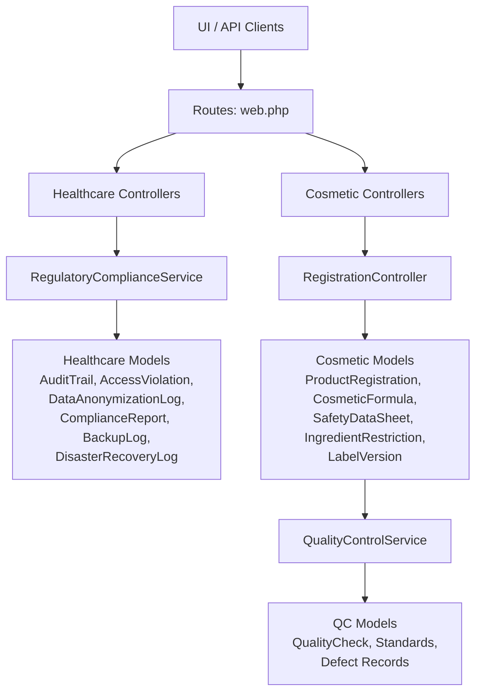
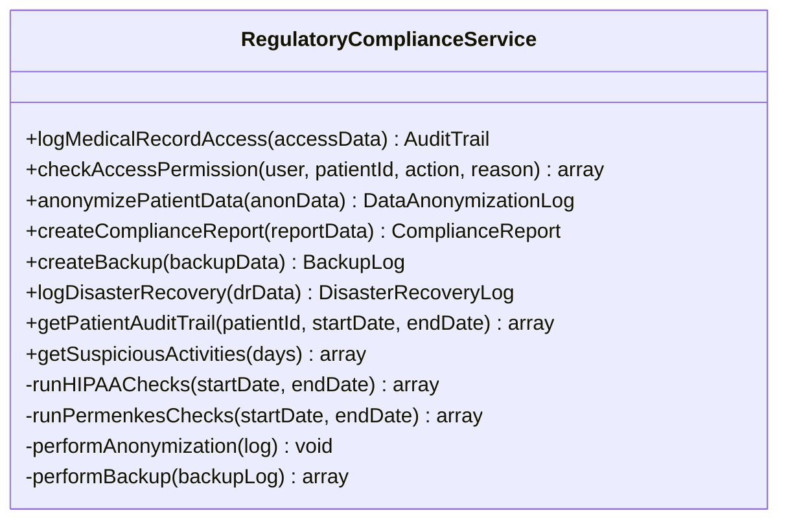
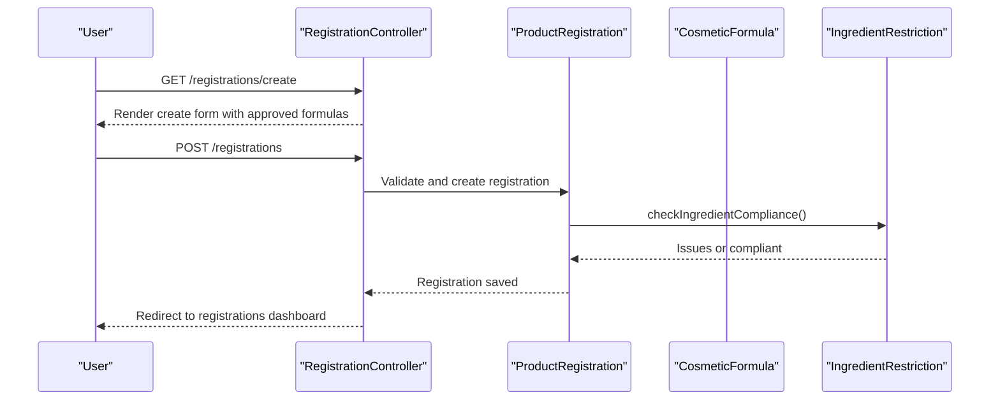
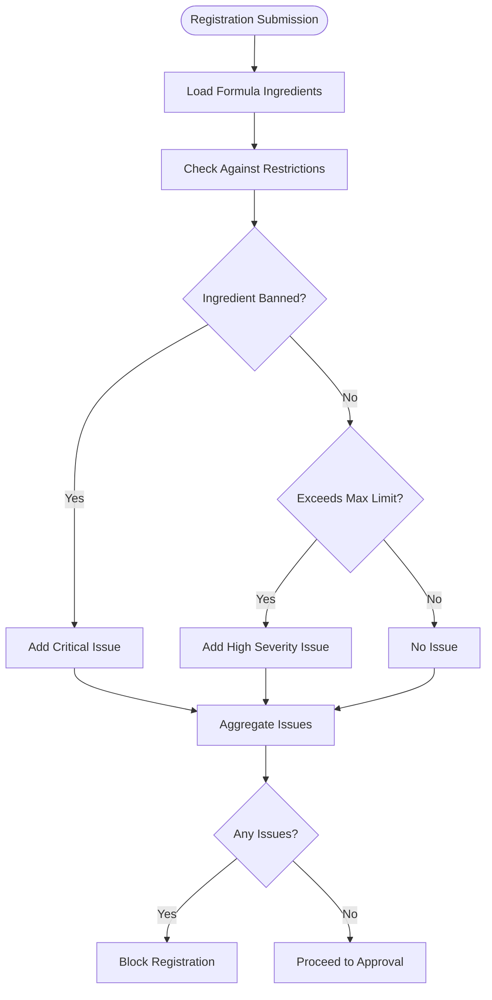
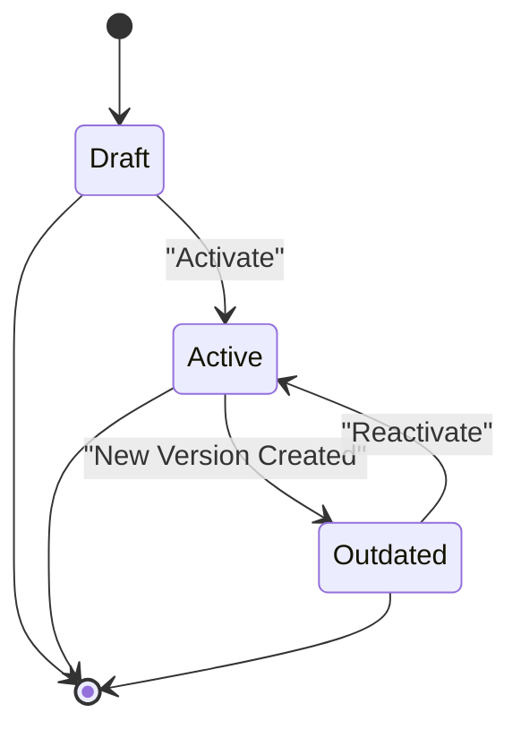
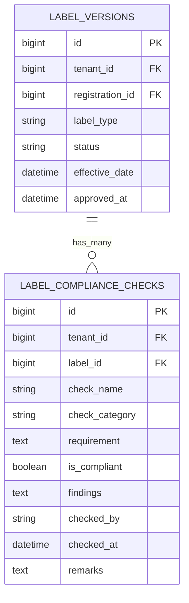
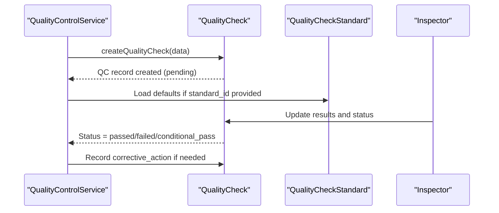
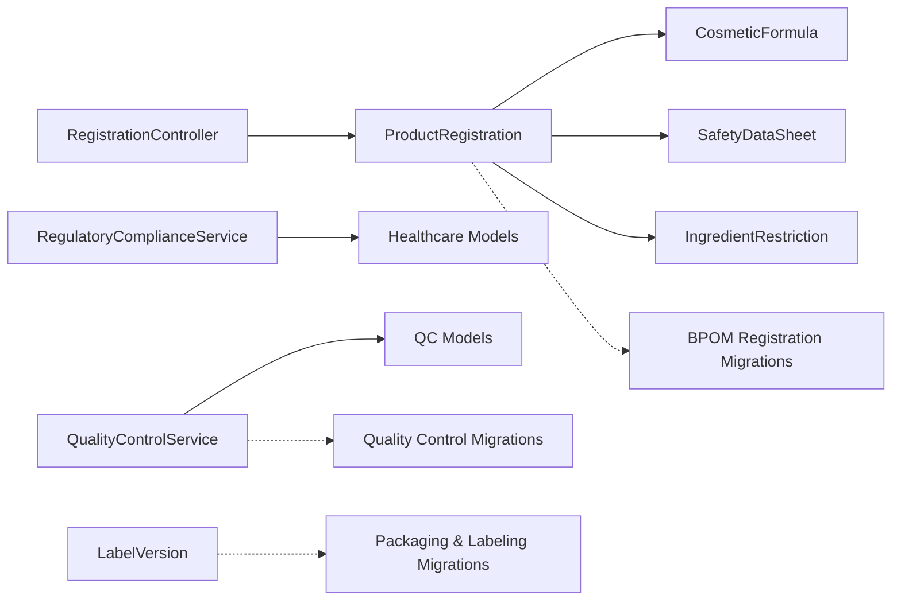

# Regulatory Compliance

<cite>
**Referenced Files in This Document**
- [RegulatoryComplianceService.php](file://app/Services/RegulatoryComplianceService.php)
- [HEALTHCARE_REGULATORY_COMPLIANCE.md](file://docs/HEALTHCARE_REGULATORY_COMPLIANCE.md)
- [RegistrationController.php](file://app/Http/Controllers/Cosmetic/RegistrationController.php)
- [web.php](file://routes/web.php)
- [index.blade.php](file://resources/views/cosmetic/registrations/index.blade.php)
- [create.blade.php](file://resources/views/cosmetic/registrations/create.blade.php)
- [ProductRegistration.php](file://app/Models/ProductRegistration.php)
- [CosmeticFormula.php](file://app/Models/CosmeticFormula.php)
- [SafetyDataSheet.php](file://app/Models/SafetyDataSheet.php)
- [IngredientRestriction.php](file://app/Models/IngredientRestriction.php)
- [LabelVersion.php](file://app/Models/LabelVersion.php)
- [2026_04_07_160000_create_bpom_registration_tables.php](file://database/migrations/2026_04_07_160000_create_bpom_registration_tables.php)
- [2026_04_07_180000_create_packaging_labeling_tables.php](file://database/migrations/2026_04_07_180000_create_packaging_labeling_tables.php)
- [2026_04_09_100000_create_quality_control_tables.php](file://database/migrations/2026_04_09_100000_create_quality_control_tables.php)
- [QualityControlService.php](file://app/Services/Manufacturing/QualityControlService.php)
- [ComplianceReportController.php](file://app/Http/Controllers/Healthcare/ComplianceReportController.php)
- [regulatory.blade.php](file://resources/views/cosmetic/analytics/regulatory.blade.php)
</cite>

## Table of Contents
1. [Introduction](#introduction)
2. [Project Structure](#project-structure)
3. [Core Components](#core-components)
4. [Architecture Overview](#architecture-overview)
5. [Detailed Component Analysis](#detailed-component-analysis)
6. [Dependency Analysis](#dependency-analysis)
7. [Performance Considerations](#performance-considerations)
8. [Troubleshooting Guide](#troubleshooting-guide)
9. [Conclusion](#conclusion)
10. [Appendices](#appendices)

## Introduction
This document provides comprehensive guidance for Regulatory Compliance management within the qalcuityERP ecosystem. It covers product registration processes for cosmetics, regulatory submission requirements, approval workflows, labeling compliance, ingredient disclosure, safety assessments, adverse event reporting, Good Manufacturing Practice (GMP) compliance, facility inspections, documentation requirements, and regulatory audits. It also outlines international regulatory harmonization, product classification, and compliance monitoring systems tailored for both cosmetics and pharmaceuticals.

## Project Structure
The Regulatory Compliance domain spans three primary areas:
- Healthcare compliance (HIPAA, Permenkes, GDPR, ISO) with audit trails, RBAC, anonymization, backups, and DR
- Cosmetics regulatory (BPOM registration, ingredient restrictions, SDS, labeling)
- Manufacturing quality control aligned with GMP expectations

**Diagram sources**
- [RegulatoryComplianceService.php:1-581](file://app/Services/RegulatoryComplianceService.php#L1-L581)
- [HEALTHCARE_REGULATORY_COMPLIANCE.md:1-615](file://docs/HEALTHCARE_REGULATORY_COMPLIANCE.md#L1-L615)
- [RegistrationController.php:1-69](file://app/Http/Controllers/Cosmetic/RegistrationController.php#L1-L69)
- [ProductRegistration.php:1-208](file://app/Models/ProductRegistration.php#L1-L208)
- [CosmeticFormula.php:1-239](file://app/Models/CosmeticFormula.php#L1-L239)
- [SafetyDataSheet.php:1-126](file://app/Models/SafetyDataSheet.php#L1-L126)
- [IngredientRestriction.php:1-87](file://app/Models/IngredientRestriction.php#L1-L87)
- [LabelVersion.php:1-166](file://app/Models/LabelVersion.php#L1-L166)
- [2026_04_07_160000_create_bpom_registration_tables.php:1-105](file://database/migrations/2026_04_07_160000_create_bpom_registration_tables.php#L1-L105)
- [2026_04_07_180000_create_packaging_labeling_tables.php:1-90](file://database/migrations/2026_04_07_180000_create_packaging_labeling_tables.php#L1-L90)
- [QualityControlService.php:1-43](file://app/Services/Manufacturing/QualityControlService.php#L1-L43)
- [2026_04_09_100000_create_quality_control_tables.php:1-56](file://database/migrations/2026_04_09_100000_create_quality_control_tables.php#L1-L56)

**Section sources**
- [web.php:1018-1025](file://routes/web.php#L1018-L1025)
- [index.blade.php:1-30](file://resources/views/cosmetic/registrations/index.blade.php#L1-L30)
- [create.blade.php:85-108](file://resources/views/cosmetic/registrations/create.blade.php#L85-L108)

## Core Components
- Healthcare Regulatory Compliance Service: Provides HIPAA and Permenkes-aligned audit logging, RBAC, anonymization, compliance reporting, backups, and disaster recovery.
- Cosmetics Regulatory: Manages BPOM registration lifecycle, ingredient restriction checks, SDS maintenance, and labeling compliance.
- Manufacturing Quality Control: Supports GMP-aligned QC processes, including sampling, testing, and corrective actions.

Key capabilities:
- Audit trail logging with HIPAA relevance flags
- Role-based access control with emergency access and after-hours monitoring
- Data anonymization with ethics approvals and reversible/non-reversible options
- Compliance scoring across frameworks (HIPAA, Permenkes, GDPR, ISO)
- Encrypted backups with retention policies and verification
- Disaster recovery incident logging and recovery metrics
- BPOM registration workflows (notification/certification), expiration tracking, and ingredient safety checks
- SDS lifecycle management and periodic review triggers
- Label compliance verification with structured checks and statuses
- GMP-aligned QC with standards, inspectors, and corrective actions

**Section sources**
- [RegulatoryComplianceService.php:17-581](file://app/Services/RegulatoryComplianceService.php#L17-L581)
- [HEALTHCARE_REGULATORY_COMPLIANCE.md:1-615](file://docs/HEALTHCARE_REGULATORY_COMPLIANCE.md#L1-L615)
- [ProductRegistration.php:122-159](file://app/Models/ProductRegistration.php#L122-L159)
- [SafetyDataSheet.php:52-90](file://app/Models/SafetyDataSheet.php#L52-L90)
- [LabelVersion.php:139-166](file://app/Models/LabelVersion.php#L139-L166)
- [QualityControlService.php:25-43](file://app/Services/Manufacturing/QualityControlService.php#L25-L43)

## Architecture Overview
The system integrates healthcare and cosmetics regulatory domains with manufacturing quality controls. Controllers orchestrate user interactions, models encapsulate business logic and persistence, services centralize compliance and QC workflows, and migrations define the schema for regulatory artifacts.

**Diagram sources**
- [web.php:1018-1025](file://routes/web.php#L1018-L1025)
- [RegulatoryComplianceService.php:17-581](file://app/Services/RegulatoryComplianceService.php#L17-L581)
- [RegistrationController.php:1-69](file://app/Http/Controllers/Cosmetic/RegistrationController.php#L1-L69)
- [ProductRegistration.php:1-208](file://app/Models/ProductRegistration.php#L1-L208)
- [CosmeticFormula.php:1-239](file://app/Models/CosmeticFormula.php#L1-L239)
- [SafetyDataSheet.php:1-126](file://app/Models/SafetyDataSheet.php#L1-L126)
- [IngredientRestriction.php:1-87](file://app/Models/IngredientRestriction.php#L1-L87)
- [LabelVersion.php:1-166](file://app/Models/LabelVersion.php#L1-L166)
- [QualityControlService.php:1-43](file://app/Services/Manufacturing/QualityControlService.php#L1-L43)
- [2026_04_09_100000_create_quality_control_tables.php:1-56](file://database/migrations/2026_04_09_100000_create_quality_control_tables.php#L1-L56)

## Detailed Component Analysis

### Healthcare Regulatory Compliance Service
The service underpins HIPAA and Permenkes compliance with:
- Audit trail logging for medical records with PHI classification and risk assessment
- RBAC checks against roles and patient assignments, including emergency access and after-hours flags
- Data anonymization workflows with multiple methods and ethics tracking
- Automated compliance checks and scoring across frameworks
- Backup creation with encryption and retention policies
- Disaster recovery incident logging with severity and affected records tracking

**Diagram sources**
- [RegulatoryComplianceService.php:17-581](file://app/Services/RegulatoryComplianceService.php#L17-L581)

**Section sources**
- [RegulatoryComplianceService.php:22-96](file://app/Services/RegulatoryComplianceService.php#L22-L96)
- [RegulatoryComplianceService.php:101-134](file://app/Services/RegulatoryComplianceService.php#L101-L134)
- [RegulatoryComplianceService.php:139-176](file://app/Services/RegulatoryComplianceService.php#L139-L176)
- [RegulatoryComplianceService.php:181-234](file://app/Services/RegulatoryComplianceService.php#L181-L234)
- [RegulatoryComplianceService.php:239-254](file://app/Services/RegulatoryComplianceService.php#L239-L254)
- [RegulatoryComplianceService.php:259-281](file://app/Services/RegulatoryComplianceService.php#L259-L281)
- [RegulatoryComplianceService.php:302-370](file://app/Services/RegulatoryComplianceService.php#L302-L370)

### Cosmetics Regulatory Registration Workflow
The BPOM registration process supports notification and certification types, tracks status, submission/approval dates, and expiration. Ingredient safety is validated against tenant-specific restrictions.

**Diagram sources**
- [RegistrationController.php:46-69](file://app/Http/Controllers/Cosmetic/RegistrationController.php#L46-L69)
- [ProductRegistration.php:122-159](file://app/Models/ProductRegistration.php#L122-L159)
- [CosmeticFormula.php:64-67](file://app/Models/CosmeticFormula.php#L64-L67)
- [IngredientRestriction.php:64-85](file://app/Models/IngredientRestriction.php#L64-L85)

**Section sources**
- [RegistrationController.php:18-41](file://app/Http/Controllers/Cosmetic/RegistrationController.php#L18-L41)
- [RegistrationController.php:46-53](file://app/Http/Controllers/Cosmetic/RegistrationController.php#L46-L53)
- [RegistrationController.php:58-69](file://app/Http/Controllers/Cosmetic/RegistrationController.php#L58-L69)
- [web.php:1018-1025](file://routes/web.php#L1018-L1025)
- [index.blade.php:1-30](file://resources/views/cosmetic/registrations/index.blade.php#L1-L30)
- [create.blade.php:85-108](file://resources/views/cosmetic/registrations/create.blade.php#L85-L108)
- [ProductRegistration.php:18-38](file://app/Models/ProductRegistration.php#L18-L38)
- [ProductRegistration.php:122-159](file://app/Models/ProductRegistration.php#L122-L159)

### Ingredient Restriction and Safety Assessment
IngredientRestriction defines banned/restricted/limited lists with maximum limits and validation outcomes. ProductRegistration integrates these checks during registration to prevent non-compliant formulations from proceeding.

**Diagram sources**
- [ProductRegistration.php:122-159](file://app/Models/ProductRegistration.php#L122-L159)
- [IngredientRestriction.php:52-85](file://app/Models/IngredientRestriction.php#L52-L85)

**Section sources**
- [IngredientRestriction.php:16-28](file://app/Models/IngredientRestriction.php#L16-L28)
- [IngredientRestriction.php:64-85](file://app/Models/IngredientRestriction.php#L64-L85)
- [ProductRegistration.php:122-159](file://app/Models/ProductRegistration.php#L122-L159)

### Safety Data Sheet (SDS) Lifecycle
SDS maintains hazard statements, precautionary measures, and periodic review schedules. It supports activation, deactivation, and versioning to ensure up-to-date safety information.

**Diagram sources**
- [SafetyDataSheet.php:61-90](file://app/Models/SafetyDataSheet.php#L61-L90)

**Section sources**
- [SafetyDataSheet.php:17-40](file://app/Models/SafetyDataSheet.php#L17-L40)
- [SafetyDataSheet.php:52-90](file://app/Models/SafetyDataSheet.php#L52-L90)
- [SafetyDataSheet.php:118-125](file://app/Models/SafetyDataSheet.php#L118-L125)

### Labeling Compliance and Verification
LabelVersion tracks label versions and compliance checks. Each check maps to regulatory requirements (e.g., ingredient list, net weight, BPOM number) with pass/fail outcomes and remarks.

**Diagram sources**
- [2026_04_07_180000_create_packaging_labeling_tables.php:49-78](file://database/migrations/2026_04_07_180000_create_packaging_labeling_tables.php#L49-L78)
- [LabelVersion.php:139-166](file://app/Models/LabelVersion.php#L139-L166)

**Section sources**
- [2026_04_07_180000_create_packaging_labeling_tables.php:62-78](file://database/migrations/2026_04_07_180000_create_packaging_labeling_tables.php#L62-L78)
- [LabelVersion.php:139-166](file://app/Models/LabelVersion.php#L139-L166)

### Manufacturing Quality Control (GMP Alignment)
QualityControlService creates QC checks linked to work orders and products, supporting stage-wise testing, pass/fail outcomes, and corrective actions. This aligns with GMP expectations for in-process and final product quality verification.

**Diagram sources**
- [QualityControlService.php:25-43](file://app/Services/Manufacturing/QualityControlService.php#L25-L43)
- [2026_04_09_100000_create_quality_control_tables.php:34-56](file://database/migrations/2026_04_09_100000_create_quality_control_tables.php#L34-L56)

**Section sources**
- [QualityControlService.php:25-43](file://app/Services/Manufacturing/QualityControlService.php#L25-L43)
- [2026_04_09_100000_create_quality_control_tables.php:34-56](file://database/migrations/2026_04_09_100000_create_quality_control_tables.php#L34-L56)

## Dependency Analysis
- Controllers depend on models and services to enforce business rules and maintain separation of concerns.
- Models encapsulate domain logic (status helpers, scopes, relationships) and rely on tenant scoping traits.
- Services centralize cross-cutting concerns like compliance checks, anonymization, and QC workflows.
- Migrations define the schema for regulatory artifacts and QC processes.

**Diagram sources**
- [RegistrationController.php:1-69](file://app/Http/Controllers/Cosmetic/RegistrationController.php#L1-L69)
- [ProductRegistration.php:1-208](file://app/Models/ProductRegistration.php#L1-L208)
- [CosmeticFormula.php:1-239](file://app/Models/CosmeticFormula.php#L1-L239)
- [SafetyDataSheet.php:1-126](file://app/Models/SafetyDataSheet.php#L1-L126)
- [IngredientRestriction.php:1-87](file://app/Models/IngredientRestriction.php#L1-L87)
- [RegulatoryComplianceService.php:1-581](file://app/Services/RegulatoryComplianceService.php#L1-L581)
- [QualityControlService.php:1-43](file://app/Services/Manufacturing/QualityControlService.php#L1-L43)
- [2026_04_07_160000_create_bpom_registration_tables.php:1-105](file://database/migrations/2026_04_07_160000_create_bpom_registration_tables.php#L1-L105)
- [2026_04_07_180000_create_packaging_labeling_tables.php:1-90](file://database/migrations/2026_04_07_180000_create_packaging_labeling_tables.php#L1-L90)
- [2026_04_09_100000_create_quality_control_tables.php:1-56](file://database/migrations/2026_04_09_100000_create_quality_control_tables.php#L1-L56)

**Section sources**
- [ProductRegistration.php:187-207](file://app/Models/ProductRegistration.php#L187-L207)
- [SafetyDataSheet.php:107-116](file://app/Models/SafetyDataSheet.php#L107-L116)
- [LabelVersion.php:146-166](file://app/Models/LabelVersion.php#L146-L166)

## Performance Considerations
- Indexing: Ensure database migrations include appropriate indexes on tenant_id, status, and date fields to optimize compliance queries and reporting.
- Background jobs: Schedule compliance checks, backup verification, and report generation via queued jobs to avoid blocking user requests.
- Pagination: Use pagination for audit trails, compliance reports, and registration listings to manage large datasets efficiently.
- Caching: Cache frequently accessed compliance metrics and SDS status to reduce database load.
- Encryption overhead: AES-256 backups are secure but add CPU overhead; schedule backups during off-peak hours.

[No sources needed since this section provides general guidance]

## Troubleshooting Guide
Common issues and resolutions:
- Access Denied with Requires Approval: When RBAC denies access due to unassigned patients or unauthorized roles, trigger an approval workflow and log violations for review.
- Compliance Score Drops: Investigate failed checks flagged by automated verifications; remediate missing audit logs, backup failures, or access log review gaps.
- SDS Expiration: Monitor review_due dates and automate reminders; create new versions and mark old ones as outdated.
- Ingredient Restrictions Breach: Validate formulas against restrictions before registration; block submissions with banned or excessive-limit ingredients.
- Label Compliance Failures: Review label compliance checks and ensure all mandatory fields are present and accurate.

**Section sources**
- [RegulatoryComplianceService.php:43-96](file://app/Services/RegulatoryComplianceService.php#L43-L96)
- [RegulatoryComplianceService.php:286-297](file://app/Services/RegulatoryComplianceService.php#L286-L297)
- [SafetyDataSheet.php:52-59](file://app/Models/SafetyDataSheet.php#L52-L59)
- [ProductRegistration.php:122-159](file://app/Models/ProductRegistration.php#L122-L159)
- [LabelVersion.php:139-144](file://app/Models/LabelVersion.php#L139-L144)

## Conclusion
The qalcuityERP Regulatory Compliance module delivers a robust foundation for managing healthcare and cosmetics regulatory requirements. It integrates HIPAA and Permenkes compliance with automated checks, RBAC enforcement, anonymization, backups, and disaster recovery. For cosmetics, it streamlines BPOM registration, ingredient safety, SDS lifecycle, and labeling compliance. For manufacturing, it supports GMP-aligned quality control processes. Together, these components enable organizations to maintain compliance, mitigate risks, and ensure audit readiness across both industries.

[No sources needed since this section summarizes without analyzing specific files]

## Appendices

### Regulatory Frameworks Supported
- HIPAA (USA): Access controls, audit controls, integrity, transmission security, backup/recovery, access log review
- Permenkes 269/2008 (Indonesia): Complete medical records, confidentiality, audit trail, backup, patient rights
- GDPR (Europe): Ready for implementation
- ISO 27001 (International): Ready for implementation

**Section sources**
- [RegulatoryComplianceService.php:286-297](file://app/Services/RegulatoryComplianceService.php#L286-L297)
- [HEALTHCARE_REGULATORY_COMPLIANCE.md:549-557](file://docs/HEALTHCARE_REGULATORY_COMPLIANCE.md#L549-L557)

### Compliance Monitoring Dashboards
- Healthcare: Compliance scores, audit trail summaries, access control metrics, backup status, anonymization requests, disaster recovery incidents
- Cosmetics: Registration statistics, compliance health metrics, upcoming expirations, recent submissions

**Section sources**
- [regulatory.blade.php:27-50](file://resources/views/cosmetic/analytics/regulatory.blade.php#L27-L50)
- [HEALTHCARE_REGULATORY_COMPLIANCE.md:415-464](file://docs/HEALTHCARE_REGULATORY_COMPLIANCE.md#L415-L464)