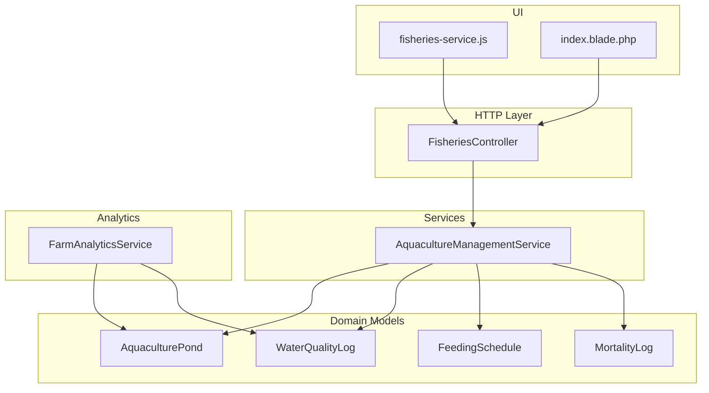
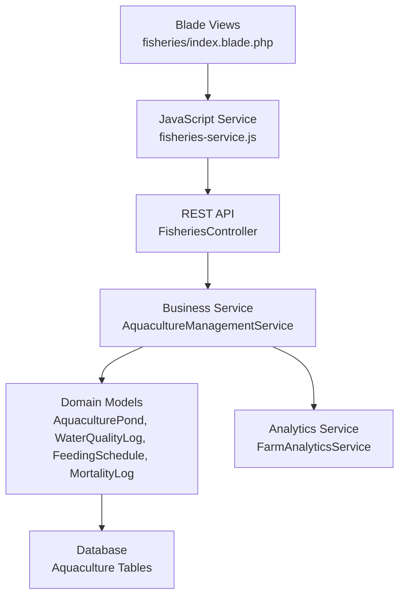
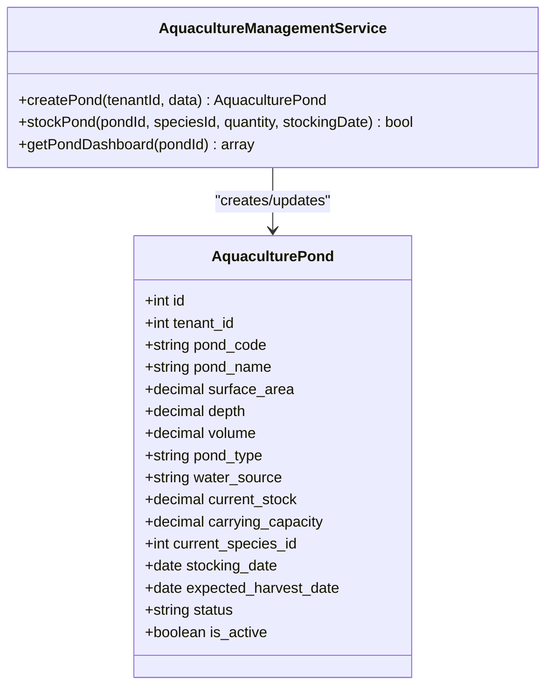
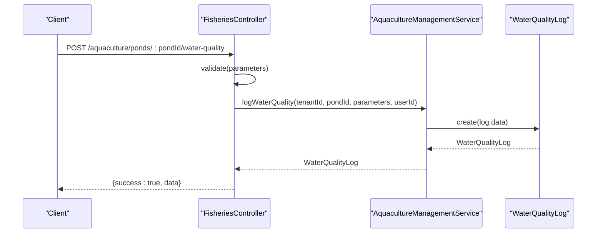
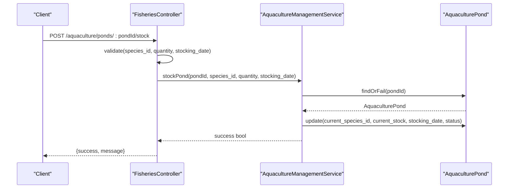
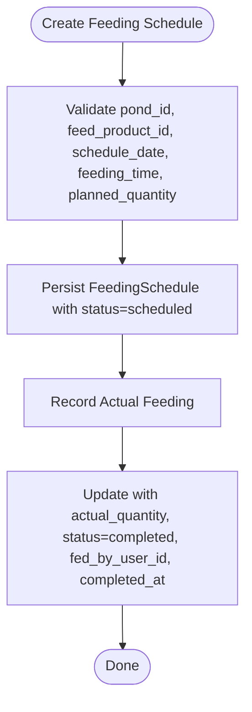
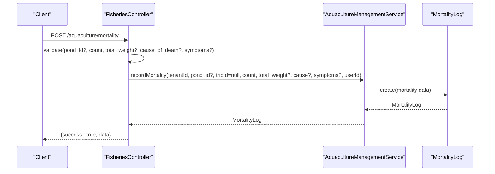
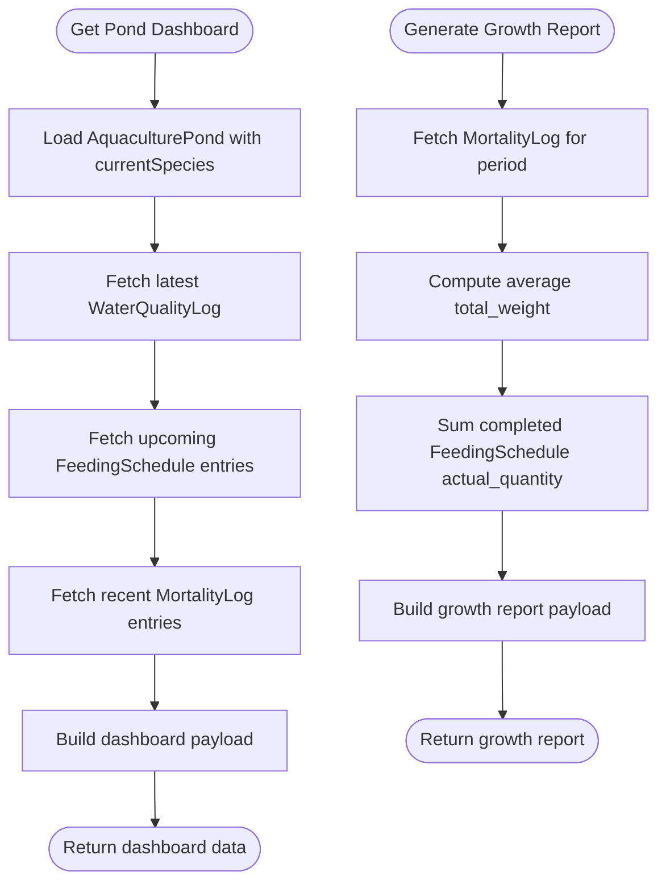
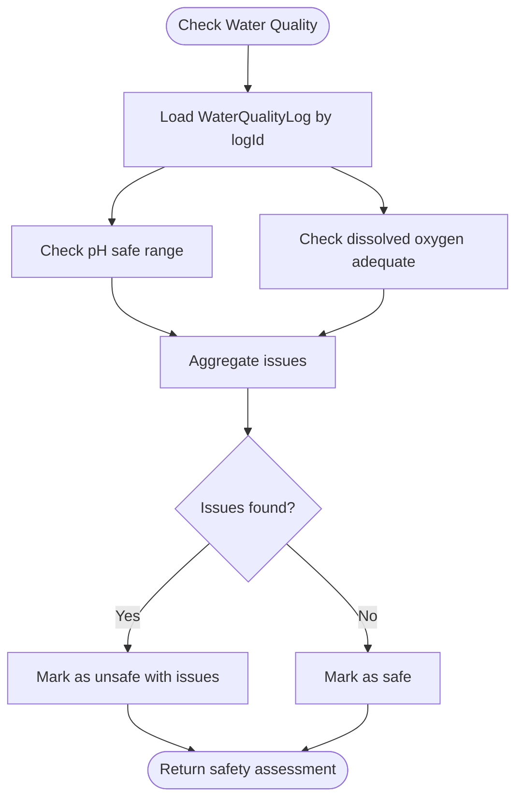
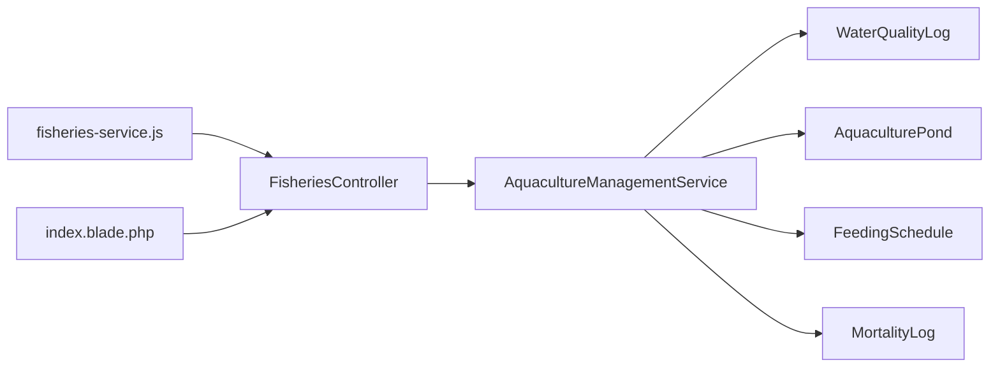

# Aquaculture Farm Management

<cite>
**Referenced Files in This Document**
- [AquacultureManagementService.php](file://app/Services/Fisheries/AquacultureManagementService.php)
- [FisheriesController.php](file://app/Http/Controllers/Fisheries/FisheriesController.php)
- [WaterQualityLog.php](file://app/Models/WaterQualityLog.php)
- [2026_04_06_140000_create_fisheries_tables.php](file://database/migrations/2026_04_06_140000_create_fisheries_tables.php)
- [2026_04_01_000001_create_user_dashboard_configs_table.php](file://database/migrations/2026_04_01_000001_create_user_dashboard_configs_table.php)
- [2026_04_03_000001_create_custom_dashboard_widgets_table.php](file://database/migrations/2026_04_03_000001_create_custom_dashboard_widgets_table.php)
- [FarmAnalyticsService.php](file://app/Services/FarmAnalyticsService.php)
- [fisheries-service.js](file://resources/js/fisheries-service.js)
- [index.blade.php](file://resources/views/fisheries/index.blade.php)
</cite>

## Table of Contents
1. [Introduction](#introduction)
2. [Project Structure](#project-structure)
3. [Core Components](#core-components)
4. [Architecture Overview](#architecture-overview)
5. [Detailed Component Analysis](#detailed-component-analysis)
6. [Dependency Analysis](#dependency-analysis)
7. [Performance Considerations](#performance-considerations)
8. [Troubleshooting Guide](#troubleshooting-guide)
9. [Conclusion](#conclusion)
10. [Appendices](#appendices)

## Introduction
This document describes the Aquaculture Farm Management capabilities implemented in the system. It covers pond lifecycle management, water quality monitoring, fish stocking, feeding scheduling and recording, mortality incident logging, and farm dashboard analytics. It also outlines the API endpoints for creating and managing ponds, logging water quality parameters, recording feedings, reporting mortality, and retrieving dashboard insights. The document further explains how environmental monitoring integrates with growth tracking algorithms, disease prevention protocols, and sustainable farming practices.

## Project Structure
The aquaculture domain is organized around:
- Controllers for HTTP endpoints
- Services encapsulating business logic
- Models representing domain entities
- Migrations defining database schema
- Frontend integration via JavaScript service layer
- Blade templates for UI navigation

**Diagram sources**
- [FisheriesController.php:13-695](file://app/Http/Controllers/Fisheries/FisheriesController.php#L13-L695)
- [AquacultureManagementService.php:10-275](file://app/Services/Fisheries/AquacultureManagementService.php#L10-L275)
- [WaterQualityLog.php:10-74](file://app/Models/WaterQualityLog.php#L10-L74)
- [2026_04_06_140000_create_fisheries_tables.php:279-297](file://database/migrations/2026_04_06_140000_create_fisheries_tables.php#L279-L297)
- [FarmAnalyticsService.php:11-160](file://app/Services/FarmAnalyticsService.php#L11-L160)
- [fisheries-service.js:126-147](file://resources/js/fisheries-service.js#L126-L147)
- [index.blade.php:72-87](file://resources/views/fisheries/index.blade.php#L72-L87)

**Section sources**
- [FisheriesController.php:13-695](file://app/Http/Controllers/Fisheries/FisheriesController.php#L13-L695)
- [AquacultureManagementService.php:10-275](file://app/Services/Fisheries/AquacultureManagementService.php#L10-L275)
- [WaterQualityLog.php:10-74](file://app/Models/WaterQualityLog.php#L10-L74)
- [2026_04_06_140000_create_fisheries_tables.php:279-297](file://database/migrations/2026_04_06_140000_create_fisheries_tables.php#L279-L297)
- [FarmAnalyticsService.php:11-160](file://app/Services/FarmAnalyticsService.php#L11-L160)
- [fisheries-service.js:126-147](file://resources/js/fisheries-service.js#L126-L147)
- [index.blade.php:72-87](file://resources/views/fisheries/index.blade.php#L72-L87)

## Core Components
- AquacultureManagementService: Orchestrates pond creation, stocking, water quality logging, safety checks, feeding schedule creation and recording, mortality logging, FCR calculation, and pond dashboard aggregation.
- FisheriesController: Exposes REST endpoints for listing and creating ponds, stocking, logging water quality, recording feedings, reporting mortality, and retrieving pond dashboards.
- WaterQualityLog: Represents water quality measurements with validation helpers for pH and dissolved oxygen thresholds.
- Database schema: Defines aquaculture_ponds, water quality logs, feeding schedules, and mortality logs.
- Analytics: FarmAnalyticsService supports comparative and trend analytics for agricultural plots; similar patterns can be applied to aquaculture metrics.
- Frontend integration: fisheries-service.js provides client-side API bindings for aquaculture operations.
- UI navigation: index.blade.php exposes the Aquaculture Management module in the fisheries menu.

**Section sources**
- [AquacultureManagementService.php:10-275](file://app/Services/Fisheries/AquacultureManagementService.php#L10-L275)
- [FisheriesController.php:422-558](file://app/Http/Controllers/Fisheries/FisheriesController.php#L422-L558)
- [WaterQualityLog.php:64-73](file://app/Models/WaterQualityLog.php#L64-L73)
- [2026_04_06_140000_create_fisheries_tables.php:279-297](file://database/migrations/2026_04_06_140000_create_fisheries_tables.php#L279-L297)
- [FarmAnalyticsService.php:11-160](file://app/Services/FarmAnalyticsService.php#L11-L160)
- [fisheries-service.js:126-147](file://resources/js/fisheries-service.js#L126-L147)
- [index.blade.php:72-87](file://resources/views/fisheries/index.blade.php#L72-L87)

## Architecture Overview
The system follows a layered architecture:
- Presentation: UI pages and JavaScript service layer
- API: REST endpoints in FisheriesController
- Application: AquacultureManagementService orchestrates domain operations
- Persistence: Eloquent models backed by migrations

**Diagram sources**
- [index.blade.php:72-87](file://resources/views/fisheries/index.blade.php#L72-L87)
- [fisheries-service.js:126-147](file://resources/js/fisheries-service.js#L126-L147)
- [FisheriesController.php:422-558](file://app/Http/Controllers/Fisheries/FisheriesController.php#L422-L558)
- [AquacultureManagementService.php:10-275](file://app/Services/Fisheries/AquacultureManagementService.php#L10-L275)
- [FarmAnalyticsService.php:11-160](file://app/Services/FarmAnalyticsService.php#L11-L160)
- [2026_04_06_140000_create_fisheries_tables.php:279-297](file://database/migrations/2026_04_06_140000_create_fisheries_tables.php#L279-L297)

## Detailed Component Analysis

### Pond Management
- Creation: Validates and persists pond metadata (code, name, surface area, depth, volume, carrying capacity, type, water source).
- Stocking: Updates pond with current species, quantity, stocking date, and status.
- Dashboard: Aggregates utilization percentage, days to harvest, latest water quality, upcoming feedings, and recent mortality.

**Diagram sources**
- [AquacultureManagementService.php:15-50](file://app/Services/Fisheries/AquacultureManagementService.php#L15-L50)
- [AquacultureManagementService.php:207-242](file://app/Services/Fisheries/AquacultureManagementService.php#L207-L242)
- [2026_04_06_140000_create_fisheries_tables.php:279-297](file://database/migrations/2026_04_06_140000_create_fisheries_tables.php#L279-L297)

**Section sources**
- [AquacultureManagementService.php:15-50](file://app/Services/Fisheries/AquacultureManagementService.php#L15-L50)
- [AquacultureManagementService.php:207-242](file://app/Services/Fisheries/AquacultureManagementService.php#L207-L242)
- [FisheriesController.php:425-476](file://app/Http/Controllers/Fisheries/FisheriesController.php#L425-L476)

### Water Quality Monitoring
- Logging: Records pH, dissolved oxygen, temperature, salinity, ammonia, nitrite, nitrate, turbidity, method, measured by user, and timestamp.
- Safety checks: Provides helper validations for pH and dissolved oxygen thresholds.
- API: Endpoint accepts water quality parameters and persists a new measurement.

**Diagram sources**
- [FisheriesController.php:481-500](file://app/Http/Controllers/Fisheries/FisheriesController.php#L481-L500)
- [AquacultureManagementService.php:55-73](file://app/Services/Fisheries/AquacultureManagementService.php#L55-L73)
- [WaterQualityLog.php:14-42](file://app/Models/WaterQualityLog.php#L14-L42)

**Section sources**
- [AquacultureManagementService.php:55-101](file://app/Services/Fisheries/AquacultureManagementService.php#L55-L101)
- [WaterQualityLog.php:64-73](file://app/Models/WaterQualityLog.php#L64-L73)
- [FisheriesController.php:481-500](file://app/Http/Controllers/Fisheries/FisheriesController.php#L481-L500)

### Fish Stocking Operations
- Endpoint validates species existence and quantity, then stocks the pond and updates status.
- Service encapsulates the update logic and error handling.

**Diagram sources**
- [FisheriesController.php:457-476](file://app/Http/Controllers/Fisheries/FisheriesController.php#L457-L476)
- [AquacultureManagementService.php:34-50](file://app/Services/Fisheries/AquacultureManagementService.php#L34-L50)

**Section sources**
- [AquacultureManagementService.php:34-50](file://app/Services/Fisheries/AquacultureManagementService.php#L34-L50)
- [FisheriesController.php:457-476](file://app/Http/Controllers/Fisheries/FisheriesController.php#L457-L476)

### Feeding Schedules and Recording
- Schedule creation: Creates a planned feeding entry linked to a pond and feed product.
- Recording actual feeding: Updates scheduled entry with actual quantity, completion status, and timestamp.

**Diagram sources**
- [AquacultureManagementService.php:106-138](file://app/Services/Fisheries/AquacultureManagementService.php#L106-L138)

**Section sources**
- [AquacultureManagementService.php:106-138](file://app/Services/Fisheries/AquacultureManagementService.php#L106-L138)
- [FisheriesController.php:514-531](file://app/Http/Controllers/Fisheries/FisheriesController.php#L514-L531)

### Mortality Tracking
- Records mortality incidents with counts, optional total weight, cause, symptoms, and reporter metadata.
- Supports linking to a pond or a fishing trip.

**Diagram sources**
- [FisheriesController.php:536-558](file://app/Http/Controllers/Fisheries/FisheriesController.php#L536-L558)
- [AquacultureManagementService.php:143-156](file://app/Services/Fisheries/AquacultureManagementService.php#L143-L156)

**Section sources**
- [AquacultureManagementService.php:143-156](file://app/Services/Fisheries/AquacultureManagementService.php#L143-L156)
- [FisheriesController.php:536-558](file://app/Http/Controllers/Fisheries/FisheriesController.php#L536-L558)

### Farm Dashboard Analytics
- Pond dashboard aggregates utilization, days to harvest, latest water quality, upcoming feedings, and recent mortality.
- Growth report computes average mortality weight and total feed consumed over a period.
- FCR calculation estimates Feed Conversion Ratio using actual quantities and current stock.

**Diagram sources**
- [AquacultureManagementService.php:207-242](file://app/Services/Fisheries/AquacultureManagementService.php#L207-L242)
- [AquacultureManagementService.php:247-273](file://app/Services/Fisheries/AquacultureManagementService.php#L247-L273)
- [AquacultureManagementService.php:161-202](file://app/Services/Fisheries/AquacultureManagementService.php#L161-L202)

**Section sources**
- [AquacultureManagementService.php:207-242](file://app/Services/Fisheries/AquacultureManagementService.php#L207-L242)
- [AquacultureManagementService.php:247-273](file://app/Services/Fisheries/AquacultureManagementService.php#L247-L273)
- [AquacultureManagementService.php:161-202](file://app/Services/Fisheries/AquacultureManagementService.php#L161-L202)

### Automated Health Monitoring
- Water quality safety checks: pH and dissolved oxygen thresholds are evaluated to flag unsafe conditions.
- Integration points: These checks can trigger alerts and automated actions when thresholds are exceeded.

**Diagram sources**
- [AquacultureManagementService.php:78-101](file://app/Services/Fisheries/AquacultureManagementService.php#L78-L101)
- [WaterQualityLog.php:64-73](file://app/Models/WaterQualityLog.php#L64-L73)

**Section sources**
- [AquacultureManagementService.php:78-101](file://app/Services/Fisheries/AquacultureManagementService.php#L78-L101)
- [WaterQualityLog.php:64-73](file://app/Models/WaterQualityLog.php#L64-L73)

### Environmental Monitoring Systems
- Water quality logging captures multiple environmental parameters with timestamps and measurement method.
- Future enhancements can integrate sensor data streams and real-time alerting.

**Section sources**
- [AquacultureManagementService.php:55-73](file://app/Services/Fisheries/AquacultureManagementService.php#L55-L73)
- [FisheriesController.php:481-500](file://app/Http/Controllers/Fisheries/FisheriesController.php#L481-L500)

### Growth Tracking Algorithms
- FCR computation: Feed Conversion Ratio calculated from total feed consumed and current stock.
- Growth report: Uses mortality logs to estimate average weights and feed consumption trends.

**Section sources**
- [AquacultureManagementService.php:161-202](file://app/Services/Fisheries/AquacultureManagementService.php#L161-L202)
- [AquacultureManagementService.php:247-273](file://app/Services/Fisheries/AquacultureManagementService.php#L247-L273)

### Disease Prevention Protocols
- Mortality logging captures causes and symptoms, enabling outbreak tracking and protocol adherence.
- Water quality safety checks support preventive measures by flagging hazardous conditions.

**Section sources**
- [AquacultureManagementService.php:143-156](file://app/Services/Fisheries/AquacultureManagementService.php#L143-L156)
- [AquacultureManagementService.php:78-101](file://app/Services/Fisheries/AquacultureManagementService.php#L78-L101)

### Sustainable Farming Practices Integration
- Dashboard widgets and custom metrics enable tracking of resource efficiency and environmental impact.
- FarmAnalyticsService demonstrates comparative and trend analytics patterns suitable for sustainability KPIs.

**Section sources**
- [FarmAnalyticsService.php:11-160](file://app/Services/FarmAnalyticsService.php#L11-L160)
- [2026_04_01_000001_create_user_dashboard_configs_table.php:11-17](file://database/migrations/2026_04_01_000001_create_user_dashboard_configs_table.php#L11-L17)
- [2026_04_03_000001_create_custom_dashboard_widgets_table.php:10-45](file://database/migrations/2026_04_03_000001_create_custom_dashboard_widgets_table.php#L10-L45)

## Dependency Analysis
- Controllers depend on AquacultureManagementService for business logic.
- Service depends on Eloquent models for persistence.
- WaterQualityLog encapsulates validation logic for environmental thresholds.
- Frontend service layer communicates with backend endpoints.
- UI navigation links to the aquaculture module.

**Diagram sources**
- [FisheriesController.php:13-695](file://app/Http/Controllers/Fisheries/FisheriesController.php#L13-L695)
- [AquacultureManagementService.php:10-275](file://app/Services/Fisheries/AquacultureManagementService.php#L10-L275)
- [WaterQualityLog.php:10-74](file://app/Models/WaterQualityLog.php#L10-L74)
- [fisheries-service.js:126-147](file://resources/js/fisheries-service.js#L126-L147)
- [index.blade.php:72-87](file://resources/views/fisheries/index.blade.php#L72-L87)

**Section sources**
- [FisheriesController.php:13-695](file://app/Http/Controllers/Fisheries/FisheriesController.php#L13-L695)
- [AquacultureManagementService.php:10-275](file://app/Services/Fisheries/AquacultureManagementService.php#L10-L275)
- [WaterQualityLog.php:10-74](file://app/Models/WaterQualityLog.php#L10-L74)
- [fisheries-service.js:126-147](file://resources/js/fisheries-service.js#L126-L147)
- [index.blade.php:72-87](file://resources/views/fisheries/index.blade.php#L72-L87)

## Performance Considerations
- Indexing: Ensure database indexes on tenant_id, pond_id, schedule_date, measured_at, and reported_at for efficient queries.
- Pagination: Use pagination for listing endpoints to limit payload sizes.
- Aggregation: Prefer server-side aggregation and avoid loading unnecessary fields.
- Caching: Cache dashboard summaries periodically to reduce repeated computations.

## Troubleshooting Guide
- Validation failures: Review endpoint validation rules for required fields and constraints.
- Stocking errors: Confirm species exists and quantities are valid; check service error logs.
- Water quality thresholds: Verify parameter ranges and measurement method consistency.
- Dashboard gaps: Ensure recent records exist for water quality, feedings, and mortality.

**Section sources**
- [FisheriesController.php:440-476](file://app/Http/Controllers/Fisheries/FisheriesController.php#L440-L476)
- [AquacultureManagementService.php:34-50](file://app/Services/Fisheries/AquacultureManagementService.php#L34-L50)
- [AquacultureManagementService.php:55-73](file://app/Services/Fisheries/AquacultureManagementService.php#L55-L73)

## Conclusion
The Aquaculture Farm Management system provides a robust foundation for pond lifecycle management, environmental monitoring, feeding operations, and mortality tracking. The modular design with dedicated services and controllers enables scalable enhancements, while dashboard analytics and custom widgets support informed decision-making. Integrating automated health monitoring and sustainable practices will further strengthen operational excellence.

## Appendices

### API Endpoints Summary
- List ponds: GET /aquaculture/ponds
- Create pond: POST /aquaculture/ponds
- Stock pond: POST /aquaculture/ponds/{pondId}/stock
- Log water quality: POST /aquaculture/ponds/{pondId}/water-quality
- Record feeding: POST /aquaculture/feedings/{scheduleId}
- Record mortality: POST /aquaculture/mortality
- Pond dashboard: GET /aquaculture/ponds/{pondId}/dashboard

**Section sources**
- [FisheriesController.php:425-558](file://app/Http/Controllers/Fisheries/FisheriesController.php#L425-L558)

### Database Schema Highlights
- aquaculture_ponds: Stores pond metadata and status.
- water_quality_logs: Captures environmental measurements.
- feeding_schedules: Manages planned and completed feedings.
- mortality_logs: Tracks fish mortality events.

**Section sources**
- [2026_04_06_140000_create_fisheries_tables.php:279-297](file://database/migrations/2026_04_06_140000_create_fisheries_tables.php#L279-L297)