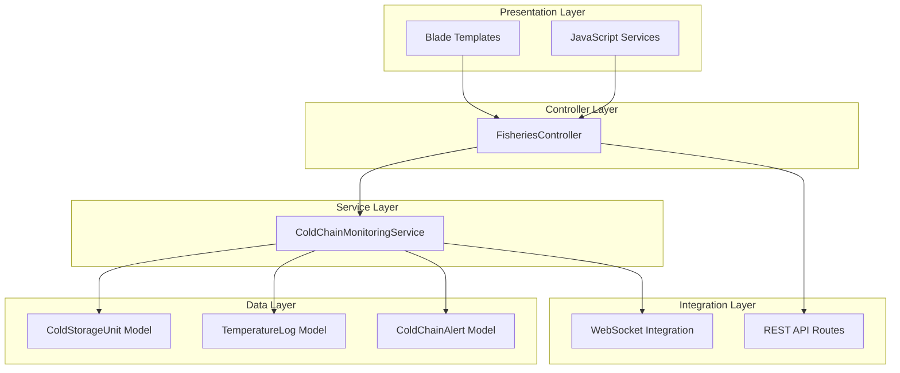
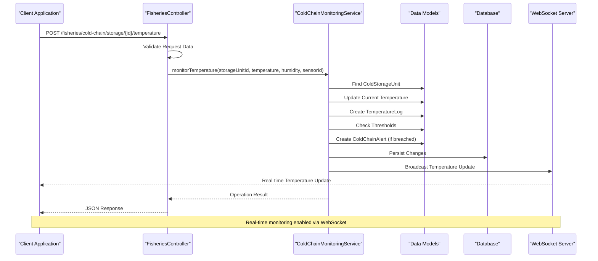
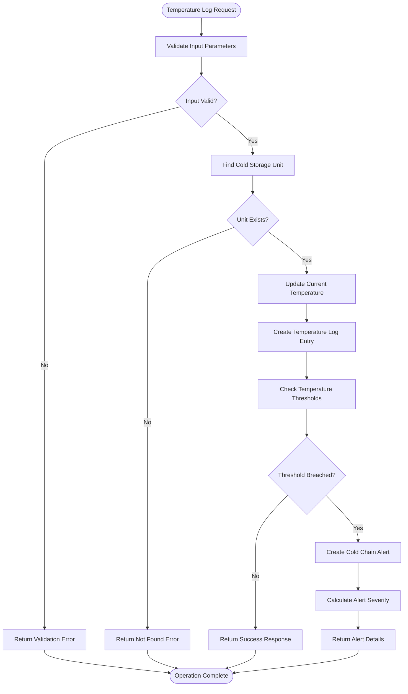
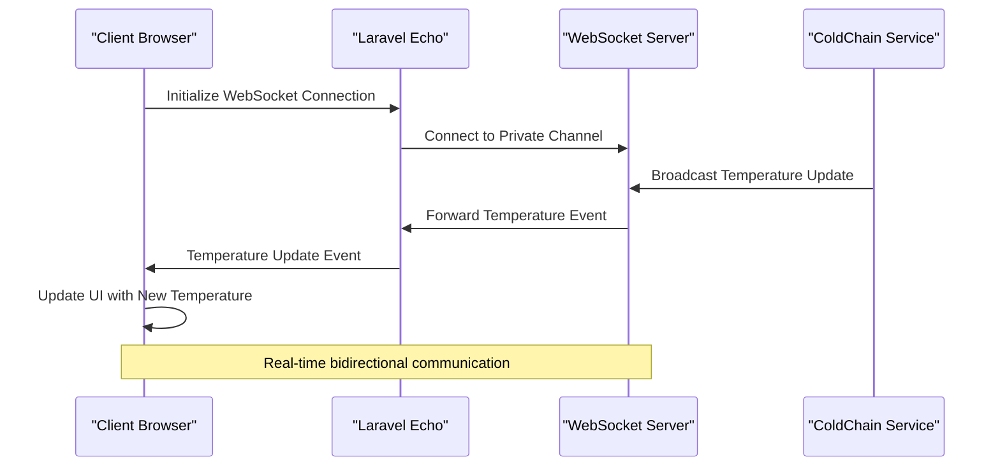
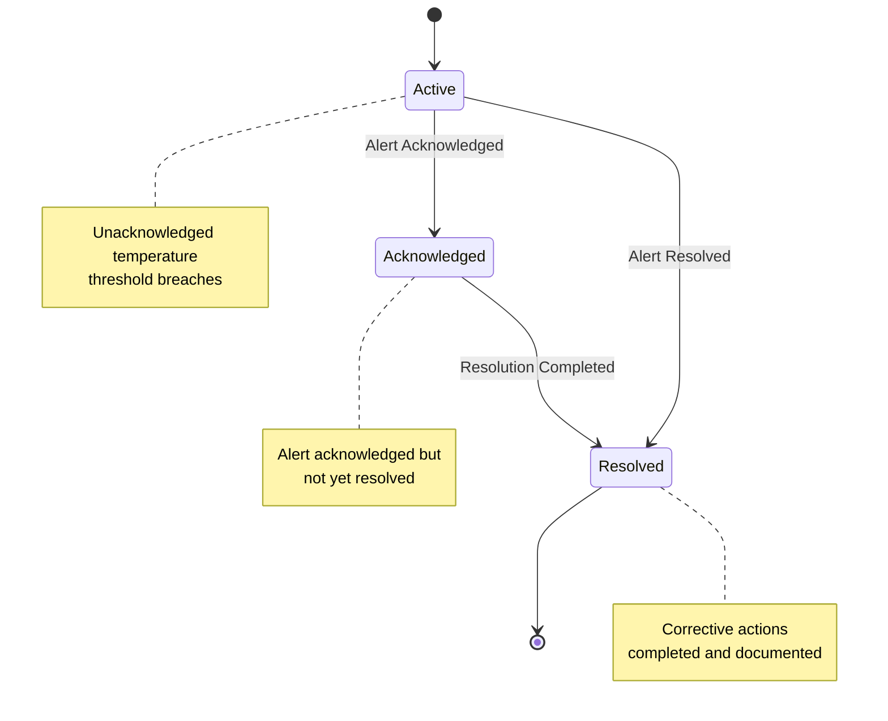
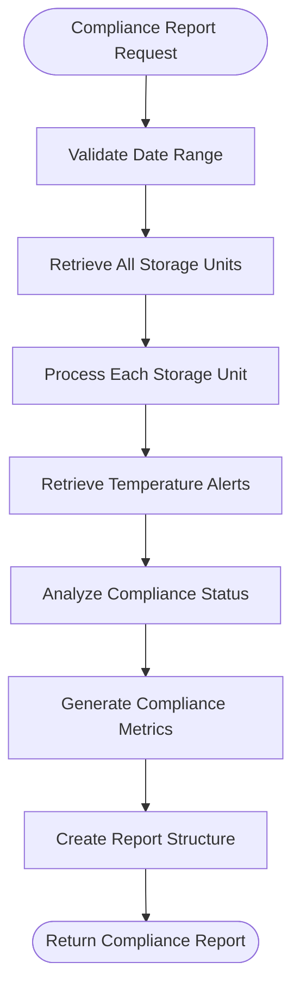

# Cold Chain Monitoring System

<cite>
**Referenced Files in This Document**
- [FisheriesController.php](file://app/Http/Controllers/Fisheries/FisheriesController.php)
- [ColdChainMonitoringService.php](file://app/Services/Fisheries/ColdChainMonitoringService.php)
- [cold-chain.blade.php](file://resources/views/fisheries/cold-chain.blade.php)
- [fisheries-service.js](file://resources/js/fisheries-service.js)
- [api.php](file://routes/api.php)
</cite>

## Table of Contents
1. [Introduction](#introduction)
2. [Project Structure](#project-structure)
3. [Core Components](#core-components)
4. [Architecture Overview](#architecture-overview)
5. [Detailed Component Analysis](#detailed-component-analysis)
6. [API Specifications](#api-specifications)
7. [Real-time Integration](#real-time-integration)
8. [Alert Management](#alert-management)
9. [Compliance Reporting](#compliance-reporting)
10. [Temperature History Tracking](#temperature-history-tracking)
11. [IoT Sensor Integration](#iot-sensor-integration)
12. [Performance Considerations](#performance-considerations)
13. [Troubleshooting Guide](#troubleshooting-guide)
14. [Conclusion](#conclusion)

## Introduction

The Cold Chain Monitoring System is a comprehensive temperature monitoring solution designed specifically for seafood storage facilities. This system provides real-time temperature tracking, automated alerting mechanisms, compliance reporting, and integrated IoT sensor connectivity to ensure optimal seafood preservation conditions throughout the supply chain.

The system operates within the broader qalcuityERP ecosystem, focusing on fisheries and seafood cold chain management. It enables storage facility operators to maintain precise temperature controls, receive immediate notifications for temperature deviations, generate compliance reports, and track historical temperature data for regulatory purposes.

## Project Structure

The Cold Chain Monitoring System is organized into several key architectural layers:

**Diagram sources**
- [FisheriesController.php:13-28](file://app/Http/Controllers/Fisheries/FisheriesController.php#L13-L28)
- [ColdChainMonitoringService.php:10-11](file://app/Services/Fisheries/ColdChainMonitoringService.php#L10-L11)

**Section sources**
- [FisheriesController.php:1-695](file://app/Http/Controllers/Fisheries/FisheriesController.php#L1-L695)
- [ColdChainMonitoringService.php:1-229](file://app/Services/Fisheries/ColdChainMonitoringService.php#L1-L229)

## Core Components

### Cold Chain Monitoring Service

The ColdChainMonitoringService serves as the central orchestrator for all temperature monitoring activities. It handles temperature validation, threshold checking, alert generation, and compliance reporting functionality.

Key responsibilities include:
- Temperature monitoring and validation
- Threshold breach detection and alert triggering
- Severity calculation based on deviation magnitude
- Historical temperature data management
- Compliance report generation

### Fisheries Controller

The FisheriesController provides the primary interface for cold chain operations through RESTful endpoints. It validates requests, coordinates with service layer components, and returns standardized JSON responses.

### Blade Template Interface

The frontend interface offers both administrative and operational views for cold storage unit management, real-time temperature monitoring, and alert management.

**Section sources**
- [ColdChainMonitoringService.php:10-229](file://app/Services/Fisheries/ColdChainMonitoringService.php#L10-L229)
- [FisheriesController.php:13-28](file://app/Http/Controllers/Fisheries/FisheriesController.php#L13-L28)
- [cold-chain.blade.php:1-333](file://resources/views/fisheries/cold-chain.blade.php#L1-L333)

## Architecture Overview

The system follows a layered architecture pattern with clear separation of concerns:

**Diagram sources**
- [FisheriesController.php:73-89](file://app/Http/Controllers/Fisheries/FisheriesController.php#L73-L89)
- [ColdChainMonitoringService.php:15-52](file://app/Services/Fisheries/ColdChainMonitoringService.php#L15-L52)
- [fisheries-service.js:289-316](file://resources/js/fisheries-service.js#L289-L316)

## Detailed Component Analysis

### Temperature Monitoring Endpoint

The temperature monitoring endpoint provides the core functionality for logging temperature readings and validating against established thresholds.

**Diagram sources**
- [FisheriesController.php:73-89](file://app/Http/Controllers/Fisheries/FisheriesController.php#L73-L89)
- [ColdChainMonitoringService.php:57-82](file://app/Services/Fisheries/ColdChainMonitoringService.php#L57-L82)

### Cold Storage Unit Management

The system manages cold storage units with configurable temperature ranges and capacity specifications. Each unit maintains its own temperature thresholds and historical data.

Key unit attributes include:
- Unique unit identification codes
- Configurable minimum and maximum temperature ranges
- Capacity specifications in kilograms
- Location and description metadata
- Current temperature readings
- Utilization percentage calculations

**Section sources**
- [FisheriesController.php:37-68](file://app/Http/Controllers/Fisheries/FisheriesController.php#L37-L68)
- [cold-chain.blade.php:68-208](file://resources/views/fisheries/cold-chain.blade.php#L68-L208)

## API Specifications

### Authentication and Authorization

All API endpoints require proper authentication through the existing qalcuityERP authentication system. The system utilizes bearer tokens or X-API-Token headers for API access control.

### Temperature Logging Endpoints

#### Log Temperature Reading
- **Method**: POST
- **Endpoint**: `/fisheries/cold-chain/storage/{storageUnitId}/temperature`
- **Description**: Logs a temperature reading for a specific cold storage unit
- **Request Body**:
  - `temperature` (required, numeric): Temperature in Celsius
  - `humidity` (optional, numeric): Relative humidity percentage
  - `sensor_id` (optional, string): Identifier for the temperature sensor

#### Retrieve Temperature History
- **Method**: GET
- **Endpoint**: `/fisheries/cold-chain/storage/{storageUnitId}/history`
- **Description**: Retrieves temperature history for a specific storage unit
- **Query Parameters**:
  - `start_date` (optional, date): Start date for history retrieval
  - `end_date` (optional, date): End date for history retrieval

### Alert Management Endpoints

#### Get Active Alerts
- **Method**: GET
- **Endpoint**: `/fisheries/cold-chain/alerts`
- **Description**: Retrieves all unacknowledged temperature alerts
- **Query Parameters**:
  - `severity` (optional, string): Filter by alert severity level

#### Acknowledge Alert
- **Method**: POST
- **Endpoint**: `/fisheries/cold-chain/alerts/{alertId}/acknowledge`
- **Description**: Marks an alert as acknowledged

#### Resolve Alert
- **Method**: POST
- **Endpoint**: `/fisheries/cold-chain/alerts/{alertId}/resolve`
- **Description**: Resolves a temperature alert with resolution notes
- **Request Body**:
  - `resolution_notes` (required, string): Details about the corrective actions taken

### Compliance Reporting Endpoints

#### Generate Compliance Report
- **Method**: GET
- **Endpoint**: `/fisheries/cold-chain/compliance-report`
- **Description**: Generates a compliance report for temperature monitoring activities
- **Query Parameters**:
  - `period_start` (required, date): Report period start date
  - `period_end` (required, date): Report period end date

**Section sources**
- [FisheriesController.php:73-162](file://app/Http/Controllers/Fisheries/FisheriesController.php#L73-L162)
- [api.php:366-382](file://routes/api.php#L366-L382)

## Real-time Integration

### WebSocket Implementation

The system provides real-time temperature updates through WebSocket connections using Laravel Echo. This enables live monitoring of temperature changes without requiring page refreshes.

**Diagram sources**
- [fisheries-service.js:279-316](file://resources/js/fisheries-service.js#L279-L316)

### Frontend Temperature Monitoring

The Blade template provides an intuitive interface for temperature monitoring with automatic refresh capabilities and visual indicators for temperature status.

**Section sources**
- [cold-chain.blade.php:325-331](file://resources/views/fisheries/cold-chain.blade.php#L325-L331)
- [fisheries-service.js:279-316](file://resources/js/fisheries-service.js#L279-L316)

## Alert Management

### Alert Severity Classification

The system implements a three-tier alert severity classification system:

| Severity Level | Deviation Range | Description |
|---|---|---|
| Warning | 0.1°C - 3.0°C | Minor temperature deviations |
| Critical | 3.1°C - 5.0°C | Significant temperature breaches |
| Emergency | >5.0°C | Severe temperature violations requiring immediate action |

### Alert Lifecycle Management

**Diagram sources**
- [ColdChainMonitoringService.php:103-145](file://app/Services/Fisheries/ColdChainMonitoringService.php#L103-L145)

**Section sources**
- [ColdChainMonitoringService.php:87-98](file://app/Services/Fisheries/ColdChainMonitoringService.php#L87-L98)
- [ColdChainMonitoringService.php:103-145](file://app/Services/Fisheries/ColdChainMonitoringService.php#L103-L145)

## Compliance Reporting

### Regulatory Compliance Features

The system generates comprehensive compliance reports meeting seafood storage temperature control requirements:

- Temperature deviation tracking
- Alert resolution documentation
- Storage unit compliance status
- Historical temperature trend analysis
- Regulatory guideline adherence verification

### Report Generation Process

**Diagram sources**
- [ColdChainMonitoringService.php:185-227](file://app/Services/Fisheries/ColdChainMonitoringService.php#L185-L227)

**Section sources**
- [ColdChainMonitoringService.php:185-227](file://app/Services/Fisheries/ColdChainMonitoringService.php#L185-L227)

## Temperature History Tracking

### Historical Data Management

The system maintains comprehensive temperature history with configurable date range filtering and detailed logging capabilities.

#### Temperature Log Structure
- Timestamp of measurement
- Temperature reading in Celsius
- Optional humidity data
- Sensor identification
- Recording method (automatic/manual)
- Associated alert information

### Data Retrieval and Filtering

The temperature history endpoint supports flexible querying through date range parameters, enabling targeted analysis of temperature trends and compliance verification.

**Section sources**
- [ColdChainMonitoringService.php:166-180](file://app/Services/Fisheries/ColdChainMonitoringService.php#L166-L180)

## IoT Sensor Integration

### Sensor Data Collection

The system supports integration with various IoT temperature sensors through configurable sensor IDs and automatic data recording capabilities.

### Integration Capabilities

- **Automatic Sensor Detection**: Sensors can automatically transmit temperature data
- **Manual Override Support**: Manual temperature entries for sensors without automatic capability
- **Sensor Identification**: Unique sensor ID tracking for data provenance
- **Data Validation**: Automatic validation of sensor data against expected ranges

### Sensor Configuration

Storage units can be configured with specific sensor identifiers, enabling centralized management of multiple temperature monitoring devices across different storage locations.

**Section sources**
- [ColdChainMonitoringService.php:24-32](file://app/Services/Fisheries/ColdChainMonitoringService.php#L24-L32)
- [FisheriesController.php:75-79](file://app/Http/Controllers/Fisheries/FisheriesController.php#L75-L79)

## Performance Considerations

### Scalability Factors

- **Database Indexing**: Temperature logs and alerts should be indexed by timestamp and storage unit for optimal query performance
- **WebSocket Scaling**: Real-time updates scale with concurrent users; consider load balancing for high-traffic deployments
- **Historical Data Retention**: Implement data archiving strategies for long-term temperature history storage
- **Alert Processing**: Background job processing for alert notifications to prevent blocking user operations

### Optimization Recommendations

- Implement temperature aggregation for historical data to reduce storage requirements
- Use database partitioning for temperature logs based on time periods
- Cache frequently accessed temperature statistics for improved response times
- Consider asynchronous processing for compliance report generation

## Troubleshooting Guide

### Common Issues and Solutions

#### Temperature Reading Not Persisting
- Verify sensor ID configuration in storage unit settings
- Check network connectivity for automatic sensor data transmission
- Validate temperature ranges in storage unit configuration

#### Alert Notifications Not Received
- Confirm WebSocket connection establishment
- Verify user notification preferences
- Check alert severity threshold configurations

#### Historical Data Retrieval Issues
- Validate date range parameters in queries
- Check database indexing for temperature logs
- Review data retention policies affecting historical data access

### Error Handling

The system implements comprehensive error handling with detailed logging for debugging temperature monitoring issues and ensuring system reliability.

**Section sources**
- [ColdChainMonitoringService.php:44-51](file://app/Services/Fisheries/ColdChainMonitoringService.php#L44-L51)

## Conclusion

The Cold Chain Monitoring System provides a robust, scalable solution for seafood temperature monitoring and compliance management. Its modular architecture enables seamless integration with existing qalcuityERP infrastructure while maintaining focus on specialized cold chain requirements.

Key strengths of the system include:

- **Real-time Monitoring**: WebSocket-enabled live temperature updates
- **Automated Compliance**: Built-in compliance reporting and alert management
- **IoT Integration**: Flexible support for various temperature sensor technologies
- **Scalable Architecture**: Designed to handle multiple storage units and high-volume data streams
- **Regulatory Focus**: Comprehensive features tailored for seafood storage temperature control requirements

The system successfully addresses the critical needs of cold chain management through its integrated approach to temperature monitoring, alert generation, compliance reporting, and historical data tracking, making it an essential component for modern seafood storage operations.