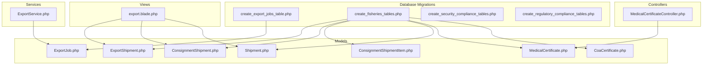
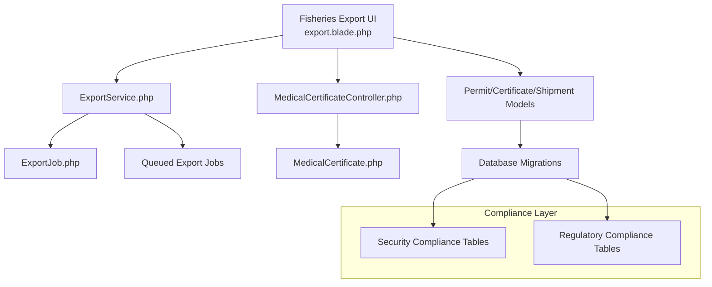
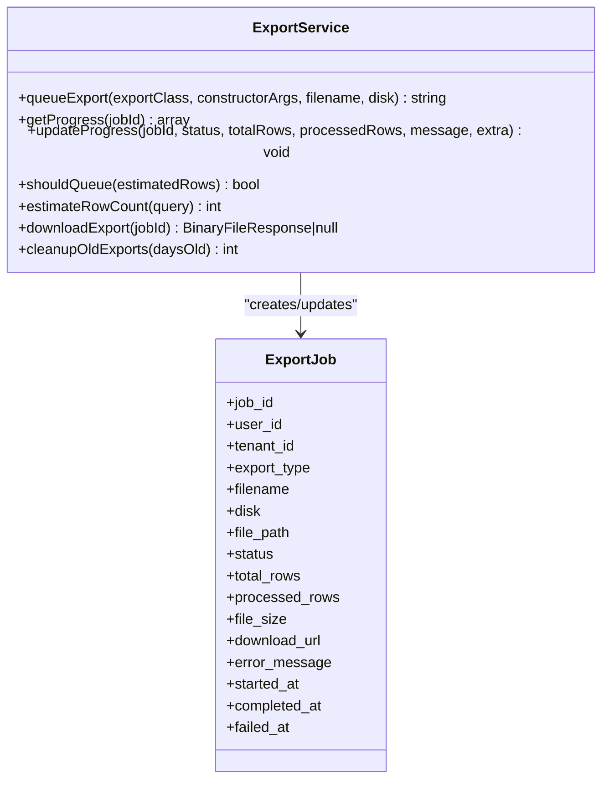
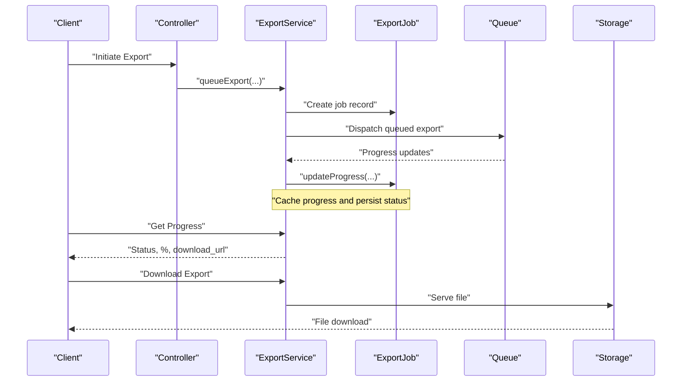
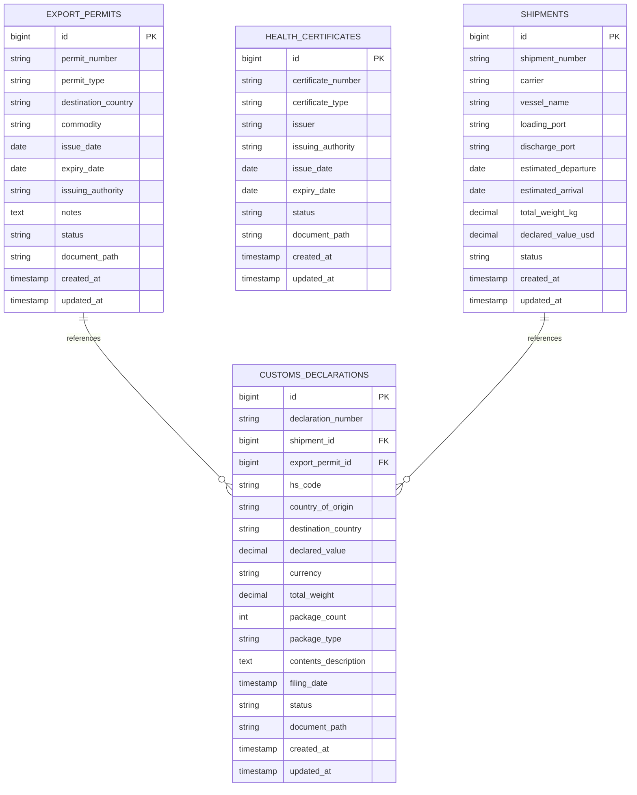
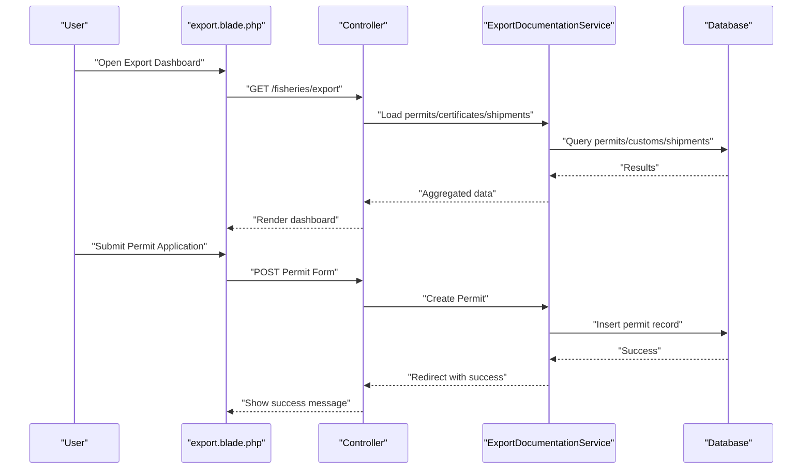
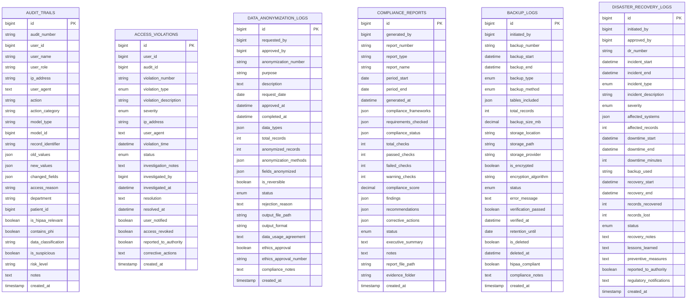
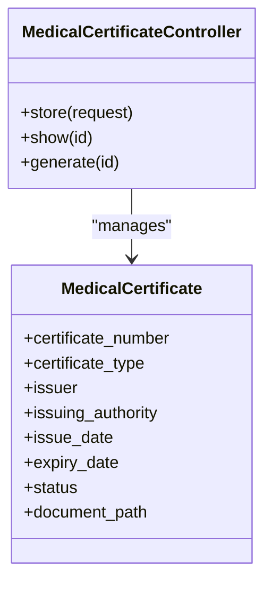
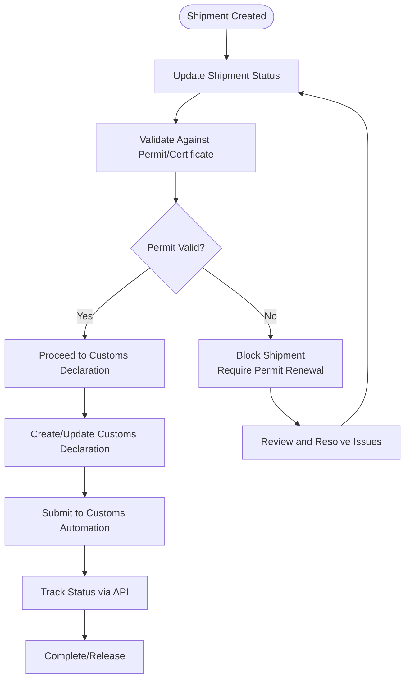
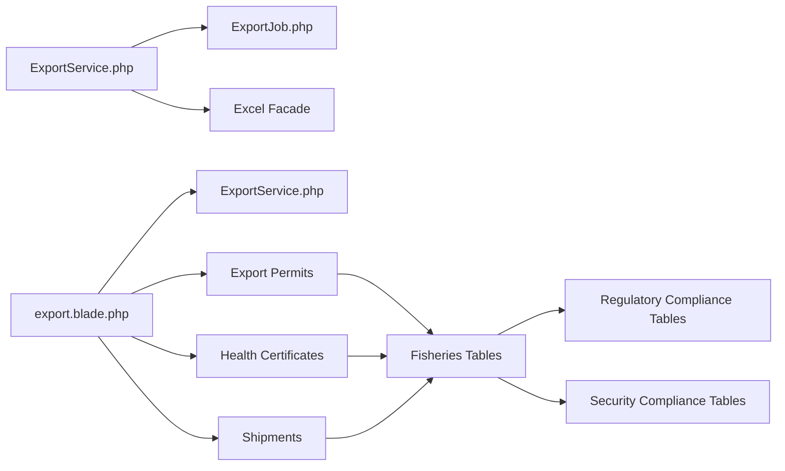

# Export Documentation & Compliance

<cite>
**Referenced Files in This Document**
- [create_export_jobs_table.php](file://database/migrations/2026_04_08_001834_create_export_jobs_table.php)
- [ExportService.php](file://app/Services/ExportService.php)
- [ExportJob.php](file://app/Models/ExportJob.php)
- [create_fisheries_tables.php](file://database/migrations/2026_04_06_140000_create_fisheries_tables.php)
- [export.blade.php](file://resources/views/fisheries/export.blade.php)
- [create_security_compliance_tables.php](file://database/migrations/2026_04_06_110000_create_security_compliance_tables.php)
- [create_regulatory_compliance_tables.php](file://database/migrations/2026_04_08_1400001_create_regulatory_compliance_tables.php)
- [MedicalCertificateController.php](file://app/Http/Controllers/Healthcare/MedicalCertificateController.php)
- [MedicalCertificate.php](file://app/Models/MedicalCertificate.php)
- [CoaCertificate.php](file://app/Models/CoaCertificate.php)
- [ConsignmentShipment.php](file://app/Models/ConsignmentShipment.php)
- [ConsignmentShipmentItem.php](file://app/Models/ConsignmentShipmentItem.php)
- [ExportShipment.php](file://app/Models/ExportShipment.php)
- [Shipment.php](file://app/Models/Shipment.php)
</cite>

## Table of Contents
1. [Introduction](#introduction)
2. [Project Structure](#project-structure)
3. [Core Components](#core-components)
4. [Architecture Overview](#architecture-overview)
5. [Detailed Component Analysis](#detailed-component-analysis)
6. [Dependency Analysis](#dependency-analysis)
7. [Performance Considerations](#performance-considerations)
8. [Troubleshooting Guide](#troubleshooting-guide)
9. [Conclusion](#conclusion)

## Introduction
This document describes the Export Documentation & Compliance System, focusing on:
- Export permit applications and tracking
- Health certificates issuance
- Customs declarations and submission
- Shipment tracking and status updates
- Regulatory compliance workflows
- International trade regulations and phytosanitary requirements
- Documentation formatting standards
- Integration with customs automation systems

The system integrates fisheries-specific export workflows with broader compliance and export infrastructure, including secure export job processing, audit trails, and regulatory reporting.

## Project Structure
The system spans database migrations, models, services, controllers, and views tailored for fisheries export operations and compliance.

**Diagram sources**
- [create_export_jobs_table.php:1-50](file://database/migrations/2026_04_08_001834_create_export_jobs_table.php#L1-L50)
- [create_fisheries_tables.php:403-426](file://database/migrations/2026_04_06_140000_create_fisheries_tables.php#L403-L426)
- [create_security_compliance_tables.php:1-242](file://database/migrations/2026_04_06_110000_create_security_compliance_tables.php#L1-L242)
- [create_regulatory_compliance_tables.php:1-327](file://database/migrations/2026_04_08_1400001_create_regulatory_compliance_tables.php#L1-L327)
- [ExportService.php:1-244](file://app/Services/ExportService.php#L1-L244)
- [ExportJob.php:1-11](file://app/Models/ExportJob.php#L1-L11)
- [ExportShipment.php](file://app/Models/ExportShipment.php)
- [ConsignmentShipment.php](file://app/Models/ConsignmentShipment.php)
- [ConsignmentShipmentItem.php](file://app/Models/ConsignmentShipmentItem.php)
- [Shipment.php](file://app/Models/Shipment.php)
- [MedicalCertificateController.php](file://app/Http/Controllers/Healthcare/MedicalCertificateController.php)
- [MedicalCertificate.php](file://app/Models/MedicalCertificate.php)
- [CoaCertificate.php](file://app/Models/CoaCertificate.php)
- [export.blade.php:42-491](file://resources/views/fisheries/export.blade.php#L42-L491)

**Section sources**
- [create_export_jobs_table.php:1-50](file://database/migrations/2026_04_08_001834_create_export_jobs_table.php#L1-L50)
- [create_fisheries_tables.php:403-426](file://database/migrations/2026_04_06_140000_create_fisheries_tables.php#L403-L426)
- [create_security_compliance_tables.php:1-242](file://database/migrations/2026_04_06_110000_create_security_compliance_tables.php#L1-L242)
- [create_regulatory_compliance_tables.php:1-327](file://database/migrations/2026_04_08_1400001_create_regulatory_compliance_tables.php#L1-L327)
- [ExportService.php:1-244](file://app/Services/ExportService.php#L1-L244)
- [export.blade.php:42-491](file://resources/views/fisheries/export.blade.php#L42-L491)

## Core Components
- Export job tracking and progress monitoring via queued exports
- Fisheries export permits, health certificates, customs declarations, and shipment tracking
- Regulatory compliance records, audit trails, and disaster recovery logs
- Medical certificate issuance integrated with healthcare workflows
- Data anonymization and consent management for privacy-compliant operations

Key capabilities:
- Queue large exports with progress tracking and download URLs
- Manage permit lifecycle, certificate issuance, and customs documentation
- Track shipments and update statuses for regulatory submissions
- Maintain HIPAA-compliant audit logs and compliance reports
- Support anonymization requests and data subject requests

**Section sources**
- [ExportService.php:1-244](file://app/Services/ExportService.php#L1-L244)
- [create_export_jobs_table.php:1-50](file://database/migrations/2026_04_08_001834_create_export_jobs_table.php#L1-L50)
- [create_fisheries_tables.php:403-426](file://database/migrations/2026_04_06_140000_create_fisheries_tables.php#L403-L426)
- [create_regulatory_compliance_tables.php:21-311](file://database/migrations/2026_04_08_1400001_create_regulatory_compliance_tables.php#L21-L311)
- [export.blade.php:42-491](file://resources/views/fisheries/export.blade.php#L42-L491)

## Architecture Overview
The system follows a layered architecture:
- Presentation layer: Blade views for fisheries export dashboard
- Application layer: Controllers and services orchestrating workflows
- Domain layer: Models representing permits, certificates, customs declarations, and shipments
- Infrastructure layer: Queued export processing, storage, and compliance logging

**Diagram sources**
- [export.blade.php:42-491](file://resources/views/fisheries/export.blade.php#L42-L491)
- [ExportService.php:1-244](file://app/Services/ExportService.php#L1-L244)
- [ExportJob.php:1-11](file://app/Models/ExportJob.php#L1-L11)
- [create_fisheries_tables.php:403-426](file://database/migrations/2026_04_06_140000_create_fisheries_tables.php#L403-L426)
- [create_security_compliance_tables.php:1-242](file://database/migrations/2026_04_06_110000_create_security_compliance_tables.php#L1-L242)
- [create_regulatory_compliance_tables.php:1-327](file://database/migrations/2026_04_08_1400001_create_regulatory_compliance_tables.php#L1-L327)
- [MedicalCertificateController.php](file://app/Http/Controllers/Healthcare/MedicalCertificateController.php)
- [MedicalCertificate.php](file://app/Models/MedicalCertificate.php)

## Detailed Component Analysis

### Export Job Processing
The export job system enables scalable, queued exports with progress tracking and completion notifications.

**Diagram sources**
- [ExportService.php:1-244](file://app/Services/ExportService.php#L1-L244)
- [ExportJob.php:1-11](file://app/Models/ExportJob.php#L1-L11)
- [create_export_jobs_table.php:15-39](file://database/migrations/2026_04_08_001834_create_export_jobs_table.php#L15-L39)

**Diagram sources**
- [ExportService.php:28-107](file://app/Services/ExportService.php#L28-L107)
- [create_export_jobs_table.php:15-39](file://database/migrations/2026_04_08_001834_create_export_jobs_table.php#L15-L39)

**Section sources**
- [ExportService.php:1-244](file://app/Services/ExportService.php#L1-L244)
- [create_export_jobs_table.php:1-50](file://database/migrations/2026_04_08_001834_create_export_jobs_table.php#L1-L50)

### Fisheries Export Permits, Certificates, and Shipments
The fisheries export module supports permit applications, health certificates, customs declarations, and shipment tracking.

**Diagram sources**
- [create_fisheries_tables.php:403-426](file://database/migrations/2026_04_06_140000_create_fisheries_tables.php#L403-L426)

**Diagram sources**
- [export.blade.php:42-491](file://resources/views/fisheries/export.blade.php#L42-L491)
- [create_fisheries_tables.php:403-426](file://database/migrations/2026_04_06_140000_create_fisheries_tables.php#L403-L426)

**Section sources**
- [export.blade.php:42-491](file://resources/views/fisheries/export.blade.php#L42-L491)
- [create_fisheries_tables.php:403-426](file://database/migrations/2026_04_06_140000_create_fisheries_tables.php#L403-L426)

### Regulatory Compliance and Audit Trails
The system maintains HIPAA-compliant audit trails, access violation logs, anonymization requests, compliance reports, backup logs, and disaster recovery logs.

**Diagram sources**
- [create_regulatory_compliance_tables.php:21-311](file://database/migrations/2026_04_08_1400001_create_regulatory_compliance_tables.php#L21-L311)

**Section sources**
- [create_regulatory_compliance_tables.php:1-327](file://database/migrations/2026_04_08_1400001_create_regulatory_compliance_tables.php#L1-L327)

### Medical Certificate Issuance
The healthcare module supports medical certificate creation and issuance, aligned with compliance requirements.

**Diagram sources**
- [MedicalCertificateController.php](file://app/Http/Controllers/Healthcare/MedicalCertificateController.php)
- [MedicalCertificate.php](file://app/Models/MedicalCertificate.php)

**Section sources**
- [MedicalCertificateController.php](file://app/Http/Controllers/Healthcare/MedicalCertificateController.php)
- [MedicalCertificate.php](file://app/Models/MedicalCertificate.php)

### Shipment Tracking and Status Updates
Shipment tracking integrates with customs declarations and export permits for end-to-end visibility.

[No sources needed since this diagram shows conceptual workflow, not actual code structure]

## Dependency Analysis
The system exhibits clear separation of concerns:
- ExportService depends on ExportJob and storage for queued exports
- Fisheries modules depend on dedicated migration tables for permits, certificates, customs declarations, and shipments
- Regulatory compliance tables support audit, access violations, anonymization, reports, backups, and disaster recovery
- Medical certificate workflows integrate with healthcare controllers and models

**Diagram sources**
- [ExportService.php:1-244](file://app/Services/ExportService.php#L1-L244)
- [ExportJob.php:1-11](file://app/Models/ExportJob.php#L1-L11)
- [export.blade.php:42-491](file://resources/views/fisheries/export.blade.php#L42-L491)
- [create_fisheries_tables.php:403-426](file://database/migrations/2026_04_06_140000_create_fisheries_tables.php#L403-L426)
- [create_regulatory_compliance_tables.php:1-327](file://database/migrations/2026_04_08_1400001_create_regulatory_compliance_tables.php#L1-L327)
- [create_security_compliance_tables.php:1-242](file://database/migrations/2026_04_06_110000_create_security_compliance_tables.php#L1-L242)

**Section sources**
- [ExportService.php:1-244](file://app/Services/ExportService.php#L1-L244)
- [export.blade.php:42-491](file://resources/views/fisheries/export.blade.php#L42-L491)
- [create_fisheries_tables.php:403-426](file://database/migrations/2026_04_06_140000_create_fisheries_tables.php#L403-L426)
- [create_regulatory_compliance_tables.php:1-327](file://database/migrations/2026_04_08_1400001_create_regulatory_compliance_tables.php#L1-L327)
- [create_security_compliance_tables.php:1-242](file://database/migrations/2026_04_06_110000_create_security_compliance_tables.php#L1-L242)

## Performance Considerations
- Use queued exports for large datasets to prevent timeouts and improve scalability
- Monitor export progress via cache and database fallback for resilience
- Optimize database queries with appropriate indexing on frequently filtered columns
- Implement cleanup routines for old export jobs and files to manage storage growth
- Ensure storage disks are configured for high throughput and durability

[No sources needed since this section provides general guidance]

## Troubleshooting Guide
Common issues and resolutions:
- Export job not found: Verify job ID and check database records; confirm queue worker is running
- Progress stuck at pending: Confirm queue worker is processing jobs and cache is writable
- Download fails: Ensure file exists on the configured disk and job status is completed
- Compliance report generation errors: Validate framework configurations and required fields
- Audit trail anomalies: Review access violation logs and investigate flagged activities

**Section sources**
- [ExportService.php:77-107](file://app/Services/ExportService.php#L77-L107)
- [create_regulatory_compliance_tables.php:74-121](file://database/migrations/2026_04_08_1400001_create_regulatory_compliance_tables.php#L74-L121)

## Conclusion
The Export Documentation & Compliance System provides a robust foundation for managing export permits, health certificates, customs declarations, and shipment tracking while maintaining strong regulatory compliance and auditability. The modular design supports scalability, security, and integration with customs automation systems, ensuring adherence to international trade regulations and phytosanitary requirements.