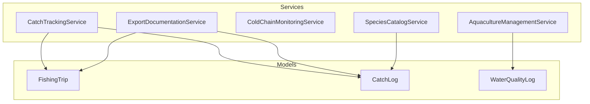
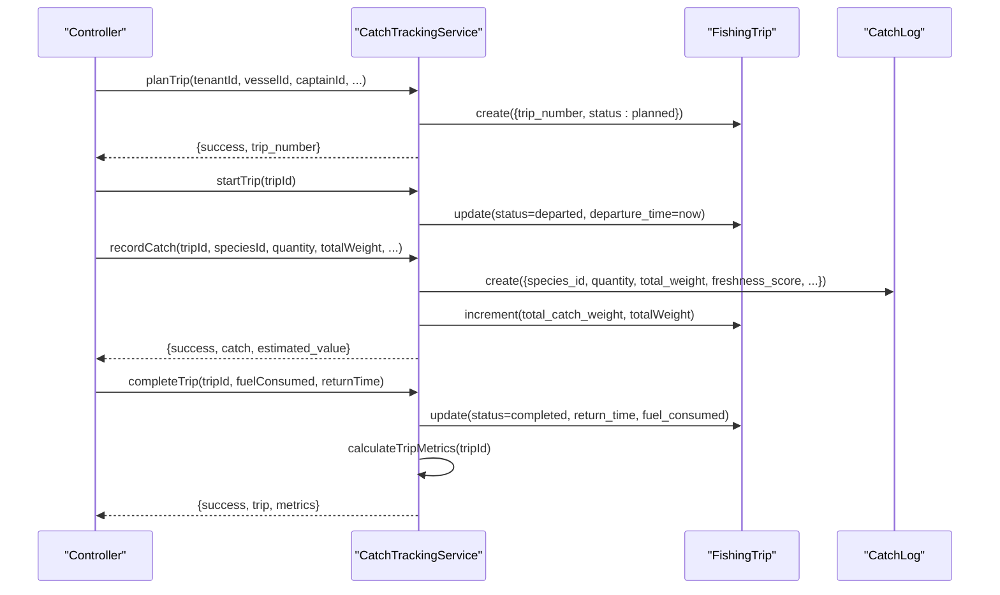
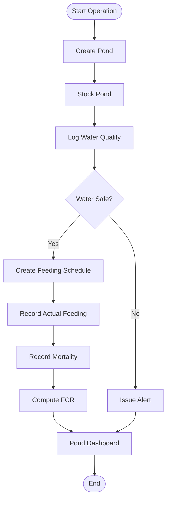
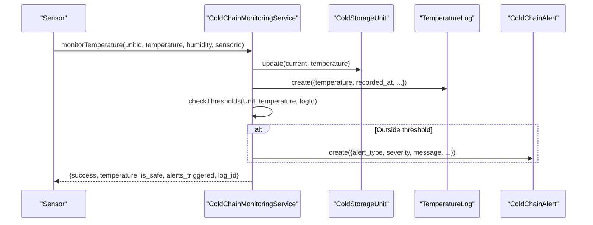
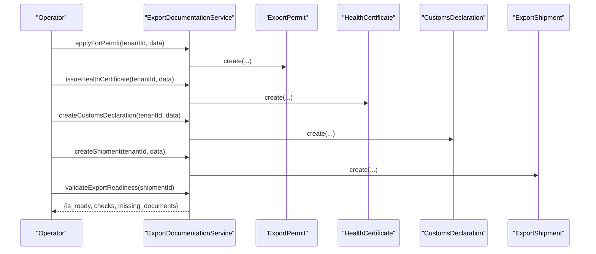
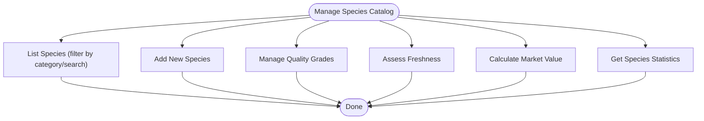
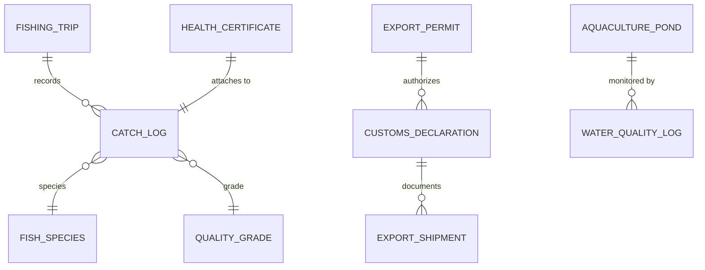
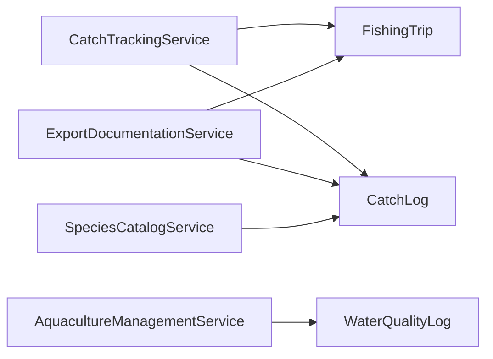

# Fisheries & Aquaculture Module

<cite>
**Referenced Files in This Document**
- [CatchTrackingService.php](file://app/Services/Fisheries/CatchTrackingService.php)
- [AquacultureManagementService.php](file://app/Services/Fisheries/AquacultureManagementService.php)
- [ColdChainMonitoringService.php](file://app/Services/Fisheries/ColdChainMonitoringService.php)
- [ExportDocumentationService.php](file://app/Services/Fisheries/ExportDocumentationService.php)
- [SpeciesCatalogService.php](file://app/Services/Fisheries/SpeciesCatalogService.php)
- [FishingTrip.php](file://app/Models/FishingTrip.php)
- [CatchLog.php](file://app/Models/CatchLog.php)
- [WaterQualityLog.php](file://app/Models/WaterQualityLog.php)
</cite>

## Table of Contents
1. [Introduction](#introduction)
2. [Project Structure](#project-structure)
3. [Core Components](#core-components)
4. [Architecture Overview](#architecture-overview)
5. [Detailed Component Analysis](#detailed-component-analysis)
6. [Dependency Analysis](#dependency-analysis)
7. [Performance Considerations](#performance-considerations)
8. [Troubleshooting Guide](#troubleshooting-guide)
9. [Conclusion](#conclusion)

## Introduction
This document describes the Fisheries & Aquaculture Module within the qalcuityERP system. It covers end-to-end workflows for catch tracking, aquaculture farm management, water quality monitoring, cold chain logistics, export documentation, and seafood safety compliance. It also outlines fish species catalog management, fishing trip lifecycle tracking, feed management, mortality monitoring, and supply chain traceability. The goal is to provide both technical depth and practical guidance for operators and administrators managing fisheries and aquaculture operations.

## Project Structure
The module is organized around service classes that encapsulate domain logic and model interactions. Each service corresponds to a functional area:
- CatchTrackingService: manages fishing trips, catch recording, GPS updates, and analytics
- AquacultureManagementService: handles pond operations, water quality, feeding schedules, mortality, and growth metrics
- ColdChainMonitoringService: monitors storage unit temperatures, triggers alerts, and generates compliance reports
- ExportDocumentationService: manages permits, health certificates, customs declarations, and export shipments
- SpeciesCatalogService: maintains fish species catalogs, quality grades, and freshness assessments

**Diagram sources**
- [CatchTrackingService.php:11-345](file://app/Services/Fisheries/CatchTrackingService.php#L11-L345)
- [AquacultureManagementService.php:10-275](file://app/Services/Fisheries/AquacultureManagementService.php#L10-L275)
- [ColdChainMonitoringService.php:10-229](file://app/Services/Fisheries/ColdChainMonitoringService.php#L10-L229)
- [ExportDocumentationService.php:11-295](file://app/Services/Fisheries/ExportDocumentationService.php#L11-L295)
- [SpeciesCatalogService.php:9-149](file://app/Services/Fisheries/SpeciesCatalogService.php#L9-L149)
- [FishingTrip.php:10-91](file://app/Models/FishingTrip.php#L10-L91)
- [CatchLog.php:10-75](file://app/Models/CatchLog.php#L10-L75)
- [WaterQualityLog.php:10-74](file://app/Models/WaterQualityLog.php#L10-L74)

**Section sources**
- [CatchTrackingService.php:11-345](file://app/Services/Fisheries/CatchTrackingService.php#L11-L345)
- [AquacultureManagementService.php:10-275](file://app/Services/Fisheries/AquacultureManagementService.php#L10-L275)
- [ColdChainMonitoringService.php:10-229](file://app/Services/Fisheries/ColdChainMonitoringService.php#L10-L229)
- [ExportDocumentationService.php:11-295](file://app/Services/Fisheries/ExportDocumentationService.php#L11-L295)
- [SpeciesCatalogService.php:9-149](file://app/Services/Fisheries/SpeciesCatalogService.php#L9-L149)
- [FishingTrip.php:10-91](file://app/Models/FishingTrip.php#L10-L91)
- [CatchLog.php:10-75](file://app/Models/CatchLog.php#L10-L75)
- [WaterQualityLog.php:10-74](file://app/Models/WaterQualityLog.php#L10-L74)

## Core Components
- Catch Tracking Service: orchestrates trip planning, departure, catch recording, position updates, completion, and analytics. It computes fuel efficiency, catch rates, and species distribution.
- Aquaculture Management Service: supports pond creation, stocking, water quality logging and safety checks, feeding schedules, actual feed recording, mortality logging, FCR calculation, and dashboard metrics.
- Cold Chain Monitoring Service: records temperatures, validates thresholds, raises alerts with severity levels, acknowledges and resolves alerts, and compiles compliance reports.
- Export Documentation Service: creates and manages export permits, health certificates, customs declarations, and export shipments, with readiness validation and reporting.
- Species Catalog Service: maintains species lists, categories, quality grades, and performs freshness assessments and market value calculations.

**Section sources**
- [CatchTrackingService.php:16-343](file://app/Services/Fisheries/CatchTrackingService.php#L16-L343)
- [AquacultureManagementService.php:15-273](file://app/Services/Fisheries/AquacultureManagementService.php#L15-L273)
- [ColdChainMonitoringService.php:15-227](file://app/Services/Fisheries/ColdChainMonitoringService.php#L15-L227)
- [ExportDocumentationService.php:16-293](file://app/Services/Fisheries/ExportDocumentationService.php#L16-L293)
- [SpeciesCatalogService.php:14-147](file://app/Services/Fisheries/SpeciesCatalogService.php#L14-L147)

## Architecture Overview
The module follows a layered architecture:
- Services encapsulate business logic and coordinate model interactions
- Models define persistence, relationships, and computed attributes
- Controllers (not detailed here) route HTTP requests to services
- Data flows between services and models, with cross-service references for traceability (e.g., catch logs linked to trips and permits)

```mermaid
classDiagram
class CatchTrackingService {
+planTrip(tenantId, vesselId, captainId, ...)
+startTrip(tripId)
+recordCatch(tripId, speciesId, quantity, totalWeight, ...)
+updatePosition(tripId, lat, lng)
+completeTrip(tripId, fuelConsumed, returnTime)
+calculateTripMetrics(tripId)
+getTripSummary(tripId)
+trackQuotaUsage(zoneId, periodStart, periodEnd)
+getCatchAnalytics(tenantId, period)
}
class AquacultureManagementService {
+createPond(tenantId, data)
+stockPond(pondId, speciesId, quantity, stockingDate)
+logWaterQuality(tenantId, pondId, zoneId, parameters, userId)
+checkWaterQuality(logId)
+createFeedingSchedule(pondId, feedProductId, scheduleDate, feedingTime, quantity)
+recordFeeding(scheduleId, actualQuantity, userId)
+recordMortality(tenantId, pondId, tripId, count, totalWeight, cause, symptoms, userId)
+calculateFCR(pondId, periodStart, periodEnd)
+getPondDashboard(pondId)
+generateGrowthReport(pondId, periodStart, periodEnd)
}
class ColdChainMonitoringService {
+monitorTemperature(storageUnitId, temperature, humidity, sensorId)
+acknowledgeAlert(alertId, userId)
+resolveAlert(alertId, resolutionNotes)
+getActiveAlerts(tenantId, severity)
+getTemperatureHistory(storageUnitId, startDate, endDate)
+generateComplianceReport(tenantId, periodStart, periodEnd)
}
class ExportDocumentationService {
+applyForPermit(tenantId, data)
+issueHealthCertificate(tenantId, data)
+createCustomsDeclaration(tenantId, data)
+submitCustomsDeclaration(declarationId)
+createShipment(tenantId, data)
+updateShipmentStatus(shipmentId, status, actualArrival)
+getExportDocuments(tenantId, type)
+validateExportReadiness(shipmentId)
+generateExportReport(tenantId, periodStart, periodEnd)
}
class SpeciesCatalogService {
+listSpecies(tenantId, category, search)
+addSpecies(tenantId, data)
+manageGrades(tenantId, gradesData)
+assessFreshness(catchLogId, overallScore, criteria, assessorId, assessmentType)
+calculateMarketValue(speciesId, weight, gradeId)
+getSpeciesStatistics(speciesId, period)
}
class FishingTrip
class CatchLog
class WaterQualityLog
CatchTrackingService --> FishingTrip : "creates/updates"
CatchTrackingService --> CatchLog : "creates"
AquacultureManagementService --> WaterQualityLog : "creates"
ExportDocumentationService --> CatchLog : "references"
ExportDocumentationService --> FishingTrip : "references"
SpeciesCatalogService --> CatchLog : "computes value"
```

**Diagram sources**
- [CatchTrackingService.php:11-345](file://app/Services/Fisheries/CatchTrackingService.php#L11-L345)
- [AquacultureManagementService.php:10-275](file://app/Services/Fisheries/AquacultureManagementService.php#L10-L275)
- [ColdChainMonitoringService.php:10-229](file://app/Services/Fisheries/ColdChainMonitoringService.php#L10-L229)
- [ExportDocumentationService.php:11-295](file://app/Services/Fisheries/ExportDocumentationService.php#L11-L295)
- [SpeciesCatalogService.php:9-149](file://app/Services/Fisheries/SpeciesCatalogService.php#L9-L149)
- [FishingTrip.php:10-91](file://app/Models/FishingTrip.php#L10-L91)
- [CatchLog.php:10-75](file://app/Models/CatchLog.php#L10-L75)
- [WaterQualityLog.php:10-74](file://app/Models/WaterQualityLog.php#L10-L74)

## Detailed Component Analysis

### Catch Tracking System
The catch tracking system manages the entire lifecycle of a fishing trip and associated catch records:
- Trip planning with auto-generated identifiers, crew assignment, and initial status
- Departure and position updates with automatic status transitions
- Catch recording with species, grade, quantities, weights, GPS, depth, and freshness scoring
- Metrics computation including trip duration, total catch weight, estimated value, fuel efficiency, catch rate, and species distribution
- Quota tracking by fishing zone and period
- Analytics by period (today, week, month) and top species

**Diagram sources**
- [CatchTrackingService.php:16-180](file://app/Services/Fisheries/CatchTrackingService.php#L16-L180)
- [FishingTrip.php:14-38](file://app/Models/FishingTrip.php#L14-L38)
- [CatchLog.php:14-40](file://app/Models/CatchLog.php#L14-L40)

**Section sources**
- [CatchTrackingService.php:16-343](file://app/Services/Fisheries/CatchTrackingService.php#L16-L343)
- [FishingTrip.php:77-89](file://app/Models/FishingTrip.php#L77-L89)
- [CatchLog.php:67-73](file://app/Models/CatchLog.php#L67-L73)

### Aquaculture Farm Management
Aquaculture operations are managed through pond lifecycle, water quality monitoring, feeding schedules, and mortality tracking:
- Pond creation with attributes such as surface area, depth, volume, carrying capacity, and type
- Stocking with species, quantity, and date, updating pond status
- Water quality logging with pH, dissolved oxygen, temperature, salinity, ammonia, nitrite, nitrate, turbidity, and measurement method
- Safety checks against predefined thresholds for pH and dissolved oxygen adequacy
- Feeding schedule creation and actual feed recording with user attribution
- Mortality logging with cause, symptoms, and weight estimates
- FCR calculation and pond dashboard with utilization, days to harvest, latest water quality, upcoming feedings, and recent mortality
- Growth report generation with average mortality weight and total feed consumption

**Diagram sources**
- [AquacultureManagementService.php:15-242](file://app/Services/Fisheries/AquacultureManagementService.php#L15-L242)
- [WaterQualityLog.php:64-72](file://app/Models/WaterQualityLog.php#L64-L72)

**Section sources**
- [AquacultureManagementService.php:15-273](file://app/Services/Fisheries/AquacultureManagementService.php#L15-L273)
- [WaterQualityLog.php:14-73](file://app/Models/WaterQualityLog.php#L14-L73)

### Cold Chain Logistics
Cold chain monitoring ensures product integrity during storage and transport:
- Temperature monitoring with automatic threshold checks and alert generation
- Severity classification based on deviation magnitude
- Alert acknowledgment and resolution with timestamps and user attribution
- Active alerts retrieval filtered by severity
- Temperature history queries with optional date ranges
- Compliance report aggregating units, alerts, and resolutions

**Diagram sources**
- [ColdChainMonitoringService.php:15-82](file://app/Services/Fisheries/ColdChainMonitoringService.php#L15-L82)

**Section sources**
- [ColdChainMonitoringService.php:15-227](file://app/Services/Fisheries/ColdChainMonitoringService.php#L15-L227)

### Export Documentation Processes
The export documentation service coordinates permits, health certificates, customs declarations, and shipments:
- Export permit application with destination, issuing authority, conditions, and validity dates
- Health certificate issuance tied to product batches or catch logs
- Customs declaration creation with HS code, origin/destination, declared value, weight, packaging, and goods description
- Shipment creation with origin/destination ports, shipping method, carrier, tracking, and status
- Readiness validation ensuring permits are valid, customs cleared, and required documents present
- Reporting on permits, shipments, and top destinations

**Diagram sources**
- [ExportDocumentationService.php:16-261](file://app/Services/Fisheries/ExportDocumentationService.php#L16-L261)

**Section sources**
- [ExportDocumentationService.php:16-293](file://app/Services/Fisheries/ExportDocumentationService.php#L16-L293)

### Fish Species Catalog Management
The species catalog service maintains biodiversity and pricing data:
- Listing species by category and search terms
- Adding new species with scientific names, categories, habitats, characteristics, and market prices
- Managing quality grades with multipliers and criteria
- Assessing catch freshness with visual and sensory criteria
- Computing market value based on species base price and grade multiplier
- Generating species statistics by period

**Diagram sources**
- [SpeciesCatalogService.php:14-147](file://app/Services/Fisheries/SpeciesCatalogService.php#L14-L147)

**Section sources**
- [SpeciesCatalogService.php:14-147](file://app/Services/Fisheries/SpeciesCatalogService.php#L14-L147)

### Supply Chain Traceability
Traceability is achieved through interconnected models:
- Catch logs link to species, grades, and fishing trips
- Export permits and health certificates reference catch logs and trips
- Export shipments reference customs declarations and permits
- Water quality logs connect to ponds and zones
- These relationships enable end-to-end traceability from sea to consumer

**Diagram sources**
- [CatchLog.php:52-64](file://app/Models/CatchLog.php#L52-L64)
- [FishingTrip.php:67-75](file://app/Models/FishingTrip.php#L67-L75)
- [ExportDocumentationService.php:16-129](file://app/Services/Fisheries/ExportDocumentationService.php#L16-L129)
- [AquacultureManagementService.php:55-73](file://app/Services/Fisheries/AquacultureManagementService.php#L55-L73)

**Section sources**
- [CatchLog.php:52-64](file://app/Models/CatchLog.php#L52-L64)
- [FishingTrip.php:67-75](file://app/Models/FishingTrip.php#L67-L75)
- [ExportDocumentationService.php:16-129](file://app/Services/Fisheries/ExportDocumentationService.php#L16-L129)
- [AquacultureManagementService.php:55-73](file://app/Services/Fisheries/AquacultureManagementService.php#L55-L73)

## Dependency Analysis
- Services depend on models for persistence and relationships
- Cross-service references enable traceability (e.g., catch logs referenced by export services)
- Computed attributes (e.g., estimated value) reduce duplication and centralize business rules
- Cohesion is strong within each service; coupling is primarily through shared models and tenant scoping

**Diagram sources**
- [CatchTrackingService.php:5-12](file://app/Services/Fisheries/CatchTrackingService.php#L5-L12)
- [AquacultureManagementService.php:5-9](file://app/Services/Fisheries/AquacultureManagementService.php#L5-L9)
- [ExportDocumentationService.php:5-9](file://app/Services/Fisheries/ExportDocumentationService.php#L5-L9)
- [SpeciesCatalogService.php:5-8](file://app/Services/Fisheries/SpeciesCatalogService.php#L5-L8)
- [FishingTrip.php:40-75](file://app/Models/FishingTrip.php#L40-L75)
- [CatchLog.php:42-65](file://app/Models/CatchLog.php#L42-L65)
- [WaterQualityLog.php:44-62](file://app/Models/WaterQualityLog.php#L44-L62)

**Section sources**
- [CatchTrackingService.php:5-12](file://app/Services/Fisheries/CatchTrackingService.php#L5-L12)
- [AquacultureManagementService.php:5-9](file://app/Services/Fisheries/AquacultureManagementService.php#L5-L9)
- [ExportDocumentationService.php:5-9](file://app/Services/Fisheries/ExportDocumentationService.php#L5-L9)
- [SpeciesCatalogService.php:5-8](file://app/Services/Fisheries/SpeciesCatalogService.php#L5-L8)
- [FishingTrip.php:40-75](file://app/Models/FishingTrip.php#L40-L75)
- [CatchLog.php:42-65](file://app/Models/CatchLog.php#L42-L65)
- [WaterQualityLog.php:44-62](file://app/Models/WaterQualityLog.php#L44-L62)

## Performance Considerations
- Aggregation queries (sums, averages, counts) should be indexed on frequently filtered columns (tenant_id, caught_at, created_at, status)
- Use pagination for analytics and dashboard endpoints returning large datasets
- Batch operations for bulk grade updates and species imports
- Denormalized computed attributes (e.g., estimated value) reduce joins but require consistency policies
- Asynchronous jobs for heavy exports and compliance report generation

## Troubleshooting Guide
Common operational issues and remedies:
- Trip planning failures: verify vessel existence and required crew assignments; inspect error logs for detailed messages
- Catch recording errors: confirm species and trip availability; ensure numeric inputs are valid decimals
- Position updates: ensure trips are in planned/departed state; verify latitude/longitude ranges
- Water quality alerts: review threshold violations and adjust monitoring frequency or corrective actions
- Export readiness: validate customs clearance and permit validity; ensure all mandatory documents are attached
- Cold chain breaches: investigate sensor anomalies, power events, or environmental factors; re-run safety checks

**Section sources**
- [CatchTrackingService.php:47-54](file://app/Services/Fisheries/CatchTrackingService.php#L47-L54)
- [AquacultureManagementService.php:46-49](file://app/Services/Fisheries/AquacultureManagementService.php#L46-L49)
- [ColdChainMonitoringService.php:44-51](file://app/Services/Fisheries/ColdChainMonitoringService.php#L44-L51)
- [ExportDocumentationService.php:97-104](file://app/Services/Fisheries/ExportDocumentationService.php#L97-L104)

## Conclusion
The Fisheries & Aquaculture Module provides a comprehensive, modular solution for managing the full seafood supply chain—from wild capture and aquaculture production to cold chain logistics and export compliance. Its service-driven design promotes maintainability and scalability, while integrated models and computed attributes ensure accurate traceability and reporting. By leveraging built-in analytics, alerts, and readiness validations, operators can uphold seafood safety standards and meet international trade requirements efficiently.