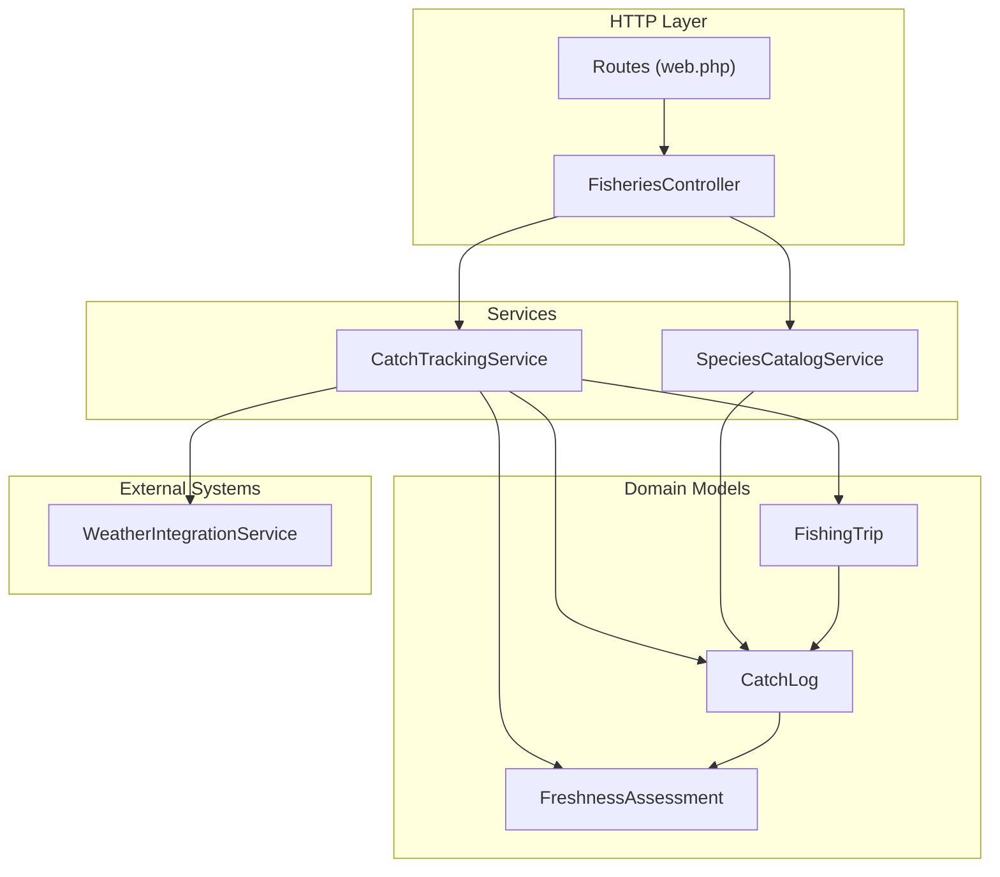
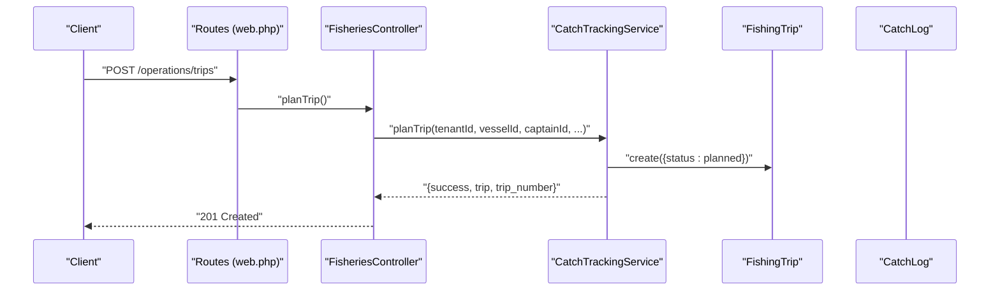
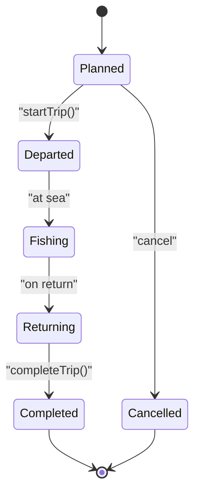
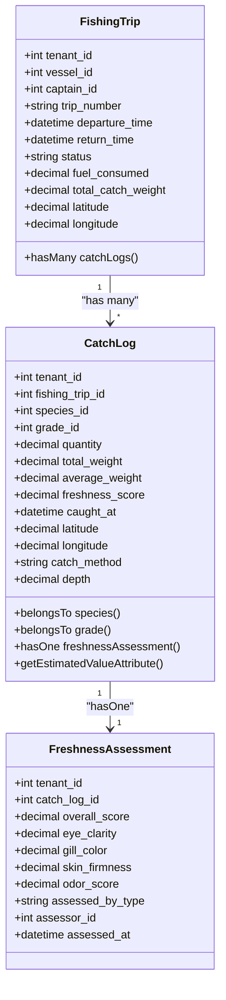
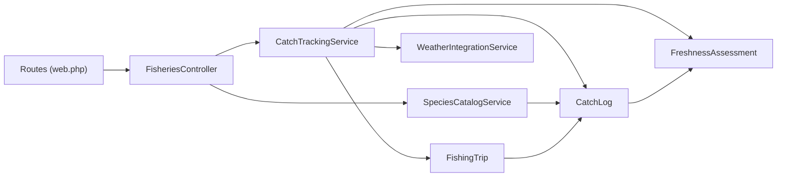

# Fishing Operations Management

<cite>
**Referenced Files in This Document**
- [CatchTrackingService.php](file://app/Services/Fisheries/CatchTrackingService.php)
- [FisheriesController.php](file://app/Http/Controllers/Fisheries/FisheriesController.php)
- [web.php](file://routes/web.php)
- [FishingTrip.php](file://app/Models/FishingTrip.php)
- [CatchLog.php](file://app/Models/CatchLog.php)
- [FreshnessAssessment.php](file://app/Models/FreshnessAssessment.php)
- [SpeciesCatalogService.php](file://app/Services/Fisheries/SpeciesCatalogService.php)
- [WeatherIntegrationService.php](file://app/Services/WeatherIntegrationService.php)
- [2026_04_06_140000_create_fisheries_tables.php](file://database/migrations/2026_04_06_140000_create_fisheries_tables.php)
</cite>

## Table of Contents
1. [Introduction](#introduction)
2. [Project Structure](#project-structure)
3. [Core Components](#core-components)
4. [Architecture Overview](#architecture-overview)
5. [Detailed Component Analysis](#detailed-component-analysis)
6. [Dependency Analysis](#dependency-analysis)
7. [Performance Considerations](#performance-considerations)
8. [Troubleshooting Guide](#troubleshooting-guide)
9. [Conclusion](#conclusion)

## Introduction
This document describes the Fishing Operations Management subsystem within the ERP platform. It covers vessel registration and management, fishing trip planning and execution, catch recording and tracking, GPS position updates, crew management, and trip completion workflows. It also documents API endpoints for vessel operations, trip lifecycle management, catch documentation with species identification, weight measurement, quality assessment, and geographic data capture. Real-time tracking capabilities, automated catch reporting, and integration with weather and navigation systems are included.

## Project Structure
The fishing operations domain is organized around:
- Controllers for HTTP endpoints
- Services encapsulating business logic
- Models representing domain entities
- Routes defining API surface
- Migrations establishing database schema

**Diagram sources**
- [web.php:2842-2853](file://routes/web.php#L2842-L2853)
- [FisheriesController.php:201-246](file://app/Http/Controllers/Fisheries/FisheriesController.php#L201-L246)
- [CatchTrackingService.php:11-238](file://app/Services/Fisheries/CatchTrackingService.php#L11-L238)
- [SpeciesCatalogService.php:9-149](file://app/Services/Fisheries/SpeciesCatalogService.php#L9-L149)
- [FishingTrip.php:10-91](file://app/Models/FishingTrip.php#L10-L91)
- [CatchLog.php:10-75](file://app/Models/CatchLog.php#L10-L75)
- [FreshnessAssessment.php:10-52](file://app/Models/FreshnessAssessment.php#L10-L52)
- [WeatherIntegrationService.php:11-223](file://app/Services/WeatherIntegrationService.php#L11-L223)

**Section sources**
- [web.php:2842-2853](file://routes/web.php#L2842-L2853)
- [FisheriesController.php:201-246](file://app/Http/Controllers/Fisheries/FisheriesController.php#L201-L246)
- [CatchTrackingService.php:11-238](file://app/Services/Fisheries/CatchTrackingService.php#L11-L238)
- [SpeciesCatalogService.php:9-149](file://app/Services/Fisheries/SpeciesCatalogService.php#L9-L149)
- [FishingTrip.php:10-91](file://app/Models/FishingTrip.php#L10-L91)
- [CatchLog.php:10-75](file://app/Models/CatchLog.php#L10-L75)
- [FreshnessAssessment.php:10-52](file://app/Models/FreshnessAssessment.php#L10-L52)
- [WeatherIntegrationService.php:11-223](file://app/Services/WeatherIntegrationService.php#L11-L223)

## Core Components
- CatchTrackingService: Orchestrates trip lifecycle, catch recording, and analytics.
- FisheriesController: Exposes REST endpoints for vessel, trip, catch, and position operations.
- SpeciesCatalogService: Manages species catalog, quality grades, and freshness assessments.
- Domain Models: FishingTrip, CatchLog, FreshnessAssessment define the data schema and relationships.
- WeatherIntegrationService: Provides current weather and forecasts for operational planning.

**Section sources**
- [CatchTrackingService.php:11-238](file://app/Services/Fisheries/CatchTrackingService.php#L11-L238)
- [FisheriesController.php:201-246](file://app/Http/Controllers/Fisheries/FisheriesController.php#L201-L246)
- [SpeciesCatalogService.php:9-149](file://app/Services/Fisheries/SpeciesCatalogService.php#L9-L149)
- [FishingTrip.php:10-91](file://app/Models/FishingTrip.php#L10-L91)
- [CatchLog.php:10-75](file://app/Models/CatchLog.php#L10-L75)
- [FreshnessAssessment.php:10-52](file://app/Models/FreshnessAssessment.php#L10-L52)
- [WeatherIntegrationService.php:11-223](file://app/Services/WeatherIntegrationService.php#L11-L223)

## Architecture Overview
The system follows a layered architecture:
- HTTP layer: Routes delegate to FisheriesController.
- Application layer: FisheriesController invokes CatchTrackingService and SpeciesCatalogService.
- Persistence layer: Eloquent models map to fisheries-related tables.
- Integration layer: WeatherIntegrationService integrates external weather APIs.

**Diagram sources**
- [web.php:2842-2853](file://routes/web.php#L2842-L2853)
- [FisheriesController.php:208-228](file://app/Http/Controllers/Fisheries/FisheriesController.php#L208-L228)
- [CatchTrackingService.php:16-55](file://app/Services/Fisheries/CatchTrackingService.php#L16-L55)
- [FishingTrip.php:14-38](file://app/Models/FishingTrip.php#L14-L38)

## Detailed Component Analysis

### Vessel Registration and Management
- Endpoint: POST /operations/vessels
- Responsibilities:
  - Register new fishing vessels under tenant isolation.
  - Validate vessel attributes and integrate with fleet management.
- Notes:
  - The route exists but the model file for the vessel entity is not present in the provided context. The service/controller logic indicates vessel registration is supported.

**Section sources**
- [web.php:2842-2845](file://routes/web.php#L2842-L2845)
- [FisheriesController.php:201-203](file://app/Http/Controllers/Fisheries/FisheriesController.php#L201-L203)

### Fishing Trip Planning and Execution
- Endpoints:
  - POST /operations/trips (plan)
  - POST /operations/trips/{id}/start (depart)
  - POST /operations/trips/{id}/complete (finish)
  - GET /operations/trips/{id}/summary (trip summary)
- Lifecycle:
  - planTrip: Creates a trip with generated trip number, assigns captain and optional crew, sets status to planned.
  - startTrip: Updates status to departed and records departure time.
  - completeTrip: Marks trip as completed and captures return time and optional metrics.
  - getTripSummary: Aggregates vessel, crew, catch, and performance metrics.

**Diagram sources**
- [CatchTrackingService.php:16-78](file://app/Services/Fisheries/CatchTrackingService.php#L16-L78)
- [FishingTrip.php:77-89](file://app/Models/FishingTrip.php#L77-L89)

**Section sources**
- [web.php:2846-2852](file://routes/web.php#L2846-L2852)
- [FisheriesController.php:208-241](file://app/Http/Controllers/Fisheries/FisheriesController.php#L208-L241)
- [CatchTrackingService.php:16-78](file://app/Services/Fisheries/CatchTrackingService.php#L16-L78)
- [FishingTrip.php:77-89](file://app/Models/FishingTrip.php#L77-L89)

### Catch Recording and Tracking
- Endpoint: POST /operations/trips/{id}/catch
- Fields captured per catch event:
  - Species, quantity, total weight, average weight
  - Grade, freshness score, caught timestamp
  - Geographic coordinates (latitude/longitude), depth
  - Catch method, notes
- Value estimation:
  - Estimated value computed from species base price and grade multiplier.

**Diagram sources**
- [FishingTrip.php:14-70](file://app/Models/FishingTrip.php#L14-L70)
- [CatchLog.php:14-73](file://app/Models/CatchLog.php#L14-L73)
- [FreshnessAssessment.php:14-50](file://app/Models/FreshnessAssessment.php#L14-L50)

**Section sources**
- [web.php:2848-2848](file://routes/web.php#L2848-L2848)
- [FisheriesController.php:246-246](file://app/Http/Controllers/Fisheries/FisheriesController.php#L246-L246)
- [CatchTrackingService.php:83-160](file://app/Services/Fisheries/CatchTrackingService.php#L83-L160)
- [CatchLog.php:67-73](file://app/Models/CatchLog.php#L67-L73)

### GPS Position Updates
- Endpoint: POST /operations/trips/{id}/position
- Purpose: Update last known position (latitude, longitude) and optionally weather conditions for real-time tracking.

**Section sources**
- [web.php:2849-2849](file://routes/web.php#L2849-L2849)
- [FishingTrip.php:199-204](file://app/Models/FishingTrip.php#L199-L204)

### Crew Management
- During trip planning, crew members can be assigned with role metadata.
- The trip-crew relationship is maintained via a pivot table.

**Section sources**
- [CatchTrackingService.php:35-40](file://app/Services/Fisheries/CatchTrackingService.php#L35-L40)
- [FishingTrip.php:60-65](file://app/Models/FishingTrip.php#L60-L65)
- [2026_04_06_140000_create_fisheries_tables.php:212-214](file://database/migrations/2026_04_06_140000_create_fisheries_tables.php#L212-L214)

### Trip Completion Workflows
- Endpoints:
  - POST /operations/trips/{id}/complete
  - GET /operations/trips/{id}/summary
- Completion captures return time and computes performance metrics:
  - Duration, total catch weight, estimated value, fuel consumed, fuel efficiency, catch rate, species distribution, crew count.

**Section sources**
- [web.php:2850-2852](file://routes/web.php#L2850-L2852)
- [CatchTrackingService.php:161-223](file://app/Services/Fisheries/CatchTrackingService.php#L161-L223)

### API Endpoints for Fishing Operations
- Vessel operations
  - POST /operations/vessels
- Trip lifecycle
  - POST /operations/trips
  - POST /operations/trips/{id}/start
  - POST /operations/trips/{id}/complete
  - GET /operations/trips/{id}/summary
- Catch documentation
  - POST /operations/trips/{id}/catch
- Position updates
  - POST /operations/trips/{id}/position
- Catch analytics
  - GET /operations/catch/analytics

**Section sources**
- [web.php:2842-2853](file://routes/web.php#L2842-L2853)

### Species Identification, Weight Measurement, and Quality Assessment
- Species catalog management and quality grading are handled by SpeciesCatalogService.
- Catch logs include species, grade, and freshness assessment linkage.
- Market value calculation considers base price and grade multiplier.

**Section sources**
- [SpeciesCatalogService.php:14-118](file://app/Services/Fisheries/SpeciesCatalogService.php#L14-L118)
- [CatchLog.php:52-65](file://app/Models/CatchLog.php#L52-L65)
- [FreshnessAssessment.php:42-50](file://app/Models/FreshnessAssessment.php#L42-L50)

### Real-Time Tracking and Automated Reporting
- Real-time tracking:
  - Position updates via dedicated endpoint.
  - Weather integration via WeatherIntegrationService for current conditions and forecasts.
- Automated reporting:
  - Trip summary endpoint aggregates performance metrics automatically.

**Section sources**
- [web.php:2849-2849](file://routes/web.php#L2849-L2849)
- [WeatherIntegrationService.php:39-139](file://app/Services/WeatherIntegrationService.php#L39-L139)
- [CatchTrackingService.php:228-237](file://app/Services/Fisheries/CatchTrackingService.php#L228-L237)

### Integration with Weather and Navigation Systems
- WeatherIntegrationService:
  - Fetches current weather and 5-day forecasts.
  - Stores structured weather data linked to tenant.
  - Supports recommendations and alerts.
- Navigation:
  - Trip and catch records support latitude/longitude capture for geolocation.

**Section sources**
- [WeatherIntegrationService.php:11-223](file://app/Services/WeatherIntegrationService.php#L11-L223)
- [FishingTrip.php:201-202](file://app/Models/FishingTrip.php#L201-L202)
- [CatchLog.php:24-25](file://app/Models/CatchLog.php#L24-L25)

## Dependency Analysis

**Diagram sources**
- [web.php:2842-2853](file://routes/web.php#L2842-L2853)
- [FisheriesController.php:201-246](file://app/Http/Controllers/Fisheries/FisheriesController.php#L201-L246)
- [CatchTrackingService.php:11-238](file://app/Services/Fisheries/CatchTrackingService.php#L11-L238)
- [SpeciesCatalogService.php:9-149](file://app/Services/Fisheries/SpeciesCatalogService.php#L9-L149)
- [FishingTrip.php:10-91](file://app/Models/FishingTrip.php#L10-L91)
- [CatchLog.php:10-75](file://app/Models/CatchLog.php#L10-L75)
- [FreshnessAssessment.php:10-52](file://app/Models/FreshnessAssessment.php#L10-L52)
- [WeatherIntegrationService.php:11-223](file://app/Services/WeatherIntegrationService.php#L11-L223)

**Section sources**
- [web.php:2842-2853](file://routes/web.php#L2842-L2853)
- [CatchTrackingService.php:11-238](file://app/Services/Fisheries/CatchTrackingService.php#L11-L238)
- [SpeciesCatalogService.php:9-149](file://app/Services/Fisheries/SpeciesCatalogService.php#L9-L149)
- [FishingTrip.php:10-91](file://app/Models/FishingTrip.php#L10-L91)
- [CatchLog.php:10-75](file://app/Models/CatchLog.php#L10-L75)
- [FreshnessAssessment.php:10-52](file://app/Models/FreshnessAssessment.php#L10-L52)
- [WeatherIntegrationService.php:11-223](file://app/Services/WeatherIntegrationService.php#L11-L223)

## Performance Considerations
- Use pagination for listing endpoints to avoid large payloads.
- Cache weather data using the existing caching mechanism to reduce API calls.
- Indexes on tenant_id and status/departure_time improve query performance for active trips.
- Batch catch recording can reduce transaction overhead during peak hours.

## Troubleshooting Guide
- Trip planning failures:
  - Verify vessel and employee existence before planning.
  - Check for exceptions logged during planTrip.
- Position update errors:
  - Ensure latitude/longitude are valid decimal values.
  - Confirm trip exists and is in an active state.
- Catch recording issues:
  - Validate species and grade identifiers.
  - Confirm freshness scores and weights are numeric.
- Weather integration problems:
  - Confirm API key availability for tenant.
  - Review error logs for HTTP failures.

**Section sources**
- [CatchTrackingService.php:47-54](file://app/Services/Fisheries/CatchTrackingService.php#L47-L54)
- [CatchTrackingService.php:70-77](file://app/Services/Fisheries/CatchTrackingService.php#L70-L77)
- [CatchTrackingService.php:153-160](file://app/Services/Fisheries/CatchTrackingService.php#L153-L160)
- [WeatherIntegrationService.php:81-84](file://app/Services/WeatherIntegrationService.php#L81-L84)

## Conclusion
The Fishing Operations Management subsystem provides a robust foundation for managing vessel operations, trip lifecycles, catch documentation, and real-time tracking. The modular design with dedicated services, clear endpoints, and integrated weather data enables scalable and maintainable fisheries operations within the ERP platform.