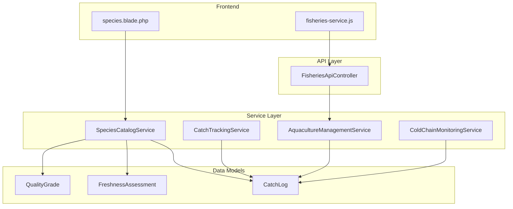
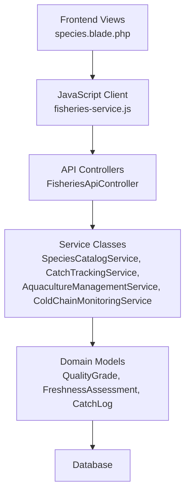
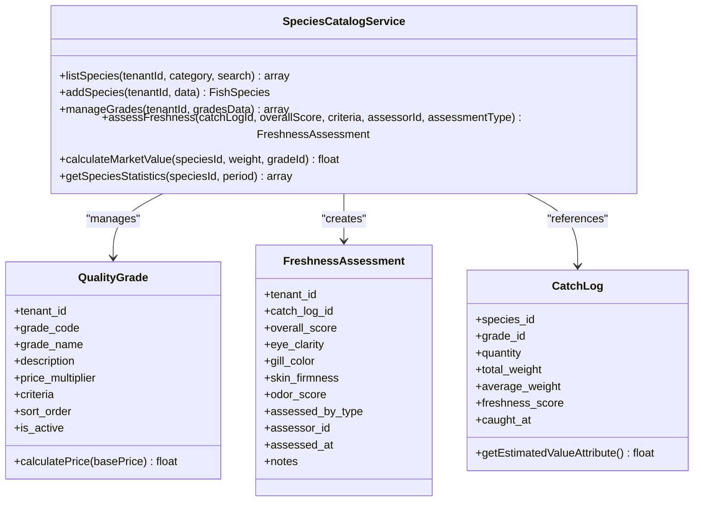
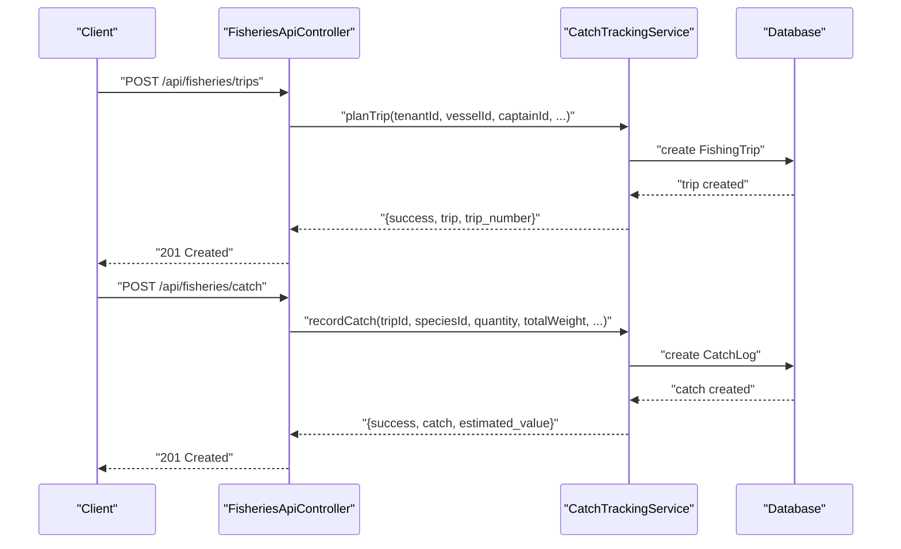
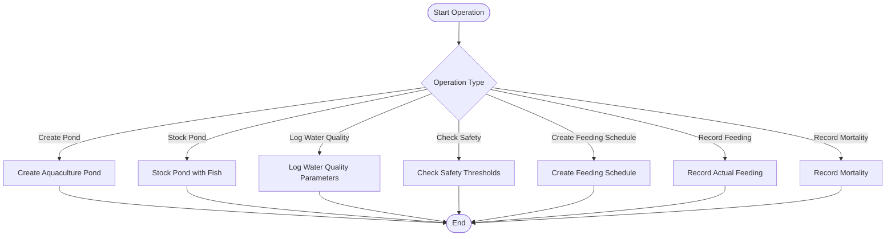
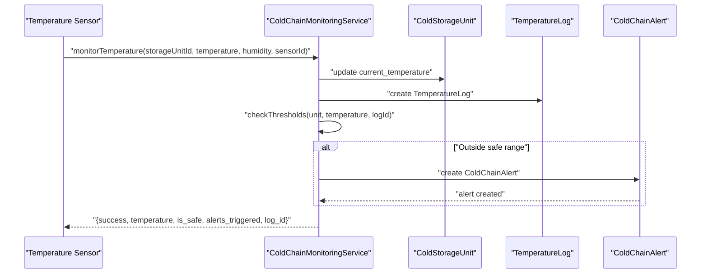
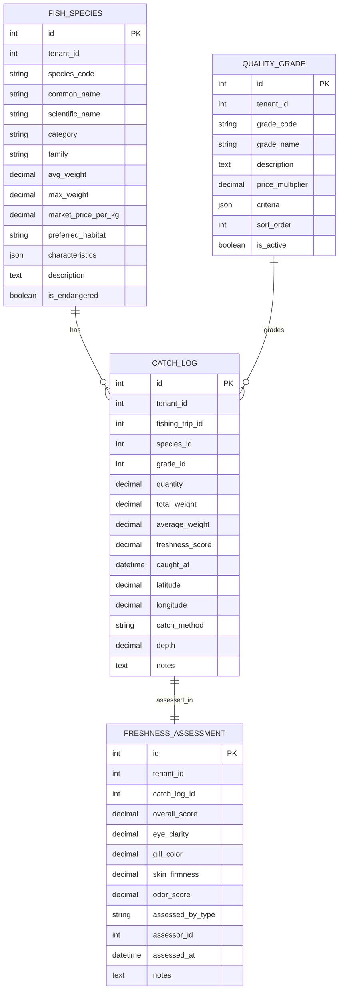

# Species Catalog & Quality Management

<cite>
**Referenced Files in This Document**
- [SpeciesCatalogService.php](file://app/Services/Fisheries/SpeciesCatalogService.php)
- [CatchTrackingService.php](file://app/Services/Fisheries/CatchTrackingService.php)
- [AquacultureManagementService.php](file://app/Services/Fisheries/AquacultureManagementService.php)
- [ColdChainMonitoringService.php](file://app/Services/Fisheries/ColdChainMonitoringService.php)
- [FisheriesApiController.php](file://app/Http/Controllers/Api/FisheriesApiController.php)
- [QualityGrade.php](file://app/Models/QualityGrade.php)
- [FreshnessAssessment.php](file://app/Models/FreshnessAssessment.php)
- [CatchLog.php](file://app/Models/CatchLog.php)
- [fisheries-service.js](file://resources/js/fisheries-service.js)
- [species.blade.php](file://resources/views/fisheries/species.blade.php)
</cite>

## Table of Contents
1. [Introduction](#introduction)
2. [Project Structure](#project-structure)
3. [Core Components](#core-components)
4. [Architecture Overview](#architecture-overview)
5. [Detailed Component Analysis](#detailed-component-analysis)
6. [API Endpoints](#api-endpoints)
7. [Scientific Classification & Standards](#scientific-classification--standards)
8. [Regulatory Compliance](#regulatory-compliance)
9. [Integration & Trade Databases](#integration--trade-databases)
10. [Performance Considerations](#performance-considerations)
11. [Troubleshooting Guide](#troubleshooting-guide)
12. [Conclusion](#conclusion)

## Introduction
This document provides comprehensive documentation for the Species Catalog and Quality Management subsystem within the Fisheries domain. It covers fish species database management, quality grading systems, freshness assessment protocols, market value calculations, and species categorization. Additionally, it outlines API endpoints for species registration, quality evaluation scoring, freshness testing procedures, and automated pricing algorithms. The document also addresses scientific classification systems, market grade standards, regulatory compliance for species identification, and integration pathways with international trade databases.

## Project Structure
The Species Catalog and Quality Management functionality is primarily implemented through service classes, models, controllers, and frontend integration utilities. The key components are organized as follows:
- Service Layer: Centralized business logic for catalog management, catch tracking, aquaculture operations, and cold chain monitoring.
- Data Models: Domain entities representing species, quality grades, freshness assessments, and catch records.
- API Controllers: HTTP endpoints for aquatic farm operations and related data management.
- Frontend Integration: JavaScript service module and Blade templates for user interaction.

**Diagram sources**
- [SpeciesCatalogService.php:1-149](file://app/Services/Fisheries/SpeciesCatalogService.php#L1-L149)
- [CatchTrackingService.php:1-345](file://app/Services/Fisheries/CatchTrackingService.php#L1-L345)
- [AquacultureManagementService.php:1-275](file://app/Services/Fisheries/AquacultureManagementService.php#L1-L275)
- [ColdChainMonitoringService.php:1-229](file://app/Services/Fisheries/ColdChainMonitoringService.php#L1-L229)
- [FisheriesApiController.php:1-134](file://app/Http/Controllers/Api/FisheriesApiController.php#L1-L134)
- [QualityGrade.php:1-47](file://app/Models/QualityGrade.php#L1-L47)
- [FreshnessAssessment.php:1-52](file://app/Models/FreshnessAssessment.php#L1-L52)
- [CatchLog.php:1-75](file://app/Models/CatchLog.php#L1-L75)
- [fisheries-service.js:188-241](file://resources/js/fisheries-service.js#L188-L241)
- [species.blade.php:1-104](file://resources/views/fisheries/species.blade.php#L1-L104)

**Section sources**
- [SpeciesCatalogService.php:1-149](file://app/Services/Fisheries/SpeciesCatalogService.php#L1-L149)
- [CatchTrackingService.php:1-345](file://app/Services/Fisheries/CatchTrackingService.php#L1-L345)
- [AquacultureManagementService.php:1-275](file://app/Services/Fisheries/AquacultureManagementService.php#L1-L275)
- [ColdChainMonitoringService.php:1-229](file://app/Services/Fisheries/ColdChainMonitoringService.php#L1-L229)
- [FisheriesApiController.php:1-134](file://app/Http/Controllers/Api/FisheriesApiController.php#L1-L134)
- [QualityGrade.php:1-47](file://app/Models/QualityGrade.php#L1-L47)
- [FreshnessAssessment.php:1-52](file://app/Models/FreshnessAssessment.php#L1-L52)
- [CatchLog.php:1-75](file://app/Models/CatchLog.php#L1-L75)
- [fisheries-service.js:188-241](file://resources/js/fisheries-service.js#L188-L241)
- [species.blade.php:1-104](file://resources/views/fisheries/species.blade.php#L1-L104)

## Core Components
This section details the primary components responsible for managing fish species catalogs, quality grading, freshness assessment, and market valuation.

- SpeciesCatalogService: Provides species listing, creation, quality grade management, freshness assessment, market value calculation, and species statistics.
- CatchTrackingService: Manages fishing trips, catch recording, position updates, trip completion, and analytics.
- AquacultureManagementService: Handles pond creation, fish stocking, water quality logging, safety checks, feeding schedules, mortality logging, and performance metrics.
- ColdChainMonitoringService: Monitors storage unit temperatures, triggers alerts, acknowledges and resolves alerts, and generates compliance reports.
- QualityGrade model: Defines grade attributes, price multipliers, criteria, and relationships to catch logs.
- FreshnessAssessment model: Captures assessment scores and relationships to catch logs.
- CatchLog model: Stores catch details, calculates estimated value, and links to species and grade.
- FisheriesApiController: Exposes endpoints for aquatic farm operations (ponds, fish stocks, harvests, water quality).
- fisheries-service.js: Frontend client for API interactions including species, grades, freshness assessment, and market value calculations.
- species.blade.php: UI template integrating with the species catalog and grading features.

**Section sources**
- [SpeciesCatalogService.php:1-149](file://app/Services/Fisheries/SpeciesCatalogService.php#L1-L149)
- [CatchTrackingService.php:1-345](file://app/Services/Fisheries/CatchTrackingService.php#L1-L345)
- [AquacultureManagementService.php:1-275](file://app/Services/Fisheries/AquacultureManagementService.php#L1-L275)
- [ColdChainMonitoringService.php:1-229](file://app/Services/Fisheries/ColdChainMonitoringService.php#L1-L229)
- [QualityGrade.php:1-47](file://app/Models/QualityGrade.php#L1-L47)
- [FreshnessAssessment.php:1-52](file://app/Models/FreshnessAssessment.php#L1-L52)
- [CatchLog.php:1-75](file://app/Models/CatchLog.php#L1-L75)
- [FisheriesApiController.php:1-134](file://app/Http/Controllers/Api/FisheriesApiController.php#L1-L134)
- [fisheries-service.js:188-241](file://resources/js/fisheries-service.js#L188-L241)
- [species.blade.php:1-104](file://resources/views/fisheries/species.blade.php#L1-L104)

## Architecture Overview
The system follows a layered architecture:
- Presentation Layer: Blade templates and JavaScript client handle user interactions.
- API Layer: RESTful controllers expose endpoints for aquatic farm data.
- Service Layer: Business logic encapsulated in service classes.
- Data Layer: Eloquent models define domain entities and relationships.

**Diagram sources**
- [species.blade.php:1-104](file://resources/views/fisheries/species.blade.php#L1-L104)
- [fisheries-service.js:188-241](file://resources/js/fisheries-service.js#L188-L241)
- [FisheriesApiController.php:1-134](file://app/Http/Controllers/Api/FisheriesApiController.php#L1-L134)
- [SpeciesCatalogService.php:1-149](file://app/Services/Fisheries/SpeciesCatalogService.php#L1-L149)
- [CatchTrackingService.php:1-345](file://app/Services/Fisheries/CatchTrackingService.php#L1-L345)
- [AquacultureManagementService.php:1-275](file://app/Services/Fisheries/AquacultureManagementService.php#L1-L275)
- [ColdChainMonitoringService.php:1-229](file://app/Services/Fisheries/ColdChainMonitoringService.php#L1-L229)
- [QualityGrade.php:1-47](file://app/Models/QualityGrade.php#L1-L47)
- [FreshnessAssessment.php:1-52](file://app/Models/FreshnessAssessment.php#L1-L52)
- [CatchLog.php:1-75](file://app/Models/CatchLog.php#L1-L75)

## Detailed Component Analysis

### Species Catalog Service
The SpeciesCatalogService orchestrates species catalog operations, quality grading, and freshness assessments.

**Diagram sources**
- [SpeciesCatalogService.php:1-149](file://app/Services/Fisheries/SpeciesCatalogService.php#L1-L149)
- [QualityGrade.php:1-47](file://app/Models/QualityGrade.php#L1-L47)
- [FreshnessAssessment.php:1-52](file://app/Models/FreshnessAssessment.php#L1-L52)
- [CatchLog.php:1-75](file://app/Models/CatchLog.php#L1-L75)

Key capabilities:
- Species listing with filtering by category and search terms.
- Creation of new species entries with scientific classification and market data.
- Quality grade management via upsert operations with criteria and multipliers.
- Freshness assessment creation with standardized scoring fields.
- Market value calculation combining base price, weight, and grade multiplier.
- Species statistics aggregation by period.

**Section sources**
- [SpeciesCatalogService.php:14-31](file://app/Services/Fisheries/SpeciesCatalogService.php#L14-L31)
- [SpeciesCatalogService.php:36-53](file://app/Services/Fisheries/SpeciesCatalogService.php#L36-L53)
- [SpeciesCatalogService.php:58-81](file://app/Services/Fisheries/SpeciesCatalogService.php#L58-L81)
- [SpeciesCatalogService.php:86-100](file://app/Services/Fisheries/SpeciesCatalogService.php#L86-L100)
- [SpeciesCatalogService.php:105-118](file://app/Services/Fisheries/SpeciesCatalogService.php#L105-L118)
- [SpeciesCatalogService.php:123-147](file://app/Services/Fisheries/SpeciesCatalogService.php#L123-L147)

### Catch Tracking Service
The CatchTrackingService manages the lifecycle of fishing trips and catch records, including geographic tracking and performance analytics.

**Diagram sources**
- [CatchTrackingService.php:16-55](file://app/Services/Fisheries/CatchTrackingService.php#L16-L55)
- [CatchTrackingService.php:83-125](file://app/Services/Fisheries/CatchTrackingService.php#L83-L125)
- [FisheriesApiController.php:14-43](file://app/Http/Controllers/Api/FisheriesApiController.php#L14-L43)
- [FisheriesApiController.php:85-99](file://app/Http/Controllers/Api/FisheriesApiController.php#L85-L99)

Operational highlights:
- Trip planning with auto-generated identifiers and crew assignment.
- Real-time position updates and status transitions.
- Catch recording with automatic average weight computation and estimated value calculation.
- Trip completion with performance metrics (duration, fuel efficiency, catch rate).
- Analytics for top species and quota usage tracking.

**Section sources**
- [CatchTrackingService.php:16-55](file://app/Services/Fisheries/CatchTrackingService.php#L16-L55)
- [CatchTrackingService.php:83-125](file://app/Services/Fisheries/CatchTrackingService.php#L83-L125)
- [CatchTrackingService.php:154-180](file://app/Services/Fisheries/CatchTrackingService.php#L154-L180)
- [CatchTrackingService.php:185-223](file://app/Services/Fisheries/CatchTrackingService.php#L185-L223)
- [CatchTrackingService.php:228-245](file://app/Services/Fisheries/CatchTrackingService.php#L228-L245)
- [CatchTrackingService.php:250-298](file://app/Services/Fisheries/CatchTrackingService.php#L250-L298)
- [CatchTrackingService.php:303-343](file://app/Services/Fisheries/CatchTrackingService.php#L303-L343)

### Aquaculture Management Service
The AquacultureManagementService supports pond operations, water quality monitoring, feeding schedules, and mortality tracking.

**Diagram sources**
- [AquacultureManagementService.php:15-29](file://app/Services/Fisheries/AquacultureManagementService.php#L15-L29)
- [AquacultureManagementService.php:34-50](file://app/Services/Fisheries/AquacultureManagementService.php#L34-L50)
- [AquacultureManagementService.php:55-73](file://app/Services/Fisheries/AquacultureManagementService.php#L55-L73)
- [AquacultureManagementService.php:78-101](file://app/Services/Fisheries/AquacultureManagementService.php#L78-L101)
- [AquacultureManagementService.php:106-117](file://app/Services/Fisheries/AquacultureManagementService.php#L106-L117)
- [AquacultureManagementService.php:122-138](file://app/Services/Fisheries/AquacultureManagementService.php#L122-L138)
- [AquacultureManagementService.php:143-156](file://app/Services/Fisheries/AquacultureManagementService.php#L143-L156)

Key features:
- Pond lifecycle management with status tracking.
- Water quality logging with safety threshold checks.
- Feeding schedule planning and execution tracking.
- Mortality reporting with cause and symptom documentation.
- Performance metrics including Feed Conversion Ratio (FCR) and dashboard insights.

**Section sources**
- [AquacultureManagementService.php:15-29](file://app/Services/Fisheries/AquacultureManagementService.php#L15-L29)
- [AquacultureManagementService.php:34-50](file://app/Services/Fisheries/AquacultureManagementService.php#L34-L50)
- [AquacultureManagementService.php:55-73](file://app/Services/Fisheries/AquacultureManagementService.php#L55-L73)
- [AquacultureManagementService.php:78-101](file://app/Services/Fisheries/AquacultureManagementService.php#L78-L101)
- [AquacultureManagementService.php:106-117](file://app/Services/Fisheries/AquacultureManagementService.php#L106-L117)
- [AquacultureManagementService.php:122-138](file://app/Services/Fisheries/AquacultureManagementService.php#L122-L138)
- [AquacultureManagementService.php:143-156](file://app/Services/Fisheries/AquacultureManagementService.php#L143-L156)
- [AquacultureManagementService.php:161-202](file://app/Services/Fisheries/AquacultureManagementService.php#L161-L202)
- [AquacultureManagementService.php:207-242](file://app/Services/Fisheries/AquacultureManagementService.php#L207-L242)
- [AquacultureManagementService.php:247-273](file://app/Services/Fisheries/AquacultureManagementService.php#L247-L273)

### Cold Chain Monitoring Service
The ColdChainMonitoringService ensures temperature-controlled storage compliance through continuous monitoring and alerting.

**Diagram sources**
- [ColdChainMonitoringService.php:15-52](file://app/Services/Fisheries/ColdChainMonitoringService.php#L15-L52)
- [ColdChainMonitoringService.php:57-82](file://app/Services/Fisheries/ColdChainMonitoringService.php#L57-L82)
- [ColdChainMonitoringService.php:103-122](file://app/Services/Fisheries/ColdChainMonitoringService.php#L103-L122)
- [ColdChainMonitoringService.php:127-145](file://app/Services/Fisheries/ColdChainMonitoringService.php#L127-L145)
- [ColdChainMonitoringService.php:150-161](file://app/Services/Fisheries/ColdChainMonitoringService.php#L150-L161)
- [ColdChainMonitoringService.php:166-180](file://app/Services/Fisheries/ColdChainMonitoringService.php#L166-L180)
- [ColdChainMonitoringService.php:185-227](file://app/Services/Fisheries/ColdChainMonitoringService.php#L185-L227)

Operational highlights:
- Continuous temperature monitoring with automatic threshold breach detection.
- Severity calculation based on deviation magnitude.
- Alert acknowledgment and resolution workflows.
- Active alerts retrieval and temperature history queries.
- Compliance reporting across storage units.

**Section sources**
- [ColdChainMonitoringService.php:15-52](file://app/Services/Fisheries/ColdChainMonitoringService.php#L15-L52)
- [ColdChainMonitoringService.php:57-82](file://app/Services/Fisheries/ColdChainMonitoringService.php#L57-L82)
- [ColdChainMonitoringService.php:103-122](file://app/Services/Fisheries/ColdChainMonitoringService.php#L103-L122)
- [ColdChainMonitoringService.php:127-145](file://app/Services/Fisheries/ColdChainMonitoringService.php#L127-L145)
- [ColdChainMonitoringService.php:150-161](file://app/Services/Fisheries/ColdChainMonitoringService.php#L150-L161)
- [ColdChainMonitoringService.php:166-180](file://app/Services/Fisheries/ColdChainMonitoringService.php#L166-L180)
- [ColdChainMonitoringService.php:185-227](file://app/Services/Fisheries/ColdChainMonitoringService.php#L185-L227)

## API Endpoints
The Fisheries API exposes endpoints for aquatic farm operations and related data management.

- GET /api/fisheries/ponds
  - Description: List ponds with optional status filter.
  - Query Parameters: status (optional), per_page (default 20).
  - Response: Paginated list of ponds with associated fish stocks.

- POST /api/fisheries/ponds
  - Description: Create a new pond.
  - Request Body: name, size, type, location (optional), status (optional).
  - Response: Created pond object.

- GET /api/fisheries/fish-stocks
  - Description: List fish stocks with optional pond filter.
  - Query Parameters: pond_id (optional), per_page (default 20).
  - Response: Paginated list of fish stocks with associated pond.

- POST /api/fisheries/fish-stocks
  - Description: Stock a pond with fish.
  - Request Body: pond_id, fish_type, quantity, average_weight (optional), source (optional).
  - Response: Created stock object.

- GET /api/fisheries/harvests
  - Description: List harvest records.
  - Query Parameters: per_page (default 20).
  - Response: Paginated list of harvests with associated pond.

- POST /api/fisheries/harvests
  - Description: Record a harvest.
  - Request Body: pond_id, quantity, average_weight (optional), quality (optional).
  - Response: Created harvest object.

- GET /api/fisheries/water-quality
  - Description: List water quality records with optional pond filter.
  - Query Parameters: pond_id (optional), per_page (default 20).
  - Response: Paginated list of water quality records with associated pond.

- POST /api/fisheries/water-quality
  - Description: Record water quality measurements.
  - Request Body: pond_id, ph, temperature, dissolved_oxygen, ammonia, notes (optional).
  - Response: Created water quality record.

Frontend integration endpoints:
- POST /api/fisheries/species
  - Description: Create a new fish species.
- GET /api/fisheries/species/grades
  - Description: Retrieve quality grades.
- POST /api/fisheries/species/grades
  - Description: Create or update a quality grade.
- POST /api/fisheries/species/freshness-assessment
  - Description: Record a freshness assessment.
- POST /api/fisheries/species/market-value
  - Description: Calculate market value for a species and grade.

**Section sources**
- [FisheriesApiController.php:14-43](file://app/Http/Controllers/Api/FisheriesApiController.php#L14-L43)
- [FisheriesApiController.php:45-74](file://app/Http/Controllers/Api/FisheriesApiController.php#L45-L74)
- [FisheriesApiController.php:76-100](file://app/Http/Controllers/Api/FisheriesApiController.php#L76-L100)
- [FisheriesApiController.php:102-132](file://app/Http/Controllers/Api/FisheriesApiController.php#L102-L132)
- [fisheries-service.js:188-241](file://resources/js/fisheries-service.js#L188-L241)

## Scientific Classification & Standards
The system incorporates scientific classification and market standards:
- Scientific Classification: Species entries include common name, scientific name, family, and preferred habitat.
- Market Grade Standards: QualityGrade defines grade codes, names, descriptions, price multipliers, criteria arrays, sort order, and activation status.
- Freshness Assessment Protocols: FreshnessAssessment captures standardized scoring fields (eye clarity, gill color, skin firmness, odor score) and assessment metadata.
- Market Value Calculation: CatchLog computes estimated value using base price from species and grade multiplier from QualityGrade.

**Diagram sources**
- [SpeciesCatalogService.php:36-53](file://app/Services/Fisheries/SpeciesCatalogService.php#L36-L53)
- [QualityGrade.php:14-30](file://app/Models/QualityGrade.php#L14-L30)
- [FreshnessAssessment.php:14-26](file://app/Models/FreshnessAssessment.php#L14-L26)
- [CatchLog.php:14-40](file://app/Models/CatchLog.php#L14-L40)

**Section sources**
- [SpeciesCatalogService.php:36-53](file://app/Services/Fisheries/SpeciesCatalogService.php#L36-L53)
- [QualityGrade.php:14-30](file://app/Models/QualityGrade.php#L14-L30)
- [FreshnessAssessment.php:14-26](file://app/Models/FreshnessAssessment.php#L14-L26)
- [CatchLog.php:67-74](file://app/Models/CatchLog.php#L67-L74)

## Regulatory Compliance
The system supports regulatory compliance through:
- Traceability: Catch logs capture geographic coordinates, depth, method, and timestamps for regulatory audits.
- Quality Grading: Standardized grade criteria and multipliers ensure consistent market classifications.
- Cold Chain Monitoring: Temperature logs and alerts maintain cold storage compliance with severity-based escalation.
- Water Quality Logging: Aquaculture water quality parameters are logged with safety thresholds for environmental compliance.
- Export Documentation: Export-related services support permits, health certificates, and customs declarations for international trade.

**Section sources**
- [CatchTrackingService.php:83-125](file://app/Services/Fisheries/CatchTrackingService.php#L83-L125)
- [CatchTrackingService.php:250-298](file://app/Services/Fisheries/CatchTrackingService.php#L250-L298)
- [ColdChainMonitoringService.php:57-82](file://app/Services/Fisheries/ColdChainMonitoringService.php#L57-L82)
- [AquacultureManagementService.php:55-73](file://app/Services/Fisheries/AquacultureManagementService.php#L55-L73)

## Integration & Trade Databases
Integration pathways for international trade include:
- Export Documentation: Services for permits, health certificates, and customs declarations facilitate cross-border transactions.
- Data Exchange: Standardized APIs enable integration with external trade platforms and regulatory systems.
- Compliance Reporting: Cold chain and water quality compliance reports support regulatory submissions.

Note: Specific integration endpoints for export documentation are referenced in the frontend service module.

**Section sources**
- [fisheries-service.js:220-241](file://resources/js/fisheries-service.js#L220-L241)

## Performance Considerations
- Database Indexing: Ensure indexes on frequently filtered fields (tenant_id, category, common_name, scientific_name, status) to optimize listing and search operations.
- Aggregation Efficiency: Use database-level aggregations for statistics and analytics to minimize application-side computations.
- Caching: Implement caching for static grade definitions and species lists to reduce database load.
- Asynchronous Processing: Offload heavy analytics and compliance reporting to background jobs.
- Pagination: Apply pagination consistently for large datasets in listings and exports.

## Troubleshooting Guide
Common issues and resolutions:
- API Validation Failures: Verify request payloads match controller validation rules for ponds, stocks, harvests, and water quality.
- Service Exceptions: Review service method error logging for trip planning, catch recording, and alert acknowledgments.
- Data Integrity: Confirm foreign key relationships (tenant_id, species_id, grade_id) and cascading updates for dependent records.
- Frontend Integration: Ensure API endpoint URLs align with frontend service module definitions and authentication tokens are properly set.

**Section sources**
- [CatchTrackingService.php:47-54](file://app/Services/Fisheries/CatchTrackingService.php#L47-L54)
- [CatchTrackingService.php:117-124](file://app/Services/Fisheries/CatchTrackingService.php#L117-L124)
- [ColdChainMonitoringService.php:44-51](file://app/Services/Fisheries/ColdChainMonitoringService.php#L44-L51)
- [ColdChainMonitoringService.php:105-122](file://app/Services/Fisheries/ColdChainMonitoringService.php#L105-L122)
- [fisheries-service.js:188-241](file://resources/js/fisheries-service.js#L188-L241)

## Conclusion
The Species Catalog and Quality Management subsystem provides a robust foundation for managing fish species, quality grading, freshness assessments, and market valuations. Through integrated services, models, and APIs, it supports traceability, compliance, and operational efficiency across fishing and aquaculture operations. The architecture enables scalability, maintainability, and extensibility for future enhancements and integrations with international trade databases.