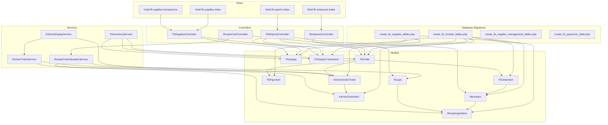
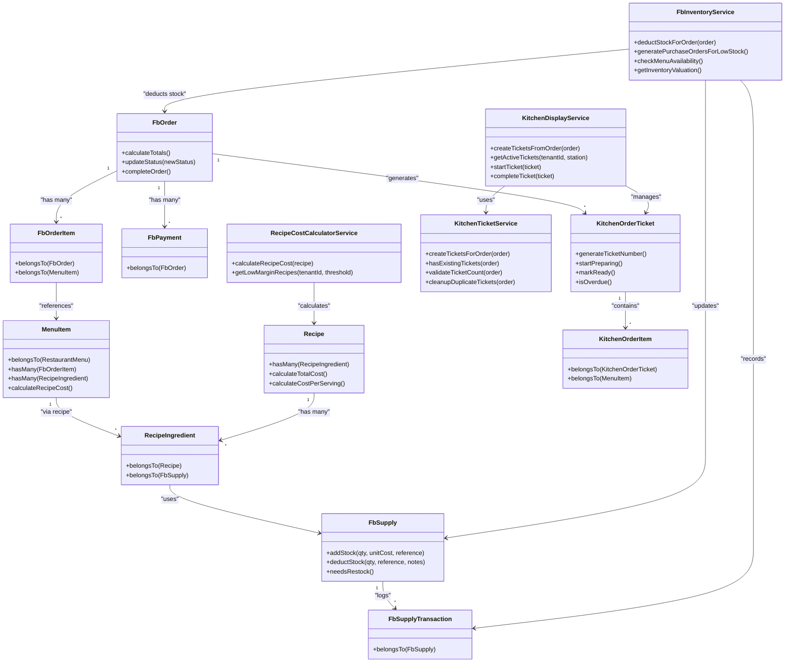
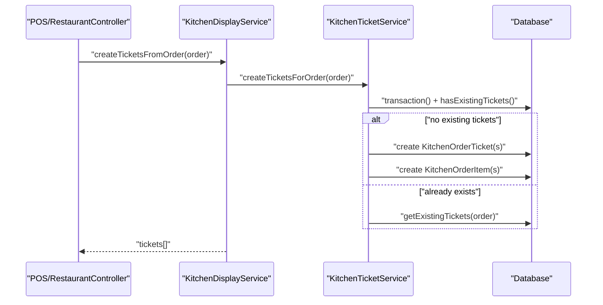
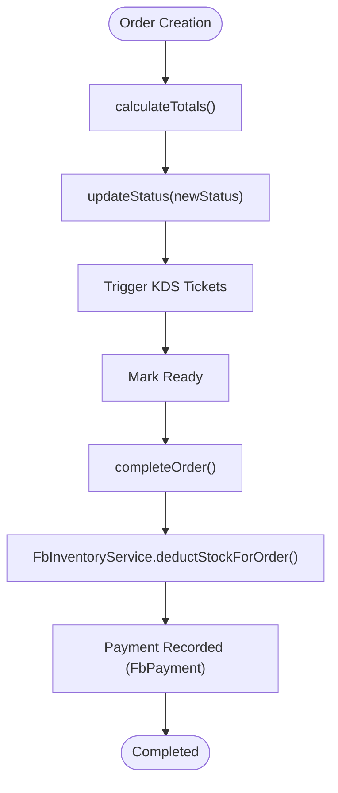
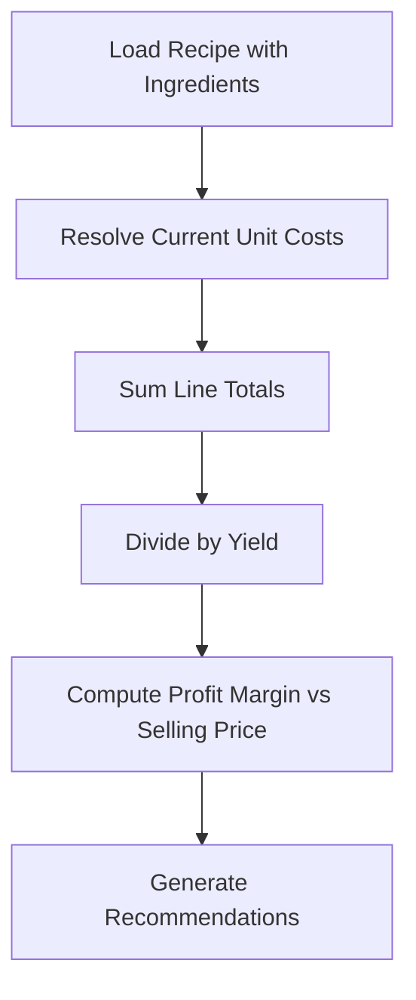
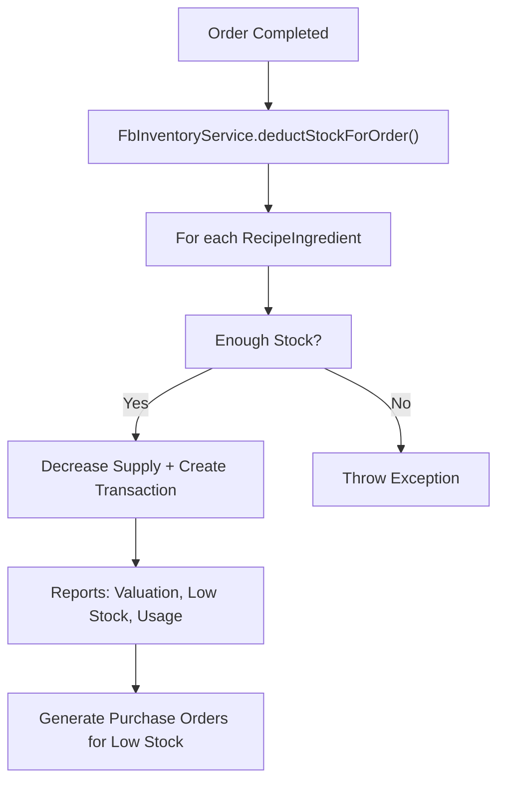
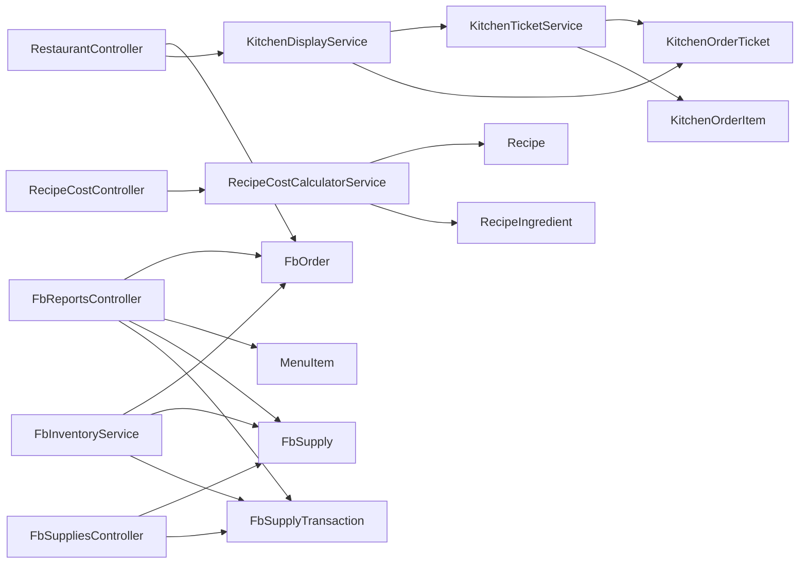

# Food & Beverage (F&B) Module

<cite>
**Referenced Files in This Document**
- [2026_04_03_400000_create_fb_module_tables.php](file://database/migrations/2026_04_03_400000_create_fb_module_tables.php)
- [2026_04_04_500000_create_fb_supplies_tables.php](file://database/migrations/2026_04_04_500000_create_fb_supplies_tables.php)
- [2026_04_04_700000_create_fb_supplier_management_tables.php](file://database/migrations/2026_04_04_700000_create_fb_supplier_management_tables.php)
- [2026_04_08_020000_create_fb_payments_table.php](file://database/migrations/2026_04_08_020000_create_fb_payments_table.php)
- [FbOrder.php](file://app/Models/FbOrder.php)
- [FbOrderItem.php](file://app/Models/FbOrderItem.php)
- [FbPayment.php](file://app/Models/FbPayment.php)
- [MenuItem.php](file://app/Models/MenuItem.php)
- [Recipe.php](file://app/Models/Recipe.php)
- [RecipeIngredient.php](file://app/Models/RecipeIngredient.php)
- [KitchenOrderTicket.php](file://app/Models/KitchenOrderTicket.php)
- [KitchenOrderItem.php](file://app/Models/KitchenOrderItem.php)
- [FbSupply.php](file://app/Models/FbSupply.php)
- [FbSupplyTransaction.php](file://app/Models/FbSupplyTransaction.php)
- [KitchenDisplayService.php](file://app/Services/KitchenDisplayService.php)
- [KitchenTicketService.php](file://app/Services/KitchenTicketService.php)
- [FbInventoryService.php](file://app/Services/FbInventoryService.php)
- [RecipeCostCalculatorService.php](file://app/Services/RecipeCostCalculatorService.php)
- [FbReportsController.php](file://app/Http/Controllers/Hotel/FbReportsController.php)
- [FbSuppliesController.php](file://app/Http/Controllers/Hotel/FbSuppliesController.php)
- [RestaurantController.php](file://app/Http/Controllers/Hotel/RestaurantController.php)
- [RecipeCostController.php](file://app/Http/Controllers/Fnb/RecipeCostController.php)
- [index.blade.php](file://resources/views/hotel/fb/reports/index.blade.php)
- [index.blade.php](file://resources/views/hotel/fb/supplies/index.blade.php)
- [transactions.blade.php](file://resources/views/hotel/fb/supplies/transactions.blade.php)
- [index.blade.php](file://resources/views/hotel/fb/restaurant/index.blade.php)
- [TenantDemoSeeder.php](file://database/seeders/TenantDemoSeeder.php)
</cite>

## Table of Contents
1. [Introduction](#introduction)
2. [Project Structure](#project-structure)
3. [Core Components](#core-components)
4. [Architecture Overview](#architecture-overview)
5. [Detailed Component Analysis](#detailed-component-analysis)
6. [Dependency Analysis](#dependency-analysis)
7. [Performance Considerations](#performance-considerations)
8. [Troubleshooting Guide](#troubleshooting-guide)
9. [Conclusion](#conclusion)
10. [Appendices](#appendices)

## Introduction
This document describes the Food & Beverage (F&B) Module, covering kitchen display systems, recipe management and cost calculation, table service operations, menu engineering, food waste tracking, inventory management for food items, beverage management, and F&B analytics. It also documents POS integration touchpoints, order ticket management, kitchen workflow optimization, staff scheduling for food service, and food safety compliance. Additional topics include waste reduction initiatives, supplier management for food products, and F&B-specific reporting requirements.

## Project Structure
The F&B module is implemented as a set of database migrations, models, services, controllers, and views under the hotel and fnb namespaces. The structure supports:
- Order lifecycle from creation to completion and payment
- Kitchen ticket generation and status tracking
- Recipe-based cost calculation and menu engineering
- Inventory tracking for supplies and recipe ingredients
- Reporting and analytics dashboards
- Supplies usage, waste, and restocking workflows

**Diagram sources**
- [2026_04_03_400000_create_fb_module_tables.php:1-248](file://database/migrations/2026_04_03_400000_create_fb_module_tables.php#L1-L248)
- [2026_04_04_500000_create_fb_supplies_tables.php:48-71](file://database/migrations/2026_04_04_500000_create_fb_supplies_tables.php#L48-L71)
- [FbOrder.php:1-183](file://app/Models/FbOrder.php#L1-L183)
- [MenuItem.php:1-198](file://app/Models/MenuItem.php#L1-L198)
- [Recipe.php:1-90](file://app/Models/Recipe.php#L1-L90)
- [RecipeIngredient.php:1-70](file://app/Models/RecipeIngredient.php#L1-L70)
- [KitchenOrderTicket.php:1-111](file://app/Models/KitchenOrderTicket.php#L1-L111)
- [KitchenOrderItem.php:1-49](file://app/Models/KitchenOrderItem.php#L1-L49)
- [FbSupply.php:1-154](file://app/Models/FbSupply.php#L1-L154)
- [FbSupplyTransaction.php:1-51](file://app/Models/FbSupplyTransaction.php#L1-L51)
- [KitchenDisplayService.php:1-173](file://app/Services/KitchenDisplayService.php#L1-L173)
- [KitchenTicketService.php:1-266](file://app/Services/KitchenTicketService.php#L1-L266)
- [FbInventoryService.php:1-250](file://app/Services/FbInventoryService.php#L1-L250)
- [RecipeCostCalculatorService.php:1-178](file://app/Services/RecipeCostCalculatorService.php#L1-L178)
- [RestaurantController.php:1-114](file://app/Http/Controllers/Hotel/RestaurantController.php#L1-L114)
- [RecipeCostController.php:1-52](file://app/Http/Controllers/Fnb/RecipeCostController.php#L1-L52)
- [FbReportsController.php:1-195](file://app/Http/Controllers/Hotel/FbReportsController.php#L1-L195)
- [FbSuppliesController.php:1-163](file://app/Http/Controllers/Hotel/FbSuppliesController.php#L1-L163)

**Section sources**
- [2026_04_03_400000_create_fb_module_tables.php:1-248](file://database/migrations/2026_04_03_400000_create_fb_module_tables.php#L1-L248)
- [2026_04_04_500000_create_fb_supplies_tables.php:48-71](file://database/migrations/2026_04_04_500000_create_fb_supplies_tables.php#L48-L71)
- [RestaurantController.php:1-114](file://app/Http/Controllers/Hotel/RestaurantController.php#L1-L114)
- [FbReportsController.php:1-195](file://app/Http/Controllers/Hotel/FbReportsController.php#L1-L195)
- [FbSuppliesController.php:1-163](file://app/Http/Controllers/Hotel/FbSuppliesController.php#L1-L163)

## Core Components
- Order Management: FbOrder captures order lifecycle, totals, and status transitions; FbOrderItem links orders to menu items; FbPayment records payments.
- Menu and Recipes: MenuItem defines menu items with pricing, cost, allergens, dietary info, and preparation time; Recipe and RecipeIngredient define recipe definitions and ingredient requirements.
- Kitchen Operations: KitchenOrderTicket and KitchenOrderItem represent kitchen tickets and items; KitchenDisplayService orchestrates ticket creation and status; KitchenTicketService ensures idempotent creation and duplicate cleanup.
- Inventory and Supplies: FbSupply tracks current stock, minimum thresholds, and unit cost; FbSupplyTransaction logs all movements; FbInventoryService handles automatic stock deduction on order completion and generates purchase orders for low stock.
- Analytics and Reporting: FbReportsController aggregates revenue, top items, categories, and supply usage; FbSuppliesController manages supplies and transactions; views render dashboards and lists.
- Beverage Management: Beverage items are modeled as menu items with pricing and preparation attributes; inventory tracking applies to beverage supplies.

**Section sources**
- [FbOrder.php:1-183](file://app/Models/FbOrder.php#L1-L183)
- [MenuItem.php:1-198](file://app/Models/MenuItem.php#L1-L198)
- [Recipe.php:1-90](file://app/Models/Recipe.php#L1-L90)
- [RecipeIngredient.php:1-70](file://app/Models/RecipeIngredient.php#L1-L70)
- [KitchenOrderTicket.php:1-111](file://app/Models/KitchenOrderTicket.php#L1-L111)
- [KitchenOrderItem.php:1-49](file://app/Models/KitchenOrderItem.php#L1-L49)
- [KitchenDisplayService.php:1-173](file://app/Services/KitchenDisplayService.php#L1-L173)
- [KitchenTicketService.php:1-266](file://app/Services/KitchenTicketService.php#L1-L266)
- [FbSupply.php:1-154](file://app/Models/FbSupply.php#L1-L154)
- [FbSupplyTransaction.php:1-51](file://app/Models/FbSupplyTransaction.php#L1-L51)
- [FbInventoryService.php:1-250](file://app/Services/FbInventoryService.php#L1-L250)
- [FbReportsController.php:1-195](file://app/Http/Controllers/Hotel/FbReportsController.php#L1-L195)
- [FbSuppliesController.php:1-163](file://app/Http/Controllers/Hotel/FbSuppliesController.php#L1-L163)

## Architecture Overview
The F&B module follows a layered architecture:
- Presentation Layer: Controllers expose endpoints for restaurant operations, recipe cost calculation, supplies management, and reporting.
- Domain Layer: Models encapsulate business entities and their behaviors (e.g., order totals, ticket status, supply transactions).
- Application Layer: Services coordinate cross-domain operations (e.g., kitchen ticket creation, inventory deduction, recipe cost calculation).
- Persistence Layer: Migrations define normalized schemas for orders, menus, recipes, kitchen tickets, supplies, and transactions.

**Diagram sources**
- [FbOrder.php:1-183](file://app/Models/FbOrder.php#L1-L183)
- [FbOrderItem.php](file://app/Models/FbOrderItem.php)
- [FbPayment.php](file://app/Models/FbPayment.php)
- [MenuItem.php:1-198](file://app/Models/MenuItem.php#L1-L198)
- [Recipe.php:1-90](file://app/Models/Recipe.php#L1-L90)
- [RecipeIngredient.php:1-70](file://app/Models/RecipeIngredient.php#L1-L70)
- [KitchenOrderTicket.php:1-111](file://app/Models/KitchenOrderTicket.php#L1-L111)
- [KitchenOrderItem.php:1-49](file://app/Models/KitchenOrderItem.php#L1-L49)
- [FbSupply.php:1-154](file://app/Models/FbSupply.php#L1-L154)
- [FbSupplyTransaction.php:1-51](file://app/Models/FbSupplyTransaction.php#L1-L51)
- [KitchenDisplayService.php:1-173](file://app/Services/KitchenDisplayService.php#L1-L173)
- [KitchenTicketService.php:1-266](file://app/Services/KitchenTicketService.php#L1-L266)
- [FbInventoryService.php:1-250](file://app/Services/FbInventoryService.php#L1-L250)
- [RecipeCostCalculatorService.php:1-178](file://app/Services/RecipeCostCalculatorService.php#L1-L178)

## Detailed Component Analysis

### Kitchen Display System (KDS)
The KDS converts restaurant orders into station-specific kitchen tickets, manages priorities, and tracks readiness and overdue status. It ensures idempotency to avoid duplicate tickets during retries.

**Diagram sources**
- [KitchenDisplayService.php:15-20](file://app/Services/KitchenDisplayService.php#L15-L20)
- [KitchenTicketService.php:32-93](file://app/Services/KitchenTicketService.php#L32-L93)

**Section sources**
- [KitchenDisplayService.php:1-173](file://app/Services/KitchenDisplayService.php#L1-L173)
- [KitchenTicketService.php:1-266](file://app/Services/KitchenTicketService.php#L1-L266)
- [KitchenOrderTicket.php:1-111](file://app/Models/KitchenOrderTicket.php#L1-L111)
- [KitchenOrderItem.php:1-49](file://app/Models/KitchenOrderItem.php#L1-L49)

### Order Lifecycle and POS Integration Touchpoints
Orders capture subtotal, tax, service charge, discounts, and payment status. Totals are calculated centrally, and order status updates are logged. Payments are linked to orders.

**Diagram sources**
- [FbOrder.php:118-181](file://app/Models/FbOrder.php#L118-L181)
- [FbPayment.php](file://app/Models/FbPayment.php)
- [FbInventoryService.php:23-55](file://app/Services/FbInventoryService.php#L23-L55)

**Section sources**
- [FbOrder.php:1-183](file://app/Models/FbOrder.php#L1-L183)
- [RestaurantController.php:75-84](file://app/Http/Controllers/Hotel/RestaurantController.php#L75-L84)

### Recipe Management and Cost Calculation
Recipes define ingredients and yields; cost calculation considers current inventory unit costs and computes profit margins. Low-margin recipes are surfaced for review.

**Diagram sources**
- [RecipeCostCalculatorService.php:13-63](file://app/Services/RecipeCostCalculatorService.php#L13-L63)
- [Recipe.php:58-88](file://app/Models/Recipe.php#L58-L88)
- [RecipeIngredient.php:53-68](file://app/Models/RecipeIngredient.php#L53-L68)

**Section sources**
- [RecipeCostController.php:1-52](file://app/Http/Controllers/Fnb/RecipeCostController.php#L1-L52)
- [RecipeCostCalculatorService.php:1-178](file://app/Services/RecipeCostCalculatorService.php#L1-L178)
- [Recipe.php:1-90](file://app/Models/Recipe.php#L1-L90)
- [RecipeIngredient.php:1-70](file://app/Models/RecipeIngredient.php#L1-L70)

### Inventory Management for Food Items and Beverage Supplies
FbSupply tracks stock, minimum thresholds, and unit costs; FbSupplyTransaction logs all movements. FbInventoryService automatically deducts stock on order completion, checks menu availability, and generates purchase orders for low stock.

**Diagram sources**
- [FbInventoryService.php:23-139](file://app/Services/FbInventoryService.php#L23-L139)
- [FbSupply.php:117-140](file://app/Models/FbSupply.php#L117-L140)
- [FbSupplyTransaction.php:1-51](file://app/Models/FbSupplyTransaction.php#L1-L51)

**Section sources**
- [FbInventoryService.php:1-250](file://app/Services/FbInventoryService.php#L1-L250)
- [FbSupply.php:1-154](file://app/Models/FbSupply.php#L1-L154)
- [FbSupplyTransaction.php:1-51](file://app/Models/FbSupplyTransaction.php#L1-L51)

### Menu Engineering and Availability
MenuItem exposes profit margin, daily limits, and recipe-based cost updates. The system validates recipe completeness and availability against current stock.

**Section sources**
- [MenuItem.php:84-196](file://app/Models/MenuItem.php#L84-L196)
- [FbInventoryService.php:144-186](file://app/Services/FbInventoryService.php#L144-L186)

### Table Service Operations
RestaurantController provides order listing, recent orders, and status updates. The UI enables adding items, specifying special instructions, and selecting table numbers.

**Section sources**
- [RestaurantController.php:1-114](file://app/Http/Controllers/Hotel/RestaurantController.php#L1-L114)
- [index.blade.php:157-181](file://resources/views/hotel/fb/restaurant/index.blade.php#L157-L181)

### Food Waste Tracking
Waste is tracked via FbSupplyTransaction with transaction_type including usage, waste, and adjustment. Reports aggregate supply usage and cost.

**Section sources**
- [FbSupplyTransaction.php:1-51](file://app/Models/FbSupplyTransaction.php#L1-L51)
- [FbReportsController.php:77-92](file://app/Http/Controllers/Hotel/FbReportsController.php#L77-L92)

### Supplier Management
Suppliers are associated with supplies via supplier_name. Low-stock triggers grouped purchase orders by supplier for efficient procurement.

**Section sources**
- [FbSupply.php:26-28](file://app/Models/FbSupply.php#L26-L28)
- [FbInventoryService.php:84-139](file://app/Services/FbInventoryService.php#L84-L139)

### F&B Analytics and Reporting
FbReportsController aggregates revenue by order type, daily trends, top items, categories, and supply usage. CSV export is supported.

**Section sources**
- [FbReportsController.php:23-128](file://app/Http/Controllers/Hotel/FbReportsController.php#L23-L128)
- [index.blade.php](file://resources/views/hotel/fb/reports/index.blade.php)

### POS Integration Notes
- Order totals and status are computed and persisted in FbOrder.
- Payments are recorded in FbPayment linked to orders.
- Kitchen tickets are generated from orders to integrate with kitchen displays.

**Section sources**
- [FbOrder.php:118-147](file://app/Models/FbOrder.php#L118-L147)
- [FbPayment.php](file://app/Models/FbPayment.php)
- [KitchenDisplayService.php:15-20](file://app/Services/KitchenDisplayService.php#L15-L20)

### Staff Scheduling for Food Service
- Server assignment is captured in FbOrder.server_id.
- Kitchen staff operate tickets via KitchenOrderTicket.startPreparing() and markReady().
- Overdue detection helps schedule and monitor throughput.

**Section sources**
- [FbOrder.php:64-83](file://app/Models/FbOrder.php#L64-L83)
- [KitchenOrderTicket.php:67-84](file://app/Models/KitchenOrderTicket.php#L67-L84)
- [KitchenDisplayService.php:91-98](file://app/Services/KitchenDisplayService.php#L91-L98)

### Food Safety Compliance
- Batch and expiry tracking is identified as a future enhancement requiring additional tables.
- Current supply tracking includes unit cost and last restocked date.

**Section sources**
- [FbInventoryService.php:235-248](file://app/Services/FbInventoryService.php#L235-L248)
- [FbSupply.php:27-28](file://app/Models/FbSupply.php#L27-L28)

## Dependency Analysis
The module exhibits cohesive domain boundaries with clear separation of concerns:
- KitchenDisplayService depends on KitchenTicketService for idempotent creation.
- FbInventoryService coordinates with orders, supplies, and transactions.
- RecipeCostCalculatorService depends on recipe and ingredient models.
- Controllers orchestrate model and service interactions with minimal business logic.

**Diagram sources**
- [RestaurantController.php:1-114](file://app/Http/Controllers/Hotel/RestaurantController.php#L1-L114)
- [RecipeCostController.php:1-52](file://app/Http/Controllers/Fnb/RecipeCostController.php#L1-L52)
- [FbReportsController.php:1-195](file://app/Http/Controllers/Hotel/FbReportsController.php#L1-L195)
- [FbSuppliesController.php:1-163](file://app/Http/Controllers/Hotel/FbSuppliesController.php#L1-L163)
- [KitchenDisplayService.php:1-173](file://app/Services/KitchenDisplayService.php#L1-L173)
- [KitchenTicketService.php:1-266](file://app/Services/KitchenTicketService.php#L1-L266)
- [KitchenOrderTicket.php:1-111](file://app/Models/KitchenOrderTicket.php#L1-L111)
- [KitchenOrderItem.php:1-49](file://app/Models/KitchenOrderItem.php#L1-L49)
- [FbInventoryService.php:1-250](file://app/Services/FbInventoryService.php#L1-L250)

**Section sources**
- [KitchenDisplayService.php:1-173](file://app/Services/KitchenDisplayService.php#L1-L173)
- [KitchenTicketService.php:1-266](file://app/Services/KitchenTicketService.php#L1-L266)
- [FbInventoryService.php:1-250](file://app/Services/FbInventoryService.php#L1-L250)
- [RecipeCostCalculatorService.php:1-178](file://app/Services/RecipeCostCalculatorService.php#L1-L178)
- [FbReportsController.php:1-195](file://app/Http/Controllers/Hotel/FbReportsController.php#L1-L195)
- [FbSuppliesController.php:1-163](file://app/Http/Controllers/Hotel/FbSuppliesController.php#L1-L163)

## Performance Considerations
- Idempotent ticket creation prevents duplicate work and reduces race conditions.
- Batched bulk updates for recipe costs improve throughput.
- Inventory valuation and low-stock calculations use aggregated queries to minimize overhead.
- Use pagination for supply and transaction listings to limit memory footprint.

## Troubleshooting Guide
Common issues and resolutions:
- Duplicate kitchen tickets: Use validateTicketCount() and cleanupDuplicateTickets() to detect and remove duplicates.
- Insufficient stock on order completion: The system throws an exception; verify supply quantities and recipe requirements.
- Overdue tickets: Monitor overdue tickets via getOverdueTickets() and adjust preparation times or staffing.
- Low stock alerts: Use FbSupply.getLowStockSupplies() and generatePurchaseOrdersForLowStock() to proactively restock.

**Section sources**
- [KitchenTicketService.php:125-205](file://app/Services/KitchenTicketService.php#L125-L205)
- [FbInventoryService.php:23-79](file://app/Services/FbInventoryService.php#L23-L79)
- [KitchenDisplayService.php:91-98](file://app/Services/KitchenDisplayService.php#L91-L98)
- [FbSupply.php:145-152](file://app/Models/FbSupply.php#L145-L152)

## Conclusion
The F&B Module provides a robust foundation for restaurant operations, integrating order management, kitchen workflow automation, recipe-driven cost accounting, and comprehensive inventory and reporting capabilities. Extensions such as batch/expiry tracking and advanced scheduling can further strengthen compliance and operational excellence.

## Appendices

### Database Schema Highlights
- Orders, order items, payments, menus, menu items, recipes, recipe ingredients, kitchen tickets, kitchen items, supplies, and supply transactions are defined in dedicated migrations.
- Indexes and foreign keys support efficient querying and referential integrity.

**Section sources**
- [2026_04_03_400000_create_fb_module_tables.php:1-248](file://database/migrations/2026_04_03_400000_create_fb_module_tables.php#L1-L248)
- [2026_04_04_500000_create_fb_supplies_tables.php:48-71](file://database/migrations/2026_04_04_500000_create_fb_supplies_tables.php#L48-L71)
- [2026_04_04_700000_create_fb_supplier_management_tables.php](file://database/migrations/2026_04_04_700000_create_fb_supplier_management_tables.php)
- [2026_04_08_020000_create_fb_payments_table.php](file://database/migrations/2026_04_08_020000_create_fb_payments_table.php)

### Demo Data
- Seeders create sample menus and menu items for demonstration.

**Section sources**
- [TenantDemoSeeder.php:1971-1992](file://database/seeders/TenantDemoSeeder.php#L1971-L1992)