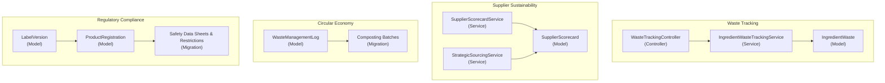
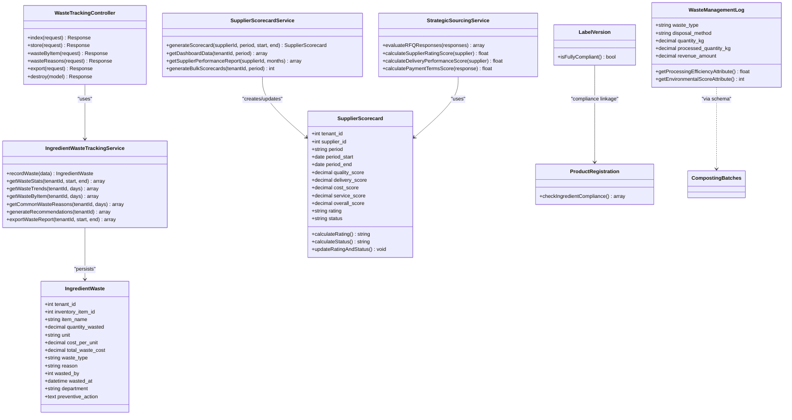
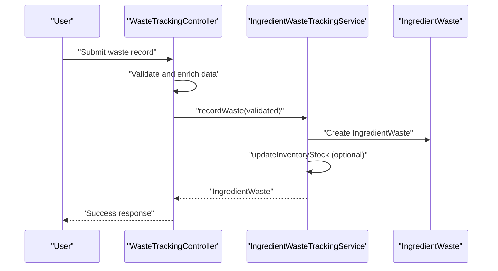
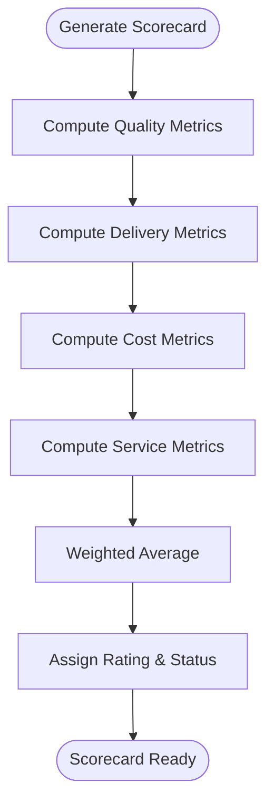
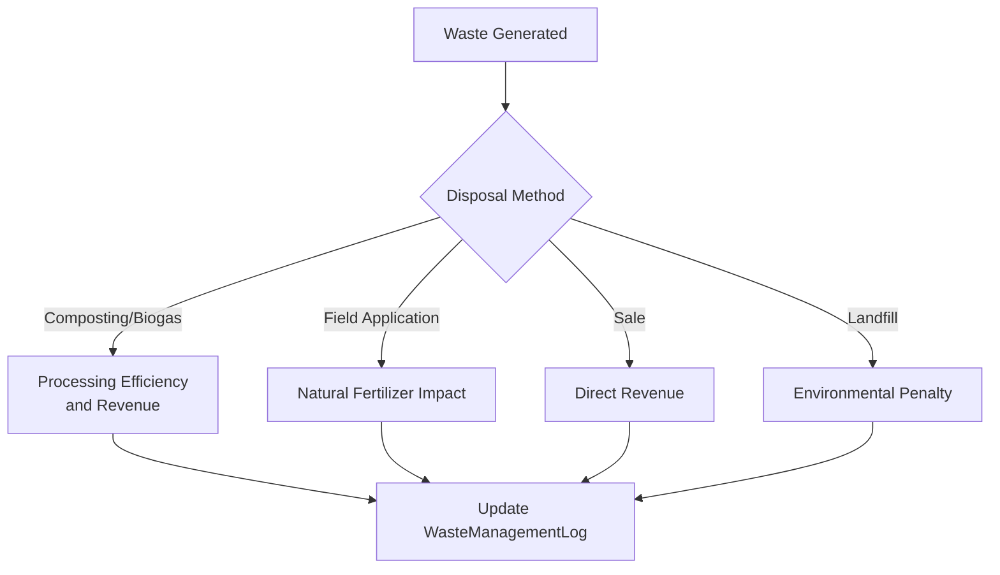
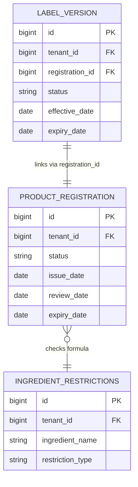
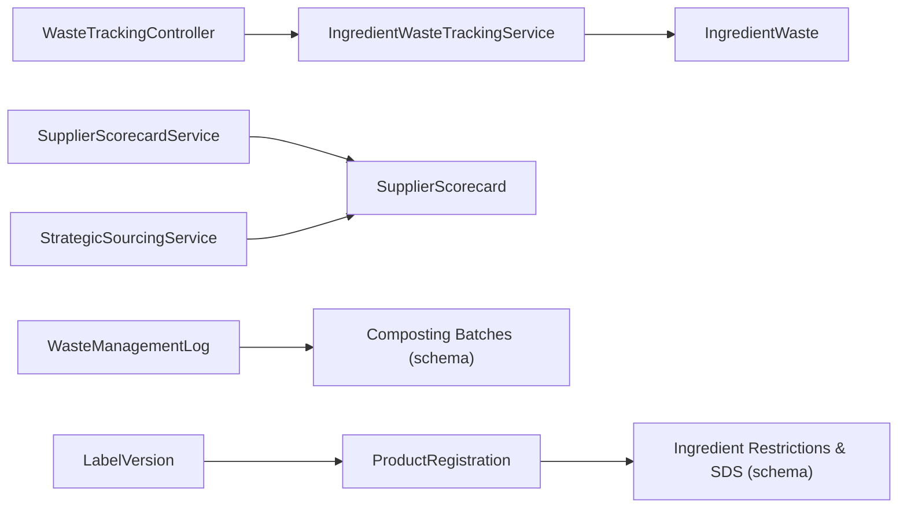

# Food Waste Tracking & Sustainability

<cite>
**Referenced Files in This Document**
- [2026_04_06_041804_create_ingredient_wastes_table.php](file://database/migrations/2026_04_06_041804_create_ingredient_wastes_table.php)
- [IngredientWaste.php](file://app/Models/IngredientWaste.php)
- [IngredientWasteTrackingService.php](file://app/Services/IngredientWasteTrackingService.php)
- [WasteTrackingController.php](file://app/Http/Controllers/Fnb/WasteTrackingController.php)
- [2026_04_06_150000_create_supplier_scorecard_tables.php](file://database/migrations/2026_04_06_150000_create_supplier_scorecard_tables.php)
- [SupplierScorecard.php](file://app/Models/SupplierScorecard.php)
- [SupplierScorecardService.php](file://app/Services/SupplierScorecardService.php)
- [StrategicSourcingService.php](file://app/Services/StrategicSourcingService.php)
- [WasteManagementLog.php](file://app/Models/WasteManagementLog.php)
- [2026_04_07_120000_create_livestock_enhancement_tables.php](file://database/migrations/2026_04_07_120000_create_livestock_enhancement_tables.php)
- [2026_04_07_180000_create_packaging_labeling_tables.php](file://database/migrations/2026_04_07_180000_create_packaging_labeling_tables.php)
- [LabelVersion.php](file://app/Models/LabelVersion.php)
- [2026_04_07_160000_create_bpom_registration_tables.php](file://database/migrations/2026_04_07_160000_create_bpom_registration_tables.php)
- [ProductRegistration.php](file://app/Models/ProductRegistration.php)
- [2026_04_08_1200001_create_medical_inventory_tables.php](file://database/migrations/2026_04_08_1200001_create_medical_inventory_tables.php)
- [2026_04_09_200000_create_gdpr_compliance_tables.php](file://database/migrations/2026_04_09_200000_create_gdpr_compliance_tables.php)
</cite>

## Table of Contents
1. [Introduction](#introduction)
2. [Project Structure](#project-structure)
3. [Core Components](#core-components)
4. [Architecture Overview](#architecture-overview)
5. [Detailed Component Analysis](#detailed-component-analysis)
6. [Dependency Analysis](#dependency-analysis)
7. [Performance Considerations](#performance-considerations)
8. [Troubleshooting Guide](#troubleshooting-guide)
9. [Conclusion](#conclusion)
10. [Appendices](#appendices)

## Introduction
This document describes the Food Waste Tracking & Sustainability module within the qalcuityERP platform. It focuses on measuring and managing ingredient waste, tracking supplier performance, and integrating sustainability reporting. The system supports waste categorization, cost calculation, trend analysis, and actionable recommendations. It also covers supplier scorecards, strategic sourcing, and regulatory compliance for packaging and registrations.

## Project Structure
The sustainability and waste tracking capabilities are implemented across models, services, controllers, and database migrations. The primary areas include:
- Ingredient waste tracking (measurement, categorization, reporting)
- Supplier scorecards and strategic sourcing
- Waste-to-compost and circular economy pathways
- Regulatory compliance for labeling and product registrations
- Food safety and medical waste management

**Diagram sources**
- [IngredientWaste.php:13-96](file://app/Models/IngredientWaste.php#L13-L96)
- [IngredientWasteTrackingService.php:9-268](file://app/Services/IngredientWasteTrackingService.php#L9-L268)
- [WasteTrackingController.php:12-149](file://app/Http/Controllers/Fnb/WasteTrackingController.php#L12-L149)
- [SupplierScorecard.php:12-115](file://app/Models/SupplierScorecard.php#L12-L115)
- [SupplierScorecardService.php:12-322](file://app/Services/SupplierScorecardService.php#L12-L322)
- [StrategicSourcingService.php:185-309](file://app/Services/StrategicSourcingService.php#L185-L309)
- [WasteManagementLog.php:50-139](file://app/Models/WasteManagementLog.php#L50-L139)
- [2026_04_07_120000_create_livestock_enhancement_tables.php:194-205](file://database/migrations/2026_04_07_120000_create_livestock_enhancement_tables.php#L194-L205)
- [LabelVersion.php:139-166](file://app/Models/LabelVersion.php#L139-L166)
- [ProductRegistration.php:95-138](file://app/Models/ProductRegistration.php#L95-L138)
- [2026_04_07_160000_create_bpom_registration_tables.php:26-105](file://database/migrations/2026_04_07_160000_create_bpom_registration_tables.php#L26-L105)

**Section sources**
- [2026_04_06_041804_create_ingredient_wastes_table.php:14-36](file://database/migrations/2026_04_06_041804_create_ingredient_wastes_table.php#L14-L36)
- [2026_04_06_150000_create_supplier_scorecard_tables.php:14-61](file://database/migrations/2026_04_06_150000_create_supplier_scorecard_tables.php#L14-L61)
- [2026_04_07_120000_create_livestock_enhancement_tables.php:194-205](file://database/migrations/2026_04_07_120000_create_livestock_enhancement_tables.php#L194-L205)
- [2026_04_07_180000_create_packaging_labeling_tables.php:49-72](file://database/migrations/2026_04_07_180000_create_packaging_labeling_tables.php#L49-L72)
- [2026_04_07_160000_create_bpom_registration_tables.php:26-105](file://database/migrations/2026_04_07_160000_create_bpom_registration_tables.php#L26-L105)
- [2026_04_08_1200001_create_medical_inventory_tables.php:233-263](file://database/migrations/2026_04_08_1200001_create_medical_inventory_tables.php#L233-L263)

## Core Components
- Ingredient Waste Tracking
  - Data model captures item, quantity, unit, cost, type, reason, department, and preventive actions.
  - Service aggregates statistics, trends, exports, and generates recommendations.
  - Controller handles UI interactions, validations, and reporting.
- Supplier Scorecards
  - Multi-criteria scoring across quality, delivery, cost, and service.
  - Automated rating and status updates; bulk generation support.
- Circular Economy Pathways
  - Waste-to-compost and biogas pathways with processing efficiency and environmental scoring.
- Regulatory Compliance
  - Label compliance checks, product registrations, and ingredient restrictions.
- Food Safety and Medical Waste
  - Medical waste lifecycle tracking and safety-related inventory controls.

**Section sources**
- [IngredientWaste.php:16-55](file://app/Models/IngredientWaste.php#L16-L55)
- [IngredientWasteTrackingService.php:14-41](file://app/Services/IngredientWasteTrackingService.php#L14-L41)
- [WasteTrackingController.php:24-83](file://app/Http/Controllers/Fnb/WasteTrackingController.php#L24-L83)
- [SupplierScorecard.php:16-101](file://app/Models/SupplierScorecard.php#L16-L101)
- [SupplierScorecardService.php:17-54](file://app/Services/SupplierScorecardService.php#L17-L54)
- [WasteManagementLog.php:57-117](file://app/Models/WasteManagementLog.php#L57-L117)
- [LabelVersion.php:139-166](file://app/Models/LabelVersion.php#L139-L166)
- [ProductRegistration.php:123-138](file://app/Models/ProductRegistration.php#L123-L138)

## Architecture Overview
The system follows a layered architecture:
- Presentation: Controllers expose endpoints and render views for waste dashboards and supplier analytics.
- Application: Services encapsulate business logic for waste calculations, supplier scoring, and reporting.
- Domain: Models define persistence and relationships for wastes, scorecards, labels, and registrations.
- Infrastructure: Migrations define schema for sustainability-related entities.

**Diagram sources**
- [IngredientWaste.php:13-96](file://app/Models/IngredientWaste.php#L13-L96)
- [IngredientWasteTrackingService.php:9-268](file://app/Services/IngredientWasteTrackingService.php#L9-L268)
- [WasteTrackingController.php:12-149](file://app/Http/Controllers/Fnb/WasteTrackingController.php#L12-L149)
- [SupplierScorecard.php:12-115](file://app/Models/SupplierScorecard.php#L12-L115)
- [SupplierScorecardService.php:12-322](file://app/Services/SupplierScorecardService.php#L12-L322)
- [StrategicSourcingService.php:185-309](file://app/Services/StrategicSourcingService.php#L185-L309)
- [WasteManagementLog.php:50-139](file://app/Models/WasteManagementLog.php#L50-L139)
- [2026_04_07_120000_create_livestock_enhancement_tables.php:194-205](file://database/migrations/2026_04_07_120000_create_livestock_enhancement_tables.php#L194-L205)
- [LabelVersion.php:139-166](file://app/Models/LabelVersion.php#L139-L166)
- [ProductRegistration.php:123-138](file://app/Models/ProductRegistration.php#L123-L138)

## Detailed Component Analysis

### Ingredient Waste Tracking
- Measurement and categorization
  - Captures item, quantity, unit, cost per unit, total cost, waste type, reason, department, and preventive action.
  - Supports spoilage, over-production, preparation error, expiration, and other categories.
- Cost calculation and inventory updates
  - Computes total waste cost and optionally updates inventory stock upon recording.
- Analytics and reporting
  - Provides daily trends, top wasted items, common reasons, and exportable reports.
  - Generates recommendations based on observed patterns (e.g., high spoilage, frequent preparation errors).
- UI and workflow
  - Controller validates inputs, auto-fills item metadata, records waste, and renders dashboards.

**Diagram sources**
- [WasteTrackingController.php:51-83](file://app/Http/Controllers/Fnb/WasteTrackingController.php#L51-L83)
- [IngredientWasteTrackingService.php:14-41](file://app/Services/IngredientWasteTrackingService.php#L14-L41)
- [IngredientWaste.php:16-30](file://app/Models/IngredientWaste.php#L16-L30)

**Section sources**
- [2026_04_06_041804_create_ingredient_wastes_table.php:14-36](file://database/migrations/2026_04_06_041804_create_ingredient_wastes_table.php#L14-L36)
- [IngredientWaste.php:16-95](file://app/Models/IngredientWaste.php#L16-L95)
- [IngredientWasteTrackingService.php:14-75](file://app/Services/IngredientWasteTrackingService.php#L14-L75)
- [WasteTrackingController.php:24-83](file://app/Http/Controllers/Fnb/WasteTrackingController.php#L24-L83)

### Supplier Scorecards and Strategic Sourcing
- Scorecard composition
  - Quality: defect rate and defect items.
  - Delivery: on-time percentage and average lead time.
  - Cost: price competitiveness and savings identified.
  - Service: issue resolution rate and response time.
  - Weighted overall score with automatic rating and status.
- Dashboard and reporting
  - Monthly/quarterly/yearly periods, top performers, risk indicators, and category breakdowns.
- Strategic sourcing integration
  - Evaluates RFQ responses with price, lead time, supplier rating, delivery performance, and payment terms.
  - Produces scored recommendations and evaluation methodology.

**Diagram sources**
- [SupplierScorecardService.php:17-54](file://app/Services/SupplierScorecardService.php#L17-L54)
- [SupplierScorecard.php:74-101](file://app/Models/SupplierScorecard.php#L74-L101)

**Section sources**
- [2026_04_06_150000_create_supplier_scorecard_tables.php:14-61](file://database/migrations/2026_04_06_150000_create_supplier_scorecard_tables.php#L14-L61)
- [SupplierScorecard.php:16-101](file://app/Models/SupplierScorecard.php#L16-L101)
- [SupplierScorecardService.php:17-322](file://app/Services/SupplierScorecardService.php#L17-L322)
- [StrategicSourcingService.php:185-309](file://app/Services/StrategicSourcingService.php#L185-L309)

### Waste-to-Compost and Circular Economy
- Waste management log
  - Tracks waste type, disposal method, quantities, revenue, and environmental scoring.
  - Supports eco-friendly methods (composting, biogas, field application) and revenue-generating outcomes.
- Composting batches
  - Schema defines batch lifecycle, weights, moisture, and processing stages.
- Implications
  - Enables circular economy tracking, environmental impact scoring, and monetization pathways.

**Diagram sources**
- [WasteManagementLog.php:86-117](file://app/Models/WasteManagementLog.php#L86-L117)
- [2026_04_07_120000_create_livestock_enhancement_tables.php:194-205](file://database/migrations/2026_04_07_120000_create_livestock_enhancement_tables.php#L194-L205)

**Section sources**
- [WasteManagementLog.php:57-139](file://app/Models/WasteManagementLog.php#L57-L139)
- [2026_04_07_120000_create_livestock_enhancement_tables.php:194-205](file://database/migrations/2026_04_07_120000_create_livestock_enhancement_tables.php#L194-L205)

### Regulatory Compliance and Food Safety
- Label compliance checks
  - Validates mandatory and regulatory requirements for label versions; tracks compliance status.
- Product registrations and ingredient restrictions
  - Enforces ingredient restriction checks and registration workflows.
- Medical waste and safety
  - Medical waste lifecycle tracking with types, statuses, and safety controls.

**Diagram sources**
- [LabelVersion.php:139-166](file://app/Models/LabelVersion.php#L139-L166)
- [ProductRegistration.php:123-138](file://app/Models/ProductRegistration.php#L123-L138)
- [2026_04_07_160000_create_bpom_registration_tables.php:53-105](file://database/migrations/2026_04_07_160000_create_bpom_registration_tables.php#L53-L105)

**Section sources**
- [2026_04_07_180000_create_packaging_labeling_tables.php:63-72](file://database/migrations/2026_04_07_180000_create_packaging_labeling_tables.php#L63-L72)
- [LabelVersion.php:139-166](file://app/Models/LabelVersion.php#L139-L166)
- [2026_04_07_160000_create_bpom_registration_tables.php:53-105](file://database/migrations/2026_04_07_160000_create_bpom_registration_tables.php#L53-L105)
- [ProductRegistration.php:123-138](file://app/Models/ProductRegistration.php#L123-L138)
- [2026_04_08_1200001_create_medical_inventory_tables.php:233-263](file://database/migrations/2026_04_08_1200001_create_medical_inventory_tables.php#L233-L263)

## Dependency Analysis
- Controllers depend on Services for business logic.
- Services depend on Models for persistence and relationships.
- Migrations define schema dependencies for sustainability domains.
- Strategic sourcing consumes supplier scorecard data.

**Diagram sources**
- [WasteTrackingController.php:16-18](file://app/Http/Controllers/Fnb/WasteTrackingController.php#L16-L18)
- [IngredientWasteTrackingService.php:9-10](file://app/Services/IngredientWasteTrackingService.php#L9-L10)
- [IngredientWaste.php](file://app/Models/IngredientWaste.php#L15)
- [SupplierScorecardService.php:12-12](file://app/Services/SupplierScorecardService.php#L12-L12)
- [SupplierScorecard.php](file://app/Models/SupplierScorecard.php#L14)
- [StrategicSourcingService.php:185-309](file://app/Services/StrategicSourcingService.php#L185-L309)
- [WasteManagementLog.php:50-139](file://app/Models/WasteManagementLog.php#L50-L139)
- [2026_04_07_120000_create_livestock_enhancement_tables.php:194-205](file://database/migrations/2026_04_07_120000_create_livestock_enhancement_tables.php#L194-L205)
- [LabelVersion.php:139-166](file://app/Models/LabelVersion.php#L139-L166)
- [ProductRegistration.php:123-138](file://app/Models/ProductRegistration.php#L123-L138)
- [2026_04_07_160000_create_bpom_registration_tables.php:53-105](file://database/migrations/2026_04_07_160000_create_bpom_registration_tables.php#L53-L105)

**Section sources**
- [WasteTrackingController.php:16-18](file://app/Http/Controllers/Fnb/WasteTrackingController.php#L16-L18)
- [SupplierScorecardService.php:17-54](file://app/Services/SupplierScorecardService.php#L17-L54)
- [StrategicSourcingService.php:185-309](file://app/Services/StrategicSourcingService.php#L185-L309)

## Performance Considerations
- Indexing
  - Ingredient waste table includes composite indexes on tenant and date/type/department for efficient filtering.
  - Supplier scorecards include indexes on tenant, supplier, period, and overall score for fast reporting.
- Aggregation efficiency
  - Use of grouped queries and precomputed fields (e.g., total waste cost) reduces runtime computation overhead.
- Recommendations
  - Trend analysis compares first vs. second half averages; ensure sufficient data points for reliable trend direction.
  - Export endpoints should paginate large datasets to avoid memory pressure.

[No sources needed since this section provides general guidance]

## Troubleshooting Guide
- Unauthorized access
  - Controllers authorize access per tenant; ensure tenant scoping is enforced on all endpoints.
- Data validation
  - Controller validations prevent invalid entries; confirm client-side and server-side constraints align.
- Inventory synchronization
  - After recording waste, inventory stock updates occur only when an inventory item is linked; verify linkage and stock adjustments.
- Scorecard generation failures
  - Bulk generation wraps each supplier in a try-catch; check logs for individual failures and re-run as needed.
- Compliance checks
  - Label compliance requires all checks to pass; ensure compliance status is reviewed before approvals.

**Section sources**
- [WasteTrackingController.php:133-147](file://app/Http/Controllers/Fnb/WasteTrackingController.php#L133-L147)
- [IngredientWasteTrackingService.php:219-226](file://app/Services/IngredientWasteTrackingService.php#L219-L226)
- [SupplierScorecardService.php:310-317](file://app/Services/SupplierScorecardService.php#L310-L317)
- [LabelVersion.php:139-144](file://app/Models/LabelVersion.php#L139-L144)

## Conclusion
The Food Waste Tracking & Sustainability module provides a robust foundation for measuring, analyzing, and reducing ingredient waste while integrating supplier performance, circular economy pathways, and regulatory compliance. By leveraging structured data capture, automated analytics, and supplier scorecards, organizations can achieve measurable improvements in sustainability outcomes and operational efficiency.

[No sources needed since this section summarizes without analyzing specific files]

## Appendices

### Sustainability Metrics and Reporting
- Waste metrics
  - Total waste cost, items wasted, by-type and by-department breakdowns, daily averages, and top wasted items.
- Supplier metrics
  - Quality defect rate, delivery on-time percentage, cost savings, service resolution rate, and overall rating.
- Circular economy metrics
  - Processing efficiency, environmental scoring, and revenue from waste conversion.
- Regulatory metrics
  - Label compliance status, product registration counts, restricted ingredient usage, and SDS updates.

[No sources needed since this section provides general guidance]