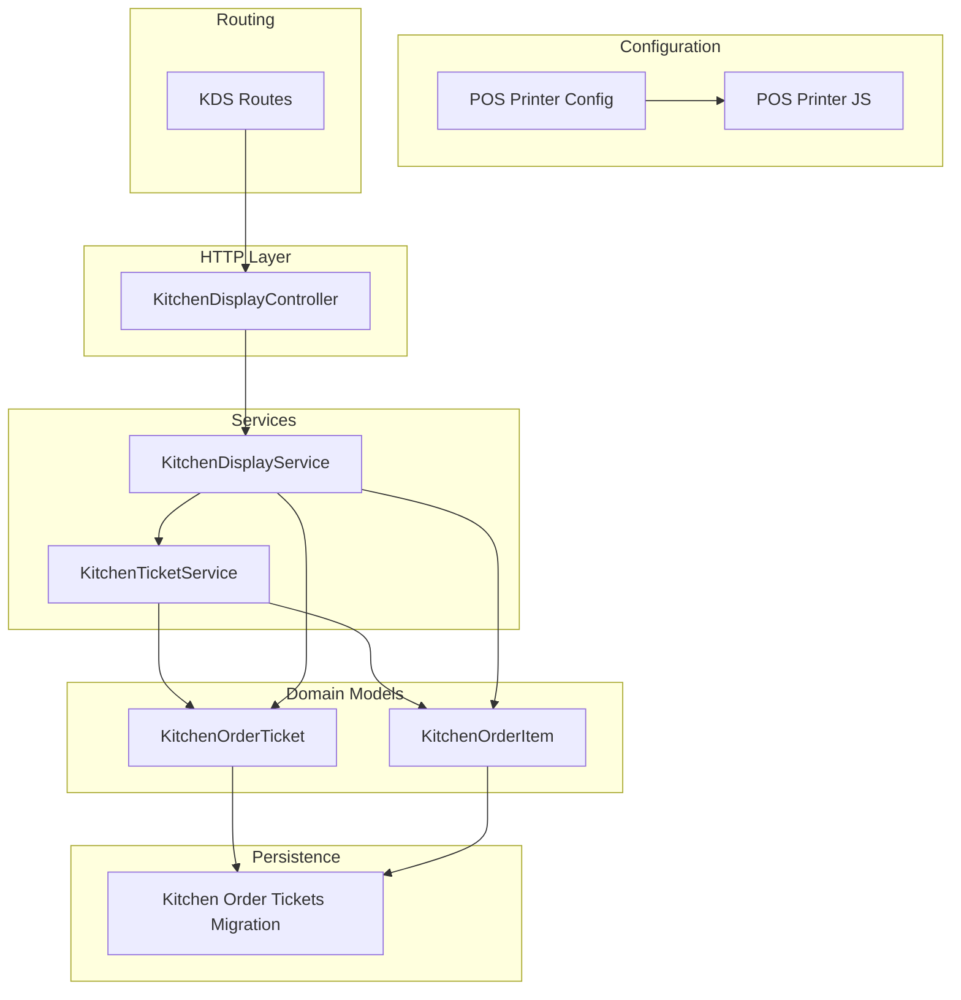
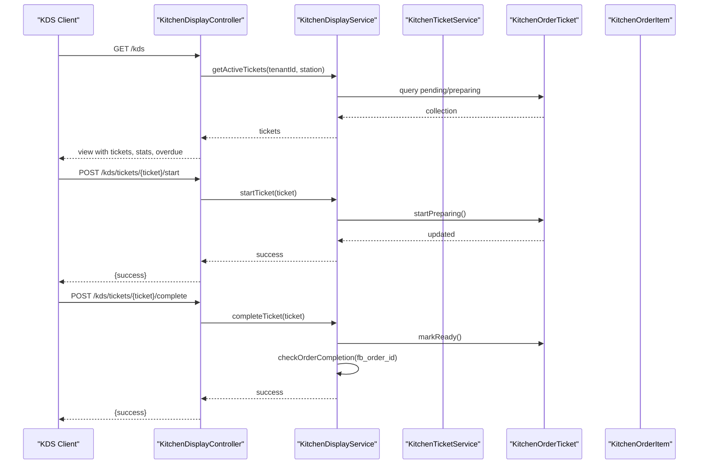
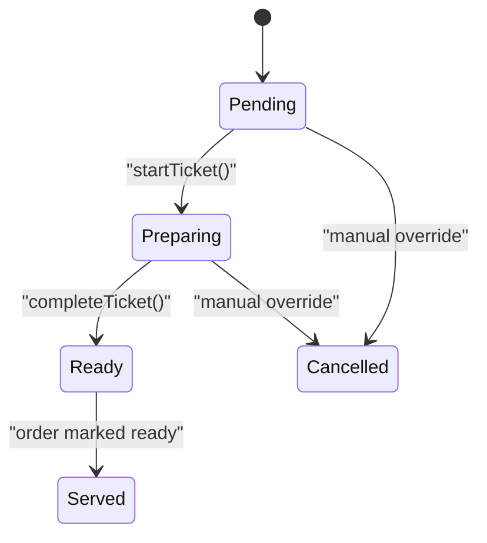
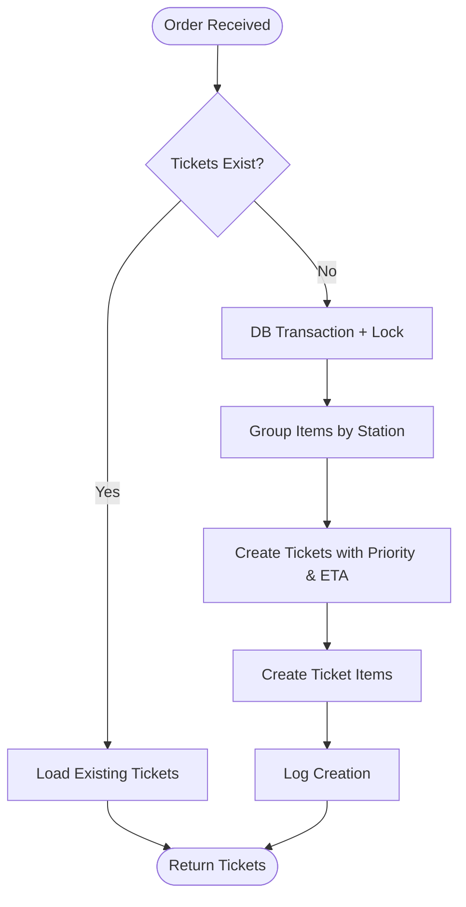
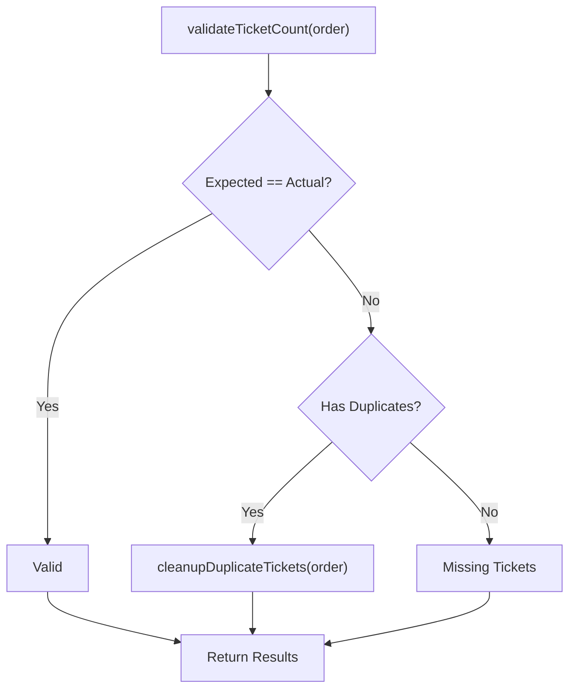
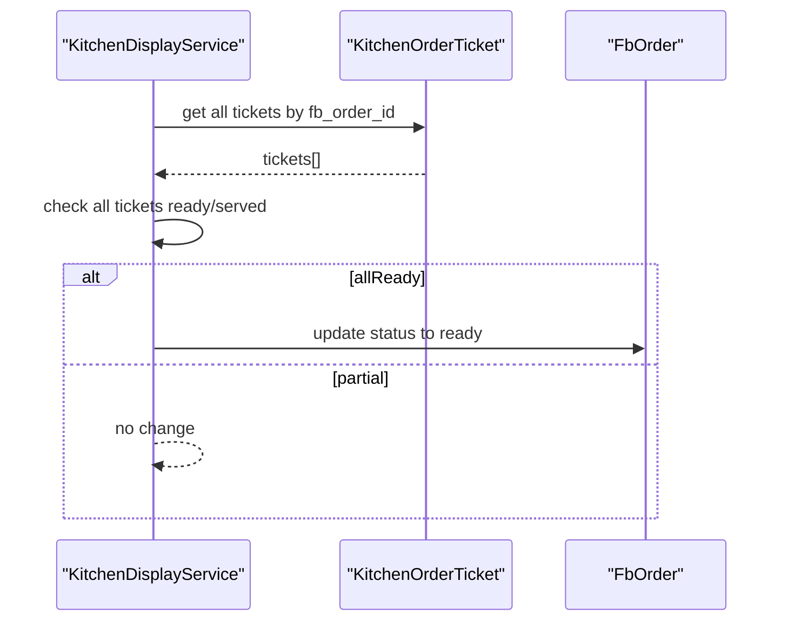
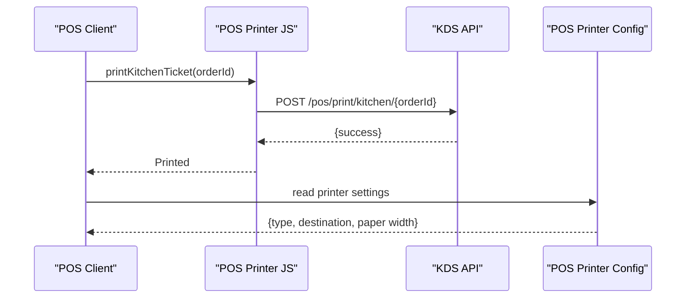
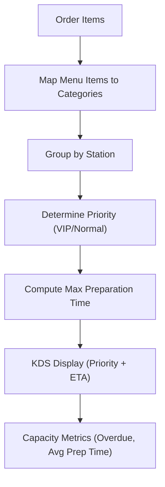
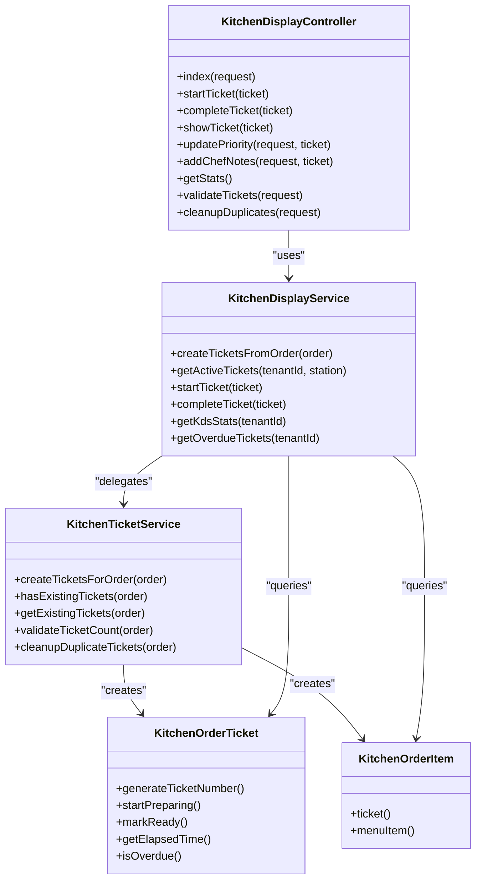

# Kitchen Operations & Display Systems

<cite>
**Referenced Files in This Document**
- [KitchenDisplayController.php](file://app/Http/Controllers/Fnb/KitchenDisplayController.php)
- [KitchenDisplayService.php](file://app/Services/KitchenDisplayService.php)
- [KitchenTicketService.php](file://app/Services/KitchenTicketService.php)
- [KitchenOrderTicket.php](file://app/Models/KitchenOrderTicket.php)
- [KitchenOrderItem.php](file://app/Models/KitchenOrderItem.php)
- [pos_printer.php](file://config/pos_printer.php)
- [pos-printer.js](file://resources/js/pos-printer.js)
- [web.php](file://routes/web.php)
- [2026_04_06_041721_create_kitchen_order_tickets_table.php](file://database/migrations/2026_04_06_041721_create_kitchen_order_tickets_table.php)
</cite>

## Table of Contents
1. [Introduction](#introduction)
2. [Project Structure](#project-structure)
3. [Core Components](#core-components)
4. [Architecture Overview](#architecture-overview)
5. [Detailed Component Analysis](#detailed-component-analysis)
6. [Dependency Analysis](#dependency-analysis)
7. [Performance Considerations](#performance-considerations)
8. [Troubleshooting Guide](#troubleshooting-guide)
9. [Conclusion](#conclusion)

## Introduction
This document describes the Kitchen Operations & Display Systems (KDS) within the qalcuityERP platform. It covers the kitchen display system functionality, order ticket management, real-time kitchen workflow coordination, and staff communication mechanisms. The system integrates with the Front of Business (F&B) POS pipeline to create, track, and fulfill kitchen order tickets across multiple stations (grill, fry, salad, dessert, bar). It also documents printer management for kitchen tickets and configurations for POS printers, along with order status tracking, capacity management, and workflow optimization strategies.

## Project Structure
The KDS implementation spans controllers, services, models, configuration, and frontend JavaScript for POS printing. The routing exposes endpoints for KDS operations, while migrations define the persistence model for kitchen tickets.

**Diagram sources**
- [KitchenDisplayController.php:10-165](file://app/Http/Controllers/Fnb/KitchenDisplayController.php#L10-L165)
- [KitchenDisplayService.php:10-172](file://app/Services/KitchenDisplayService.php#L10-L172)
- [KitchenTicketService.php:22-265](file://app/Services/KitchenTicketService.php#L22-L265)
- [KitchenOrderTicket.php:14-110](file://app/Models/KitchenOrderTicket.php#L14-L110)
- [KitchenOrderItem.php:10-48](file://app/Models/KitchenOrderItem.php#L10-L48)
- [2026_04_06_041721_create_kitchen_order_tickets_table.php:14-17](file://database/migrations/2026_04_06_041721_create_kitchen_order_tickets_table.php#L14-L17)
- [pos_printer.php:1-82](file://config/pos_printer.php#L1-L82)
- [pos-printer.js:356-367](file://resources/js/pos-printer.js#L356-L367)
- [web.php:2277-2290](file://routes/web.php#L2277-L2290)

**Section sources**
- [KitchenDisplayController.php:10-165](file://app/Http/Controllers/Fnb/KitchenDisplayController.php#L10-L165)
- [KitchenDisplayService.php:10-172](file://app/Services/KitchenDisplayService.php#L10-L172)
- [KitchenTicketService.php:22-265](file://app/Services/KitchenTicketService.php#L22-L265)
- [KitchenOrderTicket.php:14-110](file://app/Models/KitchenOrderTicket.php#L14-L110)
- [KitchenOrderItem.php:10-48](file://app/Models/KitchenOrderItem.php#L10-L48)
- [pos_printer.php:1-82](file://config/pos_printer.php#L1-L82)
- [pos-printer.js:356-367](file://resources/js/pos-printer.js#L356-L367)
- [web.php:2277-2290](file://routes/web.php#L2277-L2290)
- [2026_04_06_041721_create_kitchen_order_tickets_table.php:14-17](file://database/migrations/2026_04_06_041721_create_kitchen_order_tickets_table.php#L14-L17)

## Core Components
- KitchenDisplayController: Exposes KDS endpoints for displaying active tickets, starting/completing tickets, updating priority, adding chef notes, retrieving statistics, and validating/cleaning up duplicate tickets.
- KitchenDisplayService: Orchestrates KDS operations including ticket retrieval, status transitions, overdue detection, statistics computation, and order completion checks.
- KitchenTicketService: Provides idempotent creation of kitchen tickets from orders, grouping by kitchen station, priority determination, estimated time calculation, and duplicate validation/cleanup.
- KitchenOrderTicket: Domain model representing a kitchen ticket with lifecycle fields (status, timestamps), priority, station assignment, and helper methods for timing and overdue checks.
- KitchenOrderItem: Domain model representing individual items within a kitchen ticket, including modifiers and completion tracking.
- POS Printer Configuration: Centralized configuration for receipt and kitchen printer settings, including types, destinations, paper widths, and queue behavior.
- POS Printer JavaScript: Client-side integration for printing kitchen tickets and managing printer connections and queues.

**Section sources**
- [KitchenDisplayController.php:10-165](file://app/Http/Controllers/Fnb/KitchenDisplayController.php#L10-L165)
- [KitchenDisplayService.php:10-172](file://app/Services/KitchenDisplayService.php#L10-L172)
- [KitchenTicketService.php:22-265](file://app/Services/KitchenTicketService.php#L22-L265)
- [KitchenOrderTicket.php:14-110](file://app/Models/KitchenOrderTicket.php#L14-L110)
- [KitchenOrderItem.php:10-48](file://app/Models/KitchenOrderItem.php#L10-L48)
- [pos_printer.php:1-82](file://config/pos_printer.php#L1-L82)
- [pos-printer.js:356-367](file://resources/js/pos-printer.js#L356-L367)

## Architecture Overview
The KDS architecture follows a layered design:
- HTTP layer handles requests and delegates to services.
- Services encapsulate business logic for ticket creation, status transitions, and reporting.
- Models represent domain entities with persistence and helper methods.
- Configuration and client-side JavaScript integrate with physical and virtual printers.

**Diagram sources**
- [KitchenDisplayController.php:22-100](file://app/Http/Controllers/Fnb/KitchenDisplayController.php#L22-L100)
- [KitchenDisplayService.php:25-57](file://app/Services/KitchenDisplayService.php#L25-L57)
- [KitchenOrderTicket.php:67-84](file://app/Models/KitchenOrderTicket.php#L67-L84)

**Section sources**
- [KitchenDisplayController.php:22-100](file://app/Http/Controllers/Fnb/KitchenDisplayController.php#L22-L100)
- [KitchenDisplayService.php:25-57](file://app/Services/KitchenDisplayService.php#L25-L57)
- [KitchenOrderTicket.php:67-84](file://app/Models/KitchenOrderTicket.php#L67-L84)

## Detailed Component Analysis

### Kitchen Order Ticket Lifecycle
The ticket lifecycle includes creation, assignment to stations, preparation, readiness, and completion. Priority and estimated time influence display and workflow sequencing.

**Diagram sources**
- [KitchenOrderTicket.php:22-84](file://app/Models/KitchenOrderTicket.php#L22-L84)
- [KitchenDisplayService.php:51-57](file://app/Services/KitchenDisplayService.php#L51-L57)

**Section sources**
- [KitchenOrderTicket.php:22-84](file://app/Models/KitchenOrderTicket.php#L22-L84)
- [KitchenDisplayService.php:51-57](file://app/Services/KitchenDisplayService.php#L51-L57)

### Ticket Creation and Station Grouping
Kitchen tickets are created idempotently from an order, grouped by menu item categories (stations), with priority and estimated time computed from menu item preparation durations.

**Diagram sources**
- [KitchenTicketService.php:32-93](file://app/Services/KitchenTicketService.php#L32-L93)
- [KitchenDisplayService.php:103-141](file://app/Services/KitchenDisplayService.php#L103-L141)

**Section sources**
- [KitchenTicketService.php:32-93](file://app/Services/KitchenTicketService.php#L32-L93)
- [KitchenDisplayService.php:103-141](file://app/Services/KitchenDisplayService.php#L103-L141)

### Duplicate Prevention and Cleanup
The system prevents duplicate tickets during retries and provides validation and cleanup routines to maintain data integrity.

**Diagram sources**
- [KitchenTicketService.php:125-205](file://app/Services/KitchenTicketService.php#L125-L205)

**Section sources**
- [KitchenTicketService.php:125-205](file://app/Services/KitchenTicketService.php#L125-L205)

### Order Completion Workflow
When all tickets for an order reach ready/served status, the order itself is marked ready.

**Diagram sources**
- [KitchenDisplayService.php:162-171](file://app/Services/KitchenDisplayService.php#L162-L171)

**Section sources**
- [KitchenDisplayService.php:162-171](file://app/Services/KitchenDisplayService.php#L162-L171)

### Printer Management and Kitchen Ticket Printing
The POS printer configuration supports separate kitchen printers, and the frontend JavaScript provides methods to print kitchen tickets via API.

**Diagram sources**
- [pos-printer.js:356-367](file://resources/js/pos-printer.js#L356-L367)
- [pos_printer.php:54-60](file://config/pos_printer.php#L54-L60)

**Section sources**
- [pos-printer.js:356-367](file://resources/js/pos-printer.js#L356-L367)
- [pos_printer.php:54-60](file://config/pos_printer.php#L54-L60)

### Staff Assignments, Prioritization, and Capacity Management
- Station assignment: Derived from menu item categories, ensuring items are routed to appropriate kitchen workstations.
- Priority: VIP designation for high-value or VIP orders influences display and preparation sequencing.
- Capacity management: Overdue detection and average preparation time metrics enable capacity monitoring and optimization.

**Diagram sources**
- [KitchenDisplayService.php:103-141](file://app/Services/KitchenDisplayService.php#L103-L141)
- [KitchenDisplayService.php:62-86](file://app/Services/KitchenDisplayService.php#L62-L86)

**Section sources**
- [KitchenDisplayService.php:103-141](file://app/Services/KitchenDisplayService.php#L103-L141)
- [KitchenDisplayService.php:62-86](file://app/Services/KitchenDisplayService.php#L62-L86)

## Dependency Analysis
The KDS components exhibit clear separation of concerns with explicit dependencies:

**Diagram sources**
- [KitchenDisplayController.php:10-165](file://app/Http/Controllers/Fnb/KitchenDisplayController.php#L10-L165)
- [KitchenDisplayService.php:10-172](file://app/Services/KitchenDisplayService.php#L10-L172)
- [KitchenTicketService.php:22-265](file://app/Services/KitchenTicketService.php#L22-L265)
- [KitchenOrderTicket.php:14-110](file://app/Models/KitchenOrderTicket.php#L14-L110)
- [KitchenOrderItem.php:10-48](file://app/Models/KitchenOrderItem.php#L10-L48)

**Section sources**
- [KitchenDisplayController.php:10-165](file://app/Http/Controllers/Fnb/KitchenDisplayController.php#L10-L165)
- [KitchenDisplayService.php:10-172](file://app/Services/KitchenDisplayService.php#L10-L172)
- [KitchenTicketService.php:22-265](file://app/Services/KitchenTicketService.php#L22-L265)
- [KitchenOrderTicket.php:14-110](file://app/Models/KitchenOrderTicket.php#L14-L110)
- [KitchenOrderItem.php:10-48](file://app/Models/KitchenOrderItem.php#L10-L48)

## Performance Considerations
- Idempotent creation: Database transactions and double-checked existence prevent duplicate tickets under concurrency.
- Efficient queries: Selective filtering by status and station, with eager loading of related guest and menu items.
- Computed metrics: Statistics leverage database aggregation to minimize application-side computation.
- Printer throughput: Separate kitchen printer configuration enables dedicated hardware for high-volume kitchen printing.

[No sources needed since this section provides general guidance]

## Troubleshooting Guide
Common operational issues and resolutions:
- Duplicate tickets: Use the validation endpoint to detect discrepancies and the cleanup endpoint to remove duplicates, keeping only the first ticket per station.
- Ticket not appearing: Verify station filters and status conditions; ensure menu items have valid categories mapped to stations.
- Overdue tickets: Monitor overdue statistics and adjust preparation times or staffing to reduce delays.
- Printer connectivity: Confirm POS printer configuration settings and use the test printer functionality to validate connectivity.

**Section sources**
- [KitchenDisplayController.php:39-76](file://app/Http/Controllers/Fnb/KitchenDisplayController.php#L39-L76)
- [KitchenDisplayService.php:91-98](file://app/Services/KitchenDisplayService.php#L91-L98)
- [pos-printer.js:389-404](file://resources/js/pos-printer.js#L389-L404)

## Conclusion
The Kitchen Operations & Display Systems provide a robust, idempotent, and scalable solution for managing kitchen workflows. By separating concerns across controllers, services, and models, the system ensures reliable ticket creation, accurate status tracking, and efficient communication between POS and kitchen printers. The integration of priority, station grouping, overdue detection, and capacity metrics supports optimized kitchen operations and improved staff coordination.