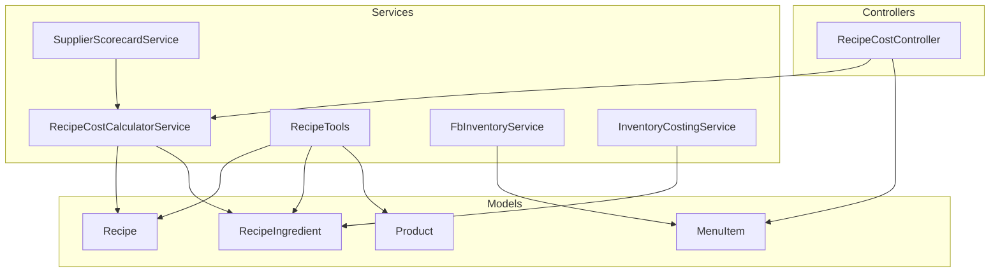
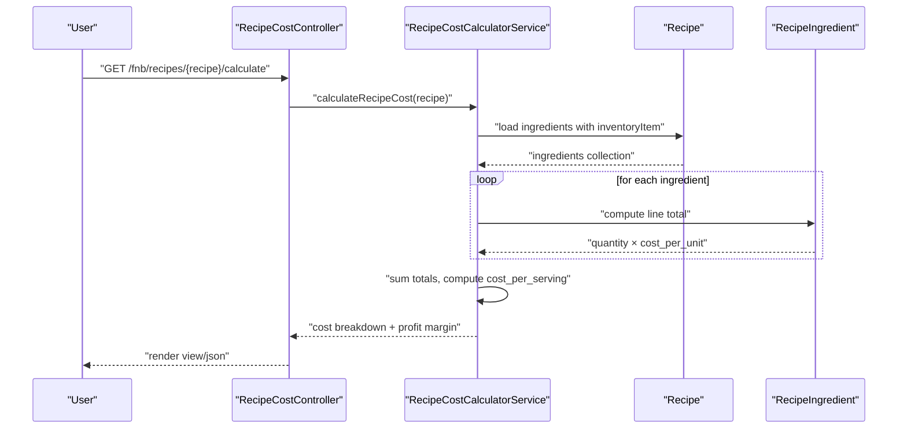
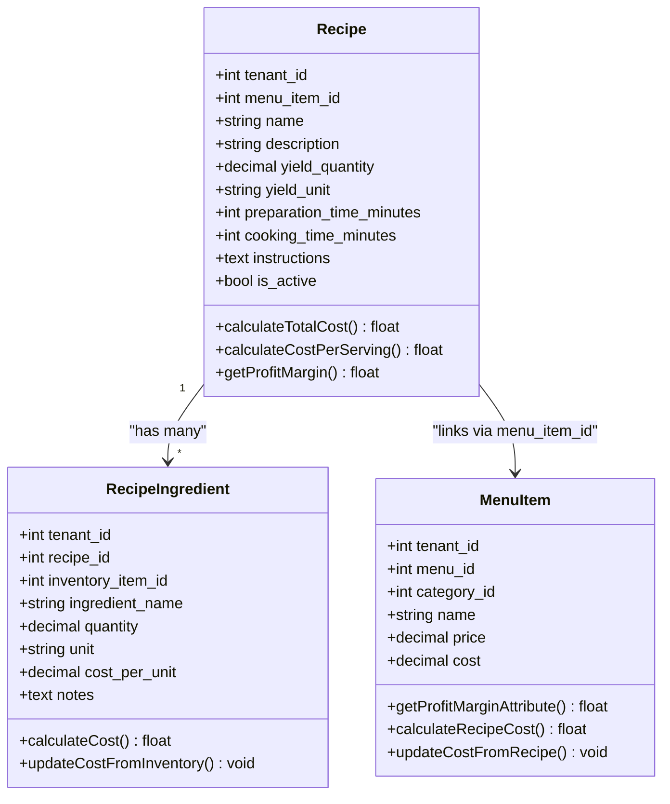
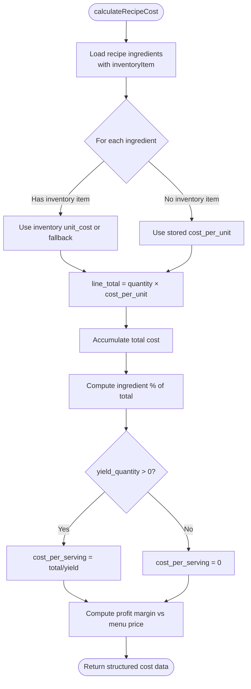
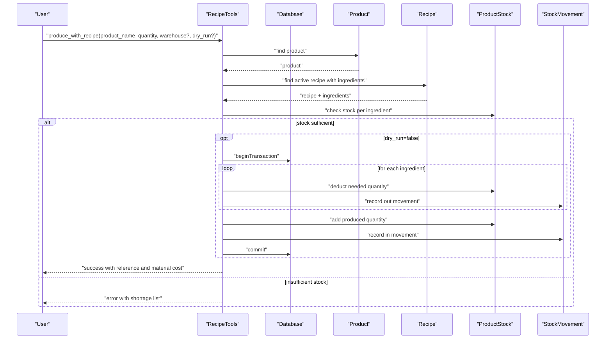
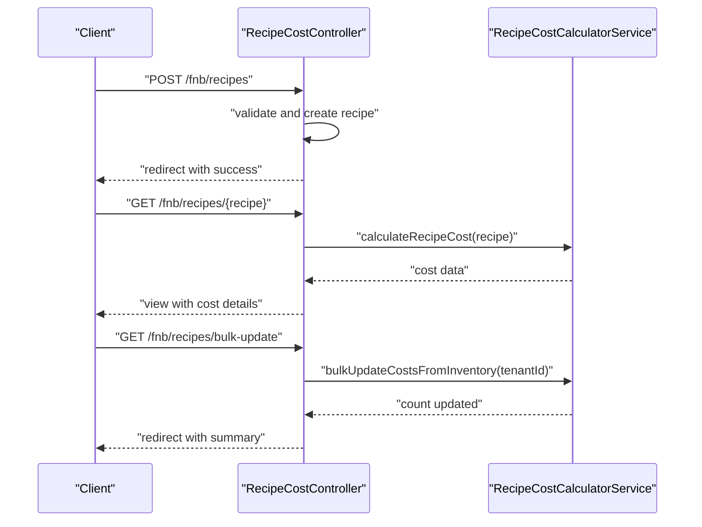
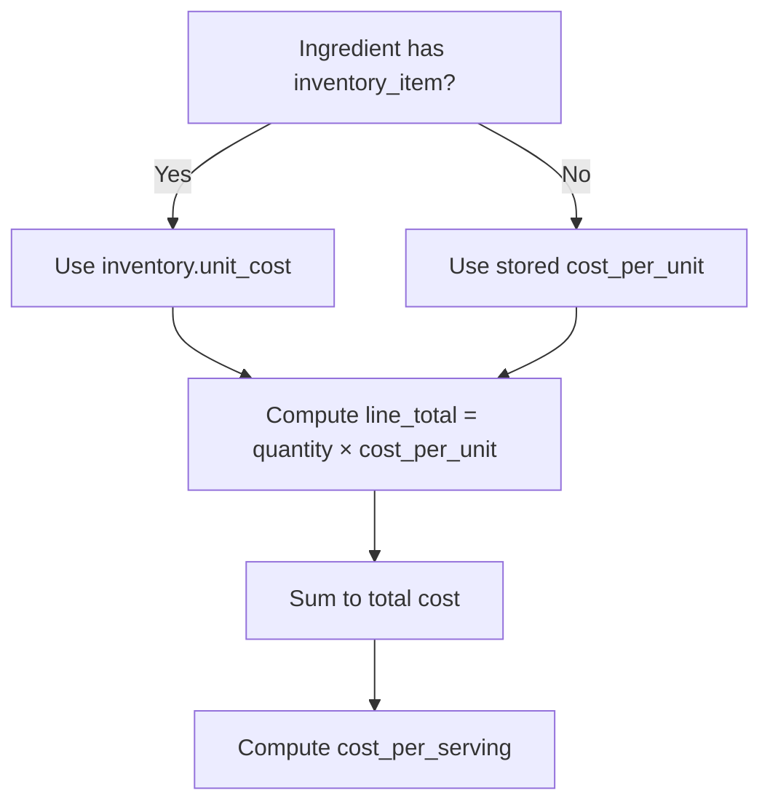
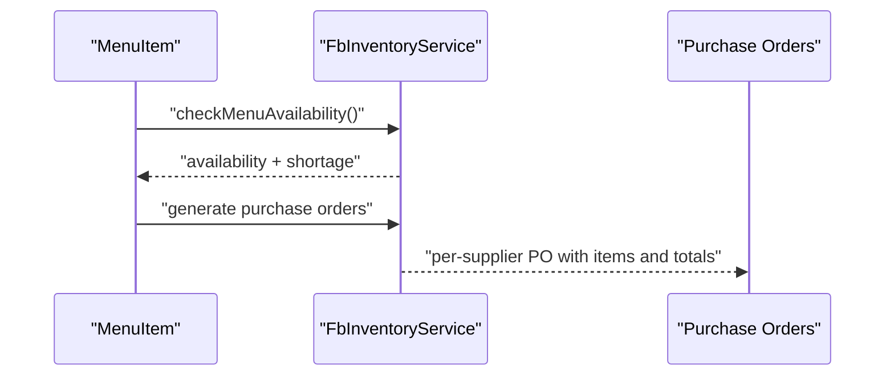
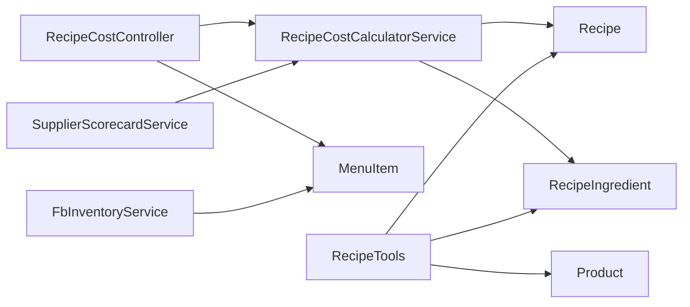

# Recipe Management & Cost Calculation

<cite>
**Referenced Files in This Document**
- [Recipe.php](file://app/Models/Recipe.php)
- [RecipeIngredient.php](file://app/Models/RecipeIngredient.php)
- [RecipeCostCalculatorService.php](file://app/Services/RecipeCostCalculatorService.php)
- [RecipeCostController.php](file://app/Http/Controllers/Fnb/RecipeCostController.php)
- [RecipeTools.php](file://app/Services/ERP/RecipeTools.php)
- [MenuItem.php](file://app/Models/MenuItem.php)
- [Product.php](file://app/Models/Product.php)
- [FbInventoryService.php](file://app/Services/FbInventoryService.php)
- [InventoryCostingService.php](file://app/Services/InventoryCostingService.php)
- [SupplierScorecardService.php](file://app/Services/SupplierScorecardService.php)
- [2026_04_06_041803_update_recipe_ingredients_table_for_fnb.php](file://database/migrations/2026_04_06_041803_update_recipe_ingredients_table_for_fnb.php)
</cite>

## Table of Contents
1. [Introduction](#introduction)
2. [Project Structure](#project-structure)
3. [Core Components](#core-components)
4. [Architecture Overview](#architecture-overview)
5. [Detailed Component Analysis](#detailed-component-analysis)
6. [Dependency Analysis](#dependency-analysis)
7. [Performance Considerations](#performance-considerations)
8. [Troubleshooting Guide](#troubleshooting-guide)
9. [Conclusion](#conclusion)
10. [Appendices](#appendices)

## Introduction
This document explains the Recipe Management & Cost Calculation subsystem within the ERP. It covers recipe creation, ingredient tracking, real-time cost calculation, scaling and yield management, profit margin computation, and integration points with inventory and supplier systems. It also outlines reporting capabilities for low-margin recipes, bulk cost updates, and operational workflows for menu-driven food and beverage operations.

## Project Structure
The recipe and cost calculation features span models, services, controllers, and supporting services:

- Models define domain entities: Recipe, RecipeIngredient, MenuItem, Product.
- Services encapsulate cost calculation, production orchestration, inventory costing, and supplier analytics.
- Controllers expose CRUD and reporting endpoints for recipes and cost analysis.
- Migrations evolve recipe ingredient schema to align with inventory item linkage.

**Diagram sources**
- [RecipeCostController.php:11-195](file://app/Http/Controllers/Fnb/RecipeCostController.php#L11-L195)
- [RecipeCostCalculatorService.php:8-178](file://app/Services/RecipeCostCalculatorService.php#L8-L178)
- [RecipeTools.php:13-482](file://app/Services/ERP/RecipeTools.php#L13-L482)
- [Recipe.php:14-89](file://app/Models/Recipe.php#L14-L89)
- [RecipeIngredient.php:13-70](file://app/Models/RecipeIngredient.php#L13-L70)
- [MenuItem.php:13-198](file://app/Models/MenuItem.php#L13-L198)
- [Product.php:12-71](file://app/Models/Product.php#L12-L71)
- [FbInventoryService.php:110-147](file://app/Services/FbInventoryService.php#L110-L147)
- [InventoryCostingService.php](file://app/Services/InventoryCostingService.php)
- [SupplierScorecardService.php:103-139](file://app/Services/SupplierScorecardService.php#L103-L139)

**Section sources**
- [RecipeCostController.php:11-195](file://app/Http/Controllers/Fnb/RecipeCostController.php#L11-L195)
- [RecipeCostCalculatorService.php:8-178](file://app/Services/RecipeCostCalculatorService.php#L8-L178)
- [RecipeTools.php:13-482](file://app/Services/ERP/RecipeTools.php#L13-L482)
- [Recipe.php:14-89](file://app/Models/Recipe.php#L14-L89)
- [RecipeIngredient.php:13-70](file://app/Models/RecipeIngredient.php#L13-L70)
- [MenuItem.php:13-198](file://app/Models/MenuItem.php#L13-L198)
- [Product.php:12-71](file://app/Models/Product.php#L12-L71)
- [FbInventoryService.php:110-147](file://app/Services/FbInventoryService.php#L110-L147)
- [InventoryCostingService.php](file://app/Services/InventoryCostingService.php)
- [SupplierScorecardService.php:103-139](file://app/Services/SupplierScorecardService.php#L103-L139)

## Core Components
- Recipe model: Stores recipe metadata, yields, and computes total and per-serving costs and profit margins.
- RecipeIngredient model: Tracks ingredient quantities, units, and cost per unit, with helpers to update cost from inventory.
- RecipeCostCalculatorService: Real-time cost calculation, profit margin computation, low-margin recipe reporting, and bulk inventory cost updates.
- RecipeCostController: Web and API endpoints for recipe cost calculation, ingredient CRUD, bulk updates, and reports.
- RecipeTools: Production orchestration using recipes, stock checks, and atomic material movements.
- MenuItem: Menu item cost and margin computation, recipe-based cost updates, and availability checks.
- Product: Inventory product entity used by RecipeTools for production runs.
- FbInventoryService: Inventory-based purchase order generation and menu availability checks.
- InventoryCostingService: Shared inventory costing utilities.
- SupplierScorecardService: Supplier performance metrics used for strategic sourcing and price competitiveness.

**Section sources**
- [Recipe.php:14-89](file://app/Models/Recipe.php#L14-L89)
- [RecipeIngredient.php:13-70](file://app/Models/RecipeIngredient.php#L13-L70)
- [RecipeCostCalculatorService.php:8-178](file://app/Services/RecipeCostCalculatorService.php#L8-L178)
- [RecipeCostController.php:11-195](file://app/Http/Controllers/Fnb/RecipeCostController.php#L11-L195)
- [RecipeTools.php:13-482](file://app/Services/ERP/RecipeTools.php#L13-L482)
- [MenuItem.php:13-198](file://app/Models/MenuItem.php#L13-L198)
- [Product.php:12-71](file://app/Models/Product.php#L12-L71)
- [FbInventoryService.php:110-147](file://app/Services/FbInventoryService.php#L110-L147)
- [InventoryCostingService.php](file://app/Services/InventoryCostingService.php)
- [SupplierScorecardService.php:103-139](file://app/Services/SupplierScorecardService.php#L103-L139)

## Architecture Overview
The system follows a layered architecture:
- Presentation: Controllers expose endpoints for recipe cost calculation, ingredient management, and reporting.
- Application: Services encapsulate business logic for cost calculation, production, inventory costing, and supplier analytics.
- Domain: Models represent recipes, ingredients, menu items, and products with computed attributes.
- Integration: Services integrate with inventory and supplier modules for real-time cost updates and procurement insights.

**Diagram sources**
- [RecipeCostController.php:40-59](file://app/Http/Controllers/Fnb/RecipeCostController.php#L40-L59)
- [RecipeCostCalculatorService.php:13-63](file://app/Services/RecipeCostCalculatorService.php#L13-L63)
- [Recipe.php:50-53](file://app/Models/Recipe.php#L50-L53)
- [RecipeIngredient.php:50-56](file://app/Models/RecipeIngredient.php#L50-L56)

## Detailed Component Analysis

### Recipe and Ingredient Models
- Recipe aggregates ingredient costs and computes total and per-serving cost, and profit margin against menu item price.
- RecipeIngredient stores quantity, unit, and cost per unit, and can update cost from linked inventory item.

**Diagram sources**
- [Recipe.php:14-89](file://app/Models/Recipe.php#L14-L89)
- [RecipeIngredient.php:13-70](file://app/Models/RecipeIngredient.php#L13-L70)
- [MenuItem.php:13-198](file://app/Models/MenuItem.php#L13-L198)

**Section sources**
- [Recipe.php:55-89](file://app/Models/Recipe.php#L55-L89)
- [RecipeIngredient.php:50-68](file://app/Models/RecipeIngredient.php#L50-L68)
- [MenuItem.php:81-151](file://app/Models/MenuItem.php#L81-L151)

### Cost Calculation Service
- Computes ingredient line totals, updates from current inventory prices, and derives total and per-serving cost.
- Calculates profit margin and profitability flags based on menu item price.
- Provides low-margin recipe filtering and bulk cost updates from inventory.

**Diagram sources**
- [RecipeCostCalculatorService.php:13-91](file://app/Services/RecipeCostCalculatorService.php#L13-L91)

**Section sources**
- [RecipeCostCalculatorService.php:13-91](file://app/Services/RecipeCostCalculatorService.php#L13-L91)

### Recipe Tools (Production Orchestration)
- Creates recipes and replaces previous active versions while preserving history.
- Retrieves recipe cost breakdown and computes HPP per unit and margin.
- Produces finished goods by deducting raw materials atomically and recording stock movements.

**Diagram sources**
- [RecipeTools.php:305-480](file://app/Services/ERP/RecipeTools.php#L305-L480)

**Section sources**
- [RecipeTools.php:103-203](file://app/Services/ERP/RecipeTools.php#L103-L203)
- [RecipeTools.php:248-303](file://app/Services/ERP/RecipeTools.php#L248-L303)
- [RecipeTools.php:305-480](file://app/Services/ERP/RecipeTools.php#L305-L480)

### Controller Layer
- Provides index, calculate, API calculate, store, update, add/update/delete ingredient, bulk update costs, and low-margin report endpoints.
- Enforces tenant scoping and authorization checks.

**Diagram sources**
- [RecipeCostController.php:40-195](file://app/Http/Controllers/Fnb/RecipeCostController.php#L40-L195)
- [RecipeCostCalculatorService.php:162-176](file://app/Services/RecipeCostCalculatorService.php#L162-L176)

**Section sources**
- [RecipeCostController.php:23-195](file://app/Http/Controllers/Fnb/RecipeCostController.php#L23-L195)

### Ingredient Substitution Strategies and Supplier Cost Tracking
- Ingredient cost updates from inventory: RecipeIngredient supports updating cost per unit from current inventory item cost.
- Bulk synchronization: RecipeCostCalculatorService bulk updates ingredient costs from inventory in chunks.
- Supplier scorecards: SupplierScorecardService computes delivery performance and cost metrics to inform supplier selection and price competitiveness.

**Diagram sources**
- [RecipeIngredient.php:61-68](file://app/Models/RecipeIngredient.php#L61-L68)
- [RecipeCostCalculatorService.php:20-29](file://app/Services/RecipeCostCalculatorService.php#L20-L29)
- [RecipeCostCalculatorService.php:162-176](file://app/Services/RecipeCostCalculatorService.php#L162-L176)

**Section sources**
- [RecipeIngredient.php:61-68](file://app/Models/RecipeIngredient.php#L61-L68)
- [RecipeCostCalculatorService.php:162-176](file://app/Services/RecipeCostCalculatorService.php#L162-L176)
- [SupplierScorecardService.php:103-139](file://app/Services/SupplierScorecardService.php#L103-L139)

### Price Elasticity and Menu Engineering
- Price elasticity job exists in the codebase, indicating potential future integration for menu engineering analysis and demand sensitivity modeling.
- Current recipe cost service focuses on cost composition and margin; elasticity calculations would complement menu pricing strategies.

**Section sources**
- [RecipeCostCalculatorService.php:96-107](file://app/Services/RecipeCostCalculatorService.php#L96-L107)

### Recipe Versioning, Approval, and Standardization
- RecipeTools replaces active recipes while preserving history, enabling version-like behavior.
- Approval fields exist in cosmetic formula models (for context), but recipe approval workflows are not implemented in the F&B recipe stack; standardization can be managed via naming conventions and batch sizing.

**Section sources**
- [RecipeTools.php:153-202](file://app/Services/ERP/RecipeTools.php#L153-L202)
- [2026_04_06_041803_update_recipe_ingredients_table_for_fnb.php:27-58](file://database/migrations/2026_04_06_041803_update_recipe_ingredients_table_for_fnb.php#L27-L58)

### Integration with Inventory and Supplier Ordering
- FbInventoryService generates purchase orders based on low-stock items and estimated costs, integrating recipe-based consumption with supplier ordering.
- InventoryCostingService provides shared inventory costing utilities leveraged by cost calculators.

**Diagram sources**
- [MenuItem.php:174-196](file://app/Models/MenuItem.php#L174-L196)
- [FbInventoryService.php:110-147](file://app/Services/FbInventoryService.php#L110-L147)

**Section sources**
- [MenuItem.php:174-196](file://app/Models/MenuItem.php#L174-L196)
- [FbInventoryService.php:110-147](file://app/Services/FbInventoryService.php#L110-L147)
- [InventoryCostingService.php](file://app/Services/InventoryCostingService.php)

## Dependency Analysis
- Controllers depend on RecipeCostCalculatorService for cost computations and on MenuItem for menu-linked cost updates.
- RecipeCostCalculatorService depends on Recipe and RecipeIngredient models and optionally on inventory items for cost updates.
- RecipeTools orchestrates production and depends on Product, Recipe, ProductStock, and StockMovement.
- FbInventoryService integrates with MenuItem availability and supply chain data.
- SupplierScorecardService informs sourcing decisions used in procurement planning.

**Diagram sources**
- [RecipeCostController.php:13-18](file://app/Http/Controllers/Fnb/RecipeCostController.php#L13-L18)
- [RecipeCostCalculatorService.php:5-6](file://app/Services/RecipeCostCalculatorService.php#L5-L6)
- [RecipeTools.php:5-11](file://app/Services/ERP/RecipeTools.php#L5-L11)
- [FbInventoryService.php:110-147](file://app/Services/FbInventoryService.php#L110-L147)
- [SupplierScorecardService.php:103-139](file://app/Services/SupplierScorecardService.php#L103-L139)

**Section sources**
- [RecipeCostController.php:13-18](file://app/Http/Controllers/Fnb/RecipeCostController.php#L13-L18)
- [RecipeCostCalculatorService.php:5-6](file://app/Services/RecipeCostCalculatorService.php#L5-L6)
- [RecipeTools.php:5-11](file://app/Services/ERP/RecipeTools.php#L5-L11)
- [FbInventoryService.php:110-147](file://app/Services/FbInventoryService.php#L110-L147)
- [SupplierScorecardService.php:103-139](file://app/Services/SupplierScorecardService.php#L103-L139)

## Performance Considerations
- Use chunked bulk updates for large ingredient sets to avoid memory pressure during bulk cost synchronization.
- Leverage eager loading of related inventory items to minimize N+1 queries in cost calculations.
- Cache frequently accessed menu item prices and inventory unit costs to reduce repeated lookups.
- Consider indexing tenant_id and recipe_id for RecipeIngredient to speed up bulk operations.

## Troubleshooting Guide
- Unauthorized access: Controllers enforce tenant-scoped access; verify tenant_id matches the authenticated user’s tenant.
- Zero yield errors: Cost per serving returns zero when yield_quantity is not positive; ensure yield is configured correctly.
- Missing inventory cost: If inventory item cost is unavailable, fallback cost_per_unit is used; reconcile inventory pricing.
- Insufficient stock for production: RecipeTools validates stock pre-production; address shortages before running production.

**Section sources**
- [RecipeCostController.php:188-194](file://app/Http/Controllers/Fnb/RecipeCostController.php#L188-L194)
- [Recipe.php:68-75](file://app/Models/Recipe.php#L68-L75)
- [RecipeIngredient.php:61-68](file://app/Models/RecipeIngredient.php#L61-L68)
- [RecipeTools.php:377-388](file://app/Services/ERP/RecipeTools.php#L377-L388)

## Conclusion
The Recipe Management & Cost Calculation subsystem provides robust real-time cost tracking, per-serving profitability, and production orchestration. It integrates with inventory and supplier systems to support informed procurement and menu engineering decisions. Extending historical cost tracking, formal recipe approval workflows, and price elasticity analysis would further strengthen the solution.

## Appendices

### API Endpoints Summary
- GET /fnb/recipes: List recipes and low-margin report
- GET /fnb/recipes/{recipe}: Render recipe cost details
- GET /fnb/recipes/{recipe}/calculate: JSON cost details
- POST /fnb/recipes: Create recipe
- PUT /fnb/recipes/{recipe}: Update recipe
- POST /fnb/recipes/{recipe}/ingredients: Add ingredient
- PUT /fnb/recipes/ingredients/{ingredient}: Update ingredient
- DELETE /fnb/recipes/ingredients/{ingredient}: Delete ingredient
- GET /fnb/recipes/bulk-update: Bulk update ingredient costs from inventory
- GET /fnb/recipes/reports/low-margin: Low-margin recipes report

**Section sources**
- [RecipeCostController.php:23-195](file://app/Http/Controllers/Fnb/RecipeCostController.php#L23-L195)