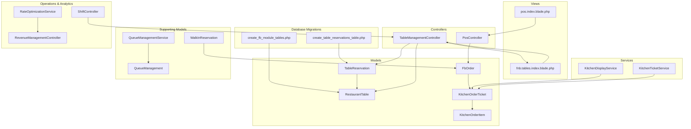
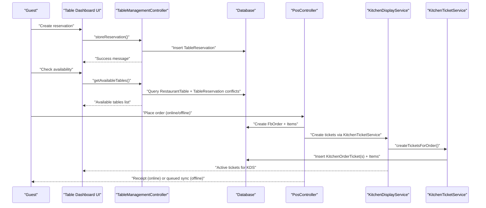
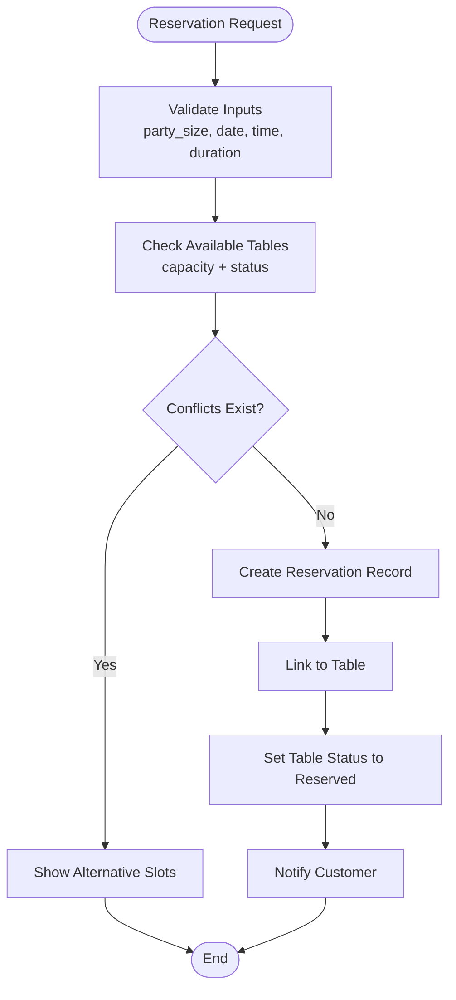
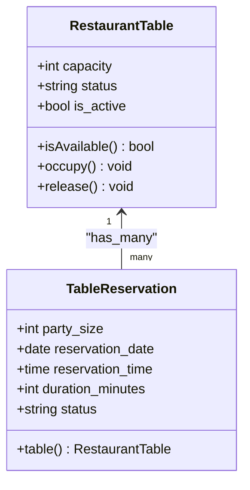
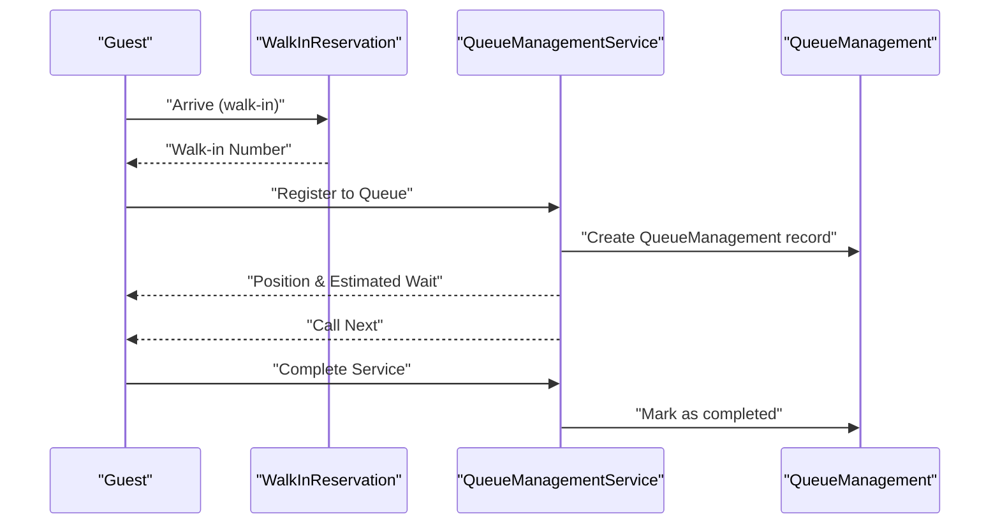
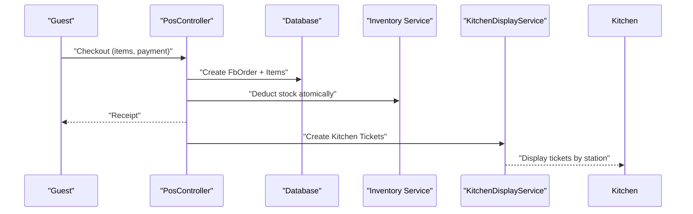
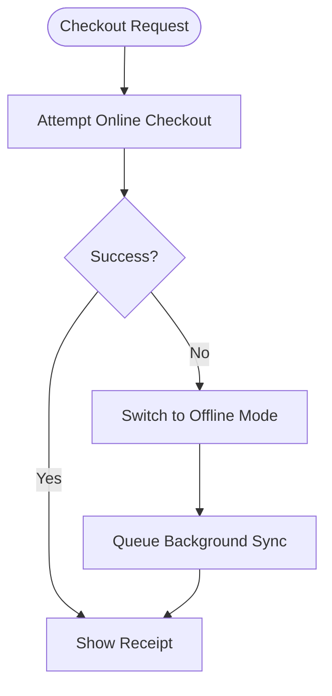
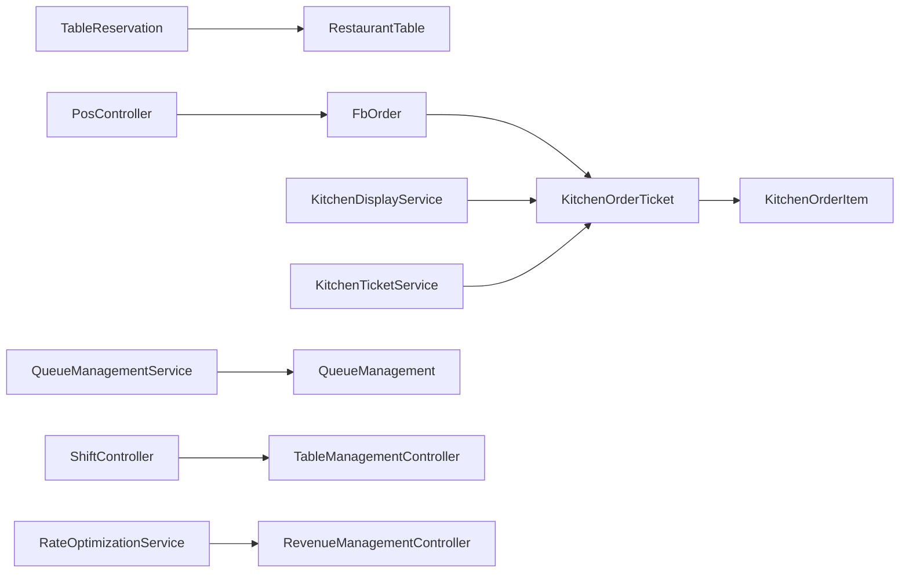

# Table Service & Reservation Management

<cite>
**Referenced Files in This Document**
- [2026_04_06_041714_create_table_reservations_table.php](file://database/migrations/2026_04_06_041714_create_table_reservations_table.php)
- [2026_04_03_400000_create_fb_module_tables.php](file://database/migrations/2026_04_03_400000_create_fb_module_tables.php)
- [TableReservation.php](file://app/Models/TableReservation.php)
- [RestaurantTable.php](file://app/Models/RestaurantTable.php)
- [TableManagementController.php](file://app/Http/Controllers/Fnb/TableManagementController.php)
- [index.blade.php](file://resources/views/fnb/tables/index.blade.php)
- [FbOrder.php](file://app/Models/FbOrder.php)
- [KitchenDisplayService.php](file://app/Services/KitchenDisplayService.php)
- [KitchenTicketService.php](file://app/Services/KitchenTicketService.php)
- [KitchenOrderTicket.php](file://app/Models/KitchenOrderTicket.php)
- [KitchenOrderItem.php](file://app/Models/KitchenOrderItem.php)
- [PosController.php](file://app/Http/Controllers/PosController.php)
- [offline-pos.js](file://resources/js/offline-pos.js)
- [index.blade.php](file://resources/views/pos/index.blade.php)
- [WalkInReservation.php](file://app/Models/WalkInReservation.php)
- [QueueManagement.php](file://app/Models/QueueManagement.php)
- [QueueManagementService.php](file://app/Services/QueueManagementService.php)
- [ShiftController.php](file://app/Http/Controllers/ShiftController.php)
- [RateOptimizationService.php](file://app/Services/RateOptimizationService.php)
- [RevenueManagementController.php](file://app/Http/Controllers/Hotel/RevenueManagementController.php)
</cite>

## Table of Contents
1. [Introduction](#introduction)
2. [Project Structure](#project-structure)
3. [Core Components](#core-components)
4. [Architecture Overview](#architecture-overview)
5. [Detailed Component Analysis](#detailed-component-analysis)
6. [Dependency Analysis](#dependency-analysis)
7. [Performance Considerations](#performance-considerations)
8. [Troubleshooting Guide](#troubleshooting-guide)
9. [Conclusion](#conclusion)

## Introduction
This document describes the Table Service & Reservation Management system within the qalcuityERP platform. It covers the end-to-end lifecycle of table reservations, seating arrangements, customer flow management, and service coordination. It also documents integration points with the Point of Sale (POS), Kitchen Display System (KDS), staff scheduling, and revenue optimization capabilities. The goal is to provide both operational clarity and technical insight for stakeholders managing restaurants, banquet spaces, or hospitality environments.

## Project Structure
The reservation and table service domain spans database migrations, Eloquent models, controller actions, frontend views, services for kitchen order processing, POS integration, walk-in and queue management, and revenue optimization.

**Diagram sources**
- [2026_04_06_041714_create_table_reservations_table.php:1-46](file://database/migrations/2026_04_06_041714_create_table_reservations_table.php#L1-L46)
- [2026_04_03_400000_create_fb_module_tables.php:203-227](file://database/migrations/2026_04_03_400000_create_fb_module_tables.php#L203-L227)
- [TableReservation.php:1-55](file://app/Models/TableReservation.php#L1-L55)
- [RestaurantTable.php:1-70](file://app/Models/RestaurantTable.php#L1-L70)
- [TableManagementController.php:1-172](file://app/Http/Controllers/Fnb/TableManagementController.php#L1-L172)
- [index.blade.php:1-29](file://resources/views/fnb/tables/index.blade.php#L1-L29)
- [FbOrder.php:1-183](file://app/Models/FbOrder.php#L1-L183)
- [KitchenDisplayService.php:1-52](file://app/Services/KitchenDisplayService.php#L1-L52)
- [KitchenTicketService.php:1-266](file://app/Services/KitchenTicketService.php#L1-L266)
- [KitchenOrderTicket.php:1-111](file://app/Models/KitchenOrderTicket.php#L1-L111)
- [KitchenOrderItem.php:1-49](file://app/Models/KitchenOrderItem.php#L1-L49)
- [PosController.php:1-372](file://app/Http/Controllers/PosController.php#L1-L372)
- [index.blade.php:805-834](file://resources/views/pos/index.blade.php#L805-L834)
- [WalkInReservation.php:1-98](file://app/Models/WalkInReservation.php#L1-L98)
- [QueueManagement.php:1-282](file://app/Models/QueueManagement.php#L1-L282)
- [QueueManagementService.php:1-450](file://app/Services/QueueManagementService.php#L1-L450)
- [ShiftController.php:1-130](file://app/Http/Controllers/ShiftController.php#L1-L130)
- [RateOptimizationService.php:1-332](file://app/Services/RateOptimizationService.php#L1-L332)
- [RevenueManagementController.php:473-512](file://app/Http/Controllers/Hotel/RevenueManagementController.php#L473-L512)

**Section sources**
- [2026_04_06_041714_create_table_reservations_table.php:1-46](file://database/migrations/2026_04_06_041714_create_table_reservations_table.php#L1-L46)
- [2026_04_03_400000_create_fb_module_tables.php:203-227](file://database/migrations/2026_04_03_400000_create_fb_module_tables.php#L203-L227)
- [TableReservation.php:1-55](file://app/Models/TableReservation.php#L1-L55)
- [RestaurantTable.php:1-70](file://app/Models/RestaurantTable.php#L1-L70)
- [TableManagementController.php:1-172](file://app/Http/Controllers/Fnb/TableManagementController.php#L1-L172)
- [index.blade.php:1-29](file://resources/views/fnb/tables/index.blade.php#L1-L29)
- [FbOrder.php:1-183](file://app/Models/FbOrder.php#L1-L183)
- [KitchenDisplayService.php:1-52](file://app/Services/KitchenDisplayService.php#L1-L52)
- [KitchenTicketService.php:1-266](file://app/Services/KitchenTicketService.php#L1-L266)
- [KitchenOrderTicket.php:1-111](file://app/Models/KitchenOrderTicket.php#L1-L111)
- [KitchenOrderItem.php:1-49](file://app/Models/KitchenOrderItem.php#L1-L49)
- [PosController.php:1-372](file://app/Http/Controllers/PosController.php#L1-L372)
- [index.blade.php:805-834](file://resources/views/pos/index.blade.php#L805-L834)
- [WalkInReservation.php:1-98](file://app/Models/WalkInReservation.php#L1-L98)
- [QueueManagement.php:1-282](file://app/Models/QueueManagement.php#L1-L282)
- [QueueManagementService.php:1-450](file://app/Services/QueueManagementService.php#L1-L450)
- [ShiftController.php:1-130](file://app/Http/Controllers/ShiftController.php#L1-L130)
- [RateOptimizationService.php:1-332](file://app/Services/RateOptimizationService.php#L1-L332)
- [RevenueManagementController.php:473-512](file://app/Http/Controllers/Hotel/RevenueManagementController.php#L473-L512)

## Core Components
- Table and Reservation Models: Define table capacity, location, status, and reservation lifecycle with customer details, party size, duration, and special requests.
- Table Management Controller: Provides dashboard stats, reservation creation, status updates, cancellations, and availability checks.
- Frontend Views: Table dashboard and POS interface supporting reservation-driven dining and offline-first checkout.
- Kitchen Order Processing: Ticket generation grouped by kitchen stations, idempotent creation, priority, and readiness tracking.
- POS Integration: Online and offline checkout with inventory deduction, receipts, and background synchronization.
- Walk-In and Queue Management: Dedicated walk-in numbering, queue registration, calling, serving, and analytics.
- Staff Scheduling: Weekly shift templates and assignments aligned to table and service demands.
- Revenue Optimization: Yield management, length-of-stay recommendations, and channel mix optimization.

**Section sources**
- [TableReservation.php:1-55](file://app/Models/TableReservation.php#L1-L55)
- [RestaurantTable.php:1-70](file://app/Models/RestaurantTable.php#L1-L70)
- [TableManagementController.php:1-172](file://app/Http/Controllers/Fnb/TableManagementController.php#L1-L172)
- [index.blade.php:1-29](file://resources/views/fnb/tables/index.blade.php#L1-L29)
- [KitchenTicketService.php:1-266](file://app/Services/KitchenTicketService.php#L1-L266)
- [KitchenDisplayService.php:1-52](file://app/Services/KitchenDisplayService.php#L1-L52)
- [PosController.php:1-372](file://app/Http/Controllers/PosController.php#L1-L372)
- [offline-pos.js:46-89](file://resources/js/offline-pos.js#L46-L89)
- [index.blade.php:805-834](file://resources/views/pos/index.blade.php#L805-L834)
- [WalkInReservation.php:1-98](file://app/Models/WalkInReservation.php#L1-L98)
- [QueueManagement.php:1-282](file://app/Models/QueueManagement.php#L1-L282)
- [QueueManagementService.php:1-450](file://app/Services/QueueManagementService.php#L1-L450)
- [ShiftController.php:1-130](file://app/Http/Controllers/ShiftController.php#L1-L130)
- [RateOptimizationService.php:1-332](file://app/Services/RateOptimizationService.php#L1-L332)

## Architecture Overview
The system integrates reservation, seating, order-taking, kitchen production, and POS settlement. It supports offline scenarios with background synchronization and provides queue and walk-in management for dynamic customer flow.

**Diagram sources**
- [TableManagementController.php:62-104](file://app/Http/Controllers/Fnb/TableManagementController.php#L62-L104)
- [TableManagementController.php:145-172](file://app/Http/Controllers/Fnb/TableManagementController.php#L145-L172)
- [PosController.php:42-174](file://app/Http/Controllers/PosController.php#L42-L174)
- [KitchenDisplayService.php:15-20](file://app/Services/KitchenDisplayService.php#L15-L20)
- [KitchenTicketService.php:32-93](file://app/Services/KitchenTicketService.php#L32-L93)

## Detailed Component Analysis

### Reservation Lifecycle and Availability
- Creation: Validates party size, date/time, duration, and optional deposit. Persists reservation and links to a table.
- Modification: Updates reservation status (confirmed, seated, completed, cancelled, no_show) and updates table status accordingly.
- Cancellation: Marks reservation as cancelled and releases the table.
- Availability: Filters active tables by capacity and availability, excluding overlapping reservations at the requested time/duration.

**Diagram sources**
- [TableManagementController.php:62-104](file://app/Http/Controllers/Fnb/TableManagementController.php#L62-L104)
- [TableManagementController.php:145-172](file://app/Http/Controllers/Fnb/TableManagementController.php#L145-L172)
- [TableReservation.php:17-32](file://app/Models/TableReservation.php#L17-L32)
- [RestaurantTable.php:49-68](file://app/Models/RestaurantTable.php#L49-L68)

**Section sources**
- [TableManagementController.php:62-140](file://app/Http/Controllers/Fnb/TableManagementController.php#L62-L140)
- [TableReservation.php:17-32](file://app/Models/TableReservation.php#L17-L32)
- [RestaurantTable.php:49-68](file://app/Models/RestaurantTable.php#L49-L68)

### Table Status Tracking and Capacity Management
- Table statuses: available, occupied, reserved, maintenance.
- Capacity enforcement: filter tables by minimum capacity and active status.
- Turnover optimization: occupancy/release helpers enable quick status transitions upon check-in/out.

**Diagram sources**
- [RestaurantTable.php:1-70](file://app/Models/RestaurantTable.php#L1-L70)
- [TableReservation.php:1-55](file://app/Models/TableReservation.php#L1-L55)

**Section sources**
- [RestaurantTable.php:49-68](file://app/Models/RestaurantTable.php#L49-L68)
- [TableReservation.php:24-27](file://app/Models/TableReservation.php#L24-L27)

### Waitlist Operations and Customer Flow
- Walk-in reservations: unique numbering, arrival tracking, and source attribution.
- Queue management: registration, calling, serving, completion, skipping, and analytics for wait times and performance.

**Diagram sources**
- [WalkInReservation.php:60-71](file://app/Models/WalkInReservation.php#L60-L71)
- [QueueManagementService.php:19-85](file://app/Services/QueueManagementService.php#L19-L85)
- [QueueManagement.php:225-255](file://app/Models/QueueManagement.php#L225-L255)

**Section sources**
- [WalkInReservation.php:58-96](file://app/Models/WalkInReservation.php#L58-L96)
- [QueueManagementService.php:87-166](file://app/Services/QueueManagementService.php#L87-L166)
- [QueueManagement.php:225-255](file://app/Models/QueueManagement.php#L225-L255)

### Menu Presentation, Order Taking, and Service Coordination
- Orders: generated with unique order numbers, totals computed, and status tracked through confirmation, preparation, readiness, and completion.
- Kitchen tickets: grouped by kitchen station, prioritized, and tracked for readiness and overdue alerts.
- POS integration: online checkout with immediate stock deduction; offline fallback with background sync.

**Diagram sources**
- [PosController.php:42-174](file://app/Http/Controllers/PosController.php#L42-L174)
- [FbOrder.php:98-125](file://app/Models/FbOrder.php#L98-L125)
- [KitchenDisplayService.php:15-20](file://app/Services/KitchenDisplayService.php#L15-L20)
- [KitchenTicketService.php:32-93](file://app/Services/KitchenTicketService.php#L32-L93)

**Section sources**
- [FbOrder.php:98-154](file://app/Models/FbOrder.php#L98-L154)
- [KitchenOrderTicket.php:57-97](file://app/Models/KitchenOrderTicket.php#L57-L97)
- [KitchenOrderItem.php:13-31](file://app/Models/KitchenOrderItem.php#L13-L31)
- [PosController.php:103-153](file://app/Http/Controllers/PosController.php#L103-L153)

### Offline POS and Background Sync
- Online checkout attempts; on failure, falls back to offline mode and registers a background sync job for later reconciliation.

**Diagram sources**
- [offline-pos.js:51-81](file://resources/js/offline-pos.js#L51-L81)
- [index.blade.php:818-834](file://resources/views/pos/index.blade.php#L818-L834)

**Section sources**
- [offline-pos.js:46-89](file://resources/js/offline-pos.js#L46-L89)
- [index.blade.php:805-834](file://resources/views/pos/index.blade.php#L805-L834)

### Staff Scheduling Alignment
- Weekly shift templates and assignments support coverage during peak hours and table turnover windows.

**Section sources**
- [ShiftController.php:17-130](file://app/Http/Controllers/ShiftController.php#L17-L130)

### Revenue Optimization and Peak Hour Management
- Yield optimization, length-of-stay recommendations, and channel mix optimization inform pricing and availability policies.
- These insights help align staffing, promotions, and table allocation during high/low demand periods.

**Section sources**
- [RateOptimizationService.php:285-320](file://app/Services/RateOptimizationService.php#L285-L320)
- [RevenueManagementController.php:473-512](file://app/Http/Controllers/Hotel/RevenueManagementController.php#L473-L512)

## Dependency Analysis
Key dependencies and relationships:
- TableReservation depends on RestaurantTable and encapsulates customer and reservation metadata.
- FbOrder coordinates with KitchenOrderTicket and KitchenOrderItem for kitchen production.
- KitchenTicketService ensures idempotent ticket creation and duplication cleanup.
- PosController orchestrates order creation and stock deduction, integrating with inventory services.
- QueueManagementService manages queue state transitions and analytics.
- ShiftController provides scheduling alignment for table and service operations.
- RateOptimizationService and RevenueManagementController guide pricing and availability decisions.

**Diagram sources**
- [TableReservation.php:46-55](file://app/Models/TableReservation.php#L46-L55)
- [RestaurantTable.php:41-44](file://app/Models/RestaurantTable.php#L41-L44)
- [FbOrder.php:85-93](file://app/Models/FbOrder.php#L85-L93)
- [KitchenOrderTicket.php:44-52](file://app/Models/KitchenOrderTicket.php#L44-L52)
- [KitchenOrderItem.php:39-47](file://app/Models/KitchenOrderItem.php#L39-L47)
- [KitchenDisplayService.php:25-38](file://app/Services/KitchenDisplayService.php#L25-L38)
- [KitchenTicketService.php:32-93](file://app/Services/KitchenTicketService.php#L32-L93)
- [PosController.php:75-156](file://app/Http/Controllers/PosController.php#L75-L156)
- [QueueManagementService.php:19-85](file://app/Services/QueueManagementService.php#L19-L85)
- [QueueManagement.php:225-255](file://app/Models/QueueManagement.php#L225-L255)
- [ShiftController.php:17-40](file://app/Http/Controllers/ShiftController.php#L17-L40)
- [RateOptimizationService.php:285-320](file://app/Services/RateOptimizationService.php#L285-L320)
- [RevenueManagementController.php:473-489](file://app/Http/Controllers/Hotel/RevenueManagementController.php#L473-L489)

**Section sources**
- [TableReservation.php:46-55](file://app/Models/TableReservation.php#L46-L55)
- [RestaurantTable.php:41-44](file://app/Models/RestaurantTable.php#L41-L44)
- [FbOrder.php:85-93](file://app/Models/FbOrder.php#L85-L93)
- [KitchenOrderTicket.php:44-52](file://app/Models/KitchenOrderTicket.php#L44-L52)
- [KitchenOrderItem.php:39-47](file://app/Models/KitchenOrderItem.php#L39-L47)
- [KitchenDisplayService.php:25-38](file://app/Services/KitchenDisplayService.php#L25-L38)
- [KitchenTicketService.php:32-93](file://app/Services/KitchenTicketService.php#L32-L93)
- [PosController.php:75-156](file://app/Http/Controllers/PosController.php#L75-L156)
- [QueueManagementService.php:19-85](file://app/Services/QueueManagementService.php#L19-L85)
- [QueueManagement.php:225-255](file://app/Models/QueueManagement.php#L225-L255)
- [ShiftController.php:17-40](file://app/Http/Controllers/ShiftController.php#L17-L40)
- [RateOptimizationService.php:285-320](file://app/Services/RateOptimizationService.php#L285-L320)
- [RevenueManagementController.php:473-489](file://app/Http/Controllers/Hotel/RevenueManagementController.php#L473-L489)

## Performance Considerations
- Concurrency and idempotency: KitchenTicketService uses transactions and idempotent creation to avoid duplicate tickets under retries.
- Atomic stock deduction: POS checkout locks stock rows and decrements atomically to prevent race conditions and negative stock.
- Indexing: Migrations define indexes on tenant-scoped fields, reservation date/time, and status to accelerate queries.
- Background sync: Offline POS falls back gracefully and schedules background sync to reconcile transactions when connectivity resumes.

[No sources needed since this section provides general guidance]

## Troubleshooting Guide
- Duplicate kitchen tickets: Use the ticket validation and cleanup routines to detect and remove duplicates.
- Stock errors during checkout: Verify available quantities and warehouse allocations; the POS controller throws explicit messages for insufficient stock.
- Reservation conflicts: Ensure the availability check filters by overlapping reservations and duration windows.
- Queue anomalies: Use queue analytics to identify bottlenecks and adjust service times or counters.

**Section sources**
- [KitchenTicketService.php:125-205](file://app/Services/KitchenTicketService.php#L125-L205)
- [PosController.php:115-137](file://app/Http/Controllers/PosController.php#L115-L137)
- [TableManagementController.php:164-172](file://app/Http/Controllers/Fnb/TableManagementController.php#L164-L172)
- [QueueManagementService.php:352-448](file://app/Services/QueueManagementService.php#L352-L448)

## Conclusion
The Table Service & Reservation Management system integrates robust reservation handling, table status tracking, customer flow management, and seamless order-to-kitchen-to-POS workflows. With offline-first checkout, queue and walk-in management, staff scheduling alignment, and revenue optimization capabilities, it supports efficient operations and enhanced customer experiences across peak and off-peak periods.