# Appointment Scheduling & Queue Management

<cite>
**Referenced Files in This Document**
- [Appointment.php](file://app/Models/Appointment.php)
- [QueueManagement.php](file://app/Models/QueueManagement.php)
- [QueueSetting.php](file://app/Models/QueueSetting.php)
- [OutpatientVisit.php](file://app/Models/OutpatientVisit.php)
- [AppointmentSchedulingService.php](file://app/Services/AppointmentSchedulingService.php)
- [QueueManagementService.php](file://app/Services/QueueManagementService.php)
- [QueueController.php](file://app/Http/Controllers/Healthcare/QueueController.php)
- [SendAppointmentReminders.php](file://app/Console/Commands/SendAppointmentReminders.php)
- [CalendarIntegrationService.php](file://app/Services/CalendarIntegrationService.php)
- [2026_04_08_400001_create_outpatient_queue_tables.php](file://database/migrations/2026_04_08_400001_create_outpatient_queue_tables.php)
</cite>

## Table of Contents
1. [Introduction](#introduction)
2. [Project Structure](#project-structure)
3. [Core Components](#core-components)
4. [Architecture Overview](#architecture-overview)
5. [Detailed Component Analysis](#detailed-component-analysis)
6. [Dependency Analysis](#dependency-analysis)
7. [Performance Considerations](#performance-considerations)
8. [Troubleshooting Guide](#troubleshooting-guide)
9. [Conclusion](#conclusion)

## Introduction
This document describes the appointment scheduling and queue management system implemented in the healthcare module. It covers end-to-end workflows for booking appointments with conflict detection, managing provider availability, allocating rooms and counters, and tracking patient wait times. It also documents queue management algorithms, automated reminders, rescheduling and cancellation procedures, calendar integrations, capacity management, and reporting capabilities. The system supports patient portal self-scheduling, provider dashboards, and administrative tools for queue optimization.

## Project Structure
The system is organized around:
- Models representing domain entities (Appointments, Outpatient Visits, Queue Management, Queue Settings)
- Services encapsulating business logic (Scheduling, Queue Management)
- Controllers exposing healthcare-specific endpoints
- Migrations defining the persistent schema
- Console commands for automated reminders
- Calendar integration service for external calendar synchronization

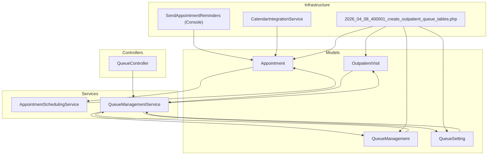

**Diagram sources**
- [2026_400001_create_outpatient_queue_tables.php:11-225](file://database/migrations/2026_04_08_400001_create_outpatient_queue_tables.php#L11-L225)
- [AppointmentSchedulingService.php:19-66](file://app/Services/AppointmentSchedulingService.php#L19-L66)
- [QueueManagementService.php:19-85](file://app/Services/QueueManagementService.php#L19-L85)
- [QueueController.php:15-45](file://app/Http/Controllers/Healthcare/QueueController.php#L15-L45)
- [SendAppointmentReminders.php:33-116](file://app/Console/Commands/SendAppointmentReminders.php#L33-L116)
- [CalendarIntegrationService.php:183-230](file://app/Services/CalendarIntegrationService.php#L183-L230)

**Section sources**
- [2026_04_08_400001_create_outpatient_queue_tables.php:11-225](file://database/migrations/2026_04_08_400001_create_outpatient_queue_tables.php#L11-L225)

## Core Components
- Appointment model: central entity for scheduling, status transitions, reminders, and analytics.
- OutpatientVisit model: tracks visit lifecycle, wait times, and consultation durations.
- QueueManagement model: manages queue position, priority, wait estimates, and status transitions.
- QueueSetting model: defines queue configuration, capacity limits, service time, and operating hours.
- AppointmentSchedulingService: handles booking, conflict detection, rescheduling, cancellation, and reminders.
- QueueManagementService: registers patients, calls next, serves, completes, recalculates positions, and generates analytics.
- QueueController: exposes endpoints for queue display, assignment, analytics, and status retrieval.
- CalendarIntegrationService: integrates with external calendars for appointment synchronization.
- SendAppointmentReminders: console command to send automated reminders.

**Section sources**
- [Appointment.php:13-57](file://app/Models/Appointment.php#L13-L57)
- [OutpatientVisit.php:13-53](file://app/Models/OutpatientVisit.php#L13-L53)
- [QueueManagement.php:13-46](file://app/Models/QueueManagement.php#L13-L46)
- [QueueSetting.php:12-40](file://app/Models/QueueSetting.php#L12-L40)
- [AppointmentSchedulingService.php:19-66](file://app/Services/AppointmentSchedulingService.php#L19-L66)
- [QueueManagementService.php:19-85](file://app/Services/QueueManagementService.php#L19-L85)
- [QueueController.php:15-45](file://app/Http/Controllers/Healthcare/QueueController.php#L15-L45)
- [CalendarIntegrationService.php:183-230](file://app/Services/CalendarIntegrationService.php#L183-L230)
- [SendAppointmentReminders.php:33-116](file://app/Console/Commands/SendAppointmentReminders.php#L33-L116)

## Architecture Overview
The system follows a layered architecture:
- Presentation: Controllers expose endpoints for queue management and analytics.
- Application: Services orchestrate business rules and transactions.
- Domain: Models define entities and their behaviors.
- Persistence: Migrations define normalized relational schema with appropriate indexes.
- Infrastructure: Console jobs and calendar service integrate external systems.

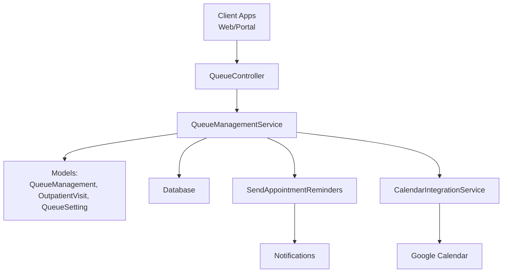

**Diagram sources**
- [QueueController.php:15-45](file://app/Http/Controllers/Healthcare/QueueController.php#L15-L45)
- [QueueManagementService.php:19-85](file://app/Services/QueueManagementService.php#L19-L85)
- [SendAppointmentReminders.php:33-116](file://app/Console/Commands/SendAppointmentReminders.php#L33-L116)
- [CalendarIntegrationService.php:183-230](file://app/Services/CalendarIntegrationService.php#L183-L230)

## Detailed Component Analysis

### Appointment Booking Workflow
The booking process validates provider availability, checks for conflicts, creates or retrieves schedule entries, persists the appointment, updates schedule slots, and sends notifications.

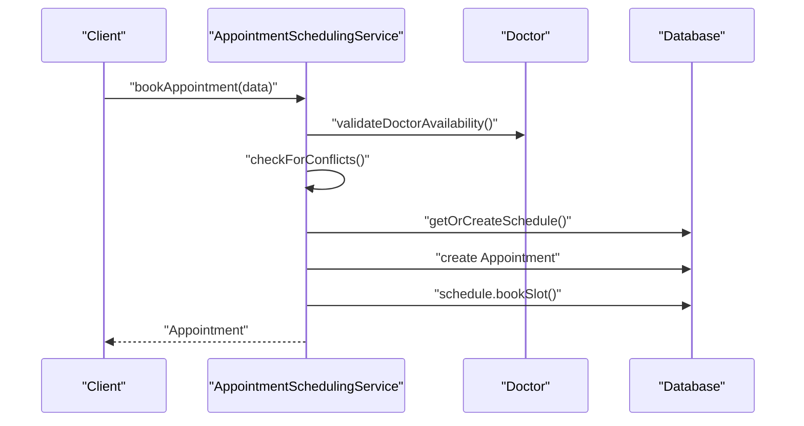

**Diagram sources**
- [AppointmentSchedulingService.php:19-66](file://app/Services/AppointmentSchedulingService.php#L19-L66)
- [AppointmentSchedulingService.php:71-105](file://app/Services/AppointmentSchedulingService.php#L71-L105)
- [AppointmentSchedulingService.php:110-145](file://app/Services/AppointmentSchedulingService.php#L110-L145)
- [AppointmentSchedulingService.php:150-174](file://app/Services/AppointmentSchedulingService.php#L150-L174)

**Section sources**
- [AppointmentSchedulingService.php:19-66](file://app/Services/AppointmentSchedulingService.php#L19-L66)
- [Appointment.php:307-324](file://app/Models/Appointment.php#L307-L324)

### Provider Availability Management
Availability is validated against provider status, practice days, and practice hours. The service ensures no past dates and respects configured working hours.

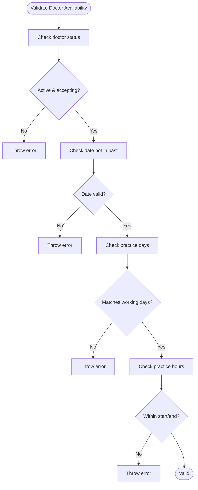

**Diagram sources**
- [AppointmentSchedulingService.php:71-105](file://app/Services/AppointmentSchedulingService.php#L71-L105)

**Section sources**
- [AppointmentSchedulingService.php:71-105](file://app/Services/AppointmentSchedulingService.php#L71-L105)

### Room Allocation and Capacity Management
Rooms and counters are managed via queue settings:
- Maximum daily queue per queue setting
- Service time per queue setting drives wait estimates
- Working days and hours control open/close status
- Indexes on queue settings enable efficient filtering

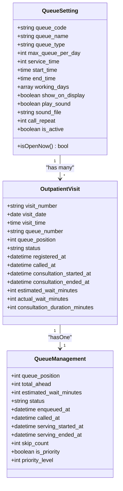

**Diagram sources**
- [QueueSetting.php:12-40](file://app/Models/QueueSetting.php#L12-L40)
- [OutpatientVisit.php:13-53](file://app/Models/OutpatientVisit.php#L13-L53)
- [QueueManagement.php:13-46](file://app/Models/QueueManagement.php#L13-L46)

**Section sources**
- [QueueSetting.php:53-64](file://app/Models/QueueSetting.php#L53-L64)
- [2026_04_08_400001_create_outpatient_queue_tables.php:21-51](file://database/migrations/2026_04_08_400001_create_outpatient_queue_tables.php#L21-L51)
- [2026_04_08_400001_create_outpatient_queue_tables.php:54-110](file://database/migrations/2026_04_08_400001_create_outpatient_queue_tables.php#L54-L110)
- [2026_04_08_400001_create_outpatient_queue_tables.php:113-155](file://database/migrations/2026_04_08_400001_create_outpatient_queue_tables.php#L113-L155)

### Patient Wait Tracking and Queue Algorithms
Queue positions are calculated daily, with priority and FIFO ordering. Estimated wait time equals ahead count multiplied by average service time. Positions are recalculated after service completion.

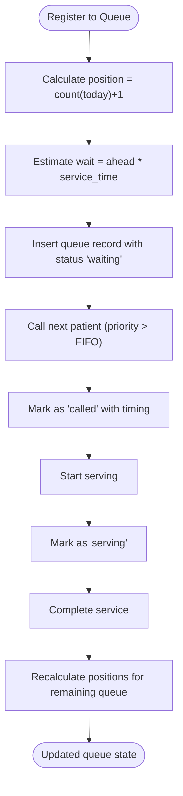

**Diagram sources**
- [QueueManagementService.php:19-85](file://app/Services/QueueManagementService.php#L19-L85)
- [QueueManagementService.php:90-166](file://app/Services/QueueManagementService.php#L90-L166)
- [QueueManagementService.php:317-347](file://app/Services/QueueManagementService.php#L317-L347)

**Section sources**
- [QueueManagementService.php:19-85](file://app/Services/QueueManagementService.php#L19-L85)
- [QueueManagementService.php:90-166](file://app/Services/QueueManagementService.php#L90-L166)
- [QueueManagementService.php:317-347](file://app/Services/QueueManagementService.php#L317-L347)

### Automated Reminders
Two mechanisms exist:
- Service-level reminder dispatch for upcoming appointments
- Console command for bulk reminders with dry-run support

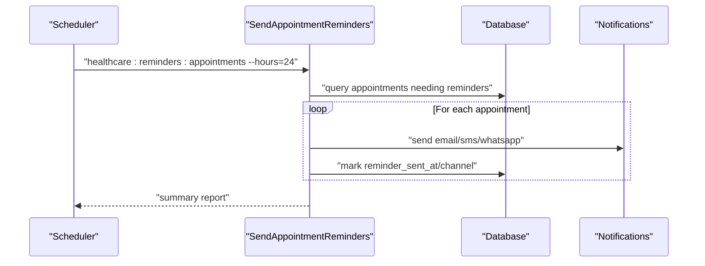

**Diagram sources**
- [SendAppointmentReminders.php:33-116](file://app/Console/Commands/SendAppointmentReminders.php#L33-L116)
- [AppointmentSchedulingService.php:349-370](file://app/Services/AppointmentSchedulingService.php#L349-L370)

**Section sources**
- [SendAppointmentReminders.php:33-116](file://app/Console/Commands/SendAppointmentReminders.php#L33-L116)
- [AppointmentSchedulingService.php:349-370](file://app/Services/AppointmentSchedulingService.php#L349-L370)

### Rescheduling and Cancellation Procedures
Rescheduling frees the old schedule slot, validates new time, checks conflicts, creates a new schedule entry, replicates the appointment, links old to new, and notifies. Cancellation marks the appointment and frees the schedule slot.

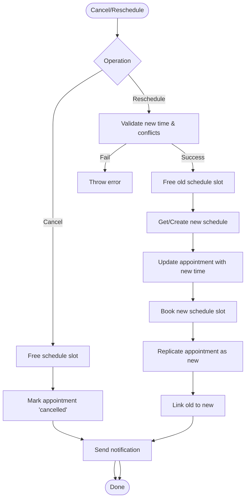

**Diagram sources**
- [AppointmentSchedulingService.php:179-197](file://app/Services/AppointmentSchedulingService.php#L179-L197)
- [AppointmentSchedulingService.php:202-257](file://app/Services/AppointmentSchedulingService.php#L202-L257)

**Section sources**
- [AppointmentSchedulingService.php:179-197](file://app/Services/AppointmentSchedulingService.php#L179-L197)
- [AppointmentSchedulingService.php:202-257](file://app/Services/AppointmentSchedulingService.php#L202-L257)

### Calendar Integration
Appointments can be synchronized to external calendars, including attendee lists and reminders. The service supports OAuth, event creation/update/delete, and retrieving upcoming events.

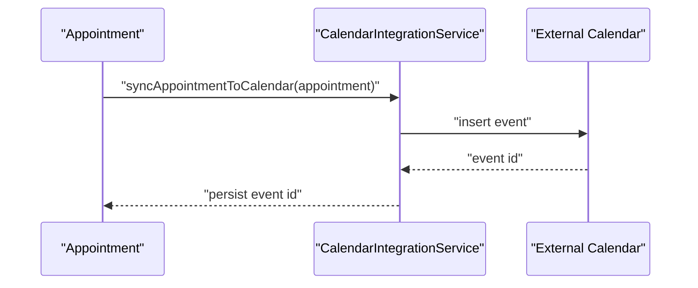

**Diagram sources**
- [CalendarIntegrationService.php:183-230](file://app/Services/CalendarIntegrationService.php#L183-L230)

**Section sources**
- [CalendarIntegrationService.php:183-230](file://app/Services/CalendarIntegrationService.php#L183-L230)

### Reporting and Analytics
Queue analytics include daily summaries, wait time distributions, and performance metrics. Monthly metrics compute no-show and cancellation rates, average wait/service times, and peak hours.

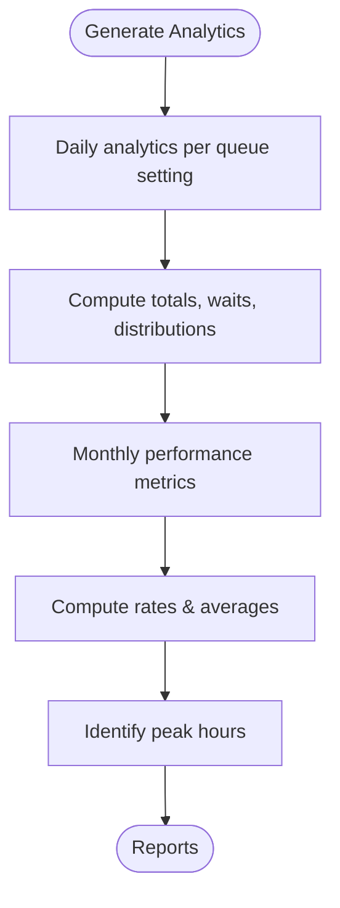

**Diagram sources**
- [QueueManagementService.php:352-389](file://app/Services/QueueManagementService.php#L352-L389)
- [QueueManagementService.php:394-428](file://app/Services/QueueManagementService.php#L394-L428)

**Section sources**
- [QueueManagementService.php:352-389](file://app/Services/QueueManagementService.php#L352-L389)
- [QueueManagementService.php:394-428](file://app/Services/QueueManagementService.php#L394-L428)

## Dependency Analysis
The following diagram shows key dependencies among components:

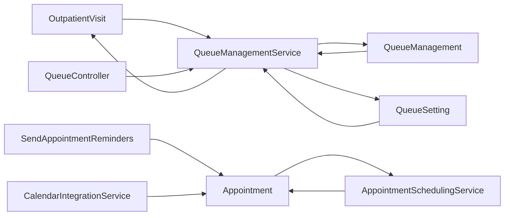

**Diagram sources**
- [Appointment.php:252-303](file://app/Models/Appointment.php#L252-L303)
- [OutpatientVisit.php:164-192](file://app/Models/OutpatientVisit.php#L164-L192)
- [QueueManagement.php:200-220](file://app/Models/QueueManagement.php#L200-L220)
- [QueueSetting.php:108-121](file://app/Models/QueueSetting.php#L108-L121)
- [QueueController.php:17-34](file://app/Http/Controllers/Healthcare/QueueController.php#L17-L34)
- [AppointmentSchedulingService.php:19-66](file://app/Services/AppointmentSchedulingService.php#L19-L66)
- [QueueManagementService.php:19-85](file://app/Services/QueueManagementService.php#L19-L85)
- [SendAppointmentReminders.php:33-116](file://app/Console/Commands/SendAppointmentReminders.php#L33-L116)
- [CalendarIntegrationService.php:183-230](file://app/Services/CalendarIntegrationService.php#L183-L230)

**Section sources**
- [Appointment.php:252-303](file://app/Models/Appointment.php#L252-L303)
- [OutpatientVisit.php:164-192](file://app/Models/OutpatientVisit.php#L164-L192)
- [QueueManagement.php:200-220](file://app/Models/QueueManagement.php#L200-L220)
- [QueueSetting.php:108-121](file://app/Models/QueueSetting.php#L108-L121)
- [QueueController.php:17-34](file://app/Http/Controllers/Healthcare/QueueController.php#L17-L34)
- [AppointmentSchedulingService.php:19-66](file://app/Services/AppointmentSchedulingService.php#L19-L66)
- [QueueManagementService.php:19-85](file://app/Services/QueueManagementService.php#L19-L85)
- [SendAppointmentReminders.php:33-116](file://app/Console/Commands/SendAppointmentReminders.php#L33-L116)
- [CalendarIntegrationService.php:183-230](file://app/Services/CalendarIntegrationService.php#L183-L230)

## Performance Considerations
- Use indexes on frequently queried columns (visit_number, patient_id, doctor_id, visit_date, queue_number, status).
- Batch operations for reminders and queue recalculations during off-peak hours.
- Monitor query plans for overlapping time-slot checks and queue position recalculation.
- Cache provider availability windows and queue settings where appropriate.
- Partition analytics tables by date for large-scale reporting.

## Troubleshooting Guide
Common issues and resolutions:
- Double booking conflicts: Verify conflict detection logic and ensure transaction boundaries wrap all validations and writes.
- Provider unavailability errors: Confirm practice days and hours configuration; ensure current time falls within allowed slots.
- Queue capacity exceeded: Check max_queue_per_day thresholds and adjust per queue setting.
- Reminders not sent: Validate console command execution, notification channels, and appointment reminder flags.
- Calendar sync failures: Verify OAuth tokens, scopes, and event payload formatting.

**Section sources**
- [AppointmentSchedulingService.php:110-145](file://app/Services/AppointmentSchedulingService.php#L110-L145)
- [QueueSetting.php:53-64](file://app/Models/QueueSetting.php#L53-L64)
- [SendAppointmentReminders.php:33-116](file://app/Console/Commands/SendAppointmentReminders.php#L33-L116)
- [CalendarIntegrationService.php:183-230](file://app/Services/CalendarIntegrationService.php#L183-L230)

## Conclusion
The appointment scheduling and queue management system provides robust workflows for booking, provider availability checks, room/capacity management, and patient wait tracking. It includes automated reminders, rescheduling/cancellation procedures, calendar integration, and comprehensive analytics. The modular design with services and controllers enables extensibility for patient portals, provider dashboards, and administrative queue optimization tools.