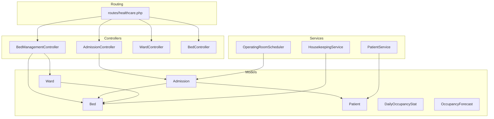
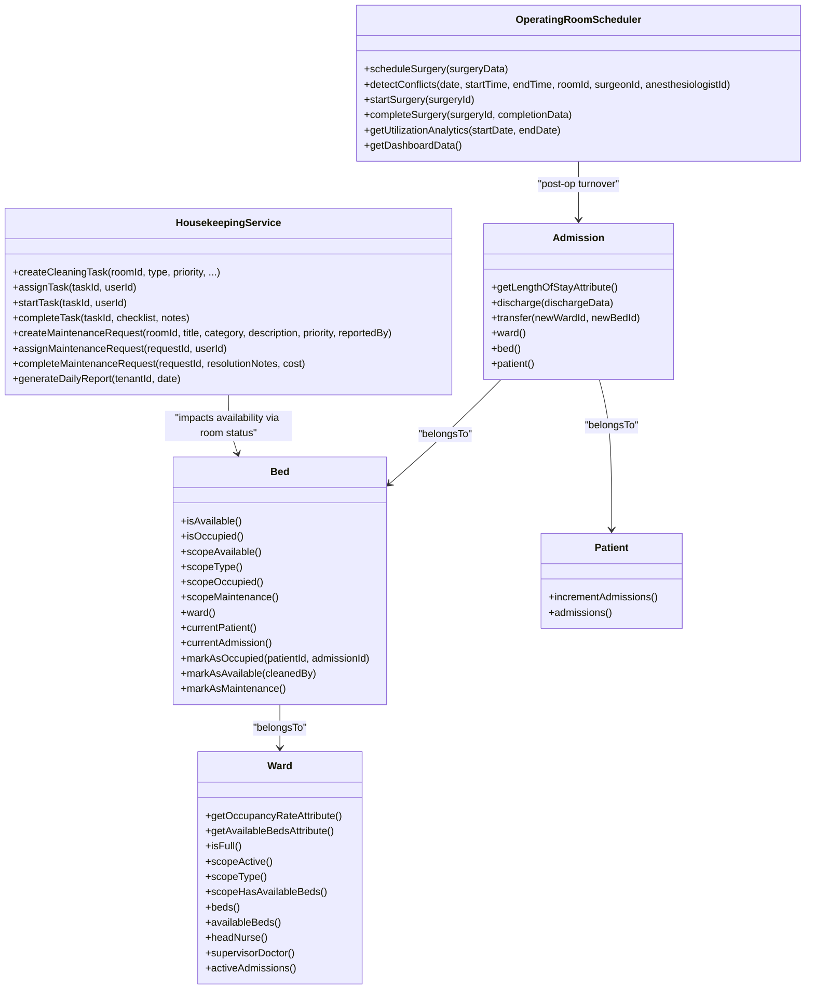
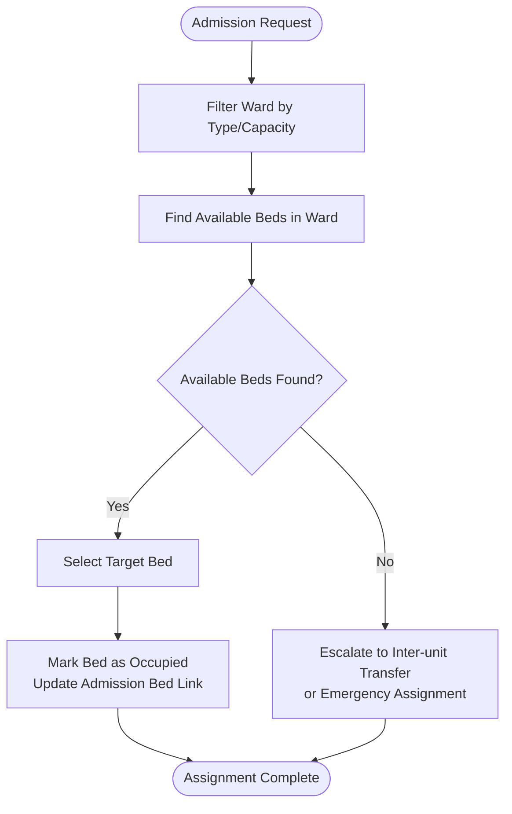
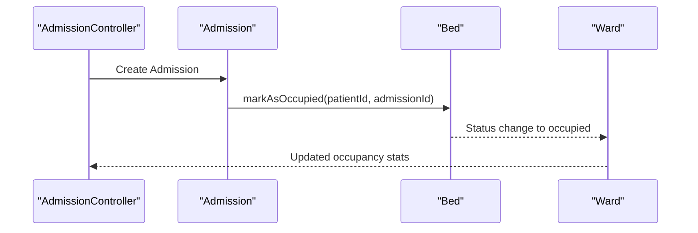
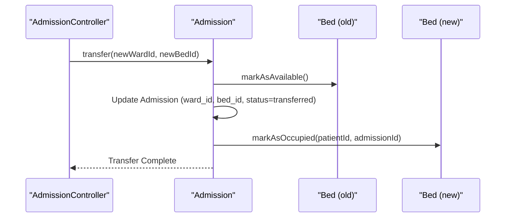
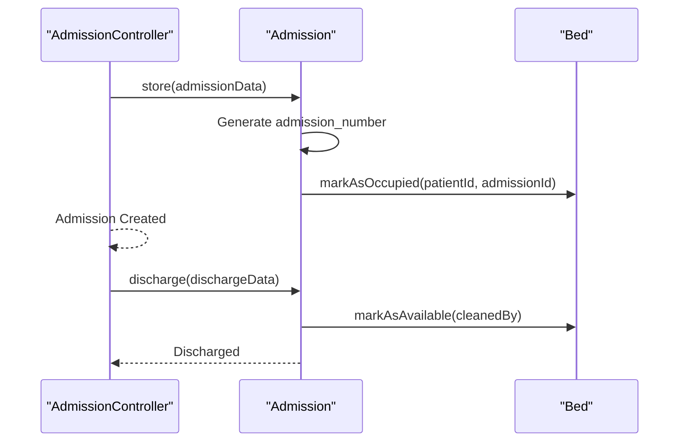
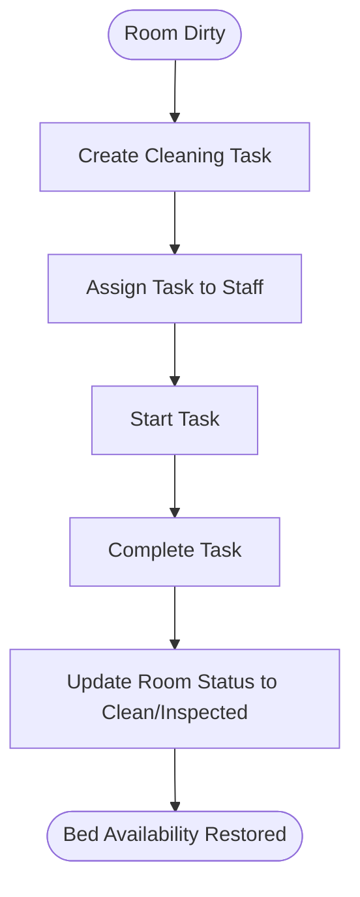
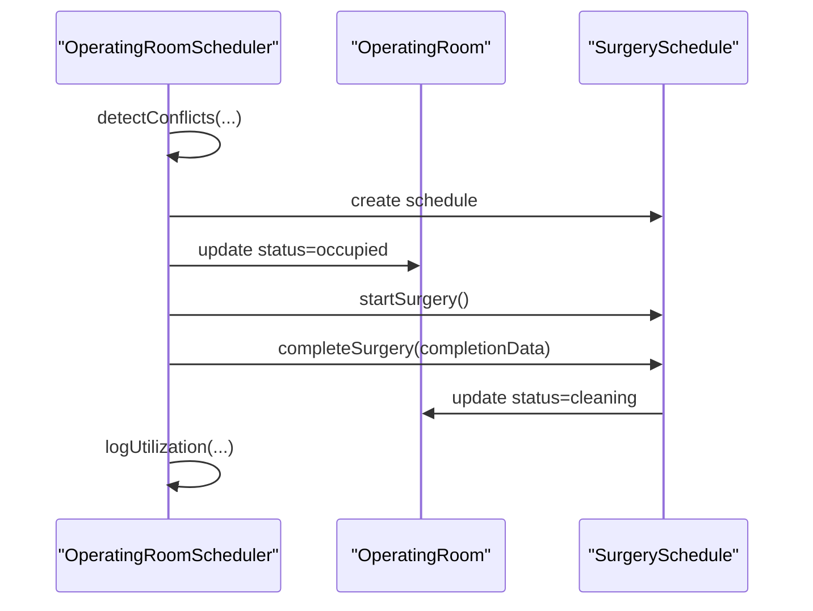
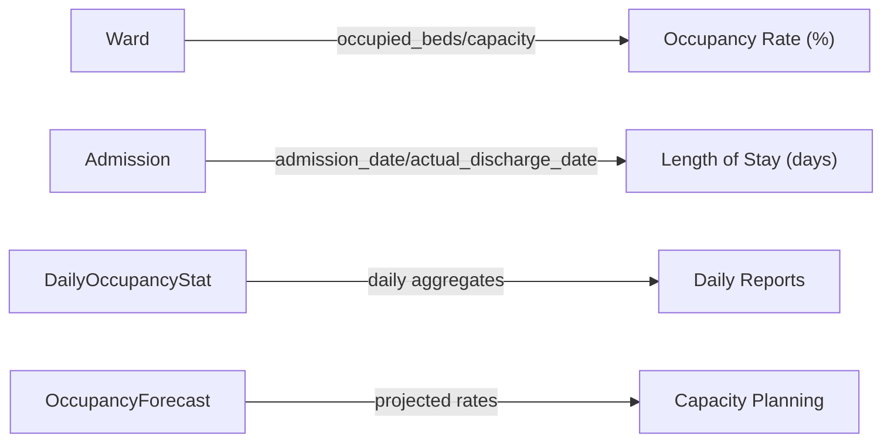
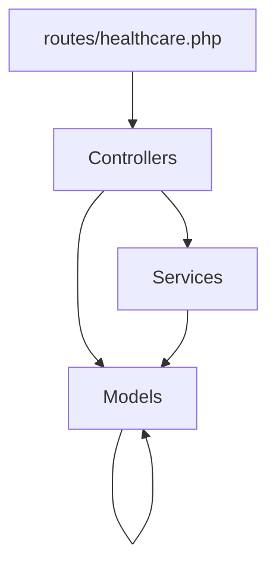

# Bed Management & Inpatient Operations

<cite>
**Referenced Files in This Document**
- [routes/healthcare.php](file://routes/healthcare.php)
- [app/Models/Bed.php](file://app/Models/Bed.php)
- [app/Models/Ward.php](file://app/Models/Ward.php)
- [app/Models/Admission.php](file://app/Models/Admission.php)
- [app/Models/Patient.php](file://app/Models/Patient.php)
- [app/Models/DailyOccupancyStat.php](file://app/Models/DailyOccupancyStat.php)
- [app/Models/OccupancyForecast.php](file://app/Models/OccupancyForecast.php)
- [app/Services/HousekeepingService.php](file://app/Services/HousekeepingService.php)
- [app/Services/OperatingRoomScheduler.php](file://app/Services/OperatingRoomScheduler.php)
- [app/Services/PatientService.php](file://app/Services/PatientService.php)
</cite>

## Table of Contents
1. [Introduction](#introduction)
2. [Project Structure](#project-structure)
3. [Core Components](#core-components)
4. [Architecture Overview](#architecture-overview)
5. [Detailed Component Analysis](#detailed-component-analysis)
6. [Dependency Analysis](#dependency-analysis)
7. [Performance Considerations](#performance-considerations)
8. [Troubleshooting Guide](#troubleshooting-guide)
9. [Conclusion](#conclusion)
10. [Appendices](#appendices)

## Introduction
This document describes the bed management and inpatient operations capabilities implemented in the healthcare module. It covers bed assignment algorithms, occupancy tracking, bed transfer procedures, admission/discharge workflows, room cleaning protocols, and bed availability reporting. It also documents integration points with nursing stations, patient monitoring systems, and the intensive care unit management via operating room scheduling. Specialized bed types (ICU, isolation, operating room preparation) are addressed alongside bed utilization analytics and capacity planning.

## Project Structure
The bed and inpatient domain spans models, services, and routing under the healthcare module. Key areas:
- Routing exposes administrative endpoints for wards, beds, admissions, rounds, occupancy dashboards, and bed management actions.
- Models define the domain entities: Bed, Ward, Admission, Patient, plus occupancy and forecasting analytics.
- Services encapsulate business logic for housekeeping, operating room scheduling, and patient management.

**Diagram sources**
- [routes/healthcare.php:135-161](file://routes/healthcare.php#L135-L161)
- [app/Models/Bed.php:1-195](file://app/Models/Bed.php#L1-L195)
- [app/Models/Ward.php:1-147](file://app/Models/Ward.php#L1-L147)
- [app/Models/Admission.php:1-284](file://app/Models/Admission.php#L1-L284)
- [app/Models/Patient.php:1-396](file://app/Models/Patient.php#L1-L396)
- [app/Models/DailyOccupancyStat.php:1-81](file://app/Models/DailyOccupancyStat.php#L1-L81)
- [app/Models/OccupancyForecast.php:1-79](file://app/Models/OccupancyForecast.php#L1-L79)
- [app/Services/HousekeepingService.php:1-276](file://app/Services/HousekeepingService.php#L1-L276)
- [app/Services/OperatingRoomScheduler.php:1-451](file://app/Services/OperatingRoomScheduler.php#L1-L451)
- [app/Services/PatientService.php:1-485](file://app/Services/PatientService.php#L1-L485)

**Section sources**
- [routes/healthcare.php:135-161](file://routes/healthcare.php#L135-L161)

## Core Components
- Bed model: Tracks availability, status, type, daily rate, current patient/admission linkage, and cleaning metadata. Provides scopes and helpers for availability and status.
- Ward model: Aggregates occupancy, capacity, and computed occupancy rate; provides scopes and relations to beds and admissions.
- Admission model: Manages admission lifecycle, length of stay calculation, discharge and transfer logic, and links to bed and patient.
- Patient model: Manages demographics, identifiers, insurance, and admission counts; integrates with visits and billing.
- HousekeepingService: Orchestrates room cleaning tasks, maintenance requests, and housekeeping reporting; indirectly impacts bed availability via room status transitions.
- OperatingRoomScheduler: Manages operating room scheduling, conflict detection, utilization logging, and equipment maintenance; indirectly affects bed availability during post-operative turnover.
- DailyOccupancyStat and OccupancyForecast: Provide occupancy metrics and projections for planning.

**Section sources**
- [app/Models/Bed.php:13-195](file://app/Models/Bed.php#L13-L195)
- [app/Models/Ward.php:13-147](file://app/Models/Ward.php#L13-L147)
- [app/Models/Admission.php:14-284](file://app/Models/Admission.php#L14-L284)
- [app/Models/Patient.php:14-396](file://app/Models/Patient.php#L14-L396)
- [app/Services/HousekeepingService.php:11-276](file://app/Services/HousekeepingService.php#L11-L276)
- [app/Services/OperatingRoomScheduler.php:13-451](file://app/Services/OperatingRoomScheduler.php#L13-L451)
- [app/Models/DailyOccupancyStat.php:17-81](file://app/Models/DailyOccupancyStat.php#L17-L81)
- [app/Models/OccupancyForecast.php:17-79](file://app/Models/OccupancyForecast.php#L17-L79)

## Architecture Overview
The bed management architecture centers around the Bed and Ward models, coordinated by Admission actions and supported by HousekeepingService and OperatingRoomScheduler. Routing exposes administrative endpoints for bed assignment, release, occupancy reporting, and admission workflows.

**Diagram sources**
- [app/Models/Bed.php:9-195](file://app/Models/Bed.php#L9-L195)
- [app/Models/Ward.php:9-147](file://app/Models/Ward.php#L9-L147)
- [app/Models/Admission.php:10-284](file://app/Models/Admission.php#L10-L284)
- [app/Models/Patient.php:10-396](file://app/Models/Patient.php#L10-L396)
- [app/Services/HousekeepingService.php:11-276](file://app/Services/HousekeepingService.php#L11-L276)
- [app/Services/OperatingRoomScheduler.php:13-451](file://app/Services/OperatingRoomScheduler.php#L13-L451)

## Detailed Component Analysis

### Bed Assignment Algorithms
Bed assignment is governed by the Bed model’s availability checks and status transitions, coordinated by admission workflows and housekeeping status updates.

- Availability filtering leverages Bed scopes (available, type, occupied, maintenance).
- Assignment updates Bed status and links to current patient/admission.
- Inter-unit transfers are handled by Admission.transfer, which releases the old bed and occupies a new one.

**Diagram sources**
- [app/Models/Bed.php:88-115](file://app/Models/Bed.php#L88-L115)
- [app/Models/Admission.php:238-264](file://app/Models/Admission.php#L238-L264)

**Section sources**
- [app/Models/Bed.php:88-115](file://app/Models/Bed.php#L88-L115)
- [app/Models/Admission.php:238-264](file://app/Models/Admission.php#L238-L264)

### Occupancy Tracking
Ward-level occupancy is computed from capacity and occupied_beds, with convenience attributes for occupancy rate and available beds. Admission events update occupancy counters.

- Admission.create sets admission_number and links to bed/patient.
- Bed.markAsOccupied updates status and current links.
- Ward.getOccupancyRateAttribute and getAvailableBedsAttribute provide real-time metrics.

**Diagram sources**
- [app/Models/Admission.php:60-90](file://app/Models/Admission.php#L60-L90)
- [app/Models/Bed.php:144-151](file://app/Models/Bed.php#L144-L151)
- [app/Models/Ward.php:44-59](file://app/Models/Ward.php#L44-L59)

**Section sources**
- [app/Models/Ward.php:44-59](file://app/Models/Ward.php#L44-L59)
- [app/Models/Admission.php:60-90](file://app/Models/Admission.php#L60-L90)

### Bed Transfer Procedures Between Units
Inter-unit transfers are executed atomically via Admission.transfer, ensuring bed release and reassignment.

- Atomic transaction ensures consistency.
- Bed status transitions maintain accurate occupancy.

**Diagram sources**
- [app/Models/Admission.php:238-264](file://app/Models/Admission.php#L238-L264)
- [app/Models/Bed.php:144-151](file://app/Models/Bed.php#L144-L151)

**Section sources**
- [app/Models/Admission.php:238-264](file://app/Models/Admission.php#L238-L264)

### Admission and Discharge Workflows
Admission creation generates unique admission numbers and links to bed/patient. Discharge releases the bed and updates admission status.

- Unique admission_number follows a date-based pattern.
- Discharge clears bed occupancy and captures discharge metadata.

**Diagram sources**
- [app/Models/Admission.php:73-90](file://app/Models/Admission.php#L73-L90)
- [app/Models/Admission.php:210-233](file://app/Models/Admission.php#L210-L233)
- [app/Models/Bed.php:156-165](file://app/Models/Bed.php#L156-L165)

**Section sources**
- [app/Models/Admission.php:73-90](file://app/Models/Admission.php#L73-L90)
- [app/Models/Admission.php:210-233](file://app/Models/Admission.php#L210-L233)

### Room Cleaning Protocols and Bed Availability
HousekeepingService manages cleaning tasks and maintenance, impacting room status and indirectly bed availability.

- Tasks increment daily cleaning counts and trigger status transitions.
- Maintenance requests can mark rooms out-of-order, temporarily blocking bed availability.

**Diagram sources**
- [app/Services/HousekeepingService.php:60-165](file://app/Services/HousekeepingService.php#L60-L165)

**Section sources**
- [app/Services/HousekeepingService.php:60-165](file://app/Services/HousekeepingService.php#L60-L165)

### Integration with Nursing Stations and Monitoring Systems
- Ward model includes head nurse and supervising doctor relations, supporting nursing station coordination.
- Admission tracks admitting doctor and treatment plans, enabling monitoring system integration for clinical workflows.

**Section sources**
- [app/Models/Ward.php:112-123](file://app/Models/Ward.php#L112-L123)
- [app/Models/Admission.php:176-189](file://app/Models/Admission.php#L176-L189)

### Intensive Care Unit Management and Operating Room Preparation
- OperatingRoomScheduler coordinates ICU/OP room scheduling, conflict detection, and utilization analytics.
- Post-operative completion triggers OR status to “cleaning,” aligning with bed turnover expectations.

**Diagram sources**
- [app/Services/OperatingRoomScheduler.php:18-83](file://app/Services/OperatingRoomScheduler.php#L18-L83)
- [app/Services/OperatingRoomScheduler.php:178-247](file://app/Services/OperatingRoomScheduler.php#L178-L247)

**Section sources**
- [app/Services/OperatingRoomScheduler.php:18-83](file://app/Services/OperatingRoomScheduler.php#L18-L83)
- [app/Services/OperatingRoomScheduler.php:178-247](file://app/Services/OperatingRoomScheduler.php#L178-L247)

### Emergency Bed Assignments
- Admission.create handles automatic admission number generation for emergency admissions.
- Inter-unit transfer enables rapid bed reallocation when local capacity is insufficient.

**Section sources**
- [app/Models/Admission.php:73-90](file://app/Models/Admission.php#L73-L90)
- [app/Models/Admission.php:238-264](file://app/Models/Admission.php#L238-L264)

### Bed Utilization Rates, Length of Stay Metrics, Capacity Planning
- Ward.getOccupancyRateAttribute computes occupancy percentage from capacity and occupied_beds.
- Admission.getLengthOfStayAttribute calculates length of stay in days.
- DailyOccupancyStat and OccupancyForecast support historical reporting and projections.

**Diagram sources**
- [app/Models/Ward.php:44-51](file://app/Models/Ward.php#L44-L51)
- [app/Models/Admission.php:95-99](file://app/Models/Admission.php#L95-L99)
- [app/Models/DailyOccupancyStat.php:59-68](file://app/Models/DailyOccupancyStat.php#L59-L68)
- [app/Models/OccupancyForecast.php:59-77](file://app/Models/OccupancyForecast.php#L59-L77)

**Section sources**
- [app/Models/Ward.php:44-51](file://app/Models/Ward.php#L44-L51)
- [app/Models/Admission.php:95-99](file://app/Models/Admission.php#L95-L99)
- [app/Models/DailyOccupancyStat.php:59-68](file://app/Models/DailyOccupancyStat.php#L59-L68)
- [app/Models/OccupancyForecast.php:59-77](file://app/Models/OccupancyForecast.php#L59-L77)

### Specialized Bed Types
- Bed.getBedTypeLabelAttribute maps internal types (e.g., ICU, NICU, isolation) to human-readable labels.
- Admission tracks isolation flag to support infection control protocols.

**Section sources**
- [app/Models/Bed.php:53-67](file://app/Models/Bed.php#L53-L67)
- [app/Models/Admission.php:168-173](file://app/Models/Admission.php#L168-L173)

## Dependency Analysis
The bed management domain exhibits clear separation of concerns:
- Controllers route administrative actions for inpatient and bed management.
- Models encapsulate domain logic and relationships.
- Services orchestrate cross-cutting operations (housekeeping, OR scheduling, patient management).

**Diagram sources**
- [routes/healthcare.php:135-161](file://routes/healthcare.php#L135-L161)

**Section sources**
- [routes/healthcare.php:135-161](file://routes/healthcare.php#L135-L161)

## Performance Considerations
- Use Bed scopes (available, type, occupied, maintenance) to minimize database queries when selecting candidates.
- Prefer atomic transactions for admission transfer and discharge to avoid inconsistent states.
- Cache occupancy metrics at the ward level to reduce repeated calculations.
- Index admission_date, expected_discharge_date, and status for efficient reporting queries.

## Troubleshooting Guide
Common issues and resolutions:
- Bed not appearing available: Verify Bed.status and Bed.current_admission_id; ensure discharge cleared the bed.
- Inter-unit transfer fails: Confirm atomic transaction boundaries and that old/new beds exist.
- Occupancy rate anomalies: Check Ward.capacity and Ward.occupied_beds updates after admission/discharge.
- Cleaning task not completing: Ensure HousekeepingService.completeTask updates room status and checklist entries.

**Section sources**
- [app/Models/Bed.php:144-165](file://app/Models/Bed.php#L144-L165)
- [app/Models/Admission.php:238-264](file://app/Models/Admission.php#L238-L264)
- [app/Models/Ward.php:44-59](file://app/Models/Ward.php#L44-L59)
- [app/Services/HousekeepingService.php:140-165](file://app/Services/HousekeepingService.php#L140-L165)

## Conclusion
The bed management and inpatient operations implementation provides robust primitives for bed assignment, occupancy tracking, inter-unit transfers, and discharge workflows. Integrated housekeeping and operating room scheduling support timely bed turnover and capacity planning. Extending these foundations with real-time monitoring and predictive analytics can further enhance operational efficiency.

## Appendices
- Administrative endpoints for bed management and inpatient workflows are defined in the healthcare routes file.

**Section sources**
- [routes/healthcare.php:135-161](file://routes/healthcare.php#L135-L161)