# Electronic Medical Record System

<cite>
**Referenced Files in This Document**
- [PatientMedicalRecord.php](file://app/Models/PatientMedicalRecord.php)
- [Patient.php](file://app/Models/Patient.php)
- [Diagnosis.php](file://app/Models/Diagnosis.php)
- [Prescription.php](file://app/Models/Prescription.php)
- [PatientAllergy.php](file://app/Models/PatientAllergy.php)
- [Medicine.php](file://app/Models/Medicine.php)
- [PatientVisit.php](file://app/Models/PatientVisit.php)
- [RadiologyExam.php](file://app/Models/RadiologyExam.php)
- [LabResult.php](file://app/Models/LabResult.php)
- [HealthcareIntegrationService.php](file://app/Services/HealthcareIntegrationService.php)
- [PatientService.php](file://app/Services/PatientService.php)
- [MedicalBillingService.php](file://app/Services/MedicalBillingService.php)
- [RadiologyService.php](file://app/Services/RadiologyService.php)
- [LaboratoryService.php](file://app/Services/LaboratoryService.php)
</cite>

## Table of Contents
1. [Introduction](#introduction)
2. [Project Structure](#project-structure)
3. [Core Components](#core-components)
4. [Architecture Overview](#architecture-overview)
5. [Detailed Component Analysis](#detailed-component-analysis)
6. [Dependency Analysis](#dependency-analysis)
7. [Performance Considerations](#performance-considerations)
8. [Troubleshooting Guide](#troubleshooting-guide)
9. [Conclusion](#conclusion)
10. [Appendices](#appendices)

## Introduction
This document describes the Electronic Medical Record (EMR) system built with Laravel, focusing on patient demographics, medical history, diagnoses, medications, allergies, immunizations, vital signs, and clinical workflows. It documents the EMR data model, validation rules, data integrity constraints, integration with HL7 FHIR standards, medical imaging integration, clinical decision support, privacy controls, audit trails, secure data sharing, provider interfaces, mobile access, and external system integrations.

## Project Structure
The EMR system is organized around domain-focused models and services:
- Models define the data schema and relationships for patients, visits, medical records, diagnoses, prescriptions, allergies, medicines, radiology, and laboratory results.
- Services encapsulate business logic for patient registration, billing, radiology, laboratory, and healthcare integrations.
- Healthcare integration service supports HL7/FHIR messaging, BPJS claims, lab equipment integration, and notifications.

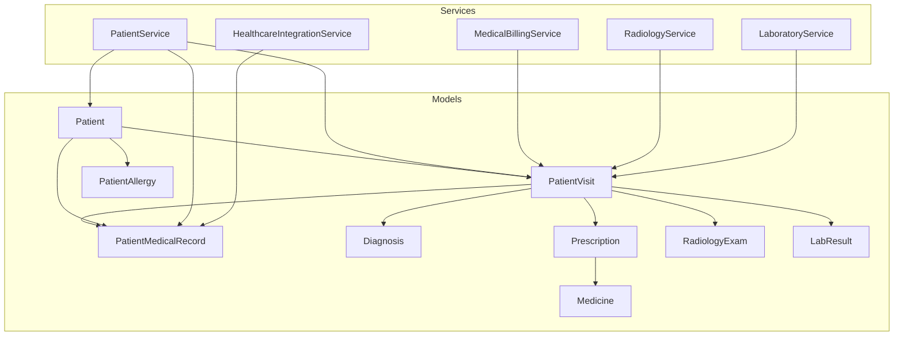

**Diagram sources**
- [Patient.php:10-396](file://app/Models/Patient.php#L10-L396)
- [PatientVisit.php:9-306](file://app/Models/PatientVisit.php#L9-L306)
- [PatientMedicalRecord.php:9-274](file://app/Models/PatientMedicalRecord.php#L9-L274)
- [Diagnosis.php:9-115](file://app/Models/Diagnosis.php#L9-L115)
- [Prescription.php:9-201](file://app/Models/Prescription.php#L9-L201)
- [PatientAllergy.php:8-130](file://app/Models/PatientAllergy.php#L8-L130)
- [Medicine.php:9-189](file://app/Models/Medicine.php#L9-L189)
- [RadiologyExam.php:8-116](file://app/Models/RadiologyExam.php#L8-L116)
- [LabResult.php:9-72](file://app/Models/LabResult.php#L9-L72)
- [PatientService.php:15-485](file://app/Services/PatientService.php#L15-L485)
- [MedicalBillingService.php:15-563](file://app/Services/MedicalBillingService.php#L15-L563)
- [RadiologyService.php:13-320](file://app/Services/RadiologyService.php#L13-L320)
- [LaboratoryService.php:13-509](file://app/Services/LaboratoryService.php#L13-L509)
- [HealthcareIntegrationService.php:15-591](file://app/Services/HealthcareIntegrationService.php#L15-L591)

**Section sources**
- [Patient.php:10-396](file://app/Models/Patient.php#L10-L396)
- [PatientVisit.php:9-306](file://app/Models/PatientVisit.php#L9-L306)
- [PatientMedicalRecord.php:9-274](file://app/Models/PatientMedicalRecord.php#L9-L274)
- [Diagnosis.php:9-115](file://app/Models/Diagnosis.php#L9-L115)
- [Prescription.php:9-201](file://app/Models/Prescription.php#L9-L201)
- [PatientAllergy.php:8-130](file://app/Models/PatientAllergy.php#L8-L130)
- [Medicine.php:9-189](file://app/Models/Medicine.php#L9-L189)
- [RadiologyExam.php:8-116](file://app/Models/RadiologyExam.php#L8-L116)
- [LabResult.php:9-72](file://app/Models/LabResult.php#L9-L72)
- [PatientService.php:15-485](file://app/Services/PatientService.php#L15-L485)
- [MedicalBillingService.php:15-563](file://app/Services/MedicalBillingService.php#L15-L563)
- [RadiologyService.php:13-320](file://app/Services/RadiologyService.php#L13-L320)
- [LaboratoryService.php:13-509](file://app/Services/LaboratoryService.php#L13-L509)
- [HealthcareIntegrationService.php:15-591](file://app/Services/HealthcareIntegrationService.php#L15-L591)

## Core Components
- Patient demographics and master data: managed by the Patient model with auto-generated MRN, QR code, and demographic fields.
- Visit lifecycle: PatientVisit tracks encounter details, status, queues, and durations.
- Medical record: PatientMedicalRecord captures chief complaint, history, vitals, examination, diagnosis, treatment, and follow-up.
- Diagnoses: Diagnosis model stores ICD-10 codes, types, statuses, and priorities.
- Prescriptions: Prescription manages medication orders, validity, dispensing, and status.
- Allergies: PatientAllergy tracks allergens, severity, reactions, verification, and activity.
- Medicines: Medicine model includes ATC classification, pricing, inventory, and stock thresholds.
- Radiology: RadiologyExam catalogs procedures; RadiologyService orchestrates orders, scheduling, reporting, and PACS integration.
- Laboratory: LaboratoryService manages sample collection, processing, QC, critical value alerts, and verification.
- Integrations: HealthcareIntegrationService handles HL7/FHIR messages, BPJS claims, lab equipment import, pharmacy e-prescription, and notifications.

**Section sources**
- [Patient.php:14-73](file://app/Models/Patient.php#L14-L73)
- [PatientVisit.php:13-58](file://app/Models/PatientVisit.php#L13-L58)
- [PatientMedicalRecord.php:13-49](file://app/Models/PatientMedicalRecord.php#L13-L49)
- [Diagnosis.php:13-27](file://app/Models/Diagnosis.php#L13-L27)
- [Prescription.php:13-35](file://app/Models/Prescription.php#L13-L35)
- [PatientAllergy.php:12-31](file://app/Models/PatientAllergy.php#L12-L31)
- [Medicine.php:13-56](file://app/Models/Medicine.php#L13-L56)
- [RadiologyExam.php:12-44](file://app/Models/RadiologyExam.php#L12-L44)
- [HealthcareIntegrationService.php:15-591](file://app/Services/HealthcareIntegrationService.php#L15-L591)

## Architecture Overview
The EMR follows a layered architecture:
- Data layer: Eloquent models with fillable and cast attributes ensuring data integrity.
- Service layer: Business logic encapsulated in dedicated services for patient, billing, radiology, laboratory, and integration.
- Integration layer: HL7/FHIR messaging, BPJS claims, lab equipment, and notifications.
- UI layer: Provider interfaces and mobile access supported by responsive design and APIs.

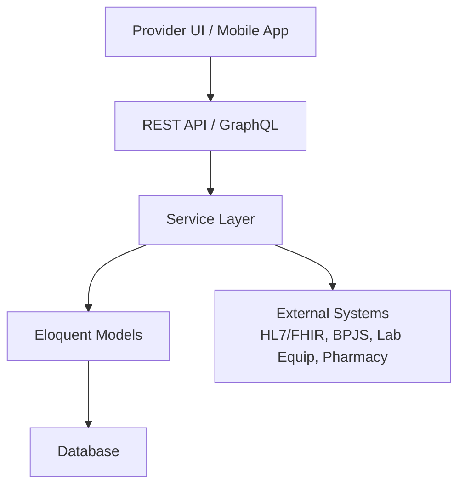

[No sources needed since this diagram shows conceptual workflow, not actual code structure]

## Detailed Component Analysis

### Patient Demographics and Master Data
- Auto-generation of MRN and QR code during creation.
- Demographic fields include personal info, contact, emergency contacts, and insurance metadata.
- Utility getters for full address, age, formatted blood type, insurance status, and patient category.
- Scopes for active status, search, blood type, allergies, chronic conditions, and age ranges.
- Relations to visits, appointments, medical records, allergies, insurances, prescriptions, labs, admissions, and bills.

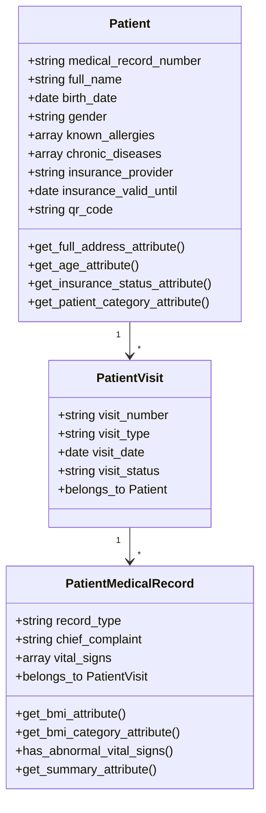

**Diagram sources**
- [Patient.php:14-73](file://app/Models/Patient.php#L14-L73)
- [PatientVisit.php:13-58](file://app/Models/PatientVisit.php#L13-L58)
- [PatientMedicalRecord.php:13-49](file://app/Models/PatientMedicalRecord.php#L13-L49)

**Section sources**
- [Patient.php:75-112](file://app/Models/Patient.php#L75-L112)
- [Patient.php:117-130](file://app/Models/Patient.php#L117-L130)
- [Patient.php:135-138](file://app/Models/Patient.php#L135-L138)
- [Patient.php:179-190](file://app/Models/Patient.php#L179-L190)
- [Patient.php:195-212](file://app/Models/Patient.php#L195-L212)
- [Patient.php:217-270](file://app/Models/Patient.php#L217-L270)
- [Patient.php:291-358](file://app/Models/Patient.php#L291-L358)

### Medical History and Vital Signs
- Medical history fields include past medical history, family history, social history, and physical examination findings.
- Vital signs stored as an array with computed BMI and categories; abnormal vitals detection with lists of deviations.
- Scopes for follow-ups, emergencies, completion status, and date ranges.
- Relations to patient, doctor, and visit; helper methods for completion and signature checks.

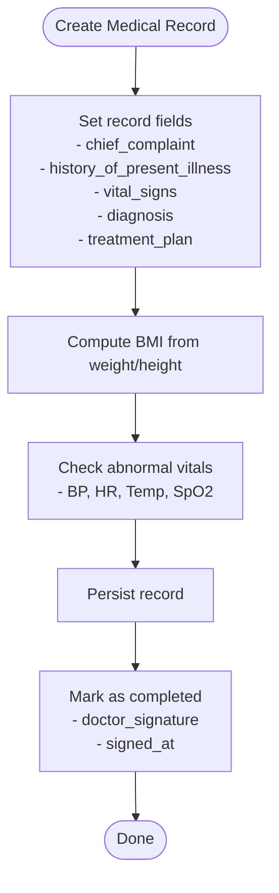

**Diagram sources**
- [PatientMedicalRecord.php:54-168](file://app/Models/PatientMedicalRecord.php#L54-L168)
- [PatientMedicalRecord.php:240-255](file://app/Models/PatientMedicalRecord.php#L240-L255)

**Section sources**
- [PatientMedicalRecord.php:13-49](file://app/Models/PatientMedicalRecord.php#L13-L49)
- [PatientMedicalRecord.php:54-90](file://app/Models/PatientMedicalRecord.php#L54-L90)
- [PatientMedicalRecord.php:95-138](file://app/Models/PatientMedicalRecord.php#L95-L138)
- [PatientMedicalRecord.php:173-211](file://app/Models/PatientMedicalRecord.php#L173-L211)
- [PatientMedicalRecord.php:216-235](file://app/Models/PatientMedicalRecord.php#L216-L235)
- [PatientMedicalRecord.php:240-255](file://app/Models/PatientMedicalRecord.php#L240-L255)

### Diagnoses and ICD-10 Management
- Stores ICD-10 code and description, diagnosis type, status, priority, and notes.
- Labels for diagnosis type and status; scopes for primary, confirmed, and by code.
- Relations to visit, doctor, and patient via hasOneThrough.

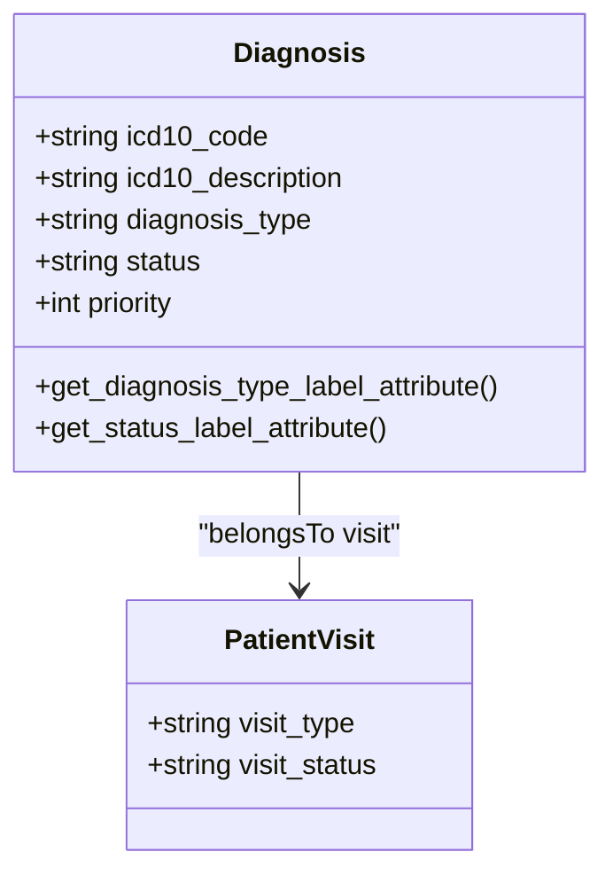

**Diagram sources**
- [Diagnosis.php:13-57](file://app/Models/Diagnosis.php#L13-L57)
- [Diagnosis.php:86-105](file://app/Models/Diagnosis.php#L86-L105)

**Section sources**
- [Diagnosis.php:13-57](file://app/Models/Diagnosis.php#L13-L57)
- [Diagnosis.php:62-81](file://app/Models/Diagnosis.php#L62-L81)
- [Diagnosis.php:86-105](file://app/Models/Diagnosis.php#L86-L105)

### Prescriptions and Medications
- Unique prescription numbering; validity period; dispensing tracking; status management.
- Items relationship; scopes for active, pending dispensing, by patient, and by doctor.
- Relations to visit, patient, doctor, and dispensed-by user.

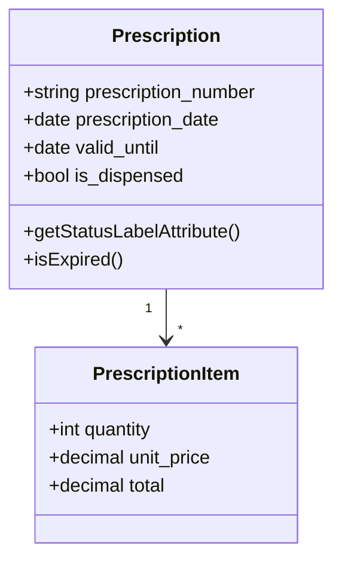

**Diagram sources**
- [Prescription.php:13-96](file://app/Models/Prescription.php#L13-L96)
- [Prescription.php:166-169](file://app/Models/Prescription.php#L166-L169)

**Section sources**
- [Prescription.php:37-67](file://app/Models/Prescription.php#L37-L67)
- [Prescription.php:72-80](file://app/Models/Prescription.php#L72-L80)
- [Prescription.php:85-96](file://app/Models/Prescription.php#L85-L96)
- [Prescription.php:101-121](file://app/Models/Prescription.php#L101-L121)
- [Prescription.php:134-153](file://app/Models/Prescription.php#L134-L153)
- [Prescription.php:166-182](file://app/Models/Prescription.php#L166-L182)

### Allergies and Immunizations
- Allergy records track allergen, type, severity, reaction, treatment, verification, and activity.
- Severity and allergen type labels; scopes for active, severe, verified, and search.
- Relations to patient and diagnosed-by user.

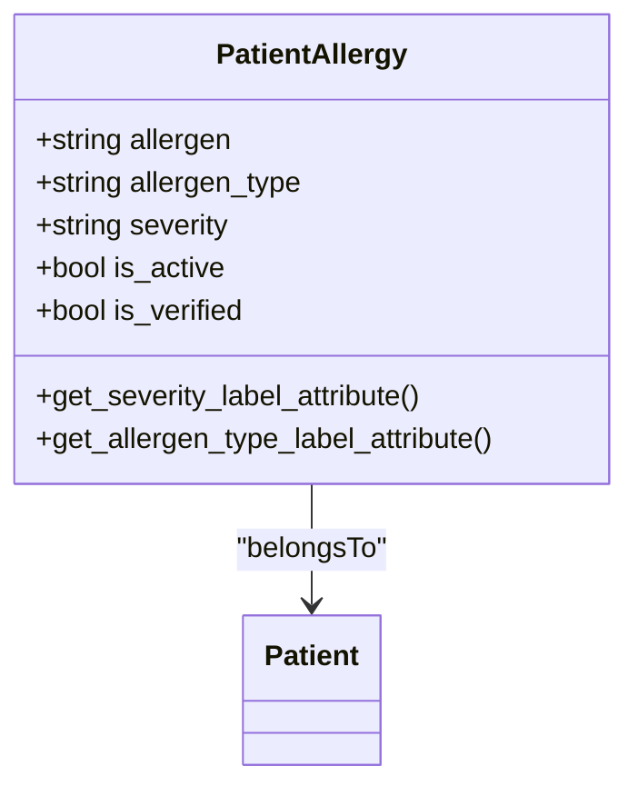

**Diagram sources**
- [PatientAllergy.php:12-61](file://app/Models/PatientAllergy.php#L12-L61)
- [PatientAllergy.php:98-109](file://app/Models/PatientAllergy.php#L98-L109)

**Section sources**
- [PatientAllergy.php:27-61](file://app/Models/PatientAllergy.php#L27-L61)
- [PatientAllergy.php:66-85](file://app/Models/PatientAllergy.php#L66-L85)
- [PatientAllergy.php:98-128](file://app/Models/PatientAllergy.php#L98-L128)

### Medical Imaging Integration (Radiology)
- RadiologyExam catalog defines modalities, body parts, pricing, and preparation.
- RadiologyService manages order creation, scheduling, exam execution, reporting, verification, and PACS integration.
- Dashboard metrics for orders, scheduled, in-progress, completed, pending reports, STAT exams, and modality counts.

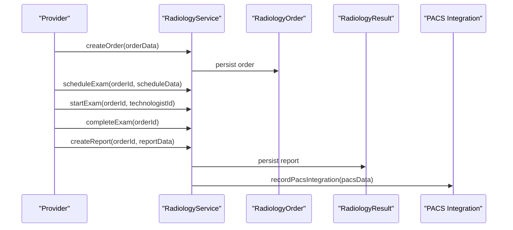

**Diagram sources**
- [RadiologyService.php:18-150](file://app/Services/RadiologyService.php#L18-L150)
- [RadiologyService.php:175-211](file://app/Services/RadiologyService.php#L175-L211)

**Section sources**
- [RadiologyExam.php:12-44](file://app/Models/RadiologyExam.php#L12-L44)
- [RadiologyService.php:18-150](file://app/Services/RadiologyService.php#L18-L150)
- [RadiologyService.php:175-211](file://app/Services/RadiologyService.php#L175-L211)
- [RadiologyService.php:254-274](file://app/Services/RadiologyService.php#L254-L274)

### Laboratory Integration and Critical Value Management
- LaboratoryService orchestrates sample collection, reception, processing, QC, result entry, verification, and critical value alerts.
- Determines abnormal flags based on reference ranges; escalates critical values with notifications and audit logs.
- Dashboard metrics for samples collected/completed, pending verification, critical results, equipment operational, and QC status.

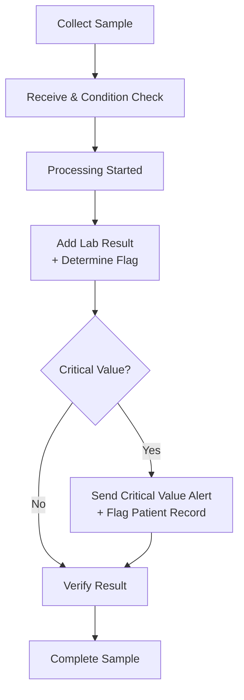

**Diagram sources**
- [LaboratoryService.php:18-134](file://app/Services/LaboratoryService.php#L18-L134)
- [LaboratoryService.php:322-339](file://app/Services/LaboratoryService.php#L322-L339)
- [LaboratoryService.php:489-507](file://app/Services/LaboratoryService.php#L489-L507)

**Section sources**
- [LaboratoryService.php:18-134](file://app/Services/LaboratoryService.php#L18-L134)
- [LaboratoryService.php:288-317](file://app/Services/LaboratoryService.php#L288-L317)
- [LaboratoryService.php:322-339](file://app/Services/LaboratoryService.php#L322-L339)
- [LaboratoryService.php:344-384](file://app/Services/LaboratoryService.php#L344-L384)
- [LaboratoryService.php:389-417](file://app/Services/LaboratoryService.php#L389-L417)
- [LaboratoryService.php:489-507](file://app/Services/LaboratoryService.php#L489-L507)

### HL7/FHIR Integration and Secure Data Sharing
- HealthcareIntegrationService supports outbound/inbound HL7 messages, message parsing, processing, acknowledgments, and status tracking.
- Integrations include BPJS claim submission and eligibility checks, lab equipment registration and result import, pharmacy e-prescription, and multi-channel notifications (SMS, WhatsApp, Email).
- Message IDs, claim numbers, notification numbers, and transaction numbers are auto-generated with date prefixes.

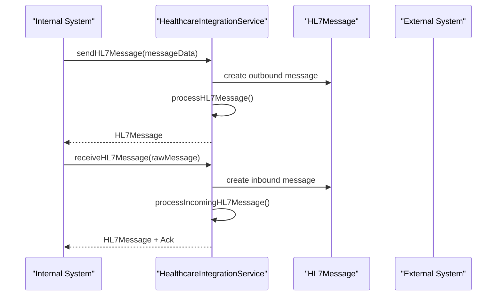

**Diagram sources**
- [HealthcareIntegrationService.php:20-104](file://app/Services/HealthcareIntegrationService.php#L20-L104)
- [HealthcareIntegrationService.php:446-488](file://app/Services/HealthcareIntegrationService.php#L446-L488)

**Section sources**
- [HealthcareIntegrationService.php:20-63](file://app/Services/HealthcareIntegrationService.php#L20-L63)
- [HealthcareIntegrationService.php:68-104](file://app/Services/HealthcareIntegrationService.php#L68-L104)
- [HealthcareIntegrationService.php:446-488](file://app/Services/HealthcareIntegrationService.php#L446-L488)
- [HealthcareIntegrationService.php:490-515](file://app/Services/HealthcareIntegrationService.php#L490-L515)

### Patient Portal, Mobile Access, and Provider Interfaces
- PatientService provides search, retrieval, updates, QR code generation, timeline aggregation, and statistics.
- Mobile optimization and responsive design are supported by UI/UX guidelines in the repository.
- Provider interfaces leverage Laravel backend with REST/GraphQL APIs for desktop and mobile consumption.

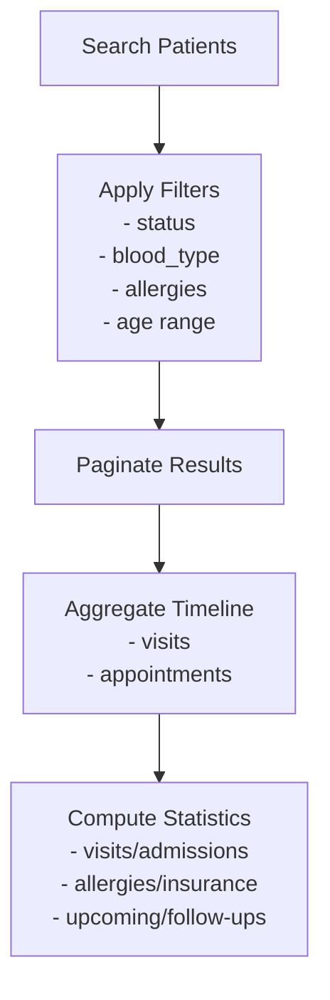

**Diagram sources**
- [PatientService.php:139-178](file://app/Services/PatientService.php#L139-L178)
- [PatientService.php:381-419](file://app/Services/PatientService.php#L381-L419)
- [PatientService.php:341-355](file://app/Services/PatientService.php#L341-L355)

**Section sources**
- [PatientService.php:139-178](file://app/Services/PatientService.php#L139-L178)
- [PatientService.php:381-419](file://app/Services/PatientService.php#L381-L419)
- [PatientService.php:341-355](file://app/Services/PatientService.php#L341-L355)

### Billing, Claims, and Financial Workflows
- MedicalBillingService generates bills, adds items, finalizes, creates insurance claims, submits to insurers, processes adjudications, collects copays, and sets up payment plans.
- Supports aging reports, dashboard metrics, and number generation with date prefixes.

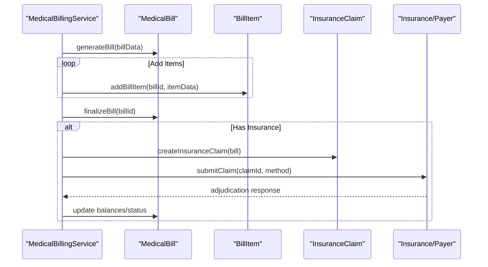

**Diagram sources**
- [MedicalBillingService.php:20-107](file://app/Services/MedicalBillingService.php#L20-L107)
- [MedicalBillingService.php:112-132](file://app/Services/MedicalBillingService.php#L112-L132)
- [MedicalBillingService.php:137-171](file://app/Services/MedicalBillingService.php#L137-L171)
- [MedicalBillingService.php:176-224](file://app/Services/MedicalBillingService.php#L176-L224)

**Section sources**
- [MedicalBillingService.php:20-107](file://app/Services/MedicalBillingService.php#L20-L107)
- [MedicalBillingService.php:112-132](file://app/Services/MedicalBillingService.php#L112-L132)
- [MedicalBillingService.php:176-224](file://app/Services/MedicalBillingService.php#L176-L224)
- [MedicalBillingService.php:349-362](file://app/Services/MedicalBillingService.php#L349-L362)

## Dependency Analysis
- Cohesion: Services encapsulate cohesive business domains (patient, billing, radiology, lab, integration).
- Coupling: Models are loosely coupled via relations; services depend on models and each other minimally.
- External dependencies: HL7/FHIR messaging, BPJS API, lab equipment APIs, and notification gateways.
- Integrity: Fillable arrays and casts enforce field constraints; scopes and helper methods maintain data consistency.

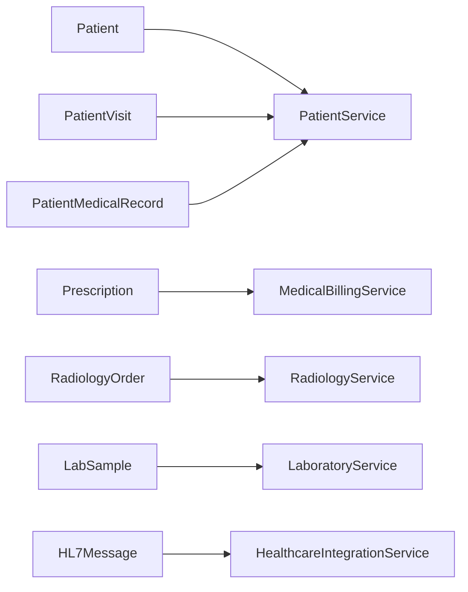

**Diagram sources**
- [Patient.php:291-358](file://app/Models/Patient.php#L291-L358)
- [PatientVisit.php:248-259](file://app/Models/PatientVisit.php#L248-L259)
- [PatientMedicalRecord.php:216-235](file://app/Models/PatientMedicalRecord.php#L216-L235)
- [Prescription.php:134-153](file://app/Models/Prescription.php#L134-L153)
- [RadiologyService.php:18-49](file://app/Services/RadiologyService.php#L18-L49)
- [LaboratoryService.php:18-40](file://app/Services/LaboratoryService.php#L18-L40)
- [HealthcareIntegrationService.php:20-63](file://app/Services/HealthcareIntegrationService.php#L20-L63)

**Section sources**
- [Patient.php:291-358](file://app/Models/Patient.php#L291-L358)
- [PatientVisit.php:248-259](file://app/Models/PatientVisit.php#L248-L259)
- [PatientMedicalRecord.php:216-235](file://app/Models/PatientMedicalRecord.php#L216-L235)
- [Prescription.php:134-153](file://app/Models/Prescription.php#L134-L153)
- [RadiologyService.php:18-49](file://app/Services/RadiologyService.php#L18-L49)
- [LaboratoryService.php:18-40](file://app/Services/LaboratoryService.php#L18-L40)
- [HealthcareIntegrationService.php:20-63](file://app/Services/HealthcareIntegrationService.php#L20-L63)

## Performance Considerations
- Use eager loading for relationships in listings (e.g., PatientService default relations).
- Index frequently filtered columns (status, date ranges, MRN, NIK, visit_date).
- Batch imports for lab results and radiology reports to reduce transaction overhead.
- Asynchronous jobs for notifications and integration retries.
- Pagination for large datasets (search, billing, radiology dashboards).

[No sources needed since this section provides general guidance]

## Troubleshooting Guide
- HL7 message failures: Check parsed data, direction, and status updates; review error logs and acknowledgments.
- Critical lab values: Verify escalation jobs, notification delivery, and audit trail entries.
- Equipment calibration: Monitor due dates and status transitions; prevent testing when out-of-control.
- BPJS eligibility/claims: Validate signatures, timestamps, and API responses; handle retry logic.

**Section sources**
- [HealthcareIntegrationService.php:49-59](file://app/Services/HealthcareIntegrationService.php#L49-L59)
- [LaboratoryService.php:322-339](file://app/Services/LaboratoryService.php#L322-L339)
- [LaboratoryService.php:431-434](file://app/Services/LaboratoryService.php#L431-L434)
- [HealthcareIntegrationService.php:165-191](file://app/Services/HealthcareIntegrationService.php#L165-L191)

## Conclusion
The EMR system provides a robust foundation for managing patient demographics, encounters, medical records, diagnoses, prescriptions, allergies, radiology, and laboratory workflows. It integrates with HL7/FHIR, supports BPJS claims, automates critical value alerts, and offers scalable services for billing and imaging. Privacy, audit trails, and secure data sharing are addressed through structured models, service transactions, and integration logging.

## Appendices
- Field validation and casting are enforced via model fillable arrays and casts.
- Number generation follows date-prefixed sequences for HL7 messages, claims, notifications, prescriptions, bills, and radiology items.
- Clinical decision support is embedded through vital sign analysis, critical value thresholds, and abnormal detection helpers.

**Section sources**
- [PatientMedicalRecord.php:43-49](file://app/Models/PatientMedicalRecord.php#L43-L49)
- [Patient.php:65-73](file://app/Models/Patient.php#L65-L73)
- [Prescription.php:30-35](file://app/Models/Prescription.php#L30-L35)
- [HealthcareIntegrationService.php:390-422](file://app/Services/HealthcareIntegrationService.php#L390-L422)
- [HealthcareIntegrationService.php:424-444](file://app/Services/HealthcareIntegrationService.php#L424-L444)
- [HealthcareIntegrationService.php:441-444](file://app/Services/HealthcareIntegrationService.php#L441-L444)
- [RadiologyService.php:279-296](file://app/Services/RadiologyService.php#L279-L296)
- [RadiologyService.php:301-318](file://app/Services/RadiologyService.php#L301-L318)